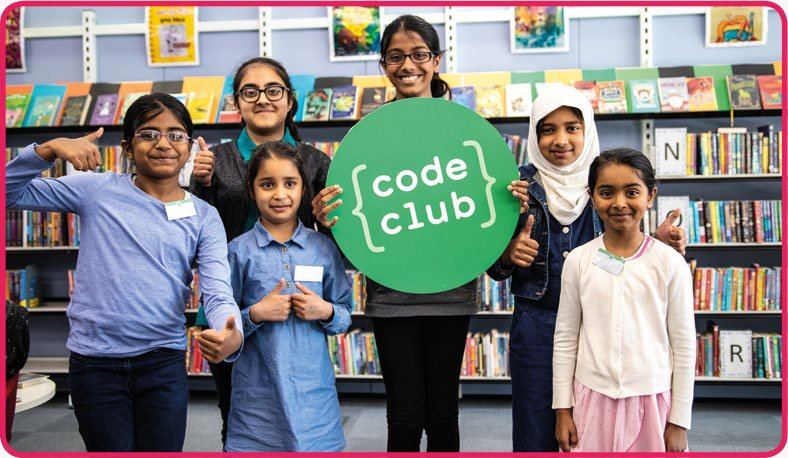
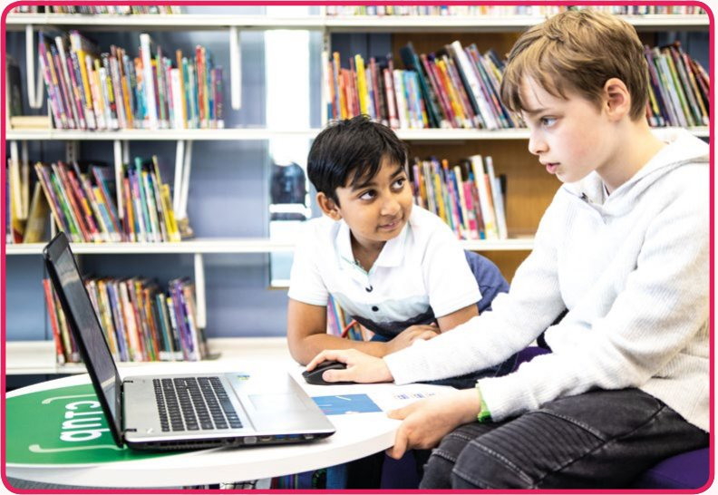

# Capitolul 1 – Bun venit!

> *Bun venit la prima carte Code Club!*

Code Club este o mișcare de cluburi de programare gratuite și distractive, care se întâlnesc în peste 150 de țări din toată lumea. La Code Club, sute de mii de tineri, exact ca tine, învață să creeze cu ajutorul tehnologiei și și-au făcut propriile jocuri, animații, site-uri web și multe altele.

Ca să faci un calculator să facă ce vrei tu, trebuie să îi dai instrucțiuni într-un limbaj pe care îl înțelege. Crearea acestor instrucțiuni se numește programare (în engleză, *coding*).

În această carte îți arătăm cum să folosești un limbaj de programare numit Scratch, care folosește blocuri ca să îi spună calculatorului ce să facă. Fiecare bloc conține o instrucțiune pe care calculatorul o înțelege. Pui blocurile împreună ca să îți faci programul. Simplu.

Programarea în Scratch este un mod grozav de a învăța să programezi. Și e foarte creativă. Poți să îți creezi propriile personaje și fundaluri, ca proiectul tău să fie unic. Poți remixa și schimba proiecte existente. De exemplu, poți face un joc mai greu, accelerând lucrurile, sau mai ușor, încetinindu-le. Posibilitățile sunt nelimitate.

În fiecare capitol vei găsi instrucțiuni pentru a construi un proiect grozav în Scratch. Robotul nostru prietenos de la Code Club te va ghida și îți va da câteva sfaturi utile. Există căsuțe de bifat, ca să îți urmărești progresul (ne plac la nebunie căsuțele de bifat), și poți să te bați mândru pe umăr când termini fiecare proiect.

Am inclus și o mulțime de provocări, ca să îți schimbi și să îți personalizezi proiectele, și o grămadă de idei care să te inspire să creezi ceva nou, folosind abilitățile de programare pe care le înveți.

Programarea poate fi grea, și chiar și cei mai buni informaticieni din lume se blochează uneori. De aceea am inclus câteva indicii speciale, tipărite cu susul în jos în cartea originală, pe care le poți folosi dacă te-ai împotmolit de tot. De folosit doar în caz de urgență!

> **NOTA TRADUCĂTORULUI**
> În această traducere, indiciile „cu susul în jos” sunt ascunse în casete pe care le poți deschide cu un clic, marcate cu **INDICIU**. Încearcă mai întâi singur, și abia apoi apasă pe ele!

După ce ai terminat proiectele din această carte, poți găsi o mulțime de alte idei de proiecte distractive pe site-ul nostru: [rpf.io/ccprojects](https://rpf.io/ccprojects).

Ai putea, de asemenea, să îi ceri profesorului tău să înființeze un Code Club în școala ta, folosind scrisoarea de mai jos. Nu uita să o semnezi și să completezi spațiul lăsat liber, ca să îi spui profesorului de ce îți place să programezi!

Sper din tot sufletul că îți va plăcea această carte și abia aștept să văd ce vei crea.

**Maria Quevedo**
*Directoarea Code Club*

## Scrisoare pentru profesorul tău

*Completează această scrisoare și dă-i-o profesorului tău, dacă ai vrea să înceapă un Code Club în școala ta.*

> Dragă ______________________,
>
> Am învățat să programez acasă, cu ajutorul Cărții de Scratch Code Club. Mi-ar plăcea foarte mult să continui să programez la un Code Club în școala noastră. Îmi place să programez pentru că…
>
> ______________________________________________________________
>
> ______________________________________________________________
>
> Code Club este o rețea globală de peste 12 000 de cluburi de programare pentru copii de 9–13 ani. Ele oferă gratuit proiecte online, instruire și resurse, ca să îi ajute pe profesori și educatori să conducă un club în pauza de prânz sau după ore.
>
> Nu ai nevoie de experiență în programare ca să conduci un club: proiectele Code Club sunt foarte ușor de urmărit și îi ajută pe elevi și pe profesori să își dezvolte abilitățile de programare. Sunt foarte distractive și un punct de pornire grozav pentru a crea jocuri, site-uri web și animații extraordinare!
>
> Ar fi minunat să avem un Code Club în școala noastră, iar eu m-aș bucura să ajut!
>
> Iată ce spun alți profesori:
>
> *„Am înființat un Code Club ca să le dau elevilor șansa să încerce lucruri diferite și să își exploreze propriile idei. Elevii au o dragoste naturală pentru creativitate, tehnologie și provocări. Code Club bifează toate aceste căsuțe și mi-a oferit o platformă excelentă pentru a integra informatica în școală.”*
> Matt Warne, profesor la RGS The Grange
>
> Dacă vrei să afli mai multe, vizitează [codeclub.org](https://codeclub.org).
>
> Cu drag,
>
> ______________________

> **NOTA TRADUCĂTORULUI**
> Code Club face parte din Fundația Raspberry Pi. Cluburile există și în România; poți căuta un club în apropiere, sau afla cum se înființează unul, pe site-ul [codeclub.org](https://codeclub.org).
