# Capitolul 2 – Să facem cunoștință cu Scratch

> *Descoperă cum să te orientezi în interfața Scratch și pe site-ul Scratch, ca să începi să programezi și să îți împărtășești proiectele*

> 🤖 *Dă-mi voie să îți fac cunoștință cu Pisica Scratch… Hei, unde a dispărut? Pis-pis! Promit că nu te șterg!*

Scratch este un limbaj de programare care îți permite să folosești blocuri de cod pentru a crea animații, povești, instrumente muzicale, jocuri și multe altele. E un pic ca și cum ai programa cu piese Lego!

Cel mai ușor mod de a începe să programezi în Scratch este să folosești editorul online. Intră pe [scratch.mit.edu](https://scratch.mit.edu) într-un browser și apasă pe **Create** (creează) în partea de sus a paginii, ca să începi.

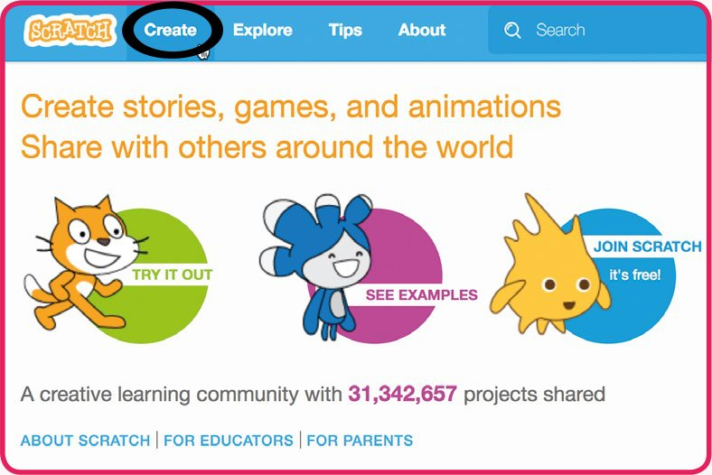

Lucrul online are multe avantaje, dar dacă preferi să lucrezi offline (sau nu ai mereu o conexiune la internet), poți apăsa pe **Offline Editor** (editor offline), în partea de jos a paginii principale, ca să descarci Scratch pe calculatorul tău.

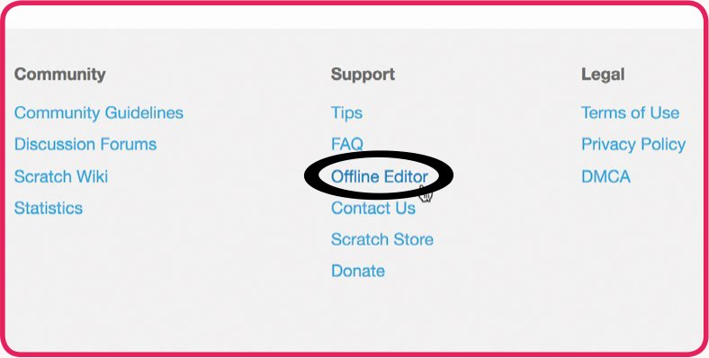

> **SFAT: FIȘIERELE PROIECTELOR**
> Ca să descarci o arhivă zip cu toate fișierele proiectelor Scratch 2 (.sb2) din această carte, intră pe: [rpf.io/book-s1-assets](https://rpf.io/book-s1-assets)

> **NOTA TRADUCĂTORULUI**
> Cartea a fost scrisă în 2018, pentru **Scratch 2**. Din 2019, pe [scratch.mit.edu](https://scratch.mit.edu) găsești **Scratch 3**, care arată puțin altfel: paleta de blocuri este în stânga, zona de cod în mijloc, iar scena în dreapta; fila „Scripts” se numește „Code”, iar categoria „Data” se numește „Variables”. Blocurile sunt însă aceleași, iar proiectele .sb2 din carte se deschid fără probleme în Scratch 3. Ca să găsești mai ușor blocurile din carte, în Scratch 3 poți lăsa limba pe engleză (din meniul cu globul pământesc), sau poți alege limba română, caz în care numele blocurilor apar traduse. Blocurile de muzică (`play drum`, `play note`, `set instrument`) sunt în Scratch 3 într-o extensie: apasă pe butonul albastru „Add Extension” din stânga jos și alege **Music**. Editorul offline pentru Scratch 3 se descarcă de la [scratch.mit.edu/download](https://scratch.mit.edu/download).

## Editorul

*Orientează-te în editorul Scratch…*

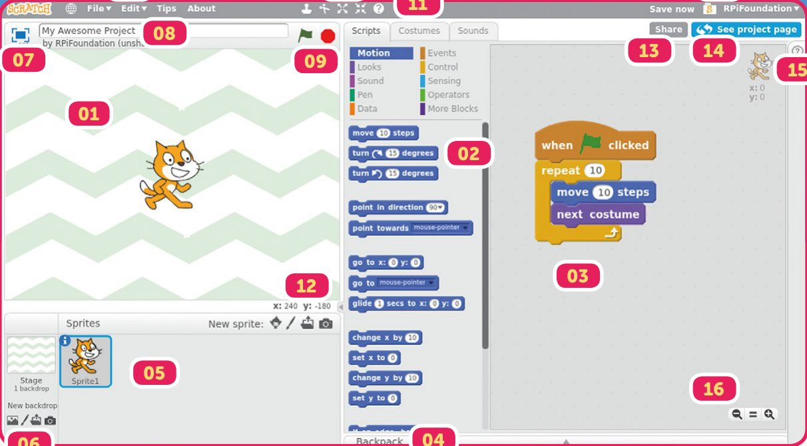

1. **Scena (Stage).** Un proiect conține „personaje” (*sprites*), cărora le adaugi cod. Personajele apar pe scenă și pot fi programate să se miște, să scoată sunete și să facă multe alte lucruri.
2. **Paleta de blocuri (Blocks palette).** Blocurile de cod pot fi folosite ca să îți controlezi personajele și fundalul scenei. Toate blocurile au culori după categorie, iar categoriile le găsești în partea de sus a paletei de blocuri.
3. **Zona de scripturi (Scripts area).** Trage blocuri din paletă în această zonă și creează scripturi îmbinându-le.
4. **Rucsacul (Backpack).** Pune scripturi în rucsac, ca să le folosești în alte proiecte.
5. **Lista de personaje (Sprite list).** Aici sunt toate personajele din proiectul tău. Poți apăsa pe pictograma albastră de informații a oricărui personaj, ca să îi schimbi numele și felul în care se comportă.
6. **Fundaluri (Backdrops).** Schimbă felul în care arată scena, adăugând fundaluri noi.
7. **Ecran complet (Full-screen).** Fă scena să ocupe tot ecranul, ca să îți vadă și alții creația în toată splendoarea ei.
8. **Numele proiectului.**
9. **Pornește/oprește proiectul.**
10. **Uneltele cursorului.** Duplică, șterge, mărește și micșorează un personaj (apăsând pe o pictogramă și apoi pe un personaj de pe scenă). Apasă pe unealta de ajutor pentru blocuri, apoi pe un bloc din paletă, ca să afli mai multe despre el.
11. **Filele Scripts / Costumes / Sounds.** Treci de la programarea proiectului la adăugarea de costume și sunete.
12. **Coordonatele cursorului mouse-ului.**
13. **Partajare (Share).** Dacă ai un cont Scratch, îți poți împărtăși proiectele cu comunitatea.
14. **Vezi pagina proiectului.** Adaugă instrucțiuni și alte note proiectului tău și vezi cum interacționează cu el ceilalți din comunitate.
15. **Sfaturi (Tips).** Găsești tutoriale de proiecte, sfaturi despre folosirea lui Scratch și explicații despre cum funcționează fiecare bloc.
16. **Zoom.**
17. **Meniul.** Folosește meniul ca să încarci, să salvezi și să răsfoiești proiectele, și ca să ajungi la o mulțime de alte opțiuni utile.
18. **Lucrurile mele (My Stuff).** Aici sunt păstrate online proiectele tale.

## Fila Costumes

*Apasă pe această filă ca să deschizi editorul de desen*

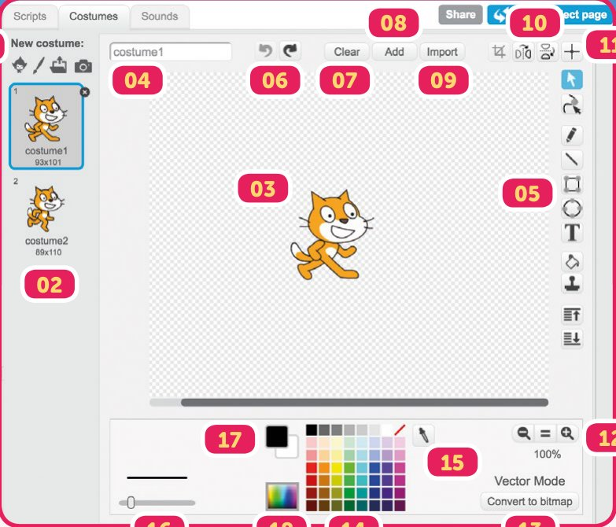

1. **Costum nou (New costume).** Adaugă costume unui personaj luându-le din biblioteca Scratch, desenându-le tu, încărcând o imagine de pe calculator sau folosind camera web ca să faci o poză.
2. **Lista de costume.** Costumele personajului tău apar aici, și poți apăsa pe unul ca să începi să îl editezi.
3. **Pânza (Canvas).** Aceasta este pânza pe care editezi un costum.
4. **Numele costumului.** Poți schimba numele unui costum, ca să îl găsești mai ușor.
5. **Unelte.** Poți folosi aceste unelte ca să îți editezi imaginea. Poți adăuga linii, forme și text, poți colora și multe altele.
6. **Anulează/Refă (Undo/Redo).** Folosește aceste săgeți ca să anulezi sau să refaci ultima acțiune.
7. **Curăță (Clear).** Șterge costumul curent și ia-o de la capăt!
8. **Adaugă (Add).** Adaugă o altă imagine de costum din biblioteca Scratch.
9. **Importă (Import).** Adaugă o altă imagine de costum de pe calculatorul tău.
10. **Oglindește (Flip).** Oglindește costumul pe orizontală sau pe verticală.
11. **Centrul costumului.** Stabilește centrul costumului, folosit când personajul se mișcă și se rotește.
12. **Zoom.** Folosește aceste pictograme ca să mărești sau să micșorezi costumul în timp ce îl editezi.
13. **Modul Bitmap/Vector.** Editorul de desen are două moduri: Bitmap și Vector. În modul Vector (arătat aici), editorul te lasă să modifici formele după ce le-ai creat, iar costumele și fundalurile vor arăta foarte bine când le mărești. Când creezi un costum nou, editorul va fi implicit în modul Bitmap. În modul Bitmap nu poți muta sau redimensiona ușor formele pe care le-ai desenat, dar unora li se pare mai ușor de început așa. Când editezi un costum existent, editorul va fi în modul în care a fost creat costumul.
14. **Paleta de culori.** Folosește această paletă ca să alegi o culoare.
15. **Pipeta (Colour picker).** Folosește-o ca să preiei o culoare de pe costumul tău.
16. **Grosimea liniei.** Mută acest cursor ca să schimbi grosimea liniei folosite la desenat.
17. **Schimbă culorile.** Schimbă între ele cele două culori selectate.
18. **Schimbă paleta.** Trece paleta de culori pe „avansat”, ca să ai acces la mai multe nuanțe.

## Fila Sounds

*Schimbă sunetele pe care le fac personajele tale*

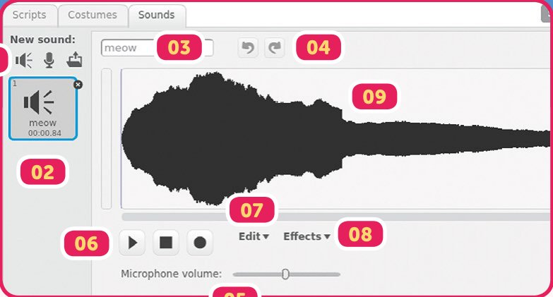

1. **Sunet nou (New sound).** Poți adăuga sunete unui personaj (sau scenei) din biblioteca Scratch, înregistrându-le tu (dacă ai un microfon) sau încărcând un sunet de pe calculator.
2. **Lista de sunete.** Sunetele personajului sau ale scenei apar aici, și poți apăsa pe unul ca să începi să îl editezi.
3. **Numele sunetului.** Poți schimba numele unui sunet, ca să îl găsești mai ușor.
4. **Anulează/Refă.** Anulează sau refă ultima acțiune.
5. **Volumul microfonului.** Reglează volumul microfonului ca să înregistrezi sunete mai încet sau mai tare.
6. **Comenzi de redare.** Ascultă sunetul sau înregistrează unul nou.
7. **Editare.** Remixează sunetul tăind, copiind și lipind.
8. **Efecte.** Adaugă efecte sunetului, cum ar fi intrarea sau ieșirea treptată, sau inversarea.
9. **Unda sonoră.** Așa arată sunetul tău! Poți selecta o parte din sunet ca să o editezi, trăgând peste ea cu mouse-ul.

## Crearea unui cont Scratch

*Salvează-ți și împărtășește-ți proiectele online*

Crearea unui cont Scratch îți va permite să îți salvezi proiectele online, ca să le poți accesa de pe orice calculator cu conexiune la internet. Vei putea, de asemenea, să îți împărtășești proiectele cu comunitatea Scratch și să comentezi la alte proiecte. Ca să creezi un cont Scratch, apasă pe **Join Scratch** (alătură-te lui Scratch).

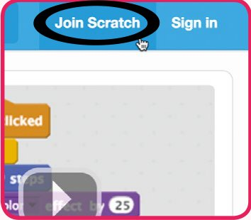

> **NOTĂ**
> Vei avea nevoie de permisiunea părinților ca să îți faci un cont, dacă ai sub 13 ani. Citește regulile comunității la [scratch.mit.edu/community_guidelines](https://scratch.mit.edu/community_guidelines) înainte să îți creezi un cont.

**Când programezi online…**

- Nu folosi numele tău real când îți creezi un nume de utilizator.
- Fii respectuos cu ceilalți când comentezi și remixezi proiecte.

Dacă ai un cont Scratch, poți apăsa pe **File** (fișier) și apoi pe **Save now** (salvează acum) ca să îți salvezi proiectul. După ce l-ai salvat, proiectul va apărea în folderul tău **My Stuff** (lucrurile mele).

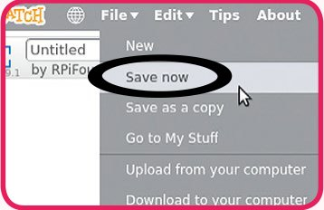

Ca să ajungi la lucrurile tale din interiorul unui proiect, apasă pe **File** și apoi pe **Go to My Stuff**. Ar trebui să vezi lista cu toate proiectele tale.

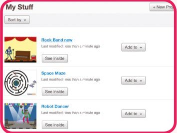

### Salvarea proiectelor fără un cont Scratch

Dacă nu ai un cont Scratch, tot îți poți salva proiectele, apăsând pe **File** și apoi pe **Download to your computer** (descarcă pe calculatorul tău). Vei fi întrebat unde să fie păstrat proiectul Scratch, care va fi un fișier .sb2. Astfel, proiectul tău este descărcat din editorul Scratch.

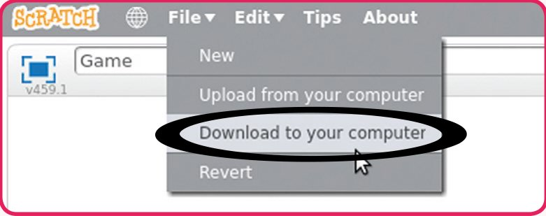

Ca să continui lucrul la proiect, intră în editorul Scratch și apasă pe **File**, apoi pe **Upload from your computer** (încarcă de pe calculatorul tău). Găsește fișierul tău .sb2 și apasă pe OK / Open. Astfel, proiectul tău este încărcat în editorul Scratch.

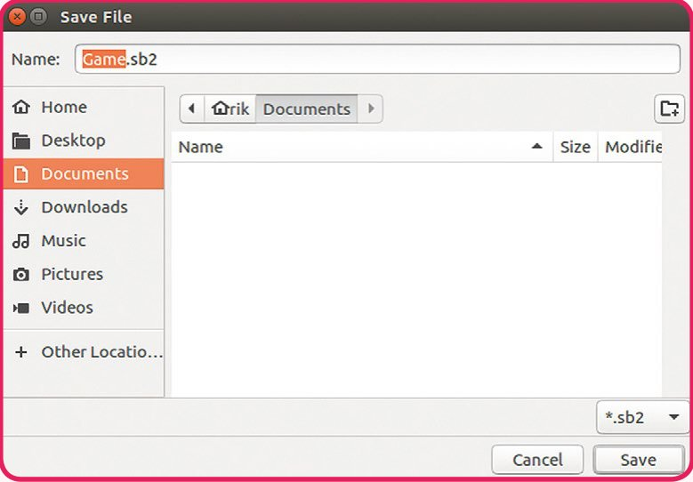

> **NOTA TRADUCĂTORULUI**
> În Scratch 3, fișierele proiectelor au extensia .sb3, iar comenzile din meniul File se numesc „Save to your computer” și „Load from your computer”. Scratch 3 poate deschide și fișierele .sb2 mai vechi.

## Comunitatea Scratch

Unul dintre cele mai grozave lucruri la programarea în Scratch este că faci parte dintr-o comunitate de milioane de oameni din toată lumea, care își creează și își împărtășesc ideile.

### Găsirea proiectelor

Ca să vezi ce fac ceilalți din comunitatea Scratch, apasă pe **Explore** (explorează) în meniul de sus al site-ului. Poți căuta proiecte populare sau create recent, sau după cuvinte-cheie, cum ar fi „Games” (jocuri) sau „Tutorials” (tutoriale). Poți folosi bara de căutare dacă vrei ceva anume.

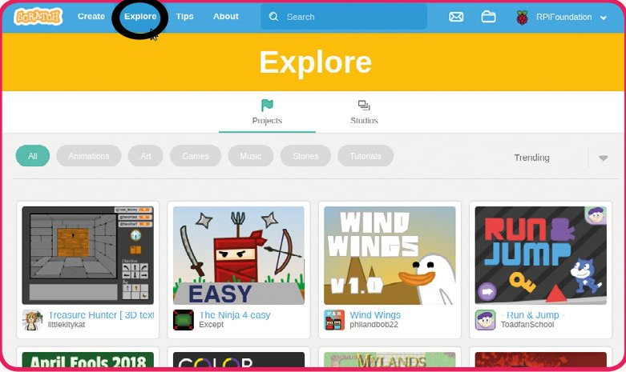

După ce ai găsit un proiect care îți place, poți apăsa pe steagul verde ca să îl joci. Sub proiect sunt butoane ca să îl marchezi ca favorit sau ca îndrăgit, sau ca să îl raportezi, dacă este nepotrivit. Poți lăsa și un comentariu, și poți apăsa pe **See Inside** (vezi în interior) dacă vrei să vezi codul.

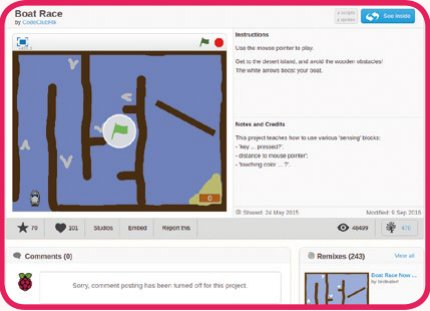

Dacă găsești pe cineva a cărui muncă îți place, poți apăsa pe numele lui de utilizator și apoi pe **Follow** (urmărește). Vei fi anunțat când creează ceva nou.

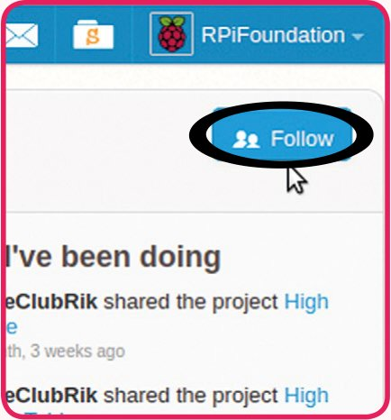

### Remixarea

Poți folosi alte proiecte Scratch ca să iei idei și ca punct de pornire pentru propriile tale creații. Dacă ai un cont Scratch, poți apăsa pe **Remix** la un proiect, ca să îți salvezi propria copie.

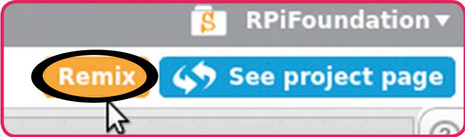

## Partajarea

Împărtășirea proiectelor tale cu comunitatea Scratch le permite altora să se bucure de creațiile tale extraordinare. Proiectele nu sunt împărtășite cu comunitatea decât dacă vrei tu, și le poți împărtăși apăsând pe butonul **Share** (partajează), din dreapta sus.

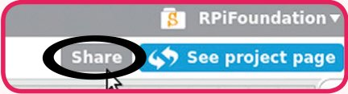

Înainte să îți împărtășești proiectul, e bine să verifici pagina proiectului, ca să te asiguri că cei din comunitate au toate informațiile de care au nevoie ca să îl folosească. Poți adăuga instrucțiuni, ca să le spui altora cum să folosească proiectul, și poți menționa alte persoane care te-au ajutat (mai ales dacă ai remixat un proiect).

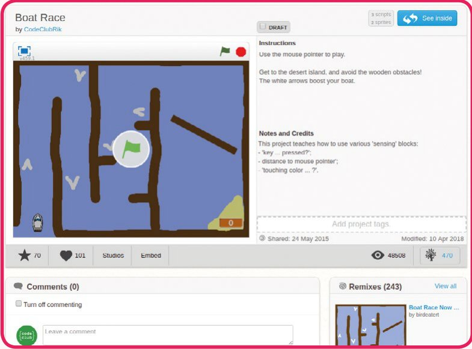

Odată împărtășit, ceilalți din comunitate vor putea comenta la proiectul tău, deși poți dezactiva comentariile, dacă preferi. Comentariile sunt foarte utile pentru a-ți îmbunătăți proiectul, aflând ce le place și ce nu le place oamenilor. Poți vedea și câți oameni au vizualizat, au marcat ca favorit și au îndrăgit proiectul, precum și câți l-au remixat.

## Sfaturi pentru programarea în Scratch

Dacă nu ești sigur ce face un bloc de cod, poți apăsa clic dreapta pe el și alege **help** (ajutor), ca să afli mai multe. Poți și pur și simplu să apeși pe bloc, ca să vezi ce face, înainte să îl adaugi într-un script!

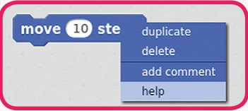

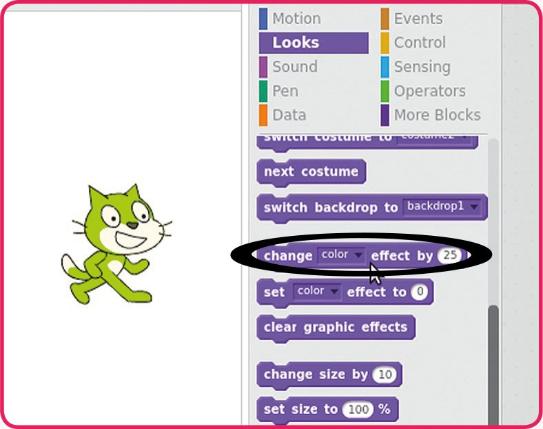

Dacă ai nevoie de ceva mai mult ajutor, Scratch are o secțiune de ajutor care include:

- Instrucțiuni pas cu pas pentru a face animații, povești, muzică și jocuri
- O secțiune „How to” (cum să), care îți arată cum să faci anumite lucruri în proiectul tău
- O secțiune „Blocks” (blocuri), care explică ce face fiecare bloc

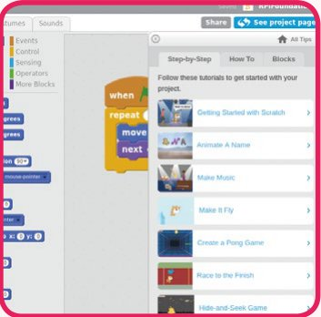

Dacă nu ești sigur cum să faci ceva, poți și să ceri ajutorul altora. Poate au avut aceeași problemă ca tine!

Testează-ți codul des, ca să te asiguri că face ce vrei tu. Îți va fi mult mai ușor să repari problemele din cod dacă testezi de fiecare dată când faci o schimbare.

Roagă-i pe alții să îți încerce proiectele și întreabă-i ce le place la proiectul tău și ce ar îmbunătăți.

Poți adăuga comentarii unui script apăsând clic dreapta pe un bloc și alegând **add comment** (adaugă comentariu). E bine să comentezi un script, ca să explici ce face, astfel încât și alții să știe ce fac scripturile tale. E util și în caz că uiți tu ce face codul!

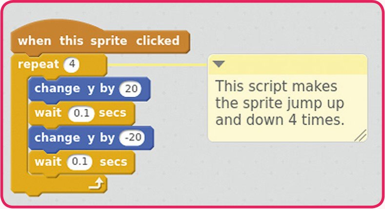

Ca să ștergi blocuri, trage-le peste zona paletei. Nu-ți face griji dacă ștergi din greșeală blocuri de care ai nevoie: poți apăsa pe meniul **File** și apoi pe **undelete** (anulează ștergerea), ca să le recuperezi!

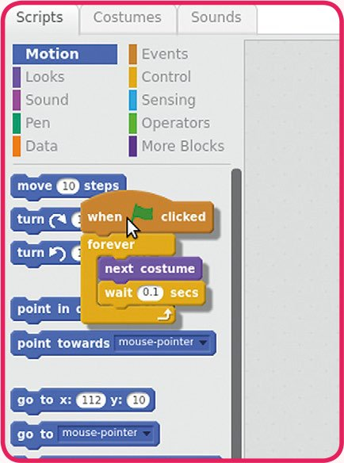

Poți apăsa clic dreapta pe un bloc și alege **duplicate** (duplică), ca să faci o copie a acelui bloc și a blocurilor atașate sub el.

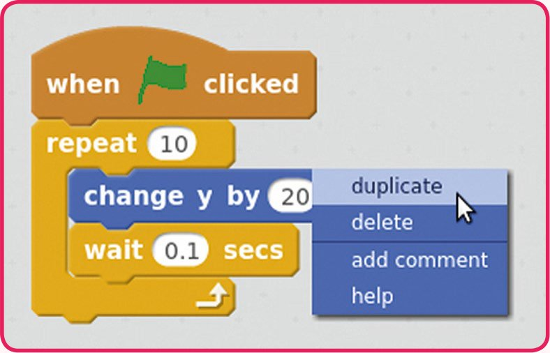

Dacă tragi blocuri peste un alt personaj, se face o copie a lor. E util dacă ai nevoie de cod asemănător în alt personaj.

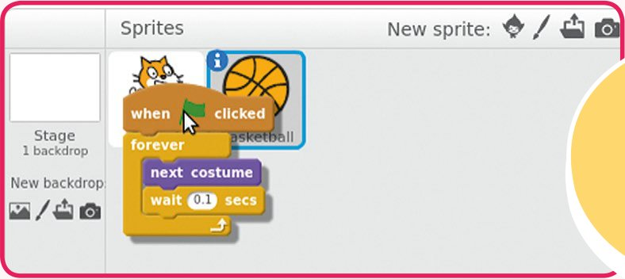

Dacă nu găsești blocurile de care ai nevoie ca să controlezi un personaj, de exemplu blocurile Motion (mișcare), se poate să ai selectată Scena (Stage).

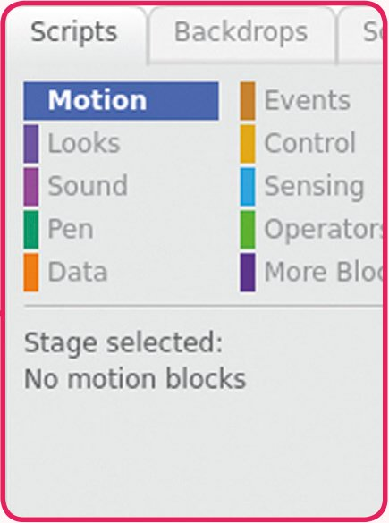

> 🤖 *Abia aștepți să începi să programezi? Treci la pagina următoare ca să începi primul tău proiect…*
