# Capitolul 3 – Trupa rock

> *Creează-ți propria trupă rock virtuală, programând o selecție de instrumente muzicale*

> 🤖 *Hai să creăm o capodoperă muzicală! E timpul să începem să programăm!*

În acest capitol vei crea instrumente muzicale care cântă când apeși pe ele. Vei învăța cum să adaugi personaje într-un proiect și cum să le schimbi costumele, precum și cum să adaugi propriile tale sunete și muzică în proiecte.

Așa că pregătește-te să faci gălăgie!

> **CE VEI ÎNVĂȚA**
> - Personaje (*sprites*)
> - Costume
> - Evenimente
> - Ordonarea instrucțiunilor (secvențiere)
> - Sunet și muzică

## Proiectul terminat

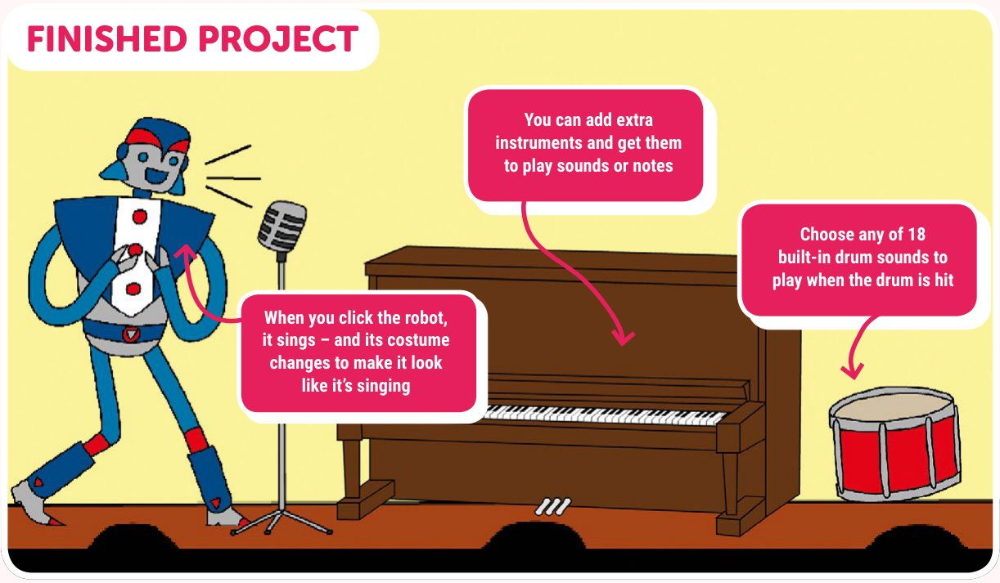

- Poți adăuga instrumente în plus și le poți face să cânte sunete sau note
- Când apeși pe robot, el cântă, iar costumul i se schimbă, ca să pară că într-adevăr cântă
- Alege oricare dintre cele 18 sunete de tobă incluse, ca să se audă când este lovită toba

> **SFAT: FIȘIERELE PROIECTELOR**
> Ca să descarci o arhivă zip cu toate fișierele proiectelor Scratch 2 (.sb2) din această carte, intră pe: [rpf.io/book-s1-assets](https://rpf.io/book-s1-assets)

## Pasul 1: Personajele și scena

*Să începem aruncând o privire la proiectul Scratch.*

- [ ] Într-un browser, intră pe [rpf.io/book-rockband](https://rpf.io/book-rockband) ca să deschizi proiectul Scratch „Rock Band”. Apasă pe **Remix**.

Dacă preferi să folosești Scratch offline, apasă pe **File → Download to your computer** în editorul online Scratch. Apoi poți deschide proiectul în editorul offline. (Vezi capitolul „Să facem cunoștință cu Scratch” pentru mai multe informații despre folosirea lui Scratch offline.)

**Scena** este în stânga sus a editorului și este locul unde se întâmplă acțiunea. Gândește-te la ea ca la un loc de spectacol, exact ca o scenă adevărată.

Acest proiect conține **personaje** (*sprites*), cărora le poți adăuga blocuri de cod. Personajele apar pe scenă și se pot mișca, pot scoate sunete și pot face multe alte lucruri.

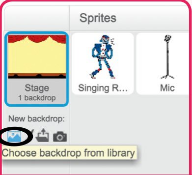

- [ ] Dacă vrei să schimbi fundalul scenei, apasă pe pictograma **Choose backdrop from library** (alege un fundal din bibliotecă) și alege unul din bibliotecă.

*Poți adăuga un fundal nou proiectului*

## Pasul 2: Programează o tobă

*Hai să programăm toba, ca să facă muzică atunci când e lovită.*

- [ ] Selectează personajul **Drum** (tobă) și apasă pe fila **Scripts**. Ar trebui să vezi o mulțime de blocuri colorate pe categorii, care pot fi folosite ca să îți controlezi robotul. Apasă pe categoria **Events** (evenimente) și apoi trage un bloc `when this sprite clicked` (când se dă clic pe acest personaj) din paleta de blocuri în zona de cod din dreapta.

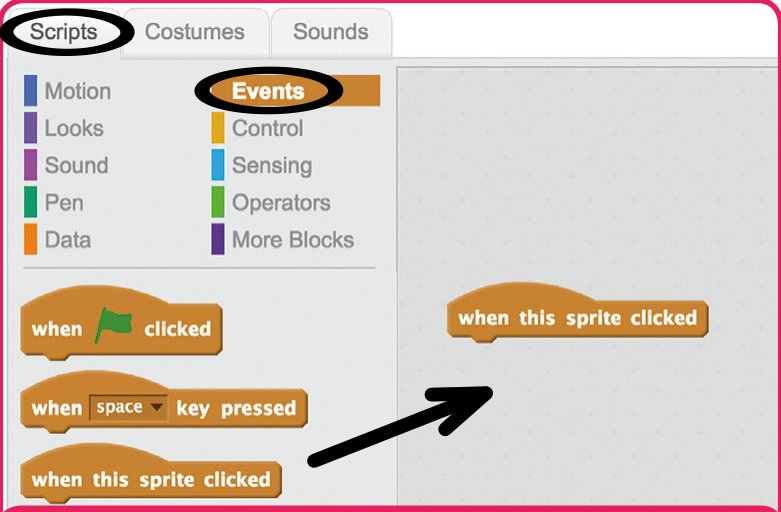

*Trage blocul spre dreapta și lasă-l în zona de cod*

> **SFAT: EVENIMENTE**
> Blocurile **Events** sunt folosite ca să le spună personajelor *când* să ruleze un cod. Scratch are o mulțime de blocuri Events: pentru a rula cod când pornește un proiect, când se dă clic pe un personaj, când este apăsată o tastă, și multe altele.

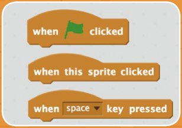

- [ ] Orice cod pe care îl atașezi blocului Events va rula, în ordine, când apeși pe personajul tău tobă. Ca să redai un sunet, apasă pe categoria mov **Sound** (sunet) din panoul Scripts, ca să vezi dedesubt toate blocurile de sunet. Trage un bloc `play drum` (cântă la tobă) în zona de cod, atașându-l sub blocul `when this sprite clicked`.

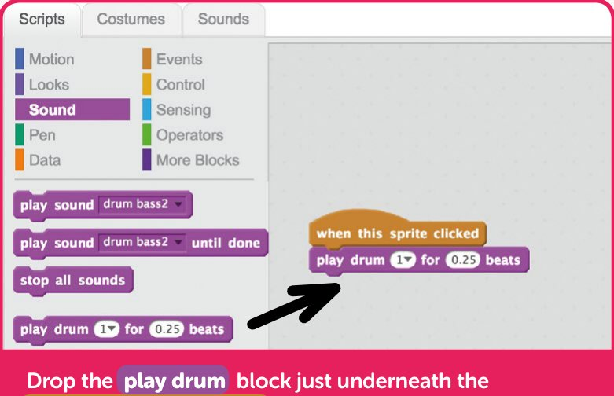

*Lasă blocul `play drum` chiar sub blocul `when this sprite clicked`, ca să se lipească de el*

> **SFAT: ORDINEA INSTRUCȚIUNILOR**
> Când scrii cod pentru calculator, e important ca instrucțiunile de executat să fie puse în ordinea corectă. Într-un script Scratch, blocurile își execută instrucțiunile în ordine, de sus în jos.

> **TESTEAZĂ-ȚI PROIECTUL**
> Apasă pe personajul tobă și ar trebui să auzi un sunet.

> **PROVOCARE: LOVEȘTE-O!**
> Poți programa toba să facă un sunet când este apăsată tasta SPAȚIU?
>
> 

<b>INDICIU</b> (apasă ca să îl vezi)

>
> Va trebui să folosești un alt bloc Events, ca să faci personajul să reacționeze la apăsarea unei taste.
> 

> **CUM SĂ… SCHIMBI TOBA**
> Vrei să schimbi sunetul pe care îl face toba când apeși pe ea? E ușor să schimbi sunetul tobei în blocul `play drum`. Apasă pe săgeata în jos de lângă numărul tobei, ca să vezi o listă cu diferite sunete de tobă din care poți alege.

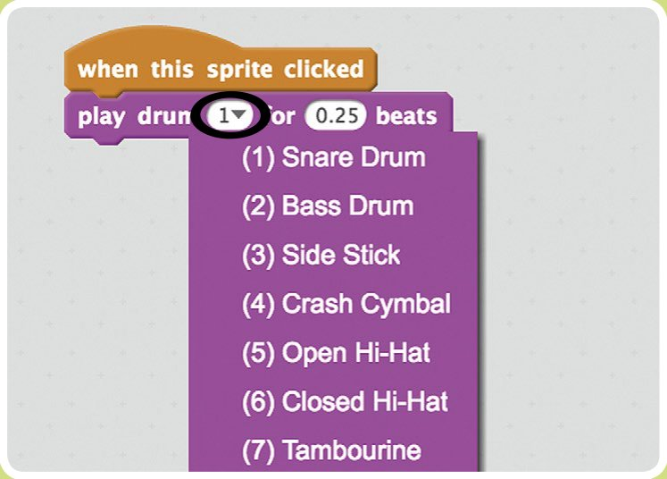

> 🤖 *Cum seamănă un solo de tobe cu un strănut? Știi că vine, dar nu poți face nimic ca să-l oprești!*

## Pasul 3: Adaugă un robot cântăreț

*Hai să programăm personajul robot, ca să scoată un sunet când apeși pe el.*

- [ ] Apasă pe personajul robot, apoi adaugă un bloc Events `when this sprite clicked` din paleta de blocuri, exact cum ai făcut cu toba.

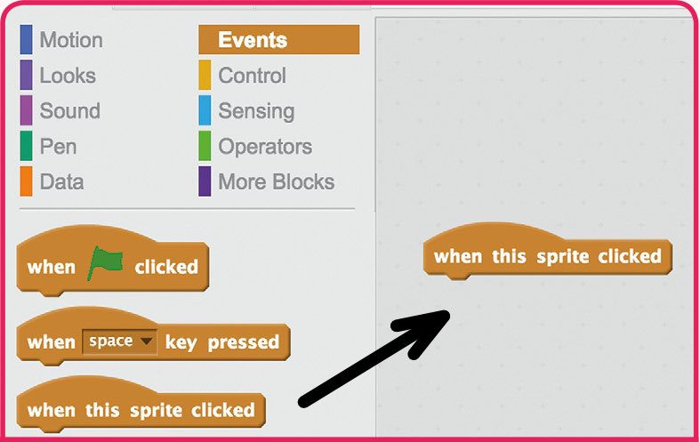

*Ca și înainte, trage blocul spre dreapta și lasă-l în zona de cod*

- [ ] Trage un bloc `play sound … until done` (redă sunetul … până la sfârșit) în zona de cod, atașându-l sub blocul `when this sprite clicked`.

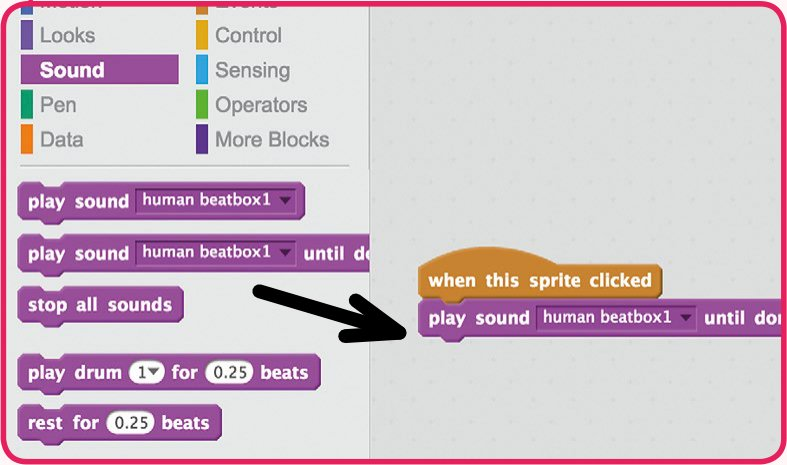

> **CUM SĂ… EDITEZI SUNETELE**
> Vrei să schimbi sunetul pe care îl face robotul? Mai întâi, apasă pe fila **Sounds** din partea de sus a editorului. Cu meniul derulant **Effects** (efecte), poți face sunetul mai tare, mai încet… sau chiar îl poți inversa! În plus, poți adăuga alte sunete din biblioteca Scratch, poți înregistra propriile sunete sau le poți încărca, folosind pictogramele de sub „New sound:”.

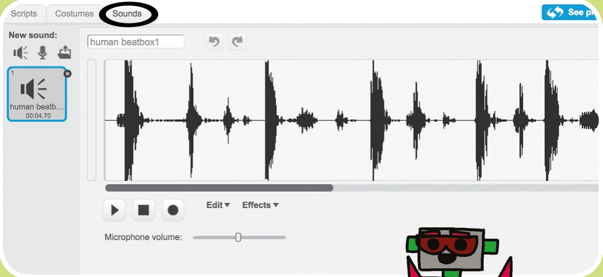

## Pasul 4: Costumele

*Hai să facem robotul să pară că într-adevăr cântă!*

- [ ] Apasă pe personajul robot, apoi pe fila **Costumes** din partea de sus a editorului. Vei vedea că robotul are două costume.

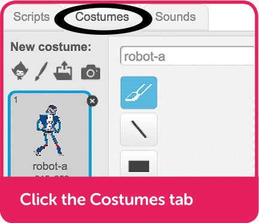

*Apasă pe fila Costumes*

> **SFAT: COSTUME**
> Personajele din Scratch au mai multe costume, și poți programa personajele să treacă de la un costum la altul, ca să le schimbi înfățișarea. Scratch include o bibliotecă de costume, sau poți chiar să le desenezi tu.

- [ ] Apasă pe fila **Scripts** ca să te întorci la cod. Apasă pe categoria **Looks** (înfățișare) și trage două blocuri `switch costume` (schimbă costumul) în codul tău. Ai grijă ca robotul să arate mai întâi costumul **robot-b**, apoi să redea un sunet și apoi să treacă înapoi la **robot-a**.

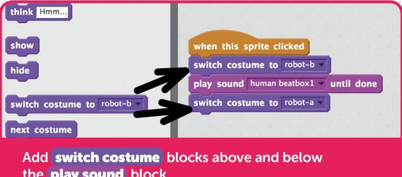

*Adaugă blocuri `switch costume` deasupra și dedesubtul blocului `play sound`*

> **TESTEAZĂ-ȚI PROIECTUL**
> Apasă pe robot ca să îl testezi. Robotul ar trebui acum să își schimbe costumul, să redea un sunet și apoi să revină la primul costum, după ce sunetul s-a terminat.

> **PROVOCARE: EDITEAZĂ COSTUMELE**
> Vrei să schimbi felul în care arată robotul când cântă? Apasă pe fila **Costumes**, apoi selectează costumul **robot-b**. Poți folosi apoi uneltele editorului de desen ca să îl modifici. În prezent, are pur și simplu trei linii care ies din gură, desenate cu unealta linie. Poți folosi uneltele de editare, cum ar fi creionul, ca să îi faci robotului și alte schimbări.

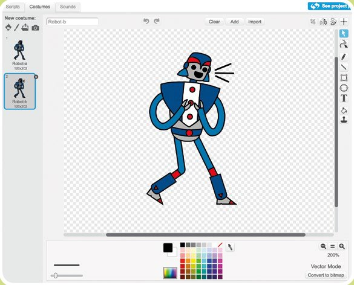

## Pasul 5: Cântă o melodie

*Hai să adăugăm un personaj nou, un pian, care cântă o melodie când apeși pe el.*

- [ ] Apasă pe pictograma **Choose sprite from library** (alege un personaj din bibliotecă), chiar sub scenă, ca să adaugi un personaj nou din biblioteca Scratch.

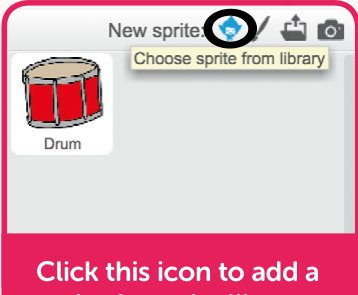

*Apasă pe această pictogramă ca să adaugi un personaj din bibliotecă*

- [ ] Apasă pe tema **Music** (muzică), selectează personajul **Piano** și apoi apasă pe OK, ca să îl adaugi în proiect.

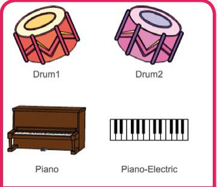

*Vei găsi pianul în biblioteca de personaje Scratch*

- [ ] Pianul este prea mare ca să încapă ușor pe scenă, așa că apasă pe pictograma **Shrink** (micșorează), din uneltele aflate în dreapta lui „About” în bara de sus, apoi apasă de mai multe ori pe pianul de pe scenă, ca să îl micșorezi.

- [ ] Acum adaugă câteva blocuri `play note` (cântă nota) sub un bloc `when this sprite clicked`, ca să se cânte o melodie când apeși pe personajul pian.

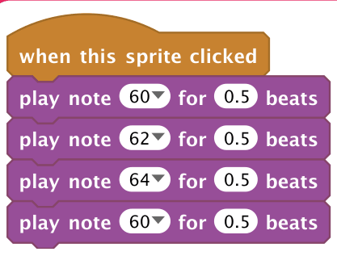

> **SFAT: BLOCURILE PLAY NOTE**
> Numerele din blocurile `play note` corespund notelor muzicale: numărul 60 este „do central” (*Middle C*), și cu cât numărul e mai mare, cu atât nota e mai înaltă! Dacă apeși pe săgeata de lângă număr, sub bloc apare o claviatură, care te ajută să alegi notele pentru melodia ta.

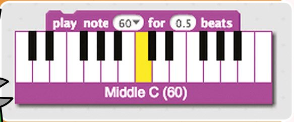

> **TESTEAZĂ-ȚI PROIECTUL**
> Ce muzică se cântă când apeși pe personajul pian?

> **PROVOCARE: CREEAZĂ-ȚI PROPRIA MELODIE**
> Poți schimba notele cântate și crea propria ta melodie?
>
> 

<b>INDICIU</b> (apasă ca să îl vezi)

>
> Poți schimba numerele din blocurile `play note` ca să creezi propria ta melodie, și poți chiar să folosești blocul `set instrument` (alege instrumentul) ca să alegi un alt instrument!
> 

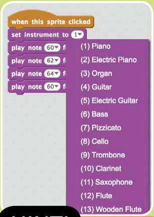

> **CUM SĂ… FOLOSEȘTI CAMERA WEB**
> Dacă ai o cameră web, o poți folosi ca să cânți la instrumente când te miști peste ele! Ia un bloc `when loudness >` (când zgomotul e mai mare decât), apasă pe săgeata lui în jos și alege **video motion** (mișcare video). Adaugă un bloc `play drum`, apoi fă cu mâna ca să testezi!

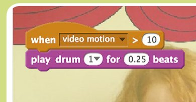

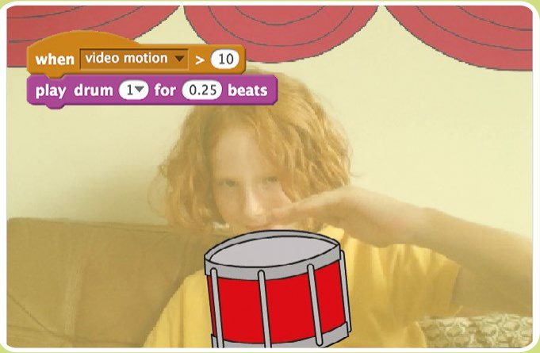

> **PROVOCARE: FĂ-ȚI PROPRIA TRUPĂ**
> Poți folosi ce ai învățat în acest capitol ca să îți faci propria trupă? Uită-te la sunetele și instrumentele disponibile ca să prinzi idei, sau poți chiar să le desenezi tu. Instrumentele tale nu trebuie să fie serioase: ai putea face un pian din gogoși!
>
> 

<b>INDICIU</b> (apasă ca să îl vezi)

>
> Pe lângă costumele, fundalurile și sunetele din biblioteca Scratch, poți crea și propriile tale: folosește opțiunea **Paint** (desenează) sau **Record Sound** (înregistrează un sunet).
> 

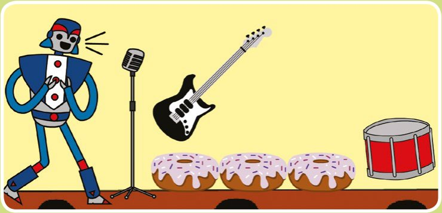

## Trupa rock: codul complet

### Toba

Când se apasă pe personajul tobă, se aude o bătaie de tobă.

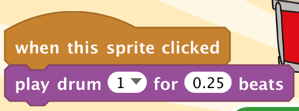

*Acest bloc Sound redă sunetul de tobă ales, timp de 0,25 bătăi*

### Robotul cântăreț

Când se apasă pe robot, el își schimbă costumul înainte să redea un sunet. După ce sunetul s-a terminat, robotul revine la primul costum.

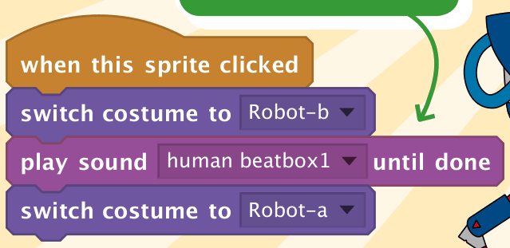

*Blocul `play sound … until done` așteaptă până când sunetul s-a terminat, înainte să treacă la blocul următor*

### Pianul

Când se apasă pe pian, se cântă patru note, una după alta.

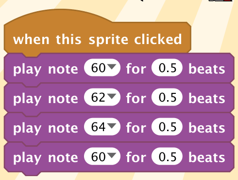

> 🏅 **PROIECT TERMINAT!** Trupa rock: completă

## Acum ai putea face…

*Cu abilitățile pe care le-ai învățat, de ce nu ai încerca aceste proiecte?*

### Tablou cu sunete

Umple scena cu o mulțime de personaje diferite, care fac un zgomot sau cântă ceva când apeși pe ele.

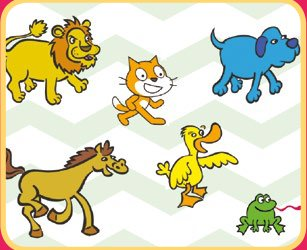

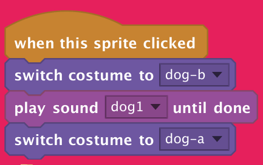

### Felicitare interactivă de ziua de naștere

Creează o felicitare interactivă de ziua de naștere pentru un prieten. I-ai putea cânta un cântec sau chiar înregistra propriul tău mesaj personalizat.

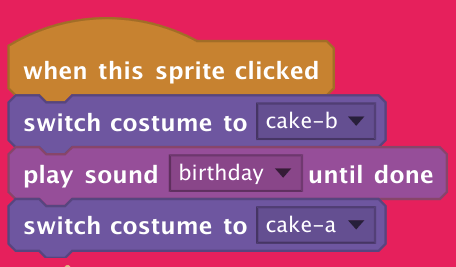

### Despre tine

Creează un proiect care să le spună oamenilor mai multe despre tine. Ai putea adăuga personaje pentru hobby-urile și pasiunile tale preferate și să folosești blocuri `say` (spune) ca să vorbești despre ele când se apasă pe personaje. Ai putea chiar să folosești o mulțime de blocuri `say` ca să spui o poveste!

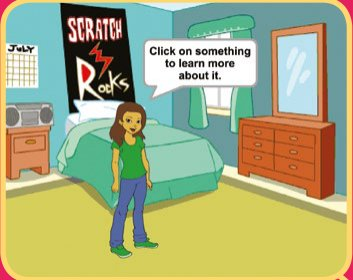

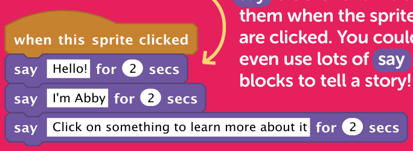

> 🤖 *Ai chef să pornești în spațiu? Treci la capitolul următor ca să afli cum…*

## Joc: Găsește diferențele

Între aceste două imagini sunt zece diferențe. Le poți găsi pe toate? Răspunsurile sunt în capitolul „Soluțiile jocurilor”.

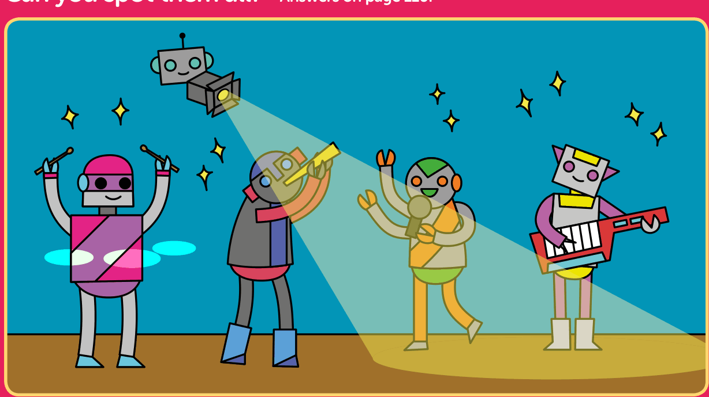

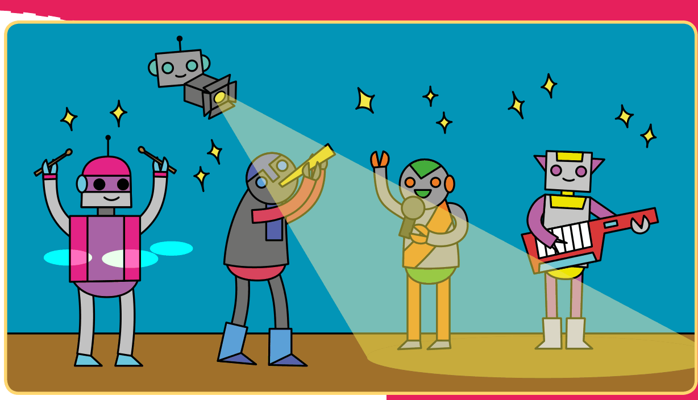
