# Capitolul 4 – Pierduți în spațiu

> *Creează-ți propria animație cu tematică spațială, cu nave, asteroizi și maimuțe plutind în spațiu*

> 🤖 *E timpul să lansăm următorul proiect! De data asta ne îndreptăm spre spațiul cosmic!*

În acest capitol vei învăța cum să folosești buclele ca să animezi personaje. Vei programa o navă spațială care se întoarce pe Pământ, o maimuță-astronaut plutitoare, un asteroid și o stea strălucitoare.

> **CE VEI ÎNVĂȚA**
> - Mișcarea personajelor pe scenă
> - Repetiția (bucle): blocul `repeat` (repetă) și blocul `forever` (la nesfârșit)

> **SFAT: FIȘIERELE PROIECTELOR**
> Ca să descarci o arhivă zip cu toate fișierele proiectelor Scratch 2 (.sb2) din această carte, intră pe: [rpf.io/book-s1-assets](https://rpf.io/book-s1-assets)

## Proiectul terminat

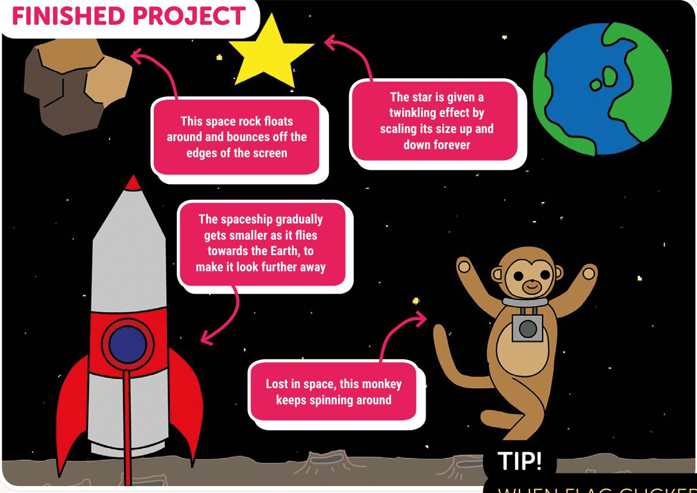

- Acest asteroid plutește și ricoșează din marginile ecranului
- Steaua capătă un efect de licărire, mărindu-se și micșorându-se la nesfârșit
- Nava spațială se micșorează treptat în timp ce zboară spre Pământ, ca să pară tot mai departe
- Pierdută în spațiu, maimuța se tot rotește

## Pasul 1: Animează o navă spațială

*Să începem făcând o navă spațială care zboară spre Pământ.*

- [ ] Într-un browser, intră pe [rpf.io/book-lostinspace](https://rpf.io/book-lostinspace) ca să deschizi proiectul „Lost in Space”.
- [ ] Apasă pe personajul **Spaceship** (nava spațială) și adaugă următorul cod:

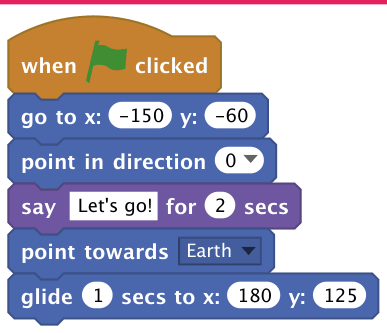

> **SFAT: WHEN FLAG CLICKED**
> Orice cod atașat unui bloc `when flag clicked` (când se apasă pe steag) va rula când pornește proiectul. Poți folosi acest eveniment ca să pornești codul, în loc să aștepți ca utilizatorul să apese pe un personaj sau pe o tastă.

> **TESTEAZĂ-ȚI PROIECTUL**
> Ca să îți testezi codul, poți fie să apeși pe steagul verde de deasupra scenei, fie să apeși direct pe script. Ar trebui să vezi cum nava ta spațială vorbește, se întoarce și se mișcă spre Pământ.

> **SFAT: DIRECȚIA**
> Dacă apeși pe săgeata în jos din blocul `point in direction` (îndreaptă-te în direcția), poți vedea că există numere care reprezintă direcții. Acest număr este unghiul spre care este îndreptat un personaj (în grade). Poți introduce orice număr între 0 și 180 în sensul acelor de ceasornic, sau între 0 și -180 în sens invers.

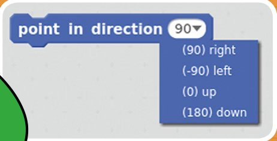

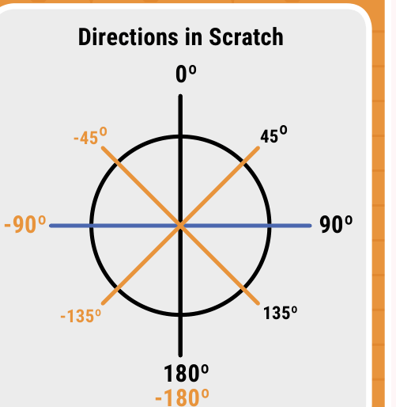

*Direcțiile în Scratch: 0° este în sus, 90° la dreapta, 180° (sau -180°) în jos, -90° la stânga*

> ✏️ Ce număr ar trebui să introduci în blocul `point in direction` ca personajul navă spațială să fie îndreptat spre stânga-jos? ______

> **SFAT: COORDONATELE**
> Numerele din blocurile `go to` (du-te la) și `glide` (alunecă) sunt coordonatele x și y, care stabilesc poziția unui personaj pe scenă. Vei învăța mai multe despre coordonate în capitolul „La țintă”.

> **PROVOCARE: ACCELEREAZĂ-ȚI NAVA**
> Poți face nava spațială să se miște mai repede (sau mai încet) spre Pământ?
>
> 

<b>INDICIU</b> (apasă ca să îl vezi)

>
> Va trebui să schimbi numărul din blocul `glide`!
> 

## Pasul 2: Animații cu bucle

*Acum că știi cum să scrii cod care mișcă personajele, hai să folosim un bloc `repeat` ca să creăm animații mai interesante.*

- [ ] Șterge blocul `glide` din scriptul navei tale, apăsând clic dreapta pe bloc și alegând **delete** (șterge). Poți șterge cod și trăgându-l în afara zonei de scripturi, înapoi în paleta de blocuri din stânga editorului.

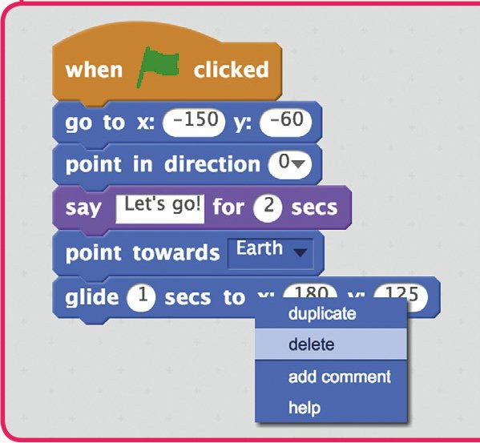

- [ ] După ce ai scos blocul `glide`, adaugă în loc un bloc `move` (mișcă-te) în interiorul unui bloc `repeat`. Acest cod va mișca nava puțin câte puțin, de multe ori!

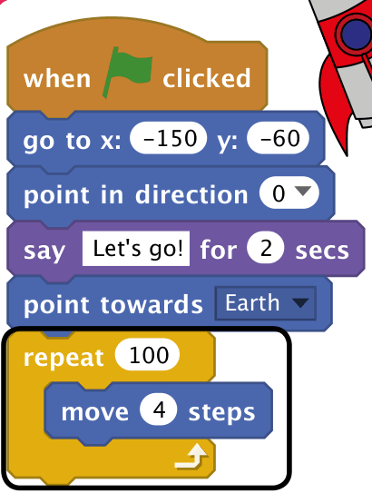

> **SFAT: BLOCURILE REPEAT**
> Un bloc `repeat` rulează codul din interiorul lui în mod repetat, de un anumit număr de ori, sau până când este îndeplinită o anumită condiție. Repetarea codului de multe ori se numește uneori „buclă” (*loop*), pentru că, atunci când ajunge la sfârșit, codul se întoarce la începutul blocului `repeat`. Un bloc `forever` repetă la nesfârșit codul din interiorul lui.

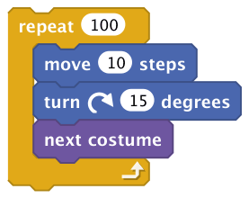

- [ ] Dacă apeși pe steagul verde ca să încerci acest cod nou, vei vedea că face aproape același lucru ca înainte.

> ✏️ În noul tău cod, de câte ori se mișcă nava spațială? ______
> Câți pași se mișcă nava de fiecare dată? ______

- [ ] Poți adăuga mai mult cod în bucla ta, ca să schimbi felul în care arată nava în timp ce se mișcă. Adaugă blocul `next costume` (costumul următor), din categoria **Looks**, ca să schimbi în mod repetat costumul navei în timp ce se mișcă.

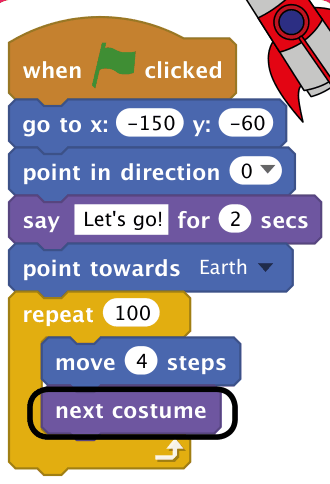

- [ ] Apasă pe steagul verde ca să testezi noua animație.
- [ ] Pe lângă schimbarea costumului navei, ai putea să o faci să pară că se micșorează pe măsură ce se mișcă spre Pământ.

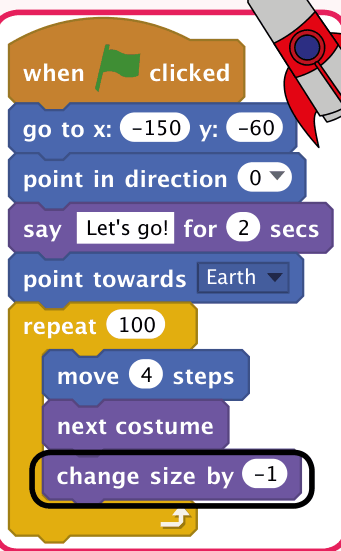

> **TESTEAZĂ-ȚI PROIECTUL**
> Nava ta spațială ar trebui să se micșoreze încet în timp ce se mișcă spre Pământ.
>
> Ce se întâmplă dacă apeși pe steag a doua oară? Pornește nava cu mărimea potrivită? Poate observi și că uneori nava pornește cu costumul greșit.
>
> Poți adăuga aceste blocuri la începutul animației, ca să rezolvi problema?

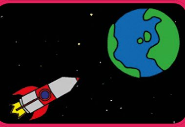

> **DEPANARE: REPARĂ-ȚI CODUL**
> Problemele din codul tău se numesc „bug-uri” (gândaci), iar găsirea și repararea lor se numește „depanare” (*debugging*). Când scrii cod, s-ar putea să constați des că proiectele tale nu fac din prima ce vrei tu.
>
> Să ai un bug în cod nu e nimic îngrijorător: li se întâmplă programatorilor tot timpul! De fapt, repararea bug-urilor e un moment grozav ca să înveți mai multe despre programare și despre cum funcționează proiectul tău.

## Pasul 3: Maimuța plutitoare

*Acum vom adăuga în animație o maimuță, care e pierdută în spațiu!*

- [ ] Să începem făcând maimuța să semene mai mult cu un astronaut! Apasă pe personajul **Monkey** (maimuță) și apoi pe fila **Costumes**. Apasă pe unealta **Ellipse** (elipsă) din editorul de desen și alege o culoare care să se vadă pe fundalul scenei.

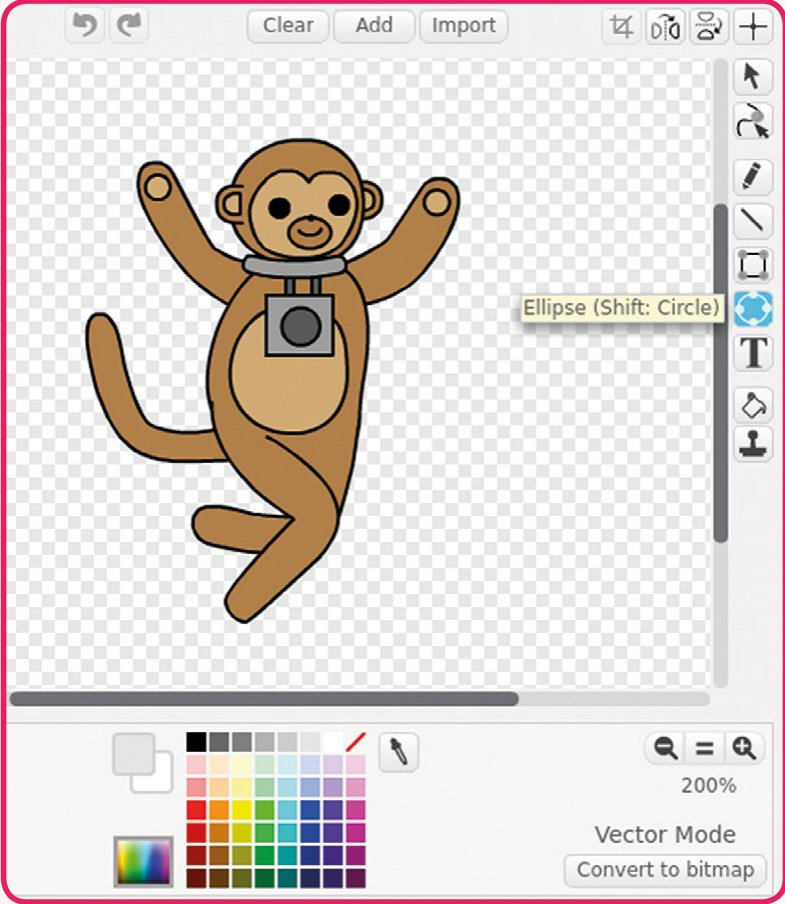

- [ ] Folosește unealta Ellipse ca să desenezi o cască de astronaut în jurul capului maimuței, apăsând și trăgând cu mouse-ul.

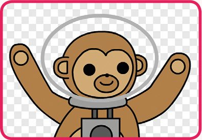

- [ ] Apoi apasă pe fila **Scripts** și adaugă cod maimuței, ca să se rotească încet în cerc, la nesfârșit.

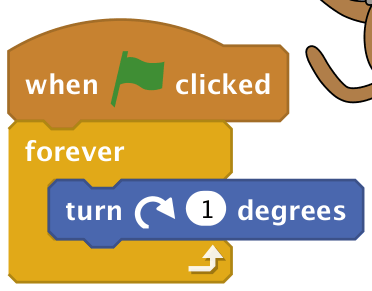

> **TESTEAZĂ-ȚI PROIECTUL**
> Apasă pe steag ca să testezi personajul maimuță. Pentru că ai programat animația să ruleze la nesfârșit, va trebui să apeși pe butonul roșu de oprire (de lângă steagul verde) ca să oprești animația.

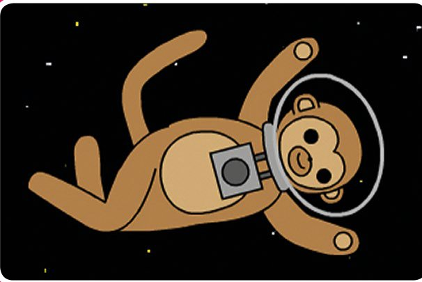

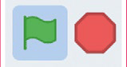

> **PROVOCARE: ÎMBUNĂTĂȚEȘTE ANIMAȚIA MAIMUȚEI**
> Poți face personajul maimuță să se rotească mai repede? Poți face personajul să se micșoreze în timp ce se rotește, ca să pară că plutește tot mai departe?
>
> 

<b>INDICIU</b> (apasă ca să îl vezi)

>
> Schimbă numărul din blocul `turn` (rotește-te) ca să schimbi viteza cu care se rotește maimuța, și folosește un bloc `change size` (schimbă mărimea) ca să micșorezi maimuța, exact cum ai făcut cu nava spațială.
> 

## Pasul 4: Asteroizi săltăreți

*Hai să adăugăm în animație niște roci spațiale plutitoare.*

- [ ] Apasă pe personajul **Asteroid** și adaugă acest cod, ca să faci asteroidul să ricoșeze prin ecran.

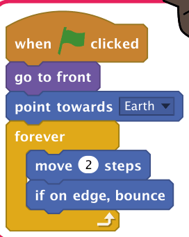

> **TESTEAZĂ-ȚI CODUL**
> Dacă apeși pe steagul verde ca să testezi animația asteroidului, ar trebui să îl vezi ricoșând prin scenă.

## Pasul 5: Steaua strălucitoare

*Să combinăm buclele ca să facem o stea strălucitoare.*

- [ ] Apasă pe personajul **Star** (stea) și adaugă acest cod, ca să faci steaua să se mărească încet și apoi să se micșoreze la loc.

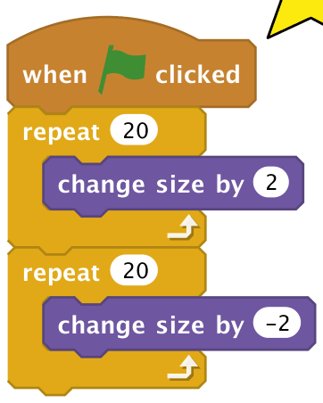

- [ ] Testează-ți codul: personajul stea ar trebui să se mărească încet și apoi să se micșoreze.
- [ ] Ca să faci steaua să își schimbe mărimea în mod repetat, poți adăuga un bloc `forever` în jurul codului.

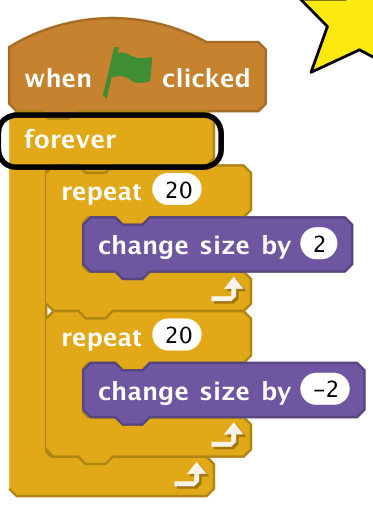

> **DEPANARE: DEPANAREA PERSONAJULUI STEA**
> Dacă personajul stea ajunge să fie prea mare sau prea mic, poți adăuga un bloc `set size` (setează mărimea) la începutul scriptului, ca să îi resetezi mărimea.

> **PROVOCARE: FĂ-ȚI PROPRIA ANIMAȚIE**
> După ce ai terminat animația spațială, apasă pe **File** și apoi pe **New** (nou), ca să începi un proiect nou. Folosește ce ai învățat în acest proiect ca să îți faci propria animație. Poate fi orice vrei tu, dar încearcă să potrivești animația cu decorul.

## Pierduți în spațiu: codul complet

### Nava spațială

Nava se lansează și apoi se îndreaptă spre Pământ.

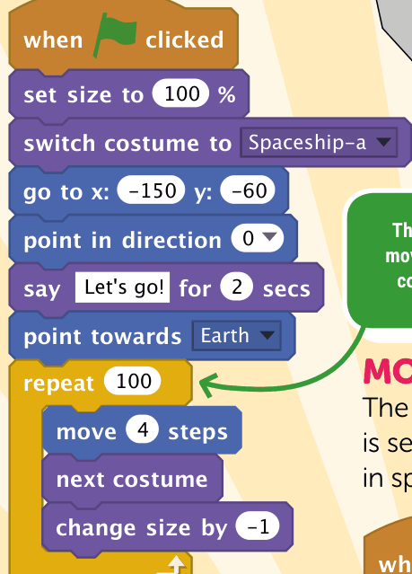

*Această buclă face nava să se miște în mod repetat, schimbându-și costumele și micșorându-se*

### Steaua

Steaua licărește pe cerul nopții.

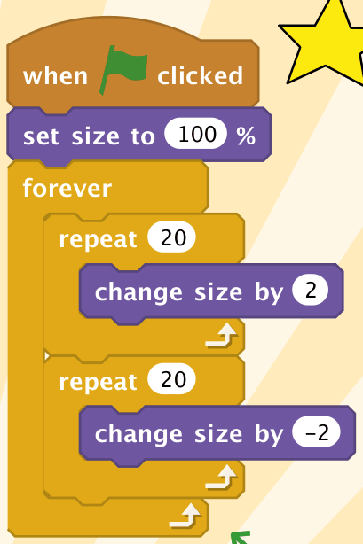

*Două bucle `repeat` fac steaua să se mărească, apoi să se micșoreze la loc*

### Maimuța

Maimuța-astronaut este programată să se rotească la nesfârșit în spațiu!

### Asteroidul

Această bucată de rocă spațială ricoșează prin ecran.

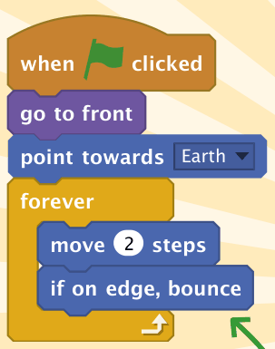

*Ori de câte ori personajul atinge marginea scenei, ricoșează*

> 🏅 **PROIECT TERMINAT!** Pierduți în spațiu: complet

## Acum ai putea face…

*Cu abilitățile pe care le-ai învățat, de ce nu ai încerca aceste proiecte?*

### Petrecere

Animează baloane și creează lumini de discotecă multicolore. Ai putea crea chiar și niște muzică de petrecere.

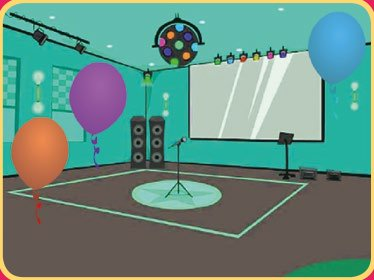

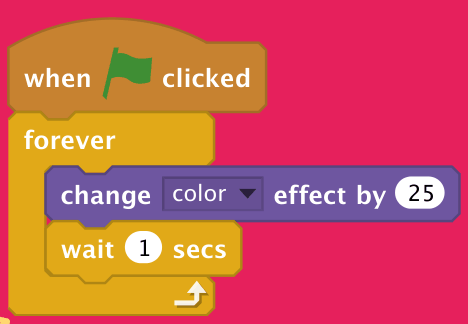

### Personaje care merg

Unele personaje, cum ar fi „Pico walking”, au un set de costume pentru crearea unei animații de mers.

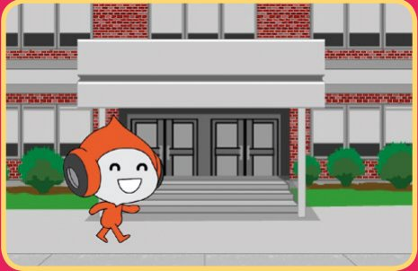

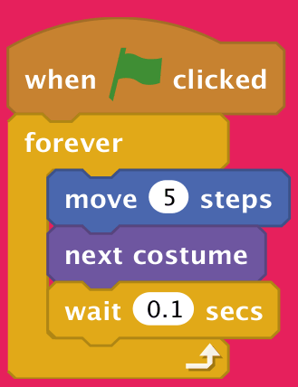

### Pași de dans

Programează un personaj să danseze pe muzică, schimbându-i costumele și mișcându-l pe scenă.

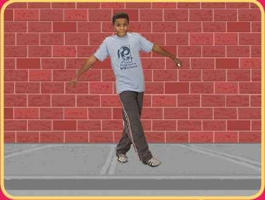

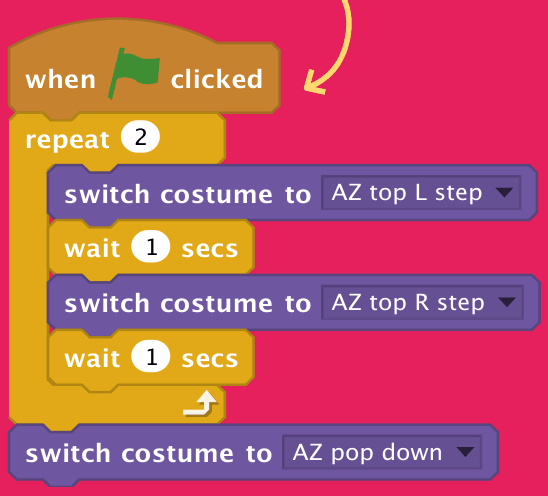

> 🤖 *Vrei să programezi un joc cu fantome? Treci la capitolul următor, dacă ai curaj…*

## Joc: Pierduți în spațiu

Poți găsi toate cuvintele din grilă, inclusiv o maimuță pierdută? Răspunsurile sunt în capitolul „Soluțiile jocurilor”.

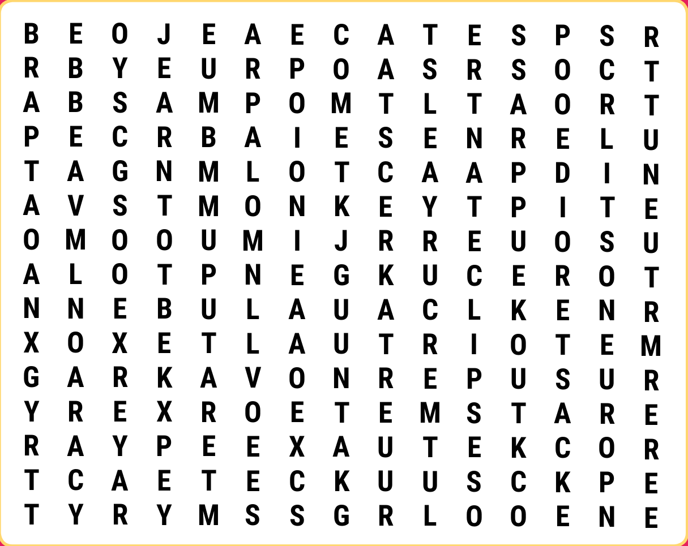

**Cuvinte de găsit** (în engleză, așa cum apar în grilă): ASTEROID (asteroid), COMET (cometă), ECLIPSE (eclipsă), GALAXY (galaxie), JUPITER (Jupiter), MERCURY (Mercur), METEOR (meteor), MONKEY (maimuță), MOON (Lună), NEBULA (nebuloasă), PLANET (planetă), ROCKET (rachetă), SATURN (Saturn), STAR (stea), SUPERNOVA (supernovă).
