# Capitolul 5 – Vânătorul de fantome

> *Creează un joc de prins fantome, în care jucătorii câștigă puncte apăsând pe personaje în timp ce acestea se mișcă pe scenă*

> 🤖 *Hai să prindem niște fantome! Distrează-te făcând propriul tău joc înfricoșător!*

Vei folosi o „variabilă” ca să ții evidența scorului jucătorului, pe măsură ce câștigă (și pierde) puncte. Vei crea și un cronometru, ca jucătorii să fie într-o cursă contra timp.

> **CE VEI ÎNVĂȚA**
> - Variabile
> - Numere aleatorii

> **SFAT: FIȘIERELE PROIECTELOR**
> Ca să descarci o arhivă zip cu toate fișierele proiectelor Scratch 2 (.sb2) din această carte, intră pe: [rpf.io/book-s1-assets](https://rpf.io/book-s1-assets)

## Proiectul terminat

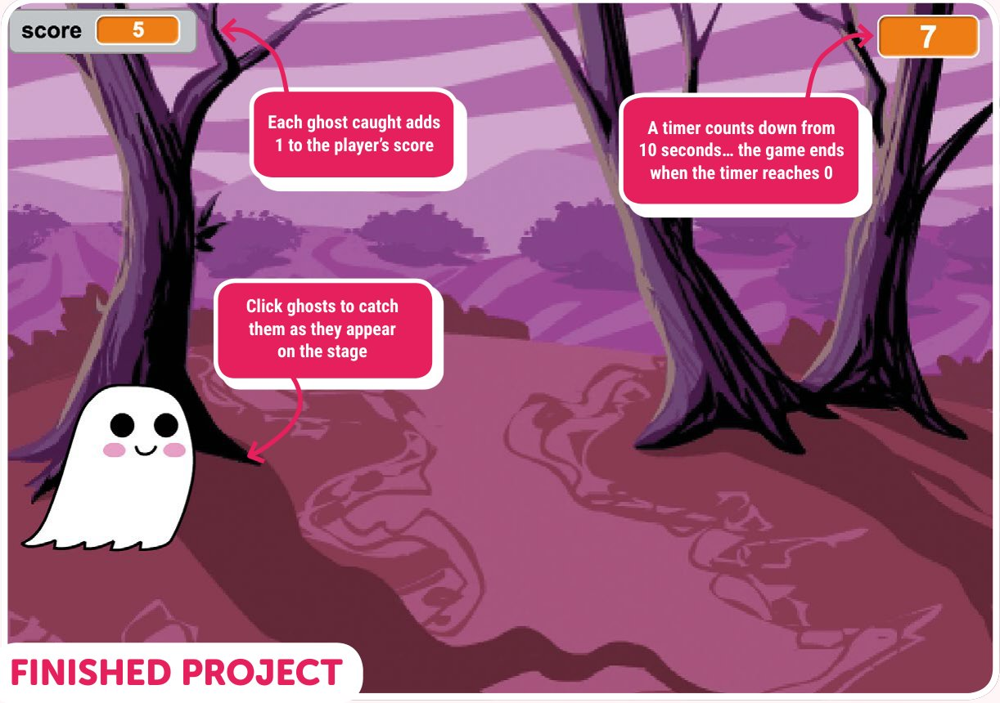

- Fiecare fantomă prinsă adaugă 1 la scorul jucătorului
- Un cronometru numără invers de la 10 secunde… jocul se termină când cronometrul ajunge la 0
- Apasă pe fantome ca să le prinzi, pe măsură ce apar pe scenă

## Pasul 1: Animează o fantomă

*Să începem animând o fantomă.*

- [ ] Deschide un browser și intră pe [rpf.io/book-ghostcatcher](https://rpf.io/book-ghostcatcher) ca să deschizi proiectul „Ghost Catcher”.
- [ ] Apasă pe personajul **Ghost** (fantomă) și adaugă cod ca să o faci să apară și să dispară în mod repetat, la nesfârșit.

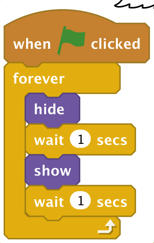

> **TESTEAZĂ-ȚI PROIECTUL**
> Apasă pe steagul verde ca să îți testezi codul. Ar trebui să vezi fantoma apărând și dispărând în fiecare secundă.

## Pasul 2: Fantome aleatorii

*Mișcă fantoma pe scenă, ca să fie mai greu de prins!*

- [ ] În loc să stea în același loc, poți lăsa Scratch să aleagă o poziție aleatorie pentru personajul fantomă, înainte ca ea să apară de fiecare dată.

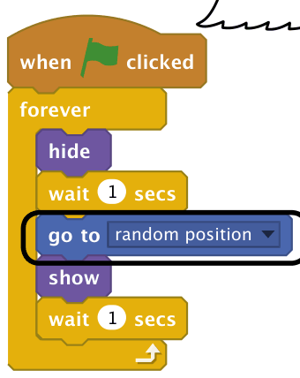

- [ ] Testează-ți codul. Se mișcă personajul fantomă pe scenă?
- [ ] Fantoma ta așteaptă mereu exact 1 secundă înainte să apară și să dispară. Ca să schimbi asta, ia un bloc `pick random` (alege la întâmplare) din categoria verde **Operators** (operatori) și pune-l în interiorul primului bloc `wait` (așteaptă), în locul lui 1.

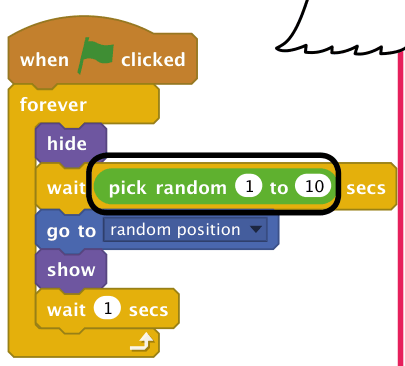

- [ ] Fantoma ta va aștepta acum între 1 și 10 secunde înainte să apară, ceea ce e mult! Schimbă numerele din blocul `pick random` până când ești mulțumit de cât de des apare fantoma.

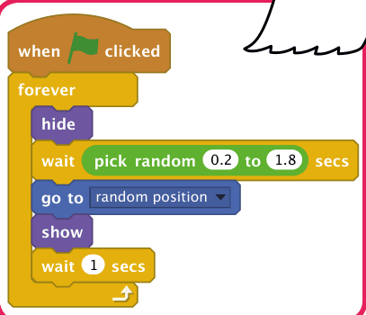

> **PROVOCARE: MAI MULTĂ ÎNTÂMPLARE**
> Poți face fantoma să apară pe ecran pentru o durată aleatorie? Poți face fantoma să aibă o mărime aleatorie de fiecare dată când apare?
>
> 

<b>INDICIU</b> (apasă ca să îl vezi)

>
> Va trebui să adaugi încă un bloc `pick random` în al doilea bloc `wait`. Pentru o mărime aleatorie a fantomei, adaugă un bloc `pick random` într-un bloc `set size to` (setează mărimea la).
> 

## Pasul 3: Prinderea fantomelor

*Hai să îi permitem jucătorului să prindă fantome!*

- [ ] Adaugă cod care să îi permită jucătorului să prindă o fantomă.

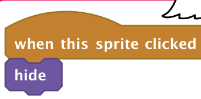

- [ ] Testează-ți proiectul. Poți prinde fantomele pe măsură ce apar pe scenă?

> **SFAT: MODUL ECRAN COMPLET**
> Dacă ți se pare greu să prinzi fantomele, poți juca jocul în modul ecran complet, apăsând pe butonul de deasupra scenei.

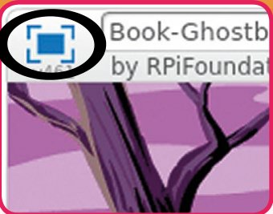

> **PROVOCARE: ADAUGĂ UN SUNET**
> Poți reda un sunet de fiecare dată când este prinsă o fantomă?
>
> 

<b>INDICIU</b> (apasă ca să îl vezi)

>
> Va trebui să adaugi un bloc `play sound` (redă sunetul) în scriptul tău `when this sprite clicked`.
> 

## Pasul 4: Adaugă un scor

*Hai să facem lucrurile mai interesante, ținând scorul.*

- [ ] Ca să ții scorul jucătorului, va trebui să creezi o variabilă. Apasă pe categoria portocalie **Data** (date) din paleta de blocuri și apoi pe **Make a Variable** (creează o variabilă).

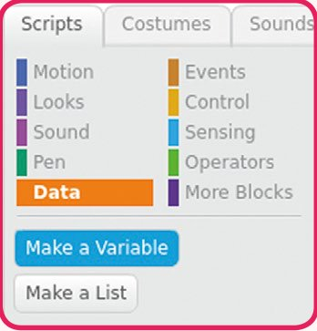

> **SFAT: VARIABILE**
> O variabilă este un loc din memoria calculatorului în care se păstrează date, cum ar fi numere sau text. Fiecare variabilă primește un nume, ca datele păstrate să poată fi accesate și schimbate mai târziu.

- [ ] Scrie **score** (scor) ca nume al variabilei, asigură-te că este disponibilă pentru toate personajele (**For all sprites**) și apasă pe OK ca să o creezi.

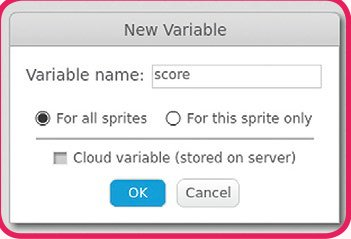

- [ ] Ar trebui să vezi acum o mulțime de blocuri de cod care pot fi folosite cu variabila ta `score`.

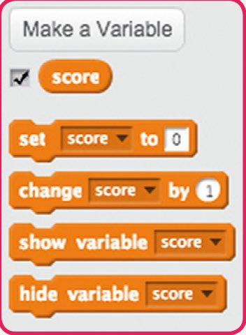

- [ ] Vei vedea și scorul în stânga sus a scenei.

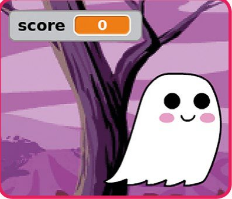

- [ ] Când începe un joc nou (apăsând pe steag), ar trebui să setezi scorul jucătorului la 0. Adaugă acest cod Scenei (**Stage**), ca să setezi scorul la începutul jocului.

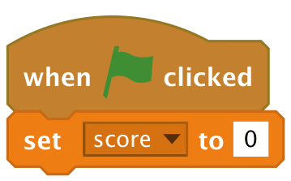

- [ ] Ori de câte ori este prinsă o fantomă, trebuie să adaugi 1 la scorul jucătorului. Adaugă acest cod personajului fantomă.

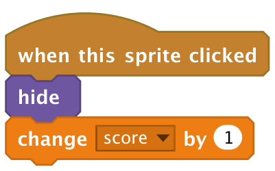

> **TESTEAZĂ-ȚI PROIECTUL**
> Testează-ți programul și încearcă să prinzi câteva fantome. Se schimbă scorul de fiecare dată când apeși pe o fantomă?

## Pasul 5: Adaugă un cronometru

*Poți face jocul mai interesant dându-i jucătorului doar 10 secunde ca să prindă cât mai multe fantome.*

- [ ] Poți folosi o altă variabilă ca să păstrezi timpul rămas. Creează o variabilă nouă, numită **time** (timp).

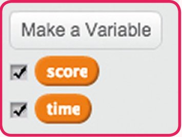

- [ ] Iată cum ar trebui să funcționeze cronometrul:
  - Cronometrul ar trebui să pornească de la 10 secunde;
  - Cronometrul ar trebui să numere invers, în fiecare secundă;
  - Jocul ar trebui să se oprească atunci când cronometrul ajunge la 0.

  Adaugă următorul script nou Scenei tale. Blocul `=` se găsește în categoria **Operators**.

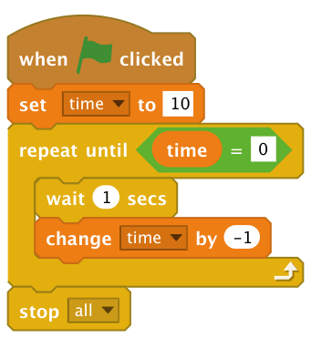

- [ ] Trage afișajul variabilei `time` în partea dreaptă a scenei. Poți și să apeși clic dreapta pe afișajul variabilei și să alegi **large readout** (afișaj mare), ca să schimbi felul în care este afișat timpul.

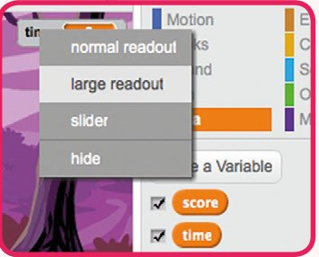

> **PROVOCARE: MAI MULTĂ ÎNTÂMPLARE**
> Roagă un prieten să îți testeze jocul. Schimbă numerele din joc, dacă i s-a părut prea ușor sau prea greu. Ce numere ai ales?
>
> 

<b>INDICIU</b> (apasă ca să îl vezi)

>
> Dă-i jucătorului mai puțin timp. Fă fantomele să apară mai rar. Fă fantomele mai mici.
> 

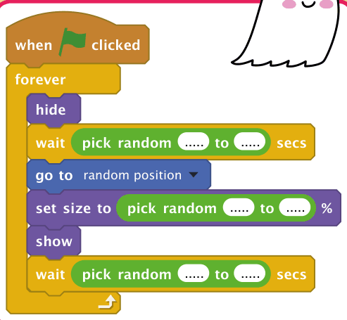

> **PROVOCARE: MAI MULTE OBIECTE**
> Poți adăuga alte obiecte în joc? Poți apăsa clic dreapta pe personajele din lista de personaje și alege **show** (arată), ca să le faci să apară pe scenă. Nu trebuie însă să folosești acele personaje: poți adăuga orice alte personaje vrei din biblioteca Scratch.
>
> Înainte să începi, ai putea completa tabelul de mai jos.

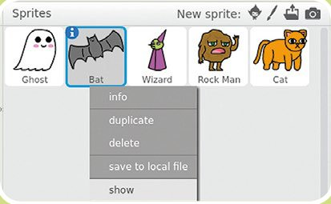

| Personaj | Ce mărime va avea? | Cât de des va apărea? | Ce se întâmplă când a fost prins? | Câte puncte câștigi (sau pierzi) când îl prinzi? |
|---|---|---|---|---|
| FANTOMA | Între 40% și 80% | La fiecare 0,2–1,8 secunde | Se aude un sunet „pop” | 1 punct câștigat |
| | | | | |
| | | | | |
| | | | | |

## Joc: Intră în criptă!

Rezolvă indiciile diabolice ca să găsești monștrii. Pune-i în grilă, ca să descoperi o altă creatură înfiorătoare în pătratele colorate. Răspunsurile sunt în capitolul „Soluțiile jocurilor”.

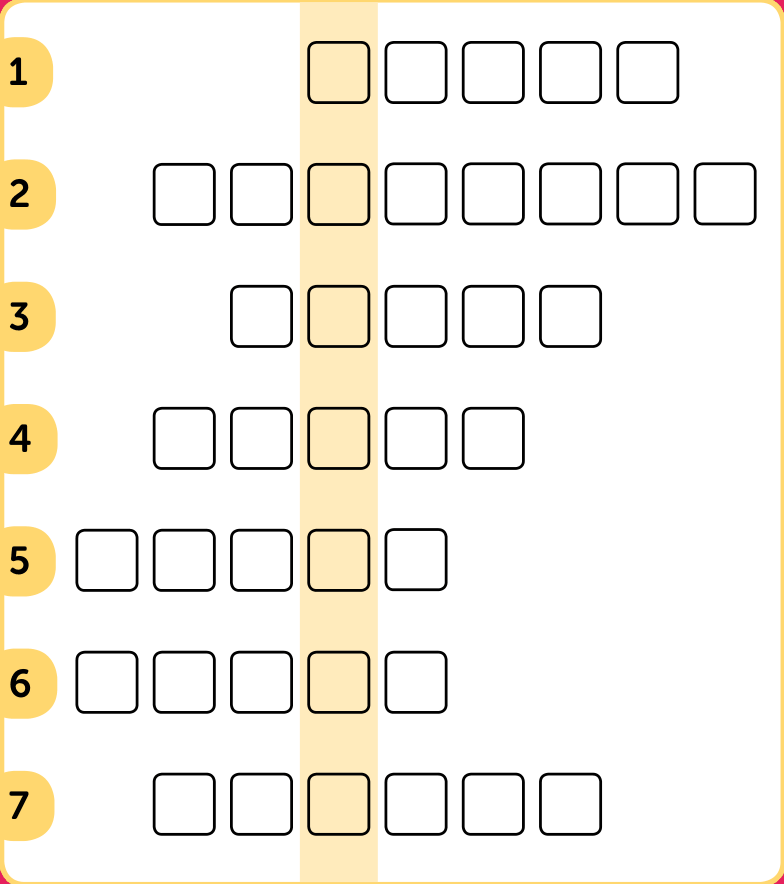

> **NOTA TRADUCĂTORULUI**
> Acesta este un joc de cuvinte în limba engleză: numele fiecărui monstru (în engleză) este ascuns în interiorul indiciului, pe litere consecutive. Am păstrat indiciile în engleză și am adăugat traducerea lor între paranteze.

**Indicii**

1. *Charming host conceals apparition* (Gazda fermecătoare ascunde o apariție) – 5 litere
2. *We're wolfing down food, hairy howler* (Înfulecăm mâncarea, urlător păros) – 8 litere
3. *Evil spirit hidden in crude montage* (Spirit malefic ascuns într-un montaj grosolan) – 5 litere
4. *Mum, my ancient Egyptian is bandaged* (Mamă, egipteanul meu antic e bandajat) – 5 litere
5. *Ugly cave dweller takes a stroll outdoors* (Locuitorul urât al peșterii face o plimbare afară) – 5 litere
6. *Rude, vile rascal with horns!* (Ticălos grosolan și josnic, cu coarne!) – 5 litere
7. *'I've got a bun! Yippee!' yelled Australian swamp monster* („Am o chiflă! Ura!”, a strigat monstrul australian de mlaștină) – 6 litere

Creatura ascunsă este un… ______________

<b>INDICIU</b> (apasă ca să îl vezi)

Toate răspunsurile sunt ascunse în interiorul indiciilor: uită-te cu atenție la literele consecutive și le vei găsi!

## Vânătorul de fantome: codul complet

### Scena

Scripturile scenei resetează scorul la zero și se ocupă de cronometru.

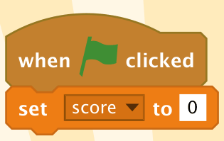

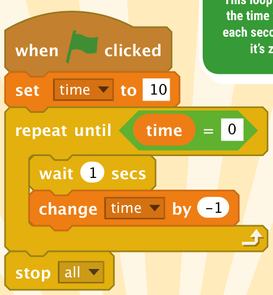

*Această buclă scade variabila `time` în fiecare secundă, până ajunge la zero*

### Fantoma

Personajul fantomă are două scripturi: unul care o face să apară într-o poziție aleatorie și altul prin care jucătorul o „prinde”.

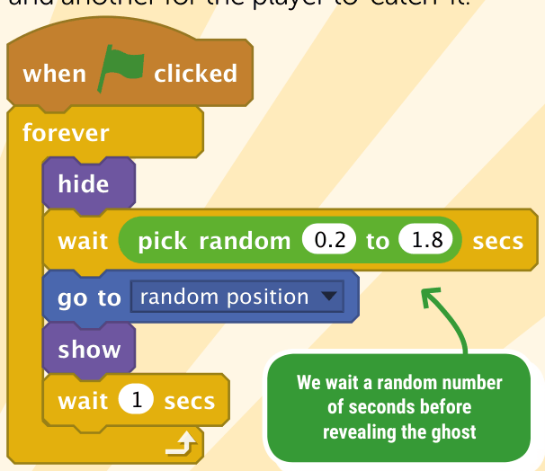

*Așteptăm un număr aleatoriu de secunde înainte să dezvăluim fantoma*

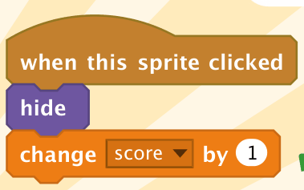

*Când jucătorul apasă pe fantomă, se adaugă 1 la scor*

> 🏅 **PROIECT TERMINAT!** Vânătorul de fantome: complet

## Acum ai putea face…

*Cu noile tale abilități de programare, ai putea încerca aceste proiecte…*

### Aplicație de vot

Creează un personaj și o variabilă pentru fiecare opțiune, și lasă-ți prietenii să voteze preferatul! Ai putea adăuga chiar și un buton de resetare, care să pună voturile înapoi la zero.

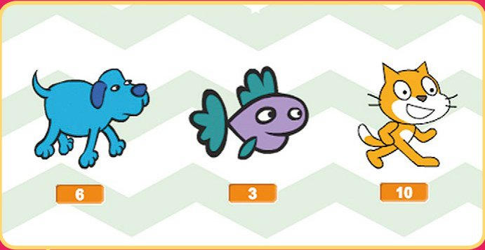

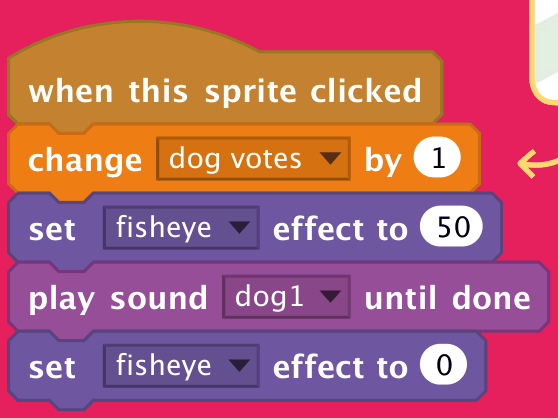

### Alegerea jucătorului

Permite-le jucătorilor să aleagă la întâmplare un personaj, schimbându-i aleatoriu costumul atunci când se apasă pe personaj.

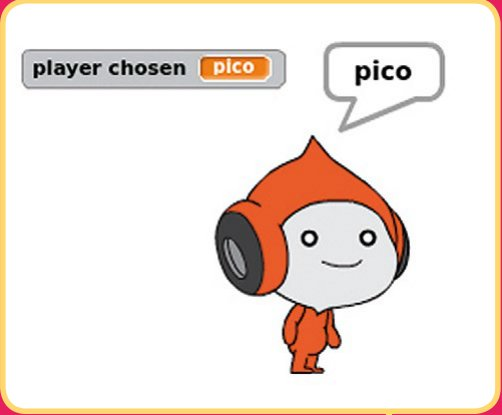

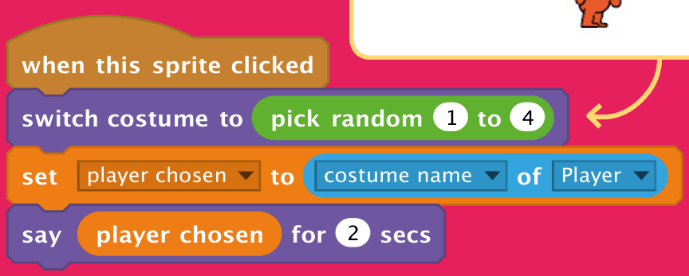

### Artă aleatorie

Folosește blocuri `pick random` împreună cu blocuri din categoria **Pen** (creion), ca să creezi opere de artă unice!

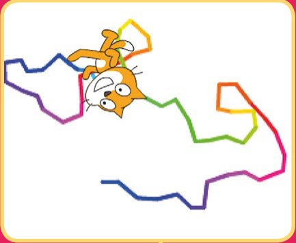

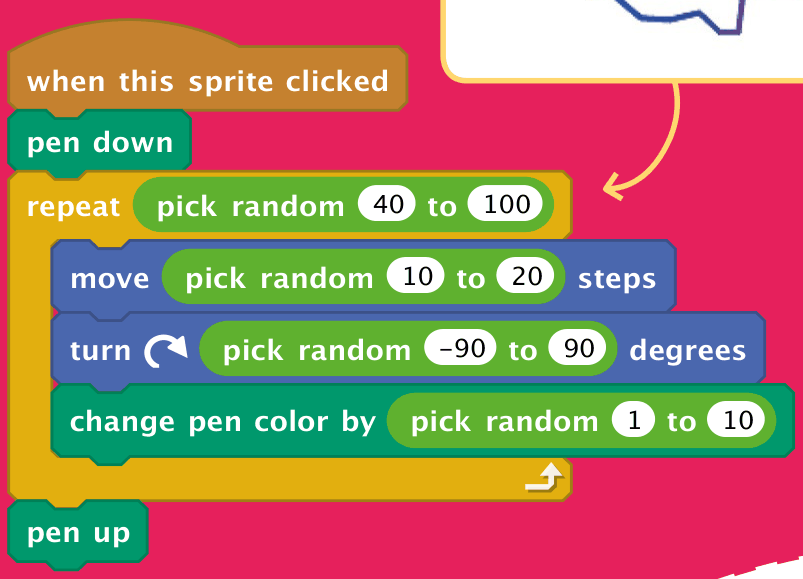

> 🤖 *Ai nevoie să vorbești cu cineva? Treci la capitolul următor ca să creezi un chatbot…*
