# Capitolul 6 – Chatbot

> *Creează-ți propriul personaj vorbitor, care pune întrebări și răspunde la răspunsurile pe care i le dai*

> 🤖 *Programează-ți propriul chatbot! E ca și cum ai vorbi cu o persoană adevărată!*

Vei învăța cum să adaugi „selecție” în codul tău, folosind blocurile `if` (dacă) și `if…else` (dacă… altfel), ca să schimbi felul în care răspunde personajul tău, în funcție de răspunsurile primite.

> **CE VEI ÎNVĂȚA**
> - Selecția (blocurile `if` și `if…else`)
> - Introducerea de la tastatură, cu blocul `ask` (întreabă)
> - Folosirea blocului `join` (unește) ca să lipești bucăți de text

> **SFAT: FIȘIERELE PROIECTELOR**
> Ca să descarci o arhivă zip cu toate fișierele proiectelor Scratch 2 (.sb2) din această carte, intră pe: [rpf.io/book-s1-assets](https://rpf.io/book-s1-assets)

## Proiectul terminat

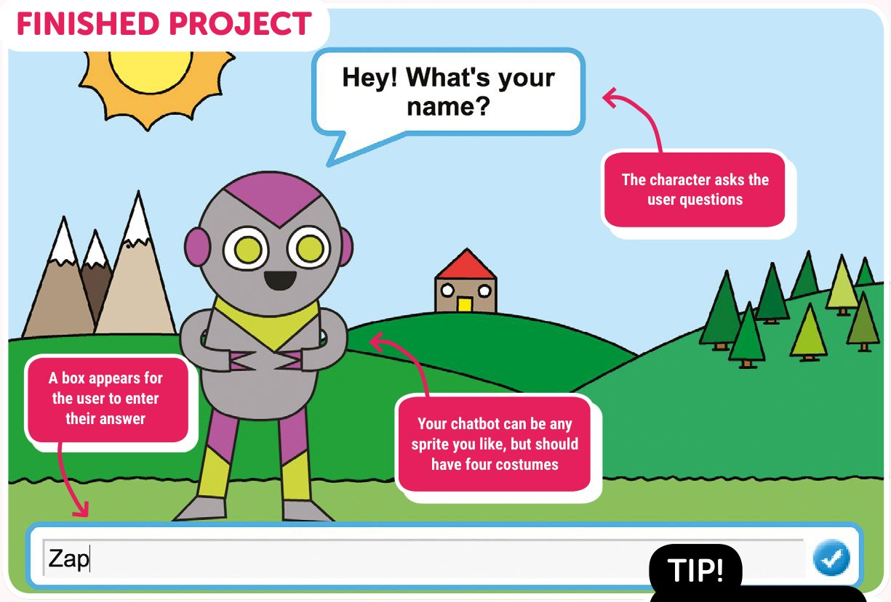

- Personajul îi pune utilizatorului întrebări
- Apare o casetă în care utilizatorul își scrie răspunsul
- Chatbotul tău poate fi orice personaj vrei, dar ar trebui să aibă patru costume

## Pasul 1: Chatbotul tău

*Alege personalitatea și înfățișarea personajului tău.*

- [ ] Înainte să începi să îți faci chatbotul, trebuie să îi hotărăști personalitatea. Gândește-te:
  - Cum îl cheamă?
  - Unde locuiește?
  - E vesel? serios? amuzant? timid? prietenos?
  - Ce îi place și ce nu îi place?
- [ ] Deschide un browser și intră pe [rpf.io/book-chatbot](https://rpf.io/book-chatbot) ca să deschizi proiectul „Chatbot”. Apasă pe butonul **Remix**.
- [ ] În lista de personaje sunt două personaje: **Chatter** și **Natter**. Dacă preferi să folosești personajul Natter, poți apăsa clic dreapta pe el și alege **show** (arată). Poți apăsa clic dreapta și ca să ascunzi personajul Chatter.

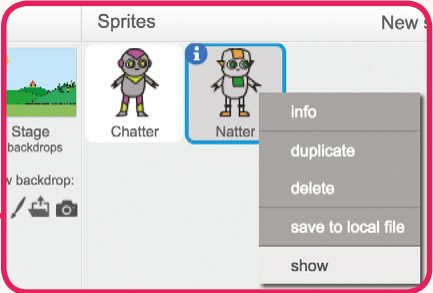

> **SFAT: ALEGE-ȚI PROPRIUL PERSONAJ**
> Dacă preferi, poți alege un alt personaj din biblioteca Scratch (sau chiar să îl desenezi tu). Pentru acest proiect, personajul folosit ar trebui să aibă patru costume, cum au personajele de mai jos.

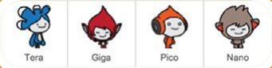

- [ ] Alege un fundal al scenei care să se potrivească cu personalitatea chatbotului. Există deja două din care poți alege, sau poți selecta un alt fundal din biblioteca Scratch. Noi rămânem la fundalul **Outside** (afară).

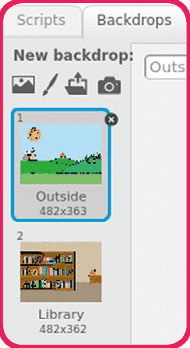

## Pasul 2: Un chatbot vorbitor

*Acum că ai un chatbot cu personalitate, hai să îl programăm să vorbească cu tine.*

- [ ] Apasă pe personajul tău chatbot și adaugă acest cod:

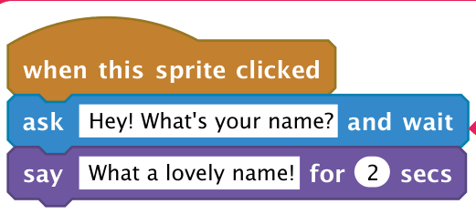

*Blocul `ask` așteaptă ca utilizatorul să scrie un răspuns*

- [ ] Apasă pe chatbot ca să îl testezi. Când ești întrebat cum te cheamă, scrie-ți numele în caseta din partea de jos a scenei.

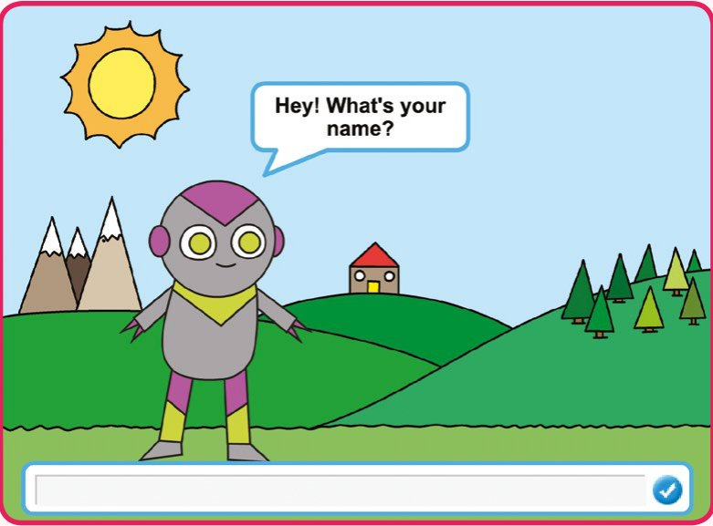

- [ ] Chatbotul tău răspunde pur și simplu „What a lovely name!” (Ce nume frumos!) de fiecare dată. Poți personaliza răspunsul chatbotului folosind răspunsul utilizatorului. Schimbă codul chatbotului, ca să arate așa:

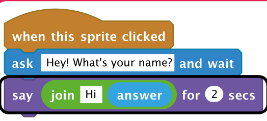

> **SFAT: COMBINAREA BLOCURILOR**
> Ca să creezi ultimul bloc din script, va trebui mai întâi să tragi un bloc verde `join` și să îl lași în blocul `say`. Apoi poți schimba textul „hello” în „Hi” și poți trage blocul albastru deschis `answer` (răspuns), din categoria **Sensing** (senzori), peste textul „world”.
>
> Dacă vrei să adaugi text după răspuns, poți folosi încă un bloc `join` în al doilea câmp al primului.

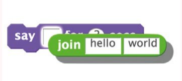

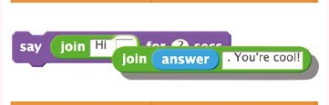

> **DEPANARE: FUNCȚIONEAZĂ?**
> Testează acest program nou. Funcționează cum te aștepți? Poți repara problemele pe care le observi?
>
> 

<b>INDICIU</b> (apasă ca să îl vezi)

>
> Poți încerca să adaugi un spațiu pe undeva!
> 

- [ ] Dacă păstrezi răspunsul într-o variabilă, îl vei putea folosi în tot proiectul. Creează o variabilă nouă, numită **name** (nume).

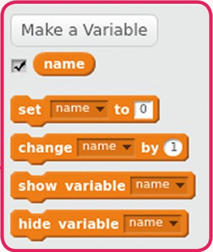

- [ ] Ar trebui să vezi noua variabilă și în stânga sus a scenei.

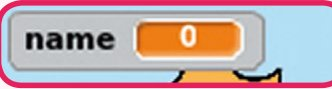

- [ ] După ce ai creat noua variabilă, modifică codul chatbotului, ca să arate așa:

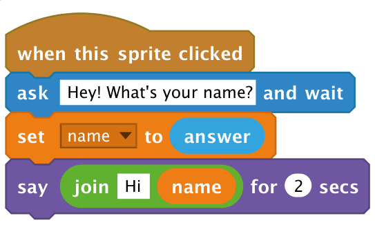

- [ ] Dacă îți testezi din nou programul, vei observa că răspunsul este păstrat în variabila `name` și este arătat în stânga sus a scenei. (Ca să îl ascunzi, debifează pur și simplu căsuța de lângă `name` din paleta de blocuri.)

> **PROVOCARE: MAI MULTE ÎNTREBĂRI**
> Poți programa chatbotul să pună încă o întrebare? Poți păstra răspunsul într-o variabilă?
>
> 

<b>INDICIU</b> (apasă ca să îl vezi)

>
> Va trebui să folosești încă un bloc `ask` ca să pui altă întrebare, și încă o variabilă ca să păstrezi răspunsul.
> 

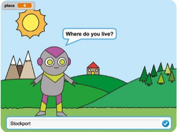

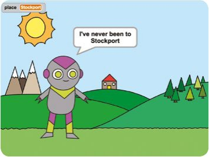

## Pasul 3: Luarea deciziilor

*Poți programa chatbotul să decidă ce să facă, în funcție de răspunsurile utilizatorului.*

- [ ] Hai să facem chatbotul să pună utilizatorului o întrebare cu răspuns da sau nu. Iată un exemplu, dar poți schimba întrebarea, dacă vrei:

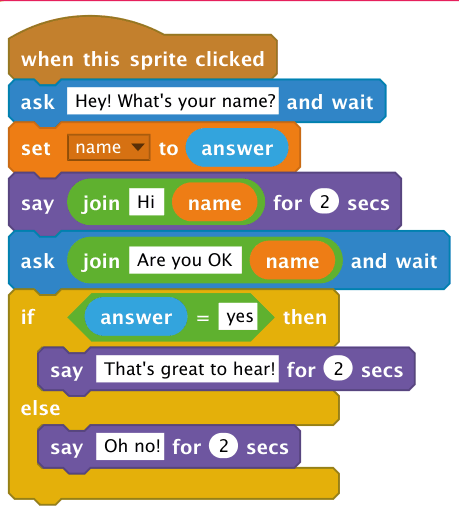

Observă că, acum că ai păstrat numele utilizatorului într-o variabilă, îl poți folosi de câte ori vrei.

> **SFAT: BLOCURILE IF ȘI IF…ELSE**
> Până acum, scripturile pe care le-ai scris au făcut exact același lucru de fiecare dată când au rulat. Blocurile `if` și `if…else` le permit scripturilor tale să decidă ce să facă în continuare.
>
> Un bloc `if` include o condiție, iar codul din interiorul blocului `if` rulează doar dacă acea condiție este adevărată. Dacă este falsă (nu e adevărată), codul din interiorul blocului `if` este sărit.

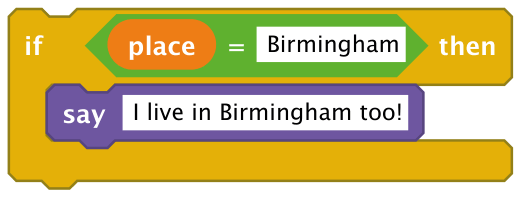

> Un bloc `if…else` va rula întotdeauna fie primul, fie al doilea set de blocuri. Dacă condiția este adevărată, rulează primul set de blocuri. Dacă este falsă, rulează în schimb al doilea set.

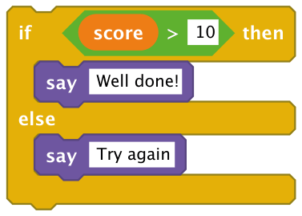

- [ ] Dacă îți testezi codul, vei vedea că acum primești un răspuns când răspunzi cu yes (da) sau no (nu). Chatbotul ar trebui să răspundă „That's great to hear!” (Mă bucur să aud asta!) când răspunzi yes (nu contează dacă scrii cu litere mari sau mici), dar va răspunde „Oh no!” (Vai, nu!) dacă scrii orice altceva.

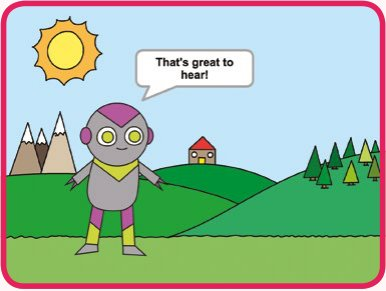

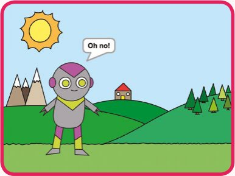

- [ ] Poți pune orice cod în interiorul unui bloc `if` sau `else`, nu doar cod care să facă chatbotul să vorbească. De exemplu, poți schimba costumul chatbotului, ca să se potrivească cu răspunsul. Dacă te uiți la costumele chatbotului, ar trebui să vezi că sunt patru. (Dacă nu, poți oricând să adaugi tu altele!)

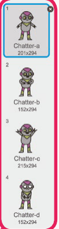

- [ ] Poți folosi aceste costume ca parte a răspunsului chatbotului, adăugând acest cod:

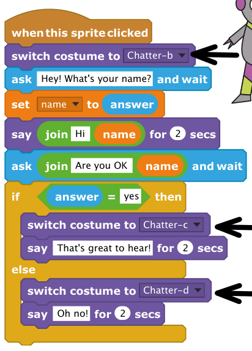

> **TESTEAZĂ-ȚI PROIECTUL**
> Testează-ți programul și ar trebui să vezi cum fața chatbotului se schimbă în funcție de răspunsul pe care i-l dai.

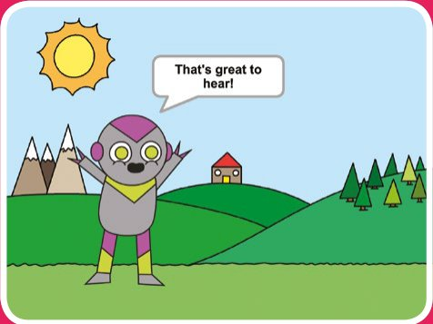

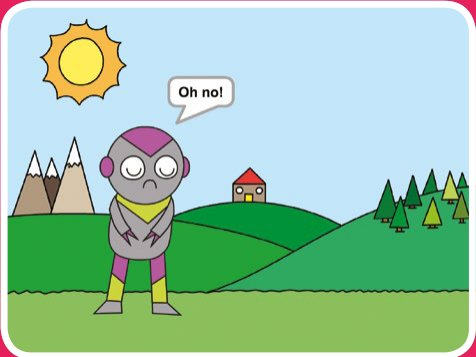

> **PROVOCARE: MAI MULTE DECIZII**
> Programează chatbotul să pună încă o întrebare, ceva cu răspuns da sau nu. Poți face chatbotul să reacționeze la răspuns?
>
> 

<b>INDICIU</b> (apasă ca să îl vezi)

>
> Va trebui să adaugi încă un bloc `ask`, cu încă un bloc `if…else` care să reacționeze la răspuns.
> 

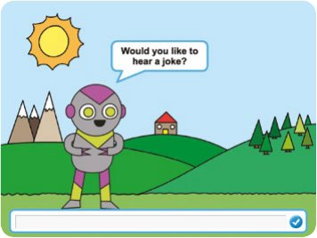

## Pasul 4: Schimbarea locului

*Poți programa chatbotul și să își schimbe locul.*

- [ ] Apasă pe scenă și apoi pe fila **Backdrops** (fundaluri). Ar trebui să vezi că scena are două fundaluri. Adaugă încă un fundal scenei, dacă vezi doar unul.

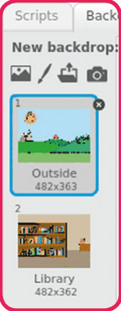

- [ ] Acum poți programa chatbotul să își schimbe locul, adăugându-i acest cod:

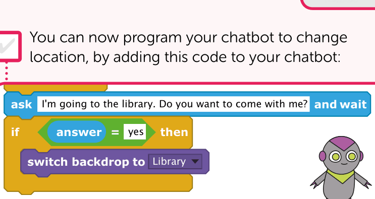

- [ ] Trebuie să te asiguri și că chatbotul este în locul lui original când începi să vorbești cu el. Adaugă acest bloc la începutul codului chatbotului:

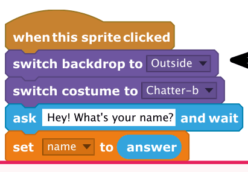

- [ ] Testează-ți programul și răspunde yes când ești întrebat dacă vrei să mergi la bibliotecă. Ar trebui să vezi că locul chatbotului s-a schimbat.

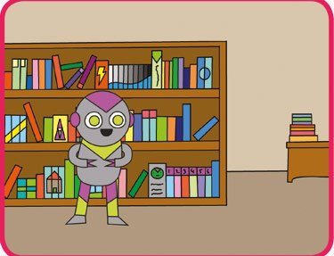

> ✏️ Își schimbă chatbotul locul dacă scrii **no**? Dar dacă scrii **I'm not sure** (nu sunt sigur)?

- [ ] Poți adăuga și acest cod în interiorul blocului `if`, ca să faci chatbotul să sară în sus și în jos de patru ori, dacă răspunsul este yes:

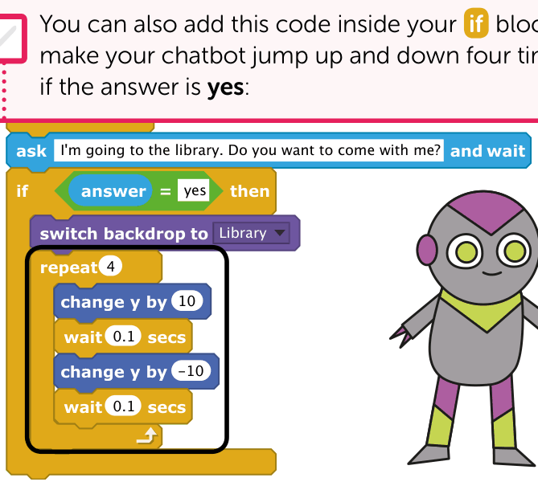

- [ ] Testează-ți din nou codul. Sare chatbotul în sus și în jos dacă răspunzi yes?

> **PROVOCARE: FĂ-ȚI PROPRIUL CHATBOT**
> Programează chatbotul să pună încă o întrebare, ceva cu răspuns da sau nu. Poți face chatbotul să reacționeze la răspuns?
>
> După ce ai terminat de făcut chatbotul, pune-ți prietenii să poarte o conversație cu el! Le place personajul tău? Au observat vreo problemă?
>
> Desenează propriul tău personaj și fă-i o poză, ca să îl folosești în proiectul tău Scratch!

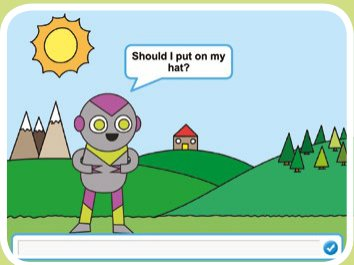

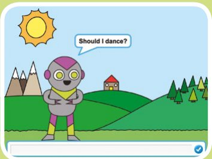

## Chatbot: codul complet

### Chatter

Robotul Chatter pune întrebări și reacționează la răspunsuri.

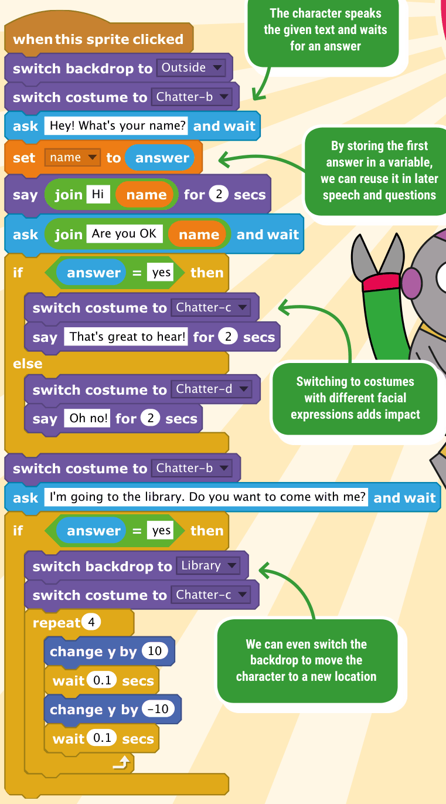

- Personajul rostește textul dat și așteaptă un răspuns
- Păstrând primul răspuns într-o variabilă, îl putem refolosi în vorbirea și întrebările următoare
- Trecerea la costume cu expresii diferite ale feței dă mai mult efect
- Putem chiar să schimbăm fundalul, ca să mutăm personajul într-un loc nou

> 🏅 **PROIECT TERMINAT!** Chatbot: complet

## Acum ai putea face…

*Cu abilitățile pe care le-ai învățat, încearcă să faci aceste proiecte…*

### Quiz

Creează un quiz care pune întrebări și verifică dacă răspunsul jucătorului este corect. Se adaugă un punct la scorul jucătorului dacă răspunde corect la o întrebare.

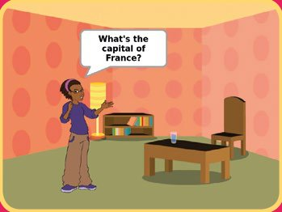

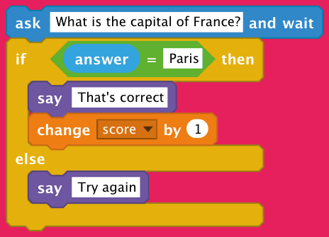

### Aplicație de desenat

Folosește mouse-ul ca să desenezi pe scenă! Personajul ascuns va urmări cursorul mouse-ului, iar creionul desenează doar dacă butonul mouse-ului este apăsat.

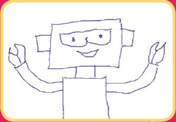

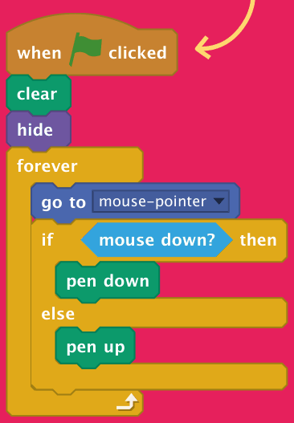

### Joc de ghicit

Se alege la întâmplare un număr între 1 și 100, iar jucătorul trebuie să încerce să ghicească numărul ales. Ai putea chiar să adaptezi jocul ca să țină evidența numărului de încercări, ca să te poți întrece cu prietenii.

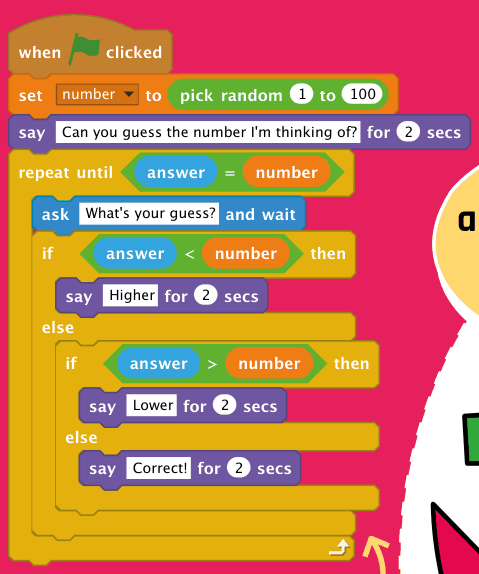

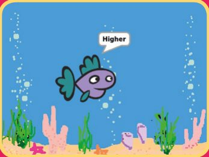

> 🤖 *Vrei să înveți despre coordonate? Treci la capitolul următor ca să faci un joc distractiv…*
