# Capitolul 7 – La țintă

> *Învață cum funcționează coordonatele în Scratch, cu un joc distractiv*

> 🤖 *Fă un joc de tras la țintă! Ochește bine și învață să folosești coordonatele!*

În acest capitol vei învăța cum funcționează grila de coordonate din Scratch, făcând un joc. Vei învăța cum să poziționezi cu precizie personajele pe scenă, folosind coordonatele x și y. Vei învăța și cum să lucrezi cu variabile de tip cursor (*slider*). Pregătește-te să lovești niște ținte!

> **CE VEI ÎNVĂȚA**
> - Coordonatele x și y
> - Poziționarea unui personaj
> - Intrări cu cursor (*slider*)

> **SFAT: FIȘIERELE PROIECTELOR**
> Ca să descarci o arhivă zip cu toate fișierele proiectelor Scratch 2 (.sb2) din această carte, intră pe: [rpf.io/book-s1-assets](https://rpf.io/book-s1-assets)

## Proiectul terminat

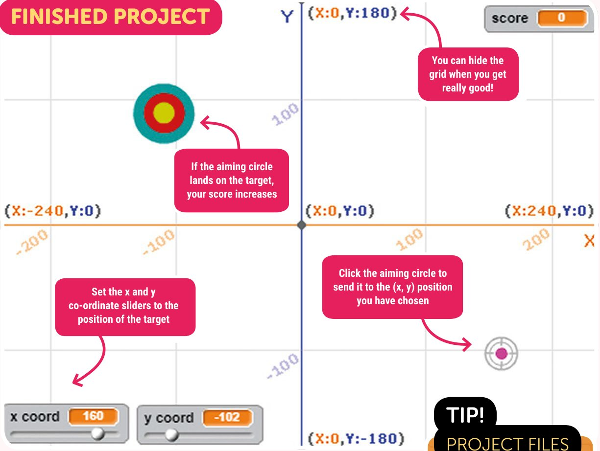

- Setează cursoarele coordonatelor x și y la poziția țintei
- Apasă pe cercul de ochire ca să îl trimiți la poziția (x, y) pe care ai ales-o
- Dacă cercul de ochire aterizează pe țintă, scorul tău crește
- Poți ascunde grila când devii foarte bun!

## Pasul 1: Grila de coordonate

*Să începem adăugând un fundal cu grila de coordonate.*

- [ ] Deschide un browser și intră pe [rpf.io/book-ontarget](https://rpf.io/book-ontarget) ca să deschizi proiectul Scratch „On Target”. Apasă pe **Remix**.

Proiectul conține două personaje: o țintă (**Target**), pe care încerci să o lovești, și un cerc de ochire (**Aim**), care se va muta la coordonatele pe care le alegi. Personajul țintă este ascuns la început; îl vei folosi mai târziu.

Scratch folosește coordonate ca să îți permită să poziționezi cu precizie personajele pe scenă. Există un fundal care te ajută să înțelegi grila de coordonate.

- [ ] Adaugă fundalul **xy-grid** proiectului tău (păstrează și fundalul gol).

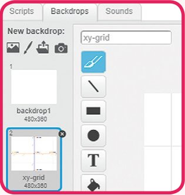

Coordonatele scenei merg de la -240 la 240 pe axa x și de la -180 la 180 pe axa y. Coordonatele centrului sunt (x:0, y:0).

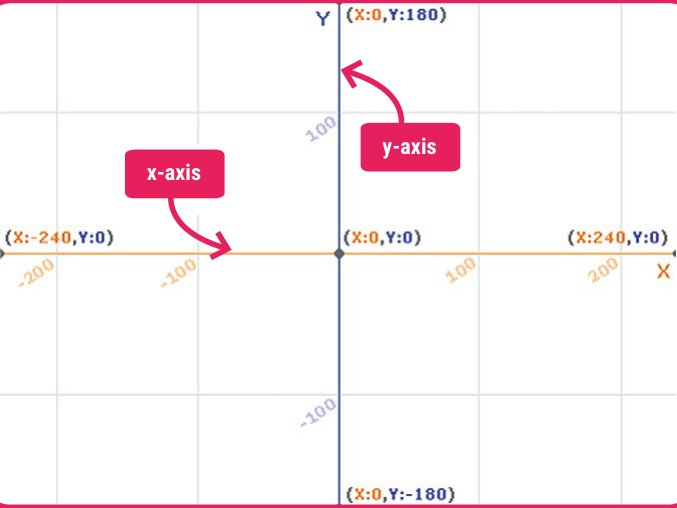

> **SFAT: NUMERELE NEGATIVE SUNT MAI MICI DECÂT ZERO**
> Numerele de deasupra lui 0 (zero) sunt pozitive. Numerele de sub 0 (zero) sunt negative.

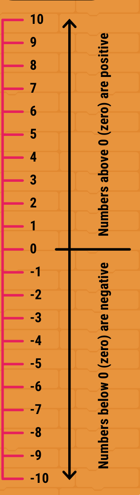

Poziția (x:-200, y:-100) este spre stânga-jos pe scenă, iar poziția (x:200, y:100) este aproape de dreapta-sus.

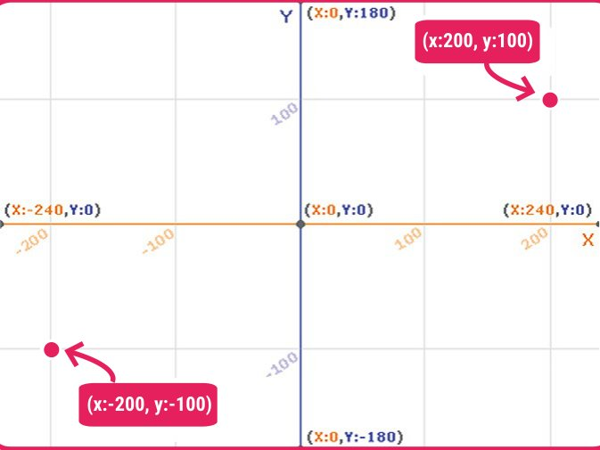

> **CUM SĂ… FOLOSEȘTI COORDONATELE**
> Încearcă să miști cursorul mouse-ului pe scenă și observă cum se schimbă coordonatele afișate în colțul din dreapta-jos.
>
> Poți folosi asta ca să trișezi în jocul pe care îl facem! Dar dacă treci în modul ecran complet, nu mai vezi coordonatele cursorului.

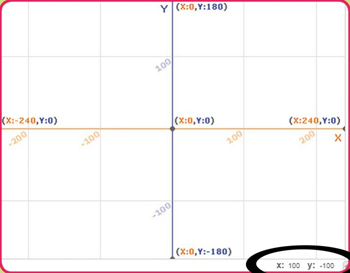

Blocurile de mișcare `go to` (du-te la) și `glide` (alunecă) își iau valorile implicite din poziția curentă a personajului. Asta înseamnă că poți muta un personaj în poziția în care vrei să ajungă și apoi doar să tragi blocul în zona de cod. E mai ușor decât să calculezi coordonatele și să le introduci tu.

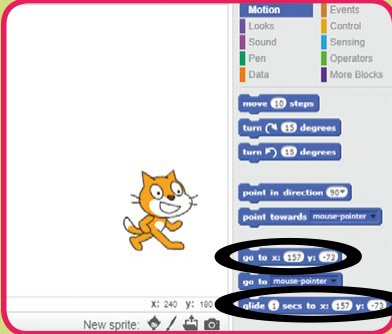

> **SFAT: X ȘI Y**
> Poate fi greu să ții minte diferența dintre x și y. Axa y merge în sus și în jos, ca un yo-yo.

## Pasul 2: Ochește la coordonatele (x, y)

*Acum hai să trimitem cercul de ochire la coordonatele (x, y).*

> ✏️ Adaugă litere pe grila de mai jos, ca să marchezi următoarele poziții: A: (x:50, y:50); B: (x:-100, y:-100); C: (x:-150, y:100); D: (x:175, y:-30)

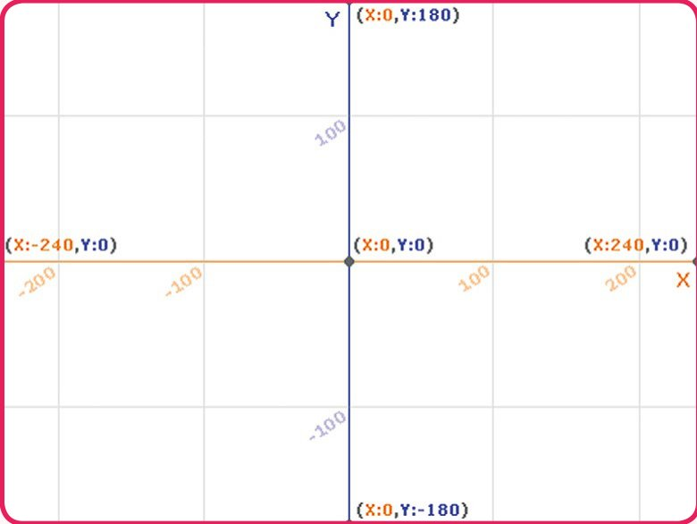

> **SFAT: SETEAZĂ CENTRUL**
> Coordonatele se bazează pe centrul personajului. Îl poți seta cu unealta în formă de cruce, când editezi un costum al unui personaj.

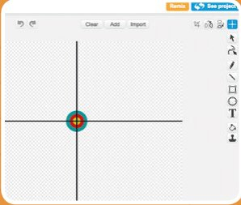

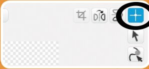

- [ ] Adaugă o variabilă numită **x coord** personajului **Aim** și alege **For all sprites** (pentru toate personajele). Pe scenă va apărea un afișaj (*monitor*) pentru variabila ta.

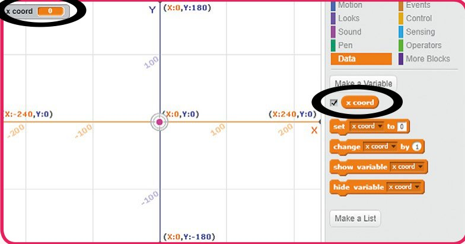

> **SFAT: AFIȘAJUL VARIABILEI**
> Când creezi o variabilă nouă, pe scenă apare un „afișaj al variabilei”, care îi arată valoarea curentă. Poți arăta sau ascunde afișajul de pe scenă bifând căsuța de lângă variabilă.

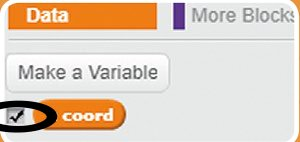

- [ ] Apasă dublu clic pe afișajul variabilei `x coord` și el se va schimba, arătând doar numărul; acesta se numește „afișaj mare” (*large readout*).

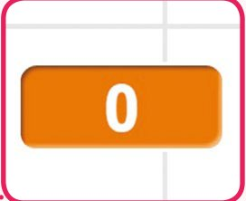

- [ ] Apasă din nou dublu clic pe afișajul variabilei și el se va transforma într-un cursor (*slider*).

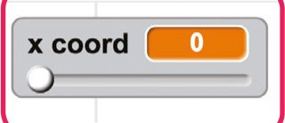

- [ ] Trage cursorul și urmărește cum se schimbă numărul.

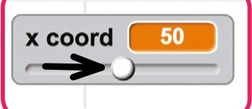

> ✏️ Cel mai mic număr al cursorului este acum ____, iar cel mai mare este ____.

Vei folosi cursorul ca să reprezinte o coordonată x, așa că trebuie să poată varia între -240 și 240.

- [ ] Apasă clic dreapta pe afișajul variabilei `x coord` de pe scenă și alege **set slider min and max** (setează minimul și maximul cursorului).

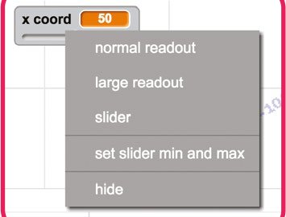

- [ ] Setează **Min** la -240 și **Max** la 240.

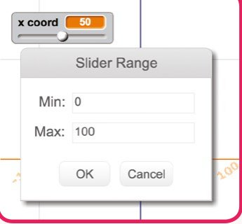

- [ ] Încearcă cursorul. Acum poți seta variabila `x coord` la valori de la -240 la 240, ceea ce corespunde intervalului axei x din Scratch.

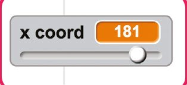

> **SFAT: INTRĂRI CU CURSOR**
> Un cursor îți permite să setezi o variabilă mișcând un control. Cursoarele sunt utile pentru crearea de intrări numerice în Scratch.

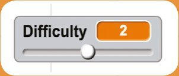

- [ ] Acum adaugă o variabilă **y coord** pentru coordonata y și trece-o pe setarea cursor.

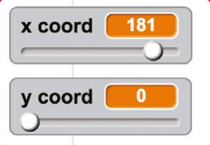

- [ ] Setează **Min** la -180 și **Max** la 180, ca să se potrivească cu intervalul axei y.

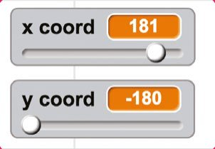

- [ ] Trage cursoarele x și y în stânga-jos a scenei. Ai grijă să pui x în stânga și y în dreapta, pentru că așa se dau coordonatele.

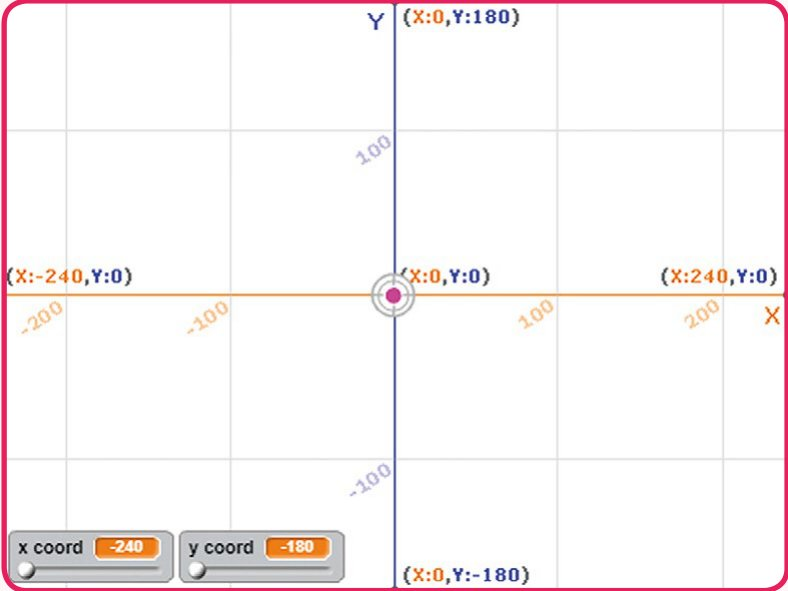

- [ ] Acum adaugă un script personajului **Aim**, ca atunci când apeși pe el să alunece la coordonatele `x coord` și `y coord` arătate de cursoare.

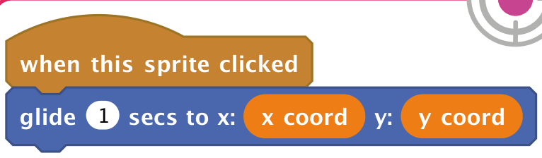

- [ ] Petrece ceva timp schimbând coordonatele x și y și apăsând apoi pe cercul de ochire, ca să îl faci să se mute în poziția aleasă. Asigură-te că înțelegi cum schimbarea cursoarelor x și y schimbă poziția cercului de ochire.

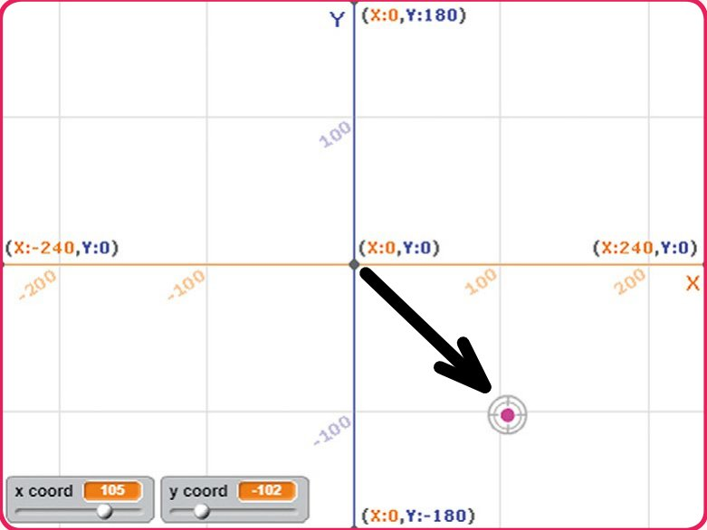

> **SFAT: MIȘCĂRI MICI**
> Poți apăsa pe un cursor de o parte sau de alta a butonului, ca să mărești sau să micșorezi valoarea cu 1. Încearcă! E util pentru poziționarea precisă.

## Pasul 3: Poți lovi ținta?

*Acum să vedem dacă poți seta corect coordonatele ca să ochești ținta. Vei câștiga un punct de fiecare dată când lovești ținta.*

- [ ] Apasă clic dreapta pe personajul **Target** de sub scenă și alege **show** (arată). Personajul va apărea pe scenă.

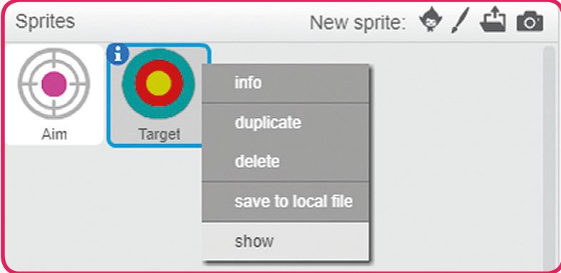

- [ ] Adaugă o variabilă **score** (scor) pentru toate personajele și trage afișajul ei de pe scenă în dreapta-sus.

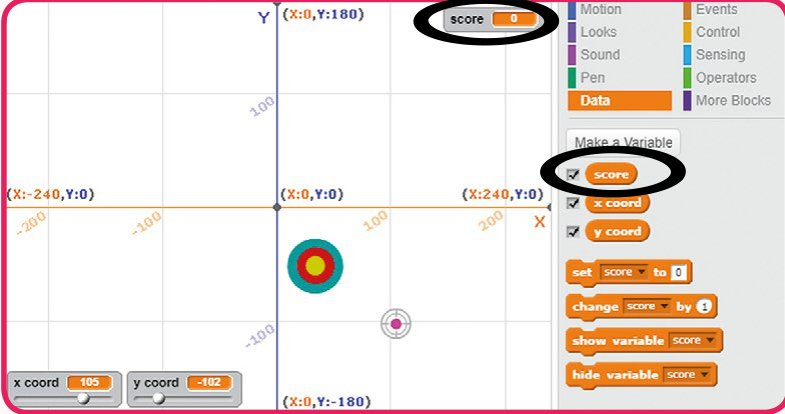

- [ ] Adaugă un script personajului **Aim**, ca să seteze scorul la 0 la începutul jocului.

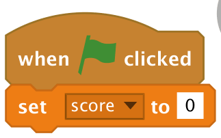

> **DEPANARE**
> Dacă personajul Aim ajunge în spatele țintei, adaugă un bloc `go to front` (adu în față) înainte de schimbarea scorului.

> **SFAT**
> Blocul Looks `go to front` pune un personaj deasupra tuturor celorlalte personaje.

- [ ] Adaugă cod personajului **Aim**, ca să verifice dacă atinge ținta după ce a alunecat. Fie răsplătește jucătorul spunând „Well done!” (Bravo!) și adăugând un punct la scor, fie, dacă nu a lovit ținta, poți spune „Oh dear!” (Vai!).

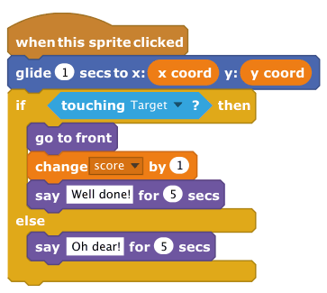

> **SFAT: TRAGE-O**
> Dacă vrei să încerci asta în modul ecran complet, va trebui să permiți ca ținta să poată fi trasă. Apasă pe pictograma de informații (i) a personajului Target și bifează căsuța de lângă „can drag in player” (poate fi trasă în player).

> **TESTEAZĂ-ȚI PROIECTUL**
> Trage ținta într-o poziție nouă pe scenă. Setează coordonatele x și y acolo unde crezi că este ținta. Apasă pe cercul de ochire ca să se mute la coordonatele alese și vezi dacă ai nimerit. Dacă reușești, vei vedea mesajul „Well done!”.

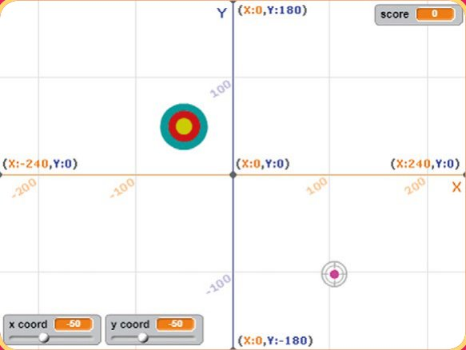

> ✏️ Dacă apeși acum pe cercul de ochire, va atinge ținta? ________

## Pasul 4: Ținta mișcătoare

*Acum hai să facem ținta să se mute într-o poziție aleatorie la începutul jocului și la sfârșitul fiecărei ture.*

- [ ] Adaugă un script personajului **Target**, ca să se ducă într-o poziție aleatorie când primește un mesaj **go**.

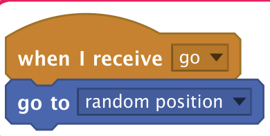

> **SFAT: BROADCAST (DIFUZARE)**
> Ca să creezi un mesaj nou pentru blocul `broadcast` (difuzează), apasă pe săgeata lui derulantă și alege „new message…” (mesaj nou). Apoi scrie un mesaj în câmpul Message Name (numele mesajului) și apasă pe OK. Noul mesaj va apărea acum în blocul `broadcast` și va fi disponibil și în lista lui derulantă.

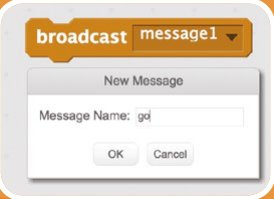

- [ ] Adaugă un bloc în scriptul `when flag clicked` al personajului **Aim**, ca să difuzeze un mesaj **go**.

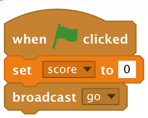

- [ ] Adaugă cod în scriptul `when this sprite clicked` al personajului **Aim**, ca să difuzeze un mesaj **go** la sfârșitul unei ture.

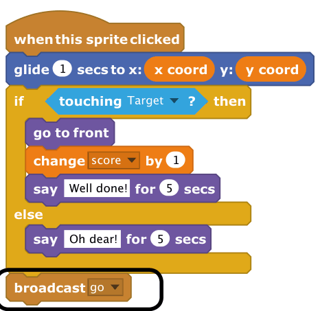

> **TESTEAZĂ-ȚI PROIECTUL**
> Acum poți încerca să joci jocul. Apasă pe steagul verde ca să începi. Ținta se mută într-o poziție nouă. Setează cursoarele x și y, apoi apasă pe cercul de ochire ca să îl trimiți în acea poziție.
>
> Ai lovit ținta? Mai încearcă o dată. Continuă să încerci până devii bun.

> **PROVOCARE: LOVEȘTE-O**
> Uneori, ținta ajunge deasupra cursoarelor. Enervant! Apasă pe steagul verde de multe ori, fără să joci, până când vezi ținta deasupra cursoarelor.
>
> Poți adăuga cod personajului țintă, ca să se mute într-o poziție nouă dacă ajunge deasupra cursoarelor? Pornește de la acest cod și completează pozițiile.

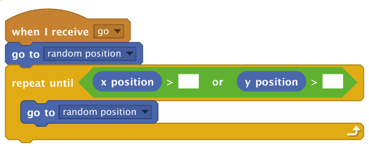

> Centrul țintei trebuie să evite să aterizeze în dreptunghiul evidențiat. Testează-ți din nou codul apăsând de multe ori pe steagul verde și asigură-te că ținta nu aterizează pe cursoare. Poți mișca mouse-ul ca să verifici coordonatele pozițiilor de pe scenă.

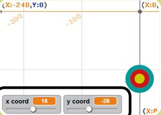

> 

<b>INDICIU</b> (apasă ca să îl vezi)

>
> `>` înseamnă „mai mare decât”. Ține minte, -100 este mai mare decât -200! Trebuie să verifici dacă poziția x este mai mare decât aproximativ 0 și poziția y este mai mare decât aproximativ -115.
> 

## Pasul 5: Mai multe puncte pentru precizie

*Acum hai să mărim scorul dacă ochești mai aproape de centrul țintei.*

- [ ] Vei folosi blocul `color is touching?` (culoarea atinge?) ca să detectezi ce parte a țintei este atinsă de cercul roz din centrul cercului de ochire. Vei primi 3 puncte dacă atinge cercul galben, 2 puncte pentru roșu și 1 punct pentru albastru.

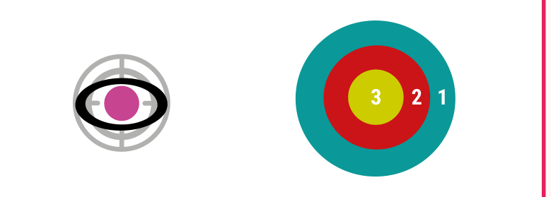

> **SFAT: ATINGE CULOAREA?**
> Prima culoare din blocul `color is touching?` este culoarea de pe personajul căruia îi aparține scriptul; a doua culoare este de pe alt personaj. Apasă pe caseta de culoare pe care vrei să o schimbi, apoi apasă pe acea culoare oriunde pe scenă sau în editor.

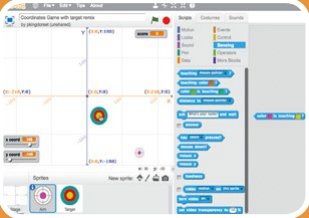

- [ ] Actualizează codul personajului **Aim**, ca să verifice dacă centrul personajului atinge centrul galben al țintei și să răsplătească jucătorul cu puncte și cu un mesaj diferit:

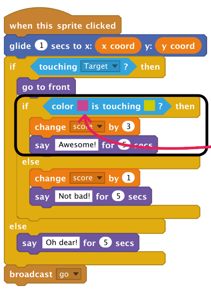

*Apasă pe prima culoare și apoi pe culoarea roz din centrul personajului Aim. Apasă pe a doua culoare și apoi pe culoarea galbenă din centrul țintei*

- [ ] Actualizează codul personajului **Aim**, ca să detecteze când cercul roz atinge inelul roșu și să dea 2 puncte. Nu e nevoie să verifici dacă a fost lovit inelul roșu, dacă știi că jucătorul a lovit inelul galben, așa că acest cod merge în secțiunea `else`.

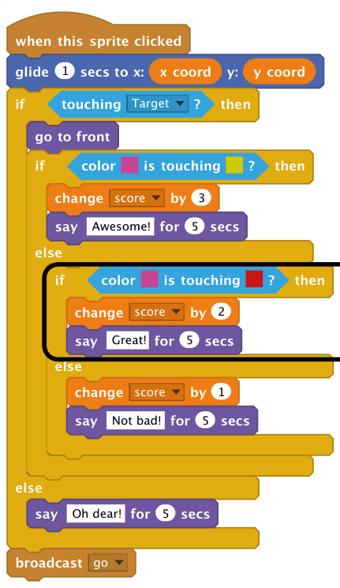

<b>INDICIU</b> (apasă ca să îl vezi)

Trebuie să adaugi un bloc `if…else` în interiorul secțiunii `else` a blocului anterior. De asemenea, mută blocurile din secțiunea `else` a blocului anterior în secțiunea `else` a noului bloc `if…else`.

> **PROVOCARE**
> - [ ] Devino expert în coordonate! Continuă să exersezi până când te simți cu adevărat sigur pe tine cu pozițiile din grila de coordonate din Scratch.
> - [ ] Adaugă o variabilă **turns** (ture) și vezi câte puncte poți câștiga în 10 ture.
> - [ ] Poți adăuga în joc instrucțiuni care să explice cum funcționează coordonatele? Poți înregistra propria voce sau poți scrie text într-un personaj.
>
> 

<b>INDICIU</b> (apasă ca să îl vezi)

>
> Axa x merge de la -240 în stânga la 240 în dreapta. Axa y merge de la -180 jos la 180 sus. Ține minte, y merge în sus și în jos ca un yo-yo.
> 

> **PROVOCARE: PREA UȘOR PENTRU TINE?**
> - [ ] Încearcă să faci personajul Aim sau ținta mai mici, ca să trebuiască să fii mai precis.
> - [ ] Încearcă să schimbi fundalul cu cel simplu, fără grilă.
>
> Ascunde grila și treci în modul ecran complet, ca să nu poți trișa uitându-te la coordonatele țintei. Dacă vezi că nu nimerești ținta, treci înapoi la fundalul cu grilă și mai exersează puțin.

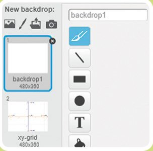

- [ ] Dacă vrei, poți adăuga un script scenei, ca să schimbi fundalurile când apeși o tastă:

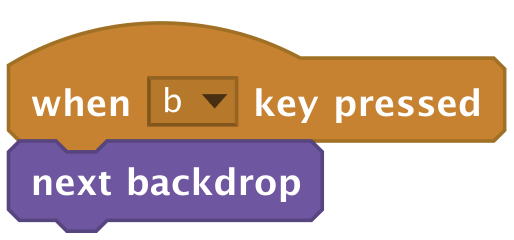

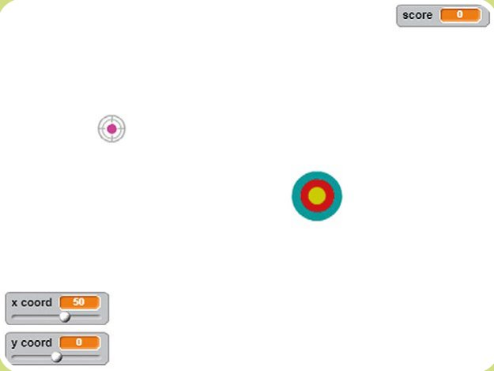

> **CUM SĂ… LUCREZI CU POZIȚIILE X ȘI Y**
> Scratch are variabile încorporate pentru poziția x și y a unui personaj. Apasă pe **Scripts** și apoi pe **Motion** și vei vedea variabilele `x position` și `y position` aproape de capătul listei.
>
> La fel ca la variabilele create de tine, poți bifa căsuța ca să arăți aceste variabile pe scenă. Variabilele se actualizează când tragi personajul pe ecran.

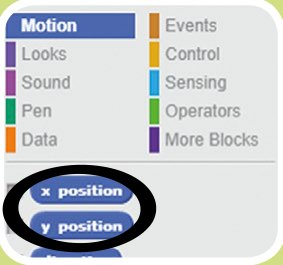

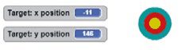

> Poți schimba separat poziția x și y a unui personaj, cu blocurile `set` și `change`.

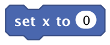

> Ca să trimiți un personaj la o poziție y aleatorie, folosește:

> ✏️ Ce numere ai nevoie în codul următor, ca să trimiți un personaj la o poziție x aleatorie?

> **SFAT: PICK RANDOM**
> Blocul `pick random` alege un număr aleatoriu, între valoarea dată în primul câmp și valoarea din al doilea câmp. Dacă niciuna dintre valori nu are zecimale, va raporta un număr întreg.

## La țintă: codul complet

### Scena

Apăsarea unei taste schimbă fundalul.

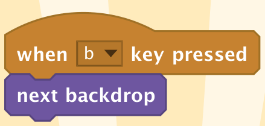

### Ținta

Este trimisă într-o poziție aleatorie.

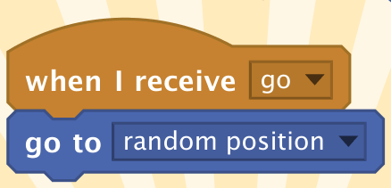

### Cercul de ochire

Când se apasă pe el, este trimis la coordonatele cursoarelor.

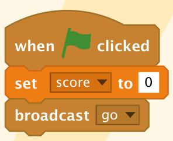

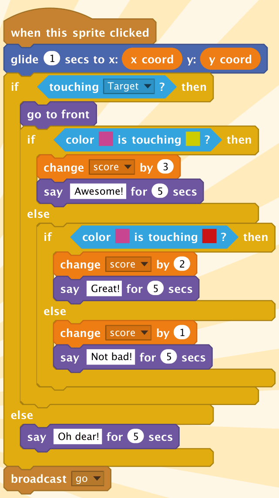

> 🏅 **PROIECT TERMINAT!** La țintă: complet

## Acum ai putea face…

*Cu noile tale cunoștințe, ai putea încerca aceste proiecte…*

### Fantome alunecătoare

Creează o animație care folosește coordonate ca să poziționeze cu precizie personajele.

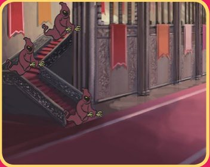

### Pietre care cad

Programează un joc în care pietrele cad mereu de la aceeași poziție y (înălțime), dar de la poziții x aleatorii.

### Desenator pe grilă

Fă o aplicație de matematică, care îi cere utilizatorului coordonate și apoi ștampilează un personaj, ca să deseneze punctul la coordonatele date.

> 🤖 *Vrei să faci un joc cu o cursă de bărci? Treci la capitolul următor ca să afli cum…*
