# Capitolul 8 – Cursa cu bărci

> *Fă-ți propriul joc de curse, cu detectarea coliziunilor prin culoare și cu un cronometru*

> 🤖 *Programează un joc de curse palpitant! Adaugă accelerări, un cronometru și multe altele!*

În acest capitol vei învăța cum să controlezi un personaj barcă cu mouse-ul. Vei descoperi și cum să detectezi când lovește un obstacol, folosind blocurile `touching color` (atinge culoarea).

> **CE VEI ÎNVĂȚA**
> - Mișcarea personajelor cu mouse-ul
> - Detectarea coliziunilor cu blocurile `touching color`
> - Un cronometru cu o variabilă

> **SFAT: FIȘIERELE PROIECTELOR**
> Ca să descarci o arhivă zip cu toate fișierele proiectelor Scratch 2 (.sb2) din această carte, intră pe: [rpf.io/book-s1-assets](https://rpf.io/book-s1-assets)

## Proiectul terminat

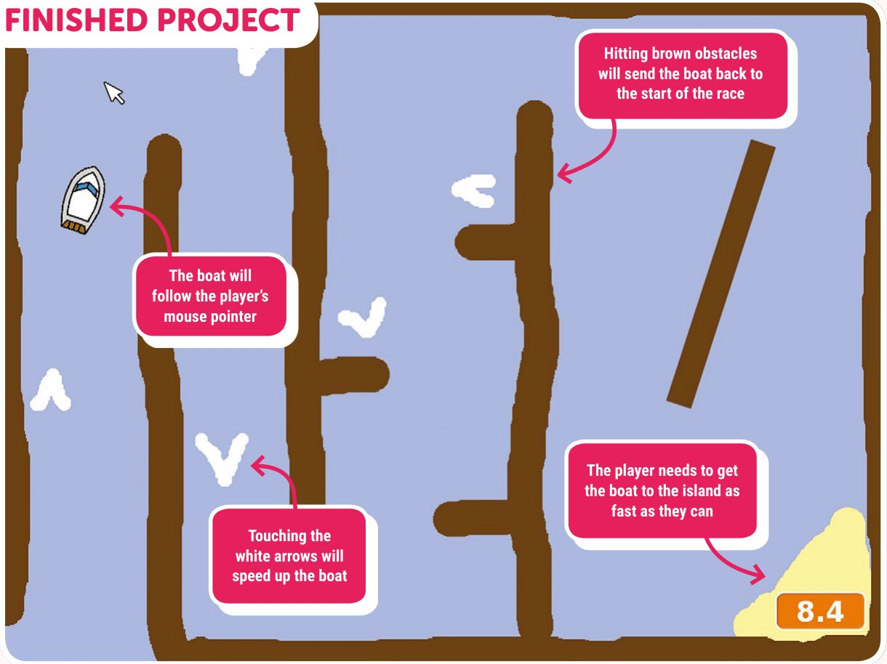

- Barca va urmări cursorul mouse-ului jucătorului
- Lovirea obstacolelor maro trimite barca înapoi la startul cursei
- Atingerea săgeților albe accelerează barca
- Jucătorul trebuie să ducă barca la insulă cât mai repede poate

## Pasul 1: Controlează-ți barca

*Programează personajul barcă să urmărească cursorul mouse-ului.*

- [ ] Într-un browser, intră pe [rpf.io/book-boatrace](https://rpf.io/book-boatrace) ca să deschizi proiectul „Boat Race”. Apasă pe butonul **Remix**.
- [ ] Vei controla barca cu mouse-ul. Adaugă acest cod personajului **Boat** (barcă):

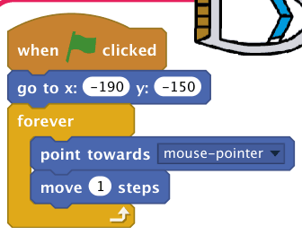

- [ ] Testează-ți barca, apăsând pe steag și mișcând mouse-ul. Navighează barca spre cursorul mouse-ului? Când ai terminat, apasă pe butonul roșu de oprire.

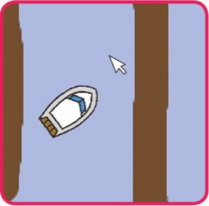

- [ ] Ai observat că barca are un tremur când ajunge la cursorul mouse-ului? Ca să oprești asta, va trebui să adaugi un bloc `if` în codul tău, astfel încât barca să se miște doar dacă este la mai mult de 5 pixeli de mouse. Notă: aici se folosește un bloc operator `>` împreună cu un bloc Sensing `distance to` (distanța până la).

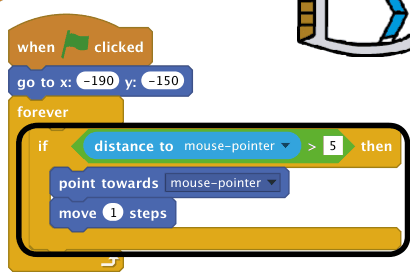

- [ ] Testează-ți din nou barca, ca să verifici că problema a fost rezolvată. Când ai terminat, apasă pe butonul de oprire.

## Pasul 2: Ciocnirea

*Barca ta poate naviga prin barierele de lemn! Hai să reparăm asta.*

- [ ] Vei avea nevoie de două costume pentru barcă: un costum normal și unul pentru când barca se ciocnește. Apasă clic dreapta pe costumul bărcii ca să îl duplici, și numește costumele **normal** și **hit** (lovit).

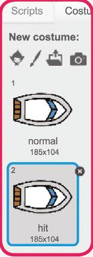

- [ ] Apasă pe costumul **hit** și alege unealta **Select** (selectează), ca să apuci bucăți din barcă și să le muți și rotești. Fă barca să arate ca și cum s-a ciocnit.

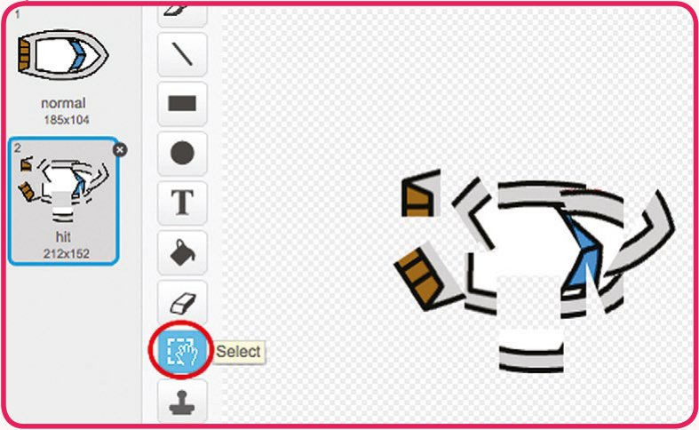

> **SFAT: UNEALTA SELECT**
> Cu unealta Select, apasă și trage ca să selectezi o zonă a personajului. Trage zona selectată ca să o muți, sau apasă pe „mânerul” ei de sus și trage la stânga/dreapta ca să o rotești.

- [ ] Adaugă acest cod bărcii, în interiorul buclei `forever`, ca să se ciocnească atunci când atinge orice bucată de lemn maro. Acest cod este în interiorul buclei `forever`, ca să verifice mereu, la fiecare mișcare, dacă barca s-a ciocnit. Notă: ca să setezi culoarea corectă, apasă pe pătratul de culoare din blocul `touching color`, apoi apasă pe o bucată maro a decorului de pe scenă.

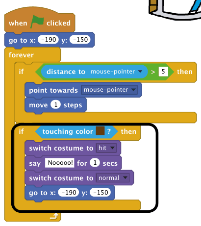

- [ ] Ar trebui să te asiguri și că barca începe mereu un joc nou arătând „normal”. Adaugă acest bloc la începutul scriptului bărcii (în afara blocului `forever`).

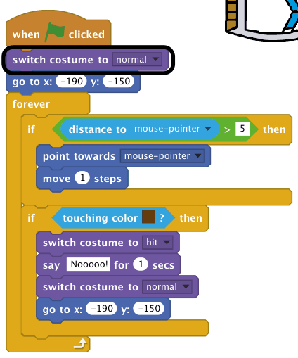

> **TESTEAZĂ-ȚI PROIECTUL**
> Acum, dacă încerci să navighezi printr-o barieră de lemn, barca ar trebui să se ciocnească și să se întoarcă la start. Când ai terminat, apasă pe butonul roșu de oprire.

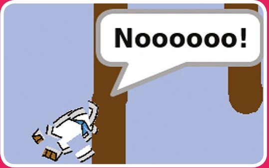

> **PROVOCARE: EFECTE SONORE**
> Poți adăuga efecte sonore în joc, pentru când barca se ciocnește sau când ajunge la insula de la final? Ai putea adăuga chiar și muzică de fundal (vezi proiectul anterior „Trupa rock”, dacă ai nevoie de ajutor).

> **PROVOCARE: VICTORIE!**
> Poți adăuga încă un bloc `if` în codul bărcii, ca jucătorul să câștige când ajunge la insula pustie? Când barca ajunge la insula galbenă, ar trebui să spună „YEAH!” și apoi jocul ar trebui să se oprească.
>
> 

<b>INDICIU</b> (apasă ca să îl vezi)

>
> Va trebui să folosești un bloc `stop all` (oprește tot), ca să oprești toate scripturile când barca termină cursa.
> 

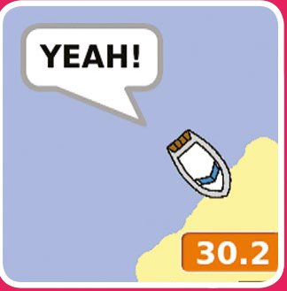

## Pasul 3: Contra cronometru

*Hai să adăugăm un cronometru în joc, ca jucătorul să trebuiască să ajungă la insulă cât mai repede posibil.*

- [ ] Adaugă o variabilă nouă, numită **time** (timp), scenei tale. Poți și să schimbi felul în care este afișată noua variabilă. Dacă ai nevoie de ajutor, uită-te la proiectul „Vânătorul de fantome”.

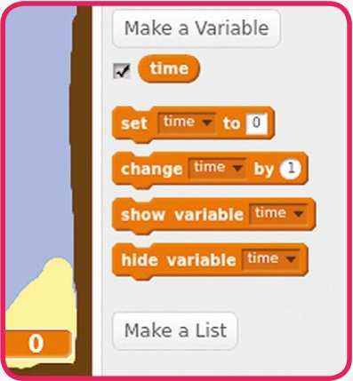

- [ ] Adaugă acest cod scenei, ca variabila `time` să numere în sus, pornind de la 0:

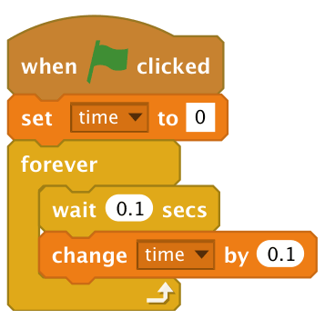

> **TESTEAZĂ-ȚI PROIECTUL**
> Asta e tot! Testează-ți jocul și vezi cât de repede poți ajunge la insula pustie!

## Pasul 4: Obstacole și bonusuri

*Jocul ăsta e mult prea ușor: hai să adăugăm lucruri care să îl facă mai interesant!*

- [ ] Mai întâi, hai să adăugăm în joc niște „acceleratoare”, care vor mări viteza bărcii. Apasă pe scenă, apoi pe fila **Backdrops**, și adaugă câteva săgeți albe de accelerare.

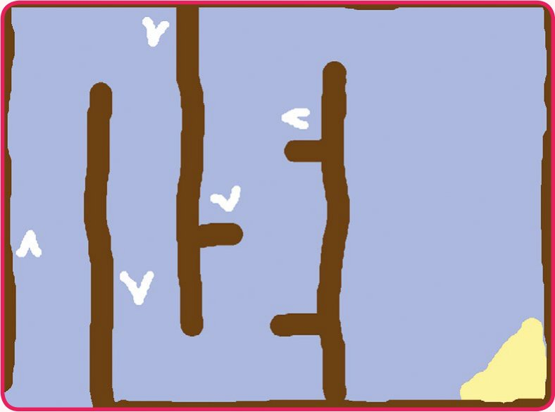

- [ ] Acum poți adăuga cod în bucla `forever` a bărcii, ca să se miște 3 pași în plus dacă atinge un accelerator alb.

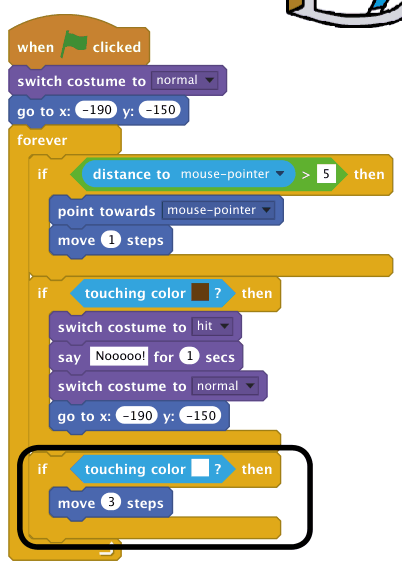

- [ ] Testează-ți noul cod. Accelerează barca atunci când atinge un accelerator alb?
- [ ] Poți adăuga și o poartă rotitoare, pe care barca trebuie să o evite. Desenează un personaj nou, numit **Gate** (poartă), care să arate ca un dreptunghi maro. Ai grijă ca poarta să aibă aceeași culoare ca celelalte bariere de lemn.

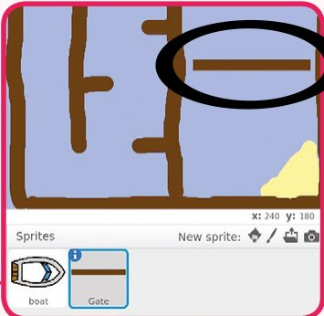

- [ ] Setează centrul personajului poartă, apăsând pe butonul **Set costume centre** (setează centrul costumului) și apăsând în centrul dreptunghiului.

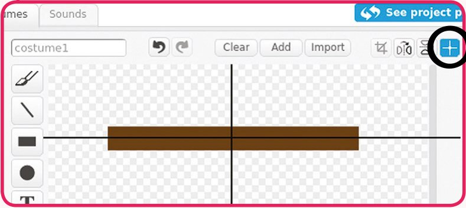

- [ ] Adaugă cod porții, ca să se rotească încet la nesfârșit. Sfat: uită-te la codul personajului maimuță din proiectul „Pierduți în spațiu”.

> **TESTEAZĂ-ȚI PROIECTUL**
> Testează-ți jocul. Ar trebui să ai acum o poartă rotitoare, pe care trebuie să o eviți.

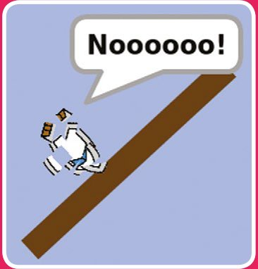

> **PROVOCARE: MAI MULTE BĂRCI!**
> Poți transforma jocul într-o cursă între doi jucători?
>
> - Duplică personajul barcă și schimbă-i culoarea.
> - Schimbă poziția de start a jucătorului 2, modificând acest cod:
>
> 
>
> - Șterge codul care folosește mouse-ul ca să controleze barca. Înlocuiește-l cu cod care să controleze barca cu tastele săgeți.
> - Acesta este codul de care ai nevoie ca să miști barca înainte:
>
> 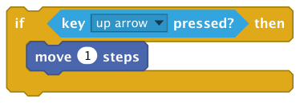
>
> Vei avea nevoie și de cod care să rotească barca atunci când sunt apăsate tastele săgeată stânga și dreapta.

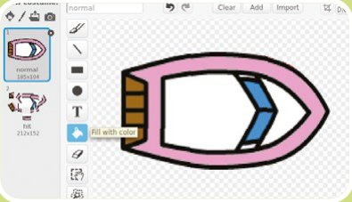

> **PROVOCARE: MAI MULTE OBSTACOLE!**
> - Ai putea adăuga mâzgă verde pe fundal, care să încetinească jucătorul când o atinge. Poți folosi un bloc `wait` (așteaptă) pentru asta:
>
> 
>
> - Ai putea adăuga încă un obiect mișcător, cum ar fi un buștean sau un rechin!
>
> 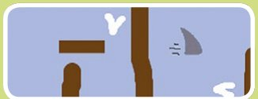
>
> - Aceste blocuri s-ar putea să te ajute:
>
> 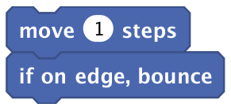
>
> - Dacă noul tău obiect nu este maro, va trebui să adaugi în codul bărcii o condiție de forma `touching color … or touching Shark?` (atinge culoarea… sau atinge rechinul?).

> **PROVOCARE: MAI MULTE NIVELURI!**
> Poți crea fundaluri suplimentare și să îi permiți jucătorului să aleagă între niveluri? Cum va arăta noul tău nivel? Schițează-l pe o foaie și marchează linia de sosire și obstacolele.
>
> Iată niște cod pe care îl poți adăuga scenei, ca să treci de la un nivel la altul:
>
> 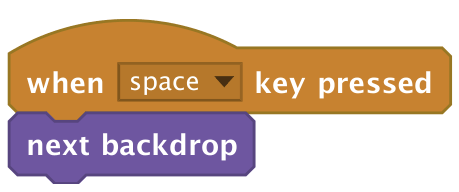

## Cursa cu bărci: codul complet

### Barca

Condusă cu cursorul mouse-ului, barca trebuie ghidată în siguranță pe traseu.

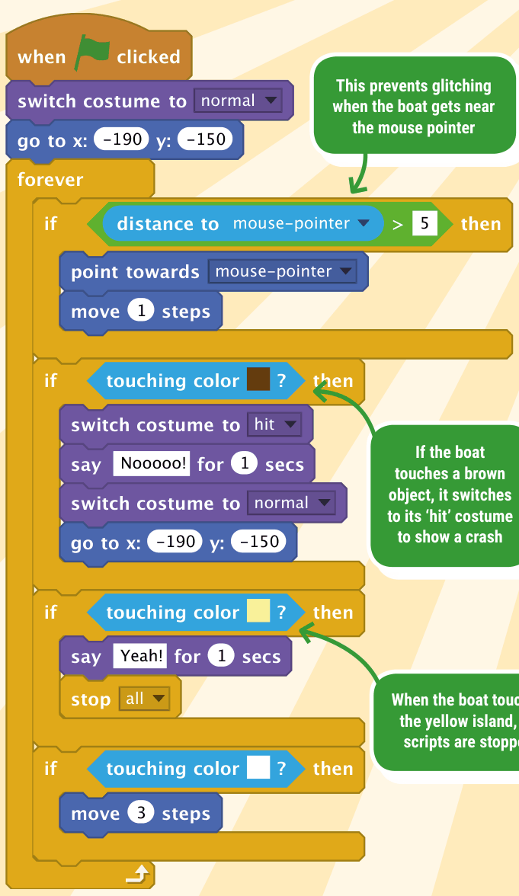

- Verificarea distanței până la mouse previne tremurul, atunci când barca ajunge aproape de cursor
- Dacă barca atinge un obiect maro, trece la costumul „hit”, ca să arate o ciocnire
- Când barca atinge insula galbenă, toate scripturile sunt oprite

### Poarta

Această poartă, care se rotește neîncetat, este un obstacol dificil.

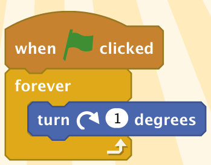

### Scena

Acest cod folosește o variabilă ca să gestioneze cronometrul de pe ecran.

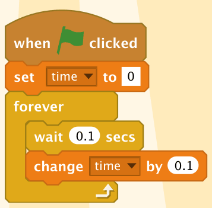

> 🏅 **PROIECT TERMINAT!** Cursa cu bărci: completă

## Acum ai putea face…

*Vei găsi multe alte proiecte grozave pe [rpf.io/ccprojects](https://rpf.io/ccprojects), printre care…*

### Tir cu arcul

Creează un joc de tir cu arcul, în care trebuie să tragi săgeți cât mai aproape de centrul țintei. [rpf.io/archery](https://rpf.io/archery)

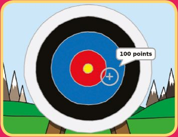

### Bate portarul

Creează un joc de fotbal, în care trebuie să marchezi cât mai multe goluri în 30 de secunde. [rpf.io/beat-the-goalie](https://rpf.io/beat-the-goalie)

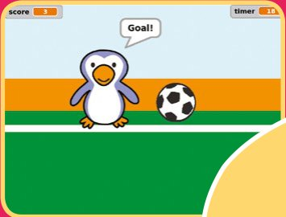

### Generatorul de poezii al Adei

Învață cum să creezi poezii generate aleatoriu! Vei folosi variabile și vei alege elemente aleatorii din liste, în acest proiect de programare poetică. [rpf.io/ada-poetry](https://rpf.io/ada-poetry)

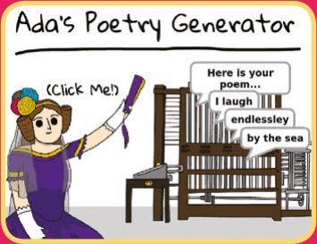

> 🤖 *Vrei niște fragmente de cod la îndemână? Treci la capitolul următor ca să găsești scripturi utile…*
