# Capitolul 9 – Cod util

> *Acest capitol conține cod util, pe care îl poți folosi în proiectele tale*

> 🤖 *Aruncă o privire la aceste fragmente de cod! Încearcă să le folosești în propriile tale proiecte!*

Acest ghid de referință conține scripturi Scratch utile, pe care le poți încorpora în propriile tale proiecte. Orice ai crea, distrează-te programând!

| Descriere | Cod |
|---|---|
| Redarea unui sunet | 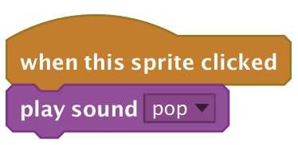 |
| Personaj care se rotește | 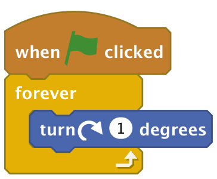 |
| Animarea costumelor unui personaj | 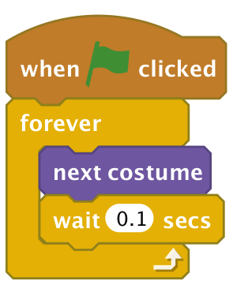 |
| Personaj care ricoșează | 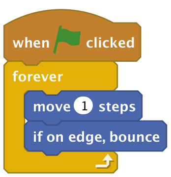 |
| Desenarea unui pătrat | 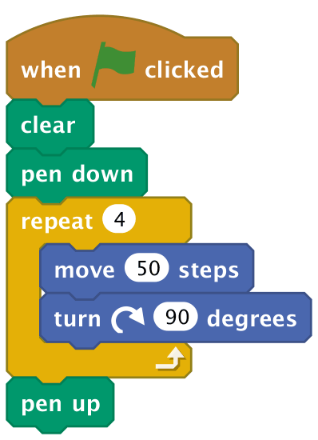 |
| Ținerea scorului | 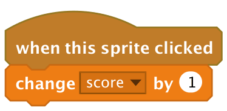 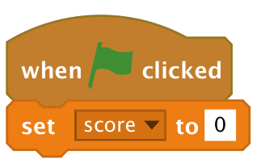 |
| Cronometru care numără invers | 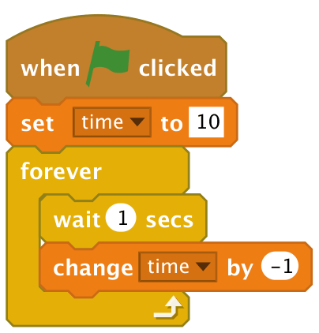 |
| Cronometru care numără în sus | 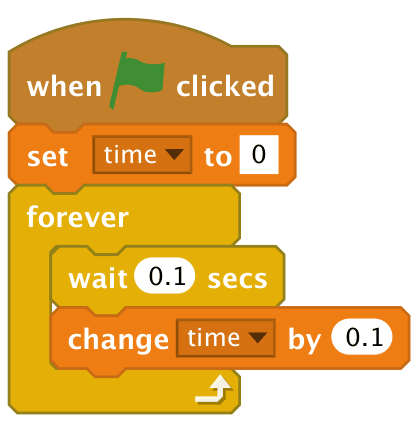 |
| Punerea unei întrebări și reacția la răspuns | 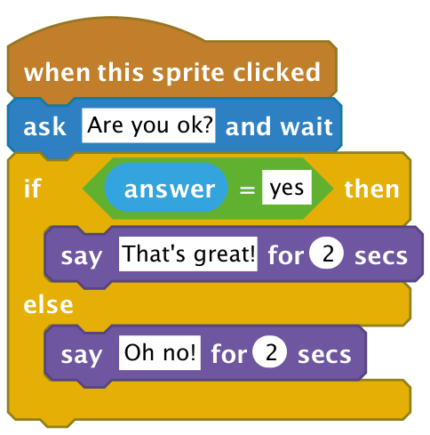 |
| Păstrarea răspunsului la o întrebare într-o variabilă |  |
| Unirea bucăților de text |  |
| Personaj care sare | 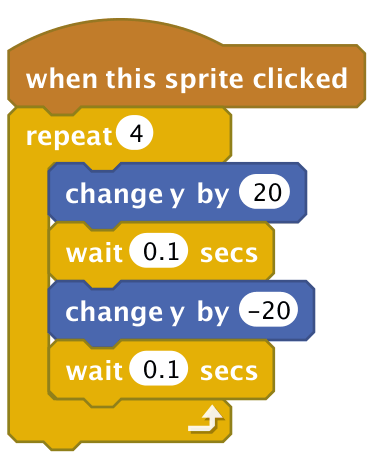 |
| Urmărirea mouse-ului | 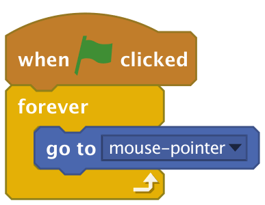 |
| Alunecare la coordonate aleatorii pe scenă | 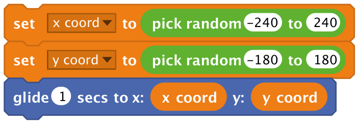 |
| Mișcare spre mouse | 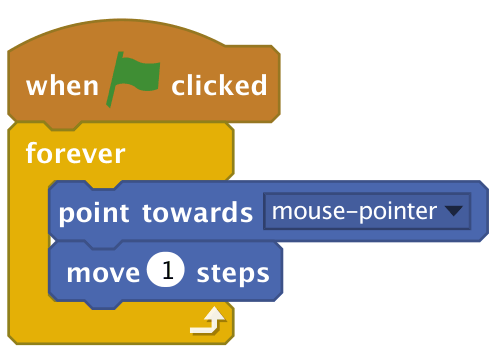 |
| Mișcare cu tastatura | 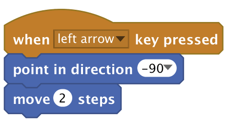 sau… 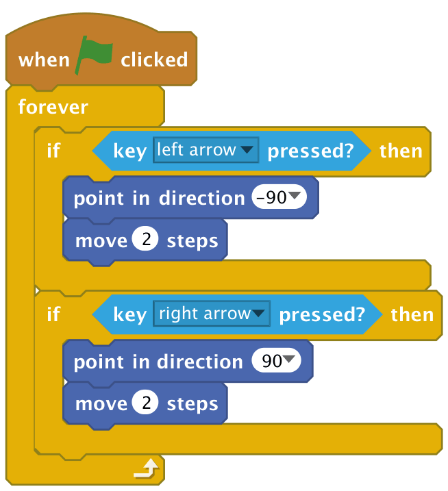 |
| Verificarea dacă un personaj a lovit alt personaj | 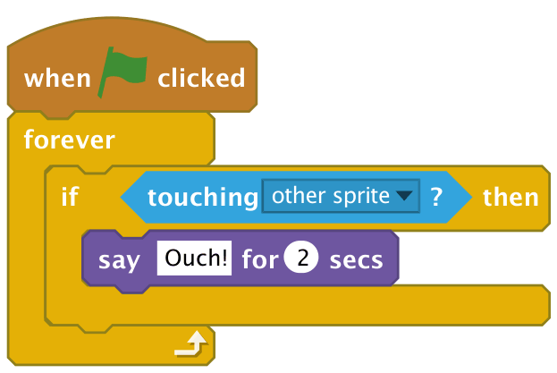 |

> **NOTA TRADUCĂTORULUI**
> Numele blocurilor sunt cele din versiunea în limba engleză a lui Scratch, ca să le poți recunoaște în imagini. Dacă folosești Scratch în limba română, blocurile au aceeași formă și aceeași culoare, doar textul de pe ele este tradus.
