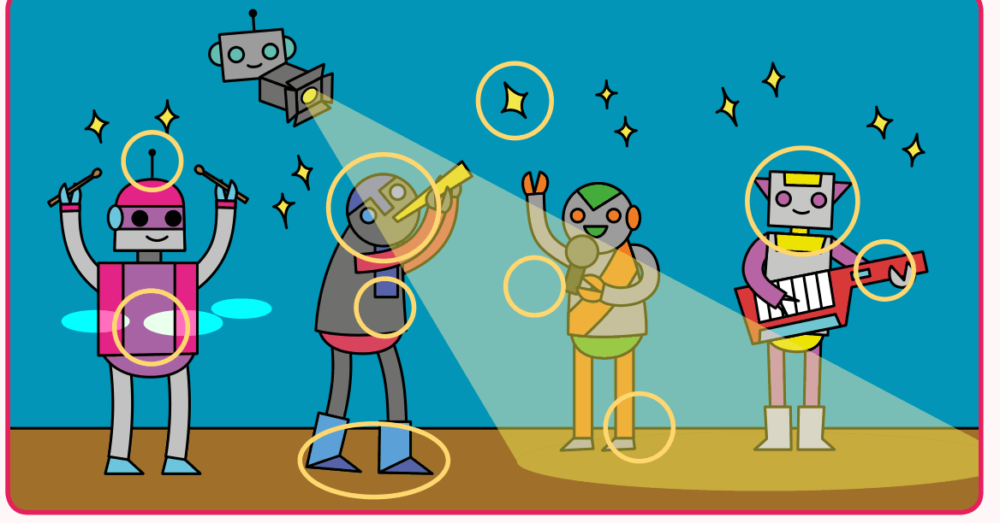
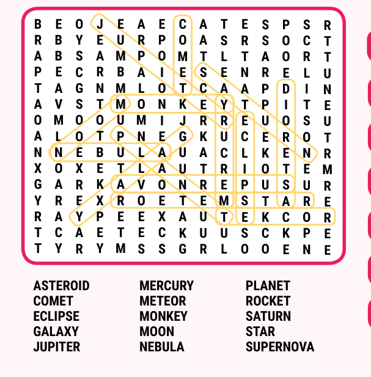
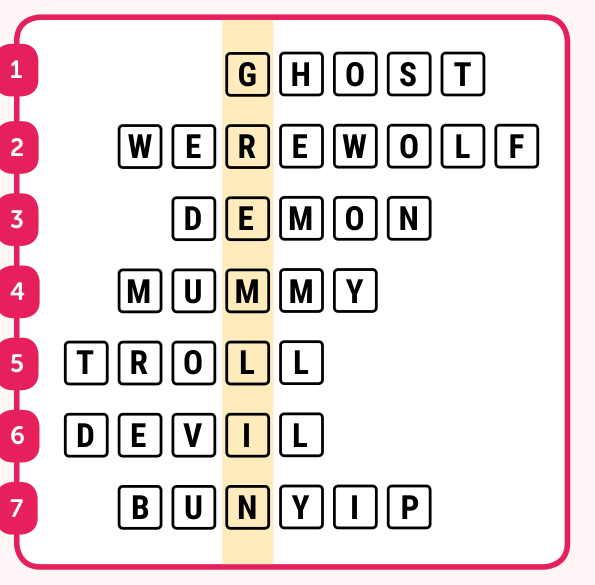

# Capitolul 10 – Soluțiile jocurilor

> *Verifică-ți răspunsurile aici. Fără trișat!*

> **NOTA TRADUCĂTORULUI**
> În cartea originală, această pagină este tipărită cu susul în jos, ca să nu vezi soluțiile din greșeală. Aici, imaginile sunt întoarse la loc, așa că nu te uita înainte să fi încercat!

## Găsește diferențele (capitolul 3)

Cele zece diferențe sunt încercuite:

## Pierduți în spațiu (capitolul 4)

## Intră în criptă! (capitolul 5)

1. GHOST (fantomă) – ascuns în „charmin**G HOST**”
2. WEREWOLF (vârcolac) – ascuns în „**WE'RE WOLF**ing”
3. DEMON (demon) – ascuns în „cru**DE MON**tage”
4. MUMMY (mumie) – ascuns în „**MUM, MY**”
5. TROLL (trol) – ascuns în „s**TROLL**”
6. DEVIL (diavol) – ascuns în „ru**DE, VIL**e”
7. BUNYIP (monstru din legendele australiene) – ascuns în „**BUN! YIP**pee”

Creatura ascunsă în pătratele colorate este un… **GREMLIN**!
