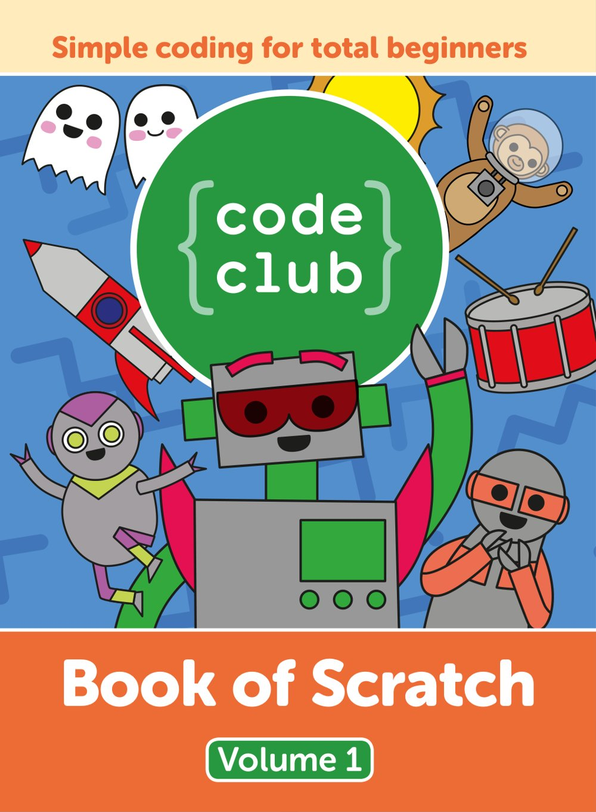

# Cartea de Scratch Code Club – Volumul 1
## Autori: Rik Cross și Tracy Gardner (Code Club / Fundația Raspberry Pi)
### Traducere și adaptare: Dan Paraschiv

## Despre această carte

*Programare simplă pentru începători absoluți.* Aceasta este prima carte publicată de **Code Club**, rețeaua mondială de cluburi gratuite de programare pentru copii de 9–13 ani, parte a Fundației Raspberry Pi. Cartea te învață să programezi cu **Scratch**, limbajul cu blocuri creat la MIT, construind pas cu pas șase proiecte: o trupă rock, o animație spațială, un joc cu fantome, un chatbot, un joc de tras la țintă și o cursă de bărci. Un robot prietenos te ghidează prin fiecare capitol, îți dă sfaturi, îți pune provocări și îți ascunde indicii pentru momentele în care te-ai împotmolit.

Cartea a fost scrisă în 2018 pentru **Scratch 2**. Toate proiectele funcționează la fel de bine în **Scratch 3**, versiunea disponibilă acum gratuit la [scratch.mit.edu](https://scratch.mit.edu); diferențele de interfață sunt explicate într-o casetă „Nota traducătorului” din capitolul 2. Proiectele de pornire (de exemplu [rpf.io/book-rockband](https://rpf.io/book-rockband)) și fișierele lor ([rpf.io/book-s1-assets](https://rpf.io/book-s1-assets)) sunt publicate de Fundația Raspberry Pi.

## Cuprins

1. [**Capitolul 1**](Capitolul01_Bun_venit.md) - Bun venit! – cuvântul înainte al directoarei Code Club și o scrisoare pentru profesorul tău
2. [**Capitolul 2**](Capitolul02_Sa_facem_cunostinta_cu_Scratch.md) - Să facem cunoștință cu Scratch – editorul, costumele, sunetele, contul și comunitatea
3. [**Capitolul 3**](Capitolul03_Trupa_rock.md) - Trupa rock – personaje, costume, evenimente și sunete
4. [**Capitolul 4**](Capitolul04_Pierduti_in_spatiu.md) - Pierduți în spațiu – o animație cu bucle `repeat` și `forever`
5. [**Capitolul 5**](Capitolul05_Vanatorul_de_fantome.md) - Vânătorul de fantome – variabile, numere aleatorii, scor și cronometru
6. [**Capitolul 6**](Capitolul06_Chatbot.md) - Chatbot – întrebări, răspunsuri și decizii cu `if` și `if…else`
7. [**Capitolul 7**](Capitolul07_La_tinta.md) - La țintă – coordonatele x și y, cursoare și mesaje difuzate
8. [**Capitolul 8**](Capitolul08_Cursa_cu_barci.md) - Cursa cu bărci – control cu mouse-ul, coliziuni după culoare și un cronometru
9. [**Capitolul 9**](Capitolul09_Cod_util.md) - Cod util – fragmente de cod la îndemână pentru proiectele tale
10. [**Capitolul 10**](Capitolul10_Solutiile_jocurilor.md) - Soluțiile jocurilor – răspunsurile la jocurile din carte

Imaginile, capturile de ecran și scripturile Scratch din cartea originală se găsesc în folderul [imagini](imagini/). Cartea originală, în limba engleză, este inclusă în acest folder: [Code_Club_Book_of_Scratch_Vol1_ORIGINAL.pdf](Code_Club_Book_of_Scratch_Vol1_ORIGINAL.pdf).

## Cum să folosiți această carte

### Pentru copii

Această carte a fost scrisă pentru tine, chiar dacă nu ai programat niciodată. Ai nevoie doar de un calculator cu internet (sau de editorul Scratch instalat) și de chef de joacă.

**Citește capitolele în ordine.** Capitolul 2 îți arată cum e împărțit ecranul Scratch. Fiecare proiect care urmează folosește ce ai învățat în cel dinainte: mai întâi sunete și costume, apoi bucle, apoi variabile, decizii și coordonate.

**Bifează pașii.** Fiecare proiect este împărțit în pași cu căsuțe de bifat. Pe GitHub, căsuțele se văd ca atare; dacă ai printat cartea, bifează-le cu creionul.

**Nu te uita la indicii decât dacă te-ai blocat.** Indiciile sunt ascunse în casete pe care le deschizi cu un clic (în cartea tipărită sunt scrise cu susul în jos). Încearcă mai întâi singur!

**Fă provocările și proiectele „Acum ai putea face…”.** Acolo începe adevărata programare: schimbi, remixezi și inventezi lucruri noi.

---

### Pentru părinți

Scratch este gratuit, rulează în browser și nu are nevoie de instalare. Copilul are nevoie de un cont Scratch doar dacă vrea să își salveze proiectele online sau să le împărtășească; pentru copiii sub 13 ani, contul se creează cu acordul părintelui, iar capitolul 2 explică regulile comunității. Fără cont, proiectele se salvează pe calculator.

Proiectele durează cam o oră–două fiecare. Cel mai bun sprijin pe care îl puteți da nu este tehnic, ci interesul: cereți să vi se arate trupa rock, jucați jocul cu fantome, vorbiți cu chatbotul.

---

### Pentru profesori și educatori

Cartea urmează exact structura proiectelor Code Club (care există și în limba română, la [projects.raspberrypi.org](https://projects.raspberrypi.org)) și poate fi folosită direct ca material pentru un club de programare sau pentru orele de informatică și TIC din clasele a III-a – a VII-a. Fiecare capitol este o lecție de sine stătătoare, cu obiective de învățare („Ce vei înveța”), pași, provocări diferențiate și un listing complet al codului la final. Capitolul 9 este o fișă de referință cu scripturi reutilizabile. Capitolul 1 conține o scrisoare-model prin care un elev poate cere înființarea unui Code Club în școală.

## Convenții folosite în carte

### Blocurile Scratch

Scripturile apar ca imagini, exact ca în cartea originală, cu blocurile în limba engleză. În text, numele blocurilor sunt scrise cu font de cod, de exemplu `when this sprite clicked`, urmate la prima apariție de traducerea în paranteză. Dacă folosești Scratch în limba română, blocurile au aceeași culoare și formă, doar textul este tradus.

### Pașii

- [ ] Fiecare pas de urmat are o căsuță de bifat, ca în cartea originală.

### Casete informative

> **CE VEI ÎNVĂȚA**
> Obiectivele fiecărui proiect

> **SFAT: …**
> Explicații ale unei noțiuni (evenimente, bucle, variabile, coordonate…)

> **CUM SĂ… …**
> Instrucțiuni pentru o operație anume în editorul Scratch

> **PROVOCARE: …**
> Idei de extindere a proiectului, pe cont propriu, cu un **INDICIU** ascuns

> **TESTEAZĂ-ȚI PROIECTUL**
> Momentul în care verifici dacă totul funcționează

> **DEPANARE**
> Probleme frecvente și cum se repară

> 🤖 *Vorbele robotului Code Club, care te însoțește prin carte*

> **NOTA TRADUCĂTORULUI**
> Explicații și diferențe față de versiunile actuale de Scratch, adăugate în traducere

## Despre autori

Aceasta este traducerea în limba română a cărții **Code Club Book of Scratch – Volume 1**, publicată în 2018 de Raspberry Pi Trading Ltd.

- **Autori:** Rik Cross, Tracy Gardner
- **Ilustrator:** Timothy Winchester
- **Design:** Critical Media
- **Redactor:** Phil King
- **Redactor secundar:** Nicola King
- **Editor:** Russell Barnes
- **Director general:** Eben Upton
- **Proiectele au fost testate de:** Alexander King și comunitatea Code Club
- **ISBN:** 978-1-912047-67-3

Traducerea și adaptarea în limba română au fost realizate de Dan Paraschiv, inițiatorul proiectului TechLab Junior. Față de original, traducerea adaugă casete „Nota traducătorului” despre Scratch 3, transformă indiciile tipărite cu susul în jos în casete care se deschid cu un clic și păstrează jocurile de cuvinte în limba engleză, cu explicații în română.

## Licență

Cartea originală este publicată sub licența **Creative Commons Attribution-NonCommercial-ShareAlike 3.0 Unported (CC BY-NC-SA 3.0)**, cu excepția materialelor marcate altfel, iar această traducere este publicată sub aceeași licență.

---

#### Ce înseamnă această licență

Ești liber să:

- **Partajezi** – să copiezi și să redistribui materialul în orice format
- **Adaptezi** – să remixezi, transformi și construiești pe baza materialului

Cu respectarea următoarelor condiții:

| Condiție | Simbol | Ce presupune |
|---|---|---|
| **Atribuire** | BY | Trebuie să acorzi credit autorilor originali (Code Club / Raspberry Pi Press) și traducerii, să incluzi un link către licență și să indici dacă au fost făcute modificări. |
| **NonComercial** | NC | Nu poți folosi materialul în scopuri comerciale. |
| **Distribuire în condiții identice** | SA | Dacă remixezi, transformi sau construiești pe baza materialului, trebuie să distribui contribuțiile tale sub aceeași licență ca originalul. |

---

#### În limbaj simplu

> **Profesori și educatori** – Puteți distribui capitole elevilor, puteți folosi materialul în clasă și puteți crea fișe de lucru bazate pe această carte, cu condiția să menționați sursa.
>
> **Elevi și părinți** – Puteți copia, printa și partaja cartea cu prietenii și colegii, gratuit.
>
> **Traducători și creatori de conținut** – Puteți traduce sau adapta materialul, dar rezultatul trebuie publicat sub aceeași licență CC BY-NC-SA și trebuie să menționați lucrarea originală.
>
> **Nimeni** nu poate vinde această carte sau derivatele ei.

---

#### Textul complet al licenței

🔗 [https://creativecommons.org/licenses/by-nc-sa/3.0/legalcode](https://creativecommons.org/licenses/by-nc-sa/3.0/legalcode)

Rezumatul licenței, pe înțelesul tuturor:

🔗 [https://creativecommons.org/licenses/by-nc-sa/3.0/](https://creativecommons.org/licenses/by-nc-sa/3.0/)

---

#### Precizare

Această traducere a fost creată cu scopul de a face programarea cu Scratch accesibilă copiilor din România. Dacă această carte te-a ajutat, cel mai frumos mod de a mulțumi este să o recomanzi altcuiva care ar putea beneficia de ea. Code Club face parte din Fundația Raspberry Pi – [codeclub.org](https://codeclub.org). Scratch este un proiect al Lifelong Kindergarten Group de la MIT Media Lab – [scratch.mit.edu](https://scratch.mit.edu).

---

*Cartea de Scratch Code Club – Volumul 1*
*Traducere și adaptare, 2026*
