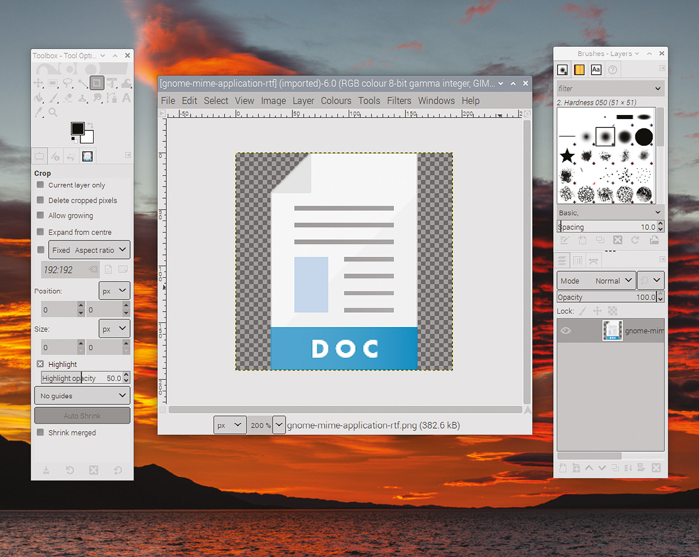

# Capitolul 13: Introducere în GTK

*Acum că aveți o bază în programarea C, sunteți pregătit să începeți să creați interfețe grafice*

Până acum, în această carte, am învățat elementele de bază ale limbajului C și am văzut cum îl putem folosi pentru a scrie programe doar cu text, pe care le rulați din linia de comandă. Privind cuvintele cheie și funcțiile de bibliotecă pe care le-am văzut până acum, nu este evident cum ați putea crea cu ele tot ce este necesar pentru o interfață grafică completă: desktop, ferestre, pictograme, cursorul mouse-ului și așa mai departe.

Este pe deplin posibil să faceți asta în C, dar, sincer, ar fi incredibil de laborios și de consumator de timp. Trebuie să găsiți în memorie **bufferul ecranului**, partea de memorie care reprezintă pixelii ce alcătuiesc desktopul de pe ecran, și apoi să scrieți în el pixeli noi pentru fiecare fereastră; apoi trebuie să scrieți și mai mulți pixeli ca să arătați unde este cursorul mouse-ului. Apoi trebuie să monitorizați când utilizatorul mișcă mouse-ul și să redesenați cursorul de fiecare dată, iar când utilizatorul apasă butonul mouse-ului, trebuie să calculați unde pe ecran se află cursorul și dacă este deasupra unei ferestre, și așa mai departe…

Destul de amuzant, nu așa se face de obicei în practică; viața e prea scurtă! Cea mai mare parte a acestei funcționalități a fost deja scrisă pentru dumneavoastră. Sistemele de ferestre, cum ar fi X, oferă majoritatea funcțiilor de bază, iar bibliotecile de interfață cu utilizatorul oferă un mijloc comod de a crea aplicații GUI care funcționează cu sisteme ca X; tot ce trebuie să faceți este să alegeți o bibliotecă de interfață potrivită și să folosiți funcțiile predefinite din ea în programul dumneavoastră C.

Există multe biblioteci de interfață cu utilizatorul disponibile; unele sunt proiectate să funcționeze cu un anumit mediu desktop, cum ar fi Windows sau macOS, în timp ce altele sunt multiplatformă și pot funcționa în mai multe medii desktop, la alegere. Cea folosită cel mai des în Raspberry Pi Desktop, inclus în Raspberry Pi OS, se numește **GTK**, și pe aceasta o vom studia în această carte.

## Ce este GTK?

GTK (cunoscut anterior ca GTK+) este prescurtarea de la „GIMP ToolKit”. Site-ul său ([gtk.org](https://www.gtk.org)) îl descrie ca „un toolkit multiplatformă pentru crearea interfețelor grafice cu utilizatorul” și a fost scris inițial pentru a oferi elementele de interfață folosite la crearea programului de editare a imaginilor GIMP.

*Editorul de imagini GIMP, creat cu GTK*

A crescut dincolo de asta, devenind un toolkit de interfață de uz general, și este acum una dintre cele mai folosite biblioteci de interfață pe desktopul Linux.

Elementele fundamentale de construcție ale proiectelor GTK se numesc **widgeturi**. Tot ce vedeți pe ecran (o fereastră, un buton, o etichetă) este un widget. Biblioteca GTK face toată munca necesară pentru crearea widgeturilor; tot ce trebuie să faceți este să îi spuneți ce widgeturi doriți, unde doriți să le puneți și ce doriți să facă, iar GTK va gestiona tot restul pentru dumneavoastră.

Ca să vă faceți o idee despre ce înseamnă „gestionează tot restul”, imaginați-vă situația descrisă mai sus, în care creați manual o fereastră desenând pixeli, prin scrierea de date în bufferul ecranului. Dacă utilizatorul apasă pe bara de titlu a ferestrei și o trage în alt loc pe ecran, trebuie să detectați că s-a apăsat mouse-ul, trebuie să urmăriți că este mișcat și trebuie să redesenați fereastra în fiecare punct pe măsură ce se mișcă, restaurând ce era dedesubt în zonele din care s-a mutat. Doar tragerea unei ferestre ar însemna sute de linii de cod; dar cu GTK, creați un widget „fereastră” (cu o singură linie de cod) și de toate acestea se ocupă biblioteca.

Bibliotecile ca GTK fac, prin urmare, crearea interfețelor grafice bogate relativ ușoară și s-ar putea să fiți surprins de cât de puțin cod trebuie să scrieți ca să obțineți ceva funcțional.

## Versiunile GTK

Un lucru care merită menționat în acest punct este că sunt în uz mai multe versiuni de GTK. Versiunea curentă este GTK 4, care este încă în dezvoltare activă; se schimbă destul de mult de la o ediție la alta.

Din acest motiv, mulți preferă să folosească una dintre versiunile mai vechi. Unii spun că e întotdeauna mai bine să folosești cea mai nouă și mai grozavă versiune a oricărui lucru, dar inginerii mai bătrâni și mai precauți (ca autorul…) tind să prefere versiunea mai veche, care a fost testată mult mai mult și la care oamenii au încetat să mai umble! De aceea versiunea „bullseye” a Raspberry Pi Desktop folosește GTK 3, și de aceea aceasta este versiunea acoperită în această carte.

Exemplele din această carte folosesc toate GTK 3. Deși o parte din acest cod ar rula corect și sub GTK 2 sau GTK 4, există părți care ar trebui modificate pentru a funcționa pe alte versiuni de GTK, iar aceste modificări depășesc domeniul acestei cărți.

> **NOTA TRADUCĂTORULUI**
>
> Ediția a doua a cărții a fost actualizată în 2021 pentru GTK 3 și Raspberry Pi OS „bullseye”. Versiunile ulterioare de Raspberry Pi OS includ în continuare GTK 3, iar pachetul de dezvoltare `libgtk-3-dev` se instalează la fel. Exemplele din carte funcționează neschimbate și pe alte distribuții Linux cu GTK 3 instalat.

## O notă despre teme

Una dintre funcțiile puternice ale GTK este tematizarea (*theming*). Aspectul fiecărui widget din GTK poate fi personalizat în aproape orice detaliu, de la culoarea textului la forma colțurilor unui buton. Această personalizare este complet separată de programarea propriu-zisă a unei aplicații GTK; în schimb, aspectul widgeturilor este controlat de **tema** curentă folosită pe sistemul pe care rulează aplicațiile GTK.

Crearea unei teme depășește domeniul acestei cărți; este o procedură destul de complicată și migăloasă. Toate capturile de ecran din această carte au fost făcute pe un Raspberry Pi care rulează mediul Raspberry Pi Desktop, care folosește o temă personalizată numită PiXflat. Dacă lucrați cu GTK pe un alt calculator, cu o altă temă, widgeturile dumneavoastră pot arăta puțin diferit de cele din imagini, dar codul pe care îl scrieți va fi același.

### Puncte cheie:

- ✅ O interfață grafică se poate scrie în C, dar bibliotecile de interfață fac toată munca grea
- ✅ GTK („GIMP ToolKit”) este biblioteca folosită de Raspberry Pi Desktop și de mare parte din desktopul Linux
- ✅ Totul în GTK este un **widget**: ferestre, butoane, etichete
- ✅ Cartea folosește **GTK 3**; GTK 4 se schimbă încă mult de la o versiune la alta
- ✅ Aspectul widgeturilor este dat de **tema** sistemului, nu de codul dumneavoastră

În capitolul următor, vom scrie și vom compila primul program GTK: o fereastră goală, în doar câteva linii de cod!
