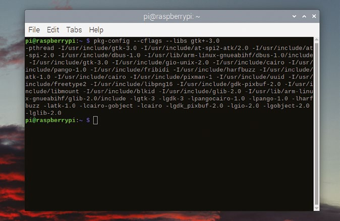
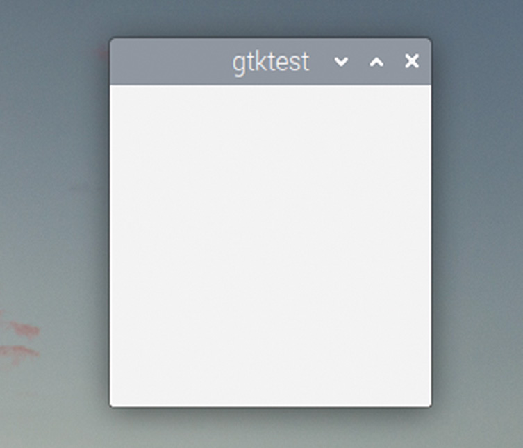

# Capitolul 14: Primul dumneavoastră program GTK

*Începeți să programați în C cu biblioteca GTK și creați prima dumneavoastră aplicație grafică simplă*

Să creăm un program GTK simplu. Deschideți editorul de text preferat și scrieți următoarele:

```c
#include <gtk/gtk.h>

int main (int argc, char *argv[])
{
  gtk_init (&argc, &argv);
  GtkWidget *win = gtk_window_new (GTK_WINDOW_TOPLEVEL);
  gtk_widget_show (win);
  gtk_main ();
  return 0;
}
```

V-am spus că nu aveți nevoie de mult cod! Să îl analizăm linie cu linie înainte să încercăm să îl rulăm.

```c
#include <gtk/gtk.h>
```

Aceasta este o instrucțiune pentru preprocesor, care îi spune că scriem un program GTK și că trebuie să încarce fișierele antet GTK. Fără ea, compilatorul nu ar recunoaște niciuna dintre funcțiile bibliotecii GTK pe care urmează să le folosim.

```c
int main (int argc, char *argv[])
```

Acesta este punctul de pornire standard al unui program C: o funcție `main` cu câteva argumente și o valoare returnată.

```c
  gtk_init (&argc, &argv);
```

Aceasta este prima noastră bucată de cod GTK. Trebuie să apelați `gtk_init` la începutul oricărui program GTK; funcția inițializează toate variabilele interne folosite de biblioteca GTK și o pregătește pentru utilizare. (Observați că orice argumente din linia de comandă date programului sunt transmise mai departe bibliotecii GTK, prin argumentele acestei funcții.)

```c
  GtkWidget *win = gtk_window_new (GTK_WINDOW_TOPLEVEL);
```

Aceasta creează un widget de tip `GtkWindow`. Pentru fiecare tip de widget din GTK există o funcție `_new`, care creează o instanță a acelui widget și returnează un pointer către ea.

```c
  gtk_widget_show (win);
```

Aceasta îi spune lui GTK să afișeze widgetul pe care tocmai l-am creat. Linia anterioară a creat widgetul într-o stare ascunsă; widgeturile pot fi văzute doar dacă sunt scoase din ascundere cu un apel `_show` ca acesta.

```c
  gtk_main ();
```

Apelul `gtk_main` rulează bucla principală a lui GTK; aceasta predă, de fapt, controlul programului lui GTK însuși, care procesează apoi orice evenimente ale utilizatorului, cum ar fi apăsările de butoane, pentru a controla interfața pe care ați creat-o.

```c
  return 0;
```

Formal, cum acesta este un program C în care funcția `main` returnează o valoare întreagă, trebuie să returnăm o valoare. Totuși, asta este în mare parte fără rost la un program cu interfață grafică, unde linia de comandă, și deci orice valoare returnată, de obicei nu se vede oricum; linia este inclusă aici pentru completitudine, dar, pentru a economisi spațiu, nu va mai apărea în niciun alt exemplu din această carte.

Asta e, într-adevăr, tot: acesta este cel mai simplu program GTK care face ceva cu sens. Tastați-l în editorul preferat și salvați-l ca `gtktest.c`. Acum trebuie să îl construim și să îl rulăm…

## Construirea unui program GTK

Dacă scriem un program C standard, pentru linia de comandă, putem folosi pur și simplu compilatorul gcc ca să construim fișierul sursă: `gcc gtktest.c` ar produce un fișier executabil. Totuși, lucrurile nu sunt chiar atât de simple dacă folosim o bibliotecă externă, cum ar fi GTK.

Mai întâi trebuie să ne asigurăm că bibliotecile GTK necesare sunt instalate. Pentru asta, tastați într-o fereastră de terminal:

```bash
sudo apt-get install libgtk-3-dev
```

și răspundeți da la orice întrebare; aceasta instalează bibliotecile de dezvoltare pentru GTK 3.

Acum trebuie să îi spunem compilatorului unde să găsească fișierele antet GTK și, de asemenea, trebuie să îi spunem linkerului că vrem ca programul să fie legat cu fișierele de bibliotecă GTK, altfel toată „GTK-itatea” pe care vrem să o folosim va fi indisponibilă.

Există un utilitar numit `pkg-config` care ne ajută aici. `pkg-config` este o unealtă care generează argumentele necesare lui gcc pentru a folosi biblioteci suplimentare. Încercați să tastați în linia de comandă:

```bash
pkg-config --cflags --libs gtk+-3.0
```

și priviți rezultatul. Veți vedea o listă de șiruri: cele care încep cu `-I/` sunt directoarele în care sunt stocate fișierele include ale GTK, iar cele care încep cu `-l` sunt numele fișierelor de bibliotecă GTK.



*Rezultatul lui pkg-config este o listă lungă de opțiuni și biblioteci care trebuie transmise compilatorului pentru a construi un program GTK*

Toate acestea trebuie adăugate în linia de comandă a lui gcc pentru a construi programul nostru GTK, așa că includem comanda `pkg-config` între apostrofuri inverse (`` ` ``), astfel:

```bash
gcc gtktest.c `pkg-config --cflags --libs gtk+-3.0` -o gtktest
```

> **NOTA TRADUCĂTORULUI**
>
> În cartea originală, numele pachetului apare tipărit ca `gtk+3.0`, fără cratimă. Numele corect, pe care îl recunoaște `pkg-config`, este `gtk+-3.0`, așa cum apare mai sus și în README-ul acestei traduceri. Dacă primiți mesajul „Package gtk+3.0 was not found”, aceasta este cauza.

Dacă rulați comanda, ar trebui să obțineți un fișier executabil numit `gtktest`. Rulați-l tastând:

```bash
./gtktest
```

…și vedeți ce se întâmplă.



*Prima dumneavoastră fereastră GTK*

Ar trebui să vedeți o mică fereastră gri, pătrată, deschizându-se undeva pe desktop; nu va face mare lucru, dar o puteți trage de colo-colo, o puteți minimiza și maximiza. Dacă apăsați pe X-ul din colțul din dreapta-sus, fereastra se închide, dar dacă vă uitați în fereastra de terminal din care ați rulat `gtktest`, veți vedea că programul încă rulează. Asta pentru că închiderea unei ferestre nu termină funcția `gtk_main`, care va continua să ruleze până când apăsați CTRL+C în fereastra de terminal.

Felicitări! Tocmai ați creat prima dumneavoastră aplicație grafică cu GTK. În capitolul următor, vom pune ceva în acea fereastră goală.

> **CODUL SURSĂ**
>
> Programul din acest capitol se găsește în [codul_sursa/capitolul14/exemplul01.c](codul_sursa/capitolul14/exemplul01.c).

### Puncte cheie:

- ✅ `#include <gtk/gtk.h>` aduce toate declarațiile bibliotecii GTK
- ✅ `gtk_init` se apelează la începutul oricărui program GTK
- ✅ Fiecare tip de widget are o funcție `_new`, iar widgeturile noi sunt ascunse până la un apel `_show`
- ✅ `gtk_main` rulează bucla principală și predă controlul lui GTK
- ✅ Compilați cu `` gcc fisier.c `pkg-config --cflags --libs gtk+-3.0` -o program ``
- ✅ Închiderea ferestrei cu X nu oprește programul; vom rezolva asta în capitolul următor

În capitolul următor, vom adăuga un buton în fereastră și vom învăța despre semnale, mecanismul prin care GTK reacționează la acțiunile utilizatorului!
