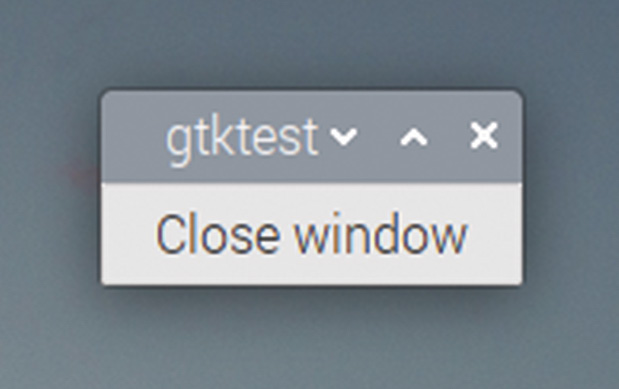

# Capitolul 15: Butoane

*Faceți fereastra goală mai interesantă și mai interactivă, adăugând un buton*

Programul simplu pe care l-am analizat în capitolul anterior desenează o fereastră pe ecran, dar arată destul de gol. Mai este și problema că închiderea ferestrei cu butonul X lasă programul în continuare pornit. Vom rezolva ambele probleme adăugând un buton care închide fereastra.

Un buton este un alt widget GTK standard și suportă toate funcțiile la care v-ați aștepta: poate avea o etichetă; îi puteți vedea aspectul schimbându-se când apăsați pe el; îl puteți activa cu o scurtătură de la tastatură; puteți chiar să îl dezactivați temporar, făcându-l gri.

Primul lucru de făcut este să adăugăm butonul în fereastră. După ce am făcut asta, ne putem uita cum să îl facem să facă ceva util.

Modificați codul exemplului anterior după cum urmează:

```c
#include <gtk/gtk.h>

void main (int argc, char *argv[])
{
  gtk_init (&argc, &argv);
  GtkWidget *win = gtk_window_new (GTK_WINDOW_TOPLEVEL);
  GtkWidget *btn = gtk_button_new_with_label ("Close window");
  gtk_container_add (GTK_CONTAINER (win), btn);
  gtk_widget_show_all (win);
  gtk_main ();
}
```

Să analizăm schimbările:

```c
  GtkWidget *btn = gtk_button_new_with_label ("Close window");
```

Aceasta creează un widget `GtkButton`. Există o funcție standard `gtk_button_new`, dar folosirea acestei versiuni, `gtk_button_new_with_label`, ne permite să adăugăm butonului o etichetă text în același timp în care îl creăm.

```c
  gtk_container_add (GTK_CONTAINER (win), btn);
```

Funcția `gtk_container_add` plasează butonul în interiorul ferestrei.

```c
  gtk_widget_show_all (win);
```

În final, apelul `gtk_widget_show` este înlocuit cu un apel `gtk_widget_show_all`; acesta îi spune lui GTK să afișeze atât widgetul numit, cât și orice widgeturi conținute de el. Dacă această linie nu ar fi schimbată, fereastra ar fi afișată, dar butonul ar rămâne ascuns.

Dacă acum construiți și rulați codul, veți constata că obțineți o fereastră (mai mică) cu un buton etichetat „Close window” afișat pe ea:



*Fereastra cu un buton pe ea*

## Containere

În exemplu, folosim linia:

```c
  gtk_container_add (GTK_CONTAINER (win), btn);
```

…ca să punem butonul în fereastră.

Așa cum probabil ați observat, fiecare apel de funcție din GTK începe cu prefixul `gtk_`, urmat de numele tipului de widget asupra căruia operează; astfel, `gtk_window_new` creează un widget de tip `GtkWindow`. Acest apel de funcție, prin urmare, operează asupra widgeturilor de tip `GtkContainer`, dar noi îl folosim pe `win`, care este un `GtkWindow`. Cum funcționează asta?

Există o **ierarhie** a tipurilor de widgeturi în GTK, iar un tip de widget moștenește proprietățile părinților săi din ierarhie; acel tip de widget poate fi descris ca un copil al tipurilor de widget de deasupra lui în ierarhie.

Pentru că `GtkContainer` este unul dintre părinții lui `GtkWindow`, puteți folosi funcțiile `gtk_container_` pe widgeturi `GtkWindow`. Multe widgeturi au `GtkContainer` ca părinte, pentru că a pune un widget în interiorul altuia, ca aici, este ceva ce trebuie să facem destul de des.

Veți observa că, atunci când `win` este dat ca argument funcției `gtk_container_add`, este învelit în funcția `GTK_CONTAINER()`; aceasta convertește (*cast*) argumentul la o variabilă de tip `GTK_CONTAINER`; cu alte cuvinte, îi spune apelului de funcție să trateze această referință la un `GtkWindow` ca pe un `GtkContainer`. Codul ar funcționa și dacă această funcție nu ar fi inclusă, dar compilatorul s-ar plânge! (GTK include o funcție `GTK_` pentru fiecare tip de widget, pentru că este destul de frecvent nevoie să convertim un widget la un alt tip.)

Așadar, ce face această linie este să îi spună lui GTK să trateze widgetul `GtkWindow` `win` ca pe un `GtkContainer` și să pună în el widgetul buton `btn`.

## Semnale

Dacă rulați aplicația, puteți apăsa pe buton cu mouse-ul, iar el se va evidenția ca să arate că a fost apăsat; puteți apăsa și tasta ENTER de pe tastatură ca să faceți același lucru; acest buton se comportă exact ca butoanele pe care suntem obișnuiți să le vedem în aplicații, dar tot nu face nimic util. Pasul următor este să rezolvăm asta.

Modul de a face asta este să conectăm o **funcție de tratare** (*handler*) la **semnalul** generat când butonul este apăsat.

Iată codul cu un handler adăugat:

```c
#include <gtk/gtk.h>

void end_program (GtkWidget *wid, gpointer ptr)
{
   gtk_main_quit ();
}

void main (int argc, char *argv[])
{
  gtk_init (&argc, &argv);
  GtkWidget *win = gtk_window_new (GTK_WINDOW_TOPLEVEL);
  GtkWidget *btn = gtk_button_new_with_label ("Close window");
  g_signal_connect (btn, "clicked", G_CALLBACK (end_program),
      NULL);
  gtk_container_add (GTK_CONTAINER (win), btn);
  gtk_widget_show_all (win);
  gtk_main ();
}
```

Funcția de tratare, cunoscută și ca **callback**, se numește `end_program`, și tot ce face este să apeleze funcția GTK `gtk_main_quit`; așa cum v-ați aștepta din nume, această funcție iese din bucla din `gtk_main` și permite programului să se termine.

```c
  g_signal_connect (btn, "clicked", G_CALLBACK (end_program),
      NULL);
```

Această linie conectează handlerul (`end_program`) la semnalul numit `clicked`, care este emis de un widget buton atunci când se apasă pe el cu mouse-ul. Folosim funcția `G_CALLBACK` ca să ne asigurăm că compilatorul știe că funcția `end_program` este un callback valid.

> **NOTA TRADUCĂTORULUI**
>
> Textul original numește această funcție `GTK_CALLBACK`, dar în cod, și în biblioteca GTK, numele ei este `G_CALLBACK`, cu prefixul `G_` al bibliotecii GLib, pe care GTK o folosește pentru semnale.

Semnalele sunt folosite mult în GTK; toate widgeturile pot genera semnale în diverse circumstanțe, mai ales când utilizatorul interacționează cu ele, dar și când au loc anumite evenimente de sistem. Fiecare tip de widget are un set de semnale pe care le poate genera; funcția `g_signal_connect` este folosită pentru a „conecta” o funcție de tratare la ele, ceea ce înseamnă că funcția va fi apelată când semnalul este generat.

Tratarea semnalelor este una dintre cele mai importante sarcini ale buclei principale care rulează în `gtk_main`: dacă este generat un semnal, codul din bucla principală verifică dacă există un handler asociat acelui semnal și, dacă da, îl apelează.

Încercați să construiți și să rulați noul cod. Avem acum un buton în fereastră, ca înainte, dar când apăsăm pe buton, fereastra se închide și, important, programul se și termină.

Tot nu este perfect, însă: dacă apăsăm pe X-ul din dreapta-sus, fereastra se închide, dar programul nu se termină. Să rezolvăm asta.

Modul în care o facem este să conectăm un alt handler la semnalul generat când se apasă acel X. Numele acestui semnal este `delete_event` și este generat de widgetul fereastră. Așa că trebuie să conectăm același handler și la acest eveniment:

```c
  g_signal_connect (win, "delete_event", G_CALLBACK (end_program),
      NULL);
```

Observați că de data aceasta conectăm la `win`, nu la `btn`: semnalul `delete_event` este creat de widgetul fereastră, nu de buton. Acum, dacă fereastra este închisă apăsând pe X, semnalul `delete_event` face ca handlerul `end_program` să fie apelat, iar bucla principală se termină.

Avem acum o aplicație GTK care se deschide și se închide curat, dar tot nu face altceva. Așa că, în capitolul următor, o vom face să facă ceva mai util.

> **CODUL SURSĂ**
>
> Cele trei versiuni ale programului din acest capitol se găsesc în [codul_sursa/capitolul15](codul_sursa/capitolul15/): `exemplul01.c` (butonul simplu), `exemplul02.c` (cu handlerul pentru `clicked`) și `exemplul03.c` (cu handlerul și pentru `delete_event`).

### Puncte cheie:

- ✅ `gtk_button_new_with_label` creează un buton cu text
- ✅ `gtk_container_add` pune un widget în interiorul altuia; `gtk_widget_show_all` afișează și conținutul
- ✅ Widgeturile formează o **ierarhie**: un `GtkWindow` este și un `GtkContainer`, iar `GTK_CONTAINER()` face conversia explicită
- ✅ Widgeturile emit **semnale** (`clicked`, `delete_event`); `g_signal_connect` leagă un semnal de o funcție **callback**
- ✅ `gtk_main_quit` încheie bucla principală și programul

În capitolul următor, vom adăuga o etichetă și un al doilea buton, și vom descoperi că o fereastră nu poate conține decât un singur widget… dacă nu folosim o cutie!
