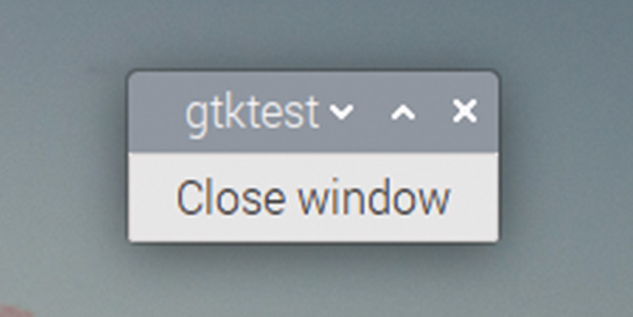
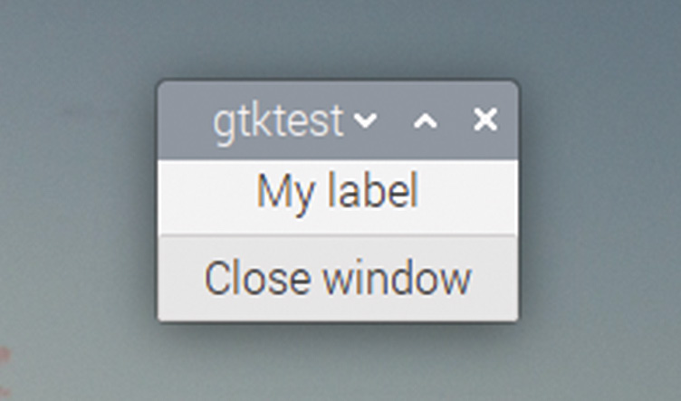
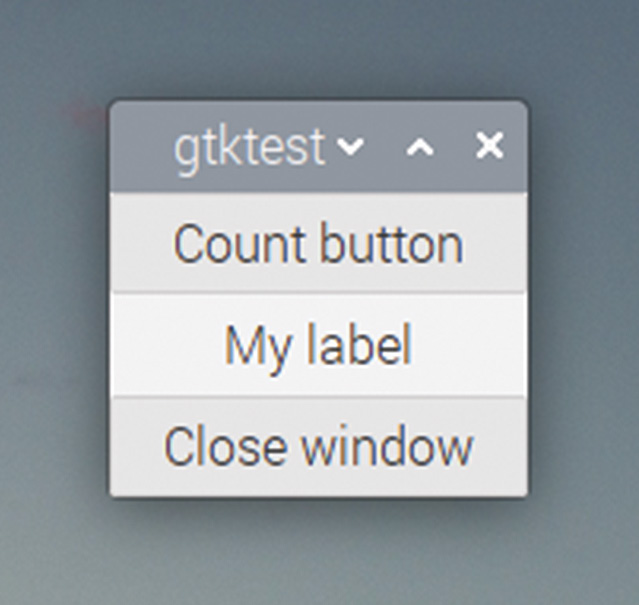
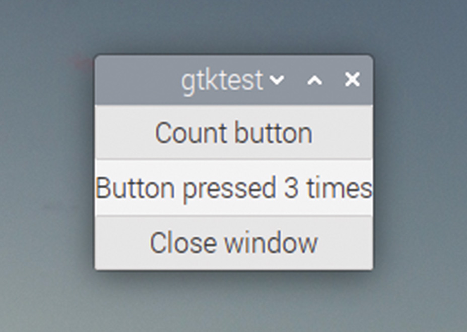

# Capitolul 16: Etichete și aspect

*Folosiți un widget cutie pentru a adăuga o etichetă text în fereastră, apoi creați un contor de apăsări de buton*

Vom adăuga un alt buton în fereastră și vom afișa numărul de apăsări ale butonului. (Tot ce am spus a fost că va fi mai util decât exemplul anterior; nu am spus că va fi util pentru ceva ce oamenii chiar ar vrea să facă!)

## Etichete

Pentru afișarea textului într-o fereastră folosim un widget numit `GtkLabel`; o etichetă este orice bucată de text care nu poate fi editată de utilizator. (Butonul pe care l-am adăugat în exemplul anterior conține un widget etichetă, care afișează numele dat butonului în apelul `gtk_button_new_with_label`.)

Puteți crea o etichetă cu text deja în ea, sau puteți crea o etichetă goală și adăuga textul mai târziu; puteți schimba oricând și textul existent dintr-o etichetă.

Iată codul pentru a adăuga o etichetă în fereastra noastră:

```c
#include <gtk/gtk.h>

void end_program (GtkWidget *wid, gpointer ptr)
{
    gtk_main_quit ();
}

void main (int argc, char *argv[])
{
  gtk_init (&argc, &argv);
  GtkWidget *win = gtk_window_new (GTK_WINDOW_TOPLEVEL);
  GtkWidget *btn = gtk_button_new_with_label ("Close window");
  g_signal_connect (btn, "clicked", G_CALLBACK (end_program),
      NULL);
  g_signal_connect (win, "delete_event", G_CALLBACK (end_program),
      NULL);
  gtk_container_add (GTK_CONTAINER (win), btn);
  GtkWidget *lbl = gtk_label_new ("My label");
  gtk_container_add (GTK_CONTAINER (win), lbl);
  gtk_widget_show_all (win);
  gtk_main ();
}
```

Să analizăm codul nou:

```c
  GtkWidget *lbl = gtk_label_new ("My label");
```

Aceasta creează un `GtkLabel` numit `lbl`, cu textul „My label” în el. Apoi apelăm un alt `gtk_container_add` ca să adăugăm eticheta în fereastră. Construiți și rulați codul și vedeți ce se întâmplă.



*Un buton, dar nicio etichetă…*

Ah. O fereastră cu un buton, dar fără etichetă. Ce a mers prost? Ei bine, dacă vă uitați în fereastra de terminal, puteți găsi un indiciu: ar trebui să vedeți un mesaj de eroare care vă spune că un `GtkWindow` poate conține un singur widget la un moment dat și că acesta conține deja un `GtkButton`.

Așadar, puteți pune un singur widget într-o fereastră, dar noi vrem să avem două, un buton și o etichetă; asta nu va merge. Doar dacă…

## Cutii

Un toolkit de interfață care v-ar permite să puneți un singur lucru într-o fereastră ar fi cam limitat! Așa că, deși o fereastră poate conține un singur widget, GTK are mai multe widgeturi care pot fi folosite pentru a ține seturi de alte widgeturi. Cele mai utile două sunt **cutiile** (*boxes*) și **grilele** (*grids*); deocamdată vom rămâne la cutii, pentru că sunt mai ușor de folosit.

Un widget cutie poate avea una din două orientări, orizontală sau verticală, în funcție de cum urmează să fie aranjate widgeturile pe care le puneți în cutie. Un widget cutie poate ține un număr nelimitat de alte widgeturi, dar apare pentru părintele său ca un singur widget, așa că poate fi folosit pentru a pune mai multe widgeturi într-o fereastră.

Vom folosi un `GtkBox` cu orientare verticală pentru acest exemplu, așa că modificați codul după cum urmează:

```c
#include <gtk/gtk.h>

void end_program (GtkWidget *wid, gpointer ptr)
{
   gtk_main_quit ();
}

void main (int argc, char *argv[])
{
  gtk_init (&argc, &argv);
  GtkWidget *win = gtk_window_new (GTK_WINDOW_TOPLEVEL);
  GtkWidget *btn = gtk_button_new_with_label ("Close window");
  g_signal_connect (btn, "clicked", G_CALLBACK (end_program),
      NULL);
  g_signal_connect (win, "delete_event", G_CALLBACK (end_program),
      NULL);
  GtkWidget *lbl = gtk_label_new ("My label");
  GtkWidget *box = gtk_box_new (GTK_ORIENTATION_VERTICAL, 5);
  gtk_box_pack_start (GTK_BOX (box), lbl, TRUE, TRUE, 0);
  gtk_box_pack_start (GTK_BOX (box), btn, TRUE, TRUE, 0);
  gtk_container_add (GTK_CONTAINER (win), box);
  gtk_widget_show_all (win);
  gtk_main ();
}
```

Să analizăm schimbările linie cu linie:

```c
  GtkWidget *box = gtk_box_new (GTK_ORIENTATION_VERTICAL, 5);
```

Aceasta creează un widget `GtkBox` nou. Cei doi parametri ai apelului sunt orientarea cutiei, orizontală sau verticală, și spațierea în pixeli dintre widgeturile pe care le ține. Așadar, în acest caz, widgeturile din cutie vor fi orientate vertical, unul deasupra celuilalt, și va exista un spațiu de 5 pixeli între cele două widgeturi pe care le punem în ea.

```c
  gtk_box_pack_start (GTK_BOX (box), lbl, TRUE, TRUE, 0);
  gtk_box_pack_start (GTK_BOX (box), btn, TRUE, TRUE, 0);
```

Funcția `gtk_box_pack_start` pune un widget într-o cutie. Widgeturile sunt adăugate în ordinea în care sunt făcute apelurile acestei funcții, iar `_start` de la sfârșit indică faptul că widgeturile sunt plasate în cutie de la capătul „de început”, care este partea de sus a unei cutii verticale sau partea stângă a unei cutii orizontale. (Există și o funcție `gtk_box_pack_end`, care adaugă widgeturile dinspre partea de jos sau dinspre dreapta.)

Funcția primește cinci argumente; primul este numele cutiei în care împachetăm widgeturile, iar al doilea este widgetul pe care vrem să îl punem în cutie. Celelalte trei argumente controlează cum este poziționat widgetul în cutie; ne vom uita la asta mai târziu.

```c
  gtk_container_add (GTK_CONTAINER (win), box);
```

În final, adăugăm cutia în fereastra însăși; asta înseamnă că fereastra ține un singur widget, cutia, și deci nu se va plânge că ține prea multe widgeturi.

Dacă acum construiți și rulați acest cod, ar trebui să vedeți o fereastră ca aceasta:



*Un GtkLabel și un GtkButton*

Acum că avem o fereastră cu controalele de care avem nevoie, să ne întoarcem la crearea contorului nostru de apăsări. Iată codul:

```c
#include <gtk/gtk.h>

int count = 0;

void end_program (GtkWidget *wid, gpointer ptr)
{
  gtk_main_quit ();
}

void count_button (GtkWidget *wid, gpointer ptr)
{
  char buffer[30];
  count++;
  sprintf (buffer, "Button pressed %d times", count);
  gtk_label_set_text (GTK_LABEL (ptr), buffer);
}

void main (int argc, char *argv[])
{
  gtk_init (&argc, &argv);
  GtkWidget *win = gtk_window_new (GTK_WINDOW_TOPLEVEL);
  GtkWidget *btn = gtk_button_new_with_label ("Close window");
  g_signal_connect (btn, "clicked", G_CALLBACK (end_program),
      NULL);
  g_signal_connect (win, "delete_event", G_CALLBACK (end_program),
      NULL);
  GtkWidget *lbl = gtk_label_new ("My label");
  GtkWidget *btn2 = gtk_button_new_with_label ("Count button");
  g_signal_connect (btn2, "clicked", G_CALLBACK (count_button), lbl);
  GtkWidget *box = gtk_box_new (GTK_ORIENTATION_VERTICAL, 5);
  gtk_box_pack_start (GTK_BOX (box), btn2, TRUE, TRUE, 0);
  gtk_box_pack_start (GTK_BOX (box), lbl, TRUE, TRUE, 0);
  gtk_box_pack_start (GTK_BOX (box), btn, TRUE, TRUE, 0);
  gtk_container_add (GTK_CONTAINER (win), box);
  gtk_widget_show_all (win);
  gtk_main ();
}
```

Am adăugat un buton nou, `btn2`, și o nouă funcție callback, `count_button`, care a fost conectată la semnalul `clicked` al noului buton.

```c
  g_signal_connect (btn2, "clicked", G_CALLBACK (count_button), lbl);
```

Observați că ori de câte ori am folosit `g_signal_connect` până acum, ultimul argument a fost `NULL`, dar în acest caz este `lbl`. Ultimul argument al acestei funcții este un pointer: poate fi un pointer către orice ar putea avea nevoie handlerul să folosească. Dacă vă uitați la argumentele funcției de tratare, ele sunt:

```c
void count_button (GtkWidget *wid, gpointer ptr)
```

Primul argument al unui handler, pentru orice semnal, este un pointer către widgetul care a generat semnalul. Semnale diferite au numere diferite de argumente în funcțiile lor de tratare, dar toate au un pointer de uz general ca ultim argument, iar acesta primește pointerul dat ca ultim argument apelului `g_signal_connect`.

În acest caz, trebuie să actualizăm textul din `GtkLabel`, așa că handlerul are nevoie de acces la un pointer către etichetă, iar pointerul de uz general este un mod comod de a face asta. Așadar, transmitem pointerul `lbl` lui `g_signal_connect`, iar în handler convertim acest pointer înapoi la un `GtkLabel`, ca să îl putem folosi în funcția `gtk_label_set_text`, care actualizează textul din etichetă:

```c
  gtk_label_set_text (GTK_LABEL (ptr), buffer);
```

Uneori trebuie să transmitem mai mult de o referință unei funcții de tratare; există diverse moduri de a rezolva asta, cum ar fi folosirea structurilor sau a variabilelor globale, dar pentru cazuri simple ca acesta, pointerul de uz general funcționează bine.

Dacă acum construiți și rulați codul, ar trebui să vedeți o fereastră care arată așa:



*Aplicația de numărat apăsările, înainte ca butonul să fie apăsat…*

Când apăsați pe „Count button”, textul din etichetă ar trebui să se actualizeze la fiecare apăsare, astfel:



*…și după ce butonul „Count button” a fost apăsat de trei ori*

> **CODUL SURSĂ**
>
> Cele trei programe din acest capitol se găsesc în [codul_sursa/capitolul16](codul_sursa/capitolul16/): `exemplul01.c` (eticheta care nu apare), `exemplul02.c` (eticheta și butonul într-o cutie) și `exemplul03.c` (contorul de apăsări).

### Puncte cheie:

- ✅ `GtkLabel` afișează text pe care utilizatorul nu îl poate edita; `gtk_label_set_text` îl schimbă din cod
- ✅ O fereastră poate conține un **singur** widget; pentru mai multe folosiți un `GtkBox` (sau un `GtkGrid`)
- ✅ `gtk_box_new` primește orientarea și spațierea; `gtk_box_pack_start` adaugă widgeturi de la început
- ✅ Ultimul argument al lui `g_signal_connect` ajunge în handler ca pointerul de uz general `ptr`
- ✅ Primul argument al oricărui handler este widgetul care a generat semnalul

În capitolul următor, vom vedea ce fac cele trei argumente rămase ale lui `gtk_box_pack_start` și vom învăța să aranjăm widgeturile în rânduri și coloane, cu `GtkGrid`!
