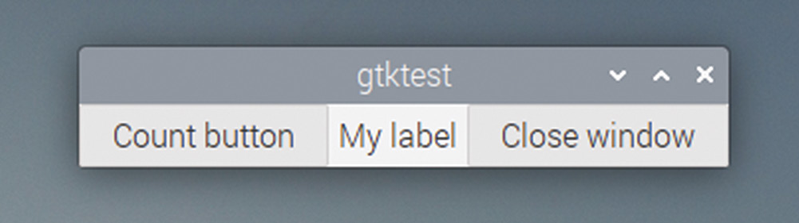
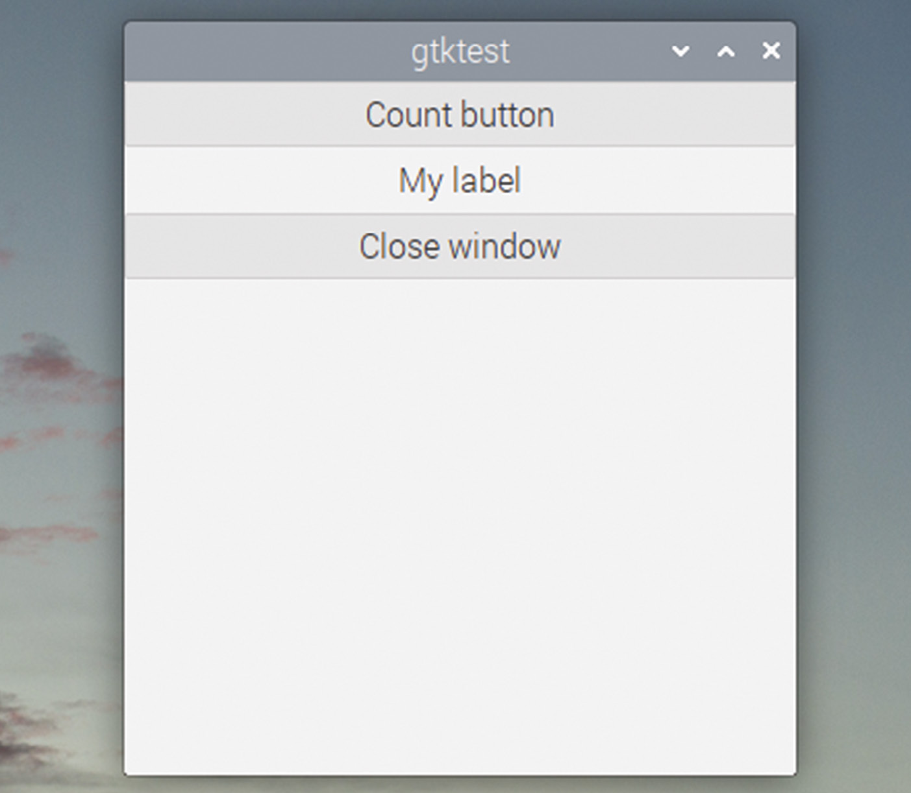
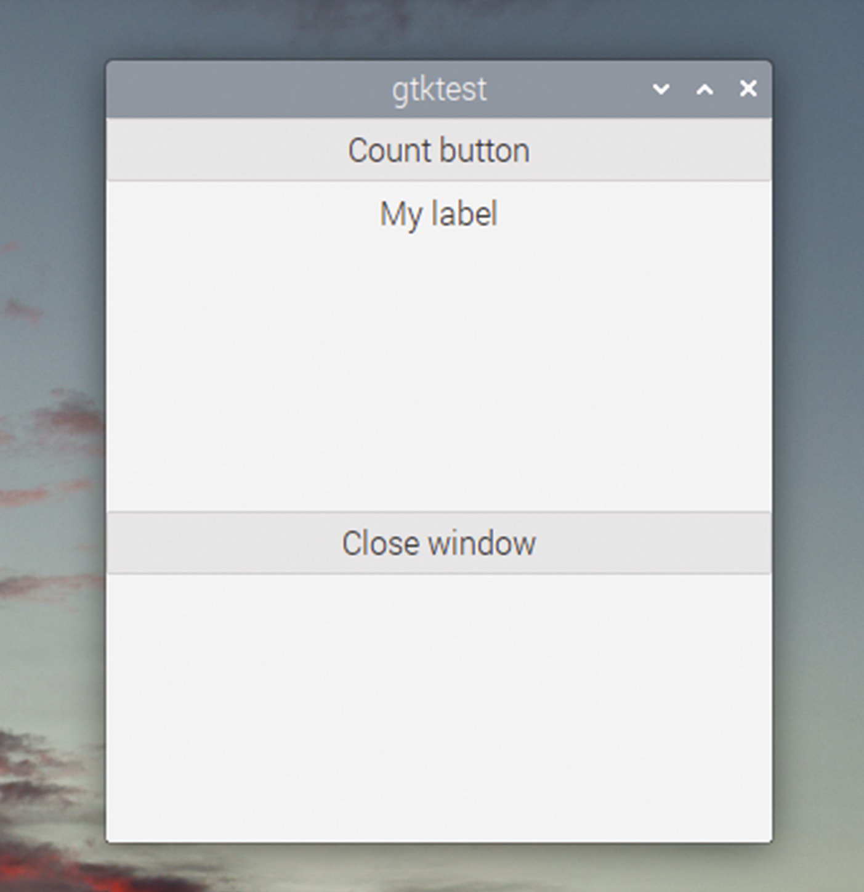
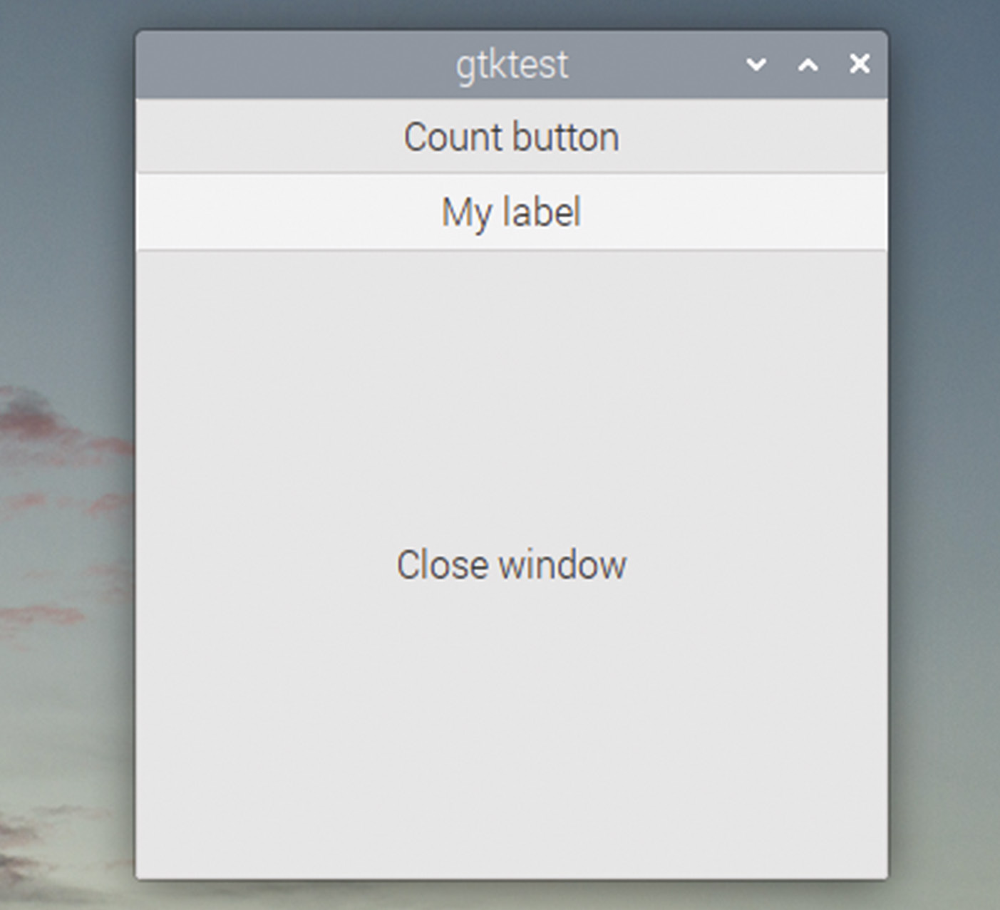
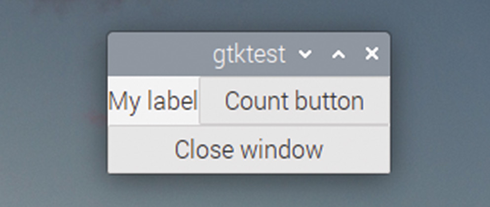

# Capitolul 17: Aspect avansat

*Învățați cum să vă extindeți fereastra și cum să poziționați și să redimensionați automat butoanele*

Am menționat în capitolul anterior că o cutie poate fi orizontală sau verticală. Doar ca să vedeți diferența, încercați să schimbați linia:

```c
  GtkWidget *box = gtk_box_new (GTK_ORIENTATION_VERTICAL, 5);
```

…în:

```c
  GtkWidget *box = gtk_box_new (GTK_ORIENTATION_HORIZONTAL, 5);
```

…și reconstruiți programul; ar trebui să vedeți următoarele:



*Efectul schimbării orientării unui GtkBox din verticală în orizontală*

Aceasta demonstrează efectul schimbării orientării unui `GtkBox`: schimbă pur și simplu direcția în care sunt așezate widgeturile.

Dar ce e cu celelalte argumente ale lui `gtk_box_pack_start`, peste care am trecut mai devreme? Ele sunt proiectate să vă permită să mutați lucrurile în interiorul cutiilor și să vă dea mai mult control asupra locului exact în care ajung widgeturile în fereastră.

În ferestrele pe care le-am văzut până acum, asta nu pare deosebit de util, pentru că butonul și eticheta ocupă amândouă exact atât spațiu cât au nevoie, dar nu mai mult. Dar ferestrele GTK pot fi, de obicei, redimensionate: utilizatorul poate apuca un colț al ferestrei și o poate întinde la o mărime arbitrară pe fiecare dimensiune. GTK încearcă să redimensioneze inteligent ferestrele și widgeturile, astfel încât lucrurile să crească și să se micșoreze proporțional unele cu altele; aceste argumente suplimentare vă permit să controlați ce se întâmplă cu widgeturile când se schimbă mărimea ferestrei.

Al treilea argument al lui `gtk_box_pack_start` se numește **expand** (extindere). Dacă este setat la `TRUE`, atunci când o fereastră este mărită, spațiul alocat acestui widget este mărit proporțional. Dacă este setat la `FALSE`, spațiul alocat acestui widget nu este niciodată mai mare decât minimul de care are nevoie.

Al patrulea argument se numește **fill** (umplere). Nu are niciun efect dacă `expand` este `FALSE`, dar dacă `expand` este `TRUE`, el controlează dacă ceea ce crește este spațiul alocat widgetului sau widgetul însuși. Dacă `expand` este `TRUE` și `fill` este `FALSE`, widgetul rămâne de aceeași mărime, dar spațiul din jurul lui crește; dacă atât `expand`, cât și `fill` sunt `TRUE`, widgetul însuși crește, ca să umple spațiul mărit.

Asta este oarecum greu de urmărit în scris, dar câteva exemple vor ajuta la lămurire. Schimbați orientarea lui `GtkBox` înapoi la `GTK_ORIENTATION_VERTICAL`, apoi setați atât `expand`, cât și `fill` la `FALSE` pentru toate cele trei apeluri `gtk_box_pack_start` din exemplul de mai sus. Dacă redimensionați apoi fereastra, eticheta și cele două butoane vor rămâne toate de aceeași înălțime, în partea de sus a ferestrei:



*Aspectul cu expand și fill setate la FALSE pentru toate widgeturile*

Acum încercați același lucru, dar schimbați parametrul `expand` în apelul `gtk_box_pack_start` pentru `btn` la `TRUE`:



*Aspectul cu expand setat la TRUE și fill la FALSE pentru butonul „Close window”*

Butonul se mută acum în jos, ca să se așeze la mijlocul spațiului mărit; spațiul suplimentar a fost alocat butonului, dar butonul însuși are aceeași mărime.

În final, încercați să schimbați atât `expand`, cât și `fill` la `TRUE` pentru `btn`, ca să vedeți un rezultat ca în imaginea de mai jos.



*Aspectul cu expand și fill setate amândouă la TRUE pentru butonul „Close window”*

Mărirea ferestrei face acum ca întregul buton să umple spațiul suplimentar.

Putem vedea că acești parametri afectează doar mărimea verticală a widgeturilor; asta pentru că `GtkBox`-ul în care se află are orientarea setată pe verticală. Dacă vrem să controlăm și mărimea orizontală a widgeturilor, trebuie să creăm un `GtkBox` cu orientare verticală, care să conțină un set de `GtkBox`-uri, fiecare cu orientare orizontală, care sunt apoi folosite pentru a conține widgeturile propriu-zise.

Ultimul argument al apelului `gtk_box_pack_start` se numește **padding** (umplutură): este cantitatea de spațiu liber (în pixeli) inserată la fiecare capăt al acestui widget; aceasta se adaugă spațierii cerute între toate widgeturile în apelul `gtk_box_new`.

Prin ajustarea atentă a parametrilor `expand`, `fill` și `padding`, puteți crea o fereastră care își afișează ordonat toate widgeturile și se redimensionează exact așa cum vă așteptați.

## Grile

S-ar putea să vă întrebați cum puneți, să zicem, patru elemente într-o fereastră, câte două pe fiecare dintre două linii. Ei bine, este perfect acceptabil să puneți un `GtkBox` cu orientare orizontală ca unul dintre elementele dintr-un `GtkBox` cu orientare verticală, sau invers. Este acceptabil chiar să puneți o cutie cu orientare orizontală în interiorul altei cutii cu orientare orizontală (dar în general este cam fără rost). Folosind o combinație de `GtkBox`-uri imbricate, de ambele orientări, puteți așeza toate widgeturile dintr-o fereastră așa cum le doriți.

Deși imbricarea `GtkBox`-urilor funcționează perfect pentru așezarea widgeturilor în două dimensiuni și vă dă, de fapt, cel mai bun control asupra felului în care apar, există o alternativă mai simplă: widgetul `GtkGrid`. Un `GtkGrid` este o cutie bidimensională, în care widgeturile pot fi plasate la diverse coordonate de rând și coloană.

Aceasta nu este, de fapt, la fel de flexibilă ca folosirea `GtkBox`-urilor imbricate, pentru că fiecare widget trebuie aliniat atât pe un rând, cât și pe o coloană; asta înseamnă că orice rând este întotdeauna cel puțin la fel de înalt ca cel mai înalt widget de pe el, iar orice coloană este întotdeauna cel puțin la fel de lată ca cel mai lat widget din ea; asta poate duce la mult spațiu irosit. Dar destul de des un aranjament simplu ca acesta este tot ce e nevoie, așa că un `GtkGrid` funcționează bine.

Iată modificările aduse exemplului nostru, dacă folosim un `GtkGrid` pentru a poziționa eticheta și butoanele:

```c
void main (int argc, char *argv[])
{
  gtk_init (&argc, &argv);
  GtkWidget *win = gtk_window_new (GTK_WINDOW_TOPLEVEL);
  GtkWidget *btn = gtk_button_new_with_label ("Close window");
  g_signal_connect (btn, "clicked", G_CALLBACK (end_program),
      NULL);
  g_signal_connect (win, "delete_event", G_CALLBACK (end_program),
      NULL);
  GtkWidget *lbl = gtk_label_new ("My label");
  GtkWidget *btn2 = gtk_button_new_with_label ("Count button");
  g_signal_connect (btn2, "clicked", G_CALLBACK (count_button),
      lbl);
  GtkWidget *grd = gtk_grid_new ();
  gtk_grid_attach (GTK_GRID (grd), lbl, 0, 0, 1, 1);
  gtk_grid_attach (GTK_GRID (grd), btn2, 1, 0, 1, 1);
  gtk_grid_attach (GTK_GRID (grd), btn, 0, 1, 2, 1);
  gtk_container_add (GTK_CONTAINER (win), grd);
  gtk_widget_show_all (win);
  gtk_main ();
}
```

Creăm un widget `GtkGrid` nou cu:

```c
  GtkWidget *grd = gtk_grid_new ();
```

Pentru a insera un widget în grilă, folosim:

```c
  gtk_grid_attach (GTK_GRID (grd), lbl, 0, 0, 1, 1);
```

Transmitem ca argumente numele grilei și widgetul pe care îl punem în ea. Numerele care urmează sunt, în ordine, coordonatele x și y la care widgetul este atașat grilei, apoi lățimea și înălțimea lui, în pătrate ale grilei.

Așadar, aceasta poziționează widgetul în prima coloană (la poziția x 0, cu o lățime de 1 coloană) și pe primul rând (la poziția y 0, cu o înălțime de 1 rând).

Observați că puteți întinde un widget pe mai multe rânduri și/sau coloane, așa cum este plasat `btn`:

```c
  gtk_grid_attach (GTK_GRID (grd), btn, 0, 1, 2, 1);
```

În acest caz, widgetul se întinde pe prima și a doua coloană, pentru că este plasat la poziția x 0, cu o lățime de 2.

Dacă construiți și rulați acest cod, veți obține o fereastră care arată ca cea de mai jos. Observați că butonul „Close window” se întinde pe ambele coloane ale tabelului, așa cum am descris mai sus.



*Un GtkGrid permite alinierea widgeturilor pe rânduri și coloane*

> **CODUL SURSĂ**
>
> Programele din acest capitol se găsesc în [codul_sursa/capitolul17](codul_sursa/capitolul17/): `exemplul01.c` (contorul cu o cutie orizontală, în care puteți experimenta cu `expand` și `fill`) și `exemplul02.c` (contorul așezat într-un `GtkGrid`).

### Puncte cheie:

- ✅ Orientarea unui `GtkBox` schimbă doar direcția în care sunt așezate widgeturile
- ✅ **expand** = `TRUE`: spațiul alocat widgetului crește odată cu fereastra
- ✅ **fill** = `TRUE` (cu `expand` = `TRUE`): widgetul însuși crește, nu doar spațiul din jurul lui
- ✅ **padding** adaugă spațiu liber la capetele widgetului, pe lângă spațierea cutiei
- ✅ Cutiile se pot imbrica; `GtkGrid` este alternativa mai simplă pentru aranjamente pe rânduri și coloane
- ✅ `gtk_grid_attach` primește coordonatele x, y și lățimea și înălțimea în celule

În capitolul următor, vom citi date de la utilizator: câmpuri de text, butoane rotative, casete de bifat și butoane radio!
