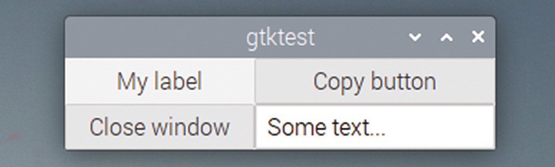
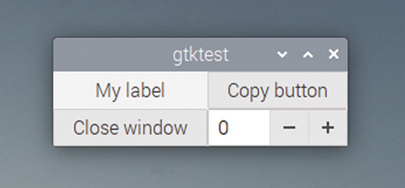
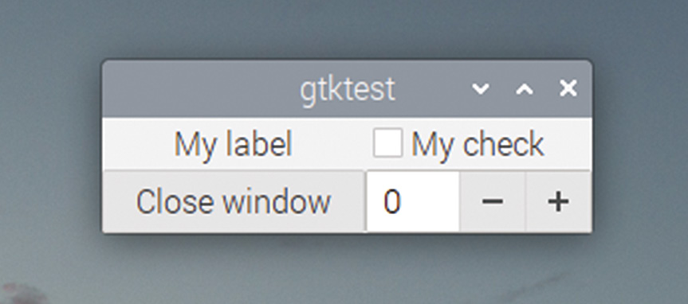
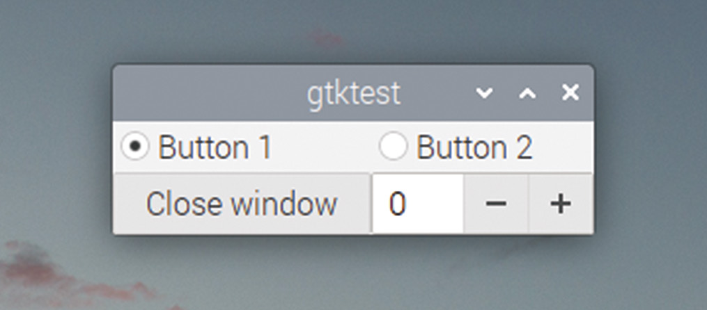

# Capitolul 18: Introducerea datelor în interfața grafică

*Permiteți utilizatorilor să introducă text și să aleagă opțiuni cu casete de bifat și butoane radio*

Am văzut cum putem afișa text într-o fereastră folosind o etichetă, dar ce facem dacă vrem să citim un text pe care l-a tastat utilizatorul? GTK oferă pentru asta widgetul `GtkEntry`.

> **NOTA TRADUCĂTORULUI**
>
> Textul original numește acest widget, în câteva locuri, „GtkTextEntry”. Numele real al widgetului, cel din cod și din documentația GTK, este `GtkEntry`; în traducere am folosit peste tot numele corect.

## Câmpul de text

Modificați codul exemplului de mai sus ca să adăugați o celulă nouă în grilă, cu un widget `GtkEntry`, astfel:

```c
#include <gtk/gtk.h>

GtkWidget *txt;

void end_program (GtkWidget *wid, gpointer ptr)
{
  gtk_main_quit ();
}

void copy_text (GtkWidget *wid, gpointer ptr)
{
  const char *input = gtk_entry_get_text (GTK_ENTRY (txt));
  gtk_label_set_text (GTK_LABEL (ptr), input);
}

void main (int argc, char *argv[])
{
  gtk_init (&argc, &argv);
  GtkWidget *win = gtk_window_new (GTK_WINDOW_TOPLEVEL);
  GtkWidget *btn = gtk_button_new_with_label ("Close window");
  g_signal_connect (btn, "clicked", G_CALLBACK (end_program),
      NULL);
  g_signal_connect (win, "delete_event", G_CALLBACK (end_program),
      NULL);
  GtkWidget *lbl = gtk_label_new ("My label");
  GtkWidget *btn2 = gtk_button_new_with_label ("Copy button");
  g_signal_connect (btn2, "clicked", G_CALLBACK (copy_text), lbl);
  txt = gtk_entry_new ();
  GtkWidget *grd = gtk_grid_new ();
  gtk_grid_attach (GTK_GRID (grd), lbl, 0, 0, 1, 1);
  gtk_grid_attach (GTK_GRID (grd), btn2, 1, 0, 1, 1);
  gtk_grid_attach (GTK_GRID (grd), btn, 0, 1, 1, 1);
  gtk_grid_attach (GTK_GRID (grd), txt, 1, 1, 1, 1);
  gtk_container_add (GTK_CONTAINER (win), grd);
  gtk_widget_show_all (win);
  gtk_main ();
}
```

În acest exemplu, declarăm pointerul către widgetul `GtkEntry`, `txt`, ca variabilă globală. Asta pentru că trebuie să îl accesăm dintr-un handler de buton, care trebuie să acceseze și widgetul `GtkLabel`. Anterior am folosit pointerul de uz general din funcția `g_signal_connect` pentru a transmite informații despre widgeturi unui handler, dar în acest caz handlerul are nevoie de acces la două widgeturi separate, iar noi avem un singur pointer. (Există moduri de a folosi un singur pointer pentru asta, dar folosirea unei variabile globale este mult mai ușor de înțeles.)

Am adăugat o funcție nouă, `copy_text`; aceasta folosește funcția `gtk_entry_get_text` pentru a obține un pointer către bufferul de text folosit de widgetul `GtkEntry`; acesta stochează orice a tastat utilizatorul în câmpul de text. Observați că pointerul către acest buffer de caractere este declarat cu modificatorul `const`; acesta indică o variabilă care nu poate fi schimbată de programator. Transmitem apoi acest buffer lui `gtk_label_set_text`, care copiază conținutul lui `GtkEntry` în `GtkLabel`.

În final, am creat `GtkEntry`-ul însuși cu `gtk_entry_new` și l-am adăugat în grilă. (Observați că am redus și lățimea lui `btn`, astfel încât să ocupe o singură celulă a grilei, nu două, ca să facem loc pentru `GtkEntry`.)

Construiți codul și rulați-l; încercați să tastați ceva în câmpul de text și să apăsați „Copy button”, ca să vedeți ce se întâmplă.



*Un GtkEntry adăugat în dreapta-jos a grilei*

## Butoane rotative

Există și alte moduri prin care utilizatorul poate introduce date. Destul de des, el trebuie să aleagă una dintre mai multe opțiuni, în loc să primească o casetă în care să tasteze. GTK oferă mai multe widgeturi în acest scop; unul, strâns înrudit cu `GtkEntry`, este `GtkSpinButton` (butonul rotativ).

Un buton rotativ este folosit pentru a introduce o valoare numerică dintr-un anumit interval. Specificați valorile minimă și maximă și cu cât ar trebui să se schimbe valoarea la fiecare apăsare a butonului. Acesta oferă un control de introducere a textului, în care utilizatorul poate în continuare să tasteze, cu un mod ușor de a schimba valoarea. Dacă utilizatorul tastează o valoare din afara limitelor pe care le-ați stabilit, ea este rotunjită automat la cea mai apropiată valoare din interiorul limitelor, atunci când încercați să o citiți.

Trebuie să schimbăm o singură linie pentru a transforma `GtkEntry` într-un `GtkSpinButton` în exemplul de mai sus. Înlocuiți:

```c
  txt = gtk_entry_new ();
```

…cu:

```c
  GtkAdjustment *adj = gtk_adjustment_new (0, -10, 10, 1, 0, 0);
  txt = gtk_spin_button_new (adj, 0, 0);
```

Aceasta schimbă `txt` dintr-un `GtkEntry` într-un `GtkSpinButton`. Putem vedea că unul dintre argumentele funcției `gtk_spin_button_new` este ceva numit `GtkAdjustment`; ce este acesta?

Un `GtkAdjustment` este folosit pentru a stabili intervalul de valori pe care le poate lua un buton rotativ (și câteva alte widgeturi cu comportament similar). Așadar, funcția `gtk_adjustment_new` primește argumente care specifică, în ordine, valoarea implicită (0 în acest caz), valoarea minimă (-10), valoarea maximă (10) și mărimea pasului (1). (Ultimele două argumente specifică incrementele „de pagină”, folosite în unele controale care au două seturi diferite de butoane pentru schimbarea valorilor; un buton rotativ nu le folosește, așa că pot fi setate pur și simplu la zero.)

`GtkAdjustment`-ul este transmis ca argument funcției `gtk_spin_button_new`. Celelalte două argumente sunt rata de creștere (cât de repede se schimbă valoarea când butonul este ținut apăsat) și numărul de zecimale afișate pentru valoare.



*Un GtkSpinButton în locul GtkEntry*

Construiți și rulați noua versiune a codului; câmpul de text are acum două butoane, etichetate cu plus și minus, în partea dreaptă; ele pot fi folosite pentru a schimba valoarea. Puteți în continuare să tastați în casetă; dacă tastați o valoare care nu e un număr, sau care e în afara intervalului specificat în `GtkAdjustment`, ea va fi corectată la o valoare din interval când se apasă unul dintre aceste butoane, sau „Copy button”.

## Butoane comutatoare

Un mod util de a obține date de la utilizator este folosirea butoanelor pentru alegerea unei opțiuni. GTK oferă mai multe widgeturi în acest scop; două dintre cele mai utile sunt **casetele de bifat** (*check buttons*), căsuțe care pot fi bifate sau debifate, și **butoanele radio**, selectoare în care un singur membru al unui grup poate fi activ la un moment dat. Ambele sunt copii ai widgetului `GtkToggleButton`, care este el însuși un copil al widgetului `GtkButton`, pe care l-am folosit deja de mai multe ori; un buton comutator este un buton care poate fi fie în starea selectat, fie în starea neselectat.

### Casete de bifat

Casetele de bifat sunt cele mai simple dintre cele două, așa că ne vom uita mai întâi la ele. Un `GtkCheckButton` este o căsuță care poate fi fie goală, fie cu un semn de bifare în ea; apăsarea pe ea o comută între aceste două stări. Crearea uneia este la fel de ușoară ca:

```c
   GtkWidget *chk = gtk_check_button_new_with_label ("My check");
```

Aceasta creează o casetă de bifat și o etichetă în stânga ei, cu textul dat. (Există și o funcție `gtk_check_button_new`, care creează doar căsuța, fără etichetă; asta face lucrurile mai ordonate dacă aveți o etichetă pentru ea în altă parte a ferestrei.) Încercați să înlocuiți `btn2` din exemplul anterior cu o casetă de bifat ca `chk`; ar trebui să arate așa:



*Un GtkCheckButton în dreapta-sus a ferestrei*

Implicit, o casetă de bifat abia creată este în starea nebifată. Pentru a bifa butonul, apelați:

```c
   gtk_toggle_button_set_active (GTK_TOGGLE_BUTTON (chk), TRUE);
```

Setarea stării active a butonului la `TRUE` bifează căsuța; setarea ei la `FALSE` o debifează.

Există o funcție corespunzătoare pentru citirea stării active a unui buton comutator; pentru a citi într-o variabilă dacă o casetă este bifată în acest moment, faceți:

```c
  int state = gtk_toggle_button_get_active (GTK_TOGGLE_BUTTON (chk));
```

Valoarea lui `state` va fi 1 dacă butonul este bifat, sau 0 în caz contrar.

Puteți conecta și un handler la semnalul `toggled` al unei casete de bifat, cu `g_signal_connect`; este echivalentul conectării la semnalul `clicked` al unui `GtkButton` obișnuit, așa cum am văzut în exemplele anterioare:

```c
  g_signal_connect (chk, "toggled", G_CALLBACK (check_toggle),
      NULL);
```

Handlerul pentru un apel `toggled` arată astfel:

```c
void check_toggle (GtkWidget *wid, gpointer ptr)
{
  printf ("The state of the button is %d\n",
      gtk_toggle_button_get_active (GTK_TOGGLE_BUTTON (wid)));
}
```

Observați că primul argument al oricărui callback este întotdeauna un pointer către widgetul care a generat semnalul, așa că verificăm starea casetei de bifat apelând `gtk_toggle_button_get_active` pe pointerul primit ca prim argument al handlerului ei.

### Butoane radio

Butoanele radio pot fi privite ca un grup de casete de bifat, în care una și numai una din fiecare grup este selectată la un moment dat; bifarea oricărui buton din grup debifează automat toate celelalte butoane din grup. Ele sunt afișate ca indicatoare circulare.

Codul care controlează butoanele radio este aproape identic cu cel pentru casetele de bifat; starea lor activă poate fi setată sau verificată cu aceleași comenzi, și generează un semnal `toggled` când sunt apăsate.

Diferența semnificativă dintre codul pentru butoane radio și cel pentru casete de bifat este că butoanele radio trebuie atribuite unui grup de alte butoane radio; asta este necesar pentru a stabili legătura dintre setul de butoane, astfel încât GTK să știe ce butoane trebuie debifate când altul este bifat.

Butoanele radio sunt create cu funcția `gtk_radio_button_new_with_label`; aceasta primește un parametru în plus față de `gtk_check_button_new_with_label`, și anume grupul din care face parte butonul. Când este creat primul buton dintr-un grup, acest parametru este setat la `NULL`:

```c
  GtkWidget *rad1 = gtk_radio_button_new_with_label (NULL,
      "Button 1");
```

Când sunt create al doilea buton și următoarele, grupul primului buton poate fi citit cu funcția `gtk_radio_button_get_group` și transmis apelurilor `gtk_radio_button_new_with_label` următoare:

```c
  GSList *group = gtk_radio_button_get_group (
      GTK_RADIO_BUTTON (rad1));
  GtkWidget *rad2 = gtk_radio_button_new_with_label (group,
      "Button 2");
```

Fiecare buton din grup trebuie asociat în acest fel cu un alt buton din același grup, pentru ca legătura să funcționeze corect. (Orice buton radio care nu este legat de un grup nu va funcționa corect; va fi mereu selectat, iar apăsarea pe el nu are niciun efect.)

Încercați să înlocuiți caseta de bifat și eticheta din exemplul anterior cu perechea de butoane radio grupate de mai sus; ar trebui să obțineți ceva care arată așa:



*Două GtkRadioButton în partea de sus a ferestrei*

Dacă le-ați legat corect, atunci când apăsați „Button 2”, acesta va fi selectat, iar „Button 1” va fi deselectat, și invers.

> **CODUL SURSĂ**
>
> Programele din acest capitol se găsesc în [codul_sursa/capitolul18](codul_sursa/capitolul18/): `exemplul01.c` (câmpul de text și butonul de copiere), `exemplul02.c` (butonul rotativ), `exemplul03.c` (caseta de bifat, cu handlerul pentru `toggled`) și `exemplul04.c` (cele două butoane radio).

### Puncte cheie:

- ✅ `GtkEntry` citește text de la utilizator; `gtk_entry_get_text` returnează un pointer `const char *`
- ✅ `GtkSpinButton` introduce numere dintr-un interval definit de un `GtkAdjustment`
- ✅ `GtkCheckButton` și `GtkRadioButton` sunt copii ai lui `GtkToggleButton`; starea se citește cu `gtk_toggle_button_get_active`
- ✅ Semnalul lor este `toggled`, nu `clicked`
- ✅ Butoanele radio trebuie legate în același grup, cu `gtk_radio_button_get_group`
- ✅ Când un handler are nevoie de două widgeturi, o variabilă globală este soluția cea mai simplă

În capitolul următor, vom oferi utilizatorului liste lungi de opțiuni, cu casete combo, și vom face cunoștință cu list store-urile!
