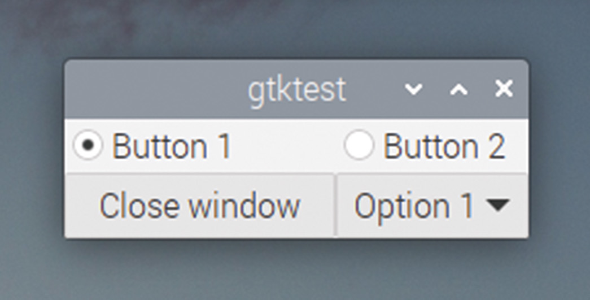
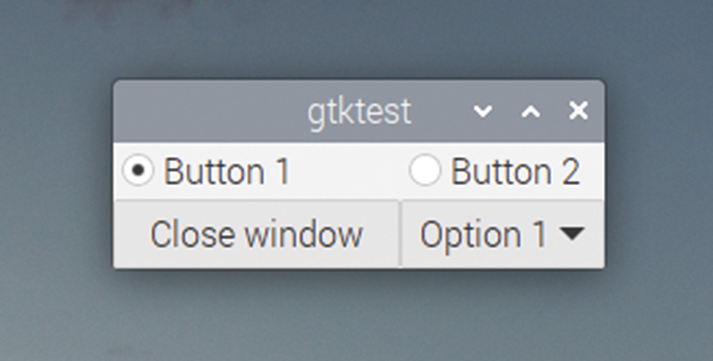

# Capitolul 19: Casete combo și list store-uri

*Creați casete combo pentru introducerea datelor și asociați-le list store-uri*

Widgeturile ca butoanele rotative, butoanele radio și casetele de bifat sunt utile pentru a-i permite utilizatorului să aleagă între un număr mic de opțiuni, dar uneori trebuie să oferim un număr mai mare de opțiuni. O **casetă combo** este un mod bun de a-i oferi utilizatorului o selecție de variante fără a ocupa mult spațiu; GTK oferă două tipuri de casete combo.

## Casete combo cu text

Tipul mai simplu de casetă combo este `GtkComboBoxText`, care permite ca fiecare opțiune să fie doar text simplu. Iată cum se creează una:

```c
  GtkWidget *comb = gtk_combo_box_text_new ();
  gtk_combo_box_text_append_text (GTK_COMBO_BOX_TEXT (comb),
      "Option 1");
  gtk_combo_box_text_append_text (GTK_COMBO_BOX_TEXT (comb),
      "Option 2");
  gtk_combo_box_text_append_text (GTK_COMBO_BOX_TEXT (comb),
      "Option 3");
  gtk_combo_box_set_active (GTK_COMBO_BOX (comb), 0);
```

Funcția `gtk_combo_box_text_new` creează o casetă combo goală, iar intrările pot fi adăugate în ea (în ordinea în care trebuie să apară, de sus în jos) cu apeluri `gtk_combo_box_text_append_text`.

Ultimul apel de funcție de mai sus, `gtk_combo_box_set_active`, stabilește valoarea inițială a casetei combo; în acest caz, setarea ei la 0 alege prima opțiune adăugată în casetă, „Option 1”. Observați că aceasta este o funcție a widgetului `GtkComboBox`, nu a lui `GtkComboBoxText`; pentru că `GtkComboBox` este un părinte al lui `GtkComboBoxText`, puteți folosi funcțiile părintelui pe copil, cu o conversie potrivită.



*Un GtkComboBoxText în dreapta-jos a ferestrei*

Pentru a citi valoarea selectată în acest moment, folosiți:

```c
  int sel = gtk_combo_box_get_active (GTK_COMBO_BOX (comb));
```

Aceasta returnează indexul elementului selectat: 0 pentru „Option 1”, 1 pentru „Option 2” și așa mai departe. Alternativ:

```c
  char *selected = gtk_combo_box_text_get_active_text (
      GTK_COMBO_BOX_TEXT (comb));
```

…poate fi folosită pentru a returna șirul de text propriu-zis care este selectat. (Observați că această funcție merge doar pe casetele combo cu text; nu poate fi folosită pe caseta combo completă, descrisă în secțiunea următoare.)

Semnalul generat de o casetă combo când valoarea este schimbată de utilizator se numește `changed`, așa că un callback potrivit, ca:

```c
void combo_changed (GtkWidget *wid, gpointer ptr)
{
  int sel = gtk_combo_box_get_active (GTK_COMBO_BOX (wid));
  char *selected = gtk_combo_box_text_get_active_text (
      GTK_COMBO_BOX_TEXT (wid));
  printf ("The value of the combo is %d %s\n", sel, selected);
}
```

…poate fi conectat cu:

```c
   g_signal_connect (comb, "changed", G_CALLBACK (combo_changed),
      NULL);
```

`GtkComboBoxText` este un control util pentru cazurile simple, dar `GtkComboBox`-ul complet oferă mult mai multă flexibilitate. Ca și alte widgeturi pentru afișarea datelor în formă liberă, el este folosit ca interfață pentru o structură de tip bază de date, numită **list store**.

## List store-uri

Un list store poate fi privit ca un tabel de date cu mai multe rânduri și coloane. Fiecare celulă a tabelului poate stoca un șir de text, un întreg sau chiar o imagine.

Odată creat un list store, o casetă combo poate fi asociată cu el, iar o coloană a list store-ului poate fi folosită pentru a furniza opțiunile casetei. Codul pentru asta este puțin mai lung și mai complex decât cel pentru `GtkComboBoxText` de mai sus, dar adaugă potențialul unei gestionări mult mai sofisticate a casetelor combo.

Iată codul care face asta:

```c
  int pos = 0;
  GtkListStore *ls = gtk_list_store_new (1, G_TYPE_STRING);
  gtk_list_store_insert_with_values (ls, NULL, pos++, 0,
      "Option 1", -1);
  gtk_list_store_insert_with_values (ls, NULL, pos++, 0,
      "Option 2", -1);
  gtk_list_store_insert_with_values (ls, NULL, pos++, 0,
      "Option 3", -1);
  GtkWidget *comb = gtk_combo_box_new_with_model (
      GTK_TREE_MODEL (ls));
  GtkCellRenderer *rend = gtk_cell_renderer_text_new ();
  gtk_cell_layout_pack_start (GTK_CELL_LAYOUT (comb), rend, FALSE);
  gtk_cell_layout_add_attribute (GTK_CELL_LAYOUT (comb), rend,
      "text", 0);
```

Mai întâi, creăm un `GtkListStore`:

```c
  GtkListStore *ls = gtk_list_store_new (1, G_TYPE_STRING);
```

Funcția `gtk_list_store_new` primește o listă de argumente: primul este numărul de coloane din list store, urmat de o listă a tipurilor de date stocate în fiecare coloană. În acest exemplu creăm un store cu o singură coloană, iar acea coloană va conține un șir de text.

Apoi adăugăm câteva intrări în list store:

```c
  gtk_list_store_insert_with_values (ls, NULL, pos++, 0,
      "Option 1", -1);
  gtk_list_store_insert_with_values (ls, NULL, pos++, 0,
      "Option 2", -1);
  gtk_list_store_insert_with_values (ls, NULL, pos++, 0,
      "Option 3", -1);
```

Fiecare apel `gtk_list_store_insert_with_values` primește list store-ul ca argument, urmat de un pointer `NULL`. În unele cazuri, acesta ar fi un pointer către ceea ce se numește un **iterator**, care este o referință la intrarea tocmai adăugată; noi nu avem nevoie de această funcționalitate, așa că setăm pointerul la `NULL`.

Acestea sunt urmate de indexul din list store la care va fi plasată noua intrare (practic, numărul rândului folosit pentru date) și apoi de o listă de valori împerecheate. Prima valoare a fiecărei perechi este coloana în care vor fi stocate datele, iar a doua sunt datele însele; lista de perechi se termină cu -1 ca valoare de coloană. În acest caz, adăugăm un singur element șir de text pe fiecare rând, în coloana 0.

Apoi asociem o casetă combo cu list store-ul:

```c
  GtkWidget *comb = gtk_combo_box_new_with_model (
      GTK_TREE_MODEL (ls));
```

Aceasta creează o casetă combo nouă și îi spune lui GTK că datele pentru această casetă combo vin din list store-ul `ls` creat anterior. Datele folosite de o casetă combo sunt de tip `GtkTreeModel`, așa că ne convertim list store-ul la acest tip.

Acum stabilim ce coloană a list store-ului să fie afișată în caseta combo; vă avertizăm, asta devine puțin complicat!

```c
  GtkCellRenderer *rend = gtk_cell_renderer_text_new ();
```

Mai întâi creăm un `GtkCellRenderer`; acesta este un obiect de cod folosit pentru a crea o reprezentare grafică a datelor dintr-un tabel. În acest caz, este un renderer de text, folosit pentru afișarea șirurilor de text.

```c
  gtk_cell_layout_pack_start (GTK_CELL_LAYOUT (comb), rend, FALSE);
```

Apoi adăugăm renderer-ul tocmai creat în aranjamentul de celule al casetei combo; asta înseamnă că renderer-ul va fi apelat când caseta combo vrea să afișeze niște date. (Ultimul parametru, setat la `FALSE`, spune dacă datele sunt extinse ca să umple spațiul liber din aranjament; nu are niciun efect la o casetă combo.)

```c
  gtk_cell_layout_add_attribute (GTK_CELL_LAYOUT (comb), rend,
      "text", 0);
```

În final, setăm atributul `text` al renderer-ului de celule la datele din numărul de coloană dat al list store-ului; asta face ca renderer-ul să afișeze datele din coloana 0 ca text în caseta combo.

Încercați să construiți și să rulați codul și convingeți-vă că face același lucru ca exemplul anterior, cu `GtkComboBoxText`.



*Un GtkComboBox în locul GtkComboBoxText; nu vă faceți griji, ar trebui să arate la fel!*

O parte din codul de mai sus arată, probabil, ca magia neagră, și, la drept vorbind, este un mod complicat de a pune niște text într-o casetă combo; renderer-ele de celule au mai mult sens în alte circumstanțe, la care ne vom uita în capitolul următor. Dar sunt o complicație necesară pentru folosirea list store-urilor ca sursă de date pentru casetele combo, iar asta poate fi foarte utilă, pentru că putem procesa datele dintr-un list store și caseta combo va reflecta automat acea procesare.

De exemplu, în codul de mai sus am pus cele trei șiruri de text în list store în ordine alfabetică, dar în lumea reală nu putem garanta că datele vor sosi într-o ordine frumoasă ca aceasta. Cu un list store, este ușor să sortăm datele, înlocuind linia:

```c
  GtkWidget *comb = gtk_combo_box_new_with_model (
      GTK_TREE_MODEL (ls));
```

…cu:

```c
  GtkTreeModelSort *sorted = GTK_TREE_MODEL_SORT (
      gtk_tree_model_sort_new_with_model (GTK_TREE_MODEL (ls)));
  gtk_tree_sortable_set_sort_column_id (
      GTK_TREE_SORTABLE (sorted), 0, GTK_SORT_ASCENDING);
  GtkWidget *comb = gtk_combo_box_new_with_model (
      GTK_TREE_MODEL (sorted));
```

În acest caz, creăm un `GtkTreeModelSort` și îl inițializăm cu datele din list store-ul nostru original. Apoi sortăm datele alfabetic, setând coloana de sortare a `GtkTreeModelSort`-ului la 0 (pentru că în coloana 0 sunt datele după care vrem să sortăm) și specificând ordinea crescătoare (de la A la Z). În final, folosim modelul sortat ca sursă de date pentru caseta noastră combo, în locul modelului original, nesortat.

Există funcții similare care vă permit să filtrați rândurile dintr-un list store, și puteți combina sortările și filtrele ca să personalizați ușor ce se afișează într-o casetă combo, în funcție de setările din altă parte a aplicației; asta este deosebit de util când, de exemplu, folosiți o serie de casete combo în cascadă, fiecare restrângând opțiunile din caseta următoare.

> **CODUL SURSĂ**
>
> Programele din acest capitol se găsesc în [codul_sursa/capitolul19](codul_sursa/capitolul19/): `exemplul01.c` (caseta `GtkComboBoxText`), `exemplul02.c` (caseta combo cu list store) și `exemplul03.c` (list store-ul sortat; opțiunile sunt adăugate intenționat în dezordine).

### Puncte cheie:

- ✅ `GtkComboBoxText` este caseta combo simplă, doar cu text; semnalul ei este `changed`
- ✅ `gtk_combo_box_get_active` returnează indexul; `gtk_combo_box_text_get_active_text` returnează textul
- ✅ Un **list store** este un tabel cu coloane tipizate; rândurile se adaugă cu `gtk_list_store_insert_with_values`
- ✅ Perechile coloană/valoare se termină cu `-1`
- ✅ Un `GtkCellRenderer` desenează datele unei coloane în widget
- ✅ `GtkTreeModelSort` sortează un list store fără a-l modifica

În capitolul următor, vom afișa un list store întreg, cu text și pictograme, într-un `GtkTreeView`!
