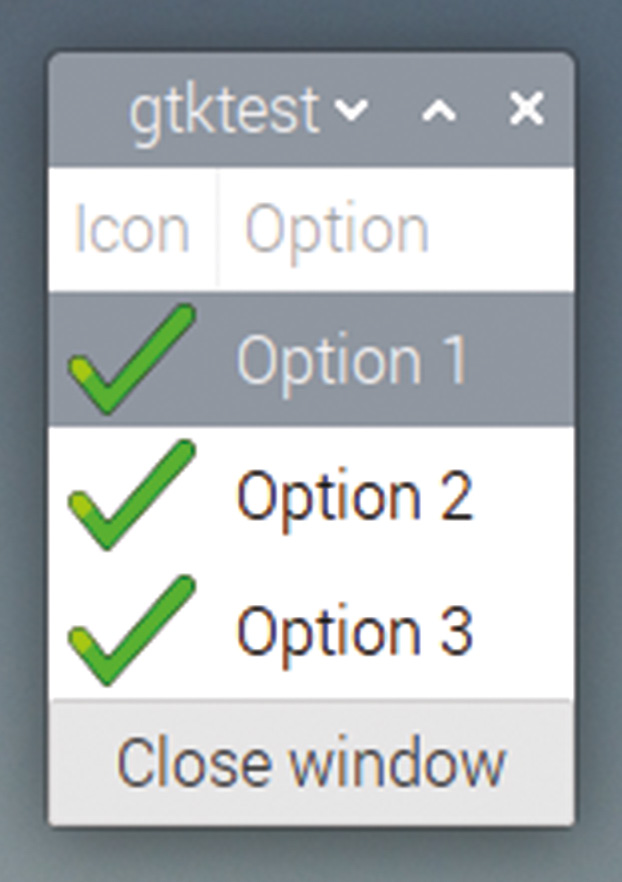

# Capitolul 20: Vizualizări arborescente

*Folosiți widgetul GtkTreeView pentru a afișa informații și opțiuni de introducere a datelor*

Așa cum am menționat în capitolul anterior, folosirea unui list store pentru o casetă combo poate fi uneori exagerată, deși în unele circumstanțe este exact lucrul potrivit de făcut! Dar situația pentru care un list store este cu adevărat proiectat este cea de sursă de date pentru un widget numit `GtkTreeView` (vizualizare arborescentă).

Un `GtkTreeView` este un tabel de date aranjat pe coloane. Tabelul poate afișa imagini pe lângă text și poate conține chiar și alte widgeturi, cum ar fi casete de bifat, alături de date.

## Crearea unei vizualizări arborescente

Pentru a demonstra asta, vom crea un list store nou, cu două intrări pe rând: un șir de text și o pictogramă. Iată codul:

```c
void main (int argc, char *argv[])
{
  gtk_init (&argc, &argv);
  GtkWidget *win = gtk_window_new (GTK_WINDOW_TOPLEVEL);
  GtkWidget *btn = gtk_button_new_with_label ("Close window");
  g_signal_connect (btn, "clicked", G_CALLBACK (end_program),
      NULL);
  g_signal_connect (win, "delete_event", G_CALLBACK (end_program),
      NULL);
  int pos = 0;
  GtkListStore *ls = gtk_list_store_new (2, G_TYPE_STRING,
      GDK_TYPE_PIXBUF);
  GdkPixbuf *icon = gtk_icon_theme_load_icon (
      gtk_icon_theme_get_default (), "dialog-ok-apply", 32, 0, NULL);
  gtk_list_store_insert_with_values (ls, NULL, pos++, 0,
      "Option 1", 1, icon, -1);
  gtk_list_store_insert_with_values (ls, NULL, pos++, 0,
      "Option 2", 1, icon, -1);
  gtk_list_store_insert_with_values (ls, NULL, pos++, 0,
      "Option 3", 1, icon, -1);
  GtkWidget *tv = gtk_tree_view_new_with_model (
      GTK_TREE_MODEL (ls));
  GtkCellRenderer *prend = gtk_cell_renderer_pixbuf_new ();
  GtkCellRenderer *trend = gtk_cell_renderer_text_new ();
  gtk_tree_view_insert_column_with_attributes (
      GTK_TREE_VIEW (tv), -1, "Icon", prend, "pixbuf", 1, NULL);
  gtk_tree_view_insert_column_with_attributes (
      GTK_TREE_VIEW (tv), -1, "Option", trend, "text", 0, NULL);
  GtkWidget *grd = gtk_grid_new ();
  gtk_grid_attach (GTK_GRID (grd), tv, 0, 0, 1, 1);
  gtk_grid_attach (GTK_GRID (grd), btn, 0, 1, 1, 1);
  gtk_container_add (GTK_CONTAINER (win), grd);
  gtk_widget_show_all (win);
  gtk_main ();
}
```

Mai întâi, apelăm `gtk_list_store_new` pentru a crea un list store cu 2 coloane; coloana 0 conține un șir de text, ca în capitolul anterior, în timp ce coloana 1 conține un **pixbuf** (prescurtare de la „pixel buffer”), folosit pentru stocarea unei imagini.

```c
  GtkListStore *ls = gtk_list_store_new (2, G_TYPE_STRING,
      GDK_TYPE_PIXBUF);
```

Apoi creăm un `GdkPixbuf` cu o imagine mică în el; în acest caz, încărcăm în el o pictogramă din tema de pictograme curentă, dar un `GdkPixbuf` poate stoca orice fel de imagine doriți să afișați.

```c
  GdkPixbuf *icon = gtk_icon_theme_load_icon (
      gtk_icon_theme_get_default (), "dialog-ok-apply", 32, 0,
      NULL);
```

Adăugăm trei rânduri în list store; în fiecare caz, punem un șir de text în coloana 0 a rândului și pixbuf-ul creat în coloana 1.

```c
  gtk_list_store_insert_with_values (ls, NULL, pos++, 0, "Option 1",
      1, icon, -1);
  gtk_list_store_insert_with_values (ls, NULL, pos++, 0, "Option 2",
      1, icon, -1);
  gtk_list_store_insert_with_values (ls, NULL, pos++, 0, "Option 3",
      1, icon, -1);
```

Acum trebuie să creăm un `GtkTreeView` care să afișeze list store-ul. Primul pas este similar cu crearea unui `GtkComboBox` din capitolul anterior: asociem noul `GtkTreeView` cu `GtkListStore`-ul tocmai creat.

```c
  GtkWidget *tv = gtk_tree_view_new_with_model (
      GTK_TREE_MODEL (ls));
```

Ca și la caseta combo, trebuie să creăm renderer-e de celule pentru toate tipurile de date pe care vrem să le afișăm; în acest caz avem două, un renderer de text și un renderer de pixbuf.

```c
  GtkCellRenderer *prend = gtk_cell_renderer_pixbuf_new ();
  GtkCellRenderer *trend = gtk_cell_renderer_text_new ();
```

În final, inserăm în vizualizarea arborescentă coloanele pe care vrem să le vedem.

```c
  gtk_tree_view_insert_column_with_attributes (
      GTK_TREE_VIEW (tv), -1, "Icon", prend, "pixbuf", 1, NULL);
  gtk_tree_view_insert_column_with_attributes (
      GTK_TREE_VIEW (tv), -1, "Option", trend, "text", 0, NULL);
```

Fiecare apel `gtk_tree_view_insert_column_with_attributes` primește vizualizarea arborescentă însăși ca prim argument. Al doilea argument este poziția coloanei; aceasta poate fi fie poziția efectivă, numerotată de la 0 din partea stângă a tabelului, fie, ca aici, -1, care indică faptul că respectiva coloană trebuie adăugată ca următoarea, adică la dreapta celei mai din dreapta coloane existente deja în tabel. Parametrul următor este titlul coloanei (care poate fi afișat în partea de sus a tabelului), apoi renderer-ul pe care l-am creat pentru a fi folosit pentru coloană.

Ultimele argumente sunt transmise renderer-ului de celule însuși și setează un atribut al renderer-ului la datele dintr-o anumită coloană a list store-ului: în prima instanță setăm atributul `pixbuf` al renderer-ului de pixbuf la datele din coloana 1, iar în a doua setăm atributul `text` al renderer-ului de text la datele din coloana 0. (Pentru că la unele renderer-e se pot seta mai multe atribute, ultimul argument este un `NULL`, care indică faptul că nu mai sunt atribute de setat.)

Construiți și rulați codul și vedeți ce se întâmplă; ar trebui să vedeți ceva de genul acesta:



*Un GtkTreeView cu două coloane: un pixbuf și niște text*

## Citirea datelor dintr-o vizualizare arborescentă

O vizualizare arborescentă este utilă ca afișaj de informații, dar poate fi folosită și pentru a citi selecțiile utilizatorului. Dacă apăsați pe unul dintre rândurile din tabel, el va fi evidențiat; puteți muta evidențierea în sus și în jos prin tabel și cu tastele săgeți de pe tastatură.

Ori de câte ori rândul selectat se schimbă, vizualizarea arborescentă generează semnalul `cursor-changed`, așa că acesta poate fi folosit pentru a apela un callback potrivit:

```c
  g_signal_connect (tv, "cursor-changed", G_CALLBACK
      (row_selected), NULL);
```

Callback-ul ar trebui să fie următorul:

```c
void row_selected (GtkWidget *wid, gpointer ptr)
{
  GtkTreeSelection *sel;
  GtkTreeModel *model;
  GtkTreeIter iter;
  char *option;
  sel = gtk_tree_view_get_selection (GTK_TREE_VIEW (wid));
  if (gtk_tree_selection_get_selected (sel, &model, &iter))
  {
     gtk_tree_model_get (model, &iter, 0, &option, -1);
     printf ("The selected row contains the text %s\n", option);
  }
}
```

Aflarea rândului selectat necesită un **iterator**, care este o structură de date ce stochează poziția unui rând într-un list store.

Mai întâi trebuie să obținem `GtkTreeSelection`-ul vizualizării arborescente; acesta stochează ce rând (sau rânduri) sunt evidențiate în acest moment.

```c
  sel = gtk_tree_view_get_selection (GTK_TREE_VIEW (tv));
```

Dintr-un `GtkTreeSelection` obținem apoi `GtkTreeIter`-ul și `GtkTreeModel`-ul asociate cu el. Modelul arborescent este list store-ul care furnizează datele pentru vizualizarea arborescentă, iar iteratorul este rândul propriu-zis selectat.

```c
  if (gtk_tree_selection_get_selected (sel, &model, &iter))
```

(Această funcție returnează `FALSE` dacă nu există o selecție validă; este important să verificați asta, altfel linia următoare va provoca o cădere a programului dacă nu este selectat niciun rând.)

În final, putem obține valorile propriu-zise din model și iterator.

```c
  gtk_tree_model_get (model, &iter, 0, &option, -1);
```

Ca și la setarea unei valori într-un list store, argumentele acestei funcții, după model și iterator, sunt o listă de valori împerecheate, prima din fiecare pereche fiind coloana de citit, iar a doua un pointer la care trebuie scrise datele. Se pot citi mai multe valori de pe același rând cu un singur apel, așa că -1 este folosit ca valoare de coloană pentru ultima intrare din listă, ca să arate că nu mai sunt valori de citit.

În acest caz, un pointer către textul din prima coloană a rândului selectat este returnat ca `option`.

> **CODUL SURSĂ**
>
> Programele din acest capitol se găsesc în [codul_sursa/capitolul20](codul_sursa/capitolul20/): `exemplul01.c` (vizualizarea arborescentă cu pictograme și text) și `exemplul02.c` (aceeași, cu handlerul `row_selected` conectat la `cursor-changed`).

### Puncte cheie:

- ✅ `GtkTreeView` afișează un list store ca tabel, cu o coloană pentru fiecare renderer adăugat
- ✅ Coloanele pot conține text, imagini (`GdkPixbuf`) sau alte widgeturi
- ✅ `gtk_tree_view_insert_column_with_attributes` leagă un renderer de o coloană a list store-ului
- ✅ Semnalul `cursor-changed` anunță schimbarea rândului selectat
- ✅ Rândul selectat se obține prin `GtkTreeSelection`, un `GtkTreeModel` și un iterator `GtkTreeIter`
- ✅ Verificați întotdeauna rezultatul lui `gtk_tree_selection_get_selected` înainte de a citi date

În capitolul următor, vom adăuga aplicației o bară de meniu și meniuri contextuale!
