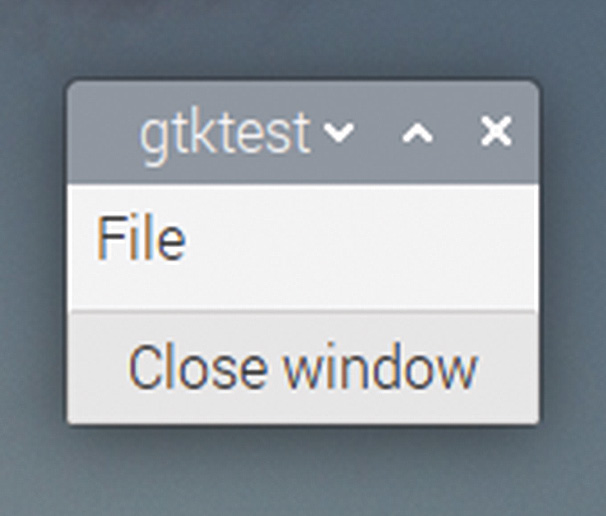
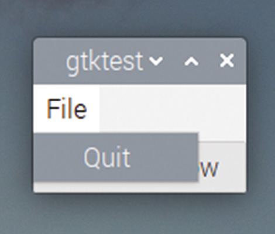
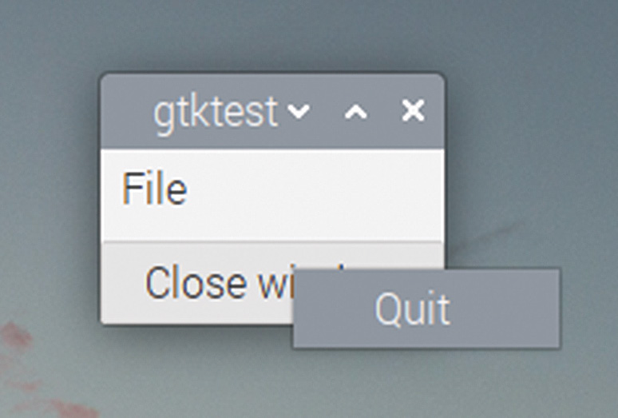

# Capitolul 21: Meniuri

*Creați bare de meniu cu meniuri derulante, dar și meniuri contextuale*

Multe aplicații au o bară de meniu în partea de sus a ferestrei principale. GTK oferă mai multe widgeturi care pot fi folosite pentru a crea fie bare de meniu, fie meniuri contextuale (*pop-up*).

Elementul de construcție al meniurilor este widgetul `GtkMenuItem`. Fiecare intrare dintr-un meniu este un `GtkMenuItem`, care are asociată o etichetă text. Un widget `GtkMenu` este folosit pentru a ține unul sau mai multe widgeturi `GtkMenuItem`, creând un singur meniu, de felul celor care apar ca pop-up sau când este selectat un element din bara de meniu a unei aplicații.

## Bare de meniu

Un `GtkMenuBar` poate fi afișat în partea de sus a ferestrei unei aplicații; acesta conține un număr de `GtkMenuItem`-uri, fiecare furnizând numele unui `GtkMenu`, așa cum am descris mai sus.

Poate fi puțin derutant să vă gândiți că un `GtkMenuItem` este atât membru al unui meniu, cât și numele unui meniu întreg, dar sperăm că un exemplu va lămuri lucrurile. Iată codul unei aplicații cu o bară de meniu:

```c
void main (int argc, char *argv[])
{
  gtk_init (&argc, &argv);
  GtkWidget *win = gtk_window_new (GTK_WINDOW_TOPLEVEL);
  GtkWidget *btn = gtk_button_new_with_label ("Close window");
  g_signal_connect (btn, "clicked", G_CALLBACK (end_program),
      NULL);
  g_signal_connect (win, "delete_event", G_CALLBACK (end_program),
      NULL);
  GtkWidget *mbar = gtk_menu_bar_new ();
  GtkWidget *vbox = gtk_box_new (GTK_ORIENTATION_VERTICAL, 5);
  gtk_box_pack_start (GTK_BOX (vbox), mbar, TRUE, TRUE, 0);
  gtk_container_add (GTK_CONTAINER (win), vbox);
  GtkWidget *file_mi = gtk_menu_item_new_with_label ("File");
  gtk_menu_shell_append (GTK_MENU_SHELL (mbar), file_mi);
  GtkWidget *f_menu = gtk_menu_new ();
  gtk_menu_item_set_submenu (GTK_MENU_ITEM (file_mi), f_menu);
  GtkWidget *quit_mi = gtk_menu_item_new_with_label ("Quit");
  gtk_menu_shell_append (GTK_MENU_SHELL (f_menu), quit_mi);
  g_signal_connect (quit_mi, "activate", G_CALLBACK (end_program),
      NULL);
  gtk_box_pack_start (GTK_BOX (vbox), btn, TRUE, TRUE, 0);
  gtk_widget_show_all (win);
  gtk_main ();
}
```

Mai întâi, creăm o bară de meniu care să țină meniurile aplicației.

```c
  GtkWidget *mbar = gtk_menu_bar_new ();
```

Trebuie să o adăugăm în fereastră; ca la orice alt widget, pentru a o pune în partea de sus a ferestrei trebuie să creăm o cutie verticală, să împachetăm bara de meniu în partea de sus și restul conținutului ferestrei sub ea, apoi să punem cutia verticală în containerul ferestrei.

```c
  GtkWidget *vbox = gtk_box_new (GTK_ORIENTATION_VERTICAL, 5);
  gtk_box_pack_start (GTK_BOX (vbox), mbar, TRUE, TRUE, 0);
  gtk_container_add (GTK_CONTAINER (win), vbox);
```

Apoi creăm un element de meniu care să țină meniul „File” și îl adăugăm în bara de meniu cu `gtk_menu_shell_append`; un **menu shell** este orice poate ține elemente de meniu; practic, acesta este fie un meniu, fie o bară de meniu.

```c
  GtkWidget *file_mi = gtk_menu_item_new_with_label ("File");
  gtk_menu_shell_append (GTK_MENU_SHELL (mbar), file_mi);
```

În acest punct avem o bară de meniu cu un singur element, „File”; acum trebuie să creăm un meniu pe care să îl asociem cu elementul de meniu.

```c
  GtkWidget *f_menu = gtk_menu_new ();
```

După ce am creat meniul, folosim `gtk_menu_item_set_submenu` pentru a-l seta ca submeniu al elementului de meniu „File”.

```c
  gtk_menu_item_set_submenu (GTK_MENU_ITEM (file_mi), f_menu);
```

În acest punct avem o bară de meniu cu elementul „File” pe ea și un meniu gol ca submeniu al acelui element. Creăm acum un element de meniu care să țină opțiunea „Quit” și folosim `gtk_menu_shell_append` pentru a-l adăuga în meniul „File”.

```c
  GtkWidget *quit_mi = gtk_menu_item_new_with_label ("Quit");
  gtk_menu_shell_append (GTK_MENU_SHELL (f_menu), quit_mi);
```

Avem acum o bară de meniu cu un singur meniu („File”), care conține o singură opțiune („Quit”), dar deocamdată acea opțiune nu face nimic. Ca să facem elementul de meniu să facă ceva, conectăm un callback la semnalul lui `activate`, cu `g_signal_connect`, exact ca la un buton. Codul pentru a conecta handlerul nostru existent `end_program` la elementul de meniu „Quit” este:

```c
  g_signal_connect (quit_mi, "activate", G_CALLBACK (end_program),
      NULL);
```

Asta e tot: aveți acum o opțiune de meniu „Quit” funcțională în aplicație. Puteți folosi același procedeu pentru a adăuga într-o bară de meniu oricâte meniuri și elemente de meniu doriți.





*Un GtkMenuBar cu un singur GtkMenu („File”), care conține un singur GtkMenuItem („Quit”)*

Observați că funcția pe care am folosit-o pentru a adăuga un meniu elementului din bara de meniu s-a numit `gtk_menu_item_set_submenu`; practic, meniul este considerat un submeniu al elementului de meniu de nivel superior din bara de meniu. Puteți folosi exact aceeași funcție pentru a crea un submeniu propriu-zis dintr-un element de meniu aflat într-un meniu, și puteți imbrica aceste apeluri oricât de adânc doriți, pentru a crea genul de structură ierarhică de meniuri pe care o folosesc aplicațiile mai complexe. (Din punctul de vedere al uzabilității, este înțelept să vă limitați la cel mult un nivel suplimentar de submeniu: e în regulă ca un meniu să creeze un submeniu din unele elemente, dar dacă creați și mai multe submeniuri din submeniurile însele, utilizatorii se pot zăpăci!)

## Meniuri contextuale

Bara de meniu este cel mai frecvent mod de a adăuga un meniu unei aplicații, dar este posibil să folosiți cod foarte asemănător pentru a adăuga meniuri contextuale (*pop-up*), care apar când apăsați pe butoane, pe vizualizări arborescente sau pe diverse alte widgeturi.

Creați următorul handler și conectați-l la semnalul `clicked` al unui buton.

```c
void button_popup (GtkWidget *wid, gpointer ptr)
{
  GtkWidget *f_menu = gtk_menu_new ();
  GtkWidget *quit_mi = gtk_menu_item_new_with_label ("Quit");
  gtk_menu_shell_append (GTK_MENU_SHELL (f_menu), quit_mi);
  g_signal_connect (quit_mi, "activate", G_CALLBACK (end_program),
      NULL);
  gtk_widget_show_all (f_menu);
  gtk_menu_popup_at_pointer (GTK_MENU (f_menu),
        gtk_get_current_event ());
}
```

Acesta creează un meniu cu un singur element, „Quit”, ca înainte, dar în loc să îl pună într-o bară de meniu, folosește funcția `gtk_menu_popup_at_pointer` pentru a-l afișa la poziția cursorului mouse-ului. Când apăsați butonul la care este conectat acest handler, meniul va fi afișat peste buton și poate fi selectat de acolo.



*Un meniu contextual, deschis dintr-un buton*

Funcția `gtk_menu_popup_at_pointer` primește două argumente: meniul de afișat și evenimentul de sistem care a declanșat afișarea; în acest caz, apăsarea mouse-ului pe buton, obținută apelând `gtk_get_current_event`.

Acest exemplu arată un meniu contextual generat de apăsarea unui buton, dar el poate fi legat și de evenimente de mouse pe multe alte widgeturi.

> **CODUL SURSĂ**
>
> Programele din acest capitol se găsesc în [codul_sursa/capitolul21](codul_sursa/capitolul21/): `exemplul01.c` (bara de meniu cu File → Quit) și `exemplul02.c` (meniul contextual deschis dintr-un buton „File”).

### Puncte cheie:

- ✅ `GtkMenuItem` este atât o intrare dintr-un meniu, cât și numele unui meniu întreg din bara de meniu
- ✅ `GtkMenuBar` și `GtkMenu` sunt **menu shell**-uri; elementele se adaugă cu `gtk_menu_shell_append`
- ✅ `gtk_menu_item_set_submenu` leagă un meniu de un element, în bara de meniu sau într-un submeniu
- ✅ Semnalul unui element de meniu este `activate`
- ✅ `gtk_menu_popup_at_pointer` afișează un meniu la poziția mouse-ului, pornind de la evenimentul curent

În capitolul următor, vom pune întrebări utilizatorului cu ajutorul dialogurilor!
