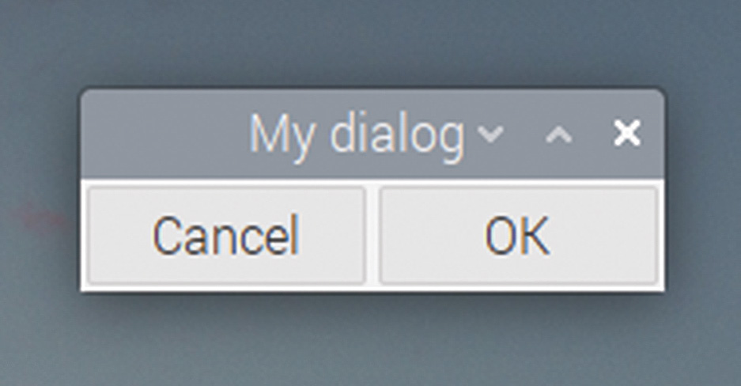
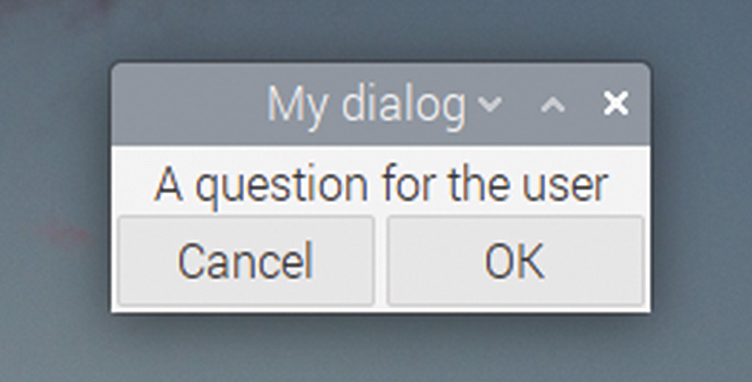

# Capitolul 22: Dialoguri

*Dați utilizatorilor informații și puneți-le întrebări cu ajutorul dialogurilor*

Dacă vrem să punem utilizatorului o întrebare, sau să îl informăm despre ceva, cel mai bun mod de a face asta este cu o casetă de dialog. GTK face ușoară crearea dialogurilor: un `GtkDialog` poate conține orice widgeturi GTK, deci poate fi atât de simplu sau de complex cât aveți nevoie.

Caracteristica ce deosebește un dialog de o fereastră în GTK este că un dialog întrerupe funcționarea aplicației: odată ce un dialog este afișat, restul aplicației așteaptă până când dialogul este închis.

Toate dialogurile au unul sau mai multe butoane (de obicei cu funcții ca „OK” și „Cancel”) în ceea ce se numește **zona de acțiune** din partea de jos a dialogului; acestea închid dialogul și returnează controlul ferestrei principale. Fiecare buton din zona de acțiune generează un cod de retur diferit, care este transmis înapoi din dialog, pentru a comunica răspunsul utilizatorului.

Iată codul pentru un dialog simplu; conectați-l la semnalul `clicked` al unui buton cu `g_signal_connect` și transmiteți un pointer către fereastra principală a aplicației ca pointer de uz general în funcția `g_signal_connect`:

```c
void open_dialog (GtkWidget *wid, gpointer ptr)
{
  GtkWidget *dlg = gtk_dialog_new_with_buttons ("My dialog",
      GTK_WINDOW (ptr),
      GTK_DIALOG_MODAL | GTK_DIALOG_DESTROY_WITH_PARENT,
      "Cancel", 0, "OK", 1, NULL);
  int result = gtk_dialog_run (GTK_DIALOG (dlg));
  gtk_widget_destroy (dlg);
  printf ("Return code = %d\n", result);
}
```

Funcția `gtk_dialog_new_with_buttons` primește mai multe argumente. Primul este textul afișat în bara de titlu a dialogului. Al doilea este un pointer către fereastra principală a aplicației; de aceea trebuie dat un pointer către fereastra principală funcției `g_signal_connect` care leagă acest handler de semnalul `clicked` al unui buton.

Al treilea argument este un set de indicatori (*flags*) care controlează comportamentul dialogului; în acest caz îl setăm să fie un dialog **modal** și să fie distrus odată cu fereastra părinte. A face un dialog modal înseamnă că fereastra părinte va fi blocată cât timp dialogul este afișat; îl forțează pe utilizator să închidă dialogul înainte să poată continua, ceea ce este de obicei comportamentul dorit. Distrugerea dialogului odată cu părintele este doar pentru ordine: înseamnă că, dacă fereastra principală a aplicației se închide din vreun motiv cât timp dialogul este afișat, dialogul se va închide și el. (Este destul de rar să creați un dialog fără să îl setați modal și distrus odată cu părintele.)

Argumentele rămase controlează ce butoane sunt afișate în zona de acțiune a dialogului. Aceasta este o listă de valori împerecheate; prima din fiecare pereche este eticheta afișată pe un buton, iar a doua este codul de retur pe care îl va genera acel buton când este apăsat. Lista se termină cu o valoare `NULL`.

Odată ce am creat dialogul, apelăm `gtk_dialog_run`; aceasta afișează dialogul și îi permite utilizatorului să interacționeze cu el. Utilizatorul va putea să folosească orice widgeturi de pe dialog, dar fereastra principală va fi blocată în acest timp, iar execuția codului așteaptă în funcția `gtk_dialog_run` până când este apăsat un buton din zona de acțiune. În acest moment, trebuie să apelați `gtk_widget_destroy` pe dialog ca să scăpați de el; v-ați fi așteptat, poate, ca apăsarea unui buton să elimine dialogul, dar asta nu se întâmplă; dialogul rămâne pe ecran până când este eliminat explicit.

Construiți și rulați codul; când apăsați butonul care apelează acest handler, dialogul ar trebui să fie afișat.



*Un GtkDialog simplu, cu două butoane în zona de acțiune*

Cât timp dialogul este pe ecran, apăsarea pe orice alte controale din fereastra principală nu va avea niciun efect. Când închideți dialogul apăsând fie „OK”, fie „Cancel”, veți vedea, în fereastra de terminal din care ați lansat aplicația, un mesaj cu codul de retur al butonului apăsat.

Acesta este un dialog de bază, dar este cam mic și gol! Să îi adăugăm o etichetă, ca să punem utilizatorului o întrebare. Pentru asta, trebuie să accesăm **zona de conținut** a dialogului; practic, un dialog este un `GtkWindow` care ține un `GtkBox` orientat vertical, cu două `GtkContainer`-e în el: unul este zona de acțiune din partea de jos, care ține butoanele, iar celălalt este zona de conținut din partea de sus. Adăugăm orice conținut suplimentar al dialogului în zona de conținut, care poate fi accesată cu funcția `gtk_dialog_get_content_area`.

Modificați handlerul de mai sus astfel:

```c
void open_dialog (GtkWidget *wid, gpointer ptr)
{
  GtkWidget *dlg = gtk_dialog_new_with_buttons ("My dialog",
      GTK_WINDOW (ptr),
      GTK_DIALOG_MODAL | GTK_DIALOG_DESTROY_WITH_PARENT,
      "Cancel", 0, "OK", 1, NULL);
  GtkWidget *lbl = gtk_label_new ("A question for the user");

  gtk_container_add (
      GTK_CONTAINER (gtk_dialog_get_content_area (GTK_DIALOG (dlg))),
      lbl);
  gtk_widget_show (lbl);
  int result = gtk_dialog_run (GTK_DIALOG (dlg));
  gtk_widget_destroy (dlg);
  printf ("Return code = %d\n", result);
}
```

Am folosit familiara funcție `gtk_container_add` pentru a adăuga eticheta în zona de conținut a dialogului. Observați că a trebuit să apelăm și `gtk_widget_show` pe eticheta adăugată: `gtk_dialog_run` afișează automat widgeturile care fac parte din dialogul însuși, cum ar fi fundalul și butoanele, dar tot ce adăugați în plus trebuie afișat explicit.



*Un GtkDialog cu o etichetă adăugată în zona de conținut*

Ca și la fereastra principală a aplicației, dacă vrem să adăugăm mai mult de un widget în zona de conținut, trebuie mai întâi să adăugăm o cutie sau o grilă și apoi să punem widgeturile în ea.

> **CODUL SURSĂ**
>
> Programele din acest capitol se găsesc în [codul_sursa/capitolul22](codul_sursa/capitolul22/): `exemplul01.c` (dialogul simplu) și `exemplul02.c` (dialogul cu etichetă). Ambele au în fereastra principală un buton „Open dialog”, care deschide dialogul, așa cum cere textul.

### Puncte cheie:

- ✅ Un dialog **întrerupe** aplicația: fereastra principală așteaptă până la închiderea lui
- ✅ `gtk_dialog_new_with_buttons` primește titlul, fereastra părinte, indicatorii și perechi etichetă / cod de retur, terminate cu `NULL`
- ✅ `GTK_DIALOG_MODAL | GTK_DIALOG_DESTROY_WITH_PARENT` este combinația obișnuită de indicatori
- ✅ `gtk_dialog_run` afișează dialogul și returnează codul butonului apăsat; apoi apelați `gtk_widget_destroy`
- ✅ Conținutul suplimentar se adaugă în zona de conținut și trebuie afișat explicit cu `gtk_widget_show`

În capitolul următor, vom folosi dialogurile gata făcute din GTK: alegerea fișierelor, a culorilor și a fonturilor!
