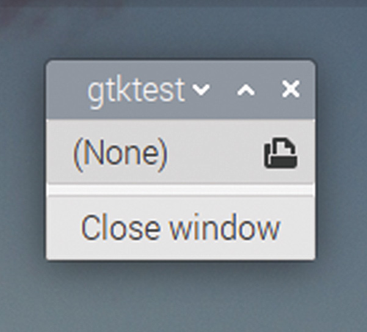
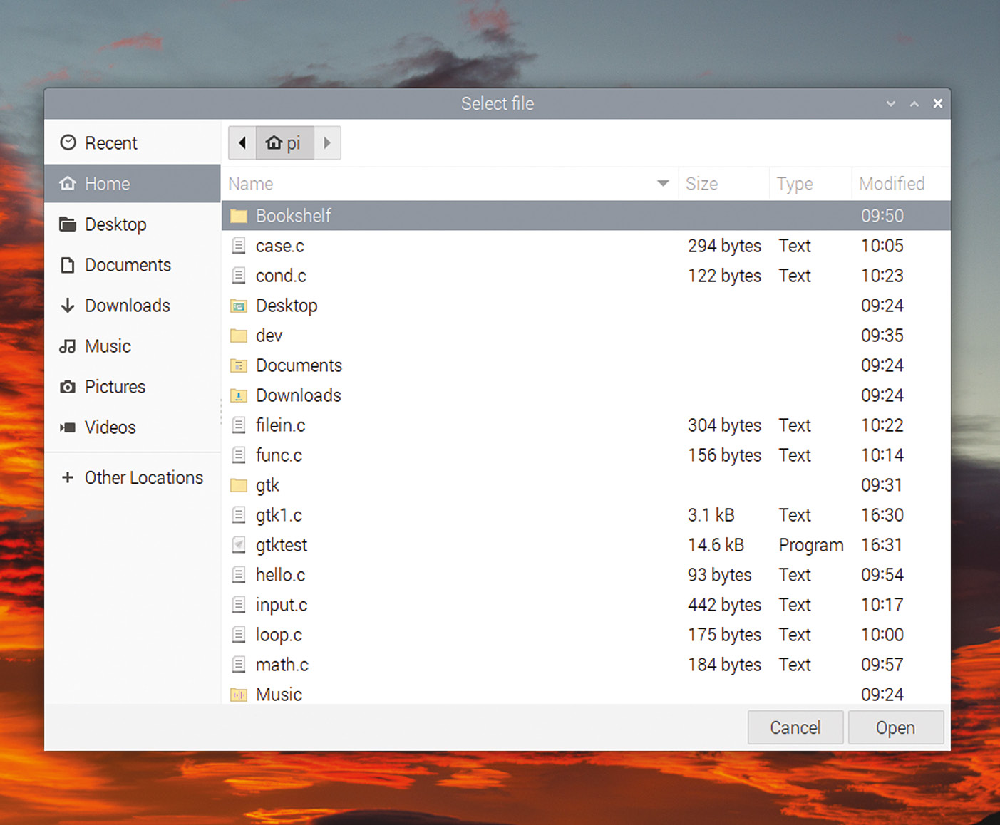
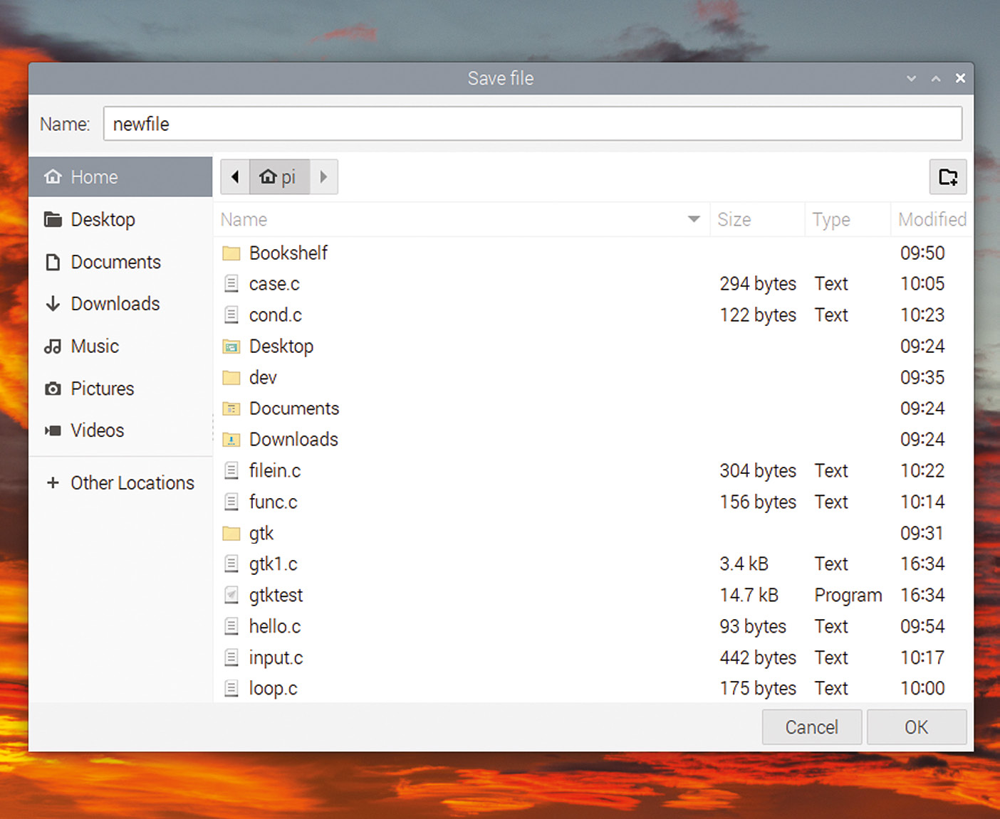
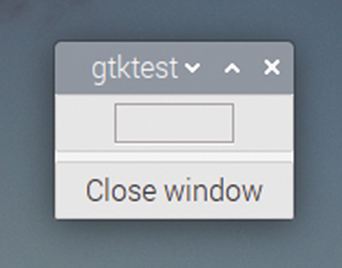
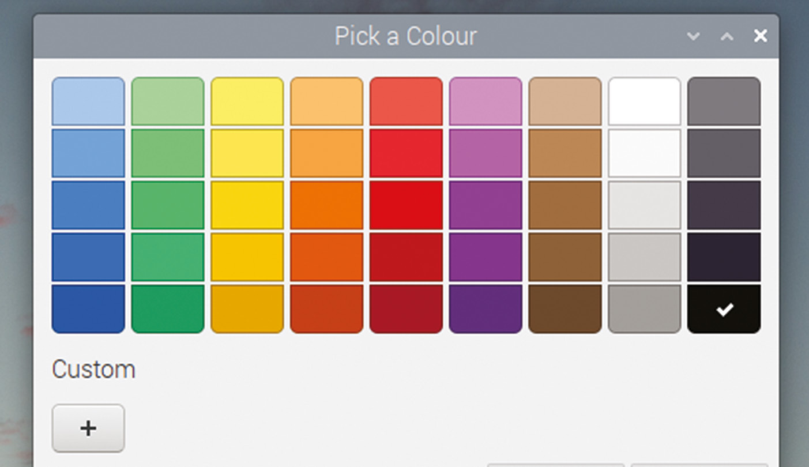
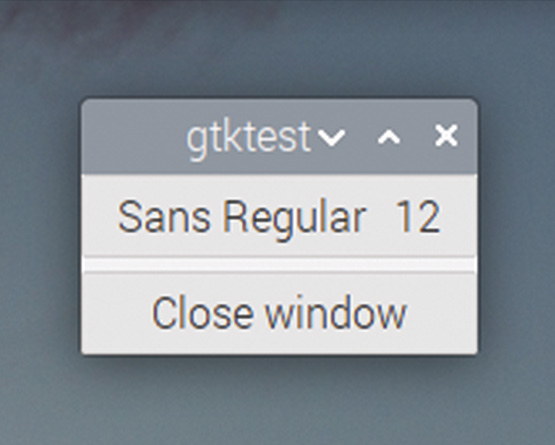
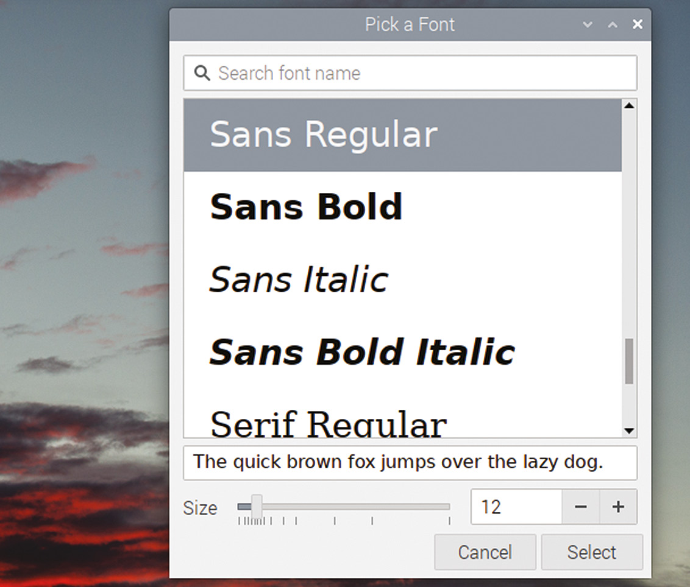

# Capitolul 23: Dialoguri încorporate

*GTK conține câteva dialoguri gata făcute pentru funcțiile folosite frecvent*

Există câteva casete de dialog comune, folosite în multe aplicații desktop; de exemplu, pentru alegerea numelui unui fișier de încărcat sau de salvat, sau pentru alegerea unei culori. GTK include versiuni gata făcute ale acestor casete de dialog comune, care pot fi incluse ușor într-o aplicație, fără a fi nevoie să creați fiecare aspect al dialogului de la zero.

Pentru majoritatea acestor dialoguri există un buton GTK care lansează dialogul; cel mai ușor mod de a include dialogul este să includeți butonul potrivit în aplicație, și totul se face apoi pentru dumneavoastră.

## Dialoguri de alegere a fișierelor

Să ne uităm la un exemplu de dialog de alegere a fișierelor, folosit pentru a obține numele și calea unui fișier, care pot fi apoi folosite într-o operație ulterioară de citire a fișierului.

```c
static void file_selected (GtkFileChooserButton *btn, gpointer ptr)
{
  printf ("%s selected\n", gtk_file_chooser_get_filename
      (GTK_FILE_CHOOSER (btn)));
}

void main (int argc, char *argv[])
{
  gtk_init (&argc, &argv);
  GtkWidget *win = gtk_window_new (GTK_WINDOW_TOPLEVEL);
  GtkWidget *btn = gtk_button_new_with_label ("Close window");
  g_signal_connect (btn, "clicked", G_CALLBACK (end_program),
      NULL);
  g_signal_connect (win, "delete_event", G_CALLBACK (end_program),
      NULL);
  GtkWidget *vbox = gtk_box_new (GTK_ORIENTATION_VERTICAL, 5);
  gtk_container_add (GTK_CONTAINER (win), vbox);
  GtkWidget *fc_btn = gtk_file_chooser_button_new ("Select file",
      GTK_FILE_CHOOSER_ACTION_OPEN);
  g_signal_connect (fc_btn, "file-set",
      G_CALLBACK (file_selected), NULL);
  gtk_box_pack_start (GTK_BOX (vbox), fc_btn, TRUE, TRUE, 0);
  gtk_box_pack_start (GTK_BOX (vbox), btn, TRUE, TRUE, 0);
  gtk_widget_show_all (win);
  gtk_main ();
}
```

Este creat un widget de tip `GtkFileChooserButton` și adăugat în fereastră. Funcția `gtk_file_chooser_button_new` primește două argumente; primul este titlul aplicat ferestrei de alegere a fișierului când este deschisă, iar al doilea determină ce va face fereastra de alegere a fișierului. În acest caz, vrem să deschidem un fișier existent, așa că se folosește `GTK_FILE_CHOOSER_ACTION_OPEN`. (Alternativa este selectarea unui folder existent, pentru care argumentul ar fi `GTK_FILE_CHOOSER_ACTION_SELECT_FOLDER`.)

Semnalul `file-set` este conectat la buton (acesta este apelat când utilizatorul face o selecție), iar în handlerul acelui semnal este apelată funcția `gtk_file_chooser_get_filename`, pentru a citi înapoi numele fișierului selectat.

Când rulați acest cod, veți vedea o fereastră care arată așa:



*Un GtkFileChooserButton*

Pictograma folder din partea dreaptă a butonului de sus indică faptul că este un selector de fișiere; titlul butonului este numele fișierului selectat în acest moment, care este „(None)” la prima rulare a aplicației. Dacă apăsați butonul, se va deschide un dialog de alegere a fișierului:



*Dialogul deschis dintr-un GtkFileChooserButton, pentru selectarea unui fișier existent*

Acesta oferă un navigator de fișiere standard; pentru că am deschis fereastra în modul „deschidere fișier”, ea vă va permite să selectați doar un fișier care există deja în sistemul de fișiere. Folosiți navigatorul pentru a alege un fișier și apăsați „Open”; când fereastra se închide, titlul butonului se va actualiza ca să arate fișierul selectat, iar calea completă a fișierului selectat va fi tipărită în fereastra de terminal din care ați lansat aplicația.

Puteți folosi un `GtkFileChooserButton` pentru a deschide un navigator care selectează un fișier sau un folder existent, dar proiectanții GTK au decis că nu puteți folosi această metodă pentru a alege locul în care poate fi salvat un fișier nou. Pentru asta, trebuie să creați dumneavoastră un dialog `GtkFileChooser`.

Modificați codul de mai sus după cum urmează:

```c
static void save_file (GtkWidget *btn, gpointer ptr)
{
  GtkWidget *sch = gtk_file_chooser_dialog_new ("Save file",
      GTK_WINDOW (ptr), GTK_FILE_CHOOSER_ACTION_SAVE,
      "Cancel", 0, "OK", 1, NULL);
  if (gtk_dialog_run (GTK_DIALOG (sch)) == 1)
  {
    printf ("%s selected\n", gtk_file_chooser_get_filename
        (GTK_FILE_CHOOSER (sch)));
  }
  gtk_widget_destroy (sch);
}

void main (int argc, char *argv[])
{
  gtk_init (&argc, &argv);
  GtkWidget *win = gtk_window_new (GTK_WINDOW_TOPLEVEL);
  GtkWidget *btn = gtk_button_new_with_label ("Close window");
  g_signal_connect (btn, "clicked", G_CALLBACK (end_program),
      NULL);
  g_signal_connect (win, "delete_event", G_CALLBACK (end_program),
      NULL);
  GtkWidget *vbox = gtk_box_new (GTK_ORIENTATION_VERTICAL, 5);
  gtk_container_add (GTK_CONTAINER (win), vbox);
  GtkWidget *fc_btn = gtk_button_new_with_label ("Save file");
  g_signal_connect (fc_btn, "clicked", G_CALLBACK (save_file), win);
  gtk_box_pack_start (GTK_BOX (vbox), fc_btn, TRUE, TRUE, 0);
  gtk_box_pack_start (GTK_BOX (vbox), btn, TRUE, TRUE, 0);
  gtk_widget_show_all (win);
  gtk_main ();
}
```

În acest caz, creăm un buton care deschide dialogul, apoi trebuie să creăm și să deschidem manual dialogul în handlerul butonului.

Dialogul este creat apelând `gtk_file_chooser_dialog_new`, ale cărei argumente sunt foarte asemănătoare cu cele ale lui `gtk_dialog_new_with_buttons`, pe care le-am văzut în capitolul anterior. Mai întâi se dă titlul dialogului, urmat de un pointer către fereastra părinte și apoi de un indicator care determină comportamentul dialogului; în acest caz, este configurat să furnizeze un nume și o cale de fișier în care poate fi salvat un fișier. Argumentele rămase sunt o listă terminată cu `NULL` de perechi de etichete și valori de retur pentru butoanele din partea de jos a dialogului.

Creăm dialogul și apelăm `gtk_dialog_run` când butonul este apăsat; handlerul butonului așteaptă apoi ca dialogul să returneze. Citim apoi calea fișierului înapoi din selector cu `gtk_file_chooser_get_filename`, așa cum am făcut la dialogul de deschidere a fișierului.

Dacă rulați acest cod și apăsați butonul „Save file”, veți vedea că un selector de salvare a fișierului este ușor diferit de unul de deschidere, prin faptul că are o casetă care permite introducerea unui nume de fișier nou:



*Un GtkFileChooserDialog pentru alegerea unui fișier de salvat*

Introduceți un nume de fișier nou și alegeți o locație pentru noul fișier; când apăsați „OK”, calea către noul fișier va fi tipărită în terminal.

Există mai multe alte dialoguri predefinite, care pot fi adăugate unei aplicații doar prin includerea unui buton. Două dintre cele mai utile sunt selectorul de culori și selectorul de fonturi.

## Selectorul de culori

Uneori trebuie să îi permiteți utilizatorului să aleagă o culoare, de exemplu ca să stabilească cum vor fi evidențiate lucrurile. Asta este ușor de făcut cu `GtkColorButton`. (Observați că ori de câte ori GTK se referă la „culoare”, o face cu ortografia americană, *color*, fără „u”; este o sursă frecventă de erori de compilare pentru cei dintre noi de pe partea de est a Atlanticului!)

Culorile în GTK sunt stocate ca structuri de date `GdkRGBA`, care conțin valori separate pentru componentele roșie, verde și albastră ale unei culori. `GtkColorButton` operează, prin urmare, pe date stocate ca `GdkRGBA`.

Iată un exemplu de folosire a unui `GtkColorButton`:

```c
static void col_selected (GtkColorChooser *btn, gpointer ptr)
{
  GdkRGBA col;
  gtk_color_chooser_get_rgba (btn, &col);
  printf ("red = %f; green = %f; blue = %f\n", col.red, col.green,
      col.blue);
}

void main (int argc, char *argv[])
{
  gtk_init (&argc, &argv);
  GtkWidget *win = gtk_window_new (GTK_WINDOW_TOPLEVEL);
  GtkWidget *btn = gtk_button_new_with_label ("Close window");
  g_signal_connect (btn, "clicked", G_CALLBACK (end_program),
      NULL);
  g_signal_connect (win, "delete_event", G_CALLBACK (end_program),
      NULL);
  GtkWidget *vbox = gtk_box_new (GTK_ORIENTATION_VERTICAL, 5);
  gtk_container_add (GTK_CONTAINER (win), vbox);
  GtkWidget *col_btn = gtk_color_button_new ();
  g_signal_connect (col_btn, "color-set", G_CALLBACK (col_selected),
      NULL);
  gtk_box_pack_start (GTK_BOX (vbox), col_btn, TRUE, TRUE, 0);
  gtk_box_pack_start (GTK_BOX (vbox), btn, TRUE, TRUE, 0);
  gtk_widget_show_all (win);
  gtk_main ();
}
```

Creăm butonul de alegere a culorii la fel ca butonul de alegere a fișierului și ne conectăm la semnalul lui `color-set`, ca să detectăm când utilizatorul a făcut o alegere. Handlerul acestui semnal apelează `gtk_color_chooser_get_rgba` pentru a citi valoarea selectată într-o structură `GdkRGBA`, apoi tipărește valorile pentru roșu, verde și albastru.

Dacă rulați acest program, veți vedea că butonul de culoare arată un mic dreptunghi cu culoarea selectată în acest moment:



*Un GtkColorButton*

Când este apăsat, se afișează dialogul de alegere a culorii, care permite alegerea unei culori din paleta de culori standard, sau permite crearea unei culori personalizate, apăsând butonul „+”.



*Dialogul de alegere a culorii, deschis dintr-un GtkColorButton*

Când apăsați „OK”, valorile selectate pentru roșu, verde și albastru vor fi tipărite în terminal.

## Selectorul de fonturi

O altă operație comună este alegerea unui font; aceasta este folosită, de exemplu, în multe aplicații de birou. GTK oferă un selector de fonturi care funcționează la fel ca selectorul de culori.

Înlocuiți pur și simplu `GtkColorButton` din exemplul de mai sus cu un `GtkFontButton`:

```c
  GtkWidget *fnt_btn = gtk_font_button_new ();
  g_signal_connect (fnt_btn, "font-set", G_CALLBACK (fnt_selected),
      NULL);
```

Și creați handlerul pentru semnalul `font-set`:

```c
static void fnt_selected (GtkFontChooser *btn, gpointer ptr)
{
  printf ("font = %s\n", gtk_font_chooser_get_font (btn));
}
```

La rulare, este afișat un buton de font, cu numele fontului selectat în acest moment:



*Un GtkFontButton*

Apăsarea butonului de font deschide dialogul de selecție, care vă permite să alegeți oricare dintre fonturile instalate în acest moment pe sistem:



*Dialogul de alegere a fontului, deschis dintr-un GtkFontButton*

Când apăsați „OK”, numele și mărimea fontului selectat vor fi tipărite în terminal.

> **CODUL SURSĂ**
>
> Programele din acest capitol se găsesc în [codul_sursa/capitolul23](codul_sursa/capitolul23/): `exemplul01.c` (butonul de alegere a fișierului), `exemplul02.c` (dialogul de salvare), `exemplul03.c` (butonul de culoare) și `exemplul04.c` (butonul de font).

### Puncte cheie:

- ✅ `GtkFileChooserButton` deschide singur dialogul de alegere a unui fișier sau folder existent; semnalul este `file-set`
- ✅ Pentru salvare, creați dialogul cu `gtk_file_chooser_dialog_new` și `GTK_FILE_CHOOSER_ACTION_SAVE`
- ✅ `gtk_file_chooser_get_filename` returnează calea completă a fișierului ales
- ✅ `GtkColorButton` (semnal `color-set`) returnează o structură `GdkRGBA`; atenție la ortografia americană „color”
- ✅ `GtkFontButton` (semnal `font-set`) returnează numele și mărimea fontului ca text

În capitolul următor, vom schimba aspectul widgeturilor, prin proprietăți și prin teme!
