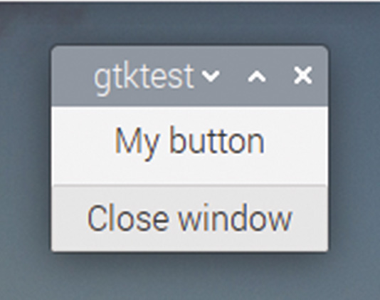
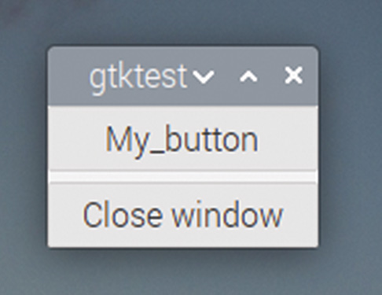
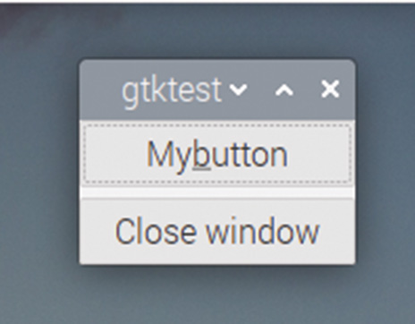
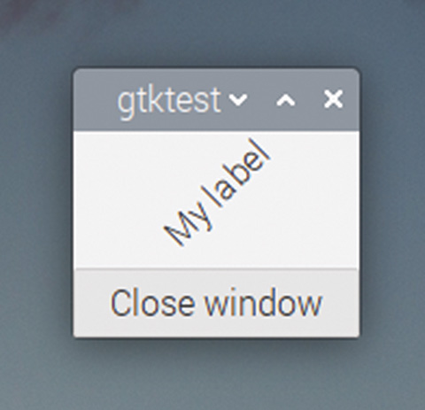

# Capitolul 24: Personalizarea widgeturilor

*Schimbați proprietățile widgeturilor pentru a le modifica aspectul*

În toate exemplele pe care le-am văzut până acum, am folosit widgeturile în starea lor implicită; doar am creat widgetul cu apelul de funcție `gtk_<nume widget>_new` și l-am folosit. Totuși, GTK permite un anumit grad de personalizare a widgeturilor, prin setarea proprietăților fiecăruia.

Ca exemplu, ne vom uita la câteva dintre proprietățile widgetului de bază `GtkButton`. Încercați acest exemplu:

```c
void main (int argc, char *argv[])
{
  gtk_init (&argc, &argv);
  GtkWidget *win = gtk_window_new (GTK_WINDOW_TOPLEVEL);
  GtkWidget *btn = gtk_button_new_with_label ("Close window");
  g_signal_connect (btn, "clicked", G_CALLBACK (end_program),
      NULL);
  g_signal_connect (win, "delete_event", G_CALLBACK (end_program),
      NULL);
  GtkWidget *btn2 = gtk_button_new_with_label ("My button");
  g_object_set (G_OBJECT (btn2), "relief", GTK_RELIEF_NONE, NULL);
  GtkWidget *box = gtk_box_new (GTK_ORIENTATION_VERTICAL, 5);
  gtk_box_pack_start (GTK_BOX (box), btn2, TRUE, TRUE, 0);
  gtk_box_pack_start (GTK_BOX (box), btn, TRUE, TRUE, 0);
  gtk_container_add (GTK_CONTAINER (win), box);
  gtk_widget_show_all (win);
  gtk_main ();
}
```

Acesta este cod familiar din exemplele anterioare, dar linia cu `g_object_set` este nouă. `g_object_set` primește ca argumente numele unui widget, urmat de o listă terminată cu `NULL` de nume de proprietăți și valori ale proprietăților. În acest caz, setăm proprietatea `relief` a `GtkButton`-ului `btn2` la `GTK_RELIEF_NONE`.

„Relieful” unui `GtkButton` controlează cum arată marginea. Marginile unor widgeturi GTK au un anumit grad de umbrire aplicat în jurul lor, pentru a da un aspect 3D; implicit, un `GtkButton` are această umbrire aplicată, ceea ce face butonul să pară că iese puțin în relief din fundalul ferestrei. Setând relieful la `GTK_RELIEF_NONE`, această umbrire 3D este eliminată; dacă rulați programul de mai sus, ar trebui să puteți vedea clar diferența dintre cele două butoane din fereastră. (Puteți folosi tasta TAB pentru a muta conturul punctat între butoane, ca să vedeți diferența mai clar.)



*Un GtkButton cu proprietatea relief setată la GTK_RELIEF_NONE*

Iată un alt exemplu. Eliminați setarea proprietății `relief` și schimbați numele butonului, adăugând o liniuță de subliniere:

```c
  GtkWidget *btn2 = gtk_button_new_with_label ("My_button");
```

Ar trebui să obțineți un buton care arată așa:



*Un GtkButton cu o liniuță de subliniere în etichetă și proprietatea use-underline setată la FALSE*

Dacă acum setați proprietatea `use-underline`:

```c
   g_object_set (G_OBJECT (btn2), "use-underline", TRUE, NULL);
```

…liniuța de subliniere va dispărea, dar va reapărea sub „b”-ul din „button” dacă țineți apăsată tasta ALT de pe tastatură:



*Același GtkButton, dar cu use-underline setată la TRUE*

Toate widgeturile au proprietăți care pot fi setate în acest fel. Ca un alt exemplu, încercați să înlocuiți `GtkButton`-ul cu un `GtkLabel`:

```c
   GtkWidget *lbl = gtk_label_new ("My label");
```

…și apoi să setați proprietatea `angle` (unghi) a etichetei la 45 de grade:

```c
   g_object_set (G_OBJECT (lbl), "angle", 45.0, NULL);
```

(Observați că este important să introduceți unghiul ca `45.0`, nu doar ca `45`; valoarea așteptată este un număr în virgulă mobilă, iar adăugarea lui `.0` la sfârșitul valorii asigură că compilatorul o tratează ca atare.)

Ar trebui să obțineți o fereastră care arată așa, cu textul etichetei la un unghi de 45 de grade față de orizontală:



*Un GtkLabel cu proprietatea angle setată la 45.0*

În multe cazuri, widgeturile au și funcții dedicate pentru setarea fiecărei proprietăți, care pot fi folosite în locul funcției generice `g_object_set` (în exemplele de mai sus, `gtk_button_set_relief`, `gtk_button_set_use_underline` și, respectiv, `gtk_label_set_angle`). Avantajul lui `g_object_set` este că poate fi folosită pentru a seta mai multe proprietăți într-o singură linie, ceea ce vă poate scurta codul semnificativ.

Pagina de documentație online GTK a fiecărui widget listează toate proprietățile și funcțiile dedicate pentru setarea valorilor lor. Pentru cele două exemple de mai sus, acestea se găsesc la [docs.gtk.org/gtk3/class.Button.html](https://docs.gtk.org/gtk3/class.Button.html) și [docs.gtk.org/gtk3/class.Label.html](https://docs.gtk.org/gtk3/class.Label.html); merită să răsfoiți opțiunile oricărui widget pe care vreți să îl folosiți. (Aceste pagini sunt și un mod bun de a afla ce semnale generează un widget când utilizatorul interacționează cu el.)

## O introducere în teme

Celălalt mod în care widgeturile GTK pot fi personalizate este folosirea unei **teme**. O temă afectează aspectul fiecărei instanțe a unui widget din fiecare aplicație GTK, în loc să schimbe aspectul widgeturilor individuale, unul câte unul. Există o selecție de teme instalate în Raspberry Pi OS (și în majoritatea celorlalte distribuții Linux desktop), în directorul `/usr/share/themes`.

Acest director conține un număr de foldere cu nume, fiecare fiind o temă fie pentru GTK, fie pentru alte aplicații tematizabile. Dacă un folder conține un subfolder numit `gtk-3.0`, atunci numele acelui folder este și un nume valid de temă GTK 3.

Care dintre teme este folosită în acest moment de aplicațiile GTK este controlat, de obicei, de daemonul **xsettings**, un proces care rulează în fundal și furnizează informații de configurare tuturor aplicațiilor desktop. Pe Raspberry Pi OS, pentru a schimba tema setată în daemon, trebuie să schimbați o valoare într-un fișier de configurare.

Pentru asta, verificați dacă există un fișier numit `desktop.conf` în directorul `~/.config/lxsession/LXDE-pi`. Dacă nu există, creați unul copiind fișierul `/etc/xdg/lxsession/LXDE-pi/desktop.conf` în acel director.

Dacă vă uitați apoi în fișierul `desktop.conf` cu un editor de text, există o secțiune intitulată `[GTK]`. Undeva sub acest titlu este o linie care începe cu `sNet/ThemeName=`, care implicit, pe Raspberry Pi OS, este setată la `PiXflat`. Dacă schimbați `PiXflat` din această linie cu numele altei teme GTK 3 (orice director din `/usr/share/themes` care include un subdirector `gtk-3.0`), tema folosită se va actualiza automat și ar trebui să vedeți fiecare aplicație GTK pornită redesenându-se cu noua temă.

> **NOTA TRADUCĂTORULUI**
>
> Instrucțiunile de mai sus sunt pentru desktopul LXDE-pi din Raspberry Pi OS „bullseye”. Versiunile mai noi de Raspberry Pi OS folosesc mediul Wayfire sau labwc, în care tema se schimbă din aplicația „Appearance Settings” (Setări aspect) din meniul Preferences, iar fișierul de configurare se află în `~/.config/wf-panel-pi.ini` sau este gestionat de aceeași aplicație. Pe alte distribuții Linux, tema GTK se alege din setările de aspect ale desktopului respectiv.

Crearea unei teme nu este pentru cei slabi de înger, dar dacă vă interesează, uitați-vă într-unul dintre subdirectoarele `gtk-3.0` din directorul `/usr/share/themes`.

Tema este conținută în fișierul numit `gtk.css`, care este un fișier CSS (*cascading style sheet*, foaie de stil în cascadă), similar cu cele folosite pentru a aplica stiluri paginilor web. Din cauza complexității majorității temelor, acest fișier apelează destul de des alte fișiere `.css` din folderul temei, cu instrucțiuni `@import`.

Fișierele `.css` ale temelor sunt text simplu și pot fi deschise în editorul dumneavoastră preferat. Fiecare conține informații de stil pentru toate widgeturile pe care le personalizează tema; fiecare widget este listat cu un număr de stări în care poate apărea, iar diverșii parametri care controlează cum este afișat widgetul pot fi modificați.

Dacă vreți să vă jucați cu temele, asigurați-vă că faceți o copie de siguranță a fișierelor din directorul temei înainte să schimbați ceva. Cel mai sigur lucru de făcut este să copiați întregul folder al temei și să îi dați un nume nou, să setați `ThemeName` din `desktop.conf` la numele noii teme, și apoi puteți modifica după pofta inimii fișierele `.css` din noul folder!

> **CODUL SURSĂ**
>
> Programele din acest capitol se găsesc în [codul_sursa/capitolul24](codul_sursa/capitolul24/): `exemplul01.c` (relieful butonului), `exemplul02.c` (proprietatea `use-underline`) și `exemplul03.c` (eticheta rotită cu 45 de grade).

### Puncte cheie:

- ✅ `g_object_set` setează una sau mai multe proprietăți ale unui widget, într-o listă terminată cu `NULL`
- ✅ `relief`, `use-underline` (pentru butoane) și `angle` (pentru etichete) sunt exemple de proprietăți
- ✅ Valorile în virgulă mobilă trebuie scrise cu zecimale (`45.0`), altfel compilatorul le tratează ca întregi
- ✅ Fiecare proprietate are, de obicei, și o funcție dedicată, de exemplu `gtk_label_set_angle`
- ✅ Documentația de la docs.gtk.org/gtk3 listează proprietățile și semnalele fiecărui widget
- ✅ **Temele** din `/usr/share/themes` sunt fișiere CSS și schimbă aspectul tuturor aplicațiilor GTK

În capitolul următor, vom desena ferestrele vizual, cu editorul de aspect Glade, și le vom încărca din cod!
