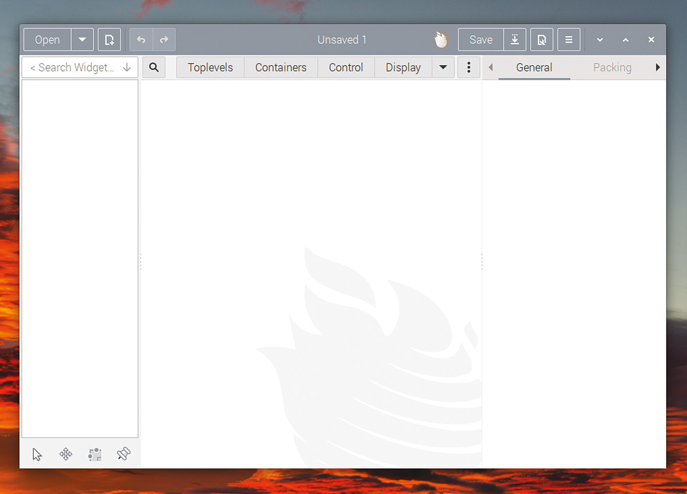
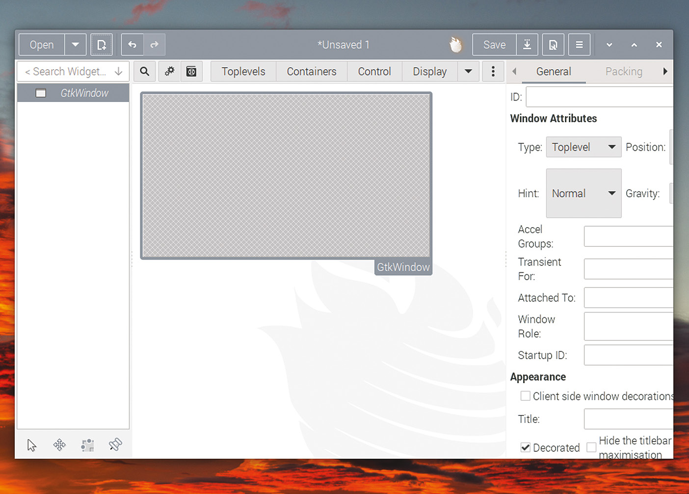
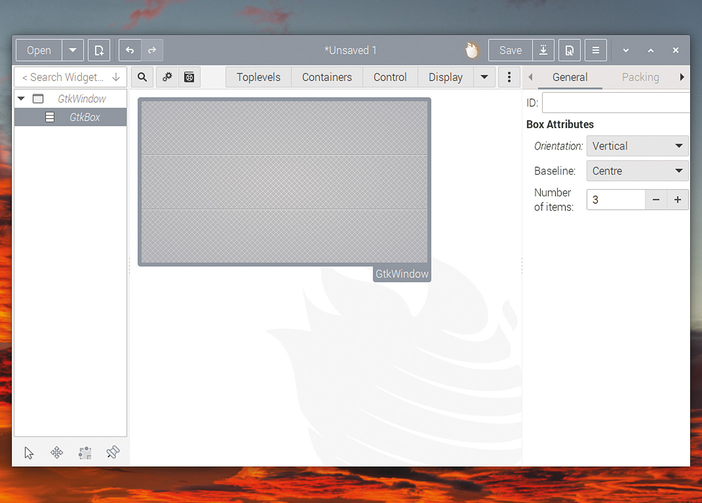
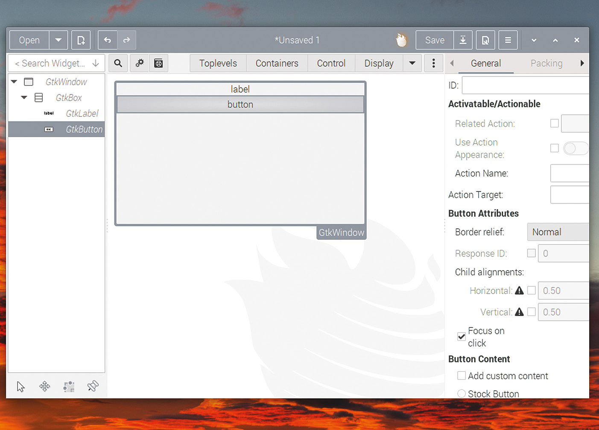
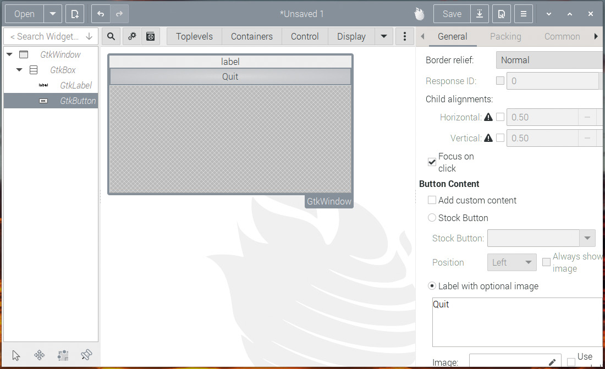
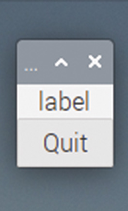

# Capitolul 25: Glade

*Folosiți acest editor de aspect pentru a crea mai ușor aranjamentele ferestrelor aplicațiilor*

Așa cum se poate vedea în capitolele anterioare, deși crearea widgeturilor cu GTK este mult mai ușoară decât să faceți totul de la zero, scriind pixeli în bufferele ecranului, tot puteți ajunge la destul de mult cod chiar și pentru un aranjament de fereastră destul de simplu, și trebuie să vă gândiți destul de atent la codul pe care îl scrieți, ca să vă asigurați că fereastra arată așa cum doriți. Este, de asemenea, mai puțin decât ideal că nu puteți vedea cum va arăta fereastra până nu rulați aplicația.

Din fericire, există un mod de a lucra la aspectul unei ferestre fără a-i scrie tot codul, și acesta este folosirea unui **editor de aspect**. GTK permite ca aspectul widgeturilor dintr-o fereastră să fie definit într-un fișier XML, care este apoi încărcat și desenat pe ecran când rulează aplicația; tot trebuie să legați comportamentul widgeturilor de cod, dar aspectul widgeturilor poate fi stabilit dinainte. Un editor de aspect este o unealtă utilă pentru a crea un asemenea fișier XML.

Cel mai folosit editor de aspect pentru GTK este o unealtă numită **Glade**. Există două versiuni de Glade, una pentru aplicații GTK 2 și una pentru aplicații GTK 3; ele nu sunt interschimbabile, așa că trebuie să o folosiți pe cea corectă. Versiunea pentru crearea aplicațiilor GTK 3 se numește „glade”. Și, ca să fie și mai perfid, versiunea de care aveți nevoie pentru aplicații GTK 2 se numește „glade-3”. (Da, este contraintuitiv și destul de enervant!)

Primul lucru pe care trebuie să îl facem este să instalăm glade. Într-un terminal, tastați:

```bash
sudo apt-get install glade
```

și răspundeți da la orice întrebare. Ar trebui să aveți apoi o intrare etichetată „Glade” în secțiunea Programming (Programare) a meniului principal. Lansați-o, apoi apăsați butonul de proiect nou (dreptunghiul cu semnul plus din stânga-sus); ar trebui să vedeți apoi un ecran ca cel de mai jos.



*Editorul de aspect Glade*

Acesta este ecranul de bază de proiectare din Glade. Coloana din stânga este o listă ierarhică a tuturor widgeturilor din proiectul dumneavoastră; la început este goală. Partea centrală a ferestrei este locul unde puteți vedea aspectul propriu-zis al proiectului, iar coloana din dreapta vă permite să setați proprietățile fiecărui widget.

## Folosirea lui Glade pentru a crea un fișier de aspect

Vom crea o fereastră simplă pentru aplicația noastră, așa că primul lucru pe care trebuie să îl facem este să adăugăm o fereastră de nivel superior. În partea de sus a ecranului, apăsați butonul etichetat „Toplevels”, apoi apăsați „GtkWindow” în lista derulantă care apare; aceasta va adăuga o fereastră goală în zona de aspect din centrul ecranului:



*O fereastră goală*

Apoi, să adăugăm o cutie, ca să putem adăuga niște widgeturi. În partea de sus a ecranului, apăsați butonul etichetat „Containers” și apoi „GtkBox” în lista derulantă; apoi mutați cursorul în interiorul ferestrei goale și apăsați în ea. Va fi desenată o cutie orientată vertical, cu trei elemente, ca mai jos.



*Adăugarea unei cutii verticale*

În navigatorul de proprietăți ale widgetului, din dreapta ecranului, schimbați „Number of items” (numărul de elemente) la 2, ca să eliminați unul dintre elementele din cutie. Vom adăuga apoi o etichetă ca element de sus și un buton ca element de jos. Mai întâi, apăsați butonul etichetat „Display” din partea de sus a ecranului, apoi „GtkLabel” în lista derulantă, apoi plasați cursorul în interiorul elementului de sus al cutiei și apăsați ca să plasați eticheta. Faceți la fel în elementul de jos al cutiei, ca să plasați un buton, pe care îl găsiți sub butonul etichetat „Control” din partea de sus a ecranului. Ar trebui să aveți apoi ceva care arată așa:



*Cu o etichetă și un buton adăugate*

Dacă vă uitați în partea de sus a coloanei din dreapta, veți vedea afișată ierarhia widgeturilor: un `GtkWindow`, care conține un `GtkBox`, care conține un `GtkLabel` și un `GtkButton`. Dacă apăsați pe unul dintre widgeturile din ierarhie, opțiunile afișate în zona cu file din partea de jos a coloanei din dreapta vor fi cele pentru acel widget.

Apăsați pe `GtkLabel` și parcurgeți opțiunile de pe fila „General”; sub secțiunea etichetată „Appearance” (Aspect) este intrarea „Label”; folosiți-o pentru a seta textul etichetei la ce doriți.



*Editorul de proprietăți ale widgetului*

Apăsați pe `GtkButton` și, în proprietățile lui, găsiți secțiunea etichetată „Button Content” (Conținutul butonului). În intrarea „Label with optional image” (Etichetă cu imagine opțională), schimbați eticheta butonului în „Quit”.

Merită să investigați opțiunile de pe toate filele editorului de proprietăți din dreapta; sunt mult prea multe ca să le discutăm aici, dar de interes deosebit sunt cele de pe fila „Packing” (Împachetare); acestea vă permit să setați opțiunile `expand`, `fill` și `padding`, care erau disponibile când adăugam widgeturi în cutii din cod; dacă vă jucați cu ele, vă puteți face o idee bună despre cât control aveți asupra aspectului ferestrei, mai ales când combinați mai multe cutii una în alta, așa cum vă permite Glade.

Înainte să puteți folosi un aspect Glade, trebuie să atribuiți un ID unic fiecărui widget pe care vreți să îl accesați din cod. Acestea pot fi setate în caseta ID din partea de sus a filei General din editorul de proprietăți și vor fi apoi afișate în ierarhia widgeturilor din stânga. Așadar, selectați pe rând fereastra, butonul și eticheta și introduceți un ID pentru fiecare; setați-le la „window1”, „button1” și, respectiv, „label1”. Rețineți aceste nume, pentru că sunt importante la legarea codului de fișierul de aspect. Există o regulă vitală: fiecare widget dintr-un fișier de aspect trebuie să aibă un nume unic. Dacă două widgeturi au același nume, fișierul de aspect este invalid și nu se va încărca corect.

Acum apăsați butonul „Save” din dreapta-sus a ecranului și salvați aspectul ca `mylayout.glade`. Asigurați-vă că salvați fișierul în același director în care vă păstrați codul sursă GTK.

## Folosirea unui fișier de aspect într-o aplicație GTK

Acum trebuie să încărcăm fișierul de aspect în niște cod GTK. Încercați următoarele:

```c
#include <gtk/gtk.h>

void main (int argc, char *argv[])
{
  gtk_init (&argc, &argv);
  GtkBuilder *builder = gtk_builder_new_from_file (
        "mylayout.glade");

  GtkWidget *win = (GtkWidget *) gtk_builder_get_object (builder,
      "window1");
  gtk_widget_show_all (win);
  gtk_main ();
}
```

Apelurile `gtk_init` și `gtk_main` sunt aceleași pe care le-am văzut înainte, dar codul dintre ele folosește un `GtkBuilder`, un obiect de cod care citește și procesează un fișier de aspect.

Creăm un obiect `GtkBuilder` și încărcăm fișierul de aspect în el.

```c
  GtkBuilder *builder = gtk_builder_new_from_file (
        "mylayout.glade");
```

Widgeturile pe care le-am creat în fișierul de aspect pot fi acum accesate toate prin apeluri `gtk_builder_get_object` și folosite ca înainte. Așadar, obținem obiectul care a fost numit `window1` în fișierul de aspect.

```c
  GtkWidget *win = (GtkWidget *) gtk_builder_get_object (builder,
      "window1");
```

Și îl afișăm ca înainte:

```c
  gtk_widget_show_all (win);
```

Dacă construiți și rulați acest cod, fereastra noastră simplă ar trebui să fie afișată pe ecran:



*Fereastra creată în Glade, la rulare*

Așa cum am menționat mai sus, fișierele de aspect controlează aspectul unei ferestre; ca să facem widgeturile să facă lucruri, trebuie să conectăm semnale ca înainte, așa că să modificăm codul în consecință.

```c
void end_program (GtkWidget *wid, gpointer ptr)
{
  gtk_main_quit ();
}

void main (int argc, char *argv[])
{
  gtk_init (&argc, &argv);
  GtkBuilder *builder = gtk_builder_new_from_file (
        "mylayout.glade");
  GtkWidget *win = (GtkWidget *) gtk_builder_get_object (builder,
      "window1");
  GtkWidget *btn = (GtkWidget *) gtk_builder_get_object (builder,
      "button1");
  g_signal_connect (btn, "clicked", G_CALLBACK (end_program), NULL);
  gtk_widget_show_all (win);
  gtk_main ();
}
```

De data aceasta, obținem din builder și widgetul buton și conectăm la el callback-ul `end_program` cu `g_signal_connect`, așa cum am făcut și înainte. Construiți și rulați, iar de data aceasta butonul ar trebui să închidă programul.

Folosirea fișierelor de aspect poate face cantitatea de cod pe care trebuie să o scrieți mult mai mică, iar folosirea lui Glade face mai ușoară crearea interfețelor complexe, cu mai multă personalizare a widgeturilor. Pentru aplicațiile mici, cu o fereastră simplă, este probabil mai direct să faceți totul în C, dar pentru orice mai complex, folosirea unui fișier de aspect poate face codul mult mai lizibil.

> **CODUL SURSĂ**
>
> Programele din acest capitol se găsesc în [codul_sursa/capitolul25](codul_sursa/capitolul25/): `exemplul01.c` (încărcarea și afișarea aspectului), `exemplul02.c` (cu butonul „Quit” conectat) și `mylayout.glade`, un fișier de aspect echivalent cu cel construit în Glade în acest capitol, ca să puteți compila exemplele și fără să parcurgeți pașii din editor. Compilați din folderul în care se află fișierul `.glade`, pentru că programul îl caută în directorul curent.

## Pașii următori

Un lucru care ar trebui să fie evident pentru oricine a parcurs această carte și a ajuns în acest punct este că GTK este un subiect destul de uriaș! Există zeci de widgeturi și sute de moduri diferite în care pot fi configurate și folosite; orice ghid cuprinzător pentru folosirea tuturor ar avea câteva sute de pagini.

Cea mai bună referință pentru GTK, și cel mai bun loc pentru a găsi informații suplimentare dacă vreți să faceți mai mult cu el, este documentația oficială pentru dezvoltatori, care se găsește online la [docs.gtk.org/gtk3](https://docs.gtk.org/gtk3/). Aceasta dă mult mai multe detalii despre fiecare aspect al GTK; secțiunea de referință care listează toate funcțiile și proprietățile asociate fiecărui widget, care se găsește la „Classes”, este deosebit de utilă.

Sperăm că această carte v-a dat o idee despre unde să începeți cu programarea GTK și un punct de sprijin suficient ca să puteți experimenta pe cont propriu. Spor la proiectat interfețe!

### Puncte cheie:

- ✅ Aspectul unei ferestre poate fi descris într-un fișier XML, editat vizual cu **Glade**
- ✅ Pentru GTK 3 folosiți programul numit `glade`, nu `glade-3`
- ✅ Fiecare widget accesat din cod are nevoie de un ID unic (`window1`, `button1`, `label1`)
- ✅ `gtk_builder_new_from_file` încarcă fișierul; `gtk_builder_get_object` returnează widgeturile după ID
- ✅ Fișierul de aspect dă doar aspectul; semnalele se conectează tot din cod, cu `g_signal_connect`
- ✅ Documentația oficială, docs.gtk.org/gtk3, este referința pentru tot ce nu încape în această carte

Capitolul următor, ultimul, este o referință rapidă a limbajului C: structuri de control, tipuri, specificatori de format și operatori.
