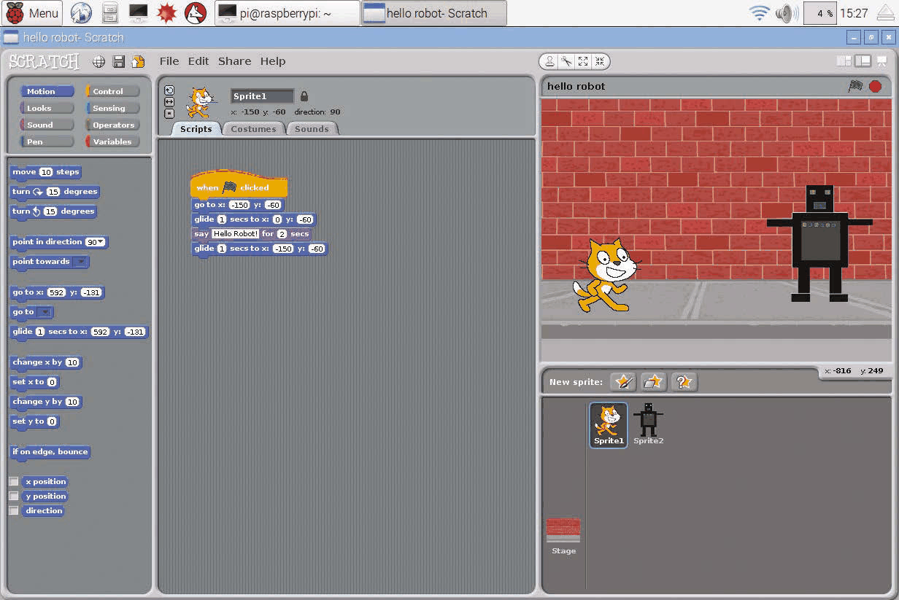
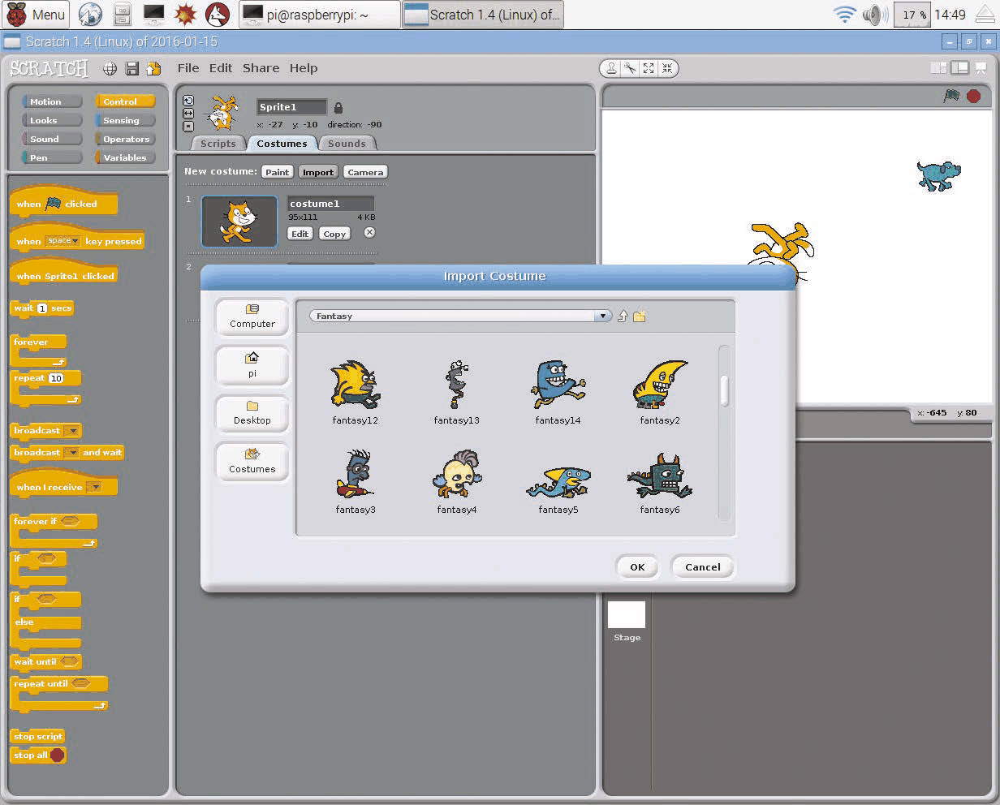
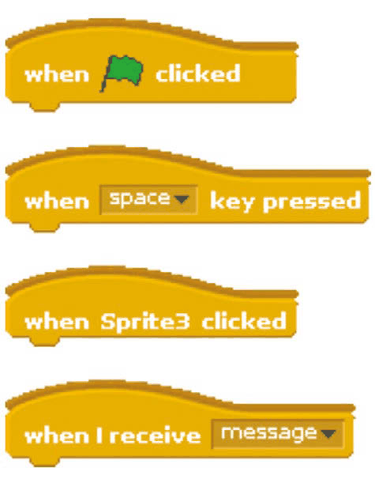
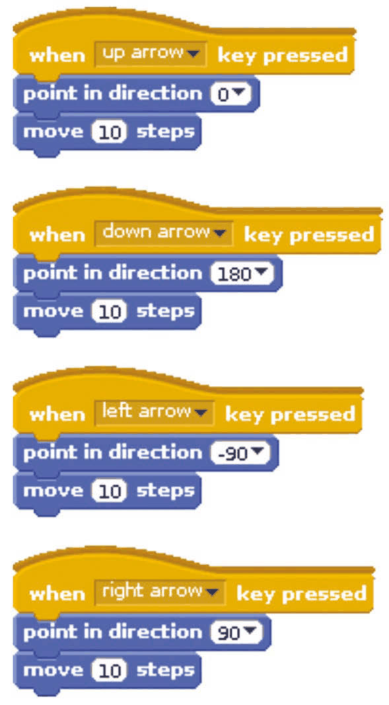

# Capitolul 1 – Primii pași cu Scratch

> *Te visezi ca Disney sau Miyamoto? Fie că te inspiră Mickey Mouse sau Mario, Scratch te ajută să îți aduci creațiile la viață…*

Pune lucrurile în mișcare cu Scratch! În doar câteva minute poți construi primul tău program, care mută pisica Scratch pe ecran cu ajutorul tastelor săgeți: sus, jos, stânga și dreapta. Când vei ști mai multe, vei putea dezvolta acest program simplu într-un program de desenat (cu pisica pe post de creion), într-un joc (unde ar trebui să meargă pisica?) sau în orice altceva care are nevoie de mișcare controlată de la tastatură. Pe parcursul acestui capitol vei învăța cum este împărțit ecranul Scratch, ca să găsești ușor tot ce ai nevoie când construiești celelalte proiecte din carte.

Dacă abia aștepți să scrii propriile jocuri sau să începi să construiești proiecte de electronică, Scratch este locul perfect de pornire.

Simplitatea lui vine din felul în care alegi comenzile dintr-un meniu și le îmbini ca pe piesele unui puzzle. Pentru că Scratch vine cu o colecție de imagini și sunete, poți începe să faci primul tău program în câteva minute.

Puterea lui Scratch vine din multele moduri creative în care poți combina comenzile pentru a-ți face propriul program.

> **NOTĂ – Fii la curent**
> Obține cea mai nouă versiune de Scratch actualizându-ți sistemul de operare cu comanda:
> ```
> sudo apt-get update && sudo apt-get upgrade
> ```

> **NOTA TRADUCĂTORULUI**
> Cartea a fost scrisă pentru Scratch 1.4, versiunea inclusă în sistemul Raspbian al calculatorului Raspberry Pi. Poți parcurge toate proiectele și cu Scratch 3, disponibil gratuit online la [scratch.mit.edu](https://scratch.mit.edu) sau ca aplicație pentru calculator: blocurile au aceleași culori și aproape aceleași nume, iar interfața este împărțită în aceleași zone. Diferențe de reținut: în Scratch 3, categoria „Control” din carte este împărțită în „Events” (Evenimente) și „Control”; blocurile `broadcast` pentru pinii GPIO ai Raspberry Pi din capitolele 7 și 8 se înlocuiesc cu extensia „Raspberry Pi GPIO”; iar în locul blocului `forever if` folosești un bloc `if` în interiorul unui bloc `forever`.



- **Filele (Tabs):** apasă pe file pentru a alege între modificarea scripturilor, a costumelor sau a sunetelor unui personaj.
- **Paleta de blocuri (Blocks Palette):** aici găsești comenzile cu care îți controlezi personajele. Apasă butoanele rotunjite din partea de sus pentru a comuta între diferitele tipuri de blocuri.
- **Zona de scripturi (Scripts Area):** aici îți asamblezi programele, trăgând blocuri din Paleta de blocuri și îmbinându-le.
- **Scena (Stage):** aici privești cum se mișcă și cum interacționează personajele tale.
- **Lista de personaje (Sprite List):** de aici îți selectezi personajele, ca să le poți schimba scripturile sau costumele. Apasă pe Scenă (Stage) în Lista de personaje pentru a-i adăuga scripturi sau pentru a-i schimba fundalul.

## Cum te orientezi

Ecranul este împărțit în mai multe zone, evidențiate în imaginea de mai sus.

Imaginile pe care le poți controla în Scratch se numesc **personaje** (în engleză, *sprites*). Le poți face să se miște, să deseneze pe ecran, să răspundă la clicuri, să își schimbe aspectul și să interacționeze între ele. Un joc spațial ar putea avea, de exemplu, un personaj extraterestru, un personaj navă spațială și un personaj rachetă. Multe proiecte au mai mult de un personaj, iar tu poți alege între ele apăsând pe ele în Lista de personaje, din dreapta jos. Fiecare proiect Scratch nou include pisica Scratch.

Când îți testezi programul, îți vei urmări personajele pe Scenă, în partea din dreapta sus a ecranului. Jocurile sunt însă mai plăcute când umplu tot ecranul, așa că atunci când ești gata să te joci pe bune, apasă pe pictograma cu șevalet din dreapta, deasupra Scenei, pentru a mări.

Ca să îți faci personajele să facă ceva, trebuie să le dai instrucțiuni care să le spună exact ce să facă și când. Aceste instrucțiuni vin sub forma unor blocuri care se îmbină între ele. Blocurile sunt împărțite în opt categorii:

| Categorie | La ce folosește |
|---|---|
| **Motion** (Mișcare) | Pentru a mișca personajele pe Scenă. |
| **Looks** (Aspect) | Pentru a anima personajele, a le da baloane de vorbire și a le schimba mărimea și aspectul. |
| **Sound** (Sunet) | Pentru a reda înregistrări sau note muzicale. |
| **Pen** (Creion) | Pentru a desena pe măsură ce un personaj se mișcă pe Scenă. Grozav pentru artă aleatorie și pentru efecte speciale în jocuri. |
| **Control** | Pentru a descrie ce se întâmplă și când, și pentru a face părți din program să se repete. |
| **Sensing** (Detectare) | Pentru a testa dacă personajul tău atinge un alt personaj sau o altă culoare, sau pentru a obține informații despre alte personaje. Poți folosi blocurile `sensor value` și în propriile proiecte de electronică pe Raspberry Pi. |
| **Operators** (Operatori) | Pentru matematică, numere aleatorii și operații cu text. Aici sunt și blocurile cu care combini blocurile folosite la luarea deciziilor. |
| **Variables** (Variabile) | Pentru a memora informații, cum ar fi scoruri, valori ale cronometrului sau numele jucătorilor. |

> **NOTĂ – Ce versiune?**
> Dacă folosești tutoriale online, verifică să fie compatibile cu Scratch 1.4. Versiunea mai nouă Scratch 2.0 pentru PC și Mac se bazează pe Flash și nu funcționează pe Raspberry Pi.



*Scratch vine cu o bibliotecă de personaje din care poți alege, inclusiv aceste personaje fantastice*

Găsești toate blocurile în Paleta de blocuri, în partea stângă a ecranului. Blocurile sunt colorate pe categorii, așa că atunci când copiezi programe din cărți sau reviste poți găsi mai ușor blocurile de care ai nevoie.

În mijlocul ecranului se află Zona de scripturi. Aici îți faci listele de instrucțiuni (sau „scripturile”) pentru personaje.



*Blocurile pălărie din categoria Control a Paletei de blocuri pot fi folosite pentru a-ți porni scripturile*

> **NOTĂ – Blocurile pălărie**
> Blocurile cu partea de sus curbată, cum este `when space key pressed` (când tasta spațiu este apăsată), se numesc blocuri pălărie (*hat blocks*). Ele se pot îmbina doar la începutul unui script.

## Primul tău script în Scratch

Ți-am promis că poți face primul tău script Scratch în câteva minute, așa că hai să începem!

### Pasul 1 – Mută 10 pași

Când deschizi Scratch (îl găsești în meniul Start, la secțiunea Programming), acesta afișează blocurile Motion în Paleta de blocuri. Apasă aici pe blocul `move 10 steps` (mută 10 pași) și vei vedea pisica mișcându-se pe Scenă. De fiecare dată când apeși, ea se mișcă doar o dată. Asta pentru că „10 pași” înseamnă cât de departe se mișcă, nu de câte ori. Poți apăsa pe 10 și tasta alt număr, ca să meargă mai departe sau mai puțin la fiecare apăsare. Trage blocul `move 10 steps` în Zona de scripturi.

### Pasul 2 – Combinarea blocurilor

Trage blocul `point in direction 90` (îndreaptă-te în direcția 90) în Zona de scripturi. Dacă îl lași chiar deasupra blocului `move 10 steps`, cele două se vor îmbina. Înainte să eliberezi butonul mouse-ului, caută linia albă care arată că sunt pe punctul de a se uni. Dacă apeși pe oricare dintre blocuri, Scratch va executa instrucțiunile în ordine: mai întâi se îndreaptă în direcția 90 (spre dreapta), apoi se mișcă 10 pași. Apasă butonul Control de deasupra Paletei de blocuri. Trage blocul `when space key pressed` și îmbină-l deasupra celor două blocuri. Personajul tău se va mișca spre dreapta (direcția 90) când apeși tasta spațiu.

### Pasul 3 – Comenzi de la tastatură

Apasă clic dreapta pe script și alege Duplicate (duplică). Apasă pe un loc gol din Zona de scripturi pentru a lăsa acolo copia. Repetă până ai patru scripturi identice. Hai să le transformăm în comenzi pentru tastele săgeți. Apasă pe „space” în primul bloc pentru a deschide meniul și alege „up arrow” (săgeată sus). În blocul `point in direction` de dedesubt, apasă pe „90” și alege „0” (sus). Acum, când apeși săgeata sus, pisica se mișcă în sus pe ecran. Modifică celelalte scripturi pentru a adăuga comenzi pentru stânga, dreapta și jos. **Listarea 1** arată codul final.



*Listarea 1 – cele patru scripturi pentru tastele săgeți*

> **PROVOCARE – Fă artă!**
> Poți adăuga comenzi pentru `pen up` (creion ridicat) și `pen down` (creion coborât), ca să folosești acest program pentru a desena pe Scenă?
