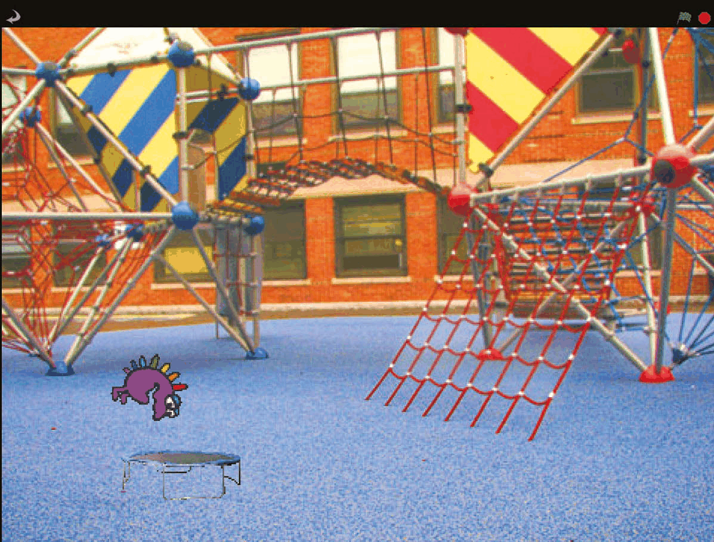
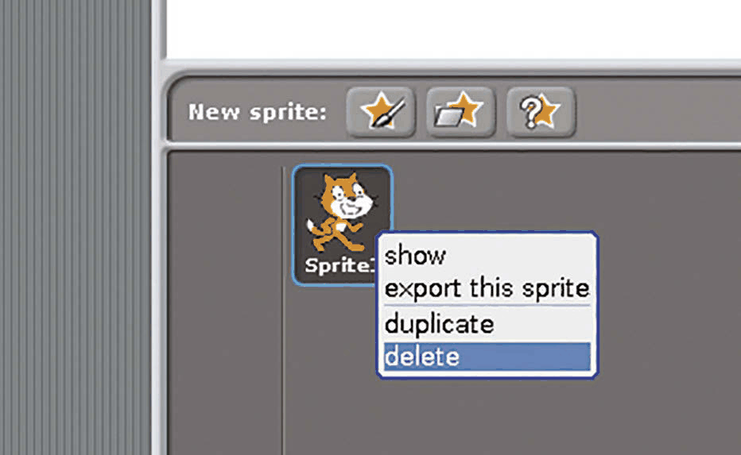
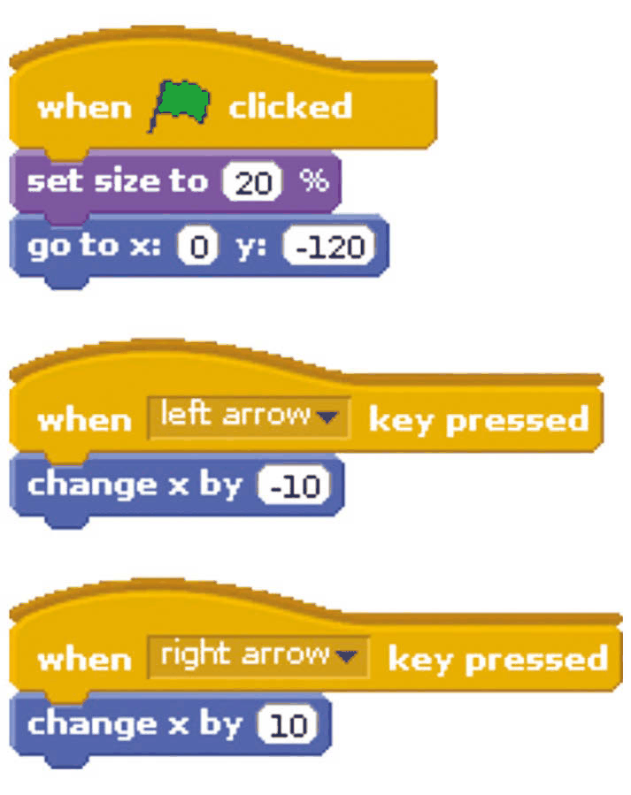
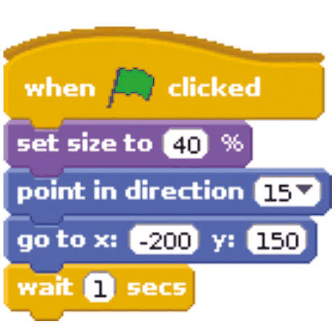
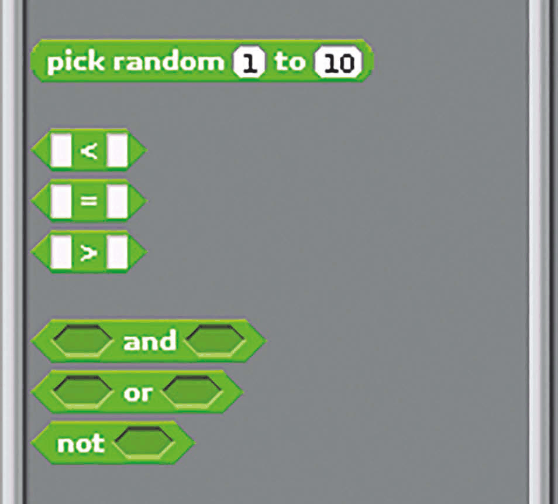
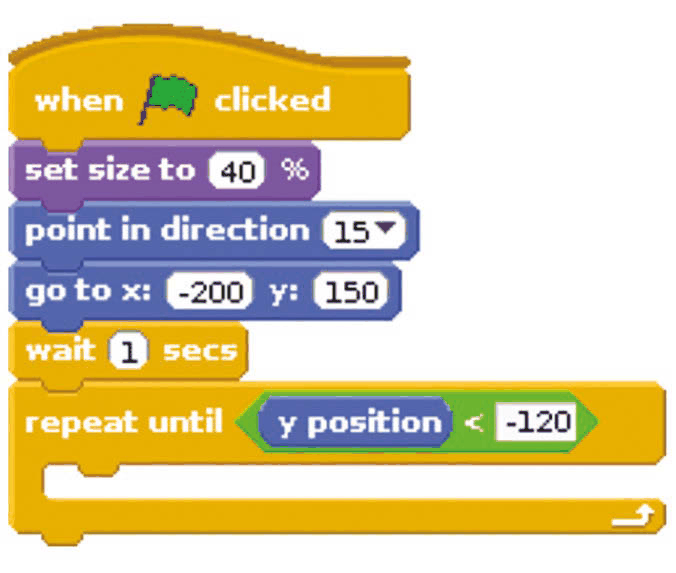
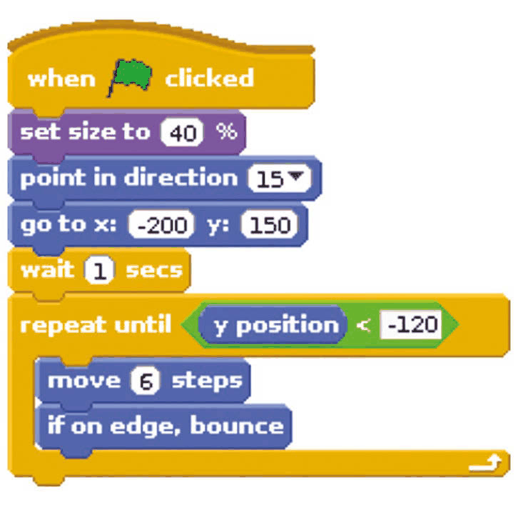
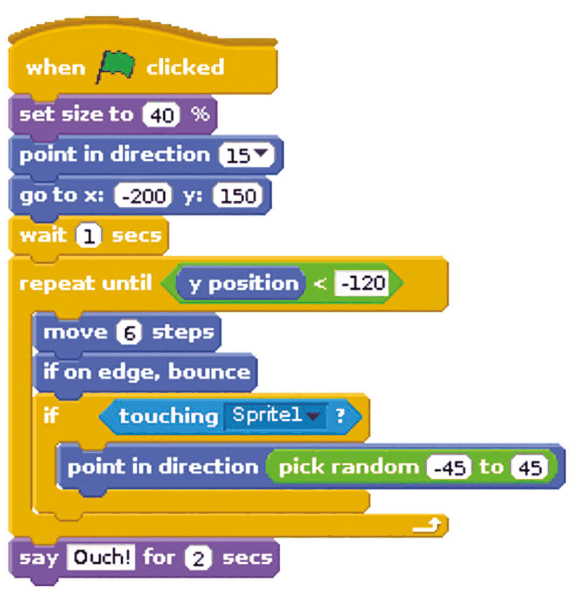

# Capitolul 2 – Ariciul săltăreț

> *Ariciului Spike îi place la nebunie să sară pe trambulină, dar e un pic neîndemânatic. Poți muta trambulina ca să nu aterizeze cu o bufnitură?*

În acest capitol vei face primul tău joc în Scratch, în care folosești tastele săgeți pentru a muta trambulina la stânga și la dreapta, ca să prinzi o țintă care sare. Proiectul îți arată cum să aduci personaje și fundaluri noi și cum să folosești blocurile-paranteză (*bracket blocks*) și blocurile-romb (*diamond blocks*) în proiectele tale. Aceste abilități îți vor fi utile când construiești celelalte proiecte din carte. Pornește un proiect Scratch nou și pregătește-te să sari! Nu uita că poți reveni la capitolul anterior dacă ai nevoie de ajutor ca să te orientezi pe ecran.

- În Scratch sunt incluse câteva personaje fantastice grozave, printre care și această creatură mov care seamănă cu un arici!
- Mută trambulina la stânga și la dreapta pentru a prinde ariciul și a-l face să sară înapoi în aer.

### Pasul 1 – Pregătește grafica

Pentru acest proiect nu ai nevoie de pisică, așa că apasă clic dreapta pe ea în Lista de personaje și alege Delete (șterge). Pentru a adăuga un personaj nou, apasă pe pictograma de deasupra Listei de personaje care arată un dosar și o stea. Adaugă personajul **trampoline** din dosarul Things, apoi personajul **fantasy11** din dosarul Fantasy. Hai să schimbăm și fundalul: apasă pe Scenă (Stage) în Lista de personaje și fila Costumes se transformă în fila Backgrounds (fundaluri). Apasă pe această filă și folosește butonul Import pentru a aduce fundalul dorit. Noi folosim imaginea **atom-playground** din dosarul Outdoors.

*Apasă clic dreapta pe personaj în Lista de personaje pentru a-l șterge. Observă și butoanele de adăugare a unui personaj, deasupra pisicii*

### Pasul 2 – Adaugă comenzile jucătorului

Apasă pe trambulină (care ar trebui să fie Sprite1) în Lista de personaje pentru a o selecta, apoi apasă pe fila Scripts de deasupra Paletei de blocuri. **Listarea 1** arată scripturile pe care trebuie să le adaugi acestui personaj. Parcurge-le de sus în jos, trăgând blocurile în Zona de scripturi unul câte unul și îmbinându-le. Apasă pe căsuțele albe din blocuri și tastează numerele potrivite. Nu uita că culorile sunt un indiciu: pentru a găsi blocurile galbene, apasă mai întâi pe butonul galben Control de deasupra Paletei de blocuri.

*Listarea 1 – scripturile trambulinei*

### Pasul 3 – Pregătește ariciul

Apasă pe Sprite2 (ariciul) în Lista de personaje. Adaugă-i scriptul din **Listarea 2**. Acesta pune personajul în stânga sus când începe jocul și îi dă jucătorului șansa să îl observe înainte să se miște.

*Listarea 2 – poziția de start a ariciului*

### Pasul 4 – Adaugă o buclă repeat

Acum vom extinde acest script adăugând câteva blocuri la sfârșit. **Listarea 3** arată întregul script, inclusiv părțile pe care le-ai făcut deja. Apasă pe butonul Control de deasupra Paletei de blocuri. Trage un bloc `repeat until` (repetă până când) în Zona de scripturi și îmbină-l cu scriptul de până acum. (Ai grijă să nu folosești blocul `repeat` care are un număr în el.) Apoi trebuie să pui un bloc `<` în gaura în formă de romb. Apasă pe butonul Operators de deasupra Paletei de blocuri pentru a-l găsi. Tastează -120 în căsuța din dreapta. La final, apasă pe butonul Motion și trage blocul `y position` (poziția y) în căsuța din stânga. Acum, tot ce punem în interiorul parantezei `repeat until` se va repeta până când poziția y a personajului (cât de sus sau de jos pe ecran se află) este mai mică decât -120. În jocul nostru, asta înseamnă că a ratat trambulina și a lovit podeaua.

*Listarea 3 – scriptul ariciului, cu bucla `repeat until`*

*Blocurile Operators includ blocul pentru alegerea numerelor aleatorii și blocurile pentru compararea numerelor*

### Pasul 5 – Mișcă ariciul

Pentru a face personajul să se miște, adaugă cele două blocuri Motion din **Listarea 4** în blocul `repeat until` din scriptul tău. Apasă pe steagul verde de deasupra Scenei pentru a testa ce ai făcut până acum. Ar trebui să vezi ariciul mergând în stânga sus, prăbușindu-se și oprindu-se când ajunge jos.

*Listarea 4 – ariciul se mișcă și ricoșează din margini*

### Pasul 6 – Fă trambulina elastică

Trebuie să facem ariciul să sară înapoi în sus dacă atinge trambulina. Apasă pe butonul Control și trage un bloc `if` (dacă) în scriptul tău. Ai grijă unde îl pui: locul lui este în interiorul parantezei `repeat until`, așa cum arată **Listarea 5**. Apasă pe butonul Sensing și trage un bloc `touching` (atinge) în gaura în formă de romb a blocului `if`. Apasă pe meniul din blocul `touching` și alege Sprite1 (trambulina). În interiorul parantezei blocului `if`, pune un bloc Motion `point in direction 90`. În loc să punem un număr în căsuța lui, de data aceasta vom folosi `pick random` (alege la întâmplare) cu valorile -45 și 45. Îl găsești în secțiunea Operators a Paletei de blocuri. Acum personajul se va îndrepta într-o direcție aleatorie în sus (între 45 de grade spre stânga și 45 de grade spre dreapta) dacă atinge trambulina. La final, adaugă un bloc `say` (spune) la sfârșitul scriptului, în afara tuturor parantezelor. Acesta este afișat când jocul se termină.

*Listarea 5 – scriptul complet al ariciului*
