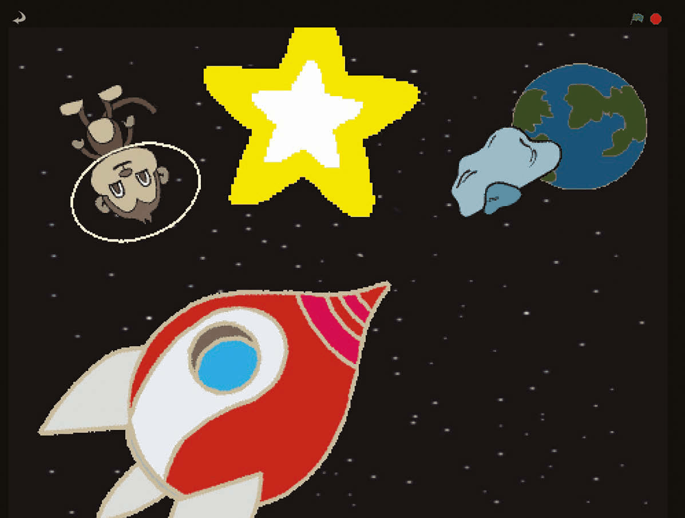
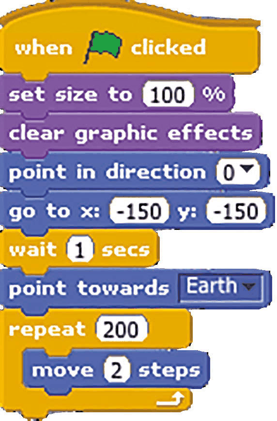
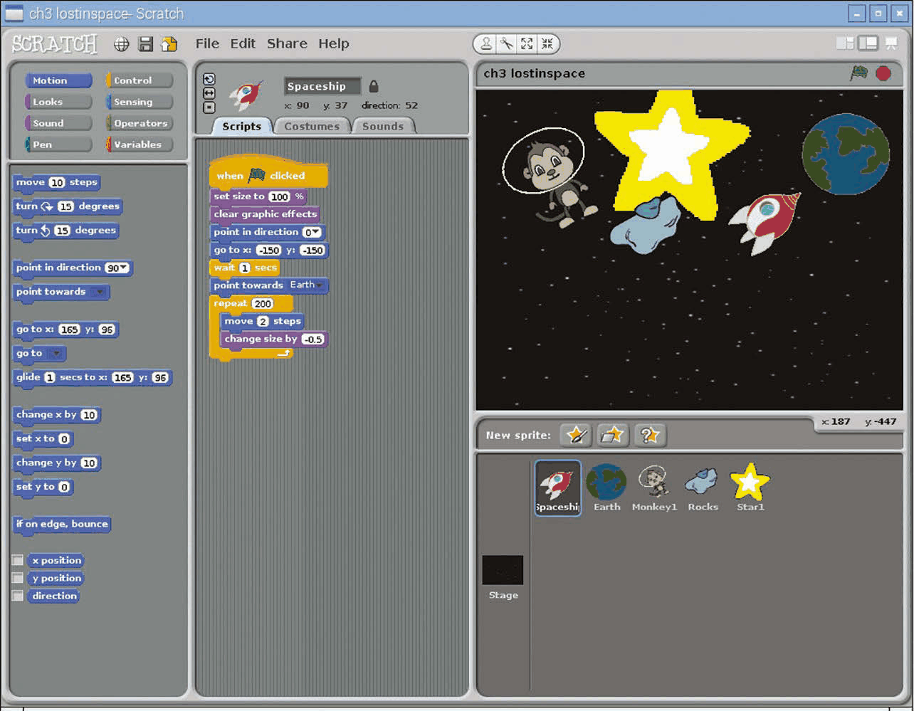
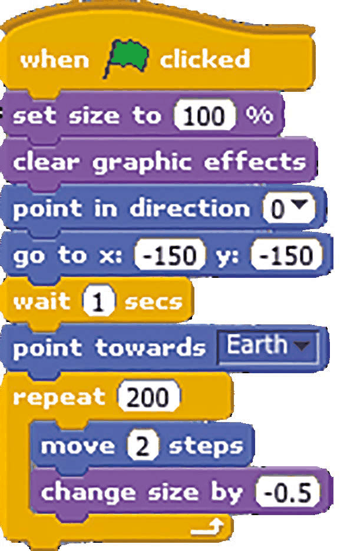
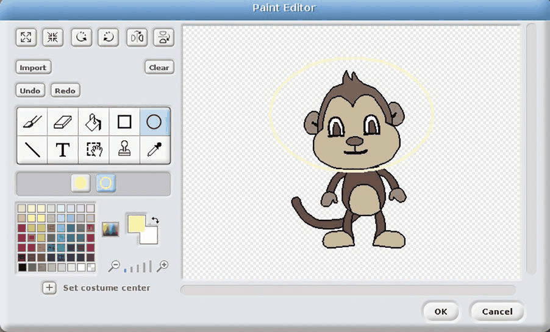
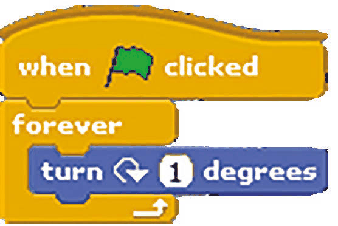
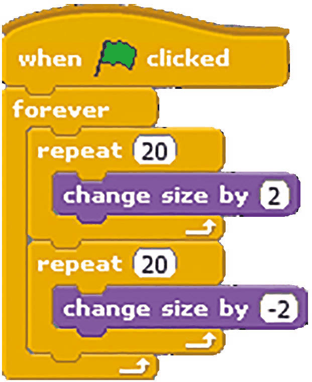
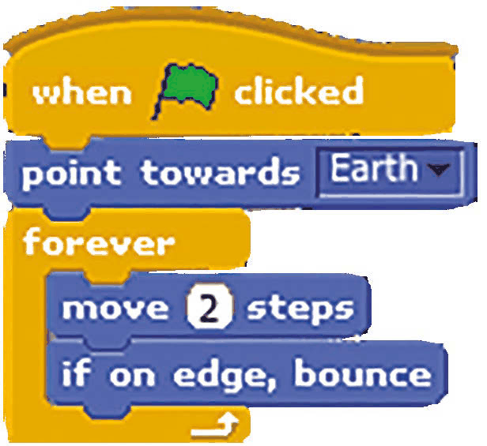

# Capitolul 3 – Pierduți în spațiu

> *Programează-ți propria animație cu o navă spațială care se îndreaptă spre Pământ, folosind un efect de scalare pentru a face nava mai mică pe măsură ce se îndepărtează*

> **NOTĂ**
> Acest proiect provine de la Code Club. Găsești mai multe resurse minunate ca acesta la [codeclub.org.uk](https://codeclub.org.uk).

În acest capitol vei crea o secvență de animație care, poate în mod neașteptat, implică o maimuță spațială care se rotește! Proiectul îți va arăta cum să miști, să rotești și să scalezi personajele. Este ceva ce îți va fi foarte util și pentru alte proiecte și jocuri. Așa că pornește un proiect Scratch nou și pregătește-te să faci animație. Dacă ai nevoie de ajutor pentru a naviga prin meniurile Scratch, revino la capitolul 1.

- Această rocă spațială plutește de colo-colo și ricoșează din marginile ecranului.
- Steaua primește un efect de sclipire prin mărirea și micșorarea repetată a dimensiunii sale.
- La începutul animației, nava spațială decolează vertical, înainte să i se spună să se îndrepte spre Pământ.

### Pasul 1 – Pregătește grafica

După ce ștergi pisica (clic dreapta și Delete), e timpul să imporți un fundal nou pentru scenă și personaje noi. Să începem prin a crea scena spațială, schimbând fundalul scenei într-un câmp de stele: apasă pe Stage în Lista de personaje (dreapta jos), selectează fila Backgrounds (sus, în mijloc), apoi apasă pe Import și navighează la „stars” în dosarul Nature. Pentru că niciunul dintre personajele folosite în acest proiect nu se află în biblioteca Scratch 1.4, le poți descărca de la [magpi.cc/scratch_art](https://magpi.cc/scratch_art). Mai întâi, să importăm personajele Earth (Pământul) și Spaceship (nava spațială): pentru fiecare, apasă pe pictograma stea/dosar de deasupra Listei de personaje, apoi navighează la dosarul în care ai salvat personajele.

### Pasul 2 – Mișcă nava spațială

Apasă pe personajul Spaceship în Lista de personaje pentru a-l selecta, apoi apasă pe fila Scripts. **Listarea 1** arată scriptul pe care trebuie să îl adaugi acestui personaj pentru a-l face să se miște. Mai întâi îl îndreptăm în sus (`point in direction 0`) și îi spunem să meargă la `go to x: -150 y: -150`, lângă colțul din stânga jos. După ce așteaptă o secundă, folosim blocul Motion foarte util `point towards` (îndreaptă-te spre) pentru a-l îndrepta spre personajul Earth. Apoi folosim o buclă `repeat` pentru a-l mișca în continuare spre Pământ, câte doi pași o dată.

*Listarea 1 – nava decolează și se îndreaptă spre Pământ*

*Nava spațială se îndreaptă spre Pământ și este mișcată și micșorată treptat în interiorul unei bucle repeat*

### Pasul 3 – Scalează nava

Pentru a simula îndepărtarea navei spațiale de noi, trebuie să îi reducem treptat dimensiunea pe măsură ce se mișcă spre Pământ. Acest lucru se obține ușor, adăugând un singur bloc suplimentar la scriptul existent. Apasă pe butonul Looks din panoul din stânga sus, apoi trage un bloc `change size by` (schimbă mărimea cu) și lasă-l chiar sub blocul `move 2 steps`, în interiorul buclei `repeat`. Schimbă valoarea 10 din blocul `change size` în -0.5. Codul ar trebui să arate ca în **Listarea 2**. Acum încearcă să apeși pe steagul verde pentru a vedea cum racheta ta gonește spre Pământ, micșorându-se tot timpul.

*Listarea 2 – nava se micșorează pe măsură ce se îndepărtează*

### Pasul 4 – Adaugă o maimuță spațială

Acum să adăugăm câteva elemente în plus scenei noastre spațiale. Pentru un pic de distracție, vom adăuga o maimuță plutitoare, pierdută în spațiu. Apasă din nou pe pictograma stea/dosar și navighează la dosarul cu personaje Lost in Space, apoi selectează Monkey. Ca la orice personaj, îi poți ajusta mărimea folosind pictogramele Grow/Shrink (mărește/micșorează personajul) de deasupra scenei. Acum să îi dăm maimuței o cască spațială! Selectează-o în Lista de personaje, apoi apasă pe fila Costumes și pe butonul Edit. În Paint Editor (editorul de desen), selectează unealta Elipsă, opțiunea de contur (în dreapta) de sub unelte, apoi o culoare galbenă din paletă. Acum desenează o elipsă galbenă în jurul capului maimuței, pe post de cască. Ca lucrurile să fie mai interesante, vom face maimuța să se învârtă, adăugând scriptul simplu cu buclă din **Listarea 3**.

*În Paint Editor, desenează o elipsă în jurul capului maimuței pentru a-i da o cască spațială*

*Listarea 3 – maimuța se rotește la nesfârșit*

### Pasul 5 – Ricoșează și strălucește

La final, vom adăuga o stea strălucitoare și o rocă săltăreață. Importă-le pe amândouă din dosarul cu personaje Lost In Space, apoi poziționează-le și scalează-le pe scenă după gust. Pentru stea, adaugă codul din **Listarea 4** (două bucle `repeat` în interiorul uneia `forever`) ca să o mărești și să o micșorezi în mod repetat. Adaugă codul din **Listarea 5** rocii pentru a o pune în mișcare, inclusiv un bloc special (folosit și în capitolul 2) care o face să ricoșeze de fiecare dată când ajunge la marginea scenei.

*Listarea 4 – steaua sclipește*

*Listarea 5 – roca plutește și ricoșează din margini*

### Pasul 6 – Mergi mai departe

Animația ta ar trebui să arate destul de bine până acum. Încearcă să te joci cu diferiți parametri pentru a vedea cum afectează viteza, mișcarea și scalarea obiectelor. Poți adăuga și propriile tale idei, cum ar fi un bloc `change color effect` (schimbă efectul de culoare) care să îi dea navei spațiale un efect de lumini disco în timp ce se mișcă!
