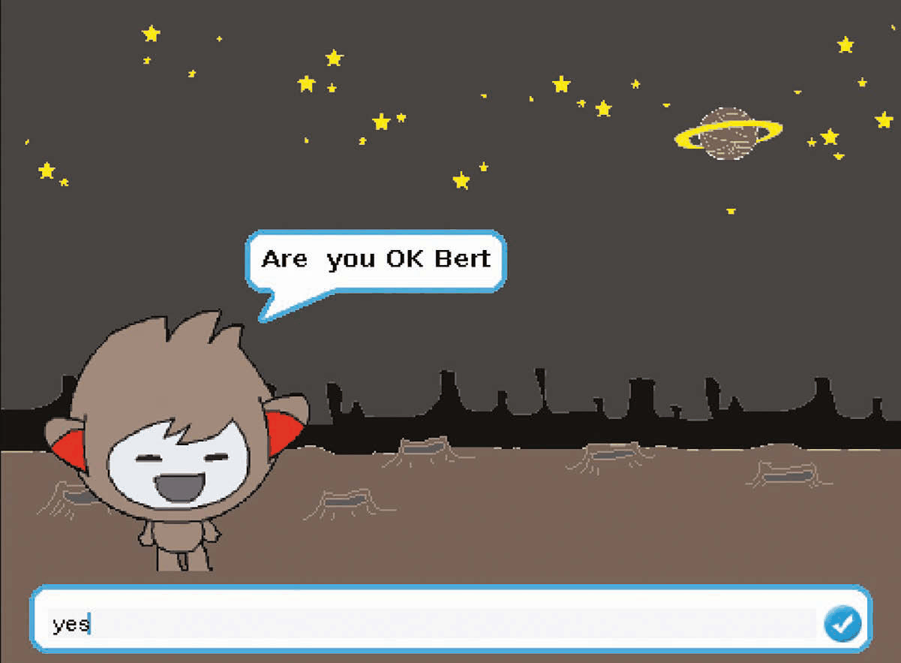
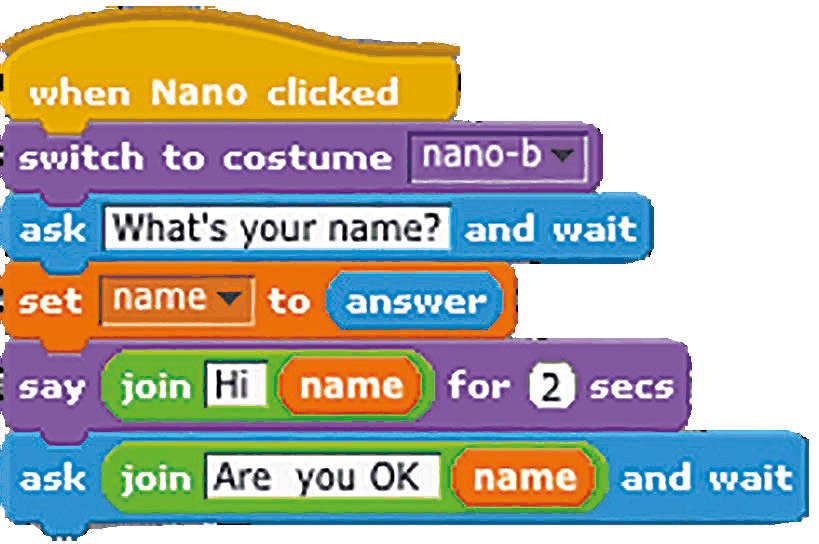
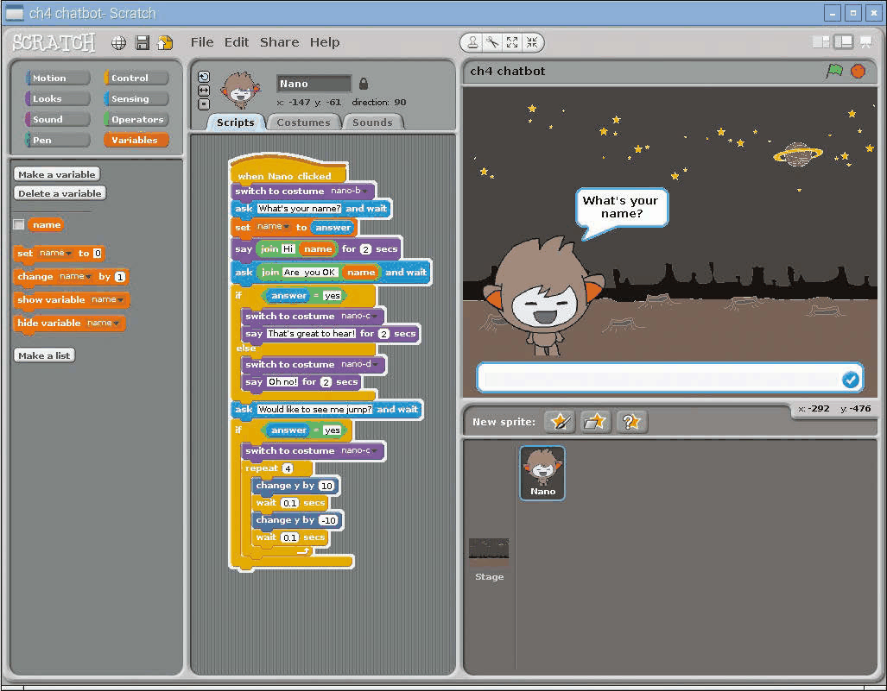
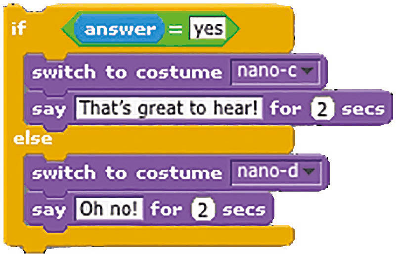
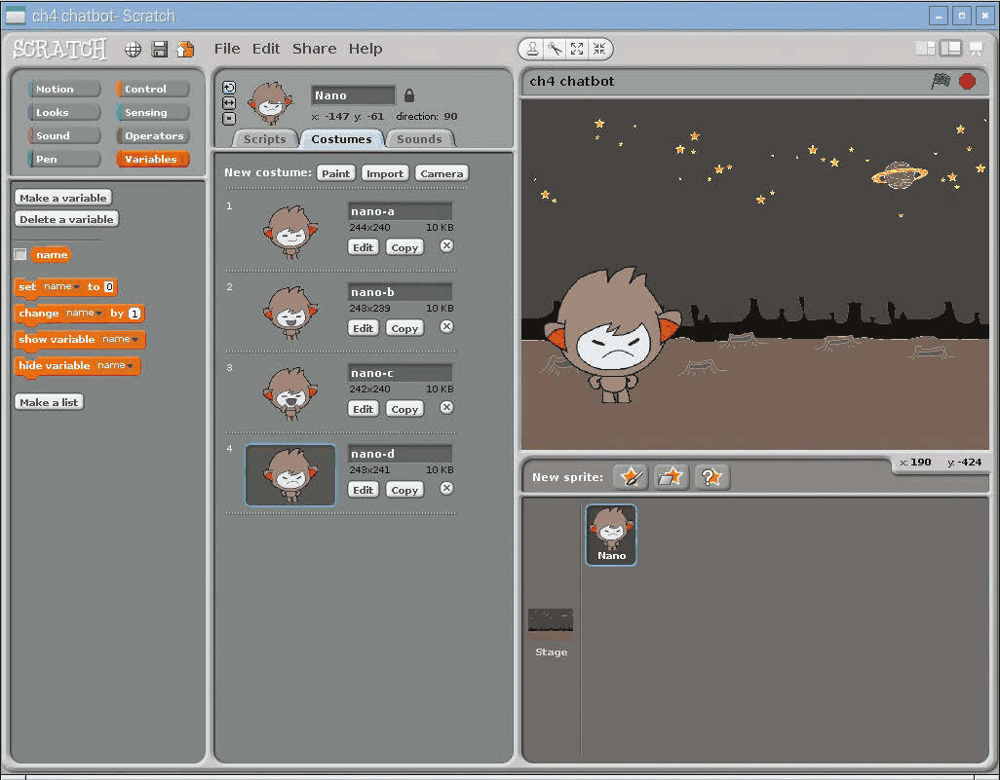
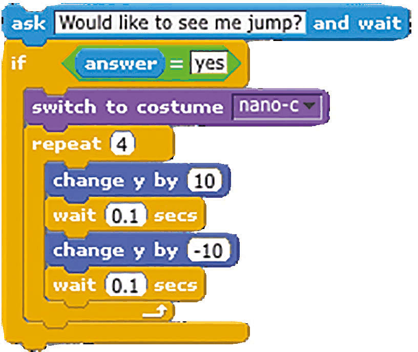

# Capitolul 4 – ChatBot, robotul vorbitor

> *Nano, robotul cel drăguț, adoră să stea la povești. Va răspunde la ce îi spui și va sări chiar în sus și în jos dacă îi ceri…*

> **NOTĂ**
> Acest proiect provine de la Code Club. Găsești mai multe resurse minunate ca acesta la [codeclub.org.uk](https://codeclub.org.uk).

Pentru acest proiect vei crea propriul tău robot vorbitor, care răspunde la textul pe care îl introduci. Îi vom schimba și expresia feței, comutând între diferite costume. Vom folosi comenzi `ask` (întreabă), blocuri `if/else` (dacă/altfel) și operatorul `join` (unește). Vom crea și o variabilă în care să păstrăm numele utilizatorului – variabilele sunt foarte utile pentru a păstra valori pe care le folosești în alte locuri. Destul cu vorba – hai să pornim un proiect Scratch nou…

- Ca și la `say`, comanda `ask` afișează un balon de vorbire.
- Personajul Nano are patru costume, care sunt alternate pentru a-l anima.
- Comanda `ask` afișează și un câmp de text în care utilizatorul își introduce răspunsul.

### Pasul 1 – Pregătește grafica

După ce ștergi pisica apăsând clic dreapta pe ea și selectând Delete, e timpul să imporți un fundal nou pentru scenă și personajul nostru. Pentru că niciunul dintre ele nu se află în biblioteca Scratch 1.4, le poți descărca de la [magpi.cc/scratch_art](https://magpi.cc/scratch_art). Să alegem un fundal nou: apasă pe Stage în Lista de personaje (dreapta jos), selectează fila Backgrounds (sus, în mijloc), apoi apasă pe Import și navighează la dosarul în care ai salvat grafica descărcată pentru acest proiect. Apoi apasă pe pictograma stea/dosar de deasupra Listei de personaje, navighează la același dosar și importă personajul Nano. Dacă apeși pe fila Costumes, vei observa că Nano are patru costume; vom comuta între ele pentru a-l anima pe micul nostru prieten robot.

### Pasul 2 – Cere un nume

Mai întâi, îl vom face pe robot să ceară numele utilizatorului și apoi să îl folosească într-un răspuns. Cu personajul Nano selectat, apasă pe fila Scripts (sus, în mijloc) și adaugă codul din **Listarea 1**. Observă că, în loc să folosim `when green flag clicked` (când se apasă steagul verde), pornim programul când se apasă pe personajul Nano. Acesta cere apoi numele utilizatorului, care este păstrat într-o variabilă numită `name`. Mai întâi trebuie să o creăm: selectează Variables din stânga sus, apoi apasă pe „Make a variable” (creează o variabilă), „For this sprite only” (doar pentru acest personaj) și introdu „name” în câmpul de text. Debifează blocul `name`, ca să nu mai fie afișat pe scenă. Acum putem seta `name` la `answer` (răspunsul, adică textul introdus de utilizator) și apoi să îl adăugăm în replica lui Nano folosind blocul Operator `join`. Asigură-te că pui un spațiu după „Hi”, ca să nu fie lipit de nume.

*Listarea 1 – Nano întreabă cum te numești*

*Creăm o variabilă în care păstrăm numele utilizatorului și apoi îl repetăm în replica lui Nano*

### Pasul 3 – Adaugă o întrebare

Apoi vom adăuga la sfârșitul acestui script mai multe blocuri, din **Listarea 2**. După ce îi salută, Nano îl întreabă pe utilizator dacă e OK. Folosim din nou blocul Sensing `ask` pentru asta și variabila `name` pentru a-i spune pe nume. Apoi folosim un bloc Control `if…else` pentru a stabili răspunsul lui Nano în funcție de ce a introdus utilizatorul. Dacă este „yes” (da) – lucru pe care îl testăm folosind operatorul `=` – schimbăm costumul lui Nano în cel vesel, nano-c, folosind meniul derulant de pe acest bloc Looks. Îl și facem să spună „That's great to hear!” (Mă bucur să aud asta!).

*Listarea 2 – răspunsuri diferite, cu if…else*

*Comutând între patru costume, putem schimba expresia feței personajului nostru*

### Pasul 4 – Altfel…

În partea `else` a blocului `if…else` stabilim ce se întâmplă dacă textul introdus de utilizator nu este „yes”. În acest caz, schimbăm costumul lui Nano în cel încruntat, nano-d, și îl facem să spună „Oh no!” (Vai, nu!). Testează codul cu răspunsuri diferite, ca să verifici că funcționează așa cum te aștepți. Reține că, deși textul introdus nu ține cont de litere mari și mici, el trebuie să fie exact „yes”, fără nimic adăugat, ca să fie recunoscut ca atare.

> **SFAT**
> Poți adapta robotul să vorbească românește: schimbă textele din blocurile `say` și `ask`, iar în blocul `=` compară răspunsul cu „da” în loc de „yes”.

### Pasul 5 – Sari în sus și în jos

La final, vom adăuga o altă întrebare cu `ask`, folosind un bloc `if` obișnuit pentru a-l face pe Nano să sară sau nu în sus și în jos; adaugă blocurile din **Listarea 3** la script. Folosim o buclă `repeat` pentru a-l face pe Nano să se miște în mod repetat în sus și în jos, pentru o animație de săritură. Ca să ne asigurăm că nu e încruntat de la răspunsul anterior în timp ce sare, îi schimbăm costumul în nano-c înainte de bucla `repeat`.

*Listarea 3 – Nano sare în sus și în jos*

### Pasul 6 – Mergi mai departe

Poți modifica întrebările din exemplu sau poți adăuga oricâte altele vrei, chiar să îl faci pe Nano să spună o glumă. Poți adăuga și costume în plus, copiindu-le și modificându-le în Paint Editor, sau chiar să proiectezi un personaj cu totul nou, cu diverse costume.
