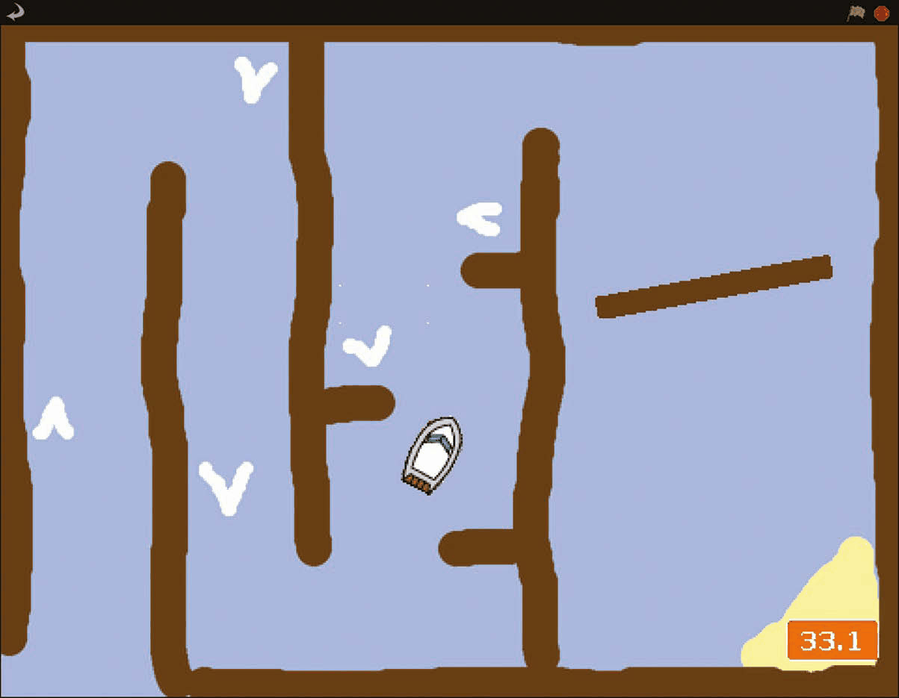
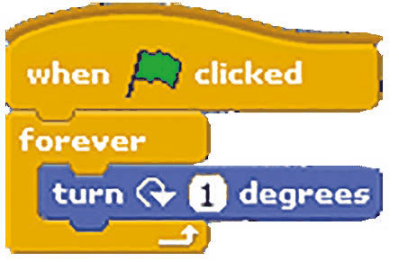
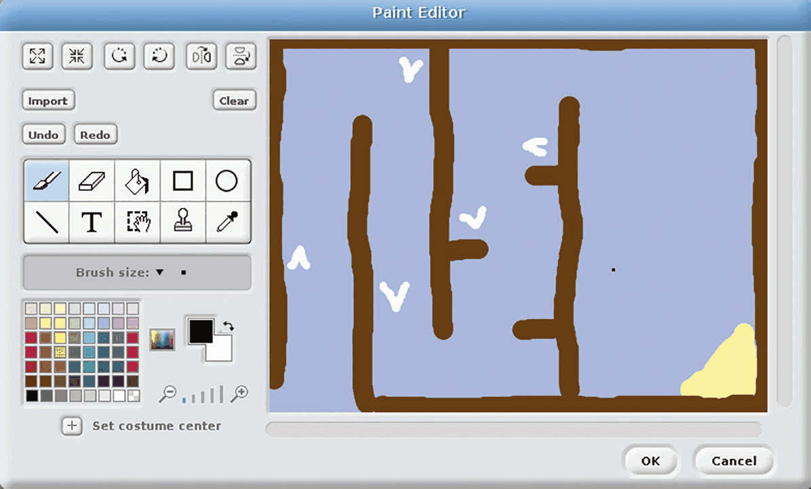
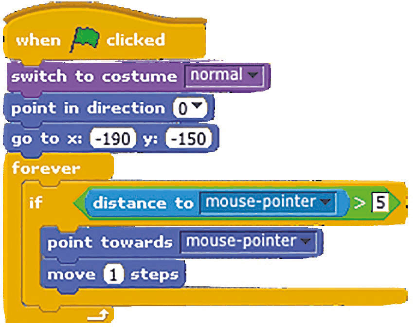
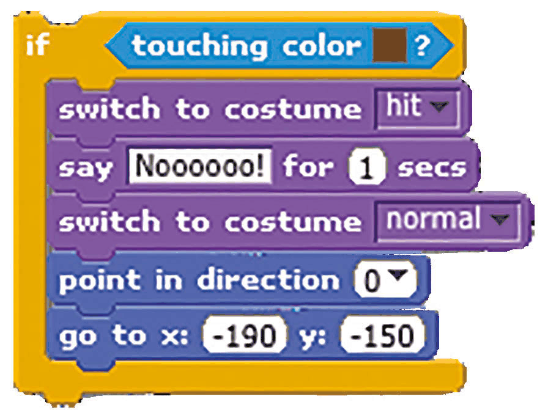
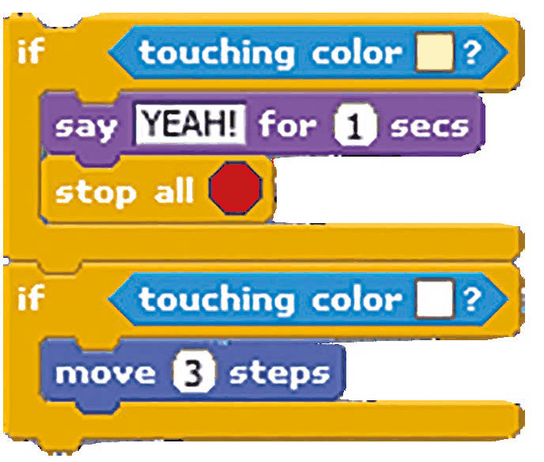
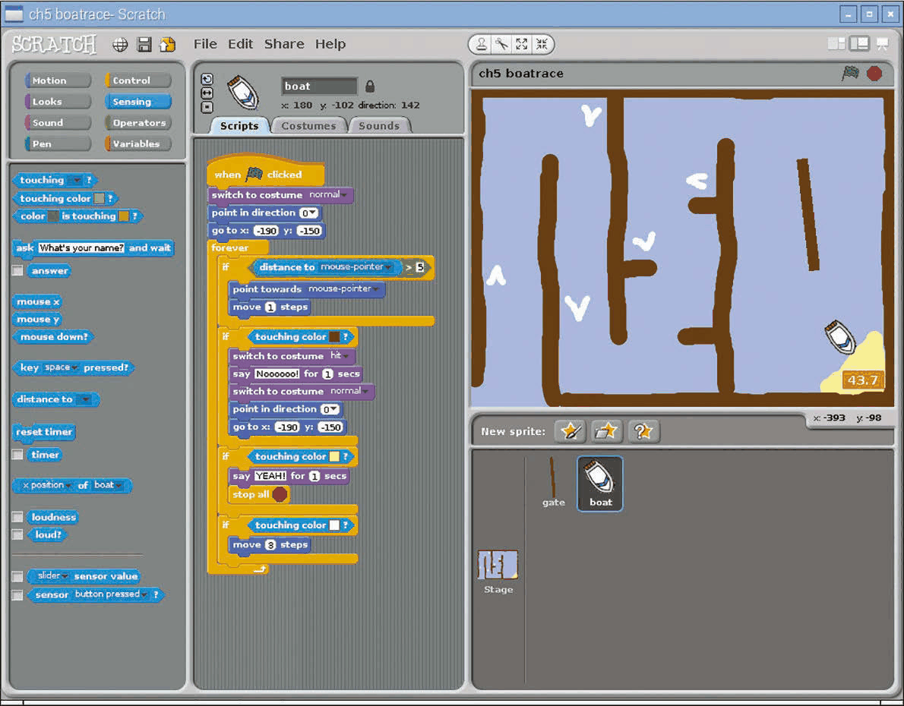
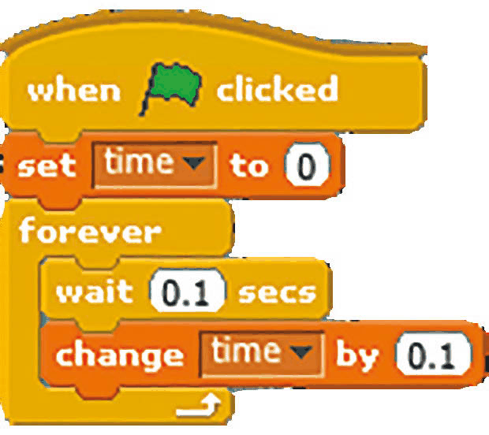

# Capitolul 5 – Cursa cu bărci

> *Creează-ți propriul joc de curse cu bărci, cu control din mouse, detectarea coliziunilor și cronometru pe ecran*

> **NOTĂ**
> Acest proiect provine de la Code Club. Găsești mai multe resurse minunate ca acesta la [codeclub.org.uk](https://codeclub.org.uk).

În acest capitol îți vei face propriul joc arcade, în care jucătorul încearcă să conducă o barcă în siguranță pe un traseu asemănător unui labirint – inclusiv printr-o poartă rotitoare – până la sosire, în cel mai scurt timp posibil. Poți chiar să îți proiectezi propriul traseu, dacă vrei. Pe lângă mișcarea unui personaj spre cursorul mouse-ului, acest proiect implică detectarea coliziunilor, folosind blocul Sensing `touching color` (atinge culoarea) pentru a stabili dacă barca a lovit ceva. Hai să ne aruncăm în apă și să începem să programăm…

- Barca se prăbușește dacă lovește ceva maro, ca această poartă rotitoare.
- Personajul barcă este programat să se miște spre cursorul mouse-ului.
- Cronometrul este afișat pe ecran și se oprește când barca ajunge la plaja galbenă.

### Pasul 1 – Pregătește grafica

Mai întâi, șterge pisica! Apoi trebuie să imporți cele două personaje, barca și poarta. Pentru că nu se află în biblioteca Scratch 1.4, le poți descărca de la [magpi.cc/scratch_art](https://magpi.cc/scratch_art). Apasă pe pictograma stea/dosar de deasupra Listei de personaje (dreapta jos), apoi navighează la dosarul în care ai salvat grafica descărcată pentru acest proiect. Importă personajele Boat (barca) și Gate (poarta). Dacă nu îți proiectezi propriul traseu, poți descărca și importa și fundalul nostru Course: apasă pe Stage în Lista de personaje, selectează fila Backgrounds (sus, în mijloc), apoi apasă pe Import și navighează la dosar.

### Pasul 2 – Proiectează un traseu

Poți pur și simplu să modifici traseul nostru. Ca alternativă, pentru a crea unul complet nou, apasă pe Stage în Lista de personaje, apoi pe fila Backgrounds și pe Paint (desenează). Folosește unealta găleată de vopsea pentru a umple pânza cu o culoare albastră, pentru apă. Apoi folosește o culoare maro – care ar trebui să fie aceeași ca în personajul Gate – pentru a desena pereții traseului. Folosește o culoare galbenă pentru a desena nisipul de la sosire. La final, adaugă câteva săgeți albe, care vor funcționa ca acceleratoare. Odată ce ai terminat, hai să facem personajul Gate să se rotească, adăugând codul simplu din **Listarea 1** în Zona lui de scripturi.

*Listarea 1 – poarta se rotește la nesfârșit*

*Poți modifica traseul în Paint Editor sau poți crea unul complet nou*

### Pasul 3 – Controlează barca

În acest joc vom controla barca cu mouse-ul – folosind codul din **Listarea 2**, în fila Scripts a personajului Boat. Pentru asta, pur și simplu o îndreptăm spre „mouse-pointer” (cursorul mouse-ului) și o mișcăm câte 1 pas o dată, în interiorul unei bucle `forever` (la nesfârșit). Ca să o oprim din mișcare când e aproape de cursor, punem codul de control într-un bloc `if` care îi spune să se miște doar dacă distanța până la cursor este mai mare decât 5. Încearcă codul și condu barca: deocamdată, ea trece direct prin bariere.

*Listarea 2 – barca urmărește cursorul mouse-ului*

### Pasul 4 – Fă-o să se prăbușească!

Ce ne trebuie este detectarea coliziunilor, pentru a verifica dacă barca a lovit un obstacol. În interiorul blocului tău `forever`, adaugă codul din **Listarea 3** sub codul de control al bărcii. Aici folosim blocul Sensing `touching color` pentru a vedea dacă barca a lovit ceva maro: apasă pe pătratul colorat pentru a obține o unealtă pipetă, apoi apasă pe o parte maro a traseului. Când se prăbușește, schimbăm costumul bărcii, spunem „Noooooo!”, apoi o punem înapoi la punctul de start (în costumul ei normal).

*Listarea 3 – ce se întâmplă când barca lovește un perete*

Hai să adăugăm încă două blocuri `if touching color`, arătate în **Listarea 4**, în bucla noastră `forever`. Primul verifică dacă barca a ajuns la plaja galbenă, care ține loc de linie de sosire, și oprește programul. Al doilea detectează albul săgeților-acceleratoare și mișcă barca trei pași.

*Listarea 4 – linia de sosire și acceleratoarele*

*Am folosit blocuri Sensing `touching color` pentru a detecta când barca a lovit un obstacol, un accelerator sau sosirea*

### Pasul 5 – Acceleratoare și timp

Ca jocul să fie un pic mai captivant, avem nevoie de un cronometru. Apasă pe Stage și adaugă codul din **Listarea 5** în Zona lui de scripturi. Acesta setează timpul la zero la începutul jocului, apoi crește treptat variabila `time`, în pas cu timpul real – va trebui să creezi această variabilă în Variables și să te asiguri că este bifată, ca să fie afișată pe scenă.

*Listarea 5 – cronometrul, adăugat pe Scenă*

### Pasul 6 – Mergi mai departe

Ai putea adăuga ușor un efect sonor pentru momentul în care barca se prăbușește, folosind un bloc Sound. Ai putea adăuga chiar și muzică de fundal, compunând-o cu blocuri Sound cu diverse tobe, instrumente și note. Cel mai bun timp (sau cei mai buni timpi) ar putea fi păstrat într-o variabilă sau într-o listă.
