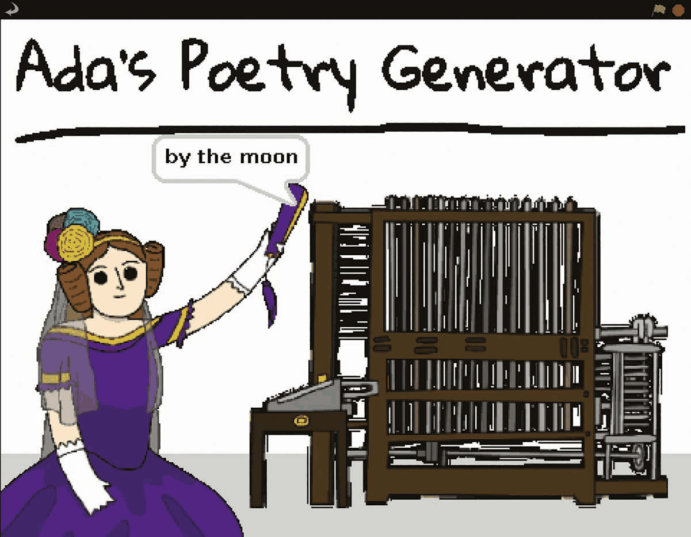
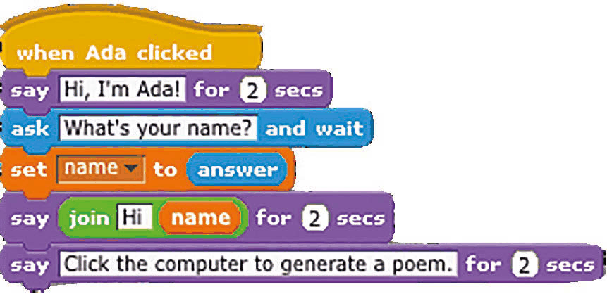
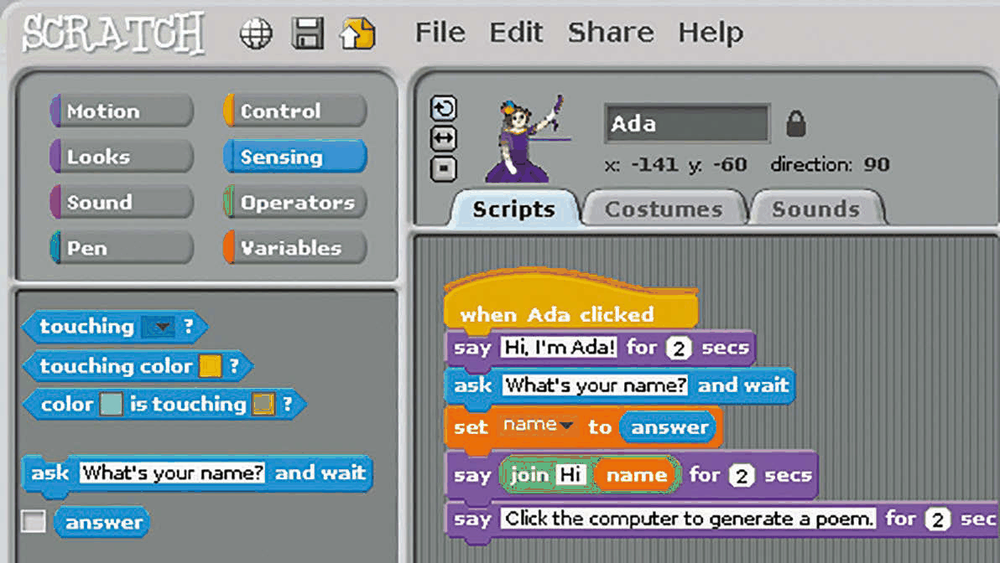
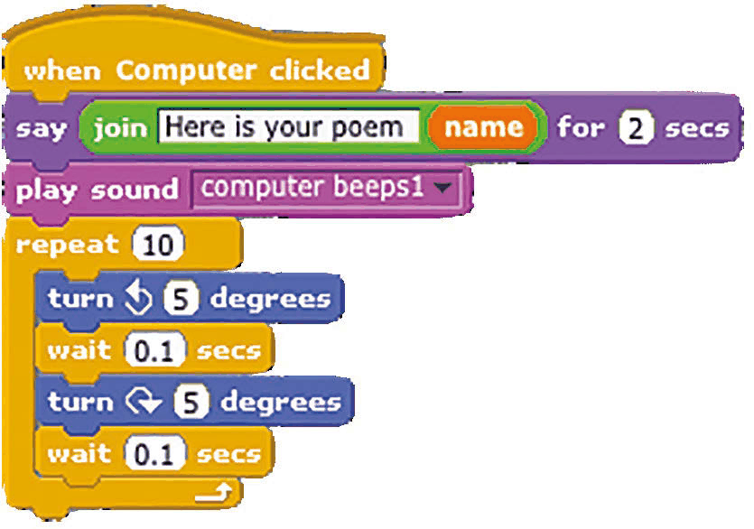
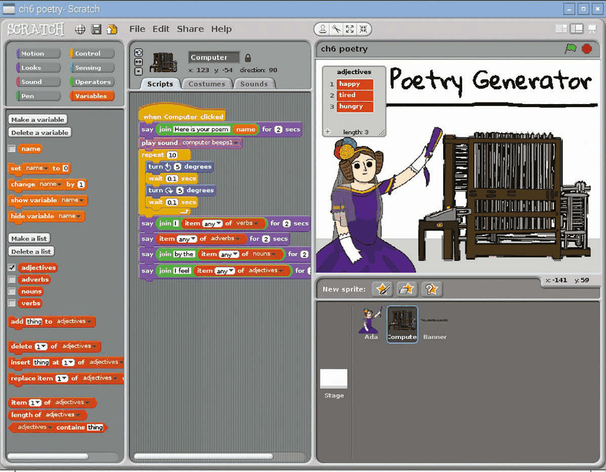
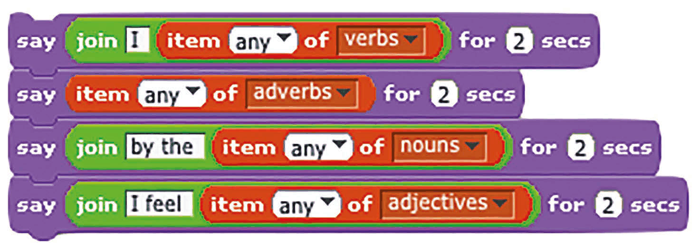

# Capitolul 6 – Generatorul de poezii al Adei

> *Ada Lovelace prezintă Mașina Analitică! Acest calculator de pe vremuri arată un pic primitiv, dar poate genera poezii aleatorii*

> **NOTĂ**
> Acest proiect provine de la Code Club. Găsești mai multe resurse minunate ca acesta la [codeclub.org.uk](https://codeclub.org.uk).

În acest proiect, utilizatorul stă mai întâi de vorbă cu Ada, apoi apasă pe calculatorul ei pentru a genera o poezie aleatorie. Pentru asta, vom crea și vom folosi liste – pe care le găsești în categoria de blocuri Variables – care conțin cuvinte de un anumit fel: verbe, substantive, adjective și adverbe. Apoi vom alege la întâmplare din aceste liste pentru a compune poezia, care ar trebui să fie diferită de fiecare dată. Pot ieși destul de amuzante.

- Poezia este generată alegând cuvinte la întâmplare din liste.
- Utilizatorul apasă pe Ada Lovelace pentru a începe să vorbească cu ea.
- Când se apasă pe calculator, acesta bipăie și se scutură.

> **ȘTIAI CĂ?**
> Ada Lovelace (1815–1852) este considerată prima programatoare din istorie. Ea a scris instrucțiuni pentru Mașina Analitică, un calculator mecanic proiectat de Charles Babbage, cu un secol înainte să existe calculatoarele electronice.

### Pasul 1 – Pregătește grafica

După ce ștergi personajul pisică, ca de obicei, trebuie să imporți personajele și fundalul. Pentru că nu se află în biblioteca Scratch 1.4, le poți descărca de la [magpi.cc/scratch_art](https://magpi.cc/scratch_art). Fundalul Poetry este atât de simplu – doar o dungă gri în partea de jos a unei pânze albe – încât l-ai putea desena singur, sau poți folosi pe al nostru, importându-l din dosarul în care ai salvat grafica descărcată pentru acest proiect. Același lucru e valabil și pentru personajul Banner. Altfel, importă fiecare personaj ca de obicei, apăsând pe pictograma stea/dosar de deasupra Listei de personaje.

### Pasul 2 – Ada spune bună ziua

La fel ca la ChatBot-ul din capitolul 4, o vom face pe Ada – când se apasă pe ea – să interacționeze cu utilizatorul prin baloane de vorbire și text introdus de la tastatură, folosind comenzile `say` și `ask`. Deschide fila Scripts a personajului Ada și introdu codul din **Listarea 1**. Ca și înainte, va trebui să creezi o variabilă `name`: selectează categoria de blocuri Variables din stânga sus, apoi apasă pe „Make a variable”, „For this sprite only” și introdu „name” în câmpul de text. Debifează blocul `name`, ca să nu mai fie afișat pe scenă. Acum putem seta `name` la `answer` (textul introdus de utilizator) și apoi să îl adăugăm în replica Adei folosind blocul Operator `join`. Asigură-te că pui un spațiu după „Hi”, ca să nu fie lipit de nume. După aceea, adăugăm un bloc prin care Ada îi spune utilizatorului să apese pe calculator.

*Listarea 1 – Ada se prezintă și îți cere numele*

*Scriptul Adei este asemănător cu cel folosit pentru Nano în capitolul 4, care cere numele utilizatorului*

### Pasul 3 – Calculatorul bipăie

Apasă pe personajul Computer și selectează fila lui Scripts. Aici vom adăuga mecanismul generatorului nostru de poezii. Pentru început, introdu codul din **Listarea 2**. După un bloc care spune „Here is your poem” (Iată poezia ta) și numele utilizatorului, vom folosi un bloc Sound pentru a face calculatorul să bipăie. Personajul Computer are deja sunetul pentru asta, sau poți înregistra/importa unul nou în fila lui Sounds. Adăugăm și o buclă `repeat` cu două blocuri `turn` (rotește), pentru a face calculatorul să se scuture.

*Listarea 2 – calculatorul bipăie și se scutură*

### Pasul 4 – Creează listele de cuvinte

Nu poți face o poezie fără cuvinte. Pe ale noastre le vom păstra în patru liste: `verbs` (verbe), `adverbs` (adverbe), `nouns` (substantive) și `adjectives` (adjective). Creează fiecare listă în Variables, apăsând pe butonul „Make a list” (creează o listă), apoi pe „For this sprite only” și tastându-i numele. Lista va apărea apoi pe scenă: pentru a adăuga cuvinte în ea, apasă pe pictograma „+” și tastează-le, unul câte unul. Când ai terminat, debifează blocul listei ca să dispară de pe scenă. Noi am folosit următoarele cuvinte pentru listele noastre:

| Listă | Cuvinte |
|---|---|
| **Adjectives** (adjective) | happy (vesel), tired (obosit), hungry (flămând) |
| **Adverbs** (adverbe) | loudly (tare), silently (în tăcere), endlessly (la nesfârșit) |
| **Nouns** (substantive) | sea (mare), moon (lună), tree (copac) |
| **Verbs** (verbe) | laugh (râd), dance (dansez), burp (râgâi) |

*Pentru a adăuga cuvinte în fiecare listă, bifeaz-o ca să apară pe scenă, apoi apasă pe pictograma „+”*

> **SFAT**
> Poți face liste cu cuvinte românești! Ține cont însă că versurile din Listarea 3 sunt construite cu blocuri `join` după modelul englezesc („I …”, „by the …”, „I feel …”), așa că va trebui să adaptezi și textele fixe din blocurile `say`, de exemplu „Eu …”, „lângă …”, „Mă simt …”.

### Pasul 5 – Poezie în mișcare

Acum că avem listele de cuvinte, le putem folosi pentru a genera o poezie aleatorie de fiecare dată când utilizatorul apasă pe calculator. Îmbină codul din **Listarea 3** la sfârșitul scriptului existent al personajului Computer. Acesta este format din patru blocuri `say`, fiecare dintre ele incluzând un bloc Variables `item … of` (elementul … din); acesta trebuie să aibă selectat „any” (oricare) din meniul lui derulant, pentru a alege la întâmplare din listă. Testează proiectul de câteva ori, ca să verifici că funcționează corect și că generează poezii aleatorii.

*Listarea 3 – patru versuri alcătuite din cuvinte alese la întâmplare*

### Pasul 6 – Mergi mai departe

Deși am creat doar liste scurte pentru acest exemplu, ai putea adăuga mult mai multe cuvinte în ele, pentru o variație mai mare a poeziilor aleatorii create de calculator. Se pot adăuga și mai multe blocuri `say`, construite diferit, pentru a face poeziile mai lungi. Dacă nu îți plac versurile albe, de ce să nu creezi liste de cuvinte care rimează?
