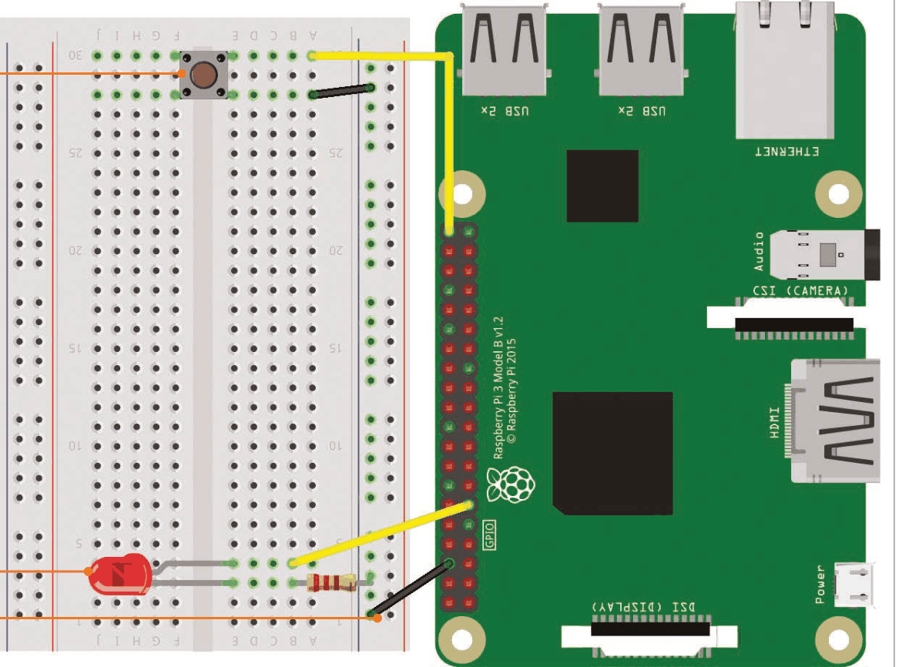
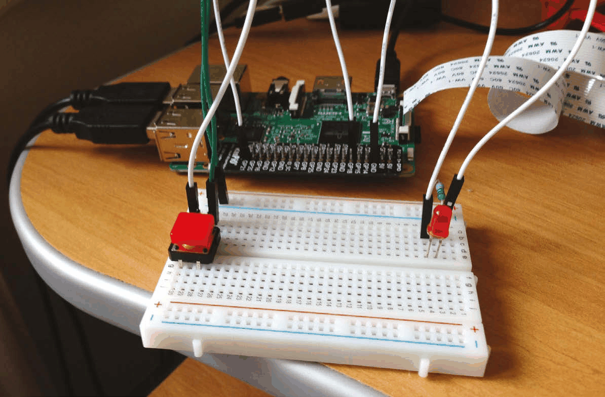
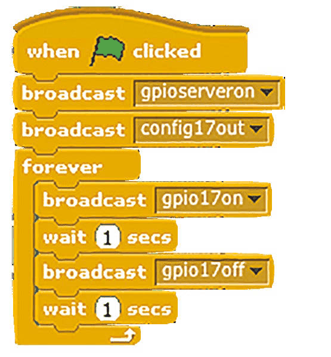
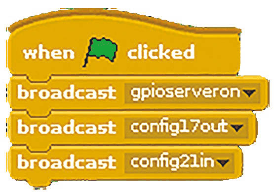
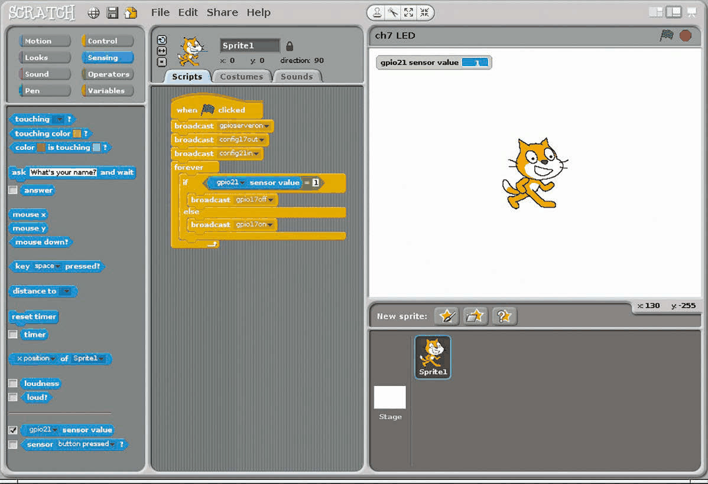
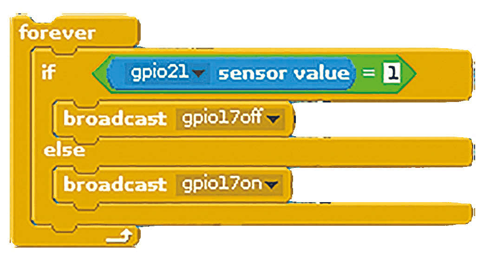
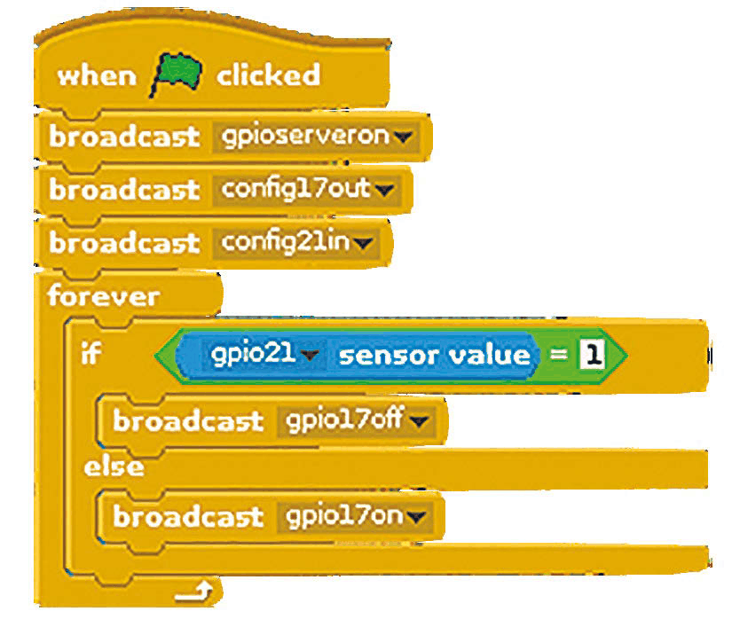

# Capitolul 7 – Aprinde un LED

> *Scratch poate fi folosit împreună cu pinii GPIO ai Raspberry Pi pentru proiecte de „physical computing”. Aici vom conecta un LED aprins de un buton*

În cea mai nouă versiune de Raspbian Jessie, Scratch include un server GPIO încorporat, care face mai ușoară controlarea componentelor electronice sau a plăcilor de extensie. În acest prim tutorial GPIO vom crea un circuit simplu cu un buton care, când este apăsat, face ca un LED să se aprindă. Uită-te la caseta „Vei avea nevoie de” pentru a vedea ce componente electronice sunt necesare; le poți cumpăra separat, dar toate se găsesc în kitul CamJam EduKit #1 ([magpi.cc/1OcXtim](https://magpi.cc/1OcXtim)).

> **NOTA TRADUCĂTORULUI**
> GPIO (General Purpose Input/Output) sunt pinii de pe marginea plăcii Raspberry Pi prin care calculatorul poate „vorbi” cu componente electronice: poate aprinde un LED sau poate simți când un buton este apăsat. Dacă folosești Scratch 3 pe Raspberry Pi OS, în locul blocurilor `broadcast` din acest capitol adaugă extensia „Raspberry Pi GPIO” (butonul din stânga jos), care are blocuri dedicate pentru a seta un pin ca ieșire, a-l aprinde sau a citi starea unui buton.

> **VEI AVEA NEVOIE DE**
> - o placă de prototipare fără lipire (*breadboard*)
> - un LED
> - un rezistor de 330Ω
> - un buton (*push button*)
> - 3 fire de legătură tată-mamă (*male-to-female jumper wires*)
> - un fir de legătură tată-tată (*male-to-male jumper wire*)

- Când butonul este apăsat, circuitul se închide la masă și Scratch detectează valoarea zero pe pinul GPIO 21.
- Piciorul mai lung al LED-ului este legat la GPIO 17, iar celălalt este conectat printr-un rezistor la șina de masă.
- Legând rândul „–”, adică șina de masă, la un pin GND, mai multe componente pot folosi aceeași conexiune.

### Pasul 1 – Conectează LED-ul

Cel mai bine este să oprești Raspberry Pi-ul când construiești circuitul. Placa de prototipare are coloane numerotate, fiecare formată din cinci găuri conectate între ele. Pune picioarele LED-ului în coloane numerotate alăturate, așa cum arată diagrama. Reține că piciorul mai scurt al LED-ului este capătul negativ; în coloana lui de pe placă, introdu un capăt al rezistorului, apoi pune celălalt capăt în rândul exterior marcat cu „–” (șina de masă). Folosește un fir de legătură tată-mamă pentru a conecta o altă gaură din acea șină de masă la un pin GND al Raspberry Pi. La final, folosește un fir de legătură pentru a conecta o gaură din coloana piciorului mai lung (pozitiv) al LED-ului la pinul GPIO 17.

*Acest proiect este simplu de cablat folosind o placă de prototipare fără lipire și câteva fire de legătură*

### Pasul 2 – Configurează GPIO în Scratch

Înainte să putem folosi pinii GPIO din Scratch, trebuie să îi pornim serverul GPIO. Deși asta se poate face din meniul Edit, noi vom face codul să îl activeze. Sub un bloc `when green flag clicked`, adaugă un bloc Control `broadcast` (transmite), apasă pe săgeata lui, selectează new/edit (nou/modifică) și introdu `gpioserveron`. Trebuie să configurăm și pinul GPIO 17 ca pin de ieșire (pentru a comanda LED-ul), așa că adaugă încă un bloc `broadcast` și schimbă-l în `config17out`.

### Pasul 3 – Aprinde LED-ul

Acum vom testa circuitul, folosind o buclă pentru a face LED-ul să clipească. Adaugă un bloc `forever` la sfârșitul codului tău. În interiorul lui, adaugă următoarele blocuri: `broadcast gpio17on`, `wait 1 secs`, `broadcast gpio17off` și `wait 1 secs`. Acum încearcă să rulezi codul (**Listarea 1**) și LED-ul tău ar trebui să se aprindă și să se stingă continuu.

*Listarea 1 – LED-ul clipește*

### Pasul 4 – Conectează butonul

Putem controla LED-ul adăugând un buton. Din nou, te sfătuim să oprești Raspberry Pi-ul în timp ce conectezi componente noi. Adaugă butonul pe placa de prototipare, cu pinii lui de o parte și de alta a șanțului central (așa cum arată diagrama). Conectează un fir de legătură tată-mamă de la coloana unuia dintre pini la pinul GPIO 21 al Raspberry Pi. Conectează un fir tată-tată de la celălalt pin (de pe aceeași parte a șanțului) la șina de masă pe care o folosești pentru circuitul LED-ului (pentru a împărți conexiunea la pinul GND).

### Pasul 5 – Configurează butonul

Înainte ca Scratch să poată reacționa la noul tău buton, trebuie să îi spunem care pin este intrarea lui. Șterge bucla `forever` din codul LED-ului care clipește, trăgând-o afară din zonă. Adaugă un alt bloc `broadcast`, cu `config21in`, pentru a configura pinul GPIO 21 ca intrare – vezi **Listarea 2**. Rulează și oprește codul. Acum apasă pe categoria Sensing din panoul din stânga sus. Găsește blocul `sensor value` (valoarea senzorului) și schimbă-l în `gpio21`. Bifează căsuța lui pentru a-i afișa valoarea pe scenă: de fiecare dată când butonul este apăsat, ea ar trebui să se schimbe din 1 în 0.

*Listarea 2 – configurarea pinilor pentru LED și buton*

*Bifând blocul `gpio21 sensor value` al butonului, acesta va fi afișat pe scenă, ceea ce e util pentru testare*

### Pasul 6 – Leagă butonul de LED

Acum că butonul funcționează, e timpul să îl facem să comande LED-ul. Adaugă codul din **Listarea 3** la sfârșitul codului tău. Din nou, folosim un bloc `forever` pentru o buclă continuă. În interiorul lui adăugăm un bloc `if…else`. În câmpul `if` punem un bloc Operator `=`; în câmpul lui din stânga adăugăm `gpio21 sensor value`, iar în cel din dreapta scriem 1. Dedesubt inserăm `broadcast gpio17off`. În acest fel, când butonul nu este apăsat, LED-ul va fi stins. Sub `else`, inserăm `broadcast gpio17on`, pentru a aprinde LED-ul când butonul este apăsat. Rulează codul (ca în **Listarea 4**), apasă butonul și privește-ți LED-ul! În capitolul următor vom adăuga mai multe LED-uri în circuit, pentru a face o trecere de pietoni.

*Listarea 3 – LED-ul se aprinde cât timp butonul este apăsat*

*Listarea 4 – scriptul complet*
