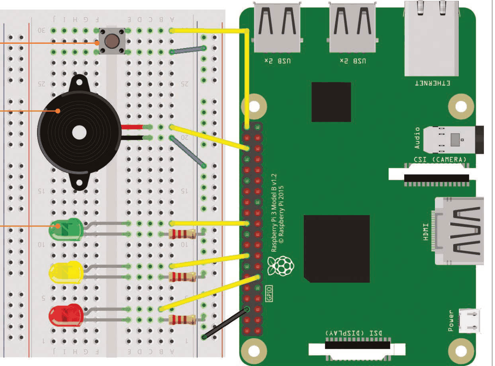
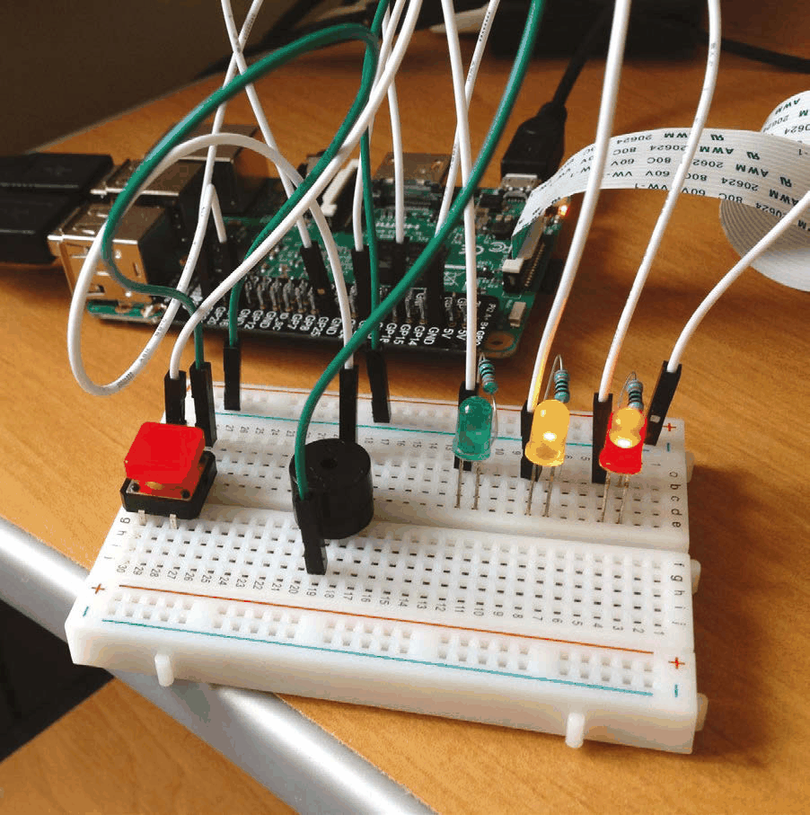
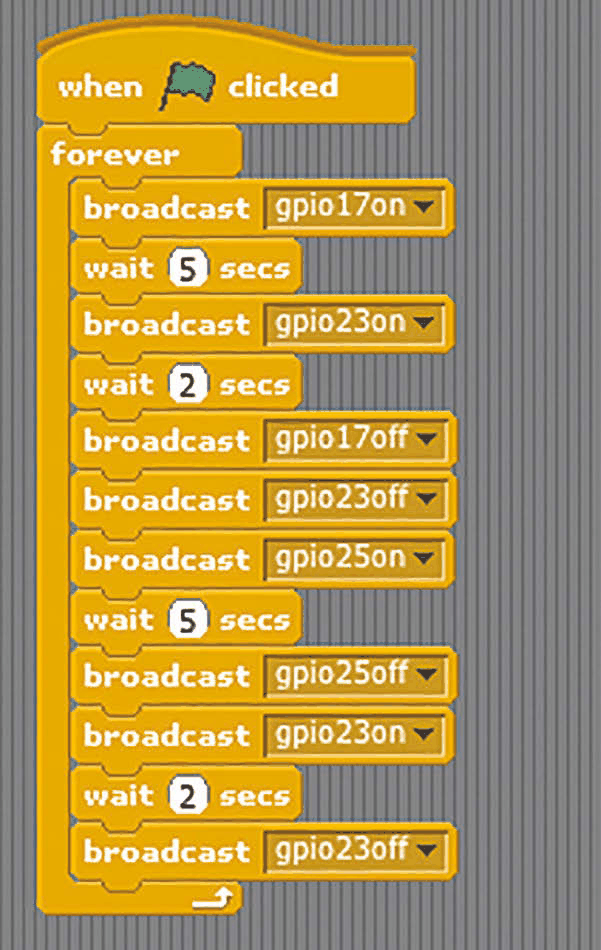
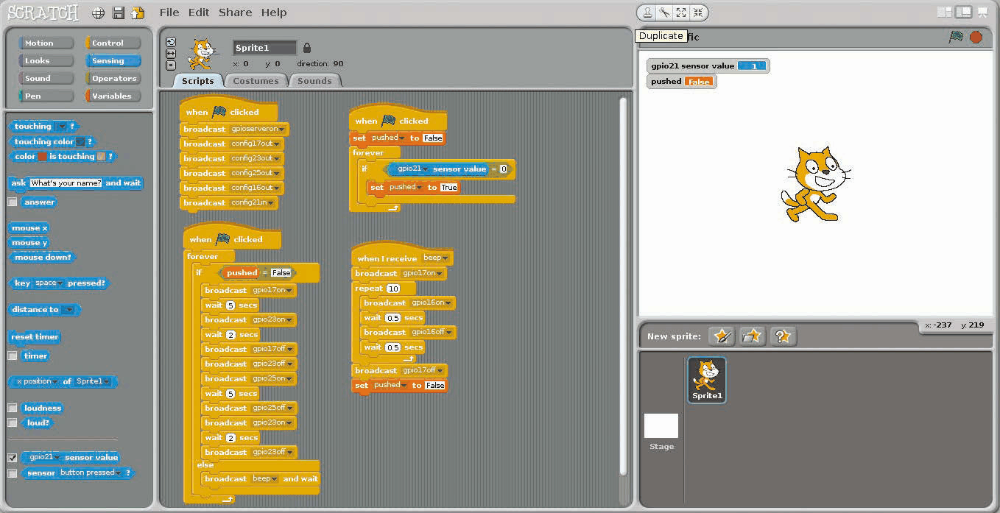
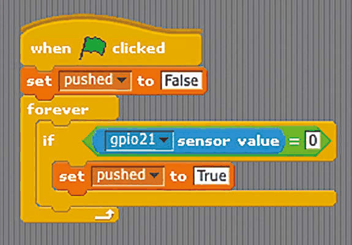
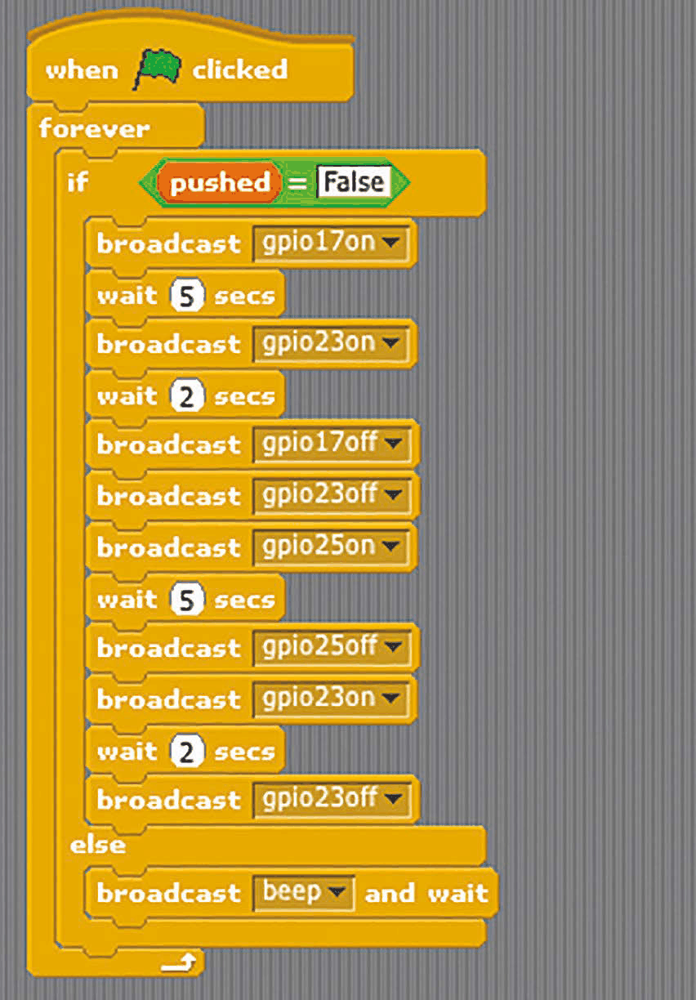
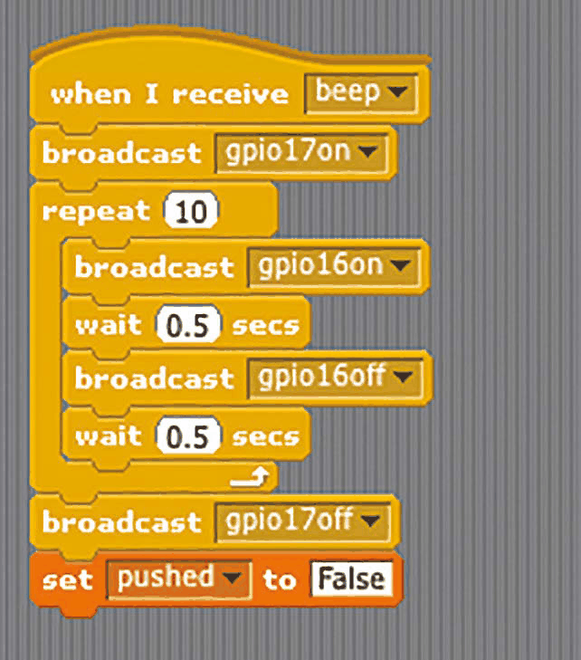

# Capitolul 8 – Semafor cu LED-uri

> *Continuând capitolul anterior, vom folosi trei LED-uri și un buton pentru a face o trecere de pietoni*

În cea mai nouă versiune de Raspbian Jessie, Scratch include un server GPIO încorporat, care face mai ușoară controlarea componentelor electronice sau a plăcilor de extensie. În acest al doilea tutorial GPIO vom crea un semafor cu trecere de pietoni, folosind LED-uri, un buton și un buzzer. Din nou, toate componentele necesare se găsesc în kitul CamJam EduKit #1 ([magpi.cc/1OcXtim](https://magpi.cc/1OcXtim)).

> **VEI AVEA NEVOIE DE**
> - o placă de prototipare fără lipire (*breadboard*)
> - 3 LED-uri: roșu, galben și verde
> - 3 rezistoare de 330Ω
> - un buton (*push button*)
> - un buzzer piezo
> - 5 fire de legătură tată-mamă
> - 2 fire de legătură tată-tată

- Când butonul este apăsat, circuitul se închide la masă și Scratch detectează valoarea zero pe pinul GPIO 21.
- Un buzzer piezo este legat la șina de masă și la pinul GPIO 16, pentru bipurile trecerii de pietoni.
- Fiecare LED este conectat la un pin GPIO diferit, ca să poată fi aprins în timpul secvenței semaforului.

### Pasul 1 – Conectează LED-urile

Cel mai bine este să oprești Raspberry Pi-ul când construiești circuitul. Placa de prototipare are coloane numerotate, fiecare formată din cinci găuri conectate între ele. Adaugă LED-urile pe ea, așa cum arată diagrama. Dacă tocmai ai terminat capitolul 7, poți lăsa acele componente la locul lor, inclusiv LED-ul roșu. Ca și înainte, piciorul mai scurt (negativ) al fiecărui LED trebuie conectat printr-un rezistor la rândul „–” (șina comună de masă), care este legat la un pin GND al Raspberry Pi. Piciorul mai lung (pozitiv) al fiecărui LED trebuie conectat la pinul GPIO corespunzător printr-un fir de legătură tată-mamă.

*Deși e o încâlceală de fire, componentele sunt relativ ușor de conectat*

### Pasul 2 – Configurează GPIO în Scratch

Mai întâi trebuie să pornim serverul GPIO al lui Scratch. Sub un bloc `when green flag clicked`, adaugă un bloc Control `broadcast`, apasă pe săgeata lui, selectează new/edit și introdu `gpioserveron`. Trebuie să configurăm și pinii GPIO ai LED-urilor ca ieșiri, așa că adaugă încă trei blocuri `broadcast` și schimbă-le în `config17out`, `config23out` și, respectiv, `config25out`. Dacă tot suntem aici, vom configura și pinii pentru buzzer (`config16out`) și buton (`config21in`), pe care îi vom folosi mai târziu – codul tău ar trebui să arate ca în **Listarea 1**.

*Listarea 1 – configurarea tuturor pinilor GPIO*

### Pasul 3 – Secvența semaforului

Acum vom testa circuitul creând o secvență de semafor: roșu, roșu/galben, verde, galben. Adaugă codul din **Listarea 2**. Aici, în interiorul unui bloc `forever`, sunt blocuri care aprind și sting LED-urile în ordinea corectă, așteptând câteva secunde între schimbări. Încearcă să îl rulezi, ca să verifici că toate LED-urile sunt conectate corect și funcționează.

*Listarea 2 – secvența semaforului*

### Pasul 4 – Conectează butonul

Pentru trecerea de pietoni vom avea nevoie de un buton. Din nou, poți folosi pe cel pus deja în capitolul 7, care stă călare pe șanțul central al plăcii de prototipare și este conectat la șina de masă și la pinul GPIO 21. L-am configurat deja ca intrare la pasul 2; rulează și oprește codul. Acum apasă pe Sensing în panoul din stânga sus. Găsește blocul `sensor value` și schimbă-l în `gpio21`. Bifează căsuța lui pentru a-i afișa valoarea pe scenă: când butonul este apăsat, ea se va schimba din 1 în 0.

*Patru bucăți de cod sunt folosite pentru configurarea GPIO, secvența luminilor, detectarea apăsării butonului și bipăitul buzzer-ului*

### Pasul 5 – Oprește luminile

Trebuie să facem ca o apăsare a butonului să țină semaforul pe roșu câteva secunde. Selectează Variables din stânga sus, apoi apasă pe „Make a variable” și introdu „pushed” (apăsat) în câmpul de text. Adaugă codul din **Listarea 3**, ținându-l separat de restul. Folosind un bloc `if`, acesta setează `pushed` la True (adevărat) când valoarea citită de pe pinul GPIO 21 este zero, adică atunci când butonul este apăsat. Apoi trebuie să adăugăm un bloc `if…else` în codul secvenței de semafor, pentru a o opri când `pushed` este True. După ce scoți blocurile secvenței de lumini din blocul `forever` (păstrându-le în Zona de scripturi), adaugă un bloc `if…else` și pune blocurile secvenței înapoi, sub `if`. În câmpul `if`, folosește un bloc Operator `=`, cu `pushed` în câmpul din stânga și „False” (fals) în cel din dreapta. Sub `else`, adaugă un bloc `broadcast … and wait` (transmite … și așteaptă) setat la „beep” – îl vom folosi pentru buzzer la pasul următor. Codul secvenței de lumini ar trebui să arate acum ca în **Listarea 4**.

*Listarea 3 – detectarea apăsării butonului*

*Listarea 4 – secvența semaforului, oprită de apăsarea butonului*

### Pasul 6 – Adaugă un buzzer

La final, vom adăuga un buzzer piezo, conectat la șina de masă (piciorul scurt) și la pinul GPIO 16 (piciorul lung), pentru a scoate un bipăit când e sigur să traversezi strada. Adaugă codul din **Listarea 5** ca script separat. Acesta rulează de fiecare dată când este transmis mesajul `beep`, după ce butonul a fost apăsat și secvența de lumini s-a încheiat. El aprinde lumina roșie și folosește o buclă `repeat` pentru a porni și a opri buzzer-ul, obținând un sunet de bipăit. La final, stinge LED-ul roșu și resetează variabila `pushed` la False. Testează-ți trecerea de pietoni apăsând butonul!

*Listarea 5 – bipurile trecerii de pietoni*
