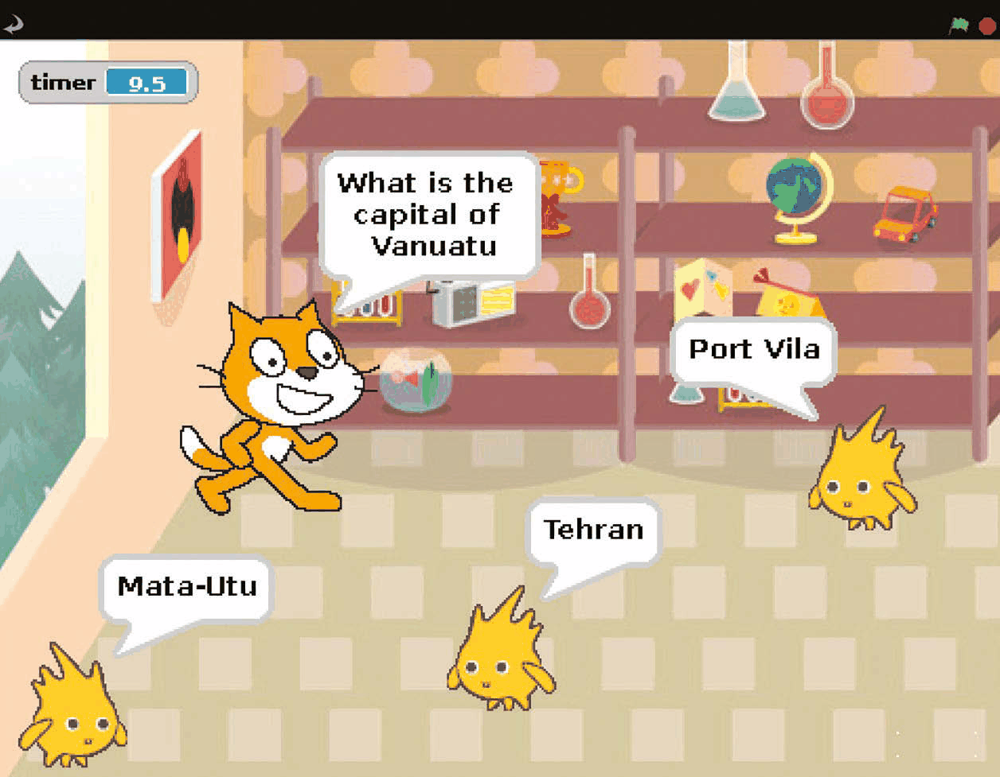
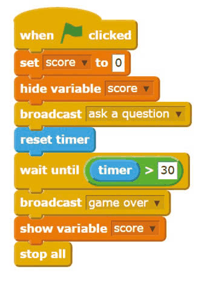
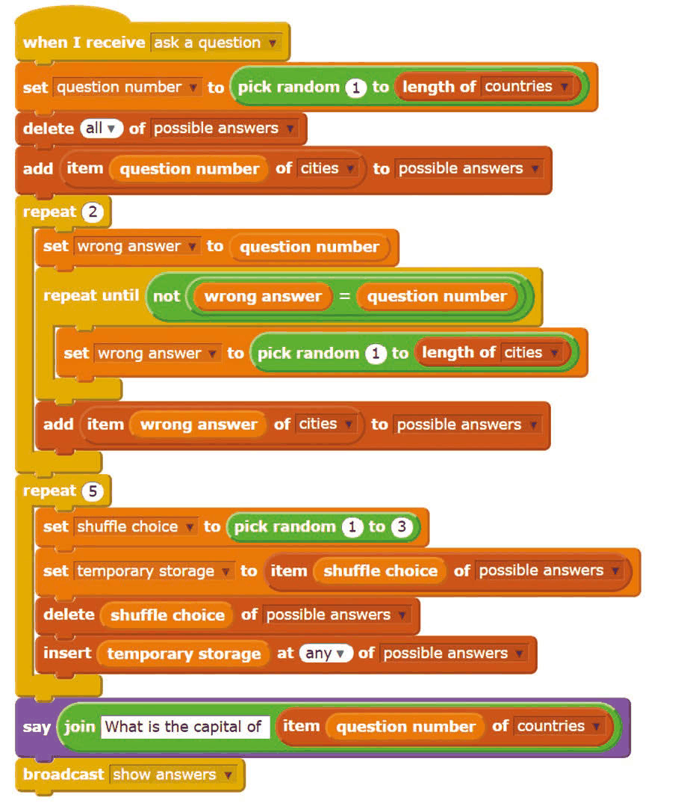
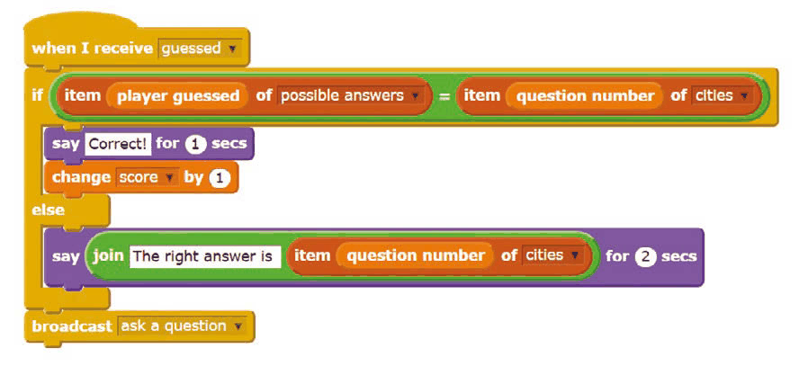
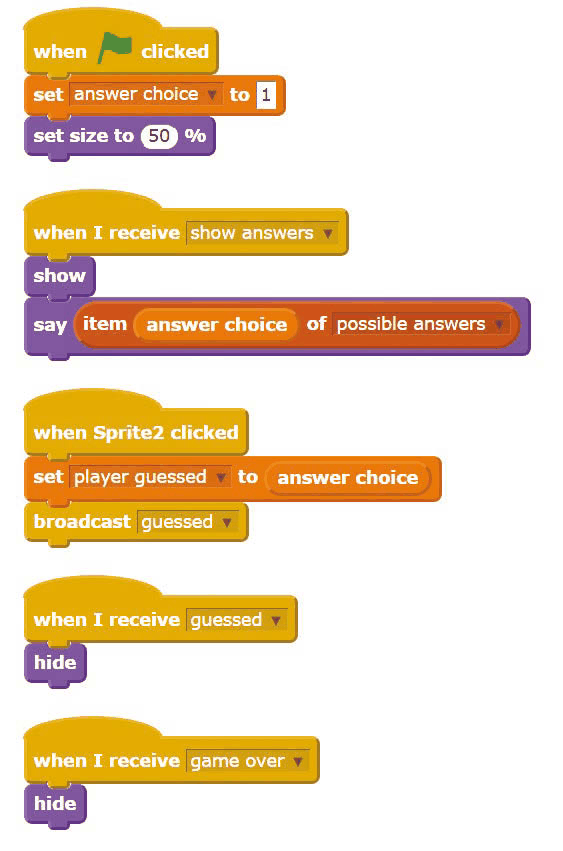

# Capitolul 9 – Quiz cu variante multiple

> *Uimește-ți prietenii cu propriul tău joc de tip quiz, cu sute de întrebări! La câte pot răspunde corect în 30 de secunde?*

Listele sunt folosite pentru a memora multe informații, dar adăugarea elementelor în ele bloc cu bloc poate lua mult timp și mult cod Scratch. În acest proiect vei vedea cum poți importa (adică aduce) liste mari din alte locuri, ca să faci ușor un joc de tip quiz cu sute de întrebări. Când creezi acest joc, poți folosi fundalul și personajele tale preferate, aranjându-le astfel încât să rămână destul loc pentru afișarea răspunsurilor. Poate poți adăuga propria listă de întrebări? Merge orice, atât timp cât fiecare răspuns se potrivește unei singure întrebări.

> **VEI AVEA NEVOIE DE**
> - LibreOffice – dacă nu este instalat, deschide un terminal și tastează `sudo apt-get install libreoffice`
> - lista capitalelor după mărime – [wki.pe/List_of_national_capitals_by_population](https://en.wikipedia.org/wiki/List_of_national_capitals_by_population)
> - acces la internet

- Apasă pentru a răspunde; datele pentru răspunsuri provin dintr-o listă de pe Wikipedia.
- Jocul durează 30 de secunde, apoi se termină.

### Pasul 1 – Adună datele

Pentru acest joc vei avea nevoie de două fișiere text: unul pentru întrebări și unul pentru răspunsuri. Vom face un quiz despre capitale, așa că un fișier va conține o listă de capitale, iar celălalt țările din care fac parte, în aceeași ordine. Începe prin a găsi pe Wikipedia lista capitalelor după populație. Apasă și trage peste tabel pentru a-l selecta, apoi apasă CTRL+C pentru a-l copia. Este mai ușor dacă selectezi de jos în sus. Ai răbdare când ecranul derulează!

> **SFAT**
> Poți folosi la fel de bine un tabel de pe Wikipedia în limba română (de exemplu, lista capitalelor lumii) sau orice alt tabel cu două coloane care se potrivesc una câte una: țări și capitale, animale și hrana lor, cuvinte în engleză și traducerea lor…

### Pasul 2 – Creează fișierele cu întrebări

Pornește LibreOffice Calc și lipește tabelul cu CTRL+V. Apasă OK. S-ar putea să dureze un minut sau două. Apasă deasupra coloanei cu orașe pentru a o selecta. Apasă CTRL+C pentru a copia coloana. Deschide editorul de text Leafpad, care se află în meniul Accessories. Apasă CTRL+V pentru a lipi. Ar trebui să ai acum un fișier text care conține doar capitale, fiecare pe un rând nou. Dacă ai un titlu în partea de sus (cuvântul „Capital”), șterge-l, și șterge și rândurile goale de la sfârșit. Salvează acest fișier cu numele `cities.txt`. Deschide un fișier nou în Leafpad și repetă procesul cu coloana țărilor din LibreOffice Calc. De data aceasta, salvează fișierul Leafpad cu numele `countries.txt`.

### Pasul 3 – Importă datele în Scratch

Pornește Scratch. Apasă pe butonul Variables și creează o listă. Numește-o `cities` și asigură-te că este pentru toate personajele (For all sprites). Când lista goală apare pe Scenă, apasă clic dreapta pe ea și alege import din meniu. Navighează la fișierele pe care tocmai le-ai creat și apasă dublu clic pe fișierul text cu orașe. Lista de pe Scenă se va umple cu orașele din fișierul tău. Repetă procesul pentru a crea o listă numită `countries` și umple-o cu fișierul cu țări. Cele două liste ar trebui să aibă aceeași lungime. Apasă clic dreapta pe casetele listelor de pe Scenă și alege hide (ascunde).

### Pasul 4 – Pregătește variabilele

Din secțiunea Variables a Paletei de blocuri, creează variabilele `question number` (folosită pentru a memora ce pereche întrebare/răspuns punem), `score` (scor), `shuffle choice` și `temporary storage` (folosite pentru amestecarea listei de variante) și `wrong answer` (folosită la crearea listei de variante greșite). Trebuie să creezi și o variabilă numită `player guessed`, pentru a memora ce răspuns alege jucătorul, și o listă numită `possible answers` (răspunsuri posibile). Creează toate aceste variabile și lista „For all sprites”.

### Pasul 5 – Fă codul principal al jocului

Codul principal al jocului folosește trei scripturi (**Listările 1–3**). Adaugă-le pe toate personajului pisică. Jocul folosește mesaje `broadcast` pentru a transmite controlul diferitelor părți ale programului, inclusiv de pe același personaj. Secțiunea „ask a question” (pune o întrebare) alege la întâmplare un număr de întrebare din lista de țări și creează o listă de răspunsuri posibile. Aceasta include răspunsul corect și două răspunsuri greșite, care trebuie să fie diferite de cel corect. Codul amestecă apoi această listă, pentru a pune răspunsurile într-o ordine aleatorie, înainte să folosească un `broadcast` care face personajele-răspuns să apară și să își afișeze răspunsurile.

*Listarea 1 – pornirea jocului și cronometrul de 30 de secunde*

*Listarea 2 – punerea unei întrebări și amestecarea răspunsurilor posibile*

*Listarea 3 – verificarea răspunsului ales de jucător*

### Pasul 6 – Fă personajele-răspuns

Importă un personaj nou pe care îl vei folosi pentru afișarea răspunsului; noi îl folosim pe Gobo. Acest personaj are cinci scripturi scurte (**Listarea 4**). Creează variabila `answer choice`, dar apasă pe butonul care o face „For this sprite only” (doar pentru acest personaj). Dacă jocul arată toate răspunsurile la fel când îl rulezi, probabil ai greșit aici! Când ai terminat acest personaj, apasă clic dreapta pe el și duplică-l de două ori. În copii, schimbă valoarea variabilei `answer choice` de la început în 2 pentru prima și în 3 pentru a doua. Distracție plăcută la quiz!

*Listarea 4 – cele cinci scripturi ale personajului-răspuns*
