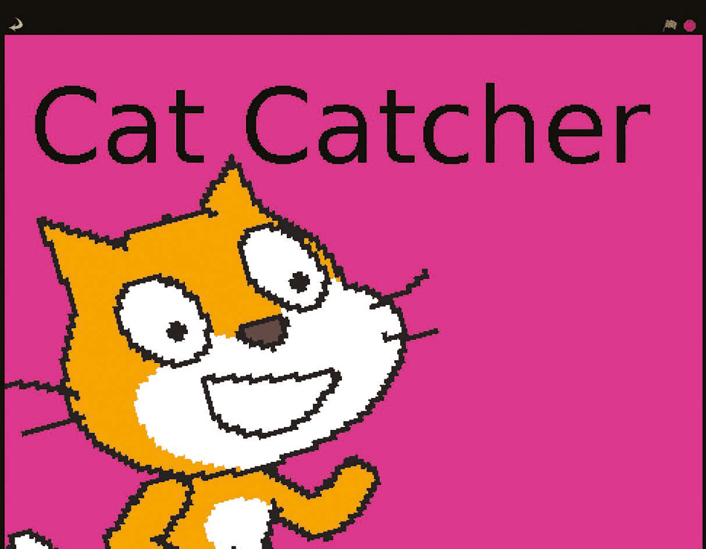
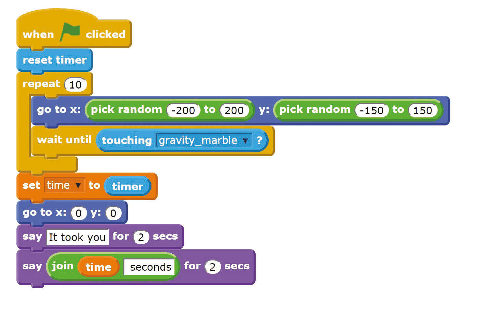
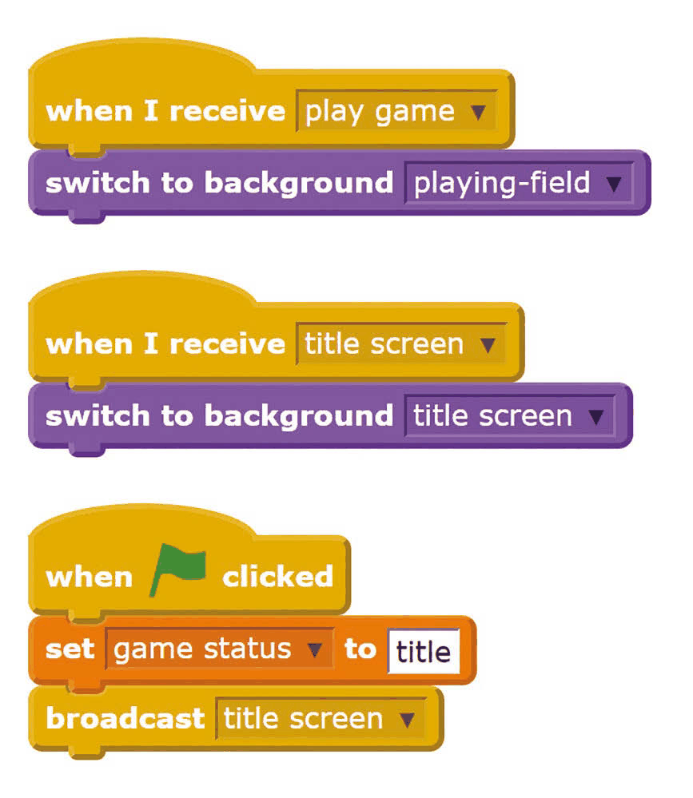
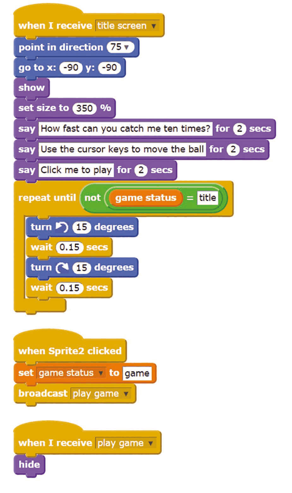
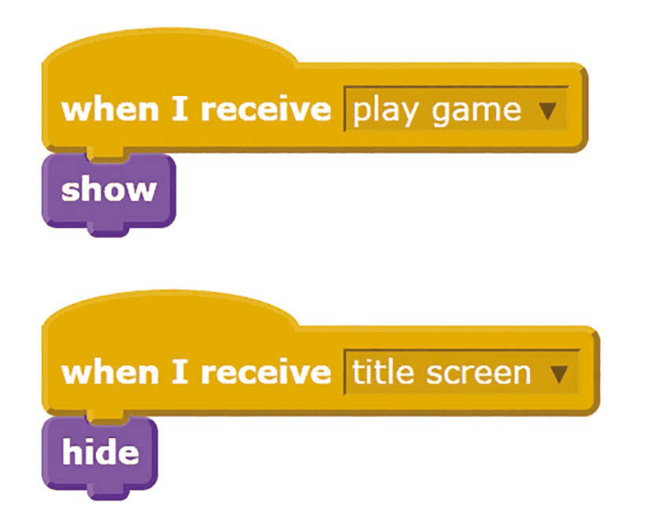

# Capitolul 10 – Adaugă un ecran de titlu

> *Pentru a face un joc cu aspect profesionist, urmează acești pași pentru a adăuga un ecran de titlu cu instrucțiuni și o animație amuzantă*

O carte are o copertă, un film are genericul lui, iar un album are grafica lui. Doar cu prezentarea potrivită aceste lucruri par profesioniste și complete. În același fel, un joc grozav începe cu un ecran de titlu care atrage jucătorii și le oferă instrucțiuni. Este deosebit de important dacă vrei să îți împarți jocul cu alții, pentru că nu vei fi acolo să îl explici când este jucat. În acest capitol vei vedea cum poți adăuga un ecran de titlu unui joc simplu. Aceleași tehnici funcționează pentru majoritatea jocurilor simple, așa că de ce să nu încerci să adaugi un ecran de titlu și jocurilor tale?

- Adaugă un personaj animat pe ecranul de titlu și folosește blocuri `say` pentru a le spune jucătorilor cum funcționează jocul.
- Text negru pe roz aprins: un design de fundal care nu se demodează niciodată!

### Pasul 1 – Scrie-ți jocul

Îți recomandăm să încerci să adaugi un ecran de titlu jocului nostru exemplu, Cat Catcher (Prinde pisica), înainte să adaugi unul propriului tău joc. Pentru a face Cat Catcher, adu mai întâi personajul Gravity Marble din dosarul Things. Acesta vine cu câteva scripturi pentru a-l controla cu tastele săgeți. Adaugă **Listarea 1** personajului pisică. Împreună, cele două personaje formează un joc în care ești provocat să vezi cât de repede poți prinde pisica de zece ori cu bila. Noi am adăugat fundalul playing field (teren de joacă).

*Listarea 1 – jocul Cat Catcher: scriptul pisicii*

### Pasul 2 – Creează fundalul ecranului de titlu

Creează o imagine de fundal nouă, pe care o vei folosi pentru ecranul de titlu al jocului. Al nostru este doar o culoare vie cu titlul jocului pe ea, dar poți face ceva mai elaborat, dacă vrei. Pe fundal, adaugă scripturile din **Listarea 2**. Ele schimbă fundalul între ecranul de titlu și fundalul din joc și le spun tuturor personajelor să intre în modul „title screen” (ecran de titlu) când se apasă steagul verde. În cele din urmă, acesta ar trebui să fie singurul loc în care folosești un script `when green flag clicked`.

*Listarea 2 – scripturile Scenei*

### Pasul 3 – Creează personajul ecranului de titlu

Acesta este personajul care îi va spune jucătorului cum se joacă, și poate fi și animat. Pentru jocul nostru am adus un alt personaj pisică. Adaugă-i **Listarea 3**. Aceasta are trei părți: o parte afișează animația titlului și instrucțiunile; o alta pornește jocul când se apasă pe personaj; iar a treia ascunde personajul când începe jocul. Va trebui să creezi o variabilă numită `game status` (starea jocului), pe care toate personajele o vor folosi pentru a afla dacă jocul rulează sau dacă este afișat ecranul de titlu. Poți adăuga mai multe personaje pe ecranul de titlu. Include scriptul `when I receive play game` din **Listarea 3**, ca să le ascunzi când începe jocul. Folosește un script `when I receive title screen` ca să le afișezi pe ecranul de titlu.

*Listarea 3 – personajul ecranului de titlu*

### Pasul 4 – Înlocuiește scripturile cu steagul verde

Acum trebuie să parcurgi personajele din joc (pisica din joc și bila, în exemplul nostru) și să le schimbi scripturile, ca să nu mai pornească atunci când se apasă steagul verde. Pentru fiecare personaj și pentru fiecare dintre scripturile lui, înlocuiește blocul `when green flag clicked` cu blocul `when I receive play game` (când primesc mesajul „play game”). Adaugă **Listarea 4** personajelor din joc, pentru a le face să se ascundă când este afișat ecranul de titlu și să apară când începe jocul. Dacă un personaj nu ar trebui să fie prezent la începutul jocului, poți renunța la scriptul cu `show`.

*Listarea 4 – personajele din joc apar și dispar*

### Pasul 5 – Înlocuiește buclele forever

Unele dintre personajele din joc pot avea bucle `forever`. Acestea vor continua să ruleze chiar și când este afișat ecranul de titlu și personajul este ascuns. Pentru a evita rezultate nedorite, înlocuiește blocul `forever` de pe personajele din joc cu blocul `forever if`. Dă-i blocului condiția `game status = game`, folosind variabila `game status` și blocul Operator `=`. S-ar putea să ai și evenimente care sunt declanșate, de exemplu la apăsarea unei taste. Ca să le împiedici să funcționeze pe ecranul de titlu, înfășoară un bloc `if` în jurul întregului script de după blocul `when [space] key pressed` și dă-i și lui condiția `game status = game`.

### Pasul 6 – Începe un joc nou

Când jocul se termină, poți afișa din nou ecranul de titlu adăugând un bloc Control `broadcast title screen`. De exemplu, l-ai putea adăuga la sfârșitul **Listării 1** din jocul nostru. Jucătorii pot începe din nou un joc nou de pe ecranul de titlu. Asta îi va ține în joc și îi va încuraja să joace în continuare, până obțin un scor cu care să se poată lăuda! S-ar putea să fie nevoie de câteva alte ajustări pentru jocul tău – fiecare joc e diferit, la urma urmei – dar urmând acești pași ar trebui să poți adăuga un ecran de titlu majorității jocurilor simple, ca să arate mai șlefuite.
