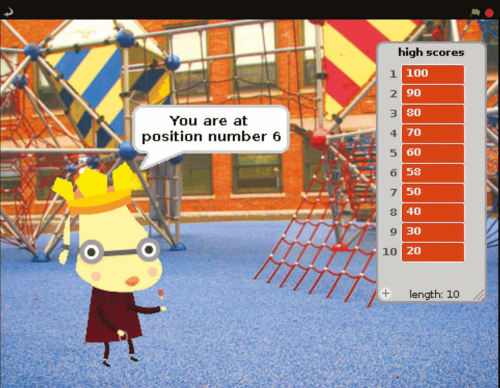
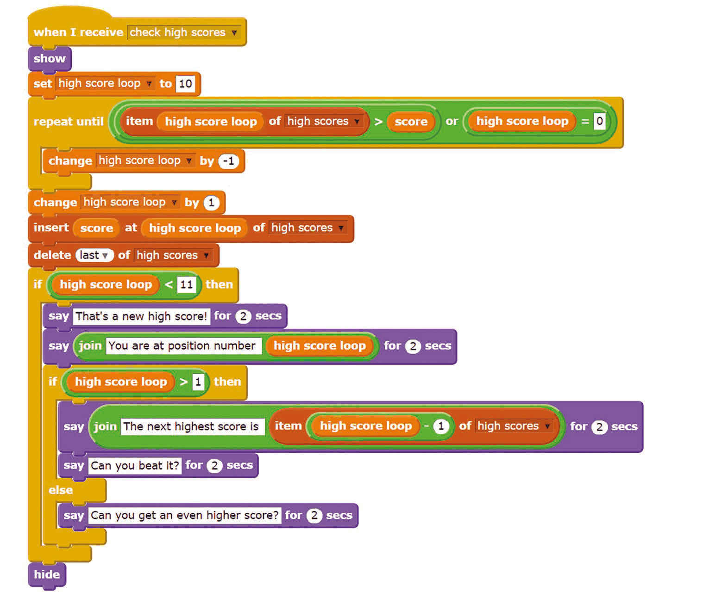
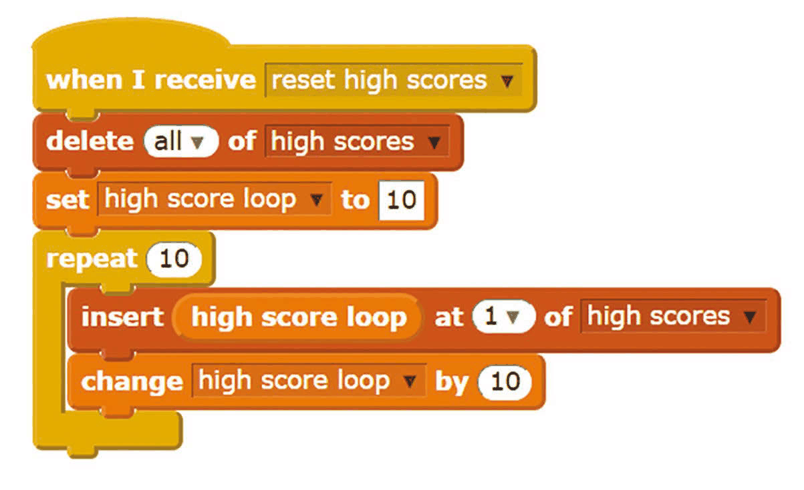

# Capitolul 11 – Adaugă un tabel cu recorduri

> *Fă-i pe jucători să revină păstrând o listă cu cele mai bune scoruri și spunându-le cum se compară cu ele*

Acest proiect conține scripturi care îți permit să creezi un tabel cu recorduri (*high score table*) și apoi să adaugi în el scoruri noi, dacă sunt destul de mari. Nu există o cale ușoară de a afișa și ascunde o listă din interiorul programului, așa că scripturile le spun jucătorilor și pe ce loc s-au clasat și care este următorul scor mai mare, ca să știe cât de aproape au fost să îl depășească. Acest cod va funcționa cu majoritatea jocurilor simple, dar s-ar putea să fie nevoie de câteva modificări dacă jocul tău îi invită pe jucători să joace din nou sau are scripturi care continuă după ce jocul s-a terminat.

- Personajul verifică scorul jucătorului și îi spune cum s-a descurcat.
- Bifează căsuța din Paleta de blocuri pentru a vedea lista și a-i modifica valorile. Fără trișat, te rog!

### Pasul 1 – Fă-ți jocul

Vei avea nevoie de un joc la care să adaugi acest script – fie unul de-al tău, fie unul pe care l-ai programat după o carte sau o revistă. Încearcă să joci jocul de câteva ori, pentru a-ți da seama ce scoruri sunt probabile. Unele jocuri acordă câteva puncte, altele sute, iar altele mii. Numerele de pornire din tabelul tău cu recorduri ar trebui să reprezinte o provocare pentru jucători, dar să nu fie complet imposibil de atins. Fii atent la propriile jocuri: dacă le-ai jucat zile întregi în timp ce le dezvoltai, ele vor fi mult mai ușoare pentru tine decât pentru oricine altcineva.

### Pasul 2 – Adaugă personajul pentru recorduri

Scripturile pentru recorduri pot sta toate pe același personaj. Acest personaj le va spune jucătorilor dacă au obținut un record. Poate fi personajul principal al jocului tău, personajul folosit pe ecranul de titlu (vezi capitolul anterior) sau poate fi un personaj nou. Noi am adăugat personajul **royalperson** pentru tabelul nostru cu recorduri. Îl găsești în dosarul „people”, deși arată ca un câine. Ar sta în cale în timpul jocului, așa că adaugă **Listarea 1** pentru a-l ascunde când se apasă steagul verde.

*Listarea 1 – personajul se ascunde la începutul jocului*

> *Acest cod va funcționa cu majoritatea jocurilor simple, dar s-ar putea să fie nevoie de câteva modificări*

### Pasul 3 – Pregătește lista

Tabelul tău cu recorduri va fi păstrat într-o listă. Apasă pe butonul Variables de deasupra Paletei de blocuri, apasă pe butonul de creare a unei liste și numește-o „high scores”. În Paleta de blocuri poți bifa căsuța de lângă numele listei pentru a afișa sau a ascunde lista pe Scenă. Este un mod la îndemână de a vedea întreaga listă, iar valorile din ea le poți modifica apăsând pe ele și tastând. Lista stă în calea jocului, așa că îți recomandăm să debifezi căsuța.

### Pasul 4 – Setează scorurile de pornire

Poți tasta câteva scoruri de pornire în lista de pe Scenă, dar e mai bine să folosești un script care să genereze recordurile. **Listarea 2** face exact asta. Ea rulează dacă primește mesajul `reset high scores` (resetează recordurile), dar poți și apăsa o dată pe script pentru a-ți reseta scorurile. Pentru a schimba cel mai mic scor, modifică valoarea din blocul `set high score loop`. Pentru a schimba cu cât cresc scorurile, modifică valoarea din blocul `change high score loop`. Notă: blocurile Operators ascuțite apar rotunjite în codul nostru, din cauza limitărilor programului Scratchblocks pe care l-am folosit pentru a așeza codul în această carte.

*Listarea 2 – generarea scorurilor de pornire*

### Pasul 5 – Adaugă codul pentru recorduri

**Listarea 3** verifică scorul și îl adaugă în tabelul cu recorduri, în poziția corectă, dacă este destul de mare. De asemenea, îi spune jucătorului cât de bine s-a descurcat. Adaugă-o personajului tău pentru recorduri. Ai grijă la construirea scriptului care intră în gaura blocului `repeat until`. Va trebui să tragi blocurile într-o ordine asemănătoare cu aceasta: `or`, `>`, `item 1 of high scores`, `high score loop`, `=`, `high score loop`. Când este anunțat următorul scor mai mare, adaugă blocurile în ordinea: `say Hello! for 2 secs`, `join hello world`, `item 1 of high scores`, `-`, `high score loop`.

*Listarea 3 – verificarea scorului și adăugarea lui în tabel*

### Pasul 6 – Introdu-l în jocul tău

Pentru a încheia, conectează scriptul pentru recorduri la jocul tău. Dacă jocul nu folosește deja variabila `score`, apasă pe Variables și creează acea variabilă pentru toate personajele. Vrei ca scriptul pentru recorduri să ruleze când se termină jocul, așa că trebuie să adaugi ceva cod în acel punct al jocului tău. Adaugă un bloc care să seteze `score` la variabila de scor a jocului tău, dacă nu folosești deja variabila `score` în joc. La final, adaugă un bloc `broadcast check high scores` (transmite „verifică recordurile”). Pentru a-ți păstra recordurile, pur și simplu salvează-ți jocul. Când salvezi un program Scratch, valorile listelor – inclusiv tabelul tău cu recorduri, în acest caz – se salvează și ele.
