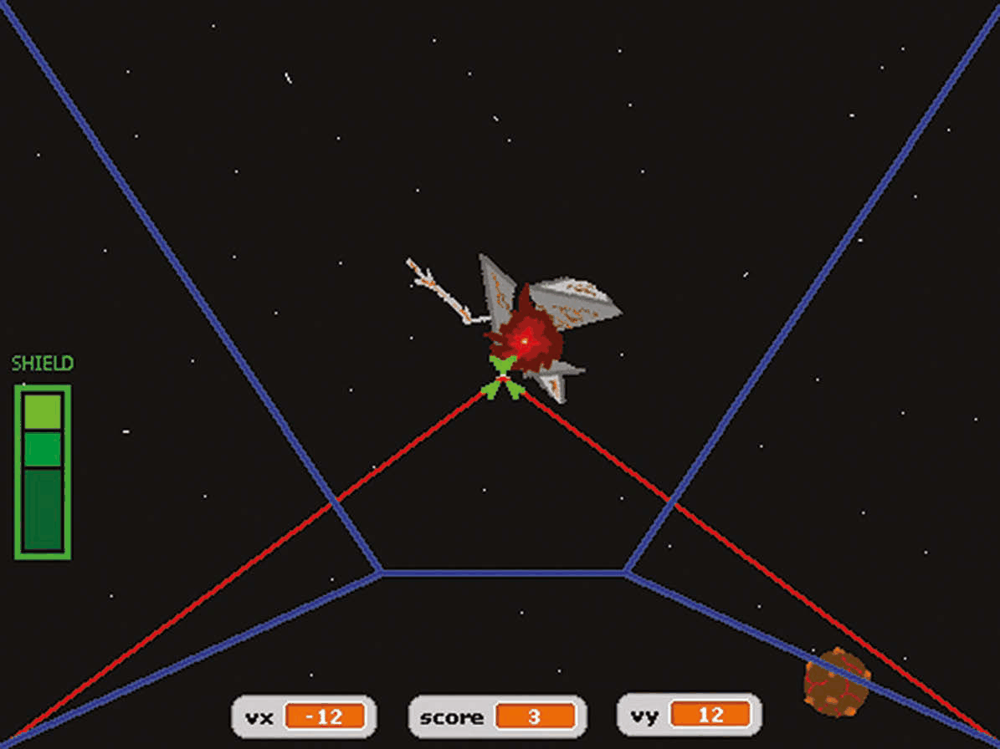
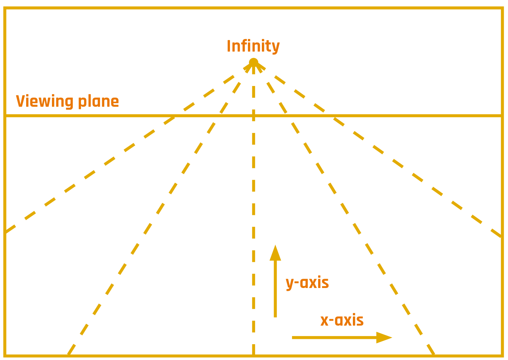
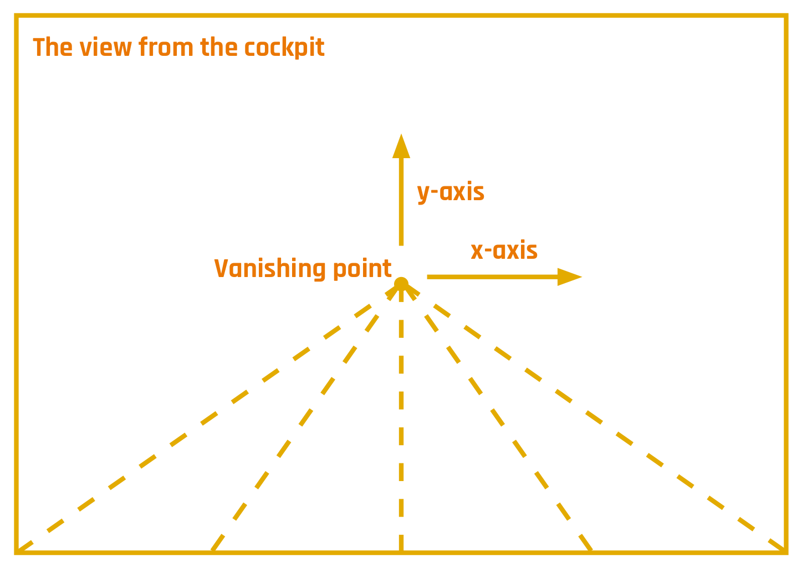
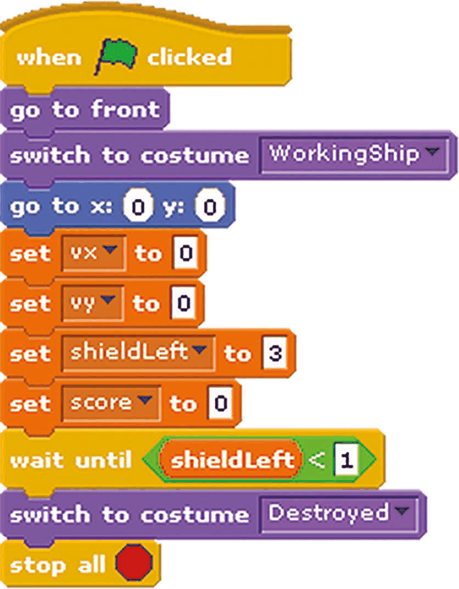
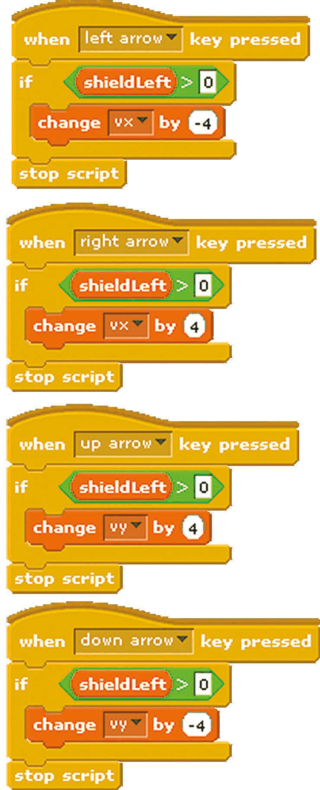
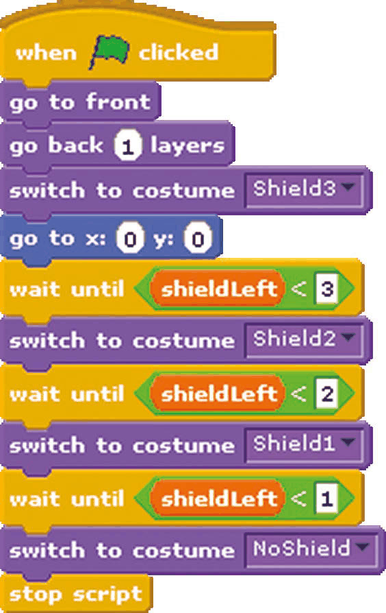
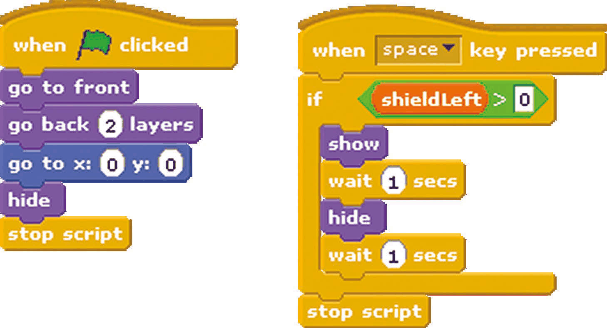
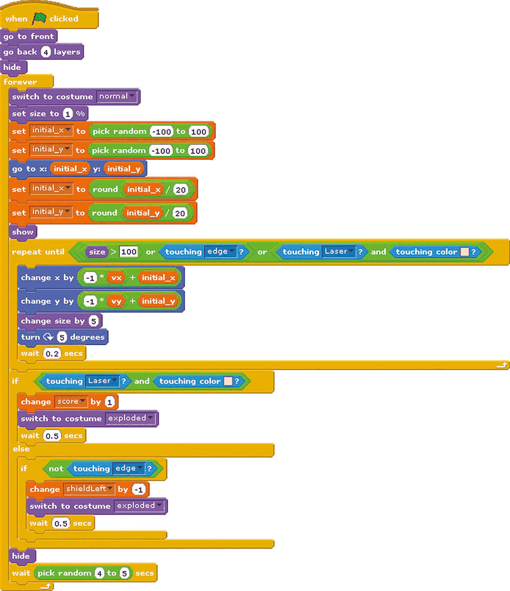
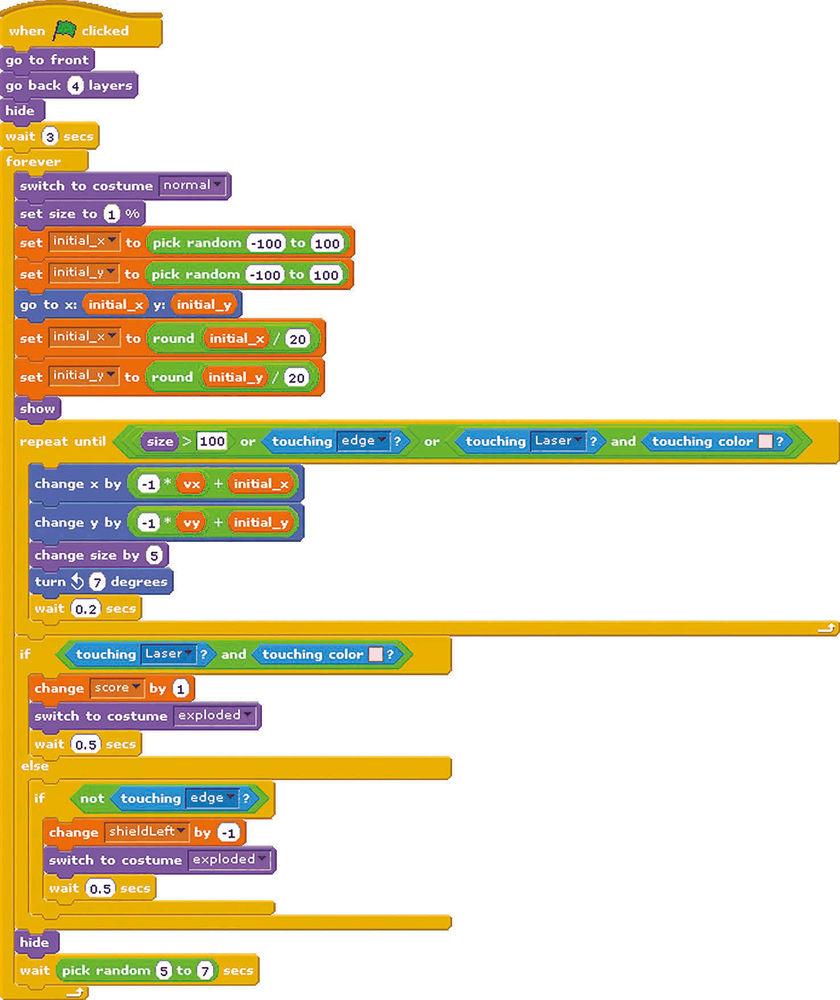

# Capitolul 12 – Construiește un shooter spațial

> *Cum să creezi un impresionant joc spațial 3D de tras la țintă, folosind doar Scratch și câteva tehnici ingenioase de programare…*

Scratch este un limbaj de programare grozav pentru a testa o mulțime de idei. După cum am văzut, programele Scratch presupun de obicei controlarea unuia sau mai multor personaje pe ecran. Jocurile pe calculator în care personajele sunt controlate dintr-o vedere de la distanță sunt jocuri la persoana a treia (*third-person*). Jocurile pot fi însă mai captivante atunci când jucătorul privește prin ochii personajului principal al jocului. Acesta este numit de obicei un joc la persoana întâi (*first-person*).

În acest capitol sunt prezentate câteva dintre principiile construirii unui joc la persoana întâi. Jucătorul este pilotul unei nave spațiale care plutește în derivă printr-un câmp de resturi spațiale. Motorul principal s-a defectat, făcând nava să plutească printre resturi cu viteză constantă. Totuși, nava mai are propulsoare funcționale în partea de sus, de jos, din stânga și din dreapta. Și sistemul principal de lasere este operațional. Eroicul pilot trebuie să își croiască drum trăgând în resturi sau ferindu-se de ele. Se acordă un punct de fiecare dată când un rest spațial este distrus cu laserele navei. Dacă un rest se ciocnește de navă, scutul acesteia este avariat. După ce scutul este complet distrus, nava spațială explodează.

*Apasă tasta spațiu pentru a trage cu laserele navei și a distruge resturile; dacă acestea se ciocnesc de tine, scutul tău (bara verde) se va consuma*

## Perspectiva

În viața reală, obiectele aflate departe par mai mici. Un exemplu sunt șinele de cale ferată. Privind de-a lungul șinelor, în depărtare, acestea par să se apropie una de alta. Același lucru se poate aplica într-un joc pe calculator, în care obiectele trebuie afișate ca fiind în depărtare. Când un obiect se apropie de jucător, el trebuie să devină mai mare pe ecran.

În acest joc se folosește o perspectivă cu un singur punct de fugă. Asta înseamnă că obiectele îndepărtate par să vină din centrul ecranului. În loc să desenăm o mulțime de imagini foarte mici în punctul de fugă, este mai înțelept să presupunem existența unui plan de vizualizare. Planul de vizualizare corespunde distanței la care obiectele devin vizibile. Cele două diagrame de mai jos arată poziția planului de vizualizare și punctul de fugă, așa cum apare el pe ecran. În ilustrația planului de vizualizare, axa z pornește din centrul ecranului direct spre jucător și este perpendiculară pe planul x-y.

*Planul de vizualizare (Viewing plane) și infinitul (Infinity), cu axele x și y*

*Vederea din cabina navei: punctul de fugă (Vanishing point) și axele x și y*

Dacă nava spațială nu are viteză în planul x-y, iar un obiect apare la planul de vizualizare într-o poziție care nu este în centrul ecranului, atunci obiectul pare să aibă o viteză proporțională cu distanța lui față de centrul ecranului. Aceasta nu este o viteză reală, ci efectul perspectivei folosite pentru a reprezenta axa z. Efectul poate fi observat când mergi cu mașina pe un drum drept: un vehicul care se află pe partea cealaltă a drumului, dar foarte departe, pare să se deplaseze spre marginea drumului pe măsură ce se apropie.

## Nava spațială și câmpul de stele

În joc, nava spațială nu poate vira. Deoarece stelele din depărtare se află foarte departe, ele nu ar părea că se mișcă față de navă. Prin urmare, pe fundalul scenei a fost desenat un câmp de stele static.

Cabina navei spațiale și afișajul de bord (*heads-up display*) trebuie să rămână în prim-plan. Acest lucru a fost obținut creând un personaj la fel de mare ca ecranul. Când începe jocul, personajul SpaceShip este setat să fie deasupra celorlalte personaje (**Listarea 1**). Astfel, marginile cabinei sunt afișate în prim-plan.

*Listarea 1 – scriptul principal al personajului SpaceShip*

Componentele orizontală și verticală ale vitezei navei sunt păstrate în variabilele `vx` și `vy`. Acestea au fost create ca variabile globale, deoarece componentele vitezei afectează mișcarea celorlalte personaje de pe ecran. Variabila `shieldLeft` conține numărul de puncte de scut rămase, iar `score` conține scorul jucătorului. Variabila `shieldLeft` a fost creată ca variabilă globală, deoarece celelalte personaje care pot lovi cabina trebuie să îi poată schimba valoarea; și `score` a fost creată ca variabilă globală, pentru că alte personaje trebuie să o poată incrementa. Jocul continuă până când nu mai rămân puncte de scut. Când începe jocul, toate cele patru variabile globale sunt resetate la zero și nava spațială este afișată ca funcționând normal. Dacă nu mai există puncte de scut, nava este afișată ca distrusă, prin schimbarea costumului personajului SpaceShip. Propulsoarele din dreapta, stânga, jos și sus ale navei sunt controlate cu tastele săgeți. Deoarece nava se află în spațiu, nu există frecare care să îi încetinească mișcarea. Prin urmare, pornirea propulsoarelor într-o direcție va acumula viteză în acea direcție. Ca jucătorului să îi fie mai ușor să vadă starea curentă a jocului, valorile variabilelor `vx`, `vy` și `score` au fost alese să fie afișate în partea de jos a ecranului.

*Listarea 2 – propulsoarele, controlate cu tastele săgeți*

## Afișajul scutului

Numărul de puncte de scut rămase este afișat în partea stângă a ecranului. Această imagine este un personaj numit Shield, care are mai multe costume, corespunzătoare diferitelor stări ale scutului. Costumele au fost obținute copiind primul costum și eliminând, la fiecare, încă o căsuță verde.

Când se apasă steagul verde, personajul Shield este setat să fie chiar sub cabina principală, dar deasupra celorlalte personaje (**Listarea 3**). Asta înseamnă că afișajul scutului rămâne în prim-plan. Scriptul personajului Shield așteaptă până când numărul de puncte de scut scade, apoi comută pe costumul potrivit.

*Listarea 3 – scriptul personajului Shield*

## Laserele

Laserele au fost desenate ca un alt personaj. Dimensiunea personajului Laser a fost potrivită cu grijă cu personajul SpaceShip, copiind costumul SpaceShip, pentru a verifica unde vor apărea laserele pe ecran.

Când se apasă steagul verde, personajul Laser este setat să apară chiar sub personajul SpaceShip (**Listarea 4**). Astfel, el este în prim-plan, dar nu la fel de aproape ca cabina. Laserele se trag apăsând tasta spațiu. Ca jocul să fie un pic mai greu, laserele trag timp de o secundă, apoi se reîncarcă o secundă. Asta înseamnă că jucătorul nu ar trebui să țină apăsată tasta spațiu, ci să tragă cu laserele doar când este nevoie. Asemănător scriptului personajului SpaceShip, personajul Laser recunoaște tasta spațiu doar când numărul de puncte de scut este mai mare decât zero.

*Listarea 4 – scripturile personajului Laser*

## Resturile spațiale

Au fost create două tipuri de resturi spațiale: LavaBall (bila de lavă) și Scrap (fierul vechi). Scriptul personajului LavaBall (**Listarea 5**) a fost copiat și modificat puțin pentru personajul Scrap (**Listarea 6**), pentru a împiedica cele două personaje să apară exact în același timp. Cele două personaje au primit și câte două costume, pentru a le arăta în stare normală sau explodate.

Când se apasă steagul verde, LavaBall este plasat sub cabină, sub afișajul scutului și sub lasere, apoi este ascuns. Bucla principală continuă cât timp jocul este în desfășurare. Când personajul SpaceShip comută pe costumul de navă distrusă, el încheie jocul oprind toate scripturile. Asta include și buclele principale ale personajelor-resturi spațiale.

Pentru a arăta că se află în depărtare, LavaBall apare la planul de vizualizare la 1% din mărimea normală. Ca jocul să fie mai interesant, poziția lui de pornire este aleasă la întâmplare în planul x-y. Din cauza perspectivei cu un singur punct de fugă, obiectele mai aproape de marginea ecranului vor dispărea rapid din acel loc. Prin urmare, s-a ales ca obiectele să apară într-un pătrat de 100 pe 100 în jurul centrului ecranului. Poziția inițială a personajului, pe axele x și y, este păstrată în variabilele `initial_x` și `initial_y`. Deoarece aceste variabile sunt necesare doar pentru acest personaj, ele au fost create ca variabile locale, doar pentru acest personaj. Componentele poziției inițiale sunt rescalate pentru a produce un decalaj de viteză aparentă asociat perspectivei. Ele sunt rotunjite la numere întregi, deoarece personajul se mișcă în număr de pixeli. Personajul este apoi afișat pe ecran. Apoi scriptul intră într-o altă buclă, care continuă până când personajul ajunge la mărimea completă, a atins marginea ecranului sau a fost lovit de razele laser. Punctului în care se întâlnesc cele două raze laser i s-a dat o culoare roz, pentru ca această culoare să poată fi folosită la a testa dacă razele laser au lovit LavaBall. Viteza relativă a resturilor pe axa z poate fi crescută mărind valoarea din comanda `change size by 5` (5%) sau reducând durata blocului `wait` din bucla de mișcare.

În acest joc, resturile spațiale se rotesc, dar altfel sunt nemișcate față de restul universului. Nava spațială plutește prin câmpul de resturi cu viteză constantă și începe jocul în repaus în planul x-y. Când sunt pornite propulsoarele navei, aceasta se mișcă în planul x-y față de univers. Totuși, jocul este jucat din punctul de vedere al pilotului, nu din cel al universului sau al resturilor spațiale. Prin urmare, când nava jucătorului se mișcă spre stânga, LavaBall este afișat mișcându-se spre dreapta. Dacă nava se mișcă în jos, LavaBall se mișcă în sus. Acest lucru se poate demonstra privind o cană de pe un birou: dacă persoana care privește cana se mută spre stânga, cana se mută spre dreapta față de linia ei de privire. Mișcarea personajului este, așadar, suma vitezei relative și a vitezei aparente, datorate faptului că obiectul este creat într-un punct al planului de vizualizare care nu se află în centrul ecranului.

Dacă LavaBall a fost lovit de razele laser, scorul crește și costumul este schimbat cu versiunea explodată. Programul așteaptă o jumătate de secundă, ca jucătorul să poată vedea personajul explodat. Dacă LavaBall nu a fost lovit de lasere și nu a atins marginea ecranului, atunci a lovit nava spațială. Dacă LavaBall a lovit nava, numărul de puncte de scut este redus cu unu și costumul LavaBall este schimbat cu versiunea explodată. Dacă LavaBall a ratat nava, atunci dispare fără să facă rău în spatele navei. După aceste condiții logice, personajul LavaBall este ascuns și reapare altundeva pe ecran.

*Listarea 5 – scriptul personajului LavaBall*

*Listarea 6 – scriptul personajului Scrap*

## Posibile extinderi

Jocului i s-ar putea adăuga și alte funcții. Nava ar putea colecta jetoane de scut sau ar putea folosi o rază laser mai lată, ca să distrugă mai multe obiecte deodată. Sau principiile demonstrate în acest program ar putea fi folosite pentru a crea un joc de curse de mașini la persoana întâi.
