# Capitolul 13 – Referință rapidă

> *Ca să îți fie mai ușor la început, iată un ghid la îndemână pentru interfața Scratch, funcționalitatea GPIO și toate blocurile de cod*

## Interfața Scratch

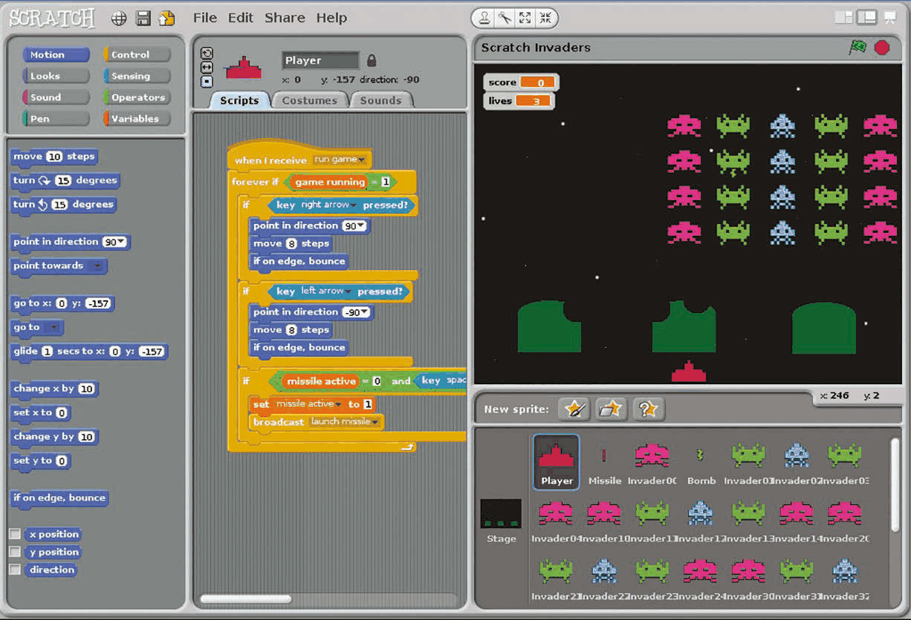

- **Paleta de blocuri (Blocks Palette):** conține blocurile pentru programare, pe care le tragi în Zona de scripturi ca să le adaugi în codul tău. Există opt categorii, colorate diferit și selectate din partea de sus, fiecare oferind o altă selecție de blocuri.
- **Zona de scripturi (Scripts Area):** aici se asamblează scripturile. Poate fi accesată de la personaje sau de la Scenă, selectând fila Scripts. Reține că poți crea mai multe scripturi pentru fiecare personaj. Apasă pe filele de deasupra pentru a trece la costume sau la sunete.
- **Scena (Stage):** aici prind viață creațiile tale Scratch. Personajele plasate aici pot fi redimensionate cu pictogramele de mărire și micșorare de deasupra. Apasă pe steagul verde pentru a porni proiectul și pe cercul roșu pentru a-l opri. Există și pictograme pentru schimbarea modului de afișare, inclusiv modul de prezentare pe tot ecranul.
- **Lista de personaje (Sprite List):** conține miniaturile tuturor personajelor tale. Apasă pe unul pentru a-l selecta și a-i modifica scripturile, costumele și sunetele. Pictogramele de deasupra îți permit să desenezi un personaj nou, să imporți unul sau să alegi unul la întâmplare.

## Formele blocurilor

Blocurile au forme diferite, în funcție de felul în care sunt folosite. Există șase tipuri principale…

| Formă | Descriere |
|---|---|
| 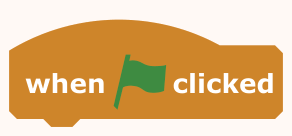 | **Blocurile pălărie (Hat Blocks):** blocurile Control cu care începe fiecare script – când se apasă steagul verde, când se apasă o tastă, când se apasă pe personaj sau când se primește un mesaj. |
|  | **Blocurile stivă (Stack Blocks):** în formă de piese de puzzle, ca să se îmbine sub și deasupra altora, acestea execută comenzile principale din scripturi. |
| 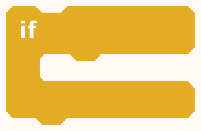 | **Blocurile C (C Blocks):** seamănă, în general, cu litera C; aceste blocuri Control se pot înfășura în jurul altora pentru a crea bucle sau pentru a verifica condiții. |
|  | **Blocurile booleene (Boolean Blocks):** aceste blocuri hexagonale conțin condiții care, atunci când sunt evaluate, raportează valoarea adevărat sau fals. |
| 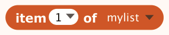 | **Blocurile raportor (Reporter Blocks):** cu margini rotunjite, acestea conțin valori – numere sau șiruri de text. Includ variabilele și listele. |
|  | **Blocurile capac (Cap Blocks):** există doar două, la sfârșitul categoriei Control; sunt folosite pentru a opri un script sau toate scripturile. |

## Scratch GPIO

*Scratch pe Raspberry Pi include acum un server GPIO pentru „physical computing”*

În cea mai nouă versiune de Raspbian Jessie, Scratch include un server GPIO Raspberry Pi, care face mai ușoară comandarea LED-urilor, buzzer-elor, plăcilor HAT și a altor dispozitive și componente conectate. Mai întâi trebuie să pornești serverul, din meniul Edit sau rulând un bloc `broadcast gpioserveron`. Apoi poți folosi blocuri `broadcast` pentru a configura și a comanda pinii GPIO individuali și pentru a folosi modulația în lățime de impuls (PWM) pe pinul 18. Alte funcții includ realizarea unei fotografii cu Modulul Cameră și obținerea orei și a adresei IP. Sunt suportate și anumite plăci de extensie și HAT-uri pentru Raspberry Pi, configurate prin crearea unei variabile `AddOn` și setarea ei la numele plăcii respective. Pentru detalii complete despre aceasta și despre alte funcții GPIO, vizitează [magpi.cc/1TYX7Jg](https://magpi.cc/1TYX7Jg).

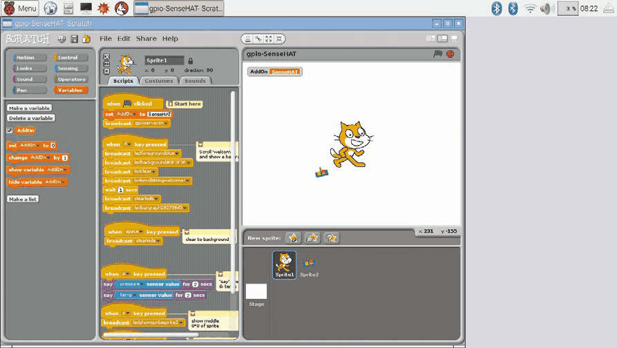

*Folosirea pinilor GPIO ai Raspberry Pi din Scratch*

> **NOTA TRADUCĂTORULUI**
> În Scratch 3 pentru Raspberry Pi OS, aceste mesaje `broadcast` sunt înlocuite de extensiile „Raspberry Pi GPIO” și „Raspberry Pi Simple Electronics”, cu blocuri dedicate.

## Ghidul de referință al blocurilor

Un ghid pentru toate blocurile din fiecare dintre cele opt categorii colorate, cu sfaturi pentru folosirea lor…

### Motion (Mișcare)

Blocurile Motion se ocupă de mișcarea personajelor. Ele se referă în principal la poziția x și y și la direcția personajului.

| Bloc | Ce face |
|---|---|
|  | **move 10 steps** – Mută personajul înainte cu numărul de pași specificat, sau înapoi (cu un număr negativ). Util în orice proiect cu mișcare. |
|  | **turn ↻ 15 degrees** – Rotește personajul în sensul acelor de ceasornic cu numărul de grade specificat. |
|  | **turn ↺ 15 degrees** – Rotește personajul în sens invers acelor de ceasornic cu numărul de grade specificat. |
| 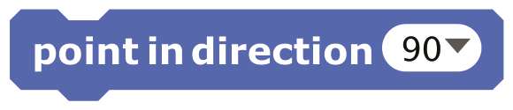 | **point in direction 90** – Îndreaptă personajul în direcția specificată: 0 = sus, 90 = dreapta, 180 = jos, -90 = stânga. Se pot folosi și alte numere. |
| 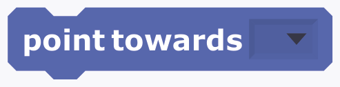 | **point towards** – Îndreaptă personajul spre cursorul mouse-ului sau spre alt personaj. Poate fi folosit pentru a conduce un personaj cu mouse-ul. |
| 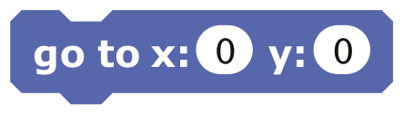 | **go to x: 0 y: 0** – Mută personajul la poziția x și y specificată pe scenă. Util pentru a-i reseta poziția la începutul unui proiect. |
| 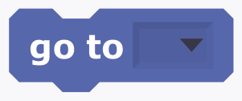 | **go to** – Mută personajul la poziția cursorului mouse-ului sau a altui personaj. Util pentru a ține împreună un grup de personaje. |
| 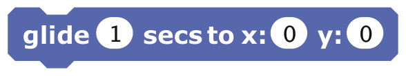 | **glide 1 secs to x: 0 y: 0** – Mută lin personajul la o poziție specificată, într-un interval de timp specificat. Un dezavantaj: pune scriptul pe pauză cât timp personajul alunecă. |
| 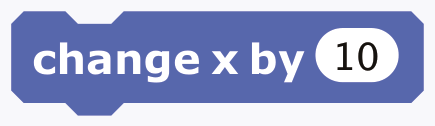 | **change x by 10** – Schimbă poziția x a personajului cu valoarea specificată. Folosit des la comenzile din jocuri. |
| 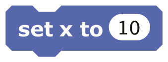 | **set x to 10** – Setează poziția x a personajului la valoarea specificată. Poate fi folosit pentru derulare orizontală. |
|  | **change y by 10** – Schimbă poziția y a personajului cu valoarea specificată. Folosit des la comenzile din jocuri. |
| 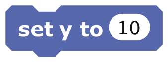 | **set y to 10** – Setează poziția y a personajului la valoarea specificată. Poate fi folosit pentru derulare verticală. |
| 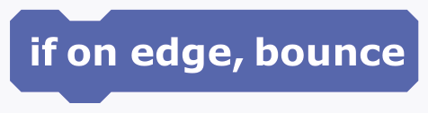 | **if on edge, bounce** – Întoarce personajul în direcția opusă când atinge marginea scenei. Util pentru a-l împiedica să iasă parțial din ecran. |
|  | **x position** – Raportează poziția x a personajului (între -240 și 240). Bifează căsuța pentru a o afișa pe scenă. |
|  | **y position** – Raportează poziția y a personajului (între -180 și 180). Bifează căsuța pentru a o afișa pe scenă. |
|  | **direction** – Raportează direcția personajului: 0 = sus, 90 = dreapta, 180 = jos, -90 = stânga. Bifează căsuța pentru a o afișa pe scenă. |

### Looks (Aspect)

Blocurile Looks sunt folosite pentru a controla aspectul personajelor și al scenei. Printre funcții se numără schimbarea costumelor și aplicarea de efecte grafice.

| Bloc | Ce face |
|---|---|
| 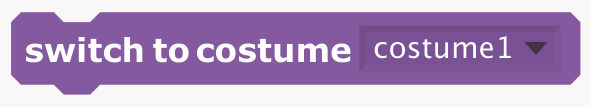 | **switch to costume** – Schimbă aspectul personajului trecând la un alt costum. Util pentru animație. |
|  | **next costume** – Schimbă costumul personajului cu următorul din listă (dacă a ajuns la sfârșit, revine la primul costum). |
| 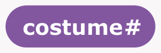 | **costume#** – Raportează numărul costumului curent al personajului. Bifează căsuța pentru a-l afișa pe scenă. |
|  | **say Hello! for 2 secs** – Afișează balonul de vorbire al personajului pentru durata specificată. |
|  | **say Hello!** – Afișează balonul de vorbire al personajului. (Pentru a elimina balonul, rulează acest bloc fără niciun text.) |
|  | **think Hmm... for 2 secs** – Afișează balonul de gândire al personajului pentru durata specificată. |
| 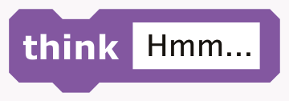 | **think Hmm...** – Afișează balonul de gândire al personajului. (Pentru a elimina balonul, rulează acest bloc fără niciun text.) |
| 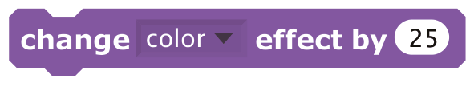 | **change color effect by 25** – Schimbă efectul vizual selectat al personajului cu valoarea specificată. Alege dintre efectele color (culoare), fisheye (ochi de pește), whirl (vârtej), pixelate (pixelare), mosaic (mozaic), brightness (luminozitate) și ghost (fantomă). |
| 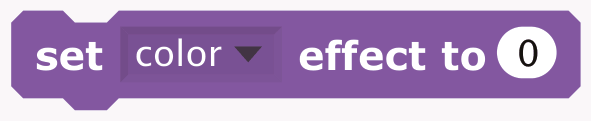 | **set color effect to 0** – Setează efectul vizual selectat la o valoare dată. |
| 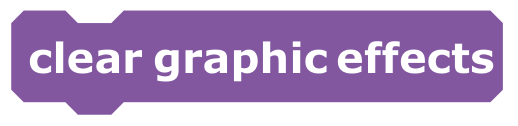 | **clear graphic effects** – Elimină toate efectele grafice ale personajului. |
| 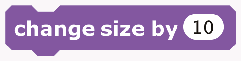 | **change size by 10** – Schimbă mărimea personajului cu valoarea specificată. |
| 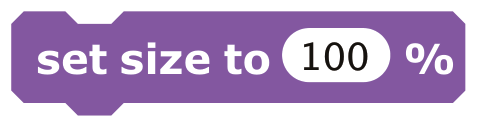 | **set size to 100 %** – Setează mărimea personajului la procentul specificat din mărimea originală. |
| 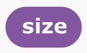 | **size** – Raportează mărimea personajului ca procent din mărimea originală. Bifează căsuța pentru a o afișa pe scenă. |
|  | **show** – Face personajul să apară pe scenă (după ce a fost ascuns). |
|  | **hide** – Face personajul să dispară de pe scenă. (Reține că, atunci când un personaj este ascuns, celelalte personaje nu îl pot detecta cu un bloc `touching?`.) |
|  | **go to front** – Aduce personajul în fața tuturor celorlalte personaje. Dacă este destul de mare, poate acoperi întreaga scenă. |
|  | **go back 1 layers** – Trimite personajul înapoi cu numărul de straturi specificat, ca să poată fi ascuns în spatele altor personaje. |

### Sound (Sunet)

Aceste blocuri se ocupă de redarea diverselor sunete, care pot fi înregistrate sau importate. Sunt disponibile și 128 de instrumente MIDI încorporate.

| Bloc | Ce face |
|---|---|
|  | **play sound meow** – Începe redarea sunetului ales din meniul derulant și trece imediat la blocul următor, chiar dacă sunetul încă se aude. |
|  | **play sound meow until done** – Redă un sunet și așteaptă să se termine înainte de a continua cu blocul următor. |
|  | **stop all sounds** – Oprește redarea tuturor sunetelor. |
|  | **play drum 48 for 0.2 beats** – Redă sunetul de tobă selectat pentru numărul de bătăi (*beats*) specificat. |
|  | **rest for 0.2 beats** – Face o pauză (nu redă nimic) pentru numărul de bătăi specificat. |
|  | **play note 60 for 0.5 beats** – Redă nota muzicală selectată pentru numărul de bătăi specificat. (Săgeata meniului derulant deschide o claviatură de două octave, dar poți introduce direct și numere mai mici sau mai mari.) |
| 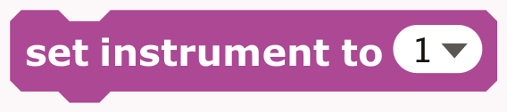 | **set instrument to 1** – Setează instrumentul pe care personajul îl folosește pentru blocurile `play note`. (Fiecare personaj are propriul instrument.) |
| 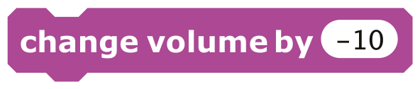 | **change volume by -10** – Schimbă volumul sunetului personajului cu valoarea specificată. Volumul este între 0 și 100. |
|  | **volume** – Raportează volumul sunetului personajului. Bifează căsuța pentru a-l afișa pe scenă. |
| 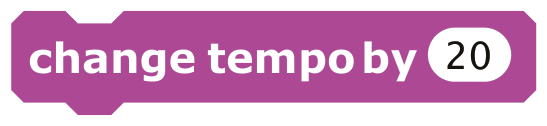 | **change tempo by 20** – Schimbă tempoul personajului cu valoarea specificată (în bătăi pe minut). |
| 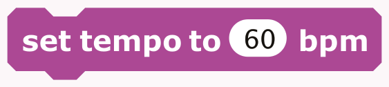 | **set tempo to 60 bpm** – Setează tempoul personajului la valoarea specificată, în bătăi pe minut. |
|  | **tempo** – Raportează tempoul personajului în bătăi pe minut. Bifează căsuța pentru a-l afișa pe scenă. |

### Pen (Creion)

Blocurile Pen permit unui personaj să deseneze linii și forme pe scenă, inclusiv propria imagine „ștampilată”, atunci când se mișcă.

| Bloc | Ce face |
|---|---|
| 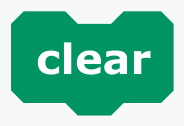 | **clear** – Șterge toate urmele de creion și ștampilele de pe scenă. |
|  | **pen down** – Coboară creionul personajului, astfel că acesta va desena când se mișcă. |
|  | **pen up** – Ridică creionul personajului, astfel că acesta nu va mai desena când se mișcă. |
| 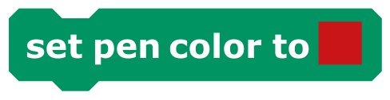 | **set pen color to [culoare]** – Setează culoarea creionului, aleasă din selectorul de culori. Alegerea culorii schimbă și nuanța creionului. |
| 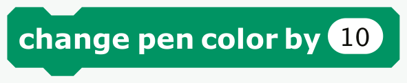 | **change pen color by 10** – Schimbă culoarea creionului cu valoarea specificată. |
| 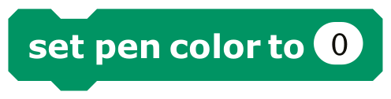 | **set pen color to 0** – Setează culoarea creionului la valoarea specificată (între 0 și 200). |
| 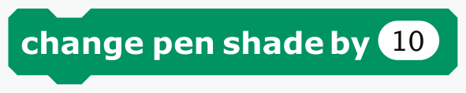 | **change pen shade by 10** – Schimbă nuanța creionului (de la întunecat la deschis) cu valoarea specificată. |
| 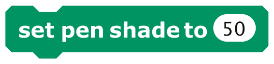 | **set pen shade to 50** – Setează nuanța creionului la valoarea specificată, între 0 (foarte întunecat) și 100 (foarte deschis). Valoarea implicită este 50, dacă nu a fost setată din selectorul de culori. |
| 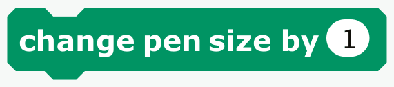 | **change pen size by 1** – Schimbă grosimea liniei creionului. |
| 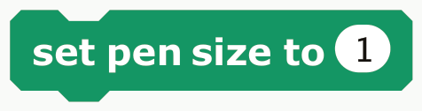 | **set pen size to 1** – Setează grosimea liniei creionului. |
|  | **stamp** – Ștampilează imaginea personajului pe scenă. |

### Control

Blocurile Control oferă funcții pentru repetarea scripturilor și pentru rularea lor doar dacă sunt îndeplinite anumite condiții. Blocul `broadcast` poate fi folosit cu pinii GPIO ai Raspberry Pi.

| Bloc | Ce face |
|---|---|
| 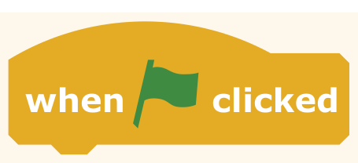 | **when [steag verde] clicked** – Rulează scriptul de dedesubt când se apasă steagul verde pentru a porni proiectul. |
| 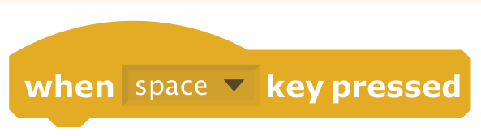 | **when space key pressed** – Rulează scriptul de dedesubt când este apăsată tasta specificată. Util pentru comenzile jucătorului în jocuri. |
| 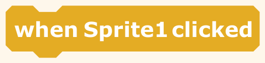 | **when Sprite1 clicked** – Rulează scriptul de dedesubt când se apasă pe personaj. Util pentru butoane și opțiuni de meniu. |
| 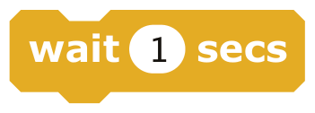 | **wait 1 secs** – Așteaptă numărul de secunde specificat, apoi continuă cu blocul următor. Folosește-l oriunde ai nevoie de o pauză. Nu este la fel de precis ca folosirea cronometrului (`timer`). |
| 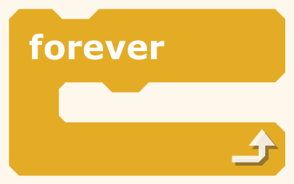 | **forever** – Unul dintre cele mai folosite blocuri: rulează blocurile din interiorul lui iar și iar, într-o buclă fără sfârșit. |
| 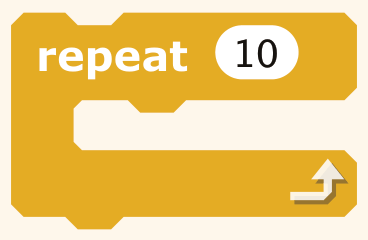 | **repeat 10** – Rulează blocurile din interior de numărul de ori specificat. Folosit des pentru animația și mișcarea personajelor. |
| 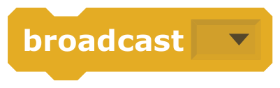 | **broadcast** – Trimite un mesaj tuturor personajelor, apoi continuă cu blocul următor fără să aștepte scripturile declanșate. Poate fi folosit și pentru a configura și comanda pinii GPIO ai Raspberry Pi și pentru a face o fotografie cu Modulul Cameră al Raspberry Pi. |
| 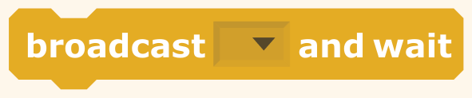 | **broadcast and wait** – Trimite un mesaj tuturor personajelor, declanșându-le să facă ceva, și așteaptă ca toate să termine înainte de a continua cu blocul următor. |
| 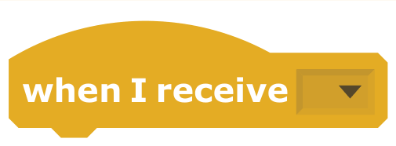 | **when I receive** – Rulează scriptul de dedesubt când primește mesajul specificat. |
| 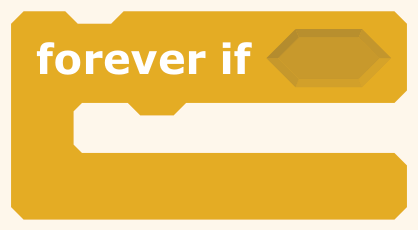 | **forever if** – Echivalentul unui bloc `if` în interiorul unui bloc `forever`. Verifică încontinuu dacă condiția este adevărată; de fiecare dată când este, rulează blocurile din interior. |
| 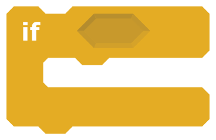 | **if** – Unul dintre cele mai folosite blocuri. Dacă condiția lui este adevărată, rulează blocurile din interior. |
| 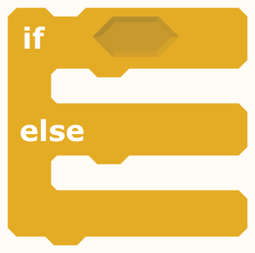 | **if … else** – Dacă condiția este adevărată, rulează blocurile din partea `if`; dacă nu, rulează blocurile din partea `else`. |
| 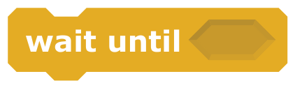 | **wait until** – Așteaptă până când condiția devine adevărată, apoi rulează blocurile de dedesubt. Util pentru a aștepta ca un personaj să ajungă undeva, ca o valoare să depășească un anumit prag sau ca un alt script să răspundă. |
| 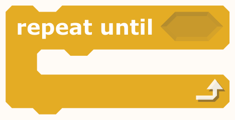 | **repeat until** – Verifică dacă condiția este falsă; dacă da, rulează blocurile din interior și verifică din nou. Când condiția devine adevărată, trece la blocurile care urmează. |
| 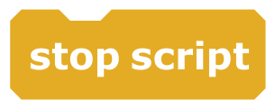 | **stop script** – Oprește scriptul. Util pentru a dezactiva scripturi, care pot fi repornite cu un mesaj `broadcast` sau cu o apăsare de tastă. |
|  | **stop all** – Oprește toate scripturile din toate personajele. Poate fi folosit pentru a încheia sau a pune pe pauză un proiect. |

### Sensing (Detectare)

Blocurile Sensing pot fi folosite pentru a detecta când un personaj atinge alt personaj. Blocul `sensor value` poate fi folosit pentru a citi intrarea unui pin GPIO al Raspberry Pi.

| Bloc | Ce face |
|---|---|
|  | **touching ?** – Raportează adevărat dacă personajul atinge personajul, marginea sau cursorul mouse-ului specificat. Util pentru detectarea coliziunilor în jocuri. |
|  | **touching color ?** – Raportează adevărat dacă personajul atinge culoarea specificată (aleasă cu pipeta). Din nou, util pentru detectarea coliziunilor. |
|  | **color is touching ?** – Raportează adevărat dacă prima culoare (din personaj) atinge a doua culoare (din fundal sau din alt personaj). Ambele culori se aleg cu pipeta. |
|  | **ask and wait** – Pune o întrebare pe ecran și păstrează textul introdus de la tastatură în `answer`. Programul așteaptă până se apasă tasta ENTER sau bifa. |
|  | **answer** – Raportează textul introdus de la tastatură la cea mai recentă folosire a blocului `ask and wait` (comun tuturor personajelor). |
|  | **mouse x** – Raportează poziția x a cursorului mouse-ului. |
|  | **mouse y** – Raportează poziția y a cursorului mouse-ului. |
|  | **mouse down?** – Raportează adevărat dacă butonul mouse-ului este apăsat. |
|  | **key space pressed?** – Raportează adevărat dacă tasta specificată este apăsată. Util pentru controlul obiectelor în mișcare, de exemplu în jocuri. |
|  | **distance to** – Raportează distanța până la personajul specificat sau până la cursorul mouse-ului. Util în proiectele care au nevoie de detectare și mișcare precise. |
|  | **reset timer** – Setează cronometrul la zero. Util când începe un proiect sau un nivel nou al unui joc. |
|  | **timer** – Raportează valoarea cronometrului, în secunde. (Cronometrul rulează tot timpul.) |
|  | **x position of Sprite1** – Raportează o proprietate sau o variabilă a altui personaj. Alege dintre: x position, y position, direction, costume #, size și volume. Ajută la legătura dintre personajele unui proiect. |
|  | **loudness** – Raportează volumul (de la 1 la 100) al sunetelor detectate de microfonul calculatorului. Mai precis decât `loud?`, poate fi folosit pentru a face personajele să reacționeze la un anumit nivel al vocii. |
|  | **loud?** – Raportează adevărat dacă microfonul calculatorului detectează un volum mai mare de 30 (pe o scară de la 1 la 100). |
|  | **slider sensor value** – Raportează valoarea senzorului specificat, cum ar fi unul dintre pinii GPIO ai Raspberry Pi (sau printr-o placă PicoBoard ori LEGO WeDo conectată). |
|  | **sensor button pressed ?** – Raportează adevărat dacă senzorul specificat este apăsat. Se folosește doar cu o placă PicoBoard conectată. |

### Operators (Operatori)

Acestea oferă diverse operații matematice și logice (booleene), împreună cu funcții pentru lucrul cu șiruri de text.

| Bloc | Ce face |
|---|---|
|  | **+** – Adună două numere. |
|  | **-** – Scade al doilea număr din primul. |
|  | ***** – Înmulțește două numere. |
|  | **/** – Împarte primul număr la al doilea. |
|  | **pick random 1 to 10** – Alege un număr întreg aleatoriu din intervalul specificat. |
|  | **<** – Raportează adevărat dacă prima valoare este mai mică decât a doua. |
|  | **=** – Raportează adevărat dacă cele două valori sunt egale. |
| " width="118"> | **>** – Raportează adevărat dacă prima valoare este mai mare decât a doua. |
|  | **and** – Raportează adevărat dacă ambele condiții sunt adevărate. |
|  | **or** – Raportează adevărat dacă oricare dintre condiții este adevărată. |
|  | **not** – Raportează adevărat dacă condiția este falsă și fals dacă condiția este adevărată. |
|  | **join hello world** – Concatenează (unește) cele două șiruri de text. |
|  | **letter 1 of world** – Raportează litera de la poziția specificată dintr-un șir de text. |
|  | **length of world** – Raportează numărul de litere dintr-un șir de text. |
|  | **mod** – Raportează restul împărțirii primului număr la al doilea. |
|  | **round** – Raportează cel mai apropiat număr întreg de un număr. |
|  | **sqrt of 10** – Raportează rezultatul funcției selectate (abs, sqrt, sin, cos, tan, asin, acos, atan, ln, log, e^ sau 10^) aplicate numărului specificat. |

### Variables (Variabile)

Aceste blocuri apar în paletă doar după ce este creată o variabilă nouă (o valoare care se poate schimba) sau o listă (care conține mai multe elemente).

| Bloc | Ce face |
|---|---|
|  | **variable** – Raportează valoarea variabilei. Fiecare variabilă creată are un astfel de bloc. Bifează căsuța pentru a o afișa pe scenă. Crearea unei variabile numite „AddOn” permite folosirea plăcilor de extensie Raspberry Pi (vezi [magpi.cc/1TYX7Jg](https://magpi.cc/1TYX7Jg)). |
|  | **set variable to 0** – Setează variabila la valoarea specificată. Util pentru a o reseta la începutul unui proiect. Poate fi folosit și pentru a seta variabila AddOn, pentru plăci de extensie precum Explorer HAT, Pibrella, PiFace, PiGlow și Sense HAT. |
|  | **change variable by 1** – Schimbă variabila selectată cu valoarea specificată. Folosit, de exemplu, pentru a modifica viteza unui obiect, numărul nivelului sau scorul jocului. |
|  | **show variable** – Afișează pe scenă monitorul variabilei selectate. |
|  | **hide variable** – Ascunde monitorul variabilei selectate, ca să nu fie vizibil pe scenă. |
|  | **mylist** – Raportează toate elementele listei. (Elementele sunt separate prin spații. Totuși, dacă elementele sunt litere sau cifre individuale, spațiile sunt omise.) |
|  | **add thing to mylist** – Adaugă elementul specificat la sfârșitul listei. Elementul poate fi un număr sau un șir de litere și alte caractere. |
|  | **delete 1 of mylist** – Șterge unul sau toate elementele listei. Alegând „last” se șterge ultimul element, iar „all” șterge tot. Ștergerea scade lungimea listei. |
|  | **insert thing at 1 of mylist** – Inserează un element la poziția specificată din listă. Alegând „any” se inserează într-un loc aleatoriu, iar „last” adaugă elementul la sfârșit. Lungimea listei crește cu 1. |
|  | **replace item 1 of mylist with thing** – Înlocuiește un element din listă cu valoarea specificată. Alegând „any” se înlocuiește un element aleatoriu. Lungimea listei nu se schimbă. |
|  | **item 1 of mylist** – Raportează elementul de la poziția specificată din listă. Alegând „any” se raportează un element aleatoriu. |
|  | **length of mylist** – Raportează câte elemente are lista. |
|  | **mylist contains thing** – Raportează adevărat dacă lista conține elementul specificat. Reține că elementul trebuie să se potrivească exact. |
