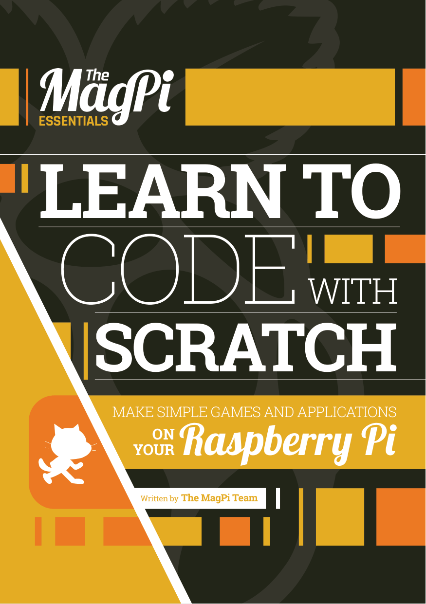

# Învață să programezi cu Scratch
## Autor: Echipa revistei The MagPi (Raspberry Pi Press)
### Traducere și adaptare: Dan Paraschiv

## Despre această carte

Programarea nu trebuie să însemne neapărat să tastezi rând după rând de cod de neînțeles. Creat de cercetătorii de la MIT, **Scratch** îi permite oricui – copii și adulți deopotrivă – să înceapă să programeze în câteva minute, fără cunoștințe anterioare. Pur și simplu tragi diferite blocuri de cod și le îmbini ca pe piesele unui puzzle, pentru a forma scripturi logice, fără să te împiedici de jargon încâlcit și de reguli de sintaxă complicate. Mai mult, Scratch este inclus în sistemul de operare Raspbian al micului calculator Raspberry Pi și poate fi folosit chiar și cu pinii GPIO ai plăcii, pentru a interacționa cu componente electronice și senzori.

În această carte te vom ajuta să începi să programezi cu Scratch, ghidându-te pas cu pas prin crearea a tot felul de proiecte: jocuri, animații, un quiz, circuite electronice și multe altele. Va fi educativ și, în același timp, foarte distractiv. 🎮

Cartea este scrisă pentru **Scratch 1.4**, versiunea inclusă în Raspbian la momentul apariției (2016). Toate proiectele pot fi realizate și cu **Scratch 3**, disponibil gratuit online la [scratch.mit.edu](https://scratch.mit.edu) sau ca aplicație pentru calculator; acolo unde există diferențe importante, ele sunt marcate în text prin casete „Nota traducătorului”. Capitolele 7 și 8 (LED-uri și semafor) necesită un Raspberry Pi și câteva componente electronice ieftine.

## Cuprins

1. [**Capitolul 1**](Capitolul01_Primii_pasi_cu_Scratch.md) - Primii pași cu Scratch – cum te orientezi
2. [**Capitolul 2**](Capitolul02_Ariciul_saltaret.md) - Ariciul săltăreț – primul tău joc
3. [**Capitolul 3**](Capitolul03_Pierduti_in_spatiu.md) - Pierduți în spațiu – creează o animație
4. [**Capitolul 4**](Capitolul04_ChatBot.md) - ChatBot – un personaj interactiv
5. [**Capitolul 5**](Capitolul05_Cursa_cu_barci.md) - Cursa cu bărci – programează un joc arcade
6. [**Capitolul 6**](Capitolul06_Generatorul_de_poezii_al_Adei.md) - Generatorul de poezii al Adei – folosește liste pentru poezii aleatorii
7. [**Capitolul 7**](Capitolul07_Aprinde_un_LED.md) - Aprinde un LED – conectează un LED la pinii GPIO
8. [**Capitolul 8**](Capitolul08_Semafor_cu_LED-uri.md) - Semafor cu LED-uri – construiește o trecere de pietoni
9. [**Capitolul 9**](Capitolul09_Quiz_cu_variante_multiple.md) - Quiz cu variante multiple – creează un joc de întrebări
10. [**Capitolul 10**](Capitolul10_Adauga_un_ecran_de_titlu.md) - Adaugă un ecran de titlu – jocuri cu aspect profesionist
11. [**Capitolul 11**](Capitolul11_Adauga_un_tabel_cu_recorduri.md) - Adaugă un tabel cu recorduri – fă-i pe jucători să revină
12. [**Capitolul 12**](Capitolul12_Construieste_un_shooter_spatial.md) - Construiește un shooter spațial – un impresionant joc 3D
13. [**Capitolul 13**](Capitolul13_Referinta_rapida.md) - Referință rapidă – un ghid la îndemână pentru interfață, GPIO și toate blocurile

Imaginile, capturile de ecran și listările de cod din cartea originală se găsesc în folderul [imagini](imagini/). Cartea originală, în limba engleză, este inclusă în acest folder: [Learn_to_Code_with_Scratch_ORIGINAL.pdf](Learn_to_Code_with_Scratch_ORIGINAL.pdf).

## Cum să folosiți această carte

### Pentru copii (și tineri curioși de orice vârstă)

Această carte a fost scrisă pentru tine – cineva curios, care vrea să înțeleagă cum funcționează jocurile și animațiile de pe calculator și să învețe să le construiască singur. Nu ai nevoie de cunoștințe anterioare de programare. Ai nevoie doar de Scratch (gratuit), de un calculator sau un Raspberry Pi și de dorința de a experimenta.

**Citește capitolele în ordine.** Primul capitol te învață cum este împărțit ecranul Scratch și unde găsești blocurile; fiecare capitol următor folosește ce ai învățat înainte. Proiectele devin treptat mai complexe, de la un joc cu o trambulină până la un joc spațial 3D.

**Construiește scripturile cu mâna ta.** Fiecare proiect are listări de cod sub formă de imagini cu blocuri Scratch. Caută blocurile după culoare în Paleta de blocuri și îmbină-le exact ca în imagine. Dacă ceva nu merge, compară cu atenție scriptul tău cu listarea: un număr greșit sau un bloc pus în afara unei paranteze schimbă complet comportamentul.

**Experimentează.** După ce un proiect funcționează, modifică-l. Schimbă vitezele, culorile, personajele, textele. Secțiunea „Mergi mai departe” de la sfârșitul capitolelor îți dă idei, dar cele mai bune idei vor fi ale tale.

**Nu te grăbi și nu te descuraja.** Unele concepte (variabile, liste, mesaje transmise între personaje) au nevoie de timp să se așeze. Dacă un capitol ți se pare greu, ia o pauză și încearcă din nou.

---

### Pentru părinți

Copilul dumneavoastră nu are nevoie de ajutor tehnic pentru a parcurge această carte – explicațiile sunt pas cu pas, iar fiecare listare de cod este ilustrată. Ceea ce puteți oferi este la fel de valoros: **încurajare și interes**. Rugați-l să vă arate jocul cu barca sau robotul vorbitor, jucați-vă împreună la quiz.

Scratch este gratuit și rulează în browser sau ca aplicație instalată. Pentru capitolele 7 și 8 aveți nevoie de un Raspberry Pi și de câteva componente electronice de bază (LED-uri, rezistoare, un buton, un buzzer, fire), toate sigure, funcționând la tensiuni foarte mici. Supravegheați montajul și respectați sfatul din carte de a opri placa în timpul cablării.

---

### Pentru profesori și educatori

Cartea poate fi folosită ca material pentru un atelier de inițiere în programare sau ca suport pentru orele de informatică și TIC din ciclul primar și gimnazial. Fiecare capitol este un proiect de sine stătător, structurat în șase pași, care se poate parcurge într-o oră sau două. Capitolele 10 și 11 (ecran de titlu, tabel cu recorduri) sunt tehnici care se aplică oricărui joc făcut de elevi, iar capitolul 13 este un ghid de referință pentru toate blocurile, util la orice lecție.

## Convenții folosite în carte

### Listările de cod

Scripturile Scratch apar ca imagini numerotate: **Listarea 1**, **Listarea 2** etc. Numele blocurilor sunt scrise în text cu font de cod, așa cum apar în versiunea în limba engleză a lui Scratch, de exemplu `move 10 steps`, urmate la prima apariție de traducerea în paranteză. Am păstrat numele englezești pentru că ele se regăsesc în imaginile cu cod și pentru că mulți copii folosesc Scratch în engleză; dacă folosești Scratch în limba română, blocurile au aceeași culoare și aceeași formă.

### Pașii

Fiecare proiect este împărțit în pași numerotați (**Pasul 1**, **Pasul 2** …), exact ca în cartea originală.

### Casete informative

> **NOTĂ**
> Informații importante de reținut

> **SFAT**
> Sugestii și idei de adaptare

> **PROVOCARE**
> Idei de extindere a proiectului, pe cont propriu

> **VEI AVEA NEVOIE DE**
> Lista componentelor sau programelor necesare pentru un proiect

> **NOTA TRADUCĂTORULUI**
> Explicații și diferențe față de versiunile actuale de Scratch, adăugate în traducere

## Despre autori

Aceasta este traducerea în limba română a cărții **[Learn to Code with Scratch](https://magazine.raspberrypi.com/books/essentials-scratch-v1)** (colecția *The MagPi Essentials*), scrisă de echipa revistei The MagPi, revista oficială Raspberry Pi, și publicată în 2016 de Raspberry Pi (Trading) Ltd.

- **Redactor-șef:** Russell Barnes
- **Redactor colaborator:** Phil King
- **Redactori:** Lorna Lynch și Laura Clay
- **Contribuitori:** Sean McManus, William Bell și Code Club
- **Design:** Critical Media – Dougal Matthews, Lee Allen, Mike Kay

Traducerea și adaptarea în limba română au fost realizate de Dan Paraschiv, inițiatorul proiectului TechLab Junior. Față de original, traducerea adaugă câteva casete „Nota traducătorului” și „Sfat”, care explică diferențele față de Scratch 3 și sugerează adaptări în limba română.

## Licență

Cartea originală este publicată sub licența **Creative Commons Attribution-NonCommercial-ShareAlike 3.0 Unported (CC BY-NC-SA 3.0)**, iar această traducere este publicată sub aceeași licență.

---

#### Ce înseamnă această licență

Ești liber să:

- **Partajezi** – să copiezi și să redistribui materialul în orice format
- **Adaptezi** – să remixezi, transformi și construiești pe baza materialului

Cu respectarea următoarelor condiții:

| Condiție | Simbol | Ce presupune |
|---|---|---|
| **Atribuire** | BY | Trebuie să acorzi credit autorilor originali (The MagPi / Raspberry Pi Press) și traducerii, să incluzi un link către licență și să indici dacă au fost făcute modificări. |
| **NonComercial** | NC | Nu poți folosi materialul în scopuri comerciale. |
| **Distribuire în condiții identice** | SA | Dacă remixezi, transformi sau construiești pe baza materialului, trebuie să distribui contribuțiile tale sub aceeași licență ca originalul. |

---

#### În limbaj simplu

> **Profesori și educatori** – Puteți distribui capitole elevilor, puteți folosi materialul în clasă și puteți crea fișe de lucru bazate pe această carte, cu condiția să menționați sursa.
>
> **Elevi și părinți** – Puteți copia, printa și partaja cartea cu prietenii și colegii, gratuit.
>
> **Traducători și creatori de conținut** – Puteți traduce sau adapta materialul, dar rezultatul trebuie publicat sub aceeași licență CC BY-NC-SA și trebuie să menționați lucrarea originală.
>
> **Nimeni** nu poate vinde această carte sau derivatele ei.

---

#### Textul complet al licenței

🔗 [https://creativecommons.org/licenses/by-nc-sa/3.0/legalcode](https://creativecommons.org/licenses/by-nc-sa/3.0/legalcode)

Rezumatul licenței, pe înțelesul tuturor:

🔗 [https://creativecommons.org/licenses/by-nc-sa/3.0/](https://creativecommons.org/licenses/by-nc-sa/3.0/)

---

#### Precizare

Această traducere a fost creată cu scopul de a face programarea vizuală cu Scratch accesibilă copiilor din România. Dacă această carte te-a ajutat, cel mai frumos mod de a mulțumi este să o recomanzi altcuiva care ar putea beneficia de ea. Scratch este un proiect al Lifelong Kindergarten Group de la MIT Media Lab – [scratch.mit.edu](https://scratch.mit.edu).

---

*Învață să programezi cu Scratch*
*Traducere și adaptare, 2026*
