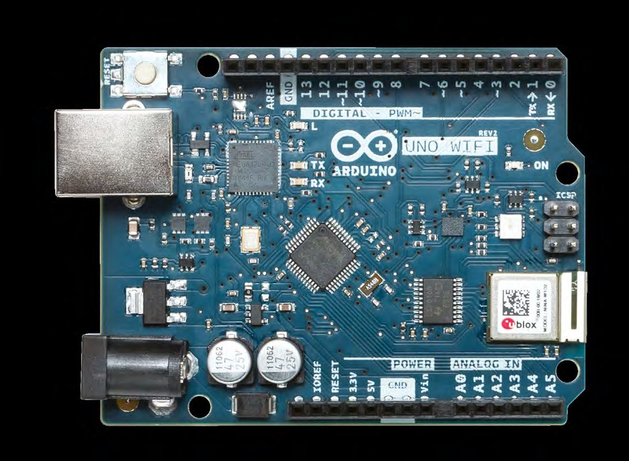
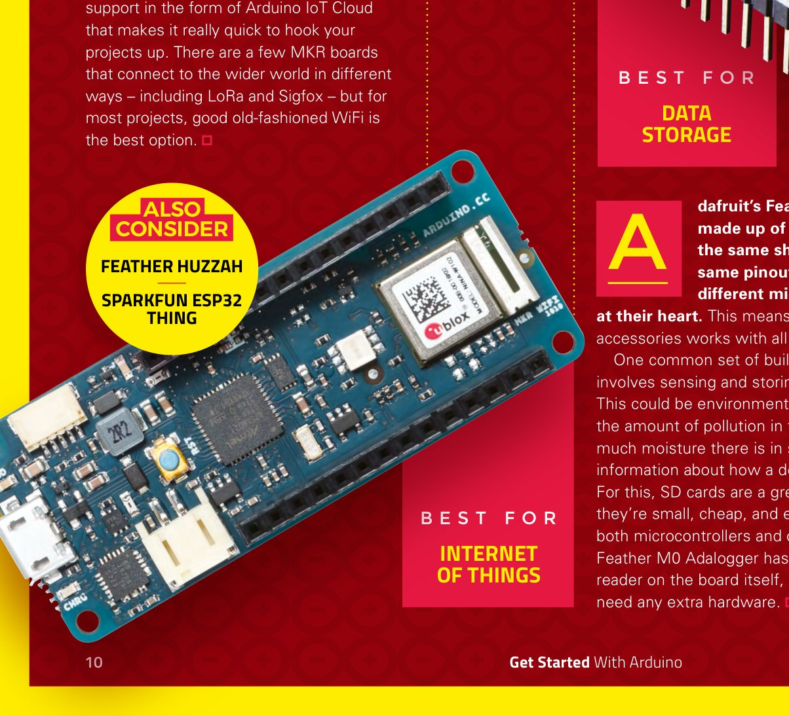
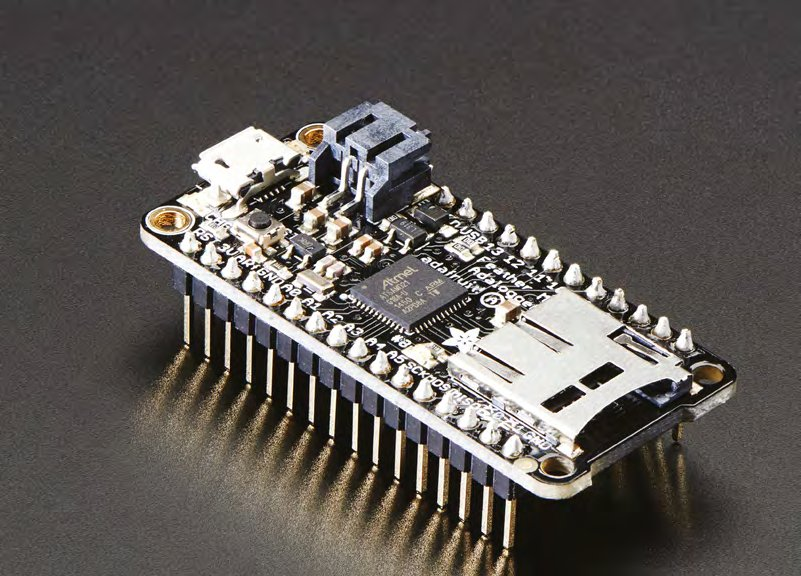
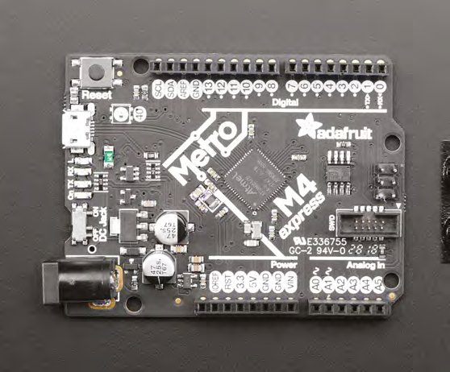
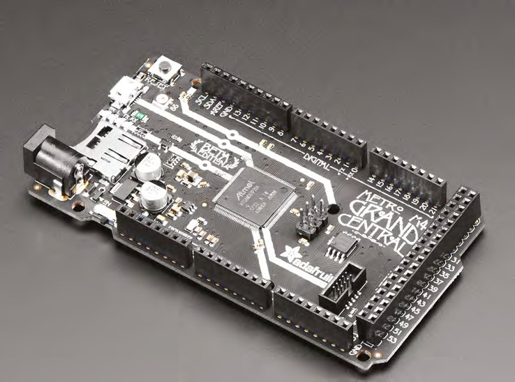
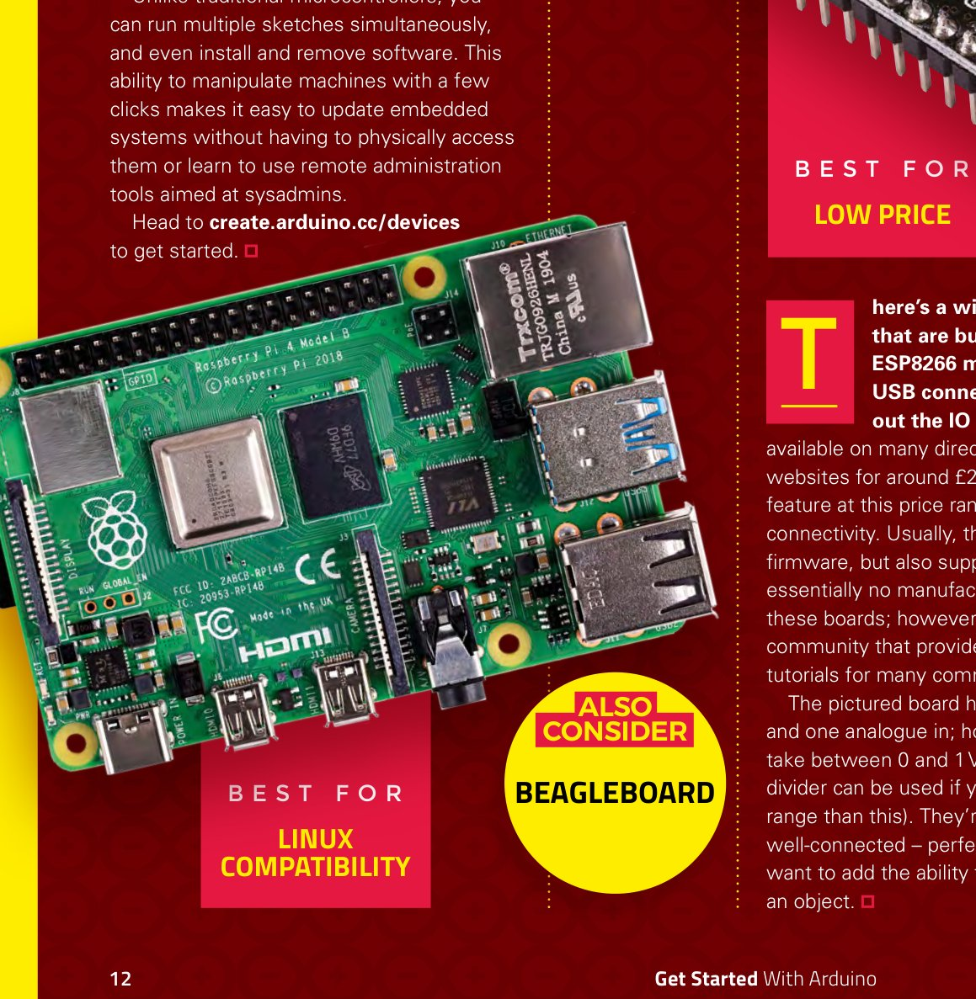
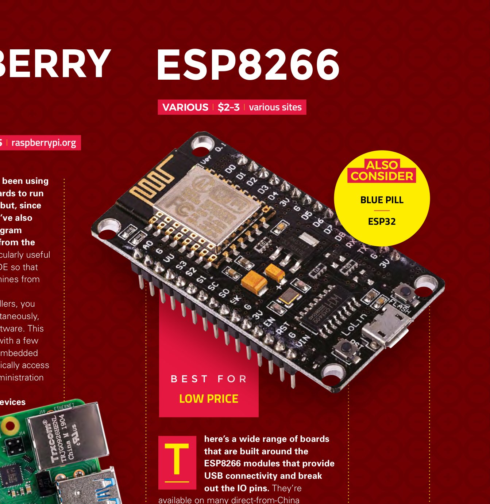
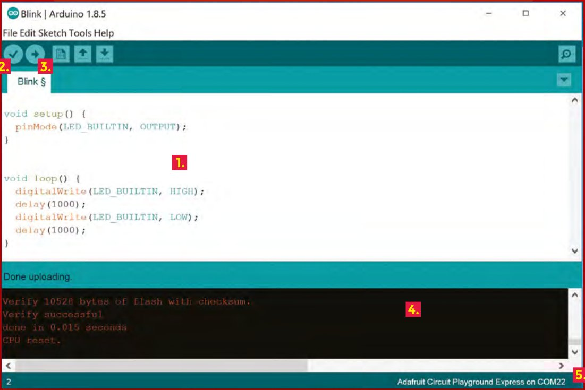
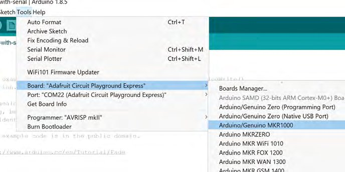
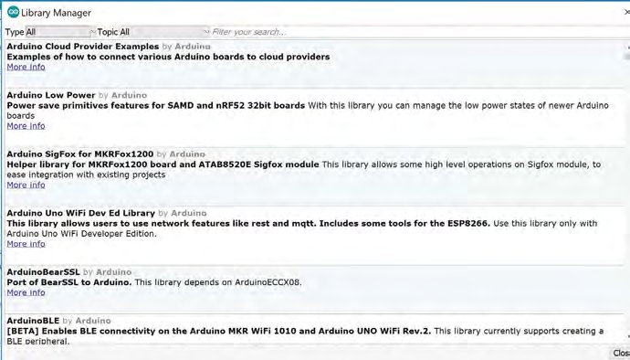

# Capitolul 1 – Ghidul complet Arduino

> *Descoperă plăcile, accesoriile și mediul de programare care fac atât de ușoară crearea proiectelor electronice interactive*

Plăcile Arduino sunt calculatoare reduse la esențial. Au puțin spațiu de stocare, ceva memorie RAM și un procesor, toate înghesuite într-un singur cip. Scrii codul pentru ele pe un calculator obișnuit, desktop sau laptop, apoi îl încarci prin USB ca să ruleze pe placă. Sunt ieftine (de la câțiva euro la câteva zeci de euro), se găsesc peste tot și sunt ușor de folosit.

Deși cuvântul „Arduino” poate însemna strict plăcile proiectate și fabricate de organizația Arduino, există multe alte plăci compatibile Arduino. Ele merg de la plăci aproape identice cu cele oficiale până la plăci complet diferite, dar care pot fi programate tot cu software-ul oficial. Aici ne vom uita la toate plăcile, oficiale și compatibile, pentru că puțini makeri se limitează la un singur tip.

Folosim aceste plăci ca să adăugăm proiectelor noastre niște creiere mici și programabile. Ele pot fi combinate cu LED-uri pentru efecte vizuale, cu difuzoare pentru sunete, cu motoare pentru mișcare și cu o mulțime de senzori care aduc informații de prelucrat. E un clișeu să spui că posibilitățile sunt nelimitate, dar chiar așa e.

Mai mult, plăcile au fost proiectate să fie cât mai ușor de folosit. Mediul de programare ascunde multe dintre complicațiile altor unelte de programare, iar plăcile sunt gândite ca să poți începe fără să știi nimic despre electronică: accesoriile numite *shield*-uri pur și simplu se înfig deasupra.

Acum hai să ne apucăm de treabă și să ne uităm mai atent la hardware.

> **NOTA TRADUCĂTORULUI**
> Cartea a apărut în 2019. Plăcile, prețurile și versiunile de software menționate sunt cele de atunci: între timp au apărut plăci noi (de exemplu Arduino Uno R4 sau Raspberry Pi Pico, care se programează și el din Arduino IDE), iar Arduino IDE a ajuns la versiunea 2. Principiile, codul și proiectele din carte rămân însă valabile.

## Plăcile noastre preferate compatibile Arduino

*Alege cea mai bună placă pentru următorul tău proiect*

Arduino sunt plăcile făcute de compania Arduino LLC. Totuși, pentru că proiectele și software-ul sunt open-source, există un număr mare de plăci „compatibile Arduino”. Cât de compatibile sunt depinde de fiecare placă. Toate pot fi programate din Arduino IDE. Unele sunt și compatibile la nivel de pini cu plăcile Arduino oficiale și pot folosi aceleași accesorii.

Există literalmente sute de plăci compatibile Arduino și nu le putem acoperi pe toate aici, așa că hai să ne uităm la câteva dintre preferatele noastre. Fiecare este specializată pentru un anumit tip de utilizare.

### Arduino Uno WiFi Rev2

**Arduino | 38,90 € | store.arduino.cc**

Uno este de nouă ani placa preferată a începătorilor. Deși a trecut prin câteva revizii în tot acest timp, prima schimbare majoră a venit în 2018, cu Uno WiFi Rev2. Includerea WiFi-ului o face o placă de pornire ideală pentru oricine vrea să facă proiecte conectate la internet.

Poate cel mai atrăgător lucru la această placă este numărul de *shield*-uri (plăci de extensie) create pentru ea de-a lungul anilor. Există sute, poate mii, care fac ușoară adăugarea de funcții noi proiectelor tale. Spre deosebire de multe alte plăci cu același format, Arduino Uno WiFi funcționează la 5 V, deci este garantat compatibilă cu toate shield-urile construite pentru Uno original.

> **Alternative:** Arduino Uno Rev 3

### Arduino MKR WiFi 1010

**Arduino | 27,90 € | store.arduino.cc | Cea mai bună pentru: Internet of Things**

Gama MKR face ușoară construirea de proiecte Internet of Things (IoT) fiabile și de calitate. Fiecare placă include un încărcător de baterie și un element criptografic securizat, pe un PCB robust. Există o gamă de plăci de extensie oficiale proiectate pentru nevoile firmelor mici și mijlocii, inclusiv cu posibilitatea de a se conecta la magistrale CAN și de a comunica prin RS-485.

Pe lângă asta, există suport software suplimentar sub forma Arduino IoT Cloud, care face foarte rapidă conectarea proiectelor. Există câteva plăci MKR care se conectează la lumea largă în feluri diferite, inclusiv LoRa și Sigfox, dar pentru majoritatea proiectelor, bunul și vechiul WiFi este cea mai bună opțiune.

> **Alternative:** Feather Huzzah, SparkFun ESP32 Thing

### Feather M0 Adalogger

**Adafruit | 19,95 $ | adafruit.com | Cea mai bună pentru: stocarea datelor**

Gama Feather de la Adafruit este formată din multe plăci cu aceeași formă și aceiași pini, dar cu microcontrolere diferite în inima lor. Asta înseamnă că un singur set de accesorii funcționează cu toate.

Un tip de proiect pe care îl facem des presupune măsurarea și stocarea informațiilor. Pot fi date despre mediu, cum ar fi cantitatea de poluare din aer sau umiditatea din sol, sau informații despre felul în care este folosit un dispozitiv. Pentru asta, cardurile SD sunt o soluție grozavă: sunt mici, ieftine și ușor de folosit atât cu microcontrolere, cât și cu calculatoare. Feather M0 Adalogger are un cititor de carduri microSD chiar pe placă, așa că nu ai nevoie de niciun hardware suplimentar.

> **Alternative:** Teensy 3.6

### Metro M4 cu ATSAMD51

**Adafruit | 27,50 $ | adafruit.com | Cea mai bună pentru: putere de procesare**

Plăcile Arduino originale foloseau toate microcontrolere AVR. Sunt ușor de folosit, dar le lipsește un pic din forța microcontrolerelor ARM Cortex-M, mai moderne, folosite în multe plăci noi.

Metro M4 Express păstrează formatul tradițional al lui Arduino Uno, dar îi pune un procesor mai puternic. Când vine vorba de putere brută de procesare, Metro M4 Express lasă mult în urmă Arduino Uno și chiar și placa oficială mai rapidă, Arduino Zero. Pe lângă procesorul mai rapid, are și o unitate de calcul în virgulă mobilă, așa că, dacă faci calcule matematice, avantajul este dublu.

Dacă trebuie să prelucrezi multe date, este o alegere excelentă.

> **Alternative:** Teensy 3.6, SparkFun RedBoard Turbo sau Arduino Zero

### Grand Central M4 Express

**Adafruit | 37,50 $ | adafruit.com | Cea mai bună pentru: multe intrări și ieșiri**

Această placă plină de funcții are nu mai puțin de 54 de pini de intrare/ieșire și același procesor fulgerător ca Metro M4 Express. Are același format ca Arduino Mega și Arduino Due, așa că există deja o gamă de accesorii disponibile, deși placa este nou-nouță.

Deși este o placă destul de mare, sunt șanse bune ca, dacă ai nevoie de atât de multe intrări și ieșiri, să lucrezi la un proiect mare. Fie că e vorba de controlul multor lumini, al multor motoare sau de citirea multor senzori, când avem nevoie de multe intrări și ieșiri, Grand Central este acum placa noastră preferată.

> **Alternative:** Teensy 3.6

### Raspberry Pi 4

**Raspberry Pi | 35–55 $ | raspberrypi.org | Cea mai bună pentru: compatibilitate cu Linux**

Mulți oameni folosesc plăci Raspberry Pi ca să ruleze Arduino IDE, dar, din martie 2018, poți programa dispozitivele Raspberry Pi direct din software-ul Arduino. E deosebit de util pentru că se leagă de IDE-ul din cloud, astfel încât îți poți controla mașinile Linux de oriunde de pe web.

Spre deosebire de microcontrolerele tradiționale, poți rula mai multe sketch-uri simultan și poți chiar instala și dezinstala software. Această posibilitate de a manipula mașinile cu câteva clicuri face ușoară actualizarea sistemelor embedded fără să ai acces fizic la ele și fără să înveți uneltele de administrare la distanță gândite pentru administratorii de sistem.

Mergi la [create.arduino.cc/devices](https://create.arduino.cc/devices) pentru a începe.

> **Alternative:** BeagleBoard

### ESP8266

**Diverși producători | 2–3 $ | diverse site-uri | Cea mai bună pentru: preț mic**

Există o gamă largă de plăci construite în jurul modulelor ESP8266, care oferă conectivitate USB și scot pinii de intrare/ieșire la exterior. Se găsesc pe multe site-uri care livrează direct din China, la circa 2 £ bucata. Trăsătura care iese în evidență la acest preț este conectivitatea WiFi. De obicei vin cu un firmware Lua, dar suportă și Arduino. Practic nu există suport din partea producătorului pentru aceste plăci; în schimb, există o comunitate activă care oferă biblioteci și tutoriale pentru multe utilizări obișnuite.

Placa din imagine are nouă pini GPIO de 3,3 V și o intrare analogică; aceasta acceptă însă doar tensiuni între 0 și 1 V (dacă ai un interval mai mare, poți folosi un simplu divizor de tensiune). Sunt mici, ieftine și bine conectate: perfecte când vrei doar să adaugi posibilitatea de a controla un obiect de la distanță.

> **Alternative:** Blue Pill, ESP32

## Top 10 accesorii

Tradițional, accesoriile Arduino se numesc *shield*-uri și au fost proiectate să se înfigă direct în pinii plăcilor cu format Arduino. Totuși, cum plăcile compatibile Arduino vin acum în multe forme și mărimi, nu putem fi atât de restrictivi. Aici am inclus orice hardware care poate funcționa ușor cu plăcile compatibile Arduino, indiferent de format.

Există atât de multe accesorii Arduino încât e imposibil să alegi unul ca fiind „cel mai bun”. Depinde de formatul plăcii tale, de cerințele de alimentare și de funcțiile de care ai nevoie în proiect. Iată zece dintre preferatele noastre, dar mai sunt sute de altele cu care poți face proiecte grozave.

1. **NeoPixels.** Întindem definiția de accesoriu Arduino aproape la limită ca să le includem, dar sunt ușor de folosit cu Arduino și au biblioteci care merg cu majoritatea plăcilor, iar asta ne ajunge. Trebuie să fii un pic atent la tensiunile de alimentare dacă folosești o placă de 3 V, dar cu puțină grijă poți face ca toată lumea ta să clipească în culori diferite.
2. **Core Memory Shield.** În zorii calculatoarelor, memoria RAM era făcută din inele de material magnetic. Prin aceste inele treceau fire, iar impulsurile electrice prin fire puteau induce și citi magnetismul. Așa se puteau stoca mici cantități de date. Deși avem acum forme de memorie mult mai rapide, mai mici și mai ieftine, tot te poți juca cu memoria cu ferite de modă veche folosind acest shield Arduino, de la [hsmag.cc/pzKiKq](https://hsmag.cc/pzKiKq).
3. **Grove Base Shield.** Acesta este un meta-shield. Nu are hardware propriu, dar îți dă posibilitatea să adaugi ușor hardware unei plăci Arduino Uno (sau compatibile). Are 16 porturi care scot intrările analogice, conexiunile UART, intrările/ieșirile digitale și I2C în „conectori Grove”. Există o gamă de hardware compatibil Grove care se poate conecta apoi la el. E mai ușor să construiești așa decât cu o stivă tot mai mare de shield-uri și mai robust decât cu un breadboard.
4. **CRICKIT.** Acest accesoriu este disponibil pentru mai multe plăci compatibile Arduino, inclusiv gama Feather de la Adafruit, Circuit Playground Express, micro:bit și Raspberry Pi. Adaugă o grămadă de opțiuni de intrare și ieșire, printre care un driver NeoPixel, senzori tactili, drivere de motoare, controlere de servomotoare și ieșiri de curent mare. E o placă bună de avut la îndemână, pentru că e utilă în atât de multe proiecte.
5. **OpenLog.** Dacă ai folosit Arduino, unul dintre primele lucruri pe care le-ai învățat (după ce ai făcut un LED să clipească) a fost probabil trimiterea datelor către monitorul serial. E o cale grozavă de a duce datele de pe Arduino în calculatorul la care e conectat. Dar dacă Arduino nu e conectat la un calculator? OpenLog stochează mesajele seriale pe un card SD, ca să poți înregistra datele ca de obicei și să te întorci mai târziu după ele.
6. **Adafruit Ultimate GPS FeatherWing.** GPS-ul este cu adevărat una dintre minunile lumii moderne. Îl luăm acum de bun, dar posibilitatea de a-ți ști poziția cu o precizie de câțiva metri oriunde în lume, sau de a-ți afla exact viteza, este miraculoasă. Acest FeatherWing include un receptor GPS, un ceas de timp real și o baterie de rezervă, ceea ce îl face ușor de folosit cu oricare placă din gama Feather. Există accesorii asemănătoare și pentru alte formate.
7. **MKR Motor Carrier.** Controlul mișcării cu ajutorul electronicii este o artă. La nivelul cel mai simplu, e vorba doar de un mic motor de curent continuu, dar pe măsură ce ai nevoie de mai multă putere sau precizie, trebuie să iei în calcul mai mulți factori. MKR Motor Carrier de la Arduino adaugă oricărei plăci MKR posibilitatea de a controla patru motoare (două cu encodere) și patru servomotoare. Are și un încărcător pentru baterii LiPo 2S și 3S, care ar trebui să îți țină motoarele în funcțiune când nu ești lângă o priză.
8. **Shield de protoboard.** Dacă îți proiectezi propriul hardware, probabil ai început cu un breadboard. Acesta face prototiparea foarte ușoară, dar nu e deloc permanent. O opțiune e să proiectezi un PCB, dar dacă e un proiect unicat cu hardware simplu, poate fi mult mai rapid să îl lipești pe o placă de protoboard. O găsești în forma potrivită ca să se înfigă direct în cele mai populare formate de plăci compatibile Arduino. Există câteva formate diferite; în carte apare protoboard-ul oficial Arduino pentru formatul Mega.
9. **Drivere pentru tuburi Nixie.** Tuburile Nixie sunt afișaje numerice superbe, din vremurile dinaintea LED-urilor. Aplică destui volți pe pinii potriviți și ești răsplătit cu o cifră care strălucește în portocaliu-roșcat. Pot fi cam greu de comandat de pe Arduino, pentru că au nevoie de câteva sute de volți. Placa exixe împachetează tot ce ai nevoie și te lasă să le controlezi prin SPI. Există chiar și o bibliotecă Arduino care ia din bătaia de cap a folosirii acestor afișaje retro. O găsești la [hsmag.cc/xtdbjd](https://hsmag.cc/xtdbjd).
10. **Imprimanta 3D.** Multe imprimante 3D sunt construite pe sisteme compatibile Arduino. Popularul firmware Marlin este proiectat să ruleze pe Arduino Mega 2560 și pe placa de extensie RAMPS 1.4. Multe imprimante 3D folosesc alt hardware, dar totul e construit pe această platformă compatibilă Arduino, inclusiv Anet A8. Într-un fel, toate aceste imprimante 3D nu sunt decât niște accesorii Arduino.

## Arduino IDE

*Hai să ne pregătim de programare*

*Figura 1 – Interfața principală*

1. Zona principală de cod
2. Butonul pentru compilarea codului, fără a-l încărca pe placă
3. Butonul pentru încărcarea codului pe placă (și compilarea lui, dacă au fost făcute modificări)
4. Ieșirea compilatorului și a programului de încărcare
5. Detalii despre placa conectată în acest moment

Pentru mulți oameni, Arduino IDE este locul în care se întâmplă programarea hardware-ului. După standardele mediilor de dezvoltare, este un program destul de simplu, dar face bine lucrurile de bază: are evidențierea sintaxei, file pentru mai multe fișiere și posibilitatea de a gestiona opțiunile de compilare și de hardware. Hai să aruncăm o privire la funcțiile principale.

**Figura 1** arată interfața principală, cu un program (numit „sketch” în limbajul Arduino) care aprinde și stinge LED-ul încorporat la fiecare secundă. Există două funcții: una numită `setup`, care rulează când placa este pornită (sau resetată), și una numită `loop`, care rulează în mod repetat. Aceasta este organizarea de bază a oricărui sketch Arduino.

Poate cea mai bună trăsătură a Arduino IDE este capacitatea de a suporta o gamă uriașă de hardware diferit. Tot acest hardware are nevoie de opțiuni diferite pentru software-ul care compilează și împachetează codul, așa că trebuie să te asiguri că software-ul știe ce hardware folosești. Poți selecta opțiunea corectă din Tools > Boards (vezi **Figura 2**). Dacă hardware-ul tău nu apare acolo, poți adăuga mai multe plăci prin URL-uri (obține URL-ul corect de la furnizorul hardware-ului) în File > Preferences > Additional Board Manager URLs.

*Figura 2 – Pe lângă alegerea plăcii corecte, va trebui să alegi și portul potrivit. Opțiunile le vezi în Tools > Port*

Bibliotecile sunt bucăți de cod împachetate, ușor de refolosit. Există sute de biblioteci pentru Arduino, majoritatea dându-ți posibilitatea să controlezi hardware-ul fără să te împotmolești în detaliile felului în care funcționează. Managerul de biblioteci (din Sketch > Include a Library > Manage Libraries) îți permite să instalezi și să folosești ușor aceste biblioteci (**Figura 3**). Multe instalează și sketch-uri exemplu (în File > Examples), care îți dau ocazia să vezi cum se folosesc.

*Figura 3 – Înainte să te arunci într-un cod complicat, merită întotdeauna să te întrebi dacă nu există o bibliotecă care să îți ușureze viața*

Una dintre problemele programării embedded este că poate fi greu să vezi ce se întâmplă. Monitorul serial ne oferă o soluție. Este un mod de a împinge date prin conexiunea USB dintre calculator și placă. Folosind comanda `Serial.println()` (vei avea nevoie și de `Serial.begin(9600)` sau ceva asemănător în funcția `setup()`), poți trimite date de pe placă spre calculator și le poți afișa cu monitorul serial, pentru text (în Tools > Serial Monitor), sau cu plotter-ul serial, pentru numere (în Tools > Serial Plotter). Poți trimite date și în direcția opusă, dacă trebuie să îți controlezi hardware-ul de pe calculator.

> **LIMBAJUL DE PROGRAMARE**
> Arduino IDE folosește un limbaj bazat pe C++. Dacă ai programat înainte în orice limbaj asemănător, aruncă o privire la sketch-urile exemplu incluse în Arduino IDE. Sunt bine comentate și te duc de la bază în sus. Există și o mulțime de resurse grozave care te ajută să începi de la orice nivel de experiență în programare (inclusiv zero). Excelenta serie de tutoriale în zece părți a lui Graham Morrison se găsește chiar în această carte, începând cu capitolul 4.
