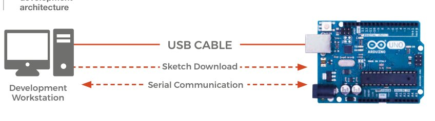
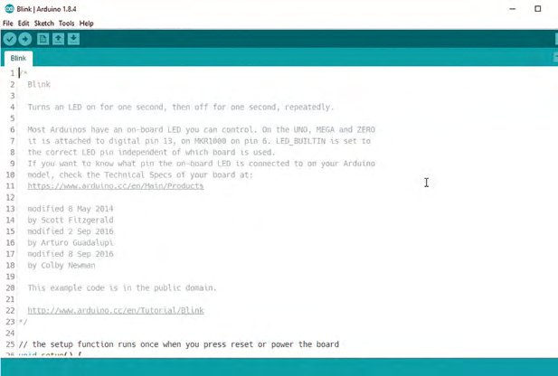
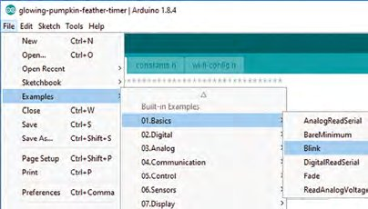
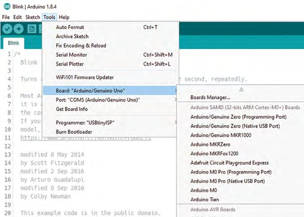
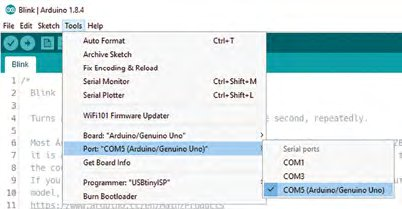
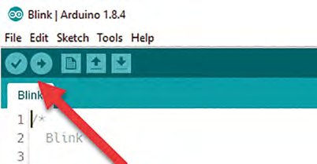

# Capitolul 2 – Adaugă putere Arduino proiectelor tale

> *Primii pași în programarea pentru platforma Arduino*

> **DESPRE AUTOR**
> **John Wargo** (@johnwargo) este programator profesionist, scriitor, prezentator, tată, soț și pasionat de tehnologie. Lucrează ca Program Manager la Microsoft, la Visual Studio Mobile Center. Îl găsești la [johnwargo.com](https://johnwargo.com).

Deci vrei să începi să programezi microcontrolere și să faci niște proiecte grozave cu hardware. Ai ales Arduino ca platformă de pornire, ai cumpărat o placă Arduino populară și ești gata de treabă. Ce urmează? În acest scurt capitol îți vom arăta cum să începi să scrii cod pentru Arduino.

Arduino ([arduino.cc](https://www.arduino.cc)) este o platformă hardware foarte populară pentru proiecte cu hardware controlat de calculator. Arduino este un microcontroler mic, ieftin și programabil, care expune o mulțime de conexiuni de intrare și ieșire (I/O) pe care le poți folosi pentru a crea circuite controlate de calculator, legând la ele întrerupătoare, lumini, senzori și multe altele. Este o platformă hardware deschisă, ceea ce înseamnă că specificația hardware este open-source, așa că oricine are mijloacele necesare poate proiecta și distribui propriul hardware compatibil Arduino. Prin urmare, există o serie de dispozitive făcute de arduino.cc și o mulțime de dispozitive „compatibile” de la alți producători.

Pentru a programa un dispozitiv Arduino, vei scrie aplicații într-un limbaj asemănător cu un limbaj de programare foarte vechi, numit C; aceste aplicații se numesc **sketch-uri** (schițe). Pentru că Arduino este, în esență, un mic sistem de calcul, deși cu viteză de procesare și memorie limitate, platforma suportă o submulțime a capacităților limbajului C. Îți vei scrie aplicațiile Arduino într-un mediu de dezvoltare integrat (IDE); Arduino oferă atât un IDE instalat local, cât și un IDE în cloud pentru proiectele tale. Există și IDE-uri alternative; găsești o listă de opțiuni la [hsmag.cc/aQJqkJ](https://hsmag.cc/aQJqkJ).

Când creezi sketch-uri, scrii codul în IDE, apoi conectezi dispozitivul compatibil Arduino la PC printr-un cablu USB. Cu acestea la locul lor, IDE-ul compilează sketch-urile în cod executabil, apoi le descarcă pe dispozitivul Arduino prin cablu. În timp ce sketch-ul rulează, poți transfera date între IDE și dispozitivul Arduino printr-un canal de comunicare serială activat în IDE (arătat în **Figura 1**). Odată ce codul compilat este instalat pe dispozitiv, acesta se resetează și, după ce termină inițializarea, execută sketch-ul.



*Figura 1 – Arhitectura de dezvoltare Arduino: stația de lucru trimite sketch-ul prin cablul USB, iar prin același cablu are loc comunicarea serială*

Un sketch Arduino este format, la minimum, din două părți: cod care rulează o singură dată și cod care rulează în mod repetat. Hai să îți arătăm.

> **COMUNICAREA SERIALĂ**
> Capacitățile de comunicare serială ale platformei Arduino oferă sketch-urilor tale posibilități suplimentare. La minimum, poți folosi comunicarea serială pentru a trimite date înapoi în IDE în timp ce îți depanezi sketch-urile. Pentru asta, deschide meniul Tools al IDE-ului și alege Serial Monitor. Se deschide o fereastră nouă, în care apar toate datele scrise cu comenzile Serial (descrise la [arduino.cc/en/Reference/Serial](https://www.arduino.cc/en/Reference/Serial)).
>
> Poți folosi comunicarea serială și pentru a transfera datele colectate (de la senzorii conectați la placa Arduino) către un alt sistem, cum ar fi un PC cu Windows sau un Raspberry Pi. Makerii fac des asta, pentru că Arduino are intrări analogice, iar Raspberry Pi nu. În acest scenariu, Arduino devine doar un dispozitiv de colectare a datelor, iar Raspberry Pi face calculele necesare proiectului, eventual afișând datele pe un ecran conectat sau încărcându-le pe un server la distanță pentru prelucrare.

> **VEI AVEA NEVOIE DE**
> - **O placă compatibilă Arduino.** Un dispozitiv Arduino veritabil este de preferat, pentru că multe plăci compatibile au nevoie de configurări suplimentare. Placa de pornire recomandată este Arduino Uno ([hsmag.cc/QKaKXM](https://hsmag.cc/QKaKXM)) sau mai noul și mai capabilul Arduino Zero ([hsmag.cc/KGJbVd](https://hsmag.cc/KGJbVd)).
> - **Microsoft Windows, Apple macOS sau Linux.**
> - **Un cablu USB**, pentru a conecta dispozitivul Arduino la calculator. Conectorii de pe plăcile Arduino variază; majoritatea folosesc un conector micro-USB, dar Uno folosește un cablu USB A/B.

## Anatomia unui sketch

În Arduino IDE (descris mai jos), un sketch Arduino gol arată așa:

```cpp
/*
*/
void setup() {
}
void loop() {
}
```

Prima parte a sketch-ului este un bloc de comentariu. Orice, absolut orice scrii între caracterele `/*` și `*/` este ignorat de compilatorul Arduino.

```cpp
/************************************
  My First Arduino Sketch

  by John M. Wargo
  December, 2017

Meatloaf meatball pork ground round fatback
kielbasa cow porchetta pork loin ball tip. Spare
ribs picanha drumstick pork jerky cupim alcatra
meatball beef ribs. Ball tip ground round
pastrami pancetta shank kevin.
*************************************/
```

În sketch-urile tale vei folosi acest mod de comentare atunci când ai mai multe rânduri de conținut pe care vrei să le afișezi în sketch. La minimum, folosește un bloc de comentariu la începutul sketch-ului pentru a-l descrie, așa cum am făcut în exemplu, cu un text de umplutură de la generatorul Bacon Ipsum ([baconipsum.com](https://baconipsum.com)). Ar trebui să folosești astfel de comentarii-bloc și pentru a descrie părțile importante ale sketch-urilor tale.

Poți adăuga și comentarii pe o singură linie. Pentru asta, începe orice linie din sketch cu două bare oblice (`//`) sau pune-le după o linie de cod. Tot ce urmează după cele două bare este ignorat de compilatorul Arduino. În exemplul următor, un comentariu pe o linie precedă definiția variabilei `numCols`. Comentariul și codul executabil sunt pe linii separate, așa că am început linia de comentariu cu cele două bare.

```cpp
//Number of columns in the table
int numCols;
```

Sau ceva de genul acesta, unde comentariul urmează definiției variabilei `relayStatus`:

```cpp
bool relayStatus;  //The current status of the relay (on/off)
```

Funcția `setup` a sketch-ului este definită cu următorul cod:

```cpp
void setup() {
}
```

Orice cod adaugi în această funcție (îl vei adăuga între acoladele `{}`) este executat de dispozitivul Arduino de îndată ce îl alimentezi și hardware-ul termină de inițializat. Această funcție este executată o singură dată; o vei folosi pentru a-ți pregăti sketch-ul și pentru a executa lucrurile care trebuie făcute doar când sketch-ul pornește.

De obicei o vei folosi pentru a defini configurația hardware-ului; cum mulți conectori de intrare/ieșire (I/O) ai lui Arduino pot fi folosiți fie ca intrare, fie ca ieșire, va trebui să îi spui sketch-ului cum intenționezi să îi folosești. Îți vom arăta un exemplu în scurt timp.

Ultima componentă a unui sketch minimal este funcția `loop`:

```cpp
void loop() {
}
```

În această funcție pui orice cod vrei să ruleze în mod repetat pe Arduino. Arduino execută funcția `setup` o dată, apoi execută funcția `loop` iar și iar și iar, până când fie Arduino explodează (nu explodează, glumim), fie deconectezi alimentarea dispozitivului. Poți pune tot codul în `loop` sau îl poți împărți în funcții mai mici pe care le apelezi din funcția `loop`.

> *Arduino este un microcontroler mic, ieftin și programabil, care expune o mulțime de conexiuni de intrare și ieșire (I/O)*

## Blink: primul sketch

Ca să vezi toate acestea în acțiune, uită-te la exemplul următor. În mod implicit, uneltele de dezvoltare Arduino includ un sketch simplu, numit Blink. Majoritatea dispozitivelor Arduino au un LED pe placă, legat direct la unul dintre porturile I/O ale lui Arduino. Sketch-ul Blink inclus îți permite să faci rapid ceva cu Arduino: să aprinzi și să stingi acel LED în mod repetat.

Notă: sketch-ul Blink începe cu un bloc de comentariu introductiv lung și amănunțit, pe care îl omitem aici pentru concizie. Îți vom arăta în curând cum să deschizi sketch-ul, ca să îl poți studia în întregime.

```cpp
// the setup function runs once when you press reset or
// power the board
void setup() {
  // initialize digital pin LED_BUILTIN as an output.
  pinMode(LED_BUILTIN, OUTPUT);
}

// the loop function runs over and over again forever
void loop() {
  // turn the LED on (HIGH is the voltage level)
  digitalWrite(LED_BUILTIN, HIGH);
  // wait for a second
  delay(1000);
  // turn the LED off by making the voltage LOW
  digitalWrite(LED_BUILTIN, LOW);
  // wait for a second
  delay(1000);
}
```



*Sketch-ul Arduino Blink*

În funcția `setup` există o singură linie executabilă:

```cpp
pinMode(LED_BUILTIN, OUTPUT);
```

Apelul `pinMode` stabilește configurația unuia dintre pinii I/O ai lui Arduino. În acest caz, configurează pinul I/O definit în `LED_BUILTIN` în modul de ieșire. Amintește-ți, majoritatea plăcilor Arduino au un LED încorporat; echipa Arduino a preconfigurat mediul de dezvoltare Arduino astfel încât să păstreze pinul I/O asociat LED-ului fiecărei plăci Arduino într-o variabilă numită `LED_BUILTIN`. De fiecare dată când sketch-ul face referire la `LED_BUILTIN`, compilatorul înlocuiește referința cu numărul real al pinului la care este conectat LED-ul. Arduino Zero are LED-ul legat la pinul I/O 13, așa că, pentru Zero, codul este în esență:

```cpp
pinMode(13, OUTPUT);
```

Cu asta la locul ei, sketch-ul știe că, atunci când lucrează cu pinul 13, va scoate un semnal (va trimite o tensiune) pe pin, nu va primi unul.

În funcția `loop`, codul parcurge următorii pași:

- Folosește metoda `digitalWrite` pentru a seta tensiunea de ieșire de pe pinul `LED_BUILTIN` la `HIGH`. Asta înseamnă că pinul primește o tensiune egală cu tensiunea de funcționare a plăcii Arduino. Unele dispozitive Arduino funcționează la 3 V, altele la 5 V; tot ce contează aici este că, la executarea acestui cod, Arduino alimentează LED-ul conectat la pinul I/O la luminozitate maximă.
- Așteaptă 1000 de milisecunde (1 secundă) cu metoda `delay()`.
- Folosește metoda `digitalWrite` pentru a seta tensiunea de ieșire de pe pinul `LED_BUILTIN` la `LOW`. Asta înseamnă zero tensiune (0), ceea ce, practic, stinge LED-ul.
- Așteaptă 1000 de milisecunde (1 secundă) cu metoda `delay()`.

Când codul rulează, va aprinde LED-ul timp de 1 secundă, apoi îl va stinge timp de 1 secundă, repetând procesul până când tai alimentarea dispozitivului sau instalezi un alt sketch.

## Rulează sketch-ul

Acum e timpul să vedem sketch-ul în funcțiune. Pentru asta, vei începe prin a instala Arduino IDE pe calculatorul tău. Deschide browserul preferat și navighează la [arduino.cc](https://www.arduino.cc). În meniul de sus al site-ului, apasă pe linkul Software, apoi, pe pagina care se deschide, descarcă cea mai nouă versiune de Arduino IDE pentru sistemul tău de operare. Când descărcarea se termină, lansează fișierul descărcat pentru a începe instalarea.

Când instalarea se termină, pornește Arduino IDE. În Arduino IDE, deschide meniul File, alege Examples, apoi 01.Basics, apoi Blink, așa cum arată **Figura 2**.



*Figura 2 – Deschiderea sketch-ului Arduino Blink*



*Configurarea IDE-ului pentru placa Arduino conectată*



*Setarea portului de comunicare al IDE-ului*

Conectează placa la calculator cu cablul USB, apoi spune-i IDE-ului ce placă folosești (Tools > Board) și pe ce port este conectată (Tools > Port). Apasă apoi pe butonul Verify (bifa) pentru a compila sketch-ul. În zona de mesaje din partea de jos a ferestrei ar trebui să apară ceva asemănător cu:

```
Archiving built core (caching) in: C:\Users\JOHNWARGO\AppData\Local\Temp\arduino_cache_950966\core\core_arduino_avr_uno_c3bfe3f79ffbeab93536a1a484b588d9.a
Sketch uses 928 bytes (2%) of program storage space. Maximum is 32256 bytes.
Global variables use 9 bytes (0%) of dynamic memory, leaving 2039 bytes for local variables. Maximum is 2048 bytes.
```

Dacă verificarea eșuează, IDE-ul va afișa informații despre erori și va indica numărul liniei din sketch unde a fost găsită eroarea. Va trebui să corectezi erorile înainte de a trece la pasul următor.



*Butoanele Verify (compilare) și Upload (încărcare)*

La final, apasă pe butonul Upload; IDE-ul va repeta pasul de verificare, apoi va instala sketch-ul compilat pe dispozitivul Arduino conectat. Când procesul de încărcare se termină, dispozitivul Arduino se va reseta imediat, apoi va începe să execute noul sketch. În acest exemplu, Arduino își va aprinde și stinge LED-ul de pe placă în mod repetat, până când tai alimentarea plăcii sau încarci un alt sketch.

Acum e timpul să te joci cu codul. Dacă îți amintești de mai devreme, sketch-ul folosește instrucțiuni `delay` pentru a controla cât timp stă LED-ul aprins și stins. În acest moment, ele sunt scrise să facă o pauză de 1 secundă (1000 de milisecunde); modifică-le astfel încât LED-ul să stea aprins o jumătate de secundă (500 de milisecunde) și să facă o pauză de două secunde (2000 de milisecunde) între aprinderi. Încarcă pe placă codul modificat și vezi ce se întâmplă.

> **PAȘII URMĂTORI**
> Abia am zgâriat suprafața a ceea ce poți face cu platforma Arduino. Ca să le fie mai ușor programatorilor Arduino să înceapă, IDE-ul include un întreg catalog de aplicații exemplu pe care le poți studia și folosi pentru a-ți extinde abilitățile. Pentru a ajunge la aceste exemple, în Arduino IDE deschide meniul File, alege Examples, apoi caută o categorie de sketch-uri care te atrage. Categoria Basics oferă câteva sketch-uri simple pe care le poți folosi ca să mergi mai departe de unde am început noi aici. Există un sketch simplu care aprinde și stinge treptat LED-ul de pe placă (în loc să îl aprindă și să îl stingă brusc, ca în exemplul Blink). Există și sketch-uri pentru citirea semnalelor analogice sau digitale; le-ai folosi cu dispozitivul analogic sau digital potrivit conectat la Arduino. Celelalte categorii oferă sketch-uri mai sofisticate, care lucrează cu diverse dispozitive hardware și nu numai.
