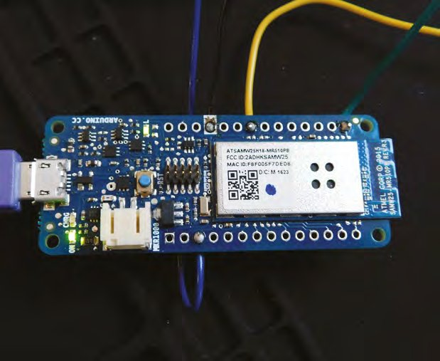
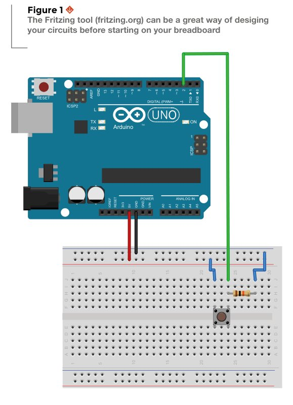
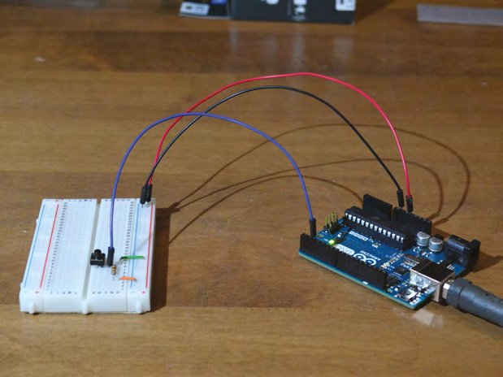

# Capitolul 3 – Citirea datelor digitale pe platforma Arduino

> *Învață cum să citești date din exterior într-un proiect Arduino*

> **DESPRE AUTOR**
> **John Wargo** (@johnwargo) este programator profesionist, scriitor, prezentator, tată, soț și pasionat de tehnologie. Lucrează ca Program Manager la Microsoft, la Visual Studio Mobile Center. Îl găsești la [johnwargo.com](https://johnwargo.com).

În capitolul anterior ți-am arătat cum să faci să clipească LED-ul încorporat al unui dispozitiv Arduino. Aici îți vom arăta cum să folosești un buton pentru a aprinde și stinge LED-ul. Acest capitol ilustrează un mod de a citi date digitale cu un Arduino.

Plăcile Arduino oferă mai multe moduri de a interacționa cu componente hardware externe; în toate cazurile, asta înseamnă fie trimiterea unui semnal către un dispozitiv extern, fie citirea datelor de la el. Aceste intrări și ieșiri, împreună cu logica pe care ai scris-o în sketch-ul proiectului, sunt miezul oricărui proiect Arduino. Intrările Arduino vin în două formate, analogice și digitale; în acest capitol vom trata un mod de a folosi intrările digitale.

Fiecare intrare digitală a lui Arduino poate citi două valori: `LOW` și `HIGH`. `LOW` este o constantă definită în Arduino IDE, care înseamnă, în esență, tensiune zero (sau foarte mică). Valoarea `HIGH` se referă la cea mai mare tensiune pe care o poate suporta placa (de obicei 3 V pe un Arduino care funcționează la 3 V și 5 V pe unul care funcționează la 5 V).

Notă: orice dispozitiv Arduino folosești în proiecte va avea una sau mai multe intrări digitale; de obicei, ele funcționează și ca ieșiri digitale. Ai învățat cum să folosești o ieșire digitală în capitolul anterior.

Poate îți spui: „Cât de utilă e o intrare digitală dacă poate fi doar pornită sau oprită? Ăsta e doar un bit, nu?” Pe Arduino, intrările digitale sunt folosite în două feluri: pentru a citi valori de moment, cum ar fi starea unui buton, sau pentru a citi un flux de cifre binare (biți), pe care o aplicație îl transformă în date mai utile, cum ar fi octeți sau numere. În acest capitol vei afla cum să folosești o intrare digitală pentru a citi starea unui buton.



*Mediul de dezvoltare Arduino evidențiază sintaxa codului, ca să observi mai ușor greșelile de tastare*

> **VEI AVEA NEVOIE DE**
> - **Un Arduino sau un dispozitiv compatibil Arduino.** Recomandăm Arduino Uno pentru începători.
> - **Un buton cu apăsare de moment** (*momentary push-button*)
> - **Un rezistor de 10 kΩ**
> - **Un breadboard** (placă de prototipare)
> - **Fire de legătură pentru breadboard**

## Intrările digitale pot citi valori singulare sau fluxuri de date

În capitolul anterior ți-am arătat cum să folosești sketch-ul Arduino Blink pentru a aprinde și stinge LED-ul de pe placă la un anumit interval. În acest capitol vom extinde acel proiect și vom folosi un buton pentru a aprinde și a comuta starea LED-ului. Când butonul este apăsat, LED-ul se aprinde. Când butonul este ridicat (circuit deschis), LED-ul se stinge.

Înainte să cablăm circuitul, hai să ne uităm la cod (codul complet al exemplului îl găsești la [hsmag.cc/KTioNX](https://hsmag.cc/KTioNX)).

Sketch-ul definește constanta `BTNPIN`, folosită pentru a identifica pinul de intrare digitală al lui Arduino la care este conectat butonul. Urmând o convenție obișnuită, am scris numele constantei cu majuscule, ca să fie ușor de deosebit constantele de variabile într-un sketch. Vei pune în această constantă numărul pinului din montajul tău.

Apoi sketch-ul definește variabila `btnState`, folosită pentru a păstra starea curentă a butonului; această valoare decide dacă LED-ul se aprinde sau se stinge. Observă că am inițializat variabila cu `LOW`; nu e obligatoriu, dar îi dă sketch-ului o valoare de rezervă în cazul în care nu poate citi butonul, lăsând LED-ul stins la prima trecere prin buclă.

```cpp
// BTNPIN defines the Arduino input pin to which the
// button is connected
const int BTNPIN = 2;

// btnState stores the current button state (HIGH or LOW)
// initialize it to LOW so the LED stays off until the sketch
// reads a HIGH state for the button input
int btnState = LOW;
```

> **CONSTANT ÎN CONSTANTE**
> O practică bună este să folosești constante pentru valorile utilizate în mai multe locuri dintr-un sketch. Constanta `BTNPIN` este un bun exemplu: punând valoarea într-o constantă definită la începutul sketch-ului, o poți schimba ușor dacă se schimbă configurația hardware (dacă legi butonul la alt pin de intrare digitală, de exemplu). Ai putea sări peste acest pas, dar dacă ai schimba mai târziu pinul de intrare al proiectului, ar trebui să găsești fiecare loc din sketch unde e folosit și să îl modifici pe fiecare în parte. Pentru un sketch atât de mic nu e mare lucru, dar la sketch-uri mari e mult mai ușor să faci o singură modificare care se propagă în tot sketch-ul, decât multe modificări mici, dintre care una ar putea să îți scape.

În funcția `setup` a sketch-ului, codul stabilește modul pinilor I/O (intrare/ieșire) ai lui Arduino folosiți de sketch. Sketch-ul apelează `pinMode` pentru a seta pinul implicit al LED-ului (definit în constanta `LED_BUILTIN` a Arduino IDE) în modul de ieșire, apoi apelează din nou `pinMode` pentru a seta pinul butonului în modul de intrare. La final, funcția stinge LED-ul, printr-un apel `digitalWrite`, doar ca să fim siguri că pornim cu LED-ul într-o stare cunoscută înainte să înceapă prima buclă.

```cpp
// The setup function runs once every time the Arduino
// powers up or resets (after a sketch update, for example)
void setup() {
  // initialize digital pin LED_BUILTIN as an output.
  pinMode(LED_BUILTIN, OUTPUT);
  // initialize the push button pin as an input:
  pinMode(BTNPIN, INPUT);
  // set the initial state of the LED (off)
  digitalWrite(LED_BUILTIN, btnState);
}
```



*Figura 1 – Programul Fritzing (fritzing.org) este o cale grozavă de a-ți proiecta circuitele înainte să te apuci de breadboard*

> **SFAT RAPID**
> Rezistorul este folosit în acest circuit ca să forțeze valori consistente la intrarea digitală. Fără legătura la masă prin rezistor, nu există o definiție clară a lui `LOW` față de `HIGH`, iar intrarea ar putea „pluti” la o valoare nedeterminată atunci când nu i se aplică niciun semnal. Cu rezistorul la locul lui, există o definiție clară a lui `LOW` când butonul este deschis, prin legătura la masă. Când butonul este apăsat, calea „mai lentă” (prin rezistor) este ignorată, pentru că este o rută mai „scumpă” decât ruta directă spre intrarea digitală.

În funcția `loop` a sketch-ului, codul citește starea butonului printr-un apel `digitalRead` și păstrează rezultatul în variabila `btnState`. Apoi codul folosește valoarea din `btnState` pentru a seta starea LED-ului, printr-un apel `digitalWrite`. Când `btnState` este `LOW`, codul stinge LED-ul; când este `HIGH`, îl aprinde.

```cpp
// The loop function runs repeatedly as long as a sketch is
// loaded and the Arduino has power.
void loop() {
  // Read the state of the button; it's a digital input,
  // so possible returned values are HIGH or LOW.
  btnState = digitalRead(BTNPIN);
  // Use the measured value to set the LED state
  digitalWrite(LED_BUILTIN, btnState);
  // This whole function can be simplified to the following
  // single line of code:
  // digitalWrite(LED_BUILTIN, digitalRead(BTNPIN));
}
```

Codul, așa cum este arătat, împarte acțiunea în doi pași: citește valoarea de pe pinul de intrare într-o variabilă, apoi folosește valoarea variabilei pentru a seta ieșirea de pe pinul implicit al LED-ului. E un mod excelent de a face lucrurile când vrei să ilustrezi cum se face ceva, dar vei folosi mai puțină memorie și vei obține performanțe mai bune dacă unești cei doi pași într-unul singur, așa cum arată linia comentată din cod (aici, fără comentariu):

```cpp
digitalWrite(LED_BUILTIN, digitalRead(BTNPIN));
```

Aici, rezultatul apelului `digitalRead` este trimis ca argument lui `digitalWrite`. Nu vei obține un câștig uriaș de performanță în acest caz, dar pentru sketch-uri mari, mai ales când te lovești de limitele de memorie ale dispozitivului Arduino, este o abordare utilă.

## Apasă pentru a începe

Butoanele sunt dispozitive mecanice și, în timp ce apeși sau eliberezi butonul, nu există nicio garanție că Arduino obține o citire solidă de fiecare dată. Pentru a ține cont de asta, îți poți ajusta sketch-ul astfel încât să facă *debouncing* pentru conexiunea butonului, adică să se asigure că butonul a fost apăsat un timp minim înainte de a declanșa o schimbare a stării LED-ului.

> **SĂRITURI ȘI VIBRAȚII**
> *Bouncing* (vibrația contactelor) și *debouncing* (eliminarea ei) sunt termeni folosiți când descriem interacțiunile cu conexiuni electrice ca cea din butonul acestui proiect. Când un buton sau un întrerupător începe să facă sau să întrerupă o conexiune, există o incertitudine în conexiune, pe măsură ce contactele se mișcă. Un buton poate face mai multe conexiuni intermitente până când contactele se ating ferm; asta se numește *bouncing*. Pentru a o atenua, programatorii Arduino implementează *debouncing*, un mecanism care forțează un singur semnal de la buton, prin ceva cod suplimentar. În acest exemplu, codul face debouncing obligând aplicația să aștepte un timp minim cu conexiunea făcută înainte să o considere corectă.

În exemplul următor am îmbunătățit exemplul anterior cu debouncing; codul complet îl găsești la [hsmag.cc/pEzXyu](https://hsmag.cc/pEzXyu).

La începutul codului, sketch-ul definește aceeași constantă `BTNPIN` și aceeași variabilă `btnState` ca în exemplul anterior. Am adăugat și variabila `prevBtnState`, pentru a ține evidența stării anterioare a butonului, și `ledState`, pentru a urmări starea curentă a LED-ului. Variabila `lastToggle` reține momentul în care s-a schimbat starea butonului. La final, constanta `DEBOUNCE_DELTA` definește numărul de milisecunde pe care sketch-ul le așteaptă înainte de a avea încredere într-o citire a butonului. Le vei vedea pe toate în acțiune mai jos, în sketch.

```cpp
// BTNPIN defines the Arduino input pin to which the
// button is connected
const int BTNPIN = 2;
// btnState stores the current button state (HIGH or LOW)
// initialize it to LOW so the LED stays off until the sketch
// reads a HIGH state for the button input
int btnState = LOW;
// A place to store the previous loop's button state
int prevBtnState = LOW;
// Used to track the current state of the LED
int ledState = LOW;
// Stores the last time the status of the button changed
unsigned long lastToggle = 0;
// Specifies the amount of time the button must stay pushed for it
// to trigger the LED on or off. Increase this value if your LED
// flickers
const unsigned long DEBOUNCE_DELTA = 100;  // milliseconds
```



*Circuitul complet, asamblat și funcționând cu un Arduino Uno*

Funcția `setup` este exact aceeași ca în exemplul anterior.

```cpp
void setup() {
  // initialize digital pin LED_BUILTIN as an output.
  pinMode(LED_BUILTIN, OUTPUT);
  // initialize the push button pin as an input:
  pinMode(BTNPIN, INPUT);
  // set the initial state of the LED
  digitalWrite(LED_BUILTIN, ledState);
}
```

În funcția `loop`, codul citește butonul cu `digitalRead`, exact ca în exemplul anterior. Apoi codul verifică dacă starea curentă a butonului este aceeași ca la trecerea anterioară prin buclă. Dacă nu este, codul păstrează timpul curent în variabila `lastToggle`.

## Încă o tură

La următoarea trecere prin buclă, dacă starea butonului nu s-a schimbat, sketch-ul verifică cât timp a trecut de la ultima schimbare (scăzând valoarea din `lastToggle` din timpul curent). Dacă starea butonului nu s-a schimbat de mai mult de `DEBOUNCE_DELTA` milisecunde (`if ((millis() - lastToggle) > DEBOUNCE_DELTA)`), atunci sketch-ul știe că are o citire corectă a butonului și comută LED-ul.

```cpp
void loop() {
  // Read the current state of the button
  btnState = digitalRead(BTNPIN);

  // Is the button in the same state as the last time
  // we came through the loop? No? Then we need to record
  // the current time (in milliseconds)
  if (btnState != prevBtnState) {
    // store the current time in milliseconds
    // It doesn't matter what the actual time is, all we need
    // to know is how long did the button stay in this state
    lastToggle = millis();
    // Reset our previous state, so this check skips next time
    prevBtnState = btnState;
  } else {
    // OK, the button states (current and previous) are the same
    // Lets see if they've been the same for DEBOUNCE_DELTA
    // milliseconds
    if ((millis() - lastToggle) > DEBOUNCE_DELTA) {
      // the button's been pushed (or not pushed) for at
      // least debounceDelta milliseconds, so its time to
      // toggle the LED if needed
      // Is the LED at the same state as the button?
      if (ledState != btnState) {
        // No? Then toggle it
        digitalWrite(LED_BUILTIN, btnState);
        // Then reset the LED status
        ledState = btnState;
      }
    }
  }
}
```

> **SFAT RAPID**
> Metoda `millis()` a lui Arduino returnează timpul curent, în milisecunde, scurs de când Arduino a început să ruleze sketch-ul curent; ea nu îi dă sketch-ului ora exactă, dar îi permite să urmărească cât timp a trecut de la o măsurătoare anterioară.

> **DELTA MARE**
> `lastToggle` și `DEBOUNCE_DELTA` sunt amândouă numere întregi lungi (`unsigned long`), pentru că sketch-ul le folosește la calcularea diferențelor de timp, iar valorile de timp sunt numere întregi foarte mari. Deși `DEBOUNCE_DELTA` este un număr mic (prin comparație), cum sketch-ul va face aritmetică cu aceste valori, le-am dat același tip, ca să evităm orice problemă de conversie.

Ca să testezi oricare dintre aceste sketch-uri, leagă un buton la Arduino (vezi **Figura 1**). Pe o parte a butonului, conexiunea merge de la pinul de 5 V, prin rezistorul de 10 kΩ, la masă (GND). Cealaltă conexiune a butonului merge la pinul de intrare digitală 2. Cu butonul apăsat, se face o legătură de la sursa de 5 V la intrarea digitală, ocolind rezistorul și forțând circuitul în `HIGH`. Când butonul este eliberat, legătura cu pinul de intrare digitală dispare, iar tensiunea se scurge prin rezistor la masă, făcând intrarea `LOW`.

Folosind Arduino IDE, încarcă codul pe dispozitivul Arduino și încearcă să apeși butonul pentru a aprinde și stinge LED-ul. Joacă-te cu valoarea constantei `DEBOUNCE_DELTA` ca să vezi cum afectează reacția sketch-ului la buton.

Nu uita, tot codul sursă al proiectului este disponibil la [hsmag.cc/dMDWFx](https://hsmag.cc/dMDWFx).
