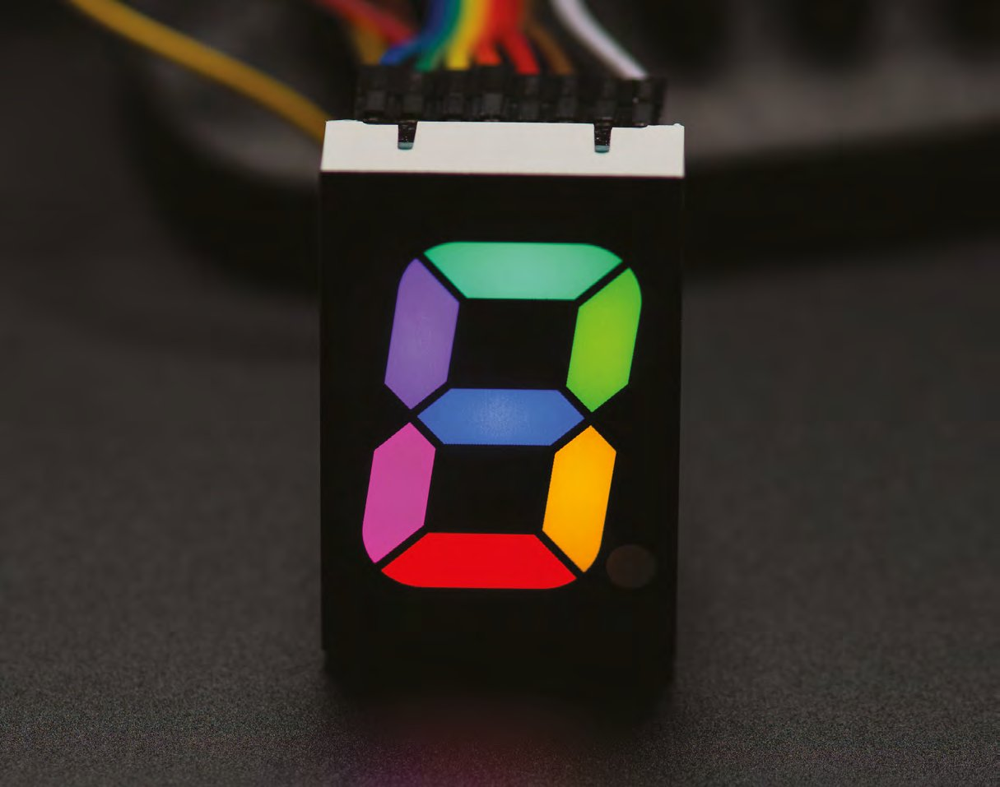
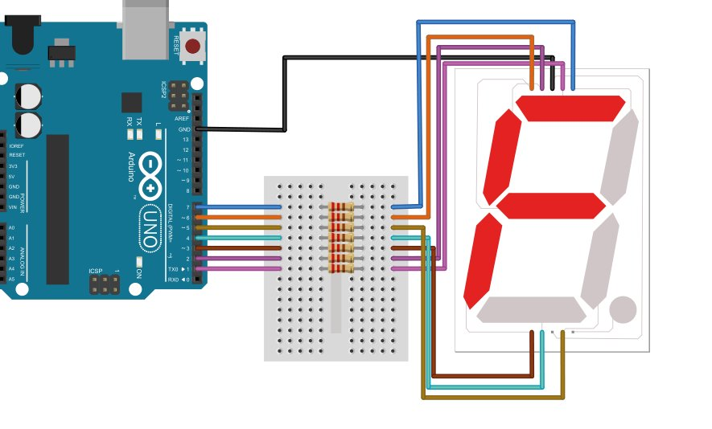
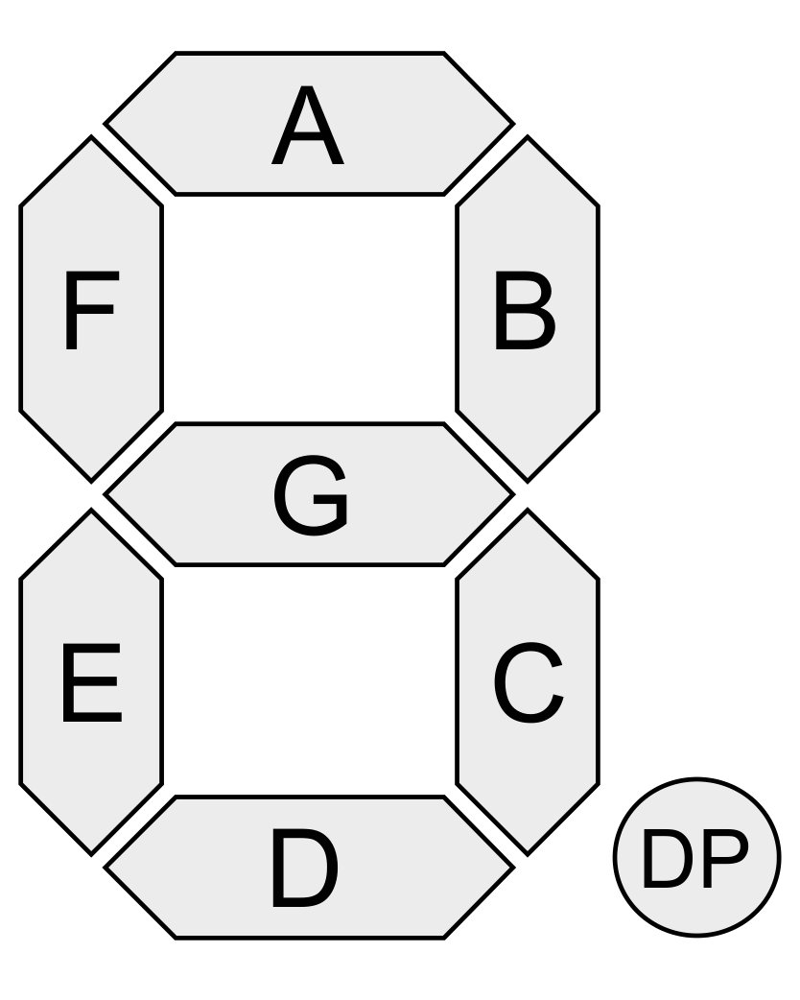
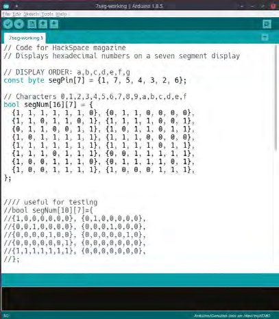
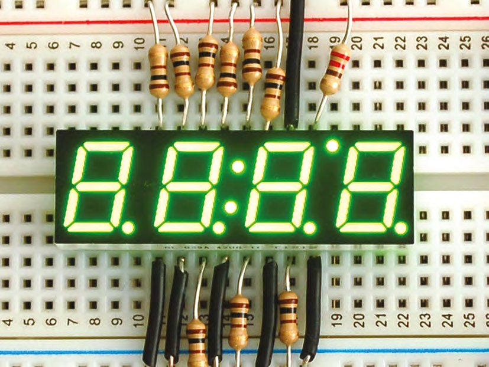
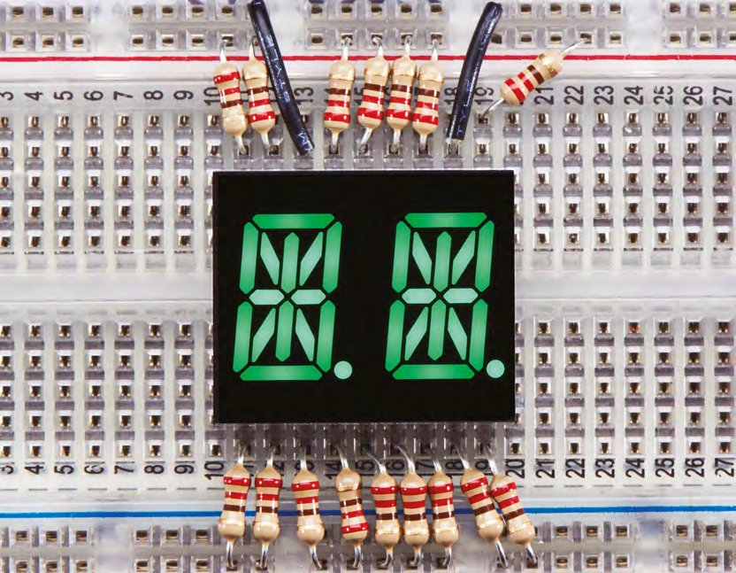

# Capitolul 4 – Programare Arduino: afișaje cu șapte segmente și tablouri multidimensionale

> *Obține rezultate cu sens din proiectele tale și stăpânește stocarea datelor în mai multe dimensiuni*

> **DESPRE AUTOR**
> **Graham Morrison** (@degville) este un jurnalist Linux veteran, aflat într-o căutare de-o viață a muzicii din aranjamentul perfect al siliciului.

> **VEI AVEA NEVOIE DE**
> - Un afișaj cu șapte segmente Kingbright SC10-EWA
> - Arduino Uno
> - 7 rezistoare de 220 Ω
> - Breadboard
> - Fire de legătură



*Există și afișaje RGB cu șapte segmente, cu pini separați pentru LED-urile roșii, verzi și albastre din fiecare segment*

Când vine vorba de programarea plăcii Arduino, una dintre cele mai importante abilități de stăpânit este să iei o problemă fizică și să construiești o soluție care poate fi exprimată eficient în cod. Devine mai ușor pe măsură ce capeți experiență cu hardware-ul și cu codul, dar e important de reținut că, fie că ești expert sau începător absolut, prima ta soluție are șanse mici să fie și cea mai bună, iar în majoritatea cazurilor un proiect poate fi rescris complet o dată, de două, de trei sau chiar de patru ori. Fiecare rescriere va încorpora experiența câștigată cu versiunea anterioară, pe măsură ce înțelegi tot mai bine cum să faci soluția să funcționeze.

Din acest motiv sunt atât de importante tipurile de variabile și subiectul înrudit al structurilor de date. Nu doar că îți permit să scrii cod care folosește hardware-ul cât mai eficient, dar te lasă să îți definești mai precis soluțiile în cod. De exemplu, e perfect acceptabil să folosești un tip `int` ca să reții ce pin digital Arduino folosești pentru un LED. Dar, cum un Arduino tipic are doar vreo 14 pini digitali, a folosi o variabilă capabilă să țină orice număr întreg între -32 768 și +32 767 este mult, mai ales că plăcile Arduino au atât de puțină memorie RAM. Și există un tip de variabilă care funcționează la fel și ocupă mai puțin spațiu: tipul `byte` ține un număr fără semn pe 8 biți și, dacă îți amintești matematica binară, asta înseamnă un număr între 0 și 255. Nu e perfect, dar e mai eficient cu memoria și mai ușor de înțeles și de modificat pentru cei care îți citesc codul, pentru că ai stabilit limite pentru felul în care poate fi folosită variabila. Crearea structurilor cu limite este una dintre pietrele de temelie ale programării orientate pe obiecte.

Ca să punem această idee în practică și să explorăm mai departe cum se folosesc variabilele într-un exemplu real, vom crea un proiect de bază simplu, care poate sta în inima multor proiecte mai ambițioase. Motivul pentru care acest proiect poate fi folosit în atât de multe altele este că ia ideea simplă din spatele oricărui exemplu de bază cu LED-uri pe Arduino și o extinde ca să construiască un dispozitiv de ieșire complet, capabil să reprezinte multe caractere alfanumerice diferite. Componenta simplă care face această magie este modestul afișaj cu șapte segmente, folosit în navele spațiale Apollo, în automatele de pinball și în cuptoarele cu microunde. Cu un afișaj cu șapte segmente, dispozitivele tale pot comunica cu lumea din afară, fie că e vorba de o temperatură, de un nivel al volumului sau de nivelul radiațiilor de pe contorul tău Geiger. De fapt, un afișaj cu șapte segmente ar fi upgrade-ul perfect pentru proiectul cu senzor de temperatură descris în HackSpace numărul 3 (hsmag.cc/issue3).

Un afișaj cu șapte segmente nu e cu mult mai mult decât șapte LED-uri într-o singură carcasă, sau opt, dacă pui la socoteală și punctul zecimal. Pinii de pe două dintre laturi corespund fie pinilor negativi, fie celor pozitivi ai fiecărui LED, în funcție de tipul afișajului: cu anod comun sau cu catod comun. Această diferență de tip dictează dacă un segment/LED se aprinde legând pinul la masă sau alimentându-l cu 5 volți (respectiv). În exemplul nostru vom folosi tipul mai obișnuit, cu „catod comun”, dar cablarea poate fi pur și simplu inversată dacă ai un afișaj de tipul opus.

> *Un afișaj cu șapte segmente nu e cu mult mai mult decât șapte LED-uri într-o singură carcasă, sau opt, dacă pui la socoteală și punctul zecimal*

## Cablarea

Să nimerești polaritatea corectă a unui LED este vital, iar același lucru e valabil și pentru un afișaj cu șapte segmente. Singura diferență reală este că, la un afișaj cu șapte segmente, toate cele șapte LED-uri sunt legate fie la un anod comun, fie la un catod comun, și trebuie să nimerești corect ca întregul să funcționeze. Doar fișa tehnică a afișajului tău îți va spune cum trebuie cablat și care pini sunt pentru masa sau alimentarea comună, dar oricum ar trebui să fie un circuit foarte simplu. Cu hardware-ul nostru, un pin se leagă la masă (GND) pe Arduino, iar majoritatea pinilor rămași se leagă la ieșirile digitale 2–7 ale lui Arduino, prin rezistoare de 220 ohmi (care împiedică trecerea unui curent prea mare prin LED-uri). Configurația obișnuită are pinii cablați în sensul acelor de ceasornic, pornind de sus, dar și asta ar trebui să fie descrisă în fișa tehnică a afișajului. Nu-ți face griji dacă nu îți dai seama care pin răspunde de care segment: vezi caseta „Care segment e care?” de la sfârșitul capitolului pentru a afla cum se descoperă manual.

> **SFAT RAPID**
> Cum fișa tehnică a afișajului nostru permite 5 V pe segment, noi nu avem nevoie de rezistoare. Dar al tău s-ar putea să nu fie la fel.



*Pentru un afișaj cu catod comun, pinii digitali 2, 3, 4, 5, 6 și 7 ai lui Arduino se leagă la segmentele a, b, c, d, e, f și, respectiv, g, plus masa*

Ceea ce ne lasă cu codul. Scrierea codului pentru aprinderea unui LED conectat la un pin digital al lui Arduino a fost tratată de multe ori, inclusiv în HackSpace numărul 3. O singură variabilă ține numărul pinului, care este folosit ca argument într-o funcție numită `digitalWrite`, pentru a trimite pinului un semnal de pornire sau de oprire. Am putea aborda un afișaj cu șapte segmente exact în același fel, creând șapte variabile separate pentru numerele pinilor și scriind apoi șapte apeluri de funcție diferite pentru a aprinde sau a stinge fiecare element al afișajului. Și aici intră în joc atât cunoașterea limbajului de programare, cât și experiența în proiectare, pentru că exact pentru acest tip de problemă repetitivă au fost create calculatoarele și limbajele lor de programare.

Vom începe prin a introduce un tablou (*array*). Vestea bună este că, dacă ai făcut vreodată orice fel de programare, ești deja familiarizat cu tablourile. Un tablou este o serie de valori, toate de același tip, încapsulate într-o singură variabilă. Definind un tablou, nu mai trebuie să treci prin procesul lung de creare și atribuire separată a valorilor, iar compilatorul care îți transformă codul într-un fișier binar poate de obicei să folosească un tablou mai eficient. Poate cere, de exemplu, zece bucăți consecutive de memorie, toate de aceeași mărime, în loc de zece cereri individuale care pot ajunge împrăștiate prin memorie. Natura consecutivă a datelor dintr-un tablou se reflectă adesea în felul în care un limbaj de programare te lasă să îl parcurgi automat sau să accesezi valorile din el printr-un decalaj (*offset*).



*Toate afișajele cu șapte segmente folosesc aceleași litere pentru aceleași segmente, astfel încât caracterele să poată fi partajate între ele. Sursa imaginii: CC BY-SA h2g2bob / Wikimedia.org*

## Tablouri, la drum!

Definești un tablou la fel ca orice altă variabilă, doar că trebuie să specifici mărimea tabloului (ca să se poată rezerva memorie pentru numărul corect de valori) și valorile pentru fiecare poziție din tablou.

De exemplu, codul următor creează un tablou numit `segPin`, care ține șapte valori:

```cpp
const int segPin[7]={1,7,5,4,3,2,6};
```

După cum probabil ghicești, `segPin` ține numărul fiecărui pin digital Arduino conectat la afișajul cu șapte segmente, urmând cablarea în sensul acelor de ceasornic a segmentelor. Pinul 1, de exemplu, este conectat la pinul care activează segmentul „a”. Motivul pentru care exemplul nostru nu este o serie de numere consecutive ține doar de felul în care am cablat circuitul, iar constructorii mai organizați ar lega cu siguranță 1 la a, 2 la b și așa mai departe. Noi însă ne-am încurcat cablurile la un moment dat, iar asta se vede în ordinea tabloului. Dacă le legi în ordine, înlocuiește pur și simplu tabloul cu `{1,2,3,4,5,6,7}`. Și pentru că aceste alocări de pini nu se vor schimba în timp ce rulează codul, am făcut tipul „constant”, așa cum am explicat în HackSpace numărul 4.



*Definirea tuturor datelor la începutul unui sketch Arduino le face ușor de găsit și de actualizat dacă se schimbă hardware-ul*

Un tablou poate fi folosit exact ca orice altă variabilă, doar că, în loc să folosești numai numele tabloului, trebuie să indici și un anumit element din el, între paranteze drepte. Ca să setezi modul pinului din primul element al tabloului la `OUTPUT`, de exemplu, ai folosi:

```cpp
pinMode(segPin[0], OUTPUT);
```

Cum bine se știe, tablourile și multe alte elemente secvențiale din programare încep de la zero, nu de la unu, așa că linia de mai sus setează modul pinului din primul element (întâmplător, pinul digital 1) la `OUTPUT`. Până aici, nimic diferit de folosirea unei variabile obișnuite. Am putea copia această linie de șapte ori și actualiza numărul de referință din tablou ca să parcurgem lista de pini, exact cum am face cu variabilele. Dar numărul de referință din tablou este un indiciu. Făcându-l o referire la o altă variabilă, pe care apoi o incrementăm ca să trecem prin fiecare element al tabloului, putem construi o buclă mult mai mică și mai eficientă. Iată codul care face exact asta:

```cpp
void setup(){
  for (int i=0; i<=7; i++){
    pinMode(segPin[i], OUTPUT);
  }
}
```

Am pus codul de mai sus în funcția `setup()`, pentru că aceasta este apelată automat când pornește sketch-ul. Este perfectă pentru inițializări, cum ar fi setarea modului pinilor, adică exact ce facem aici. Am înlocuit valoarea specifică a elementului din tablou, 0, cu o variabilă numită `i`. Această variabilă este inițializată în argumentele comenzii `for`, care este probabil una dintre cele mai comune construcții logice din orice limbaj de programare. Instrucțiunea `for` repetă pur și simplu codul care urmează între acolade de câte ori stabilește un contor incrementat, inițializat între paranteze. Această inițializare pare mereu un pic ezoterică, dar, indiferent de limbaj, ea spune de fapt doar atât: „ia această variabilă, verifică dacă nu îndeplinește aceste condiții și incrementeaz-o (sau decrementeaz-o) până când, sperăm, le îndeplinește”.

În exemplul nostru, creăm variabila `i` cu valoarea inițială 0. Bucla `for` va rula cât timp `i` rămâne mai mic decât 8 (tabloul nostru are elementele de la 0 la 7, deci bucla se va opri înainte ca `i` să ajungă la 8), iar după fiecare rulare va incrementa `i` cu 1. Asta înseamnă `i++`; `++` și `--` sunt tipuri speciale de operatori, numiți operatori compuși, care iau un singur operand și fie îi incrementează, fie îi decrementează valoarea cu 1. Sunt aproape o prescurtare pentru `i = i + 1` sau `i = i - 1`, cu o excepție: dacă `++` este pus după variabilă, variabila este incrementată după orice evaluare. Dacă `++` vine înaintea variabilei, variabila este incrementată înainte de orice evaluare. Codul următor ar trebui să clarifice lucrurile:

```cpp
i = 1;
j = i++;
j = ++i;
```

Pe linia a doua de mai sus, lui `j` i se atribuie valoarea lui `i` înainte ca `i` să fie incrementat, așa că `j` este 1, iar `i` este 2. Pe linia a treia, `i` este incrementat înainte de orice evaluare și apoi atribuit lui `j`, așa că atât `i`, cât și `j` sunt 3.

> **SFAT RAPID**
> Un afișaj cu șapte segmente poate reprezenta, de fapt, 127 de modele diferite: destule ca să îți creezi propriul cod alfanumeric!

Singurul cod executat între acoladele de după definiția `for` este o singură linie, aproape identică cu linia folosită mai devreme pentru a seta modul pinului 0. Diferența este un singur caracter: am înlocuit valoarea absolută 0 a primului element din tablou cu `i`. Nu e greu de ghicit că, pe măsură ce `for` trece prin fiecare iterație a lui `i`, această valoare va lua pe rând 0, 1, 2, 3, 4, 5, 6 și 7, configurând ca ieșire toți pinii Arduino cu o singură linie. De aceea pot fi tablourile atât de puternice și de aceea, pe măsură ce proiectele tale devin mai complexe, poți economisi mult timp și multă bătaie de cap doar alegând cele mai bune structuri de date. Cum ar fi cea din pasul următor: tablourile bidimensionale!



*Mai multe afișaje cu șapte segmente pot fi multiplexate, ceea ce le permite să funcționeze cu mai puțini pini, cu prețul unui cod mai complex*

## A doua dimensiune

Până acum am folosit un tablou pentru a păstra alocarea pinilor pentru conexiunile la afișajul cu șapte segmente. Pasul următor este să trimitem semnale de pornire și oprire diferitelor elemente ale afișajului, ca să obținem ceva cu sens. După cum știi deja, deși nu e decât o grupare de LED-uri, așezarea și designul lor fac ca un afișaj cu șapte segmente să poată genera multe rezultate recognoscibile, afișând ușor cifrele 0–9 și caracterele a–f. Asta corespunde perfect sistemului de numerație în baza 16, hexazecimal, în care caracterele a–f reprezintă valorile 10–15, și exact asta vom programa afișajul nostru să arate.

> *Un afișaj cu șapte segmente poate genera multe rezultate recognoscibile, afișând ușor cifrele 0–9 și caracterele a–f*

Am putea folosi cu ușurință un tablou pentru fiecare dintre aceste 16 caractere. De exemplu, codul următor creează un tablou de tip `bool`, care ține o valoare de pornit (1) sau oprit (0) pentru fiecare pin conectat la afișaj:

```cpp
bool segNum[7]={1,1,1,1,1,1,0};
```

Dacă ai afișa tabloul de mai sus cu o buclă `for` asemănătoare celei create mai devreme, ai vedea cifra 0, lucru pe care îl poți ghici pentru că un singur element nu este aprins: elementul din mijloc al afișajului.



*Șapte segmente nu îți ajung? Pe un afișaj cu 14 segmente poți afișa toată gama de caractere alfanumerice*

Am putea continua și crea tablouri pentru fiecare caracter pe care vrem să îl afișăm, împreună cu bucle `for` și funcții care să le gestioneze. Dar ar fi îngrozitor de ineficient și de plictisitor de implementat și de întreținut. Poate crezi că am jucat deja cartea tablourilor, dar ele au răspunsul încă o dată. Așa cum o linie pe o singură axă se spune că are o singură dimensiune, un tablou are o singură dimensiune dacă are un singur set de elemente. Dar, ca o linie cu două dimensiuni, de exemplu coordonatele x și y, un tablou poate avea două dimensiuni și chiar mai multe.

Iată codul pentru un tablou cu două dimensiuni, prima pentru cele 16 caractere pe care vrem să le păstreze tabloul și a doua pentru cele șapte configurații pornit/oprit ale pinilor pentru fiecare caracter:

```cpp
bool segNum[16][7]={
{1,1,1,1,1,1,0}, {0,1,1,0,0,0,0},
{1,1,0,1,1,0,1}, {1,1,1,1,0,0,1},
{0,1,1,0,0,1,1}, {1,0,1,1,0,1,1},
{1,0,1,1,1,1,1}, {1,1,1,0,0,0,0},
{1,1,1,1,1,1,1}, {1,1,1,1,0,1,1},
{1,1,1,0,1,1,1}, {0,0,1,1,1,1,1},
{1,0,0,1,1,1,0}, {0,1,1,1,1,0,1},
{1,0,0,1,1,1,1}, {1,0,0,0,1,1,1},
};
```

După cum vezi dacă urmărești acoladele, primul set ține tabloul exterior de 16 elemente, fiecare păstrat în propriul tablou mai mic, de șapte elemente. Poți adăuga și mai multe dimensiuni unui tablou, dar, ca și spațiu-timpul multidimensional, astfel de tablouri devin foarte greu de conceput.

Singura problemă rămasă de rezolvat este să extindem bucla `for` ca să se descurce cu tot acest spațiu interdimensional. E ușor dacă punem totul într-o funcție proprie:

```cpp
void displayNum (int number) {
  for (int i = 0; i < 8; i++) {
    if (segNum[number][i]) {
      digitalWrite(segPin[i], HIGH);
    } else {
      digitalWrite(segPin[i], LOW);
    }
  }
}
```

Codul de mai sus extinde bucla `for` de mai devreme în mai multe feluri. În primul rând, a încapsulat logica într-o funcție. Asta înseamnă că putem apela `displayNum(4)` ori de câte ori vrem afișată cifra 4, în loc să repetăm același cod. În interiorul funcției, bucla `for` parcurge un contor pentru fiecare pin, doar că de data aceasta există în plus comenzile `if` și `else`. Ele consultă tabloul nostru bidimensional pentru a verifica dacă un pin trebuie pornit (`HIGH`) sau oprit (`LOW`), și fac asta cu aceleași două seturi de paranteze drepte folosite la crearea tabloului. Numai că de data aceasta, în loc să stabilească mărimea tabloului, ele indică un anumit element. Rămânând la teoria noastră cu linia bidimensională, e echivalentul unei anumite poziții x și y. Trucul este că această poziție este definită de numărul transmis funcției, folosit pentru a indica spre caracterul pe care vrem să îl desenăm, și de valoarea lui `i`, incrementată de bucla `for`, astfel încât fiecare pin să poată fi setat separat.

Tot ce mai rămâne de făcut este să scriem funcția centrală `loop`, pe care sketch-ul o apelează automat, și să o folosim pentru a apela noua funcție `displayNum`, în mod ideal trecând prin toate caracterele pe care le putem afișa acum pe afișajul nostru cu șapte segmente:

```cpp
void loop() {
  for (int i = 0; i <= 15; i++) {
    displayNum(i);
    delay(500);
  }
}
```

> **CARE SEGMENT E CARE?**
> Schemele pentru elemente precum un afișaj cu șapte segmente pot fi greu de urmărit. Din acest motiv, s-ar putea să îți fie mai ușor să afli care pin merge unde printr-o abordare „cu forța brută”. Chiar așa a trebuit să facem și noi, și de aceea tabloul care ține ordinea conexiunilor la pini este într-o ordine ciudată.
>
> Cel mai simplu este să iei codul din acest capitol și să înlocuiești tabloul bidimensional care ține caracterele cu următorul:
>
> ```cpp
> bool segNum[10][7]={
> {1,0,0,0,0,0,0}, {0,1,0,0,0,0,0},
> {0,0,1,0,0,0,0}, {0,0,0,1,0,0,0},
> {0,0,0,0,1,0,0}, {0,0,0,0,0,1,0},
> {0,0,0,0,0,0,1}, {0,0,0,0,0,0,0},
> {1,1,1,1,1,1,1}, {0,0,0,0,0,0,0},
> };
> ```
>
> Când rulezi acest cod, afișajul cu șapte segmente ar trebui să aprindă fiecare element în ordine, de la a la g. Trebuie doar să modifici tabloul cu pini astfel încât ceea ce vezi să urmeze aceeași ordine, iar apoi totul va funcționa automat.

> **SFAT RAPID**
> Codul acestui proiect se găsește la adresa [git.io/vAS8Y](https://git.io/vAS8Y).
