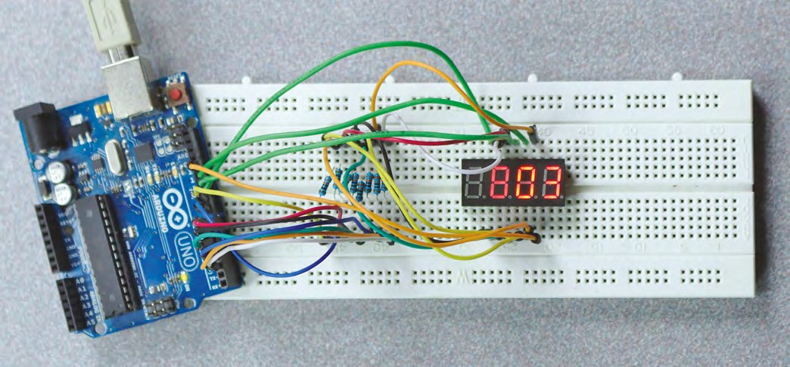
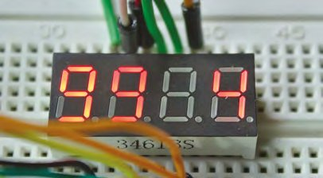
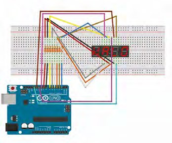
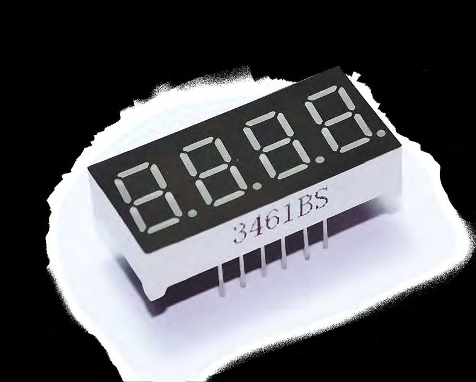

# Capitolul 5 – Programare Arduino: multiplexare, operatori și patru afișaje cu șapte segmente

> *Folosește puterea simplă a operatorilor ca să înmulțești capacitățile proiectului tău fără să adaugi cod*

> **DESPRE AUTOR**
> **Graham Morrison** (@degville) este un jurnalist Linux veteran, aflat într-o căutare de-o viață a muzicii din aranjamentul perfect al siliciului.

> **VEI AVEA NEVOIE DE**
> - 1 × afișaj 3461BS (patru cifre cu șapte segmente)
> - 7 × rezistoare de 330 Ω
> - 20 × fire de legătură
> - Arduino Uno



*Cu multiplexarea poți aprinde mai multe LED-uri decât ai pini. Să înceapă clipitul!*

În capitolul anterior ne-am distrat punând în funcțiune un afișaj cu șapte segmente și scriind codul care îl face să arate ceva util. De data aceasta vom construi pe acele fundații ceva de patru ori mai bun. De exact patru ori mai bun, de fapt, pentru că vom face un upgrade hardware de la o singură cifră la patru, transformând modestul afișaj cu șapte segmente în ceva capabil de mult mai mult: numere până la 9999 în baza zece, și chiar câteva cuvinte.

Primul lucru care ți-a trecut probabil prin minte la acest plan, în afară de a te gândi ce înjurături pot fi afișate, este cum se va lega totul la un Arduino modest. Dacă ai urmat tutorialul anterior, știi că am avut nevoie de opt pini ai lui Arduino ca să controlăm afișajul, exact ca și cum am fi comandat șapte LED-uri separate, ceea ce și este, de fapt, un afișaj cu șapte segmente. Cu opt pini ocupați, nu mai rămân destui pe un Arduino obișnuit pentru încă un afișaj cu șapte segmente, ca să nu mai vorbim de încă trei. Așadar, cum se va face? Răspunsul este multiplexarea (vezi caseta „Multiplexarea” pentru detalii despre cum funcționează).

> **MULTIPLEXAREA**
> Multiplexarea îți permite să comanzi mai multe LED-uri, deci mai multe afișaje cu șapte segmente, profitând de felul în care LED-urile folosesc o diferență de potențial între tensiuni ca să se activeze, în loc să fie pur și simplu „pornite”. Această dependență de o diferență înseamnă că, dacă cei doi pini legați la un segment sunt setați la fel, de exemplu amândoi HIGH sau amândoi LOW, LED-ul nu se aprinde, în timp ce orice diferență între cele două conexiuni, cum ar fi LOW și HIGH sau HIGH și LOW, îl aprinde. Acest comportament poate fi exploatat legând mai multe LED-uri sau segmente la o grilă de conexiuni care se intersectează. Atât timp cât fiecare pereche de conexiuni este unică, de exemplu (A,B), (A,C), (B,C), LED-ul anume care folosește acele conexiuni poate fi vizat. Asta te scutește să îți transformi breadboardul într-un război de țesut, dar înseamnă și că poți comanda mult mai multe LED-uri cu porția modestă de pini digitali I/O ai lui Arduino. Există însă o limitare importantă: doar un element sau segment poate fi aprins la un moment dat. Dacă încerci să aprinzi mai multe, diafonia din matricea de fire va aprinde și alte segmente.

Principala problemă a multiplexării este că poți aprinde doar un segment la un moment dat. Dacă aprinzi mai multe, se vor aprinde și alte segmente de pe alte cifre. Soluția este să aprinzi fiecare LED pentru scurt timp, ca parte a unui ciclu prin LED-urile care trebuie aprinse. Poate părea remarcabil într-o epocă în care calculatoarele pornesc în secunde și paginile web se încarcă în minute, dar Arduino poate face asta destul de repede încât efectul de persistență a vederii, prin care ochii tăi văd în continuare un obiect pentru o clipă după ce el nu mai este vizibil, le face să pară aprinse permanent.



Unitatea pe care o folosim este un afișaj 3461BS cu patru cifre cu șapte segmente, deși fiecare cifră are și un punct zecimal. Această unitate are doisprezece pini, șase pe muchia de sus și șase pe cea de jos, și, deși alte afișaje cu patru cifre pot pune acești pini în alte locuri, configurația fizică va fi aceeași după ce ai identificat (din fișa tehnică a unității) care pin face ce. Fișa afișajului nostru folosește pinii 1, 2, 3, 4, 5, 7, 10 și 11 pentru segmentele E, D, punct zecimal, C, G, B, F și, respectiv, A, iar pinii 6, 8, 9 și 12 pentru catodul sau anodul comun. Aceste ultime patru conexiuni vor fi folosite pentru a multiplexa conexiunile digitale limitate de la Arduino la afișaj. Vezi caseta „Cablarea” pentru mai multe detalii despre cum să le legi la pinii lui Arduino.

> **CABLAREA**
> Pentru a cabla montajul, leagă următorii pini ai lui Arduino la segmentele indicate ale afișajului, printr-un rezistor de 330 Ω. Rezistoarele nu sunt necesare pentru pinii 10–13, ai anodului/catodului comun:
>
> ```
> 2 -> A
> 3 -> B
> 4 -> C
> 5 -> D
> 6 -> E
> 7 -> F
> 8 -> G
> 10 -> D1
> 11 -> D2
> 12 -> D3
> 13 -> D4
> ```



*Cablarea exactă va depinde de specificația și de configurația pinilor afișajului tău*

> **SFAT RAPID**
> Deși recomandăm cu tărie folosirea rezistoarelor, ca să îți protejezi afișajele și placa Arduino, segmentele sunt aprinse doar pentru milisecunde, ceea ce înseamnă că ai putea să te descurci și fără ele.

## Cuvinte de cod

Cu totul cablat, putem în sfârșit să ne jucăm cu cod nou. În loc să pornim de la zero, vom completa codul din capitolul anterior, atât ca să evităm repetițiile, cât și ca să păstrăm continuitatea, dar codul poate fi luat și de la [git.io/vAS8Y](https://git.io/vAS8Y).

Cu vechiul cod încărcat în Arduino IDE, vom începe din capul fișierului cu ceva ce ar fi trebuit să adăugăm de la început: cod care să gestioneze automat dacă afișajul tău cu șapte segmente are configurație cu anod comun sau cu catod comun, așa cum am explicat data trecută. Ca programatori, ar trebui să facem cât mai puține presupuneri despre cei care ne folosesc codul, iar asta înseamnă adesea să facem generice lucrurile care ar putea fi specifice. În acest caz, începem prin a seta o valoare globală, adevărat sau fals, pentru a spune dacă se folosește un afișaj cu anod comun:

```cpp
const bool ANODE = true;
```

Linia aceasta nu face nimic singură, dar, la fel ca tabloul folosit pentru ordinea pinilor conexiunilor, este folosită mai târziu de logica programului, ca să îi schimbe comportamentul. Dacă am folosi C-ul de modă veche, am declara de obicei o constantă globală ca aceasta cu o instrucțiune `#define`. Compilatorul înlocuiește apoi, efectiv, valoarea definită oriunde este referită în cod. Dar pentru limbajul lui Arduino, derivat din Processing, se recomandă `const`, pentru că respectă mai bine regulile de vizibilitate a variabilelor (*scoping*), ceea ce înseamnă că este mult mai sigur când lucrezi cu mai multe fișiere.

## Operatori pe biți

Singura parte a codului căreia îi pasă dacă afișajul folosit are anod sau catod comun este cea care setează valorile HIGH sau LOW pentru segmente. Asta pentru că un afișaj cu anod comun are nevoie de semnalele opuse față de cel cu catod comun. Comportamentul poate fi descris cu ceva numit „tabel de adevăr”, un instrument foarte util pentru a înțelege cerințele hardware-ului tău și cum ar putea fi ele implementate cel mai bine în cod. În cazul nostru, un tabel de adevăr poate arăta cum vrem să inversăm ieșirea în funcție de folosirea sau nu a unei configurații cu anod comun. Folosind 0 pentru stins și 1 pentru aprins, tabelul ar arăta așa:

| | A | B | Ieșire |
|---|---|---|---|
| 1. | 0 | 0 | LOW |
| 2. | 0 | 1 | HIGH |
| 3. | 1 | 0 | HIGH |
| 4. | 1 | 1 | LOW |

1. Dacă segmentul e stins (A=0) și afișajul nu e cu anod comun (B=0), ieșirea este LOW.
2. Dacă segmentul e stins (A=0) și afișajul e cu anod comun (B=1), ieșirea este HIGH.
3. Dacă segmentul e aprins (A=1) și afișajul nu e cu anod comun (B=0), ieșirea este HIGH.
4. Dacă segmentul e aprins (A=1) și afișajul e cu anod comun (B=1), ieșirea este LOW.

Motivul pentru care punem totul pe hârtie așa este că un comportament simplu, descris printr-un tabel de adevăr, poate fi transpus în operatori logici speciali din cod. Probabil cunoști deja operatorii logici AND (ȘI) și OR (SAU): primul activează ieșirea când intrarea 1 ȘI intrarea 2 sunt active, iar al doilea activează ieșirea când fie intrarea 1, fie intrarea 2 este activă, inclusiv când sunt amândouă. Tabelele lor de adevăr arată așa:

| A | B | AND | | A | B | OR |
|---|---|---|---|---|---|---|
| 0 | 0 | 0 | | 0 | 0 | 0 |
| 0 | 1 | 0 | | 0 | 1 | 1 |
| 1 | 0 | 0 | | 1 | 0 | 1 |
| 1 | 1 | 1 | | 1 | 1 | 1 |

În C-ul lui Arduino, operatorii care prelucrează această intrare simplă se uită la biți individuali, valorile adevărat și fals, iar acestea corespund direct porților logice și codului de nivel jos. Asta îi face pe acești operatori incredibil de eficienți, motiv pentru care merită întotdeauna să încerci să îți refactorizezi codul în acești termeni computaționali simpli.

Întorcându-ne la exemplul nostru și la cerința de a inversa intrarea pentru afișajele cu anod comun, primul tabel de adevăr corespunde exact unui operator numit XOR, sau „sau exclusiv”. X-ul îl deosebește de OR-ul obișnuit de mai sus prin faptul că nu dă o ieșire pozitivă când ambele intrări sunt active (adică 1 în tabelul de adevăr).

Vom folosi acest operator într-o funcție nouă, care izolează comenzile `digitalWrite`:

```cpp
void setSegment(int pin, bool state) {
  if (state ^ ANODE) {
    digitalWrite(pin, HIGH);
  } else {
    digitalWrite(pin, LOW);
  }
}
```

Operatorul XOR apare pe a doua linie, sub forma simbolului circumflex (`^`). Funcția este apelată cu două argumente: pinul căruia i se trimite semnalul și dacă acel pin trebuie să fie HIGH sau LOW. Eficiența vine din faptul că putem verifica atât starea cerută, cât și dacă valorile trebuie inversate, cu o singură comandă XOR, care se va comporta exact ca primul tabel de adevăr.

## De patru ori șapte

Acum trebuie să completăm rutinele originale, ca să se descurce atât cu noile cifre, cât și cu metoda noastră de a le afișa. Începem cu un tablou nou, care ține numerele pinilor pentru conexiunile la anodul sau catodul comun. Acest tablou se va numi `digPin`, iar ordinea inversă folosită, 13, 12, 11 și 10, este intenționată, pentru că aceștia sunt legați de la cifra cea mai puțin semnificativă la cea mai semnificativă, ceea ce ne va ajuta când scriem logica programului. De asemenea, actualizăm valorile pinilor din tabloul `segPin`, pentru că ne-am reorganizat circuitul ca să folosească pinii în ordine, în locul abordării haotice „bagă-n priză și roagă-te” de data trecută:

```cpp
const byte segPin[8] = {2, 3, 4, 5, 6, 7, 8, 9};
const byte digPin[4]  = {13, 12, 11, 10};
```

> **SFAT RAPID**
> Dacă legi pinii segmentelor la aceiași pini Arduino folosiți data trecută, nu va trebui să modifici codul pentru caractere și pentru ordinea pinilor.

Funcția `setup` trebuie și ea actualizată, ca să inițializeze noii pini folosiți. Pentru asta adăugăm pur și simplu încă o buclă `for`, care se ocupă de pinii folosiți pentru selectarea cifrelor:

```cpp
void setup() {
  for (int i = 0; i < 8; i++) {
    pinMode(segPin[i], OUTPUT);
  }
  for (int i = 0; i < 4; i++) {
    pinMode(digPin[i], OUTPUT);
  }
}
```



*Noi am folosit ieftinul și ușor de găsit 3461BS pentru acest proiect, dar aproape orice alt afișaj cu patru cifre cu șapte segmente va merge*

Următoarele funcții noi vor fi folosite pentru a afișa un număr pe unul dintre cele patru afișaje, în loc de a afișa un număr pe singurul afișaj programat data trecută. Marea diferență a acestei implementări este multiplexarea, realizată punând mai întâi pinul comun al cifrei pe HIGH, scriind numărul pe afișajul cu șapte segmente, așteptând o perioadă ca numărul să rămână vizibil și apoi punând pinul comun pe LOW, ca să încheiem desenarea.

Iată codul:

```cpp
void displayDigit(int digit, int number) {
  digitalWrite(digPin[digit], HIGH);
  for (int i = 0; i < 8; i++) {
    setSegment(segPin[i], segNum[number][i]);
  }
  delay(5);
  digitalWrite(digPin[digit], LOW);
}
```

Funcția `delay` pune execuția codului pe pauză, lăsând caracterul de pe afișaj să zăbovească un număr stabilit de milisecunde. Cele 5 milisecunde folosite de noi sunt practic imperceptibile pentru ochiul uman, dar dacă vrei să vezi cum funcționează multiplexarea, pune ceva de genul 200 (o cincime de secundă) și urmărește cum fiecare afișaj cu șapte segmente se actualizează cu câte un număr diferit.

Ultima piesă a acestui puzzle este transformarea funcției `displayNum` folosite data trecută, ca să se adapteze la patru cifre în loc de una. Sarcina principală a noilor adăugiri va fi să spargă un număr de patru cifre, cum ar fi 2543, în cifrele lui componente, care pot fi trimise apoi individual către fiecare afișaj. Pentru asta ne vom baza pe un alt operator incredibil de util, modulo, care folosește caracterul procent (`%`). Modulo întoarce restul unei împărțiri, în loc de numărul de câte ori un număr încape în altul. Asta îl face util în bucle, pentru că un zero este adesea interpretat ca fals, dar este perfect și pentru desprinderea cifrelor. `1234 % 10`, de exemplu, va întoarce ultima cifră, 4. Dacă împărțim apoi numărul la 10 și aplicăm din nou modulo, obținem următoarea cifră. Și exact asta facem în această funcție:

```cpp
void displayNum (int number) {
  int tens = 0;
  while (tens < 4) {
    displayDigit(tens++, number % 10);
    number /= 10;
  }
}
```

Codul de mai sus include un ultim operator nou, operatorul `/=`. Este strâns înrudit cu operatorii iterativi la care ne-am uitat data trecută, dar, în loc să incrementeze o valoare, aici împarte `number` la 10 și atribuie rezultatul lui `number` într-o singură comandă.

Tot ce mai rămâne de făcut este să actualizăm bucla principală, ca să eliminăm întârzierea și să numărăm până la un număr suficient de mare. E la fel de simplu ca schimbarea ei în următoarea formă:

```cpp
void loop() {
  for (int i = 0; i <= 9999; i++) {
    displayNum(i);
  }
}
```

Cu asta gata, încarcă codul pe Arduino și prefă-te că ai contorul Geiger suprem. Codul poate fi găsit aici: [git.io/vxMZ6](https://git.io/vxMZ6).

> **NOTA TRADUCĂTORULUI**
> GitHub a retras în 2022 serviciul de scurtare a adreselor git.io, așa că linkurile de forma git.io/… din carte pot să nu mai funcționeze. Tot codul din acest capitol este însă reprodus integral mai sus, iar versiunea completă a sketch-ului se obține combinând fragmentele de aici cu tabloul `segNum` și funcțiile din capitolul anterior.
