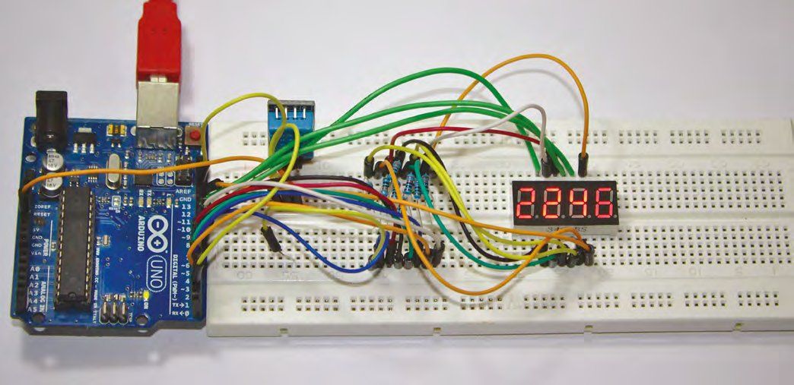
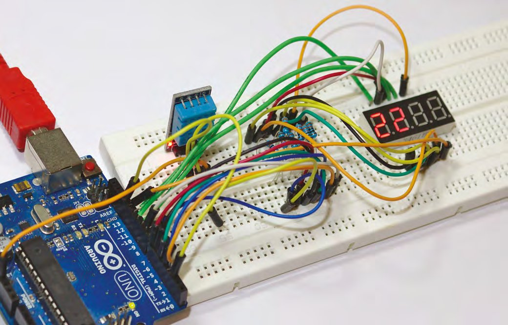
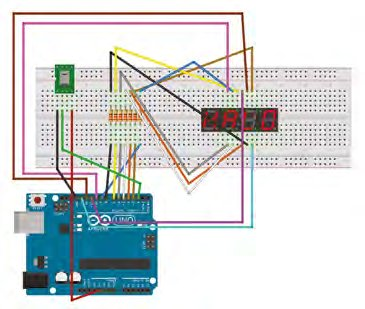
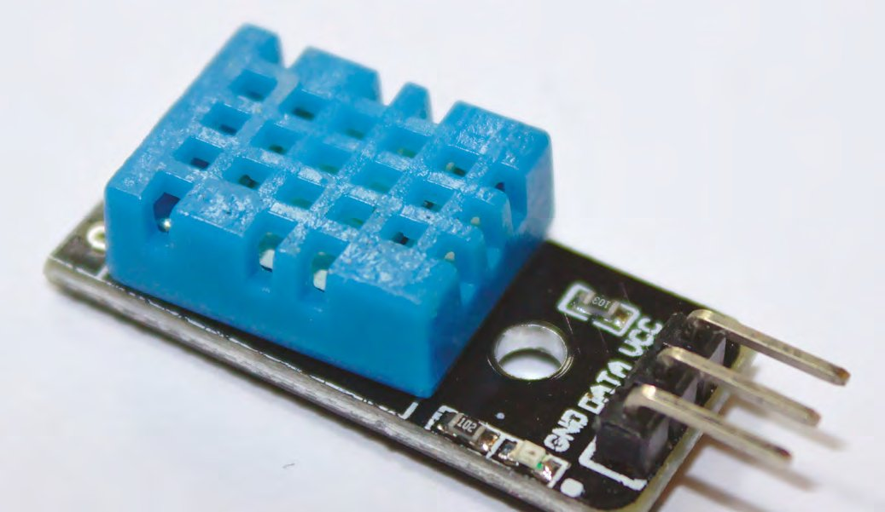
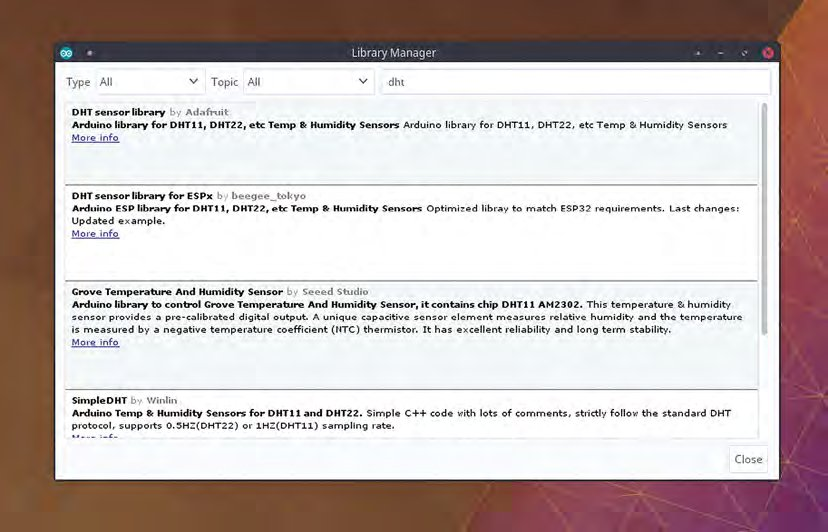
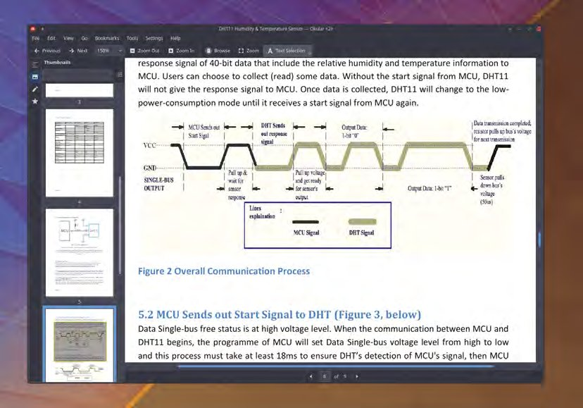

# Capitolul 6 – Programare Arduino: temperatură, umiditate și biblioteci

> *Adaugă citiri de temperatură și umiditate apelând la expertiza și cunoștințele altora, cu doar câteva linii de cod proprii*

> **DESPRE AUTOR**
> **Graham Morrison** (@degville) este un jurnalist Linux veteran, aflat într-o căutare de-o viață a muzicii din aranjamentul perfect al siliciului.

În capitolul anterior ne-am folosit abilitățile abia născute de programare în C ca să extindem ce învățaserăm despre afișajele cu șapte segmente la controlul a patru afișaje deodată, toate de pe același Arduino Uno. Am terminat cu afișajul numărând de la 0 la 9999 iar și iar, ca un Sisif de 5 volți. Asta înseamnă că avem acum posibilitatea de a afișa un număr de patru cifre. Sau poate două numere mai mici, unul lângă altul…

Pentru prima dată, în loc să folosim Arduino doar ca să gestioneze un set sofisticat de LED-uri, îl vom folosi ca să măsoare ceva și apoi să afișeze rezultatul acelor măsurători. Iar pentru asta ne vom transforma afișajele cu șapte segmente într-un termometru și, în același timp, într-un monitor de umiditate. Componenta hardware în jurul căreia construim acest proiect este un modul cu senzor DHT11. Sunt ieftine, ușor de găsit, iar conceptele pe care le folosim pentru a lega unul la Arduino sunt aproape universale.

Modulul combină un senzor de temperatură cu unul de umiditate, iar partea grozavă este că e incredibil de ușor de folosit. De exemplu, modulele sunt precalibrate, ceea ce înseamnă că nu trebuie să ne facem griji pentru validitatea valorilor primite, și trimit valorile atunci când sunt întrebate corect. Nici conectarea unuia la propriile proiecte nu ar putea fi mai simplă, pentru că un singur pin digital trebuie legat la Arduino. Acest pin se ocupă de toată comunicarea dintre modul și Arduino, singurele alte conexiuni fiind VCC de 3 V–5 V pentru alimentare și GND pentru masă, ambele putând fi furnizate de Arduino. Există și o variantă cu patru pini, dar pinul suplimentar poate fi ignorat. Fișa tehnică recomandă și un rezistor de *pull-up* de 5 kΩ legat la firul de date.



*Cablarea exactă va depinde de fișa tehnică și de configurația pinilor afișajului tău*

> *Modulul combină un senzor de temperatură cu unul de umiditate, iar partea grozavă este că e incredibil de ușor de folosit*

## Hardware

Motivul pentru care am ales DHT11 în locul unuia dintre frații lui mai capabili, cum ar fi DHT22, este că DHT11 returnează doar valori întregi pentru temperatură și umiditate. Ar fi o limitare dacă ai avea nevoie de un monitor mai precis, de exemplu un senzor de temperatură atașat la un fermentator de bere, dar e destul de precis pentru nevoile noastre. De fapt, cum intenționăm să legăm ieșirea senzorului la patru afișaje cu șapte segmente, avem doar patru cifre la dispoziție: vom pune temperatura pe o parte și umiditatea pe cealaltă. Asta face DHT11 perfect pentru noi. Dar îi poți extinde ușor capacitățile schimbând senzorul și folosind doar valoarea temperaturii pe toate cele patru cifre, sau chiar montând un rând de LED-uri pe post de grafic cu bare pentru temperatura de azi.



*Vezi în timp real schimbările de temperatură și umiditate pe afișajul tău cu șapte segmente*

> **CABLAREA**
> Circuitul acestui proiect se construiește pe cel din capitolul anterior, adăugând un senzor de temperatură și umiditate DHT11. Cei trei pini ai senzorului trebuie legați la 5 V și GND, furnizați de Arduino, cu pinul de date legat la pinul digital 2 al lui Arduino. Fișa tehnică a senzorului nostru cerea și un rezistor de 5 kΩ între firele de 5 V și de date, cu un condensator opțional de 100 nF între alimentare și GND, pentru filtrarea alimentării.
>
> Linia de date către senzor poate avea până la 20 de metri, ceea ce poate fi util pentru măsurători în grădină!



Acum ne vom arunca în cod ca să facem acest proiect să funcționeze. În mod normal, în acest punct ar trebui să descompunem exact ce se întâmplă în circuitul nostru. În capitolul anterior am tratat multiplexarea, de exemplu, ca mod de a lega multiplele segmente ale afișajului la numărul limitat de pini digitali ai lui Arduino. La fel, în mod obișnuit ar trebui să înțelegem exact cum se comunică cu DHT11 și cum se interpretează datele pe care le trimite senzorul înapoi. Ar fi în sine o treabă complexă, chiar și pentru un senzor simplu ca DHT11. El folosește un singur pin, o magistrală de date 1-Wire, atât pentru a primi semnale, cât și pentru a trimite datele, ceea ce ne-ar cere să înțelegem protocolul pe care îl folosește. Dacă ai noroc, protocolul este bine definit și chiar furnizat de producător, lăsându-te să implementezi codul în felul care ți se potrivește. Dar adesea aceste protocoale nu sunt documentate și trebuie descoperite prin inginerie inversă, fie prin experimente, fie analizând intrările și ieșirile unui senzor într-o configurație funcțională.



*DHT11 conține un senzor calibrat de temperatură și umiditate și poate funcționa la peste 20 de metri de Arduino*

Din fericire, majoritatea producătorilor de DHT11 oferă și o fișă tehnică foarte informativă, care acoperă nu doar specificațiile și toleranțele hardware, ci și detaliile comunicării cu senzorul prin magistrala de date 1-Wire. Citind această specificație, afli că senzorul are nevoie de o secundă întreagă fără semnal pentru a trece de o stare inițială „instabilă”, iar apoi poți trimite pe magistrală un semnal de peste 18 ms pentru a iniția o cerere. Semnalul de răspuns este un pachet de 40 de biți care conține atât umiditatea relativă, cât și temperatura. Dar nu trebuie să ne facem griji pentru nimic din toate acestea, datorită a ceea ce se numesc biblioteci.

> *Din fericire, majoritatea producătorilor de DHT11 oferă și o fișă tehnică foarte informativă*

> **SFAT RAPID**
> Ai întâlnit biblioteci și pe sistemul tău de operare preferat, dar acolo sunt de obicei fișiere-obiect compilate, generate din codul sursă, pe baza cărora alte unelte pot compila pentru a le accesa funcțiile, fără să fie construite din codul sursă al bibliotecii.

## Bibliotecile

Până acum ne-am împărțit codul în funcții, care se comportă ca unități de sine stătătoare, apelate ori de câte ori ne convine. Apelăm funcția `displayNum` ca să arătăm un număr pe afișajul cu șapte segmente, de exemplu. Nu trebuie să ne facem griji pentru felul în care se aprind LED-urile, cum sunt afișate sau ordonate numerele și nici măcar cum sunt gestionate întârzierile pentru multiplexare: apelăm pur și simplu funcția cu un singur argument, numărul pe care vrem să îl afișăm. Am putea muta această funcție în propriul fișier, asigurându-ne că fișierul conține toate informațiile și variabilele de care are nevoie. Apoi am putea refolosi fișierul în alte proiecte sau l-am putea împărtăși cu programatori care vor aceeași funcționalitate fără să reinventeze mereu roata. Vezi unde bat. C include (aluzie!) un mod de a importa conținutul unui fișier extern, ca să poți accesa acele funcții externe din propriul cod. Și exact asta este o bibliotecă. De fapt, adaugi o bibliotecă în proiect folosind cuvântul-cheie special `#include`, de obicei chiar în capul fișierului sursă.

O bibliotecă este de obicei un grup de funcții, împreună cu toate definițiile, structurile și variabilele necesare ca acele funcții să lucreze ca o bucată de cod de sine stătătoare. Ca să țină aceste părți izolate de codul tău, și ca să împiedice părți din codul tău să cadă în domeniul de vizibilitate al bibliotecii (și invers), o bibliotecă este împărțită în două fișiere. Codul care face treaba este scris în fișierul „.cpp”, analog fișierelor „.ino” create de Arduino IDE. Dar partea pe care o imporți în propriul proiect cu `#include` se numește interfață și este scrisă într-un fișier „antet” (*header*), cu sufixul „.h”. Se numește antet pentru că, în esență, comanda `include` îi lipește conținutul acolo unde este pusă comanda, aproape întotdeauna în capul fișierului sursă. Antetul nu include nicio funcționalitate, dar include definițiile-șablon pentru structura și pentru toate funcțiile și variabilele pe care le vei folosi. Așa află compilatorul de existența și capacitățile lor, fără să includă funcționalitatea în codul tău. Și fișierul „.cpp” își va „include” propriul antet, pe măsură ce umple șablonul cu implementarea.



*Bibliotecile pot fi adăugate manual sau prin Arduino IDE. Sunt geniale pentru a face hardware-ul complex ușor de folosit*

> **AFIȘAJ CARE PÂLPÂIE**
> Un lucru pe care îl poți observa când rulezi codul acestui proiect, în funcție de cât de sensibil ești, este că afișajele cu șapte segmente încep să pâlpâie. Cauza este timpul de procesare și de așteptare a datelor de la senzor, și este o problemă incredibil de frecventă. Există un compromis direct între numărul de sarcini pe care i le ceri lui Arduino și capacitatea lui de a ține un ritm constant de actualizare pentru ceva precum un afișaj. De aceea s-au inventat *bufferele*: ca să poată fi umplute în perioadele liniștite și citite când sistemul este ocupat; cu siguranță există proiecte care ar putea actualiza afișajele dintr-un buffer. Dar putem face multe și din cod, și deși vom analiza opțiuni mai avansate, cum ar fi întreruperile, în capitolele următoare, există o parte a proiectului care poate fi îmbunătățită acum: apelul `delay()` din funcția `displayDigit()`. Această întârziere era necesară pentru a crea destulă persistență pe afișaj încât caracterele să fie ușor vizibile, dar, cum acum se face mai multă procesare în corpul codului, întârzierea poate fi redusă. Noi am obținut cele mai bune rezultate reducând-o la 2 ms, astfel încât codul arată așa:
>
> ```cpp
> void displayDigit(int digit, int number) {
>   digitalWrite(digPin[digit], HIGH);
>   for (int i = 0; i < 8; i++) {
>     setSegment(segPin[i], segNum[number][i]);
>   }
>   delay(2);
>   digitalWrite(digPin[digit], LOW);
> }
> ```

Poți răsfoi și descărca biblioteci automat cu Arduino IDE. Funcția se accesează alegând Include Library > Manage Libraries din meniul Sketch; cauți ce te interesează, de exemplu DHT11, și apeși Install pe rezultat. Totuși, credem că merită să faci asta manual prima dată, ca să vezi cum funcționează. Datorită popularității hardware-ului, există mai multe biblioteci care fac ușor accesul la DHT11. Cea pe care o vom folosi se numește „DHT Library” și are avantajul de a fi compatibilă cu senzorii DHT11, 21, 22, 33 și 44, așa că îți poți îmbunătăți hardware-ul din proiect fără să schimbi bucăți mari din logica codului.

Ia cele mai noi fișiere `dht.cpp` și `dht.h` din depozitul GitHub: [git.io/vpudX](https://git.io/vpudX).



*Fișa tehnică a DHT11 include analiza protocolului pe un singur fir. Compararea ei cu implementarea din bibliotecă este un mod grozav de a învăța lucruri noi*

> **SFAT RAPID**
> Un alt avantaj al magistralei de date 1-Wire folosite de DHT11, pe lângă cost, este că poate funcționa pe distanțe uriașe, chiar și 20 de metri fiind fezabili. Grozav pentru aplicații în exterior.

Există numeroase moduri de a include aceste fișiere în proiect. Poți, de exemplu, să îți creezi propriile fișiere de interfață și de implementare și să le pui în același dosar cu fișierul proiectului. Apoi folosești comanda `include` cu ghilimele duble, ca să adaugi biblioteca din locația curentă:

```cpp
#include "dht.h"
```

Mediul de construire Arduino caută și în dosarul `libraries`, aflat imediat sub locul unde stau proiectele tale, și acolo vei găsi toate bibliotecile instalate prin Arduino IDE. Tot acolo am pus și noi fișierele descărcate `dht.cpp` și `dht.h`, într-un dosar numit DHT. Cum această locație face parte din calea mediului de construire, poți include orice bibliotecă din dosarul de sistem `libraries` folosind semnele mai mare/mai mic în jurul numelui bibliotecii, și exact asta vom face în proiectul nostru, adăugând următoarea linie la rezultatul final al codului din capitolul anterior:

```cpp
#include <dht.h>
```

## Obiecte

Așa cum te uiți la specificațiile hardware ca să înțelegi cum să îți folosești componentele, poți folosi un fișier antet ca să înțelegi capacitățile unei biblioteci și cum au fost implementate funcțiile ei. În particular, `dht.h` pune aproape totul într-o „clasă”. Nu am discutat încă despre astfel de clase în aventura noastră de programare, dar am discutat despre toate componentele care intră în ele și le fac utile. O clasă este un set de funcții și variabile grupate laolaltă în ceva care se comportă foarte asemănător cu un tip propriu. Spre deosebire de un fișier antet, o clasă este creată ca să poată fi atribuită direct în codul tău, permițând setarea de valori în interiorul tipului ei și rularea de operații asupra stării ei, fără ca domeniul de vizibilitate al codului tău să îl afecteze pe cel al clasei. Ca să adăugăm acest tip în proiectul nostru, trebuie să scriem:

```cpp
dht ourDHT;
```

> *O clasă este un set de funcții și variabile grupate laolaltă în ceva care se comportă foarte asemănător cu un tip propriu*

Dacă te uiți în fișierul antet al bibliotecii, vei vedea că numele dat clasei este `dht`, pe care îl folosim în propriul cod exact cum am folosi `int` sau `float`. Partea genială a folosirii unei astfel de biblioteci este că, acum că avem `ourDHT` creat prin definiția din bibliotecă, aproape că putem începe să ne folosim senzorul. Tot ce mai trebuie, dacă citești documentația bibliotecii, este o instrucțiune `#define` care să îi spună clasei ce pin folosim pentru linia de date:

```cpp
#define DHT11_PIN 2
```

> **SFAT RAPID**
> O clasă este compusă din elemente publice și private. După cum le spune și numele, elementele publice pot fi manipulate din codul tău, în timp ce elementele private sunt destinate doar funcționării interne a clasei.

Așa cum am discutat, o instrucțiune `define` este de fapt doar o definiție globală care înlocuiește șirul cu valoarea atribuită, în cazul nostru pinul digital 2 de pe Arduino Uno. Definiția se va infiltra în funcțiile clasei, astfel încât totul să funcționeze corect. Dacă ai o memorie genială, ai observat deja că același pin este folosit deja pentru comanda afișajului cu șapte segmente. De fapt, mai avem un singur pin liber, pinul 9. Am putea lega pur și simplu pinul de date al DHT11 la acesta și schimba `define`-ul, dar nouă ne-a fost mai ușor să mutăm firul afișajului de la pinul 2 la pinul 9 și apoi să actualizăm tabloul de pini ca să reflecte schimbarea:

```cpp
const byte segPin[8] = {9, 3, 4, 5, 6, 7, 8};
```

Ajungem acum la partea în care ne ocupăm de toată complexitatea calculării variațiilor de temperatură și a protocoalelor de comunicare. Numai că nu o facem. Tot ce trebuie să facem este să așteptăm un semnal de „gata” de la senzor înainte de a citi valorile temperaturii și umidității din clasa care se ocupă de toată complexitatea în locul nostru. Pentru a obține temperatura, de exemplu, ai putea scrie pur și simplu `float newtemp = ourDHT.temperature;`. Punctul de după numele clasei înseamnă că `temperature` este un membru al clasei, așa cum descrie antetul. Nu trebuie să ne pese cum a ajuns valoarea în `ourDHT.temperature`, doar că a fost atribuită lui `temperature`, pe care acum îl atribuim lui `newtemp`. Asta e atât de genial la folosirea bibliotecilor. Dar nici măcar nu trebuie să facem asta, pentru că, dacă înmulțim temperatura cu 100 ca să o mutăm cu două cifre la stânga și adăugăm apoi citirea umidității, putem face tot pasul în aceeași comandă care trimite valorile la afișaj.

Asta înseamnă că întreaga noastră funcție `loop()` are nevoie de doar două linii:

```cpp
void loop() {
  int chk = ourDHT.read11(DHT11_PIN);
  displayNum((ourDHT.temperature*100)+ourDHT.humidity);
}
```

Și asta e tot. Ca de obicei, pentru concizie, am omis orice cod de verificare a erorilor senzorului, dar chiar ar trebui adăugat, ca temă pentru acasă. Altfel, trimite codul la Arduino și am terminat. Poți descărca sursa actualizată a acestui proiect de la [git.io/vpzvg](https://git.io/vpzvg).
