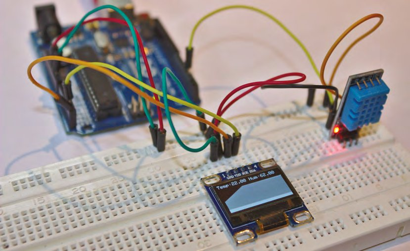
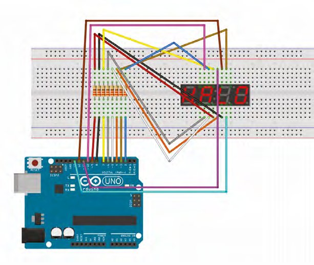
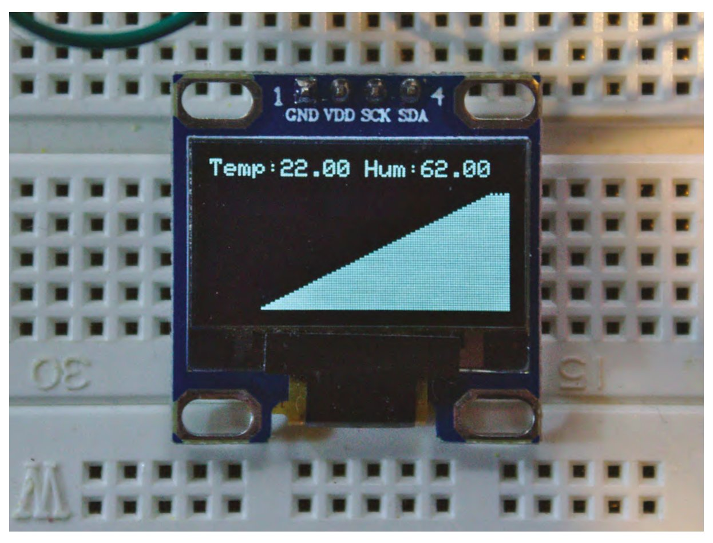
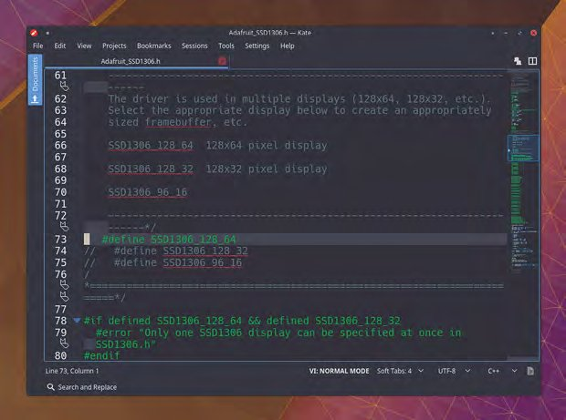
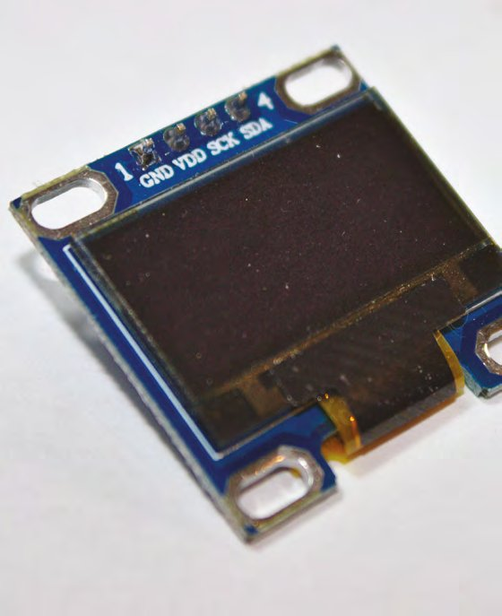
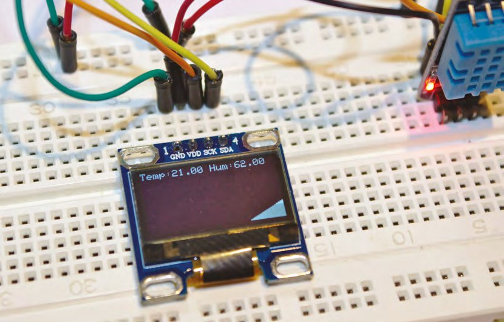
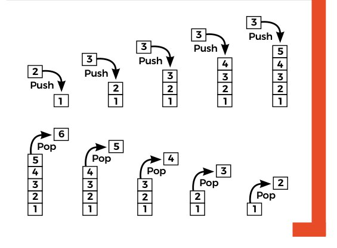
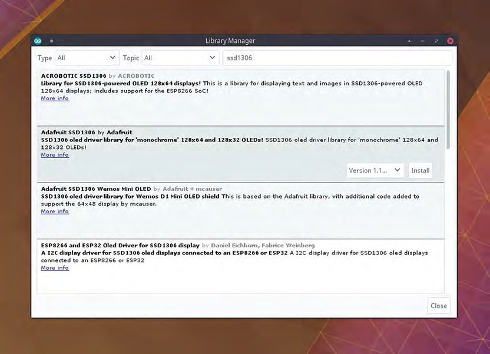
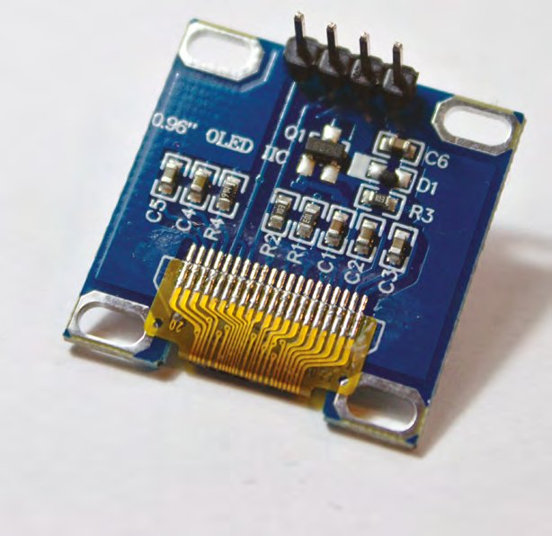

# Capitolul 7 – Programare Arduino: stive, clase și afișaje derulante

> *Învață tehnici noi de programare și impresionează-ți prietenii cu cel mai arătos termometru din lume*

> **DESPRE AUTOR**
> **Graham Morrison** (@degville) este un jurnalist Linux veteran, aflat într-o căutare de-o viață a muzicii din aranjamentul perfect al siliciului.

> **VEI AVEA NEVOIE DE**
> - Un afișaj grafic OLED monocrom SSD1306 de 0,96", 128 × 64
> - Un senzor digital de temperatură și umiditate DHT11

În capitolul anterior ne-am extins atât cunoștințele de programare în C, cât și potențialul de vizualizare a datelor, folosind o bibliotecă: ne-am urcat pe umerii metaforici ai giganților și am importat cod scris de alți programatori. Departe de a fi o trișare sau o soluție leneșă, așa se dezvoltă aproape orice proiect. Bibliotecile și rudele lor apropiate, API-urile, le permit programatorilor să folosească tot felul de funcționalități avansate fără să reinventeze mereu roata. Mai mult, beneficiezi și de înțelepciunea de programare care a intrat în dezvoltarea unei biblioteci, înțelepciune care se poate întinde uneori pe generații, când e vorba de biblioteci de sistem vechi, lucru mai adevărat în C decât în multe limbaje moderne.

În acest capitol vom folosi două biblioteci noi ca să facem niște lucruri magice care altfel ar lua un an întreg de tutoriale. Vom folosi același senzor de temperatură și umiditate de dinainte, dar trecem de la austeritatea hipsterească a afișajelor cu șapte segmente la o lume cu totul nouă de utilitate: un ecran adevărat. Ecranul pe care îl folosim este cunoscut drept SSD1306. Se găsește ușor și costă foarte puțin, și totuși are un afișaj OLED luminos, cu rezoluția de 128 × 64. Este și minuscul, ceea ce îl face perfect pentru proiecte embedded în care trebuie să afișezi ceva mai multe detalii decât câteva numere. De fapt, vom folosi acest afișaj pentru a crea o histogramă în timp real care derulează lateral, ca să poți vedea schimbările de temperatură în timp dintr-o simplă privire.



*Proiectul finalizat arată atât temperatura, cât și umiditatea, împreună cu un grafic al schimbărilor recente de temperatură*

> *Vom folosi două biblioteci noi în acest capitol ca să facem niște lucruri magice care altfel ar lua un an întreg de tutoriale*

> **CABLAREA**
> Unul dintre lucrurile plăcute la afișajul SSD1306 pe care îl folosim, ca și la multe dintre derivatele lui, este că se înfige direct în breadboard, fără fire suplimentare. Semnalul purtat de fiecare dintre cei patru pini este notat deasupra ecranului, ceea ce înseamnă că poți vedea ce face fiecare pin chiar și cu placa înfiptă. E deosebit de important, pentru că trebuie să fii atent care pin poartă alimentarea (de obicei notat VCC) și care este masa (GND). Inversează-le și s-ar putea să strici ecranul, placa Arduino sau amândouă. Trebuie să verifici și că cerințele de alimentare ale plăcii se potrivesc cu Arduino; a noastră este 3 V ~ 5 V DC. Alimentarea trebuie legată direct la 5 V pe Arduino, iar masa la pinul GND de lângă acesta.
>
> Totuși, trebuie să legăm și senzorul de temperatură și umiditate la aceiași pini de alimentare. Cel mai bun mod este să folosim „șinele” de alimentare și de masă de pe un breadboard obișnuit. De obicei sunt două pe marginea exterioară a fiecărei laturi lungi a breadboard-ului, iar legând 5 V de la Arduino la una dintre ele și GND la cealaltă, alimentarea și masa ajung la orice pin conectat de-a lungul șinei. Cu aceste conexiuni făcute, nu mai rămâne decât să faci o legătură de la șina de 5 V la VDD pe ecran și alta de la șina de 5 V la VCC pe senzor, și la fel pentru ambii pini GND.
>
> Ecranul și Arduino comunică prin protocolul I2C, care cere folosirea unor pini anume de pe Arduino. Acești doi pini, notați de obicei SCL și SDA pe ecran, trebuie legați la pinii corespunzători de pe Arduino, care pot fi diferiți în funcție de placa folosită. Cum noi folosim un Uno R3, SCL este pinul analogic 5, iar SDA este pinul analogic 4. La final, pinul de date al senzorului de temperatură și umiditate se leagă la pinul digital 2 al lui Arduino, ca în capitolul anterior.



*Ecranul și senzorul folosesc aceleași șine de 5 V și GND de pe breadboard*

## Codul

Vom folosi două biblioteci noi. Prima este echivalentul bibliotecii DHT, dar pentru ecran. Ea ne permite să accesăm ușor hardware-ul, fără să înțelegem sau să descoperim prin inginerie inversă protocolul pe care îl folosește ca să vorbească cu Arduino. Minunata Adafruit oferă această bibliotecă, numită Adafruit_SSD1306. A doua bibliotecă este tot de la Adafruit, Adafruit_GFX, și oferă o colecție de „primitive” grafice pentru desenarea de linii, dreptunghiuri și text, fără să scriem noi algoritmii. Ambele biblioteci se instalează deschizând dialogul de biblioteci din Arduino IDE (Sketch > Include Library > Manage Libraries…), căutând numele bibliotecilor și apăsând „Install” pe rezultatul corect.



*Afișajul pe care îl folosim are mai puțin de un inch lățime, ideal pentru instalații IoT minuscule și dispozitive de sine stătătoare*

Înainte să ne apucăm de scris propriul cod, trebuie să modificăm fișierul antet al bibliotecii Adafruit_SSD1306. Fără această modificare, ecranul nostru ar afișa doar fiecare a doua linie, pentru că antetul este scris fix pentru o rezoluție de 128 × 32 în loc de 128 × 64. Ca să o schimbi, deschide `Adafruit_SSD1306.h` (de obicei în Arduino/libraries/Adafruit_SSD1306) și decomentează `#define SSD1306_128_64`, ștergând primele două bare oblice (linia 73 în versiunea noastră). Adaugă două bare la începutul liniei `#define SSD1306_128_32`, ca să comentezi vechea rezoluție, și salvează fișierul. Codul tău ar trebui să arate așa:

```cpp
#define SSD1306_128_64
//   #define SSD1306_128_32
//   #define SSD1306_96_16
```

> **NOTA TRADUCĂTORULUI**
> Versiunile actuale ale bibliotecii Adafruit_SSD1306 nu mai cer modificarea antetului: rezoluția se transmite la creare, de exemplu `Adafruit_SSD1306 display(128, 64, &Wire, -1);`, iar `display.begin(SSD1306_SWITCHCAPVCC, 0x3C)` rămâne la fel. Dacă folosești o bibliotecă nouă, sari peste acest pas.



*Trebuie să modifici antetul driverului de ecran ca să te asiguri că folosește rezoluția corectă pentru afișajul tău*

Cu asta rezolvat, hai să începem noul nostru proiect. Deși scheletul codului este asemănător cu cel din capitolul anterior, vom schimba cea mai mare parte a implementării. În capul fișierului vrem să includem cele două antete noi, alături de `dht.h` pentru senzor:

```cpp
#include <dht.h>
#include <Adafruit_SSD1306.h>
#include <Adafruit_GFX.h>
```

Sub aceste linii vom folosi trei instrucțiuni `#define` ca să fixăm valori globale, care ne scutesc de modificarea codului propriu-zis când apar diferențe de hardware:

```cpp
#define DHT11_PIN 2
#define SCREENADR 0x3C
#define MAXSTACK 128
```

Prima linie setează pinul conectat la senzorul de temperatură și umiditate, la fel ca în capitolul anterior. A doua linie este adresa I2C a ecranului. Ecranul și Arduino comunică prin protocolul I2C și, pentru că prin I2C se pot conecta mai multe dispozitive, fiecare se deosebește printr-o adresă. A noastră este 0x3C. Ar trebui să fie în documentația ecranului, sau chiar imprimată pe PCB, dar poți rula și un script care sondează toate dispozitivele I2C conectate și returnează adresa fiecăruia, dacă ai nevoie ([hsmag.cc/kigPeT](https://hsmag.cc/kigPeT)).

> **SFAT RAPID**
> Folosirea funcției de text cere o culoare de prim-plan și una de fundal. Fără culoare de fundal, când textul se actualizează va părea corupt, pentru că pixelii vechiului text rămân în fundal.

A treia instrucțiune din codul de mai sus este preludiul unui concept nou și important pe care îl introducem în acest capitol: ceva numit „stivă” (*stack*). Vom folosi o stivă simplificată pentru a păstra 128 de măsurători separate de temperatură, ca să putem desena o histogramă a schimbărilor de temperatură în timp. Te-ai putea întreba de ce nu folosim un simplu tablou pentru aceste valori, dar asta pentru că vrem ca histograma să deruleze în timp real pe măsură ce se adaugă temperaturi. Dacă am actualiza pur și simplu valorile unui tablou pe rând, histograma s-ar desena pe ecran de la stânga la dreapta și apoi s-ar reseta la marginea din stânga, cum vezi în multe astfel de implementări. Dar o stivă ne permite să avem o fereastră glisantă de valori care urmează o margine de atac, creând efectiv o histogramă derulantă a datelor de temperatură. Toate astea sună mai complicat decât codul propriu-zis, așa că hai să ne uităm la el:

```cpp
class Stack
{
  private:
    int ourList[MAXSTACK];
    int top;
  public:
    Stack() {
      top = 0;
      for (int i = 0; i <= MAXSTACK; i++)
       ourList[i] = 0;
    }
    void push(int item) {
      if (top == MAXSTACK)
        top = 0;
      ourList[top++] = item;
    }
    int peek(int x) {
      return ourList[(top + x) % MAXSTACK];
    }
};
```

Această stivă este o listă de date în care putem tot împinge (*push*) date și din care putem trage cu ochiul (*peek*). Ea va conține mereu cele mai recente 128 de valori împinse în stivă.



*Ecranele compatibile SSD1306 sunt ieftine și ușor de găsit, și se găsesc chiar în culori diferite și în mai multe configurații de culoare*

Stiva noastră este implementată într-o clasă. Am discutat despre clase în capitolul anterior, când am folosit una pentru a accesa DHT11, dar în codul de mai sus ne creăm propria clasă. Clasele, un pic ca stivele, sunt un subiect uriaș, care poate dicta chiar designul unui întreg limbaj de programare, dar în esență sunt doar un mod de a pune datele în același loc cu funcțiile care le folosesc. În cazul nostru, datele sunt valorile fiecărei citiri de temperatură, iar funcțiile adaugă și citesc valori din stivă. Dacă datele și funcțiile sunt doar pentru uzul clasei, ele sunt definite sub un specificator `private` și nu vor fi accesibile din afara clasei; asta ajută la ascunderea complexității și evită accesul greșit din exterior. Invers, pentru datele și funcțiile menite să fie accesate de tine, programatorul, folosim specificatorul `public`. În clasa de mai sus, funcțiile `push` și `peek` sunt publice, pentru că le vom folosi ca să creăm și să consultăm stiva. Tabloul care ține citirile de temperatură, `ourList`, este privat, la fel ca și întregul care ține poziția curentă a vârfului stivei în tablou.

Există trei funcții membre ale acestei clase. Prima este specială, pentru că poartă chiar numele clasei: `Stack()`. Acesta este constructorul și, ca `setup()` într-un proiect Arduino, rulează automat când clasa este instanțiată. Folosim această instanțiere pentru a seta valorile interne la zero, inclusiv fiecare element al tabloului. Asta ne protejează de valori rătăcite rămase în memorie de la o execuție anterioară. Deși nu l-am folosit aici, opusul constructorului este destructorul, scris `~Stack()` în definiția clasei, iar această funcție rulează când o clasă este ștearsă. Cum codul nostru se încheie doar când Arduino este resetat sau oprit, economisim spațiu și nu adăugăm un destructor, dar un programator bun folosește destructorul pentru a elibera memoria alocată și, în general, pentru a face curat după el.

> **SFAT RAPID**
> Dacă ai probleme cu afișajul, s-ar putea să ai nevoie de o sursă externă de 5 V pentru ecran, legând masa comună la Arduino.



*Afișajul OLED și senzorul de temperatură, montate pe breadboard*

Funcția `push` verifică doar dacă vârful nu a ajuns încă la valoarea maximă a stivei și introduce valoarea `item` la poziția curentă a vârfului, înainte de a incrementa `top` la următoarea poziție din tablou. Nu am implementat `pop`, pentru că nu e nevoie: pur și simplu suprascriem valorile anterioare din tablou. În schimb, avem `peek`, care returnează valoarea de la poziția `x`. Partea delicată este că, pentru că `top` se schimbă mereu, `x` este un decalaj față de valoarea lui `top`, pe care îl reducem modulo mărimea maximă a stivei, ca să ne asigurăm că este și în interval, și că se rotește când e mai mare. Modulo e foarte util pentru un operator atât de simplu!

> **STACK OVERFLOW**
> O stivă este o structură de date, ceea ce înseamnă doar că ține datele într-un anumit fel. Cea mai obișnuită stivă ține datele așa cum faci un pachet de cărți de joc: pui o carte peste alta și scoți cărți de deasupra. În terminologia stivelor, aceasta este o stivă LIFO: cartea care a intrat ultima iese prima (*last in, first out*). FIFO (*first in, first out*, primul intrat, primul ieșit) este o altă variantă comună, care funcționează ca o coadă obișnuită. Alan Turing a inventat chiar termenii „bury” (îngroapă) și „unbury” (dezgroapă) în 1946, pentru a descrie adăugarea și scoaterea datelor dintr-o stivă, dar astăzi folosim termenii „push” și „pop” pentru același lucru. În plus, „peek” se folosește adesea când vrei să te uiți la cartea de deasupra, nu să o scoți, sau să examinezi o altă carte din pachet. Exact ca în 1946, stivele sunt ideale când ai doar o cantitate limitată de memorie.



*Operațiile push (adaugă deasupra) și pop (scoate de deasupra) pe o stivă*

> **SFAT RAPID**
> Termenul „stack overflow” (depășirea stivei) se referă la situația în care încerci să scrii în stivă și stiva este plină. Din fericire, cum a noastră are mărime fixă, asta nu se va întâmpla.

## Desenarea liniilor

Următoarea bucată de cod instanțiază trei tipuri, pentru senzor, pentru noua noastră clasă `Stack` și pentru ecran, înainte de a completa funcția `setup` a lui Arduino. Aceasta inițializează afișajul și rulează o funcție care curăță ecranul de zgomotul care însoțește de obicei pornirea lui:

```cpp
dht ourDHT;
Stack temperature_stack;
Adafruit_SSD1306 display(4);

void setup() {
  display.begin(SSD1306_SWITCHCAPVCC, SCREENADR);
  display.clearDisplay();
}
```



*Bibliotecile pot fi descărcate și instalate manual, așa cum am discutat data trecută, dar e mult mai ușor să folosești Arduino IDE*

Următoarea bucată de cod este tot ce e nevoie pentru a desena histograma. Datorită bibliotecii grafice de la Adafruit, apelăm funcția ei `display.drawLine` pentru a desena o linie de la un set de coordonate la altul, și facem asta mai întâi ca să înnegrim o coloană (aceeași valoare x), apoi ca să desenăm o linie albă până la valoarea temperaturii din acea coloană. Valoarea o luăm din stiva noastră, cu funcția `peek`.

```cpp
void displayChart() {
  for (int x = 0; x < MAXSTACK; x++) {
    display.drawLine(x, display.height(), x, display.height(), BLACK);
    display.drawLine(x, display.height(), x, display.height() - temperature_stack.peek(x), WHITE);
  }
}
```

Pentru mai multă siguranță, vom adăuga și text care să arate citirile curente de temperatură și umiditate. E la fel de ușor ca desenarea unei linii, doar că citirile le luăm direct de la senzor, nu din stivă:

```cpp
// Function to display a character
void displayNum() {
  display.setTextSize(1);
  display.setTextColor(WHITE, BLACK);
  display.setCursor(0, 0);
  display.println("Temp:" + String(ourDHT.temperature) + " Hum:" + String(ourDHT.humidity));
}
```

Tot ce mai rămâne de făcut este să scriem funcția principală `loop`. Aceasta împinge pur și simplu o nouă valoare de temperatură în stivă, rulează atât funcția pentru text, cât și pe cea pentru histogramă, și încheie cu funcția `display.display()`, care actualizează afișajul. Adăugăm apoi o întârziere în milisecunde, de așteptat înainte de a repeta secvența. Schimbând-o, modifici durata dintre citiri, de la secunde la ore dacă vrei, ceea ce e grozav dacă vrei să urmărești schimbarea temperaturii pe o zi întreagă: încearcă `delay(86400000)`.

```cpp
void loop() {
  int chk = ourDHT.read11(DHT11_PIN);
  temperature_stack.push(ourDHT.temperature);
  displayChart();
  displayNum();
  display.display();
  delay(100);
}
```



*Spatele mini-afișajului OLED, cu cei patru pini ai lui*

Codul acestui capitol se găsește la [git.io/vh4x9](https://git.io/vh4x9).
