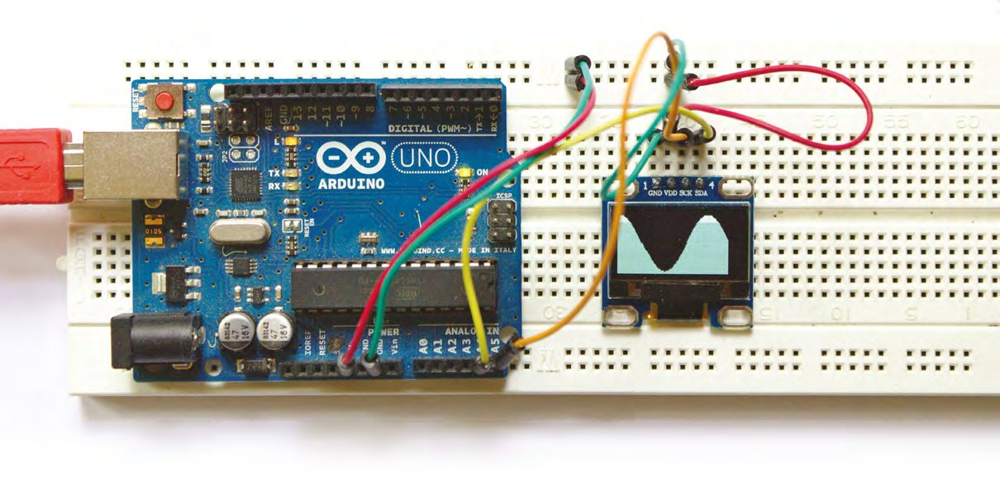
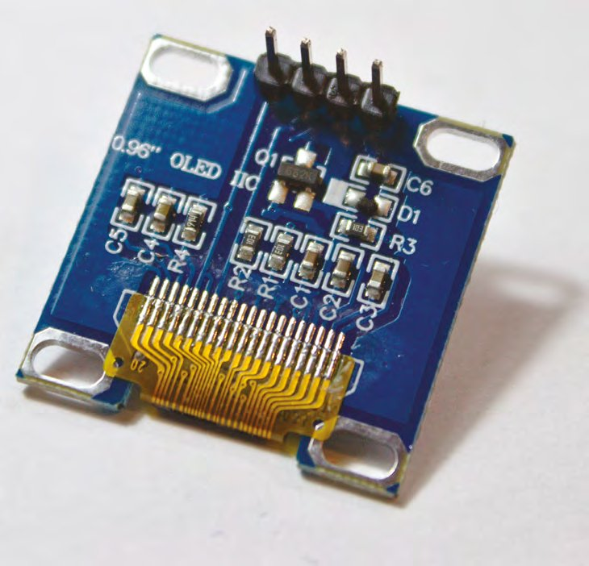
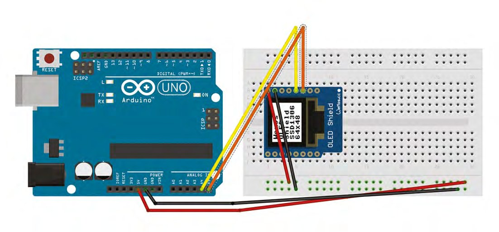
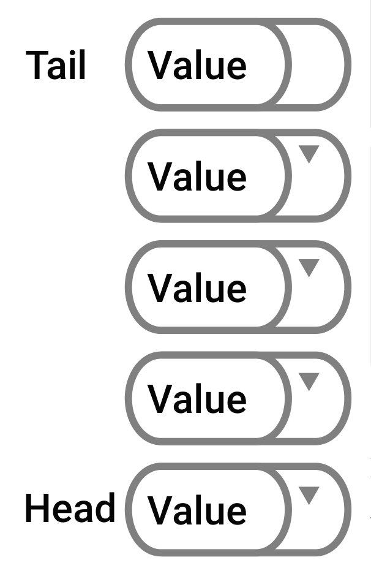
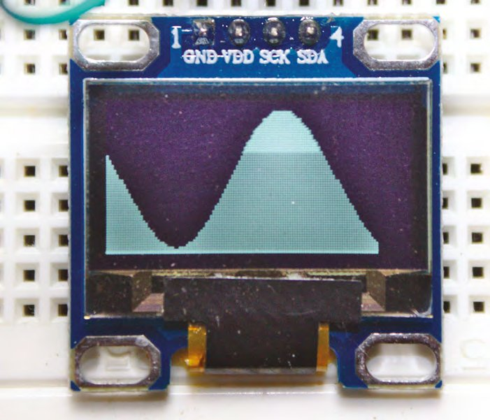

# Capitolul 8 – Programare Arduino: pointeri și liste înlănțuite

> *Fă-ți un upgrade de abilități și demistifică două dintre cele mai ezoterice aspecte ale Arduino și ale limbajului C*

> **DESPRE AUTOR**
> **Graham Morrison** (@degville) este un jurnalist Linux veteran, aflat într-o căutare de-o viață a muzicii din aranjamentul perfect al siliciului.

> **VEI AVEA NEVOIE DE**
> - Un afișaj grafic OLED monocrom SSD1306 de 0,96", 128 × 64
> - Un senzor digital de temperatură și umiditate DHT11



Am fost ambițioși în capitolul anterior, creând o histogramă derulantă a datelor de temperatură pe un afișaj simplu, cu mai puțin de 80 de linii de cod. Pe parcurs am introdus și două concepte fundamentale de programare: clasele și stivele. Am folosit clasele pentru a abstractiza atât datele, cât și funcțiile într-un singur obiect, iar stivele ca un fel de structură de date în care poți împinge valori deasupra și le poți scoate înapoi. În acest capitol vom revizita aceste idei și același cod, dar vom introduce alte două concepte fundamentale, la fel de importante, dintre care despre unul ai auzit sigur dacă ai citit sau văzut ceva despre programarea în C: pointerii și listele înlănțuite.

Pointerii, mai ales, sunt un pic mai teoretici decât natura practică a claselor și a stivelor, în special pe platforma Arduino. Dar sunt importanți pentru că sunt mai aproape de felul în care funcționează hardware-ul. Sunt și o parte fundamentală a canonului programării în C. Există însă o avertizare serioasă. Majoritatea programelor, dacă nu toate, pot fi scrise fără ei și există argumente bune pentru a-i evita complet. Ei adaugă codului un nivel de complexitate potențial catastrofal, cu care majoritatea începătorilor nu au nevoie să se lupte când încearcă doar să facă lucrurile să meargă. Pot face codul să se blocheze imprevizibil, pot introduce probleme subtile, greu de depistat, și pot fi greu de prevăzut. Sunt probleme pe care le eviți cu tipuri și structuri de date „statice”, cum ar fi un tablou bidimensional.

În capitolele anterioare am folosit tipuri care implementează alocarea statică a memoriei. Asta înseamnă că atât compilatorul, cât și Arduino știu exact care vor fi cerințele de memorie ale codului nostru înainte ca acesta să înceapă să ruleze. În linia `int ourList[MAXSTACK];`, de exemplu, declarăm exact câte numere întregi va ține tabloul `ourList`, o valoare definită de `MAXSTACK`. Este o abordare foarte comună la sistemele embedded, cum este Arduino, pentru că programatorul trebuie să păstreze controlul absolut asupra resurselor folosite, ca să se asigure că hardware-ului nu i se cere să stocheze date pentru care nu are memorie, o situație care ar provoca tot felul de comportamente imprevizibile și, în cele din urmă, ar face codul să blocheze placa Arduino.

Dar a ști ce sunt pointerii și de ce sunt capabili este un pas esențial în drumul oricărui programator, și există cazuri în care pot fi folosiți pentru a rezolva elegant anumite probleme. În particular, pointerii pot fi o cale foarte eficientă de a transmite seturi mari de valori între funcții, fără ca programul sau hardware-ul să aloce memorie suplimentară ori să piardă timp copiind datele. Dar sunt grozavi și pentru implementarea a ceva numit listă înlănțuită.

> *A ști ce sunt pointerii și de ce sunt capabili este un pas esențial în drumul oricărui programator*



*Afișajul SSD1306 este minuscul, are nevoie doar de patru pini pentru conectare și totuși este extrem de util pentru tot felul de afișări*

## Surorile Pointer

Până acum, operațiile interne ale hardware-ului au fost abstractizate de limbajul de programare. Pointerii dau cortina la o parte, făcându-te să gândești mai mult ca un procesor. Pentru a crea un pointer, pui pur și simplu un asterisc (`*`) înaintea numelui variabilei:

```cpp
int *example;
```

Fără asterisc, compilatorul s-ar asigura că este alocat destul spațiu pentru a ține o valoare întreagă, referită prin numele `example`. Cu asterisc însă, spunem că `example` este un pointer către o locație de memorie care ține un întreg. `example` nu ține valoarea întreagă, ci locația de memorie în care este stocată acea valoare. Aceasta este cheia înțelegerii pointerilor și poate lua ceva timp până se așază. Înseamnă că, indiferent de valoarea ținută la acea locație de memorie, în exemplul nostru un întreg, pointerul va ține întotdeauna doar valoarea locației de memorie. Pe un Arduino, unde fiecare locație de memorie poate fi adresată printr-o valoare de doi octeți, asta înseamnă că pointerii folosesc doi octeți de stocare, indiferent de tipul de date sau de structura de la capătul pointerului dereferențiat.

> **SFAT RAPID**
> Asteriscul folosit de un pointer este cunoscut drept operatorul de dereferențiere, pentru că returnează locația de memorie în care este stocată o variabilă.

Ca să dovedim asta, vom rescrie clasa de stivă din capitolul anterior folosind pointeri și o listă înlănțuită, pentru a reimplementa clasa care înconjura tabloul static folosit inițial. O listă înlănțuită este o formă foarte comună de structură de date dinamică și poate fi și foarte simplă. La minimum, este o structură care ține două elemente: o valoare de stocat și o legătură către structura care ține următorul element din listă. Legătura este un pointer. Structura poate fi, evident, completată cu mult mai multe componente, cum ar fi o valoare de tip clasă în locul unei simple variabile, sau un alt pointer către elementul anterior din listă. Dar pentru nevoile noastre o vom păstra cât mai simplă, cu doar un pointer și o valoare întreagă:

```cpp
struct stackNode {
  int value = 0;
  stackNode *next;
};
```

Cu structura (`struct`) de mai sus ne-am creat propria structură de date, care ține valoarea pe care vrem să o stocăm și pointerul către ceea ce va fi următorul element din lista noastră înlănțuită. Acesta ar fi fost următorul element dintr-un tablou, dacă am mai folosi tablouri. Ca să păstrăm funcționalitatea listei înlănțuite și să oferim aceeași funcționalitate transparentă ca a clasei din capitolul anterior, vom completa această structură cu o clasă nouă, care să facă toată munca grea în locul nostru.

```cpp
class stackList {
  protected:
    byte stacksize;
    stackNode *top;
    stackNode *tail;
  public:
    stackList();
    void push (int);
    int peek (int);
};
```

Vei vedea că codul de mai sus construiește o clasă aproape identică cu clasa bazată pe tablou folosită data trecută, cu excepția înlocuirii tabloului cu pointeri către două tipuri `stackNode`, definite de noua noastră structură: `top` și `tail`. Acești pointeri vor permite clasei să țină evidența elementelor de la începutul și de la sfârșitul listei. La fel, vom folosi `stacksize` pentru a ține numărul de elemente din listă. Dar marea diferență între această implementare și cea cu tablou este că această clasă nu mai stochează valorile din stivă; ea ține doar pointeri către elementele de la început și de la sfârșit. Valorile vor fi stocate undeva în memorie, iar treaba noastră, nu a compilatorului sau a lui Arduino, va fi să ținem evidența locului unde este fiecare element și a numărului de elemente create.

> *Acești pointeri vor permite clasei să țină evidența elementelor de la începutul și de la sfârșitul listei*

> **OPERATORUL DE REZOLUȚIE A DOMENIULUI**
> În capitolul anterior am definit funcțiile care aparțineau clasei între acoladele `{` și `}` care delimitau definiția clasei. În mod normal, aceste definiții de clasă ar fi separate de codul de implementare. Asta face clasa mai ușor de înțeles la nivel conceptual, fără a recurge la cod, și de aceea definiția clasei stă adesea în antet (.h). Dar poți face același lucru chiar și când lucrezi în același fișier: trebuie doar să îți creezi funcțiile folosind operatorul de rezoluție a domeniului (*scope resolution*). Domeniul de vizibilitate este un concept fundamental în multe limbaje. El îți permite să ai variabile cu același nume în clase diferite, sau variabile globale care nu interferează cu variabilele din funcții cu același nume. Două puncte duble sunt folosite pentru a indica clasa căreia îi atribui funcția (sau o variabilă, deși e mai rar). Iată funcția constructor pentru noua noastră metodă cu listă înlănțuită, folosind `stackList::` pentru a-i spune compilatorului că este membră a clasei `stackList`, deși se află în afara domeniului delimitat de acoladele clasei:
>
> ```cpp
> stackList::stackList()
> ```
>
> Am urmat acest nou protocol pentru toate funcțiile legate de clasă din cod.

## Elementele clasei

```cpp
stackList::stackList() {
      stacksize = 0;
      top = NULL;
      tail = NULL;
}
```

Codul de mai sus rulează ori de câte ori creăm un `stackList` în cod, iar constructorul îl folosim pentru a defini valorile implicite și a inițializa variabilele. Este identic cu constructorul creat când lucram cu tablouri, doar că nu mai trebuie să parcurgem tabloul ca să punem valori implicite. În schimb, atribuim valoarea `NULL` celor doi pointeri creați. `NULL` este o valoare specială, care asigură efectiv că nu este atribuit nimic ca valoare. Orice poate primi valoarea `NULL`, dar este cel mai utilă cu pointerii, pentru că există mereu posibilitatea ca, fără o astfel de inițializare, ei să conțină o locație de memorie aleatorie, rămășiță a unei rulări anterioare. Atribuirea valorii `NULL` este echivalentul, pentru pointeri, al setării unei variabile la 0.

> **SFAT RAPID**
> Săgeata `->` este de fapt doar o scurtătură pentru folosirea asteriscului. De exemplu, `ptrtmp->value = item` este echivalent funcțional cu `(*ptrtmp).value`.

## Împinge și trage

Ne vom ocupa acum de funcția principală a noii clase, funcția `push`. Ca și înainte, ea primește o valoare întreagă și o adaugă în stiva pe care o construim pentru a ține valorile pe care le măsurăm. Diferența, de data aceasta, este că vom folosi pointeri și o listă înlănțuită. Iată prima parte:

```cpp
void stackList::push(int item) {
   stackNode *ptrtmp = new stackNode;
   ptrtmp->value = item;
   ptrtmp->next = NULL;
```

Sunt doar trei linii noi de cod mai sus, dar ele încapsulează tot ce trebuie să știi despre pointeri și liste înlănțuite, cum funcționează și cum pot fi folosite. Tot ce vom mai adăuga este întreținere de bază a ceea ce creăm aici.

Prima linie de după numele funcției (`stackNode *ptrtmp = new stackNode;`) creează un nod nou, care va ține noua valoare, și îl numim `ptrtmp`. Este un pointer către noul nod. Dar partea cea mai importantă de aici este cuvântul-cheie `new`. Fără el, pointerul ar fi creat, dar nu ar fi alocată memorie pentru datele pe care vrem să le stocăm. Folosirea lui `new` se ocupă de asta automat, rezervând memorie pentru un element `stackNode` și conținutul lui. Există o diferență vitală între asta și crearea unui tip obișnuit, de exemplu cu `stackNode tmp`. În exemplul nostru, chiar și când `ptrtmp` nu mai există și am ieșit din domeniul funcției, datele pe care le ține vor fi tot în memorie, protejate de orice suprascriere. Atât timp cât mai avem o cale către locația lor, adică exact ce este un pointer, putem ajunge la date.

Caracterele `->` sunt o scurtătură către ceea ce referă pointerul, permițându-ți să schimbi valoarea stocată în locația de memorie spre care indică pointerul. Elementul care ține acest pointer va fi elementul anterior din lista înlănțuită, adică ceea ce ține pointerul `ptrtmp`. Totuși, cum deocamdată nu știm nimic despre ce ar putea fi elementul următor, pointerul către elementul următor este creat cu o atribuire `NULL`. Ne ocupăm acum de situația în care primul element este adăugat în listă:

```cpp
   if (tail == NULL)
     tail = ptrtmp;
   else
     top->next = ptrtmp;
   top = ptrtmp;
```

Codul de mai sus ilustrează puterea uluitoare a pointerilor. Mai întâi, întrebând dacă pointerul `tail` este încă `NULL`, verificăm dacă acesta este primul element adăugat în listă, pentru că are nevoie de o tratare specială. Dacă este, îndreptăm pointerul `tail` către noul element `ptrtmp` abia creat. Dacă nu este, știm că există deja cel puțin un element în listă, iar ultimul element adăugat este indicat de `top`. Cum adăugăm un element nou, pointerul `next` al lui `top` trebuie să indice către noul element pe care îl creăm, ceea ce putem face pur și simplu cu `top->next = ptrtmp;`. Amintește-ți, aceștia sunt doar pointeri: nu mutăm valorile pe care le stochează, doar atribuim locația de memorie. Nodul care ține valoarea pe care vrem să o stocăm nu se mișcă.

> *Ea primește o valoare întreagă și o adaugă în stiva pe care o construim pentru a ține valorile pe care le măsurăm*



*Circuitul și cablarea din acest capitol sunt identice cu cele din capitolul anterior, doar că poți renunța la senzorul de temperatură dacă actualizezi rutina grafică*

Următoarea bucată de cod împiedică lista înlănțuită să se extindă peste capacitatea de stocare a plăcii Arduino:

```cpp
   if (++stacksize > MAXSTACK) {
     ptrtmp = tail;
     tail = ptrtmp->next;
     delete tail;
     stacksize--;
   }
}
```

În codul de mai sus verificăm dacă sunt acum mai multe elemente în listă decât vrem, conform `MAXSTACK`. Dacă sunt, stocăm locația de memorie a celui mai vechi nod, coada (`tail`), în pointerul `ptrtmp`. Asta ca să putem face noul pointer `tail` să indice către următorul element din listă, înainte de a șterge ceea ce era cel mai vechi element din listă. Va trebui să reduci și valoarea lui `MAXSTACK` din cod, de obicei la 60–100, altfel rămâi fără memorie RAM.

> **NOTA TRADUCĂTORULUI**
> În codul original, ultimul pas este `delete tail;`, ceea ce ar șterge chiar noul element de la coadă, nu pe cel vechi. Intenția descrisă în text este ștergerea celui mai vechi nod, a cărui adresă tocmai a fost salvată în `ptrtmp`, deci linia corectă este `delete ptrtmp;`. Codul complet de pe GitHub merită verificat și corectat în acest sens.

Comanda `delete` de aici este opusul comenzii `new` folosite mai devreme: eliberează memoria alocată pentru structură. Putem aborda acum ultima funcție, care returnează valoarea nodului cerut din listă. Este mai complexă decât echivalentul cu tablou, pentru că nu putem adresa direct valoarea stocată de listă la poziția `x`. În schimb, numărăm pozițiile până ajungem la nodul corect și returnăm valoarea pe care o ține:

```cpp
int stackList::peek(int x) {
  int pos = 0;
  stackNode* current = tail;
  while ((pos < x) && (current != top)) {
    current = current->next;
    pos++;
  }
  if (x > pos)
    return -1;
  else
    return current->value;
}
```

> *Este mai complexă decât echivalentul cu tablou, pentru că nu putem adresa direct valoarea stocată de listă la poziția x*



*O listă înlănțuită este o structură de date dinamică în care fiecare element conține o legătură, printr-un pointer, către următorul element din listă*

Singura altă parte a codului pe care o vom atinge este cea care desenează graficul. Facem asta pentru că nu mai există destulă memorie RAM pe un Arduino Uno pentru a ține întreaga listă înlănțuită, așa că vom mapa valori pe ecran doar acolo unde există un nod și vom opri redesenarea când nu mai sunt elemente de afișat. Vom păstra însă aceeași logică de fereastră glisantă din capitolul anterior, pentru că arată destul de bine:

```cpp
void displayChart() {
  char x = 0;
  int value = 0;
  value = temp_stack.peek(x);
  while (value != -1) {
    display.drawLine(x, display.height(), x, 0, BLACK);
    display.drawLine(x, display.height(), x, display.height() - value, WHITE);
    value = temp_stack.peek(++x);
  }
}
```

Cu asta gata, poți rula codul. Cu puțin noroc, vei fi răsplătit văzând absolut nicio diferență față de graficul de temperatură de data trecută; vezi caseta „Upgrade grafic” pentru a-l schimba cu un alt algoritm de desenare. Dar felul în care funcționează codul tău este acum complet diferit, folosind pointeri și o listă înlănțuită în locul unui tablou, iar tu ai stăpânit unul dintre cele mai ezoterice și greșit înțelese aspecte ale mediilor de programare Arduino și C.

> **SFAT RAPID**
> Încearcă să schimbi definițiile `int` în `byte` când știi că valoarea ținută va fi între 0 și 255. Asta economisește un octet întreg din prețioasa memorie a lui Arduino și îți dă o stivă potențial mai mare.



*Înlocuiește graficul static al temperaturii cu o undă sinusoidală; ai putea chiar să îi modulezi frecvența cu schimbările de temperatură!*

> **UPGRADE GRAFIC**
> Nu ni s-a părut corect să lăsăm acest proiect să genereze exact același rezultat ca cel din capitolul anterior. Ca bonus, și ca să explorăm un pic funcțiile matematice, poți renunța la senzorul de temperatură și înlocui codul buclei principale cu următorul:
>
> ```cpp
> void loop() {
>   if (counter > 180)
>     counter = -180;
>   temp_stack.push((sin(counter * 3.14 / 180) + 1.1) * 29);
>   counter = counter + 2;
>   displayChart();
>   display.display();
>   delay(1);
> }
> ```
>
> Va trebui să adaugi și `int counter = 0;` ca variabilă globală, în afara domeniului funcției `loop()`. Codul de mai sus folosește `sin()` pentru a genera funcția sinus pentru unghiurile dintre -180 și +180, numărate de `counter`. Rezultatul va fi o undă sinusoidală regulată, desenată și derulată pe afișajul OLED, dar te poți juca cu numerele ca să îi schimbi atât frecvența, cât și amplitudinea.

> **SFAT RAPID**
> Codul acestui proiect se găsește aici: [git.io/fSGkD](https://git.io/fSGkD).

> **DINCOLO DE LISTĂ**
> Aici ne-am uitat la o listă înlănțuită pentru că este una dintre cele mai simple structuri de date (și servește scopului nostru), dar există multe altele pe care le poți crea, construite pe același principiu. Odată ce ai stăpânit tehnica folosirii pointerilor pentru a lega elemente între ele, o poți adapta pentru a le crea pe celelalte. În fiecare caz, ai o structură cu un pointer care arată legăturile către alte noduri…
>
> - **Arbori:** în această structură de date, un singur element rădăcină are unul sau mai mulți copii, fiecare copil are copii, și așa mai departe. Gândește-te la un arbore genealogic, dar care poate ține aproape orice fel de date. O variantă comună este arborele binar, în care fiecare nod are cel mult doi copii. Această structură este utilă pentru căutare, pentru că fiecare nod poate reprezenta o valoare, toți copiii din stânga pot fi mai mici, iar toți cei din dreapta mai mari.
> - **Grafuri:** în informatică, grafurile nu au nicio legătură cu diagramele care arată cum se schimbă o valoare pe axe. Ele sunt colecții de noduri care pot fi legate în orice fel. Gândește-te la ele ca la o listă înlănțuită, dar în care fiecare nod poate fi legat de multe noduri, nu doar de unul. Pot reprezenta multe lucruri, în special structura internetului, format dintr-un număr mare de servere și centre de date cu diverse conexiuni între ele.
> - **Heap:** sunt asemănătoare arborilor, doar că există o proprietate de heap conform căreia un nod părinte trebuie să fie explicit mai mare sau mai mic decât fiecare nod de sub el. Una dintre cele mai comune utilizări ale unui heap este coada cu priorități, în care fiecare nod este mai important decât cele de sub el.
