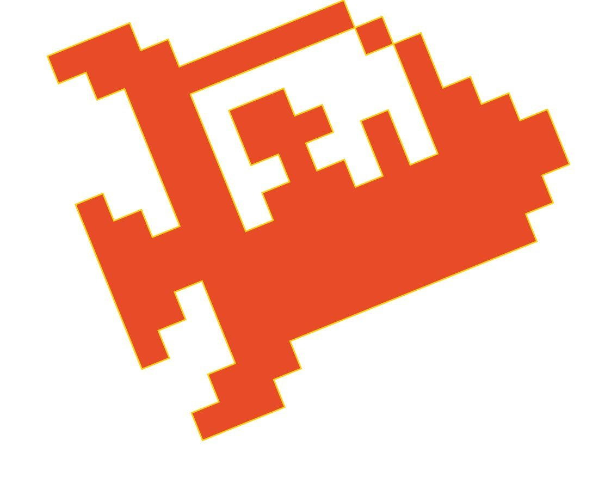
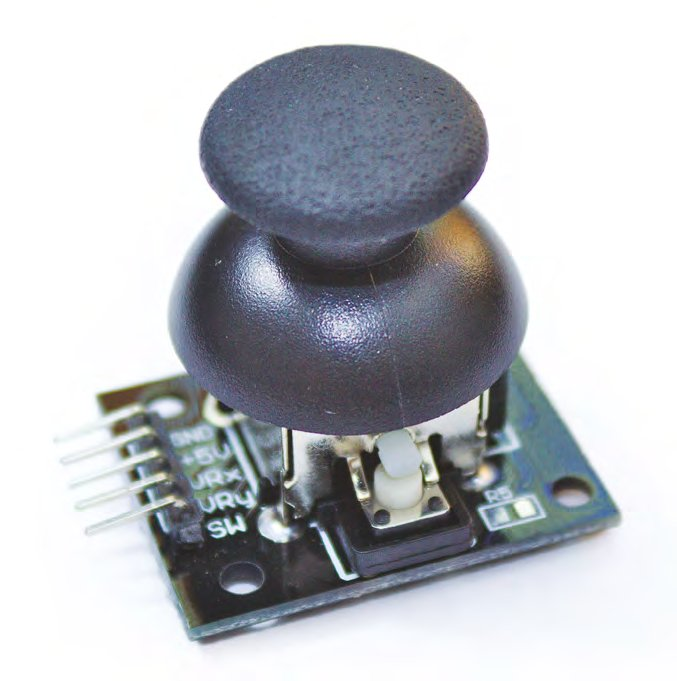
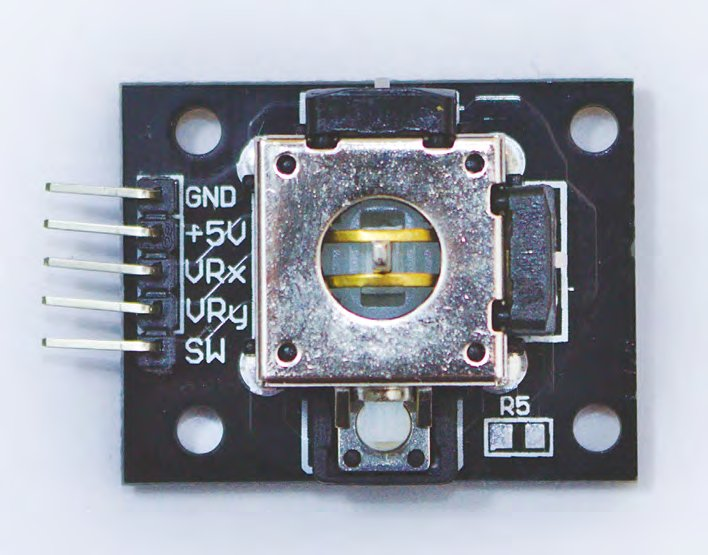
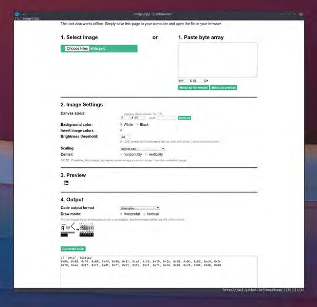
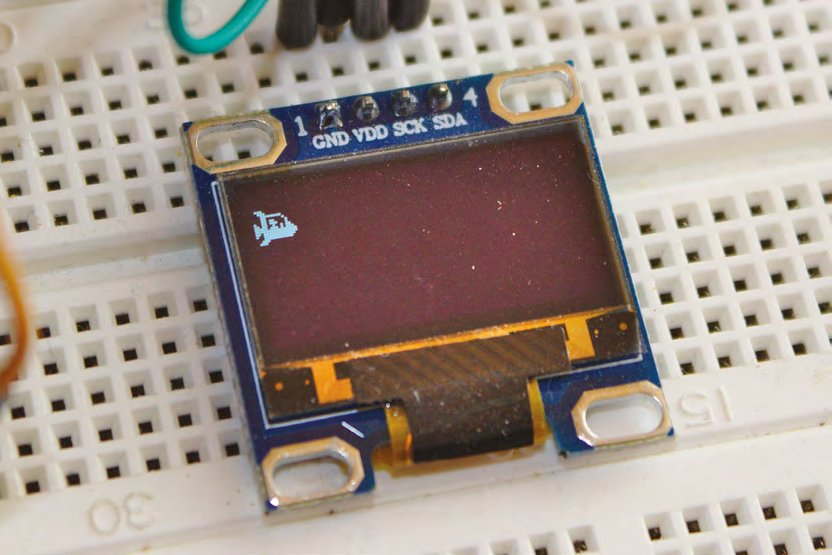
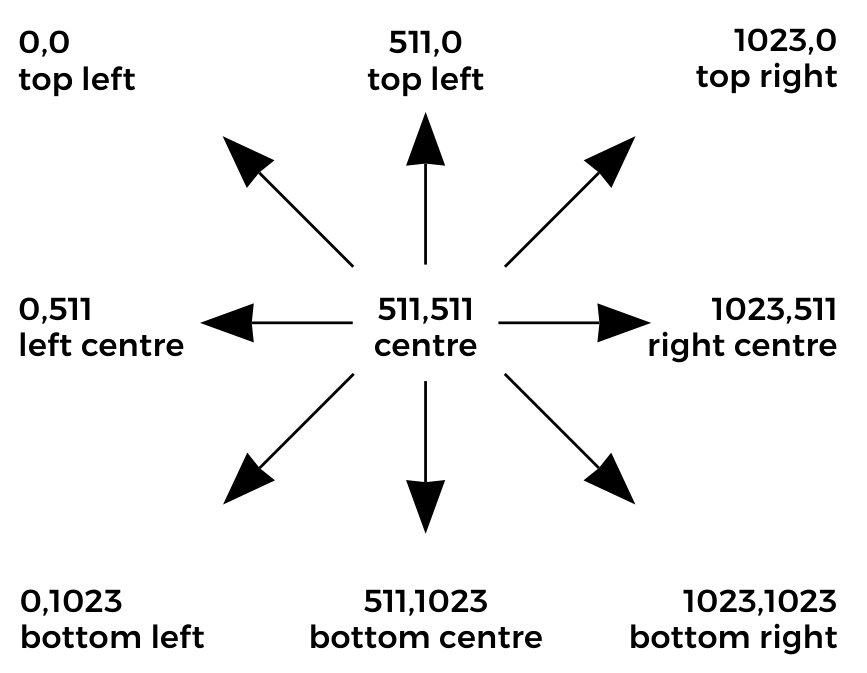
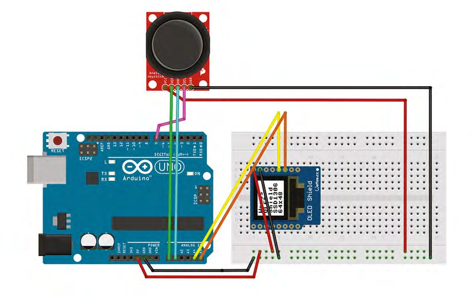
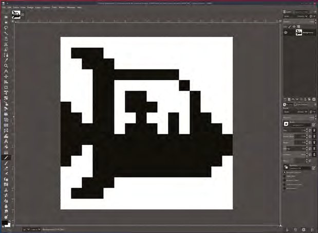

# Capitolul 9 – Programare Arduino: construiește o consolă de jocuri (partea 1/2)

> *Pune în practică o parte din teoria învățată cu greu. Și chiar vorbim de acțiune: nave spațiale, joystickuri analogice și grafică bitmap*

> **DESPRE AUTOR**
> **Graham Morrison** (@degville) este un jurnalist Linux veteran, aflat într-o căutare de-o viață a muzicii din aranjamentul perfect al siliciului.



*Cu puțină ingeniozitate, grafica simplă poate arăta în continuare grozav*

În capitolul anterior ne-am scufundat în teoria din spatele pointerilor și al listelor înlănțuite. De data aceasta lăsăm teoria deoparte și punem în practică o parte din ce am învățat. Iar una dintre cele mai bune căi de a face asta, și una dintre cele mai distractive, este să programăm un joc video. Performanța limitată a plăcii Arduino face imposibilă scrierea oricărui joc modern: nu putem folosi nimic asemănător bibliotecilor pe care le folosesc dezvoltatorii de jocuri ca să sară peste fundamentele programării, să implementeze inteligență artificială sau reproiectare pentru realitate virtuală. Dar putem scrie un joc exact cum se scriau în epoca de aur a calculatoarelor de acasă pe 8 biți. Hardware-ul limitat al acelor mașini vechi forța creativitatea designerilor de jocuri, iar asta însemna să injecteze în jocuri cât mai multă mecanică simplă, imaginativă și captivantă. Hardware-ul limitat însemna și că fiecare variabilă, funcție, sprite și sunet putea fi șlefuit manual până la perfecțiune, cu jucabilitatea iterată până era considerată perfectă. Nu exista altă opțiune, pentru că nu puteai livra un patch de 1024 de octeți în ziua lansării, ca să nu mai vorbim de unul de 50 GB, iar aceste limitări au făcut ca atât de multe dintre acele jocuri vechi să fie jucabile și azi, decenii mai târziu.

Vom folosi aceeași configurație cu care ne-am jucat în capitolele anterioare, în principal același afișaj OLED I2C de 128×64, dar îl poți înlocui ușor cu ceva mai mare decât modelul de 0,96" pe care îl folosim noi. Pentru intrare vom folosi un joystick analogic cu două axe, care include și un întrerupător de moment. Se găsesc ieftin și ușor, ca modul cu eticheta „KY-023”, și s-ar putea chiar să îți fi rămas unul de la controlerul MIDI cu joystick prezentat în trecut în HackSpace. Vezi caseta „Conectarea” pentru mai multe detalii despre cum am pus totul cap la cap și l-am legat la Arduino.

> **SFAT RAPID**
> Ai putea înlocui joystickul analogic cu cinci butoane simple de moment, dar vei pierde finețea controlului.



*Modulul KY-023 folosește un joystick foarte asemănător cu cel de pe controlerul PlayStation 2, care poate fi și el extras și folosit în același fel*

> **ALEGEREA PLĂCII**
> Una dintre principalele diferențe dintre versiunile hardware-ului Arduino este cantitatea de memorie flash și SRAM disponibilă:
>
> | Memorie | Duemilanove (2009) | Uno Rev 3 | Mega | Mega 2560 |
> |---|---|---|---|---|
> | Flash | 16 kB | 32 kB | 128 kB | 256 kB |
> | SRAM | 1024 octeți | 2048 octeți | 8 kB | 8 kB |

Inspirația pentru acest proiect vine direct din capitolele anterioare, în care am folosit ecranul pentru a arăta o reprezentare derulantă a schimbărilor de temperatură în timp. Fundalurile care derulează lateral sunt o mecanică tradițională de joc, folosită în clasice precum Defender-ul original din 1979/1980 și Super Mario Bros. Dar jocul care ne-a inspirat cel mai mult pentru acest proiect se numește Scramble, din 1981. În Scramble trebuia să îți pilotezi nava peste un peisaj urban înainte de a intra într-o serie de tuneluri. Aceste tuneluri deveneau un mini-joc în sine, în care încercai să îți poziționezi nava în cea mai bună parte a ecranului ca să treci de viraje imposibile și de o înălțime a tunelului tot mai mică. Exact această parte din Scramble o vom emula, vag, cu propriul nostru joc pe Arduino, adaptând graficul derulant de temperatură pe care l-am creat deja într-un tunel. Dar, pentru început, trebuie să facem să funcționeze comenzile joystickului, iar pentru asta trebuie să putem vedea (și controla) ceva pe ecran.

## În formă de navă

Multe dintre primele jocuri foloseau geometrie simplă pentru a reprezenta o navă spațială. Unul dintre cele mai cunoscute este Asteroids, care folosea un triunghi îmbunătățit drept navă principală, controlată de jucător, cu grade de rotație și de accelerare. Asta pentru că ecranul folosea un afișaj „vectorial”, care putea doar să deseneze linii de la un punct la altul. Nu am mai suferit de aceleași restricții de când tuburile catodice cu baleiere raster au devenit obișnuite, iar tehnologia modernă a ecranelor plate a transformat totul într-o amintire îndepărtată. Dar astfel de vectori se folosesc și azi când vrei ca o imagine să se scaleze sau când nu ai memorie pentru mai mult de două culori, și sunt baza graficii scalabile moderne, cum ar fi SVG și poligoanele 3D. Datorită bibliotecii grafice Adafruit, e nevoie de o singură comandă pentru a desena un triunghi (sau un dreptunghi, sau un cerc, plin sau gol), și vom reveni la această idee când vom adăuga niște stele în joc. Dar deocamdată vom folosi pentru navă un bitmap, un alt termen vechi, care mai supraviețuiește în locuri precum extensia de fișier .bmp și programarea grafică.

> *Multe dintre primele jocuri foloseau geometrie simplă pentru a reprezenta o navă spațială. Unul dintre cele mai cunoscute este Asteroids, care folosea un triunghi îmbunătățit drept navă principală*

Termenul „bitmap” se referă la o înșiruire de „biți”, de obicei 1 pentru aprins și 0 pentru stins, care reprezintă pixeli alăturați de pe ecran. Rândurile diferite sunt reprezentate știind lățimea imaginii. Dacă o imagine are 16 pixeli lățime, de exemplu, al 17-lea bit din secvență va reprezenta primul pixel de pe al doilea rând. Este cu adevărat cel mai simplist mod de a reprezenta o imagine, deși poate fi extins ușor pentru a adăuga „adâncime de bit”, de exemplu culoare, în loc de stări aprins/stins. Datorită felului secvențial în care memoria este mapată pe un afișaj, bitmapurile rămân un mod eficient de a reprezenta elemente vizuale, mai ales dacă te gândești că acest tip de structură este identic cu un tablou pe care îl putem folosi în propriul cod. Din fericire, vremurile în care aveai nevoie de hârtie milimetrică, ca să îți desenezi cu creionul modelele și apoi să le traduci într-o secvență de valori binare, au trecut, și acum îți poți desena bitmapurile în editorul de imagini preferat și le poți converti online sau cu GIMP; vezi caseta „Creează bitmapuri cu GIMP” pentru detalii.

> *Datorită felului secvențial în care memoria este mapată pe un afișaj, bitmapurile rămân un mod eficient de a reprezenta elemente vizuale*

> **CONECTAREA**
> Pe lângă Arduino Uno și afișajul OLED I2C de 128×64 pe care le-am conectat în ultimele capitole, am adăugat un joystick analogic etichetat KY-023, deși aproape orice joystick analogic ar trebui să funcționeze. Noi folosim o versiune cu o mică placă de conexiuni, dar aproape toate joystickurile de acest tip au aceleași cinci conexiuni: GND și 5 V, care trebuie legate la ieșirile corespunzătoare ale lui Arduino prin șinele breadboard-ului; VRx și VRy, pe care le-am legat la intrările analogice A0 și A1; și SW, pe care l-am legat la pinul de intrare digitală 7. A trebuit apoi să ne actualizăm codul proiectului ca să reflecte aceste intrări noi, cu următoarele valori globale `const`:
>
> ```cpp
> // Analogue joystick connections for X and Y
> const int JOYY = A0;
> const int JOYX = A1;
> // Digital input for the Joystick switch
> const int SWITCH_PIN = 7;
> ```
>
> Ca proiectul să semene mai mult cu o consolă de jocuri și să fie mai accesibil degetelor mici, am legat un cablu panglică lung între joystick și conexiunile lui. Asta ne-a permis să ținem joystickul în mână exact ca pe un controler de consolă și a evitat elegant problema pinilor orizontali care trebuie conectați la breadboard. Desigur, dacă păstrezi această configurație, nu există limite pentru felul în care conectezi și aranjezi componentele: de la o consolă portabilă într-o cutie de bomboane mentolate până la un mic sistem de divertisment pentru acasă.



*Joystickul nostru include un întrerupător, declanșat prin apăsare în jos, pe care îl vom folosi pentru a porni jocul*

Am transformat o imagine monocromă a unei nave spațiale, desenată de noi, în următorul tablou:

```cpp
const unsigned char shipBMP [] PROGMEM = {
  // 'ship, 16x16px
  0x00, 0x00, 0x70, 0x00, 0x38, 0x00, 0x1f, 0xe0,
  0x18, 0x10, 0x1b, 0x08, 0x9b, 0x88, 0xd9, 0x2c,
  0xfb, 0xae, 0xff, 0xff, 0xdf, 0xff, 0x9f, 0xfe,
  0x1f, 0xfc, 0x38, 0x00, 0x70, 0x00, 0x00, 0x00
};
```

> **SFAT RAPID**
> În loc să folosești GIMP sau ceva asemănător pentru a genera codul bitmapului pentru Arduino, poți folosi un convertor online, cum ar fi [hsmag.cc/yGbolA](https://hsmag.cc/yGbolA).

Tabloul de mai sus are 32 de elemente, dar reprezintă un bitmap de 16 pixeli lățime și 16 pixeli înălțime, adică 256 de poziții aprins/stins în total. Diferența dintre numărul de elemente și numărul de biți reprezentați vine din faptul că folosim hexazecimal pentru a descrie aceleași date ca `char`, în loc de binar brut, iar fiecare element este echivalent cu un octet, adică 8 biți. Înmulțește cele 32 de elemente cu acești 8 biți și obții 256, deci nu pierdem și nu comprimăm date, doar le afișăm mai eficient. Tot eficiența este motivul pentru care folosim cuvântul-cheie `PROGMEM` la declararea tabloului. Arduino are mai multe tipuri de memorie, iar `PROGMEM` reprezintă memoria flash, nu SRAM-ul folosit pentru variabilele programului. Așa cum am văzut în capitolul despre liste și pointeri, SRAM-ul se umple repede cu orice proiect obișnuit, iar fiecare Arduino are mult mai multă memorie flash decât SRAM. Folosirea `PROGMEM` în locul SRAM-ului este perfectă pentru tablouri mari, cum este cel în care ținem un bitmap. Singurele limite sunt că variabilele `PROGMEM` trebuie să fie globale sau definite ca `static`.



*Un convertor online de bitmapuri, cum ar fi [hsmag.cc/vfYQyz](https://hsmag.cc/vfYQyz), îți permite să inversezi o imagine și să previzualizezi textul rezultat, ca să te asiguri că va funcționa pe ecran*

Datorită bibliotecii grafice Adafruit pe care o folosim deja pentru ecran, afișarea tabloului bitmap pe ecran este ușoară și ia o singură linie, pe care o punem în propria funcție, ce primește o poziție x și y pentru locul în care vrem desenată imaginea:

```cpp
void displayShip(int x, int y) {
  display.drawBitmap(x, y, shipBMP, 16, 16, 1);
}
```



*Să îți joci jocul este cel mai bun mod de a-l îmbunătăți, mai ales când vine vorba de reglajul fin al sistemului de control*

## Controlul cu joystick

Vrem acum să scriem codul care citește valorile joystickului și le traduce în mișcarea navei. Un joystick analogic nu este, de fapt, decât două potențiometre, câte unul pentru axele x și y, fiecare trimițând un interval de valori de la 0 la 1023. Aceste valori ajung la intrările analogice A0 și A1 ale lui Arduino. Joystickul are arcuri care îl țin în poziția de mijloc, unde ambele potențiometre, x și y, citesc 511, iar valorile se schimbă pe măsură ce miști maneta. Există multe moduri de a interpreta aceste schimbări și fiecare va duce la o jucabilitate puțin diferită. Ai putea folosi joystickul ca o intrare digitală, de exemplu pornind mișcarea pozitivă pe x când valoarea x este mai mare decât 511, dar ai pierde controlul fin pe care ți-l dă un joystick analogic.



*Un joystick analogic trimite valori între 0 și 1023, de la (0,0) în stânga sus la (1023,1023) în dreapta jos, cu (511,511) în centru*

Crearea unui set de reguli pentru controlul analogic poate fi complicată, dar avem la dispoziție o funcție nouă excelentă, numită `map`. Funcția `map` convertește pur și simplu un interval de numere în altul, de exemplu de la 10–20 la 1–10. Se descurcă și cu numere întregi negative, ceea ce o face perfectă pentru a traduce valorile brute primite de la intrările analogice ale joystickului într-un interval de valori care poate reprezenta numărul de pixeli cu care vrem să se miște nava, atât în direcția pozitivă, cât și în cea negativă. Se poate face chiar în doar două linii:

```cpp
xValue = map(analogRead(JOYX), 0, 1024, 5, -8);
yValue = map(analogRead(JOYY), 0, 1024, -5, 5);
```

> *Crearea unui set de reguli pentru controlul analogic poate fi complicată, dar avem la dispoziție o funcție nouă excelentă*



*Joystickul analogic are nevoie de alimentare și masă, comune cu ecranul, de două intrări analogice pentru x și y și de o intrare digitală pentru întrerupător*

Funcțiile `analogRead()` citesc intrările lui Arduino de la joystick. Tot ce facem apoi este să mapăm extrema stângă la 5 pe axa x și extrema dreaptă la -8. Valoarea negativă e din cauză că această axă este inversată, comenzile fiind opuse față de ce te-ai aștepta. Toate punctele intermediare vor corespunde gradului în care este mișcat joystickul, dar punctul central nu va fi 0, ci -1. Este un truc de jucabilitate, care va readuce nava spre marginea din stânga a ecranului atunci când jucătorul nu o controlează. Axa y, prin comparație, este o traducere directă, cu 0 ca punct central și fără mișcare automată. Aceste valori pot fi apoi adăugate la poziția curentă a navei pentru a genera mișcare atunci când actualizăm poziția navei. Cu cât maneta este mai departe de centru, cu atât saltul în număr de pixeli este mai mare, ceea ce înseamnă că nava va traversa ecranul mai repede.

> *Cu cât maneta este mai departe de centru, cu atât saltul în număr de pixeli este mai mare, ceea ce înseamnă că nava va traversa ecranul mai repede*

Singurele verificări pe care trebuie să le adăugăm sunt pentru momentele în care nava lovește una dintre marginile ecranului, ceea ce putem face cu instrucțiuni `if` simple. Punând totul într-o singură funcție, arată așa:

```cpp
void updateShip() {
  int xValue, yValue;
  xValue = map(analogRead(JOYX), 0, 1024, 5, -8);  // 5, -6 for no backwards movement
  yValue = map(analogRead(JOYY), 0, 1024, -5, 5);
  shipx = shipx + xValue;
  shipy = shipy + yValue;
  if (shipx < 1)
    shipx = 1;
  if (shipy < 1)
    shipy = 1;
  if (shipx > display.width() - 12)
    shipx = display.width() - 12;
  if (shipy > display.height() - 12)
    shipy = display.height() - 12;
}
```

Tot ce mai rămâne de făcut este să adăugăm cele două variabile pentru poziția navei ca variabile globale și să actualizăm funcția principală `loop`, ca să apeleze atât funcția `updateShip()`, cât și funcția `displayShip()`:

```cpp
int shipx, shipy;
void loop() {
  updateShip();
  displayShip(shipx, shipy);
  display.display();
  delay(1);
  display.fillScreen(BLACK);
}
```

Avem acum cadrul pentru un joc adevărat, pe care îl vom construi în capitolul următor. Până atunci, codul acestui capitol poate fi descărcat de la [git.io/fNXzp](https://git.io/fNXzp).

> **CREEAZĂ BITMAPURI CU GIMP**
> Cel mai simplu mod de a crea un bitmap este cu un editor de pixeli, cum ar fi GIMP ([gimp.org](https://www.gimp.org)). Creează o imagine nouă din meniul File > New și setează mărimea la 16×16, cu tipul „px”, pentru pixeli. Așa te asiguri că nu se scalează fundalul. Apasă pe Advanced Options și asigură-te că „Fill with” este setat pe Transparency, ca doar pixelii pe care îi desenezi să apară în rezultat. Apasă OK, apoi mărește noua ta pânză minusculă, fie ținând apăsată tasta CTRL și folosind rotița mouse-ului, fie alegând Zoom din meniul View. Ca să desenezi, alege unealta creion din paleta de unelte și, în panoul „Tool options”, setează-i mărimea la 1, echivalentul unui singur pixel. La final, asigură-te că culoarea de prim-plan este alb. Acum poți începe să îți desenezi modelul.
>
> Când ești mulțumit de desen, alege Export As din meniul File și folosește meniul derulant Type pentru a seta formatul de ieșire la „X BitMap image (*.xbm, *.icon, *.bitmap)”. Dă un nume imaginii și apasă Export. Fișierul pe care tocmai l-ai generat este de fapt un fișier text pe care îl poți folosi în cod, exact cum am făcut noi în proiectul principal.



*GIMP este o alegere bună pentru editarea pixelilor mari, pentru că poți seta ușor mărimea pânzei și poți mări imaginea*
