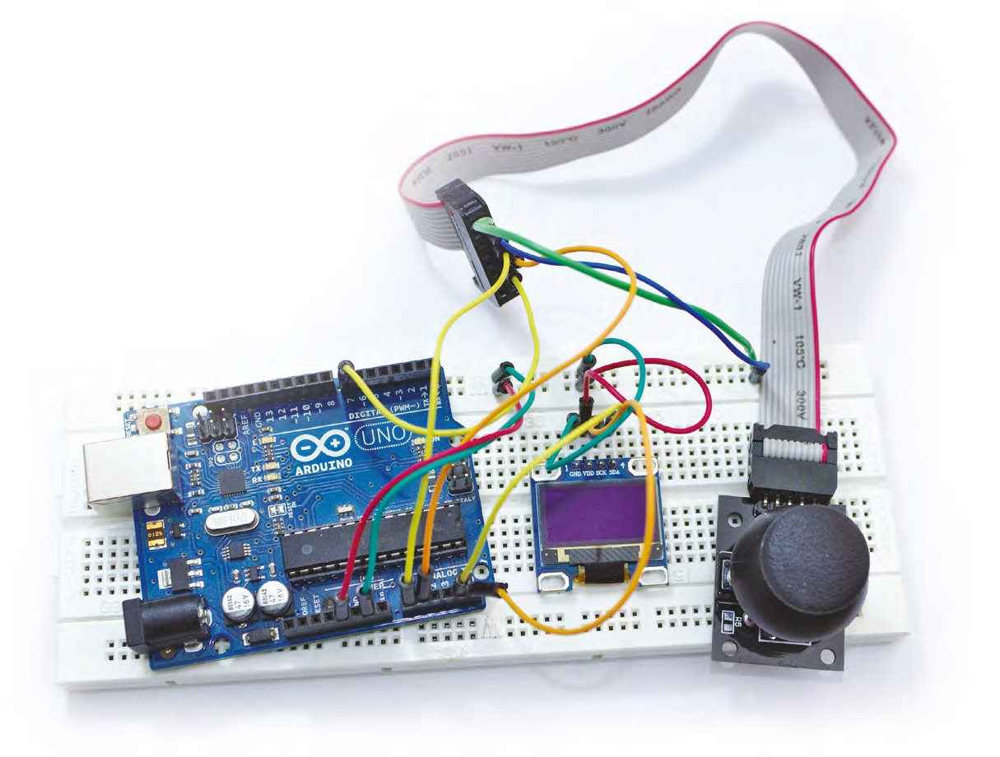
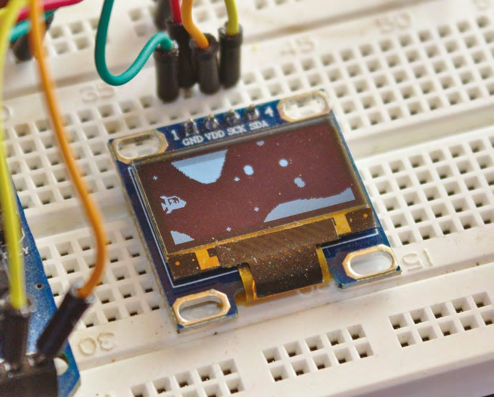
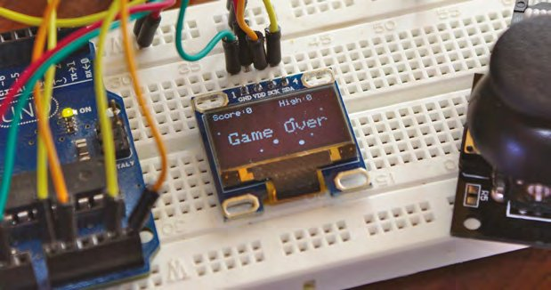
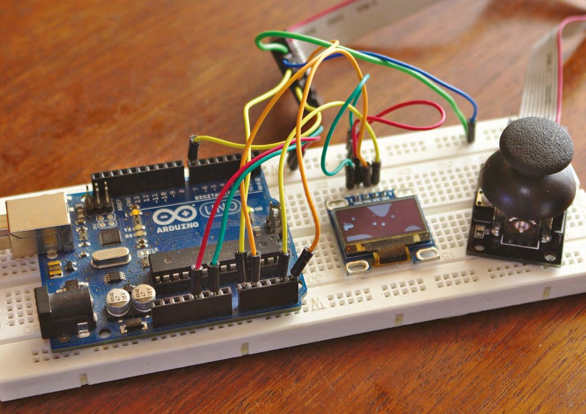
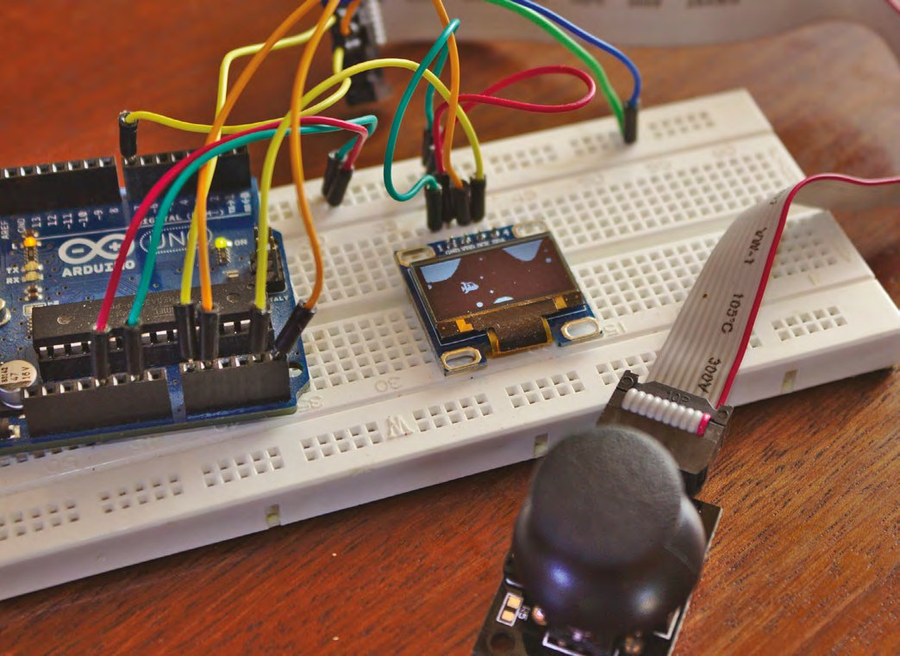

# Capitolul 10 – Programare Arduino: construiește o consolă de jocuri (partea 2/2)

> *Abordează toate elementele principale de gameplay, de la generarea terenului la detectarea coliziunilor, și combină-le într-un joc captivant, ușor de modificat*

> **DESPRE AUTOR**
> **Graham Morrison** (@degville) este un jurnalist Linux veteran, aflat într-o căutare de-o viață a muzicii din aranjamentul perfect al siliciului.

În capitolul anterior am pornit în aventura transformării unui modest Arduino Uno într-o consolă de jocuri, chiar dacă una care rulează un singur joc, pe care încă nu l-am scris (citește mai departe). Am terminat data trecută cu un sistem de mișcare controlat cu joystickul și cu un bitmap desenat de noi, pe care îl puteam mișca pe ecran. În acest capitol vom completa aceste idei cu restul codului, ca să creăm un joc adevărat, începând cu modificările pe care trebuie să le facem graficului derulant de temperatură ca să îl transformăm într-un tunel fără sfârșit, prin care să navigheze nava noastră. În codul original împingeam valori de temperatură într-o stivă și citeam înapoi acele valori în fiecare coloană a ecranului. Aceste valori erau ținute într-o stivă și, pe măsură ce adăugam o valoare nouă, cea mai veche era eliminată. Asta crea o fereastră glisantă a ultimelor 128 de valori. Ecranul are tot 128 de coloane lățime, iar desenarea acestor valori (câte o poziție pe coloană) are ca efect un afișaj derulant de valori care se mișcă de la dreapta la stânga.



*Folosirea unui cablu panglică pentru a separa joystickul de Arduino și de ecran face mult mai ușor pentru oricine să joace jocul fără să desfacă totul*

Vom deturna acest efect ca să transformăm acele valori în secțiunea transversală a unei peșteri prin care să zboare nava noastră, iar primul pas este să înlocuim citirile de temperatură cu ceva ce putem genera la nesfârșit, un fel de generator de peisaj. Există multe moduri creative de a face asta, dar noi ne-am oprit la folosirea a două valori generate cu `sin()` (unda sinusoidală), care se schimbă în funcție de două contoare. Prima valoare `sin()` va fi folosită pentru a genera înălțimea, în timp ce al doilea contor este folosit pentru a ajusta saltul de unghi pentru valoarea următoare. Rezultatul este o undă sinusoidală modulată, care arată aproape natural, oferind în același timp destulă variație imprevizibilă ca să fie o provocare. Codul următor face treaba și trebuie să înlocuiască vechiul cod al stivei din funcția `loop()`:

```cpp
void loop() {
  if (playstate) {
    if (counter > 180)
      counter = -180;
    if (second_counter > 120)
      second_counter = -90;
    land_stack.push((sin(counter * 3.1 / 180) + 1.1) * (4 * difficulty));
    counter = counter + sin((second_counter++ * 3.1 / 180) + 1.1) * difficulty;
```

> **SFAT RAPID**
> Dacă vrei să te scutești de bătaia de cap de a pune tot codul cap la cap, codul întregului proiect se găsește aici: [git.io/fNXzh](https://git.io/fNXzh).

O adăugire pe care nu am menționat-o încă în codul de mai sus este variabila `difficulty` (dificultate). Vom presăra astfel de variabile prin cod, ca multiplicatori care fac calculele mai extreme. Ideea este că putem crește dificultatea jocului crescând valoarea din variabila `difficulty`.



*Scopul jocului este să îți conduci nava cât mai mult timp printr-un tunel ale cărui dimensiuni scad continuu*

Adăugarea valorilor în stivă este doar jumătate din soluție. Cealaltă jumătate este felul în care afișăm acele valori pe ecran și, pentru că vrem să le transformăm într-un tunel derulant, nu într-o histogramă derulantă, trebuie să modificăm funcția `displayChart()`, pe care am redenumit-o `displayTunnel()`.

> *Adăugarea valorilor în stivă este doar jumătate din soluție. Cealaltă jumătate este felul în care afișăm acele valori pe ecran*

## Viziune de tunel

Principiul din spatele desenării tunelului este simplu. Luăm valorile de înălțime pe care le-am împins în stivă și le folosim atât ca înălțime a podelei, măsurată de jos, cât și ca înălțime a tavanului, măsurată de sus, cu o valoare la mijloc care definește distanța dintre cele două. Asta creează un efect de tunel care urcă și coboară, cu tavanul și podeaua mișcându-se în paralel. De unul singur nu ar fi prea interesant, așa că vom adăuga doi modificatori. Primul va mișca întregul tunel în sus și în jos, forțând jucătorul să se miște și el, în timp ce al doilea va face tunelul tot mai mic și tot mai greu de navigat.

Pentru primul, vom folosi un alt `sin()` ca să modificăm nivelul înălțimii pe care l-am împins în stivă, cu excepția cazului în care acea valoare este zero. Îl vom lega de contorul global care numără deja radianii la generarea înălțimii originale, ca să nu mai creăm încă un contor. Adăugăm și aici variabila `difficulty`, ca lucrurile să fie mai grele sau mai ușoare în funcție de mărimea ei, și atribuim totul unui singur întreg numit `height`:

```cpp
void displayTunnel() {
  int height;
  for (int x = 0; x < MAXSTACK; x++) {
    if (land_stack.peek(x) != 0) {
      height = display.height() - ((land_stack.peek(x) + sin(counter * 3.1 / 180) * difficulty));
```

> *Adăugăm și aici variabila „difficulty”, ca lucrurile să fie mai grele sau mai ușoare în funcție de mărimea ei, și atribuim totul unui singur întreg numit „height”*

Putem desena acum atât tavanul, cât și podeaua, folosind înălțimea fie pentru a desena în jos de la marginea de sus a ecranului, fie în sus de la marginea de jos. Folosim un întreg global numit `tunnel_size` pentru a stabili înălțimea în pixeli a tunelului și scădem jumătate din valoarea lui din înălțimile tavanului și podelei, ca să scobim un spațiu pentru nava noastră:

```cpp
      display.drawLine(x, height - (tunnel_size / 2), x, -1, WHITE);
      display.drawLine(x, display.height(), x, height + (tunnel_size / 2), WHITE);
    }
  }
}
```

Asta e tot codul de generare a tunelului, deși vom reveni la această funcție ca să adăugăm o detectare simplă a coliziunilor, după cum vom vedea acum.

> **ADAUGĂ UN CÂMP DE STELE**
> Chiar dacă nu e necesar pentru un joc în care o navă spațială zboară printr-o peșteră imaginară, există un efect vizual simplu și vechi care adaugă adâncime și mișcare. Este câmpul de stele (*starfield*). Un câmp de stele arată „stele” formate din pixeli care derulează pe lângă jucător, unele mișcându-se mai repede, altele mai încet. Asta creează o impresie de paralaxă, în care stelele care se mișcă mai încet par mai îndepărtate, mai ales dacă le faci mai mici. Câmpul de stele se folosește și azi în multe jocuri, și chiar simulatoare spațiale realiste, ca Elite Dangerous, găsesc un pretext să arunce pixeli în mișcare în ceea ce altfel ar fi spațiu gol. Un câmp de stele complet tridimensional este puțin mai complex, la fel ca unul bidimensional calculat corect, dar poți crea o aproximare realistă folosind un tablou dintr-o structură simplă, care ține valorile x, y și viteza fiecărei stele:
>
> ```cpp
> struct stars {
>   int x, y, speed, size; };
> stars starfield[MAXSTARS];
> ```
>
> Am definit `const int MAXSTARS = 10;` ca valoare globală pentru numărul de stele desenate, dar poți crește această valoare la orice ți se potrivește, în funcție de memoria plăcii tale. Am adăugat și o variabilă `size`, ca să avem mai multe opțiuni de desenare. Pentru a desena câmpul de stele, vom crea o funcție separată:
>
> ```cpp
> void displayStars() {
>   for (int i = 0; i < MAXSTARS; i++) {
>     display.fillCircle((starfield[i].x / 10), starfield[i].y, starfield[i].size, WHITE);
>     starfield[i].x = (starfield[i].x - starfield[i].speed);
> ```
>
> Poți vedea că este un truc simplu pentru a plasa stelele, desenate ca cercuri cu raza egală cu mărimea stelei, la coordonatele lor x și y de pe ecran. Apoi scădem valoarea vitezei din poziția x, ca să mișcăm steaua pentru data următoare. O parte ușor neintuitivă este că împărțim valoarea x la 10, și asta pentru că intenționăm să inițializăm această valoare cu un număr aleatoriu care poate fi de zece ori lățimea ecranului. Așa permitem stelelor să se miște cu o viteză mai mică de o unitate x pe iterație, astfel încât stelele mai îndepărtate să se miște mai încet.
>
> Când steaua atinge marginea din stânga, o regenerăm atribuind valori aleatorii tuturor câmpurilor, cu excepția lui x, pentru că acum vrem să apară la marginea din dreapta a ecranului. Aici îi dăm valoarea `display.width() * 10` menționată mai sus:
>
> ```cpp
>     if (starfield[i].x < 0) {
>       starfield[i].x = (display.width() * 10);
>       starfield[i].y = random(0, display.height());
>       starfield[i].speed = random(1, 50);
>       starfield[i].size = random(1, difficulty - 2);
>     }
>   }
> }
> ```



## Detectarea coliziunilor

Mai sunt doar două funcții de scris sau de actualizat, iar ambele actualizări se vor ocupa de păstrarea unui scor pentru jucător. Am decis să folosim un simplu cronometru, care îl răsplătește pe jucător pentru supraviețuire, iar asta are nevoie de un mod de a încheia jocul, pe care îl transformăm într-un eveniment: momentul în care nava se izbește de peretele peșterii. Există multe moduri de a face asta. Pentru precizie maximă, de exemplu, ai salva într-un tablou starea a tot ce ar putea lovi nava și apoi ai verifica acele poziții față de pixelii despre care știi că fac parte din bitmapul navei. Soluția e complexă și ar consuma resurse considerabile, așa că, exact ca designerii de jocuri din anii 1980, trebuie să tăiem colțuri. Soluția noastră este să folosim o variabilă globală adevărat/fals (booleană) numită `playstate`, în care păstrăm dacă jocul este încă în desfășurare. Dacă jocul este în desfășurare, rulăm funcțiile care actualizează poziția navei și tunelul, apoi creștem un contor care ține scorul. Dacă jocul nu este în desfășurare, afișăm un mesaj „Game Over”.

> *Am decis să folosim un simplu cronometru, care îl răsplătește pe jucător pentru supraviețuire, iar asta are nevoie de un mod de a încheia jocul*

Vom insera detectarea coliziunilor în funcția `displayTunnel()` pe care tocmai am actualizat-o. După cele două linii `drawLine`, adaugă următoarele:

```cpp
      if (x == shipx) {
        if ((shipy < (height - (tunnel_size / 2))) || ((shipy + 12) > (height + (tunnel_size / 2)))) {
          playstate = false;
        }
      }
```

Tot ce face codul de mai sus este să verifice dacă nava se află în apropierea poziției `x` curente în care se desenează tunelul. Dacă da, verifică dacă marginile ei sunt pe cale să atingă înălțimile tavanului și podelei pe care tocmai le-am calculat. Dacă detectăm o coliziune, setăm `playstate` pe fals, declanșând secțiunea de sfârșit de joc din funcția `loop()`. Și exact spre aceasta ne îndreptăm atenția acum:

```cpp
void loop() {
  if (playstate) {
    /// counter code
    updateShip();
    displayTunnel();
    displayShip(shipx, shipy);
    // displayStars(); uncomment for starfield
    if (score_counter++ == 100) {
      tunnel_size--;
      score_counter = 0;
      current_score++;
    }
  } else {
    displayStars();
    displayScore();
    switchstate = digitalRead(SWITCH_PIN);
    if (switchstate == LOW) {
      initGame();
      playstate = true;
    }
  }
  display.display();
  delay(1);
  display.fillScreen(BLACK);
}
```



*Odată ce totul funcționează, poate vrei să te gândești la un montaj mai permanent*

Cu excepția contorului de radiani și a codului stivei, tratate mai devreme, aceasta este noua noastră funcție `loop()` în întregime. Cât timp `playstate` este adevărat, ea desenează nava, tunelul și stelele (vezi caseta „Adaugă un câmp de stele”), crescând scorul. La fiecare 100 de iterații reducem mărimea tunelului, făcând jocul mai greu. Dacă `playstate` devine fals, afișăm scorul (și câmpul de stele!) și așteptăm ca jucătorul să apese întrerupătorul joystickului pentru a începe jocul. Aceasta este și starea implicită când pornești jocul. Apoi actualizăm afișajul și îl golim după o întârziere, gata pentru cadrul următor. În acest cod sunt referite două funcții noi, pe care trebuie să le scriem: `displayScore()` și `initGame()`. Prima verifică pur și simplu dacă ai un nou record și afișează ambele valori pe ecran:

```cpp
void displayScore() {
  if (current_score > high_score)
    high_score = current_score;
  display.setTextSize(1);
  display.setTextColor(WHITE, BLACK);
  display.setCursor(0, 0);
  display.println("Score:" + String(current_score) + "     High:" + String(high_score));
  display.setCursor(10, 28);
  display.setTextSize(2);
  display.println("Game Over");
}
```

> *Dacă „playstate” devine fals, afișăm scorul (și câmpul de stele!) și așteptăm ca jucătorul să apese întrerupătorul joystickului pentru a începe jocul*

> **SFAT RAPID**
> Scalarea joystickului este în acest moment liniară, dar poți face comenzile mai interesante jucându-te cu valorile de intrare și ieșire, astfel încât, de exemplu, să ai un control mai fin la extremele joystickului.

A doua inițializează toate valorile pe care le folosim în joc, ca jucătorul să pornească de la zero:

```cpp
void initGame() {
  counter = 45;
  second_counter = 45;
  difficulty = 5;
  shipspeed = 10;
  shipx = 10;
  shipy = 10;
  switchstate = 0;
  tunnel_size = 80;
  current_score = 0;
  for (int i = 0; i < MAXSTARS; i++) {
    starfield[i].x = random(0, (display.width() * 10));
    starfield[i].y = random(0, display.height());
    starfield[i].speed = random(1, 50);
    starfield[i].size = random(1, difficulty - 2);
  }
  for (int x = 0; x < MAXSTACK; x++) {
    land_stack.push(0);
  }
}
```

Tot ce mai rămâne de făcut este să declarăm variabilele globale pe care le-am presărat prin cod, dându-le valori implicite acolo unde e nevoie. Cu asta gata, poți trimite jocul la Arduino și poți începe să încerci să îmi bați recordul de 32:

```cpp
Stack land_stack;
int counter, second_counter;
int difficulty;
int shipspeed, shipx, shipy;
int switchstate;
int tunnel_size;
int current_score, high_score, score_counter;
bool playstate = false;
```



*Un montaj simplu ca acesta ar putea fi alimentat ușor de la baterie și pus într-o consolă portabilă de un fel sau altul*

> **SFAT RAPID**
> Pune și alți oameni, mai ales din publicul tău țintă, să îți încerce jocul (și mulțumiri lui Elliott, Kaitlyn, Eden și Ingrid pentru că l-au testat pe al nostru!).

> **10 ÎMBUNĂTĂȚIRI ESENȚIALE**
> Partea grozavă la jocuri ca acesta, și la implementarea noastră simplă, este că oferă tot felul de ocazii de a-l face mai bun, iar aceste îmbunătățiri sunt provocări perfecte dacă înveți să programezi. Cu asta în minte, iată lista noastră de lucruri noi pe care ne-ar plăcea să le vedem adăugate jocului, ca să fie și mai bun:
>
> 1. Crește multiplicatorul de scor cu cât nava este mai spre dreapta ecranului, adăugând la raportul risc/recompensă și la dificultate.
> 2. Adaugă scorul și recordul în fereastra de joc, ca să vezi cum te descurci.
> 3. Fă detectarea coliziunilor mai precisă.
> 4. Folosește variabila `difficulty` pentru a crește dificultatea cu cât joci mai mult, și adaugă chiar niveluri și marcaje de nivel.
> 5. Găsește o cale de a reduce mărimea tunelului în afara ecranului, în loc să arăți tranziția în timp ce joci.
> 6. Dă-i jucătorului mai mult de o viață și arată-le pe ecran.
> 7. Animează nava folosind mai mult de un bitmap și adaugă pixeli de rachetă care apar doar când te miști spre dreapta.
> 8. Folosește detectarea coliziunilor și pentru stele, și începe cu mai puține stele, făcându-l pe jucător să le evite în timp ce zboară prin tunel.
> 9. Adaugă gravitație, astfel încât nava să înceapă să cadă spre podea când nu accelerezi direct în sus.
> 10. Adaugă extratereștri și folosește întrerupătorul pentru a trage cu un laser ca să îi distrugi.
