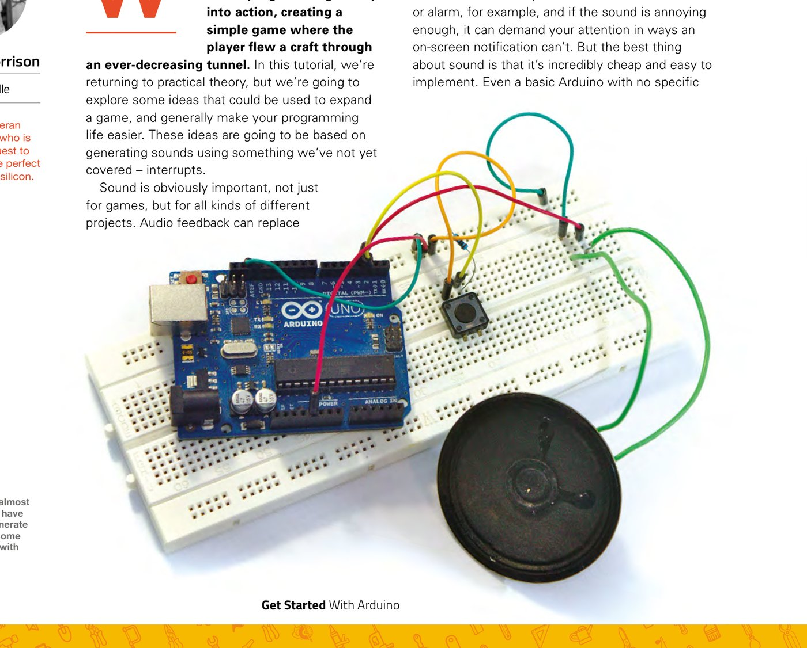
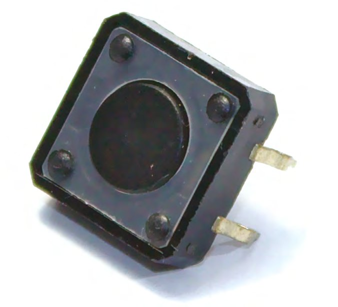
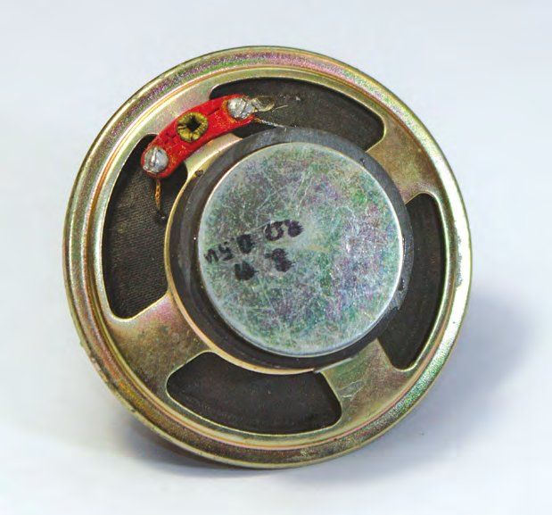
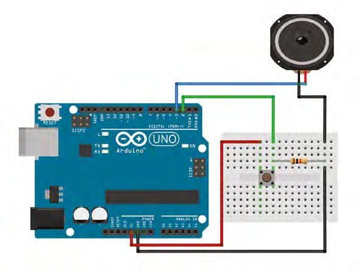
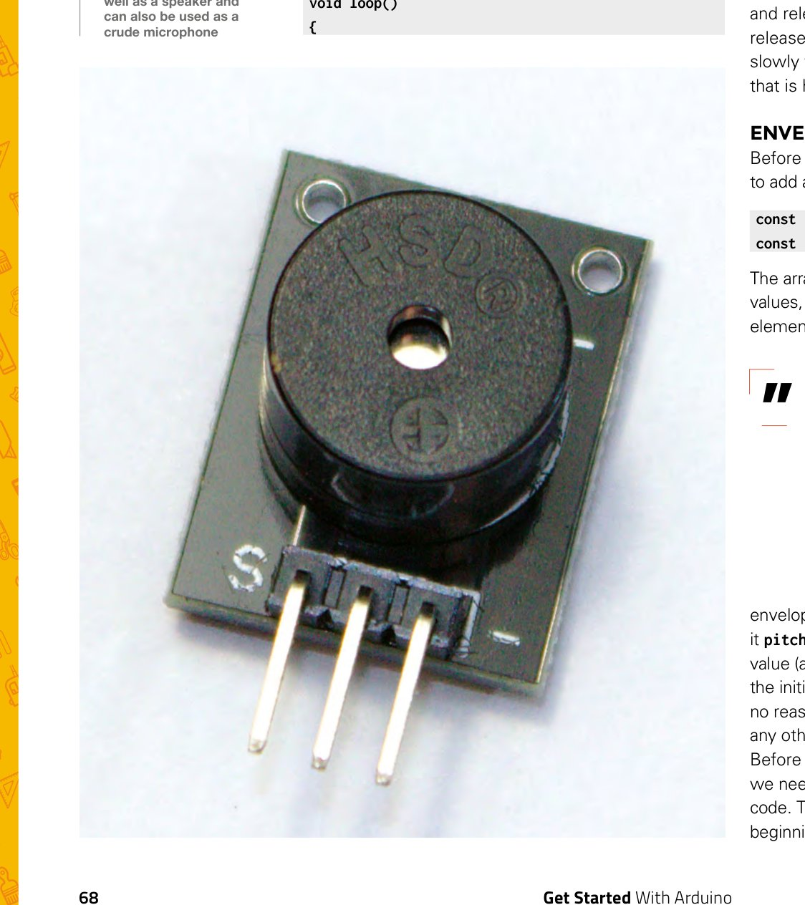

# Capitolul 11 – Programare Arduino: sunet, anvelope și întreruperi

> *Construiește un generator de sunet simplu, care îți permite să controlezi în timp înălțimea sau timbrul sunetului*

> **DESPRE AUTOR**
> **Graham Morrison** (@degville) este un jurnalist Linux veteran, aflat într-o căutare de-o viață a muzicii din aranjamentul perfect al siliciului.

Am petrecut ultimele două capitole punând în practică o parte din teoria noastră de programare, creând un joc simplu în care jucătorul pilota o navă printr-un tunel tot mai strâmt. În acest capitol ne întoarcem la teoria practică, dar vom explora câteva idei care ar putea fi folosite pentru a extinde un joc și, în general, pentru a-ți ușura viața de programator. Aceste idei se vor baza pe generarea de sunete folosind ceva ce nu am tratat încă: întreruperile.

Sunetul este, evident, important, nu doar pentru jocuri, ci pentru tot felul de proiecte. Feedbackul audio poate înlocui nevoia unui element vizual, cum ar fi un ecran, iar sunetul poate fi mai intuitiv și mai accesibil. Nu trebuie să explici interfața unei alerte sau a unei alarme sonore, de exemplu, iar dacă sunetul e destul de enervant, îți poate cere atenția în feluri în care o notificare pe ecran nu poate. Dar partea cea mai bună la sunet este că e incredibil de ieftin și de ușor de implementat. Chiar și un Arduino de bază, fără hardware audio dedicat, cum e Uno-ul pe care îl folosim în proiectele noastre, poate genera sunet, pentru că sunetul se produce mișcând bobina unui difuzor cu nimic mai mult decât fluctuații de curent.



*Poți folosi aproape orice ai prin preajmă ca să generezi sunet de la un declanșator de intrare, cu un Arduino*

Declanșatorul care pornește sunetul poate fi aproape orice. Un eveniment din joc, de exemplu. Dar pentru scopurile noastre, și ca proiectul să fie de sine stătător, vom folosi un la fel de simplu întrerupător sau buton de moment. Când butonul este apăsat, vom genera sunetul. Când este eliberat, îl vom opri. Două lucruri vor face proiectul diferit de ce te-ai aștepta. Primul este că vom folosi o întrerupere pentru a aștepta automat schimbarea stării butonului, iar al doilea este că vom modifica sunetul în timp ce este redat. Asta se numește „modulație” și este esențială dacă vrei ca sunetul tău să fie mai interesant decât un simplu bip.

## Întreruperile

Până acum am folosit funcția `loop()`, care rulează neîncetat, pentru a căuta schimbări în starea lucrurilor pe care voiam să le monitorizăm. Dacă se apăsa un buton sau se împingea un joystick, o variabilă se schimba și puteam presupune în siguranță că a avut loc un eveniment. Această abordare se numește de obicei „polling” (interogare), pentru că așteptăm și urmărim în permanență, căutând o valoare care se schimbă. Polling-ul este o soluție grozavă pe un Arduino, pentru că dispozitivul este mereu pornit, rulează mereu la viteză maximă și trece mereu prin `loop()`. Adăugarea unor verificări în plus nu ar trebui să crească povara totală de procesare. Iar dacă o face, programatorul o poate gestiona prioritizând cu grijă acele verificări sau reducând frecvența celor mai puțin importante.


*Difuzoarele sunt remarcabil de rezistente și pot suna bine chiar și într-o stare proastă*

Dar există cazuri serioase în care nu vrei să verifici continuu schimbările de stare, ci să aștepți să fii informat că ceva s-a schimbat. Asta face o întrerupere. O întrerupere îi permite programatorului să definească o funcție care să ruleze atunci când există o schimbare de stare, fără să o aștepte manual. Exact ca o bătaie pe umăr, o întrerupere este adesea declanșată mai repede decât codul echivalent de polling, iar timpul de răspuns la o întrerupere este mai previzibil. Timpii de răspuns la polling pot fi imprevizibili. Se poate să verifici schimbările de stare exact când ceva s-a schimbat, și răspunsul va fi rapid. Sau ceva s-a schimbat imediat după verificarea anterioară și nu va fi tratat decât după o durată mai lungă. Asta induce *jitter*, adică variații ale întârzierii dintre momentul în care se întâmplă ceva și momentul în care codul tău poate răspunde. Desigur, vorbim de diferențe de milisecunde, dar pot conta în situații critice ca timp, sau atunci când jitter-ul se observă ușor, cum e cazul luminilor stroboscopice sau al redării audio.

> *O întrerupere îi permite programatorului să definească o funcție care să ruleze atunci când există o schimbare de stare, fără să o aștepte manual*

> **SFAT RAPID**
> După cum îți poți imagina, un lucru pe care nu îl poți face în funcția declanșată de întrerupere este să aștepți. `delay()` nu va funcționa, pentru că funcția este executată în afara buclei principale, iar `millis()` nu va fi incrementat nici el.

Hai să începem scriind codul pentru întrerupere:

```cpp
const int interruptPin = 2;
const int piezoPin = 3;
unsigned long note_time;
bool trigger = false;
void setup() {
  attachInterrupt(digitalPinToInterrupt(interruptPin), triggerSound, CHANGE);
}
```

Tot ce facem în bucata de mai sus este să declarăm mai întâi o variabilă constantă globală care ține valoarea pinului conectat la butonul nostru, apoi să folosim această valoare în `setup()`. Creăm și o variabilă `unsigned long`, care ține până la 4 octeți de date fără numere negative, pe care o vom folosi pentru o amprentă de timp, și un `bool` care ține starea apăsat/eliberat a butonului. `attachInterrupt` este partea importantă, pentru că aceasta este magia Arduino care îi spune hardware-ului să lanseze automat o funcție, `triggerSound`, când primește un semnal corespunzător ultimului argument al apelului `attachInterrupt`. Noi am ales `CHANGE`, pentru că declanșează întreruperea atât la apăsarea, cât și la eliberarea butonului. Am fi putut folosi și `RISING`, ca să declanșăm întreruperea la apăsare, și `FALLING` la eliberare, dar putem trata ambele stări cu `CHANGE`, fără să consumăm și singura întrerupere rămasă, după cum vom arăta. Există și `LOW` (și `HIGH`, pe anumite plăci), care declanșează întreruperea când intrarea trece în acea stare.

> *„attachInterrupt” este partea importantă, pentru că aceasta este magia Arduino care îi spune hardware-ului să lanseze automat o funcție*



*Întrerupătoarele de moment rămân conectate doar cât timp utilizatorul ține apăsat butonul*

Funcția `triggerSound`, apelată de întrerupere, este de fapt foarte simplă:

```cpp
void triggerSound() {
  if (trigger = !trigger) {
    note_time = millis();
  }
}
```

Cum detectăm o schimbare a stării butonului, nu dacă este apăsat sau eliberat, folosim o variabilă booleană numită `trigger`, care comută între adevărat, când butonul este apăsat, și fals, când este eliberat. Nu e evident în codul de mai sus, și poate suntem vinovați de o obscuritate inutilă aici, dar linia `if (trigger = !trigger)` este în același timp atribuire și comparație. Nu este o comparație cu `==` sau `!=`, cum te-ai aștepta de obicei la un `if`, ci o atribuire. Îi atribuim lui `trigger` valoarea negată a lui `trigger`, pentru că semnul exclamării este operatorul de negare. Așa, „nu adevărat” = fals și „nu fals” = adevărat. Dacă `trigger` este adevărat după atribuire, instrucțiunea `if` va evalua expresia ca adevărată și `note_time = millis();` va fi executată. Această linie adaugă o altă comandă nouă, `millis()`, care atribuie numărul de milisecunde de când Arduino a fost pornit lui `note_time`, variabila `unsigned long` creată mai devreme.



*Difuzorul nostru e recuperat dintr-un PC vechi, dar se găsesc ușor, desfăcând aproape orice a scos vreodată un sunet*

> **HARDWARE**
> Partea grozavă a acestui proiect este că, probabil, ai deja tot ce îți trebuie. Poți folosi aproape orice difuzor vechi, de exemplu, deși cu cât difuzorul e mai bun, cu atât e mai bună calitatea sunetului; noi am luat unul dintr-un PC vechi. Ai putea folosi și un mic buzzer piezo, adesea găsit în kiturile de componente. Sunetul nu e la fel de bun, dar nici Arduino nu e tocmai capabil de calitate înaltă. Se leagă la pinul 3 al lui Arduino și la masă, dar dacă ți se pare că sună prea tare, pune un rezistor între conexiunea pozitivă și Arduino. Cu cât rezistența e mai mare, cu atât volumul e mai mic.
>
> La fel, am scotocit o cutie veche de componente după un întrerupător de moment. O parte a acestui întrerupător se leagă atât la pinul digital 2 al lui Arduino, cât și la un rezistor de 10 kΩ, legat la rândul lui la masă. Cealaltă parte a întrerupătorului se leagă la pinul sau șina de 5 V a lui Arduino. Și asta e tot circuitul.



*Toate componentele acestui proiect ar trebui să fie ușor de găsit*

## Redarea unui sunet

Redarea unui sunet pe un Arduino este remarcabil de ușoară, pe de o parte pentru că există o funcție încorporată, `tone()`, așa că nu trebuie să îți faci griji pentru înălțimea sunetului, iar pe de altă parte pentru că tot ce trebuie să facă Arduino este să trimită impulsuri de curent pe pinul conectat la difuzor. Se poate face cu o singură linie, pe care o punem în propria funcție:

```cpp
void playSound(int pitch) {
  tone (piezoPin, pitch);
}
```

Vom pune lângă funcția de mai sus o alta, care oprește sunetul:

```cpp
void stopSound(){
  noTone(piezoPin);
}
```

Tot ce mai trebuie să facem este să scriem simpla funcție `loop()`, care declanșează fie funcția `playSound`, fie funcția `stopSound`, în funcție de starea variabilei booleene `trigger`:

```cpp
void loop()
{
  if (trigger) {
    playSound(261);
  } else {
    stopSound();
  }
}
```

Dacă rulezi acum tot codul pe care tocmai l-am scris, ar trebui să constați că Arduino generează un ton cu înălțimea echivalentă unui do central de pe claviatura unui pian. Dar asta e doar o parte a proiectului, pentru că un ton simplu nu e cine știe ce palpitant. Ca să rezolvăm asta, vom schimba sunetul în timpul redării, folosind ceva numit „anvelopă” (*envelope*), pentru a modula înălțimea sunetului redat.



*Un buzzer piezo este o componentă la îndemână. Funcționează rezonabil ca difuzor și poate fi folosit și ca microfon rudimentar*

O anvelopă audio descrie cât de mult se schimbă un sunet în timp, din momentul în care este declanșat până când este eliberat. Anvelopele sunt folosite de obicei pentru a schimba amplitudinea și înălțimea unui sunet pe durata unei note, iar cel mai comun tip de anvelopă are patru etape: atac, cădere (*decay*), susținere (*sustain*) și eliberare (*release*), scris și ADSR. Atacul, căderea și eliberarea sunt durate de timp, care indică cât de repede sau de încet se schimbă sunetul, în timp ce susținerea este un nivel care este menținut cât timp nota este declanșată.

> *Anvelopele sunt folosite de obicei pentru a schimba amplitudinea și înălțimea unui sunet pe durata unei note*

## Generatorul de anvelopă

Înainte să ne creăm propria anvelopă, trebuie să adăugăm câteva variabile globale:

```cpp
const int pitchEnv[] = {500, 250, 200};
const int pitchMax = 255;
```

Tabloul va ține valorile pentru atac, cădere și susținere, primele două fiind durate, iar ultimul element o valoare de nivel. Cum vom folosi această anvelopă pentru a varia înălțimea sunetului nostru, am numit-o `pitchEnv`, împreună cu `pitchMax`, care ține valoarea maximă (amplitudinea) la care vrem să ajungă anvelopa la atacul inițial. În afară de nume, însă, nu există niciun motiv pentru care anvelopa să nu poată controla orice altă valoare legată de audio, pentru a modula sunetul.

Înainte să scriem codul generatorului de anvelopă în sine, trebuie să legăm efectul anvelopei în codul actual. E la fel de simplu ca adăugarea următoarei linii la începutul funcției `playSound`:

```cpp
pitch += envMod();
```

Operatorul de mai sus adună valoarea returnată de funcția `envMod()`, pe care o vom scrie imediat, la valoarea curentă a lui `pitch`.

```cpp
int envMod() {
  unsigned long current_dur = millis() - note_time;
  if (current_dur <= pitchEnv[0]) {  // Attack
    return ((pitchMax * (100 * current_dur) / pitchEnv[0]) / 100);
  } else if (current_dur <= (pitchEnv[0] + pitchEnv[1])) { //Decay
    return (pitchMax - (pitchMax - pitchEnv[2]) * (100 * (current_dur - pitchEnv[0]) / pitchEnv[1]) / 100);
  } else { // Sustain
    return (pitchEnv[2]);
  }
}
```

Codul de mai sus este complicat, așa că îl vom descompune în părți. Începe prin a lua o altă amprentă de timp, pentru momentul în care rulează funcția. Scăzând momentul de început al notei, pe care l-am salvat mai devreme, și folosind valorile de timp din tabloul anvelopei, putem calcula în ce etapă a anvelopei ar trebui să fim. Asta fac instrucțiunile `if` și `else`: prima verifică pur și simplu dacă timpul este mai mic decât durata etapei de atac, iar a doua dacă intervalul de timp este între atac și sfârșitul căderii. Dacă da, avem un calcul lung, care face următoarele:

1. Calculează intervalul de timp curent ca procent din întreaga etapă.
2. Returnează un procent din valoarea care se schimbă.

Înmulțim cu 100 și împărțim la 100 în expresii ca să păstrăm valorile finale ca numere întregi și să evităm matematica în virgulă mobilă, care este mult mai lentă și mai lacomă de resurse pe un Arduino. Cu etapa de atac încheiată, următorul `if` se ocupă de etapa de cădere. La final, dacă suntem în etapa de susținere, returnăm pur și simplu valoarea de susținere din tablou.

> **SFAT RAPID**
> Exact ca la scrierea în limba naturală, la scrierea codului ar trebui aleasă mereu abordarea simplă, chiar dacă știi că poate fi compactat. Așa le e mult mai ușor altor programatori, și ție însuți în viitor, să îl înțeleagă.

Cu această funcție scrisă, poți reîncărca proiectul pe Arduino. Când apeși butonul, înălțimea sunetului se va schimba acum conform duratelor și nivelului de susținere ale anvelopei, făcând sunetul mult mai dinamic și mai interesant. Ai putea chiar să construiești din asta un sintetizator, adăugând potențiometre pentru a controla valorile fiecărei etape a anvelopei, sau adăugând mai multe anvelope de modulație pentru a controla amplitudinea, sau chiar modulația în lățime de impuls. Dar asta e o altă poveste.

Codul acestui proiect poate fi descărcat de la [hsmag.cc/sEgZSN](https://hsmag.cc/sEgZSN).

> **ÎNTRERUPERILE HARDWARE**
> Întreruperile Arduino funcționează la nivel hardware și pot răspunde la schimbări detectate pe anumiți pini, cum ar fi semnalul crescător sau descrescător obținut apăsând un buton, dar pinii pe care îi poți folosi sunt limitați, iar diferitele plăci Arduino suportă un număr diferit de pini. Pe Uno-ul nostru (și pe alte plăci bazate pe 328), pinii 2 și 3 sunt singurii capabili să genereze întreruperi, iar noi ne-am oprit la pinul 2 pentru conexiunea butonului. Dar ca acest pin să genereze întreruperi e nevoie de un pas suplimentar, pe care nu l-am face în mod obișnuit: convertirea numărului pinului într-un „număr de întrerupere”. Asta pentru că majoritatea plăcilor Arduino suportă un număr restrâns de întreruperi, doar două pe Uno, iar numărul fiecărei întreruperi nu coincide neapărat cu pinul folosit pentru a genera intrarea. Dacă proiectul tău are nevoie de mai multe întreruperi, cel mai bine este să treci la un Arduino mai puternic.
>
> | Arduino | Pini cu întreruperi |
> |---|---|
> | Plăci bazate pe 328: Uno, Nano, Mini | 2, 3 |
> | Plăci bazate pe 32u4: Micro, Leonardo | 0, 1, 2, 3, 7 |
> | Due | toate intrările digitale |
> | Uno WiFi v2 | toate intrările digitale |
> | Zero | toate intrările digitale, cu excepția pinului 4 |
> | Mega, Mega2560, MegaADK | 2, 3, 18, 19, 20, 21 |
> | Plăcile MKR | 0, 1, 4, 5, 6, 7, 8, 9, A1, A2 |
