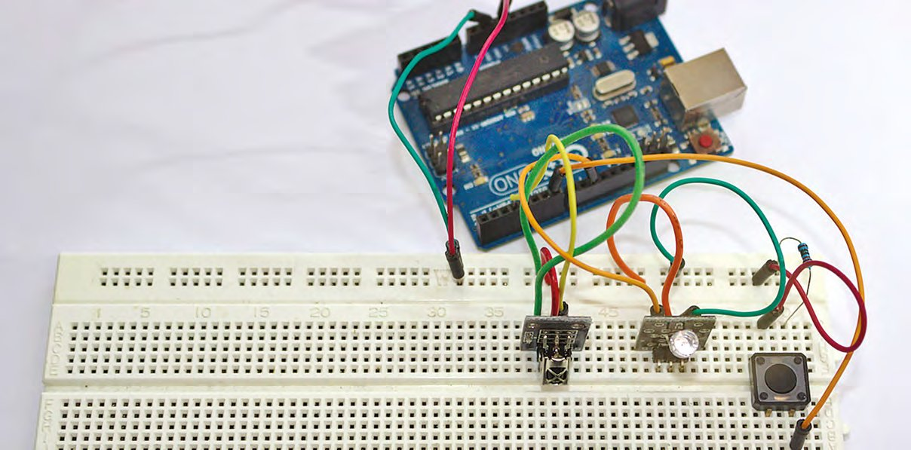
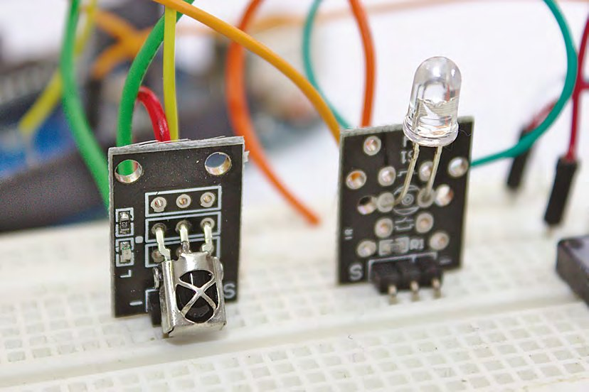
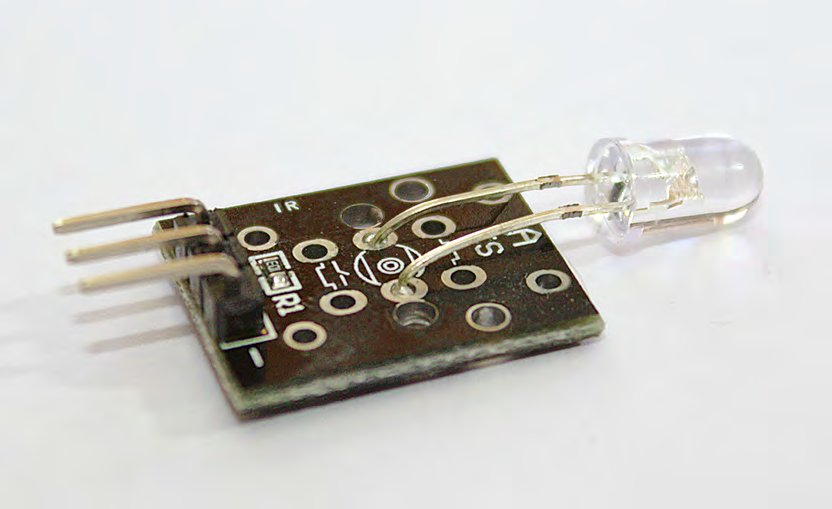
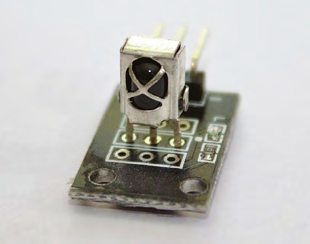
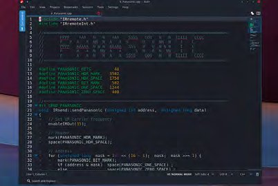
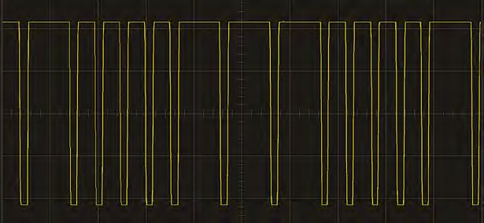
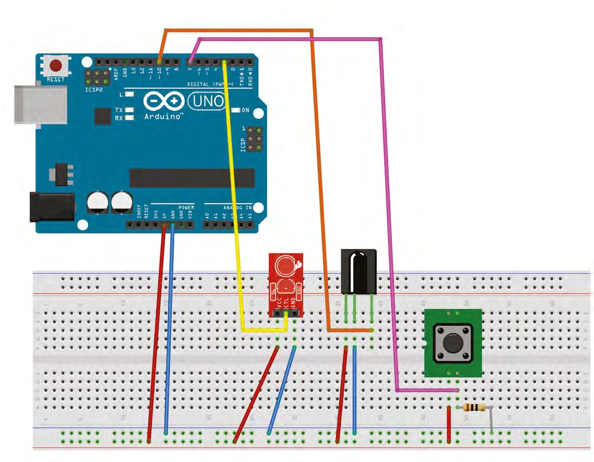
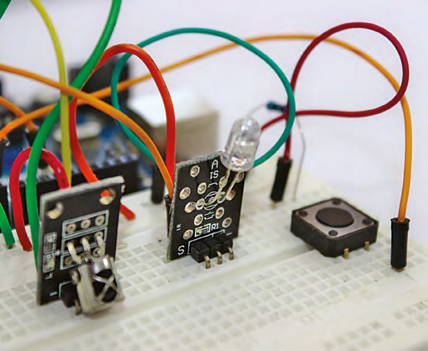

# Capitolul 12 – Programare Arduino: copiază și trimite semnale infraroșu

> *Construiește un repetor infraroșu secret, ca să închizi meciul de pe ecranul de 65 de inch din barul din cartier*

> **DESPRE AUTOR**
> **Graham Morrison** (@degville) este un jurnalist Linux veteran, aflat într-o căutare de-o viață a muzicii din aranjamentul perfect al siliciului.

> **VEI AVEA NEVOIE DE**
> - Arduino Uno
> - Un buton de moment
> - Un rezistor de 10 kΩ
> - O diodă receptoare de infraroșu (IR)
> - O fotodiodă emițătoare de infraroșu (IR)



*Deși e ușor să cablezi totul pe un breadboard, poate vrei să te gândești să pui proiectul într-o cutie mică, alimentată de la baterie*

Credeam că modesta telecomandă cu infraroșu va fi moartă până în 2019, anul în care se petrec Akira și The Running Man. Dar infraroșul rezistă și încă nu a fost înlocuit de Bluetooth, WiFi sau Facebook. Asta înseamnă că îndreptăm în continuare o bucată de plastic spre o fereastră invizibilă a televizorului ca să schimbăm canalul. Totuși, simplitatea, în acest caz, e un lucru bun, pentru că înseamnă că infraroșul este ușor de deturnat și de folosit în propriile tale proiecte diabolice, fie că e vorba de controlul echipamentelor pe care le ai deja, fie de crearea unui canal de comunicare în linie dreaptă între oricare dintre proiectele tale.

Deși invizibilă pentru ochiul uman, lumina infraroșie nu ar putea fi mai ușor de generat și de folosit. Se comportă exact ca lumina vizibilă și poate fi produsă cu circuite nu mai complexe decât cele cu un LED, deși infraroșul este emis de obicei de o fotodiodă, nu de o diodă emițătoare de lumină. Lumina infraroșie are lungimea de undă între 700 de nanometri și 1 micrometru, în timp ce ochiul uman este sensibil la lumina cu lungimi de undă între 380 și 750 de nanometri, capătul de sus al acestui interval fiind roșul (urmat de infraroșu). O lungime de undă mai mare înseamnă o frecvență mai mică, motiv pentru care infraroșul are o frecvență mai mică decât lumina vizibilă; de aici și termenul „infra”, care înseamnă „sub”.

Vom crea un înregistrator și retransmițător de infraroșu super-flexibil și generic, pe care îl poți folosi pentru a copia un semnal infraroșu și a-l retrimite, cu multe tipuri diferite de hardware generic. Îl poți folosi ca declanșator cu un singur buton pentru propriile comenzi infraroșu sau în inima unui server infraroșu centralizat, prin care să trimiți semnale către mai multe echipamente dintr-o sursă la distanță, cam ca gama de dispozitive Harmony de la Logitech. Are nevoie de doar câteva componente: emițătorul și receptorul, un buton de moment, un Arduino și un strop de programare, și vom atinge puțin atât pointerii, cât și tablourile bidimensionale.

## Hardware

Deși poți lua LED-uri infraroșu pe care să le legi în circuit ca pe orice LED, e mai ușor să folosești un modul gata împachetat, atât pentru elementul emițător, cât și pentru receptor. Aceste module sunt ieftine și scot o parte din complexitatea circuitului, mai ales când vine vorba de decodarea unui semnal. Asta pentru că mesajul binar (digital) pe care îl trimiți și îl primești prin lumină, sau chiar prin sunet, trebuie modulat într-un semnal cu sens pentru hardware-ul analogic. Asta face modulația. De aici își iau numele modemurile de modă veche: ele „mod”ulează și „dem”odulează semnalele între domeniul digital al calculatoarelor și rețeaua telefonică (pe atunci) analogică. Avem nevoie de cam aceeași funcție ca să trimitem semnale modulate în lumină infraroșie. Semnalul este modulat la trimitere și demodulat la primire, rezultatul final fiind un șir de cifre binare care apare la unul dintre pinii lui Arduino. Apoi trebuie să decodăm acei biți în ceva ce putem înțelege, fie copiindu-i și trimițând același semnal la cerere, fie căutându-le înțelesul într-o specificație cu codurile infraroșu cunoscute ale unui producător.



*Receptorul și emițătorul au nevoie doar de alimentare și masă, plus câte o singură conexiune de date la Arduino*

Atât receptorul, cât și emițătorul au trei pini; doi sunt conectați la alimentare și la masă, pe care le legăm la liniile unui breadboard, iar apoi conexiunile de date merg la pinii lui Arduino. Noi am legat receptorul la pinul 10 și emițătorul la pinul 3. Acesta din urmă este fix, pentru că vom folosi o bibliotecă, `IRremote.h`, ca să simplificăm trimiterea și primirea semnalelor. Biblioteca cere ca pinul emițătorului să fie capabil de modulație în lățime de impuls și este scrisă fix pentru pinul 3 în acest scop. Biblioteca se va ocupa de toată complexitatea modulației la trimiterea și primirea mesajelor infraroșu, precum și de decodarea lor pentru multe echipamente obișnuite.

Pe lângă emițător și receptor, am adăugat un simplu buton de moment, la fel ca cel folosit deja în multe proiecte. Îl vom folosi în două feluri. Mai întâi, ținându-l apăsat, vom porni procesul de „primire și înregistrare” pentru captarea unui mesaj infraroșu. Iar apoi, apăsându-l scurt, vom trimite mesajul stocat pe Arduino. Transpunerea în cod va fi o provocare interesantă, așa că hai să începem.

> *Pe lângă emițător și receptor, am adăugat un simplu buton de moment*



*Există mai multe tipuri de receptoare și emițătoare, dar toate sunt ieftine și, în mare parte, funcționează la fel ca ale noastre*

## Biblioteca de infraroșu

Într-un proiect Arduino nou creat în IDE, prima linie de cod pe care o adăugăm este antetul bibliotecii pe care o folosim. O adăugăm împreună cu întregii constanți care țin pinii de intrare folosiți pentru receptor și pentru buton (amintește-ți, emițătorul este fixat pe pinul 3 chiar în fișierele antet):

```cpp
#include <IRremote.h>
const int RECV_PIN = 10; // IR receiver input pin
const int BUTN_PIN = 7; // Button input pin
```

Nu uita că mai întâi trebuie să descarci și să instalezi orice antet extern pe care îl folosești în proiect. Se face ușor din Arduino IDE, alegând Sketch > Include Library > Manage Libraries din meniu și căutând „irremote”. Ai nevoie de pachetul construit de „shirriff”, care apare aproape de vârful rezultatelor căutării. Apasă pe Install în acest rezultat ca să îl instalezi.

> *Nu uita că mai întâi trebuie să descarci și să instalezi orice antet extern pe care îl folosești în proiect*

> **SFAT RAPID**
> Antetul IRremote se găsește la [hsmag.cc/QJRKmw](https://hsmag.cc/QJRKmw). Documentația e foarte săracă, dar există un cod exemplu excelent, dacă vrei să experimentezi.

> **NOTA TRADUCĂTORULUI**
> Biblioteca IRremote a evoluat mult după 2019 (versiunea 3 și 4 au schimbat numele unor funcții și constante, iar pinul emițătorului se poate alege). Codul din acest capitol este scris pentru versiunea 2.x; dacă instalezi versiunea nouă, consultă exemplele ei sau instalează din Library Manager o versiune 2.x, ca să funcționeze codul de aici neschimbat.

Adăugăm acum două seturi de variabile globale:

```cpp
bool buttonActive = false;
bool longPressActive = false;
int msglen = 0;
int khz = 38;
unsigned int receivedData[RAWBUF];
```

Primele valori booleene pornit/oprit vor ajuta la logica de detectare a apăsării scurte/lungi a butonului. Implementarea e mai complicată decât pare la prima vedere, pentru că butoanele simple de moment ca acesta suferă de jitter și de valori fals pozitive în tranziția de la pornit la oprit și de la oprit la pornit. Aceste valori devin adevărate pe măsură ce apăsarea butonului trece prin fiecare stare, așa că știm când o apăsare lungă este activă și putem rula codul potrivit.



*Modulele gata făcute pot fi ceva mai robuste decât simpla lipire a firelor pe componente*

Următoarele trei valori globale încep cu un întreg, `msglen`. Acesta va ține mărimea mesajului primit, ca să ne asigurăm că stocăm și trimitem un mesaj de aceeași lungime. Urmează un întreg pe care l-am numit misterios `khz`. Vom folosi `khz` când transmitem un cod infraroșu, pentru că ține frecvența de modulație a fluxului de date codificat. Valoarea implicită este 38 kHz, adică 38.000 de ori pe secundă, cea mai comună frecvență folosită de producătorii de echipamente. Evident, poate fi schimbată dacă e nevoie. Ultima variabilă, `receivedData`, este un tablou de întregi pentru conținutul mesajului. Mărimea acestui tablou este definită de o constantă numită `RAWBUF`, definită, neobișnuit, chiar în `IRremote.h`.

Vom folosi acum trei clase definite în IRremote:

```cpp
IRrecv irrecv(RECV_PIN);
IRsend irsend;
decode_results results; // decode_results class is defined in IRremote.h
```

Folosim o variabilă-clasă pentru comunicarea cu receptorul, una pentru comunicarea cu emițătorul și una pentru prelucrarea rezultatelor. Este un bun exemplu de folosire a unei clase pentru a ascunde, sau a abstractiza, funcționalitatea a ceea ce se întâmplă, cum ar fi modularea și demodularea unui mesaj. Antetul îi prezintă programatorului pur și simplu o interfață pentru controlul hardware-ului. Vom folosi `irrecv.enableIRIn();`, de exemplu, pentru a inițializa receptorul în `setup()`, alături de obișnuita configurare a pinilor, care este următoarea bucată de cod:

```cpp
void setup() {
  pinMode(LED_BUILTIN, OUTPUT);
  pinMode(BUTN_PIN, INPUT);
  irrecv.enableIRIn();
}
```

> **TELECOMANDĂ**
> Am folosit un mod brut simplu pentru înregistrarea și redarea semnalelor infraroșu, dar IRremote poate și să decodeze și să trimită semnale către hardware-ul anumitor producători, ceea ce este necesar când aceștia folosesc propriile protocoale sau o frecvență purtătoare nestandard. Poate face asta pentru că are o bibliotecă mare de protocoale ale producătorilor obișnuiți, inclusiv Sony, JVC, Panasonic și chiar Lego. Dacă te uiți în fișierul antet al fiecărui producător, primești și indicii despre cum să comunici cel mai bine cu echipamentul.
>
> Cu câte o funcție din fiecare bibliotecă, poți extrage codul comenzii din codul specific producătorului, folosit ca un container pentru comenzi. Asta înseamnă că, teoretic, poți controla elemente precum volumul sau numerele canalelor cu variabile, combinându-le cu codul despre care știi că controlează volumul atunci când le trimiți de pe Arduino. Ai putea chiar să înlănțui comenzi pentru mai multe echipamente, ca să configurezi, de exemplu, un sistem audio/video de acasă pentru un film sau pentru muzică, și apoi să controlezi redarea din ceva care poate vorbi cu Arduino.



*Folosirea unuia dintre profilurile specifice producătorilor din bibliotecă poate rezolva probleme de compatibilitate. Panasonic, de exemplu, folosește o frecvență purtătoare de 35 kHz*

## Logica programului

Cu codul de bază rezolvat, suntem gata să abordăm logica propriu-zisă a codului. Mai întâi vom trata logica detectării apăsărilor scurte și lungi ale butonului. Ideea principală este că, atât timp cât știm că butonul nu este deja apăsat, stocăm momentul în care este detectată prima apăsare, iar apoi îl putem folosi ca să ne dăm seama dacă a fost o apăsare lungă sau scurtă. Iată începutul codului care detectează când apăsarea lungă este activă (`longPressActive = true;`):

```cpp
void loop() {
  if (digitalRead(BUTN_PIN) == HIGH) {
    if (buttonActive == false) {
      buttonActive = true;
      buttonTimer = millis();
    }
    if ((millis() - buttonTimer > longPressTime) && (longPressActive == false)) {
      longPressActive = true;
    }
  } else {  // EXECUTED ON RELEASE
```

> **NOTA TRADUCĂTORULUI**
> Variabilele `buttonTimer` și `longPressTime` nu apar declarate în fragmentele din carte. Adaugă-le printre variabilele globale, de exemplu `unsigned long buttonTimer = 0;` și `const int longPressTime = 1000;` (durata, în milisecunde, de la care o apăsare este considerată „lungă”).

> **SFAT RAPID**
> Codificarea semnalelor prin variația lățimii unui impuls (modulația în lățime de impuls, PWM) este exact felul în care funcționează sinteza audio „PWM”, și tot așa funcționează și unele protocoale de comunicare audio.

Putem detecta o apăsare scurtă doar când butonul este eliberat, pentru că abia atunci știm durata apăsării. De aceea codul de eliberare vine după instrucțiunea `else` de mai sus, care indică faptul că evenimentul butonului nu îl setează pe `HIGH`. Apoi resetăm variabila `longPressActive`, dacă acest eveniment a fost deja detectat ca apăsare lungă. Iar dacă nu, după încă un `else`, ajungem în sfârșit să ne jucăm cu niște cod de infraroșu:

```cpp
    if (buttonActive == true) {
      if (longPressActive == true) {
        longPressActive = false;
      } else {
        if (msglen > 0) {
          irsend.sendRaw(receivedData, msglen, khz);
          delay(50);
          irrecv.enableIRIn();
        }
      }
      buttonActive = false;
    }
  }
```

> *Putem detecta o apăsare scurtă doar când butonul este eliberat, pentru că abia atunci știm durata*

Datorită `IRremote.h`, trimiterea unui semnal este super-simplă. Mai întâi verificăm dacă există un mesaj înregistrat (`msglen > 0`), apoi trimitem mesajul cu `irsend.sendRaw(receivedData, msglen, khz);`. Datele pe care le transmitem sunt în `receivedData`, dar poate ai observat ceva. Am creat această variabilă ca tablou, dar nu punem paranteze drepte și nu indicăm un anumit element. Asta se numește „transmitere prin referință”, spre deosebire de mai obișnuita „transmitere prin valoare”. Funcționează pentru că funcției `sendRaw` i se transmite doar o referință la tablou, iar această referință este de fapt adresa de memorie la care este stocat primul element al tabloului. Adresa relativă a fiecărui element poate fi apoi calculată printr-un decalaj egal cu spațiul necesar stocării unui element de tipul tabloului. Dacă sună exact ca ceea ce face un pointer, ai dreptate: neincluzând un identificator de element, folosim implicit numele variabilei-tablou ca pointer.

> **INFRAROȘU ȘI OSCILOSCOAPE**
> Poți folosi un osciloscop împreună cu un receptor infraroșu pentru a calcula frecvența semnalului de la o sursă infraroșie.
>
> Deși e invizibil pentru ochiul liber, există mai multe moduri de a vedea un semnal infraroșu (în afară de a te înrola în forțele speciale și a face rost de niște ochelari cu vedere nocturnă în infraroșu). Cel mai simplu este să folosești camera smartphone-ului. Dacă te uiți la previzualizarea în timp real în timp ce apeși butoanele telecomenzii, ar trebui să vezi sclipiri de la LED-ul infraroșu. Camera frontală este de obicei cea mai bună, pentru că are șanse mai mici să aibă filtru infraroșu, infraroșul fiind folosit adesea la detectarea mișcării și la recunoașterea facială. Dar dacă ai la îndemână un osciloscop, poți studia un semnal infraroșu mult mai în detaliu. În circuitul pe care l-am creat, pune pur și simplu una dintre sondele osciloscopului pe ieșirea receptorului, aceeași ieșire legată la pinul 10 al lui Arduino. Când trimiți acum câteva semnale infraroșu spre receptor, ar trebui să vezi osciloscopul prinzând viață. În particular, dacă setezi rezoluția de actualizare la circa 2 ms, ar trebui să vezi forme de undă dreptunghiulare, cu lățimi diferite. Aceste lățimi variabile sunt cheia felului în care valori diferite sunt „modulate” în semnalul transmis de LED-ul infraroșu. Observă, de exemplu, că lățimea perioadei „oprit” este mereu aceeași. Este pauza dintre transmisii și este constantă. Datele propriu-zise sunt purtate de lățimile variabile ale perioadei „pornit”: de aici, modulația în lățime de impuls. Lățimi diferite ascund valori diferite, decodate automat de orice receptor infraroșu.



*Semnalul infraroșu văzut pe osciloscop: impulsuri dreptunghiulare cu lățimi diferite*

Ultima bucată de cod este și cea mai funcțională, pentru că răspunde de primirea datelor și de decodarea lor în ceva ce putem folosi. Acest cod rulează în afara întregului cod anterior, pentru că așa se îmbunătățește timpul de răspuns al programului la primirea unui semnal infraroșu. Așa începe acest bloc de cod, urmat rapid de o verificare a variabilei booleene `longPressActive`. Dacă este adevărată, înseamnă că butonul este ținut apăsat și putem înregistra semnalul infraroșu primit. Dacă nu, putem ignora semnalul până data viitoare.

```cpp
  if (irrecv.decode(&results)) {
    if (longPressActive) {
      msglen = results.rawlen - 1;
      for (int i = 1; i <= msglen; i++) {
        if (i % 2) {
          receivedData[i - 1] = results.rawbuf[i] * USECPERTICK - MARK_EXCESS;
        }
        else {
          // Space
          receivedData[i - 1] = results.rawbuf[i] * USECPERTICK + MARK_EXCESS;
        }
      }
    }
    irrecv.resume(); // resume receiver
  }
} // End bracket for project
```

Codul de decodare în sine este luat din biblioteca IRremote și folosește `%2` pentru a afla dacă primim un element impar sau par al tabloului, folosind apoi asta ca să ajusteze intervalele dintre elementele primite, pentru a anula distorsiunile receptorului. Rezultatele sunt puse în tablou, iar mărimea mesajului este stocată în `msglen`; acesta este mesajul pe care îl putem trimite acum ori de câte ori apăsăm scurt butonul. Și asta e tot. Construiește-l și trimite-l la Arduino!



*Există o varietate de receptoare și emițătoare infraroșu, dar aproape toate au nevoie de doar trei conexiuni: 5 V la VCC, „-” la GND și „S”, linia de date, la Arduino*



*Totul montat și funcționând pe un breadboard, dar poate vrei să folosești o placă de protoboard, ca să fie mai permanent*
